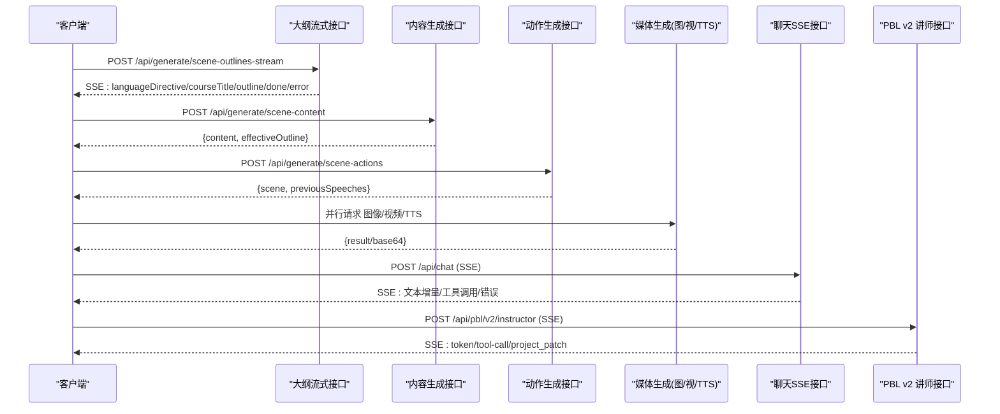

# API 接口参考

<cite>
**本文引用的文件**   
- [app/api/classroom/route.ts](file://app/api/classroom/route.ts)
- [app/api/chat/route.ts](file://app/api/chat/route.ts)
- [app/api/pbl/chat/route.ts](file://app/api/pbl/chat/route.ts)
- [app/api/health/route.ts](file://app/api/health/route.ts)
- [app/api/generate/image/route.ts](file://app/api/generate/image/route.ts)
- [app/api/generate/video/route.ts](file://app/api/generate/video/route.ts)
- [app/api/generate/tts/route.ts](file://app/api/generate/tts/route.ts)
- [app/api/generate/voice/route.ts](file://app/api/generate/voice/route.ts)
- [app/api/generate/scene-content/route.ts](file://app/api/generate/scene-content/route.ts)
- [app/api/generate/scene-actions/route.ts](file://app/api/generate/scene-actions/route.ts)
- [app/api/generate/scene-outlines-stream/route.ts](file://app/api/generate/scene-outlines-stream/route.ts)
- [app/api/pbl/v2/instructor/route.ts](file://app/api/pbl/v2/instructor/route.ts)
- [app/api/export-video/render/route.ts](file://app/api/export-video/render/route.ts)
- [app/api/classroom-media/[classroomId]/[...path]/route.ts](file://app/api/classroom-media/[classroomId]/[...path]/route.ts)
</cite>

## 目录
- 产品概述
- 核心业务流程
- 功能模块清单
- 数据与状态
- 关键约束与边界

## 产品概述
OpenMAIC 是 AI 驱动的交互式课件（MAIC）生成与课堂管理平台，提供从自然语言到结构化课件的自动生成、课堂实时互动（问答/讨论/测验）、以及课件编辑与回放能力。后端基于 Next.js 16 + React 19 + Zustand 状态管理；AI 编排层使用 LangGraph + Vercel AI SDK；课件格式为自定义 DSL。API 以 RESTful 为主，部分长耗时或流式场景采用 SSE（Server-Sent Events）。

## 核心业务流程
- 大纲生成（SSE）：客户端提交需求，服务端流式返回课程标题、语言指令与分镜大纲，前端增量渲染。
- 内容生成（两步流水线）：先根据大纲生成内容（文本/交互/PBL），再根据内容与上下文生成动作（演讲/工具调用等），最终拼装完整场景。
- 媒体生成：图像、视频、TTS 并行生成，支持多提供商与托管模式，统一鉴权与用量统计。
- 聊天对话（SSE）：无状态会话，客户端携带消息与 storeState，服务端流式返回事件（文本增量、工具调用、错误）。
- PBL 学习：v1 简单 @mention 路由；v2 Instructor 流式推进项目阶段，客户端应用补丁更新本地项目副本。
- 课堂管理：创建/读取课堂资源，媒体文件安全访问。
- 导出渲染：上传 ZIP 至渲染服务异步处理，返回任务 ID 供轮询。

图表来源
- [app/api/generate/scene-outlines-stream/route.ts:285-652](file://app/api/generate/scene-outlines-stream/route.ts#L285-L652)
- [app/api/generate/scene-content/route.ts:34-206](file://app/api/generate/scene-content/route.ts#L34-L206)
- [app/api/generate/scene-actions/route.ts:35-185](file://app/api/generate/scene-actions/route.ts#L35-L185)
- [app/api/generate/image/route.ts:44-116](file://app/api/generate/image/route.ts#L44-L116)
- [app/api/generate/video/route.ts:36-110](file://app/api/generate/video/route.ts#L36-L110)
- [app/api/generate/tts/route.ts:30-149](file://app/api/generate/tts/route.ts#L30-L149)
- [app/api/chat/route.ts:44-208](file://app/api/chat/route.ts#L44-L208)
- [app/api/pbl/v2/instructor/route.ts:38-77](file://app/api/pbl/v2/instructor/route.ts#L38-L77)

章节来源
- [app/api/generate/scene-outlines-stream/route.ts:285-652](file://app/api/generate/scene-outlines-stream/route.ts#L285-L652)
- [app/api/generate/scene-content/route.ts:34-206](file://app/api/generate/scene-content/route.ts#L34-L206)
- [app/api/generate/scene-actions/route.ts:35-185](file://app/api/generate/scene-actions/route.ts#L35-L185)
- [app/api/chat/route.ts:44-208](file://app/api/chat/route.ts#L44-L208)
- [app/api/pbl/v2/instructor/route.ts:38-77](file://app/api/pbl/v2/instructor/route.ts#L38-L77)

## 功能模块清单
- 健康检查
  - GET /api/health：返回版本与能力开关（搜索/图像/视频/TTS）。
  - 用途：服务可用性探测与能力发现。
- 课堂管理
  - POST /api/classroom：创建课堂，返回 id 与 url。
  - GET /api/classroom?id=...：按 id 获取课堂数据。
  - GET /api/classroom-media/:classroomId/:path：安全读取媒体文件（仅 media/audio 子目录，防路径穿越）。
- 聊天对话（SSE）
  - POST /api/chat：无状态聊天，SSE 流式返回事件。
- PBL 学习
  - POST /api/pbl/chat：v1 简单 @mention 路由，返回文本响应。
  - POST /api/pbl/v2/instructor：v2 讲师回合，SSE 流式返回 token/tool-call/project_patch。
- 生成相关
  - POST /api/generate/scene-outlines-stream：SSE 流式生成大纲（含语言指令、课程标题、逐条大纲、完成/错误）。
  - POST /api/generate/scene-content：根据大纲生成内容（幻灯片/测验/交互/PBL）。
  - POST /api/generate/scene-actions：根据内容与上下文生成动作并拼装完整场景。
  - POST /api/generate/image：图像生成（支持多提供商、托管模式、SSRF 校验）。
  - POST /api/generate/video：视频生成（异步任务模式，maxDuration 较长）。
  - POST /api/generate/tts：单段 TTS，返回 base64 音频。
  - POST /api/generate/voice：自动注册音色（幂等，支持引用音频或描述合成）。
- 导出渲染
  - POST /api/export-video/render：上传 ZIP 到渲染服务，返回 jobId 与轮询间隔。

章节来源
- [app/api/health/route.ts:11-23](file://app/api/health/route.ts#L11-L23)
- [app/api/classroom/route.ts:14-86](file://app/api/classroom/route.ts#L14-L86)
- [app/api/classroom-media/[classroomId]/[...path]/route.ts:23-96](file://app/api/classroom-media/[classroomId]/[...path]/route.ts#L23-L96)
- [app/api/chat/route.ts:44-208](file://app/api/chat/route.ts#L44-L208)
- [app/api/pbl/chat/route.ts:25-84](file://app/api/pbl/chat/route.ts#L25-L84)
- [app/api/pbl/v2/instructor/route.ts:38-77](file://app/api/pbl/v2/instructor/route.ts#L38-L77)
- [app/api/generate/scene-outlines-stream/route.ts:285-652](file://app/api/generate/scene-outlines-stream/route.ts#L285-L652)
- [app/api/generate/scene-content/route.ts:34-206](file://app/api/generate/scene-content/route.ts#L34-L206)
- [app/api/generate/scene-actions/route.ts:35-185](file://app/api/generate/scene-actions/route.ts#L35-L185)
- [app/api/generate/image/route.ts:44-116](file://app/api/generate/image/route.ts#L44-L116)
- [app/api/generate/video/route.ts:36-110](file://app/api/generate/video/route.ts#L36-L110)
- [app/api/generate/tts/route.ts:30-149](file://app/api/generate/tts/route.ts#L30-L149)
- [app/api/generate/voice/route.ts:38-154](file://app/api/generate/voice/route.ts#L38-L154)
- [app/api/export-video/render/route.ts:46-114](file://app/api/export-video/render/route.ts#L46-L114)

## 数据与状态
- 通用响应结构
  - 成功：{ success: true, result?: any }
  - 失败：{ success: false, error: string }，HTTP 状态码随错误类型变化（如 400/401/403/413/429/500/502）。
- 聊天事件（SSE）
  - 事件类型：文本增量、工具调用、错误等，具体由服务端生成器产出。
- 大纲流式事件（SSE）
  - languageDirective：语言指令
  - courseTitle：课程标题
  - outline：单条大纲对象（含 index）
  - done：全部大纲完成（包含 outlines、languageDirective、courseTitle、taskEngineMode）
  - retry：重试提示（attempt/maxAttempts）
  - error：错误信息
- 课堂数据
  - POST /api/classroom 返回 { id, url }
  - GET /api/classroom 返回 { classroom }
- 媒体生成结果
  - 图像：{ result }（URL/二进制等由提供商决定）
  - 视频：{ result }（包含尺寸、时长等）
  - TTS：{ audioId, base64, format }
  - 音色注册：{ voiceId, registered, referenceAudioBase64?, mimeType? }
- 导出渲染
  - 提交后返回 { jobId, pollIntervalMs }，后续通过 jobId 轮询（由渲染服务定义）。

章节来源
- [app/api/chat/route.ts:44-208](file://app/api/chat/route.ts#L44-L208)
- [app/api/generate/scene-outlines-stream/route.ts:285-652](file://app/api/generate/scene-outlines-stream/route.ts#L285-L652)
- [app/api/classroom/route.ts:14-86](file://app/api/classroom/route.ts#L14-L86)
- [app/api/generate/image/route.ts:44-116](file://app/api/generate/image/route.ts#L44-L116)
- [app/api/generate/video/route.ts:36-110](file://app/api/generate/video/route.ts#L36-L110)
- [app/api/generate/tts/route.ts:30-149](file://app/api/generate/tts/route.ts#L30-L149)
- [app/api/generate/voice/route.ts:38-154](file://app/api/generate/voice/route.ts#L38-L154)
- [app/api/export-video/render/route.ts:46-114](file://app/api/export-video/render/route.ts#L46-L114)

## 关键约束与边界
- 认证与鉴权
  - 多数生成接口支持 x-api-key/x-base-url 等头覆盖（非托管提供商）；托管提供商忽略客户端密钥/基址。
  - 需要 API Key 的提供商未配置时返回 401。
  - 某些接口强制禁用特定提供商（服务器策略优先）。
- 安全限制
  - SSRF 防护：对客户端提供的 baseUrl 进行白名单/合法性校验，非法则返回 403。
  - 路径穿越防护：课堂媒体访问仅允许 media/audio 子目录，严格校验真实路径。
  - 上传大小限制：导出渲染接口限制最大上传字节数，超限返回 413。
- 速率限制
  - TTS 提供商限流将返回 429。
  - 导出渲染上游限流会透传 429。
- 超时与流控
  - SSE 心跳：聊天与大纲流式接口定期发送心跳防止连接空闲断开。
  - maxDuration：不同接口设置不同上限（如 30s/60s/300s），用于平台级请求超时控制。
  - 流缓冲保护：大纲流式有最大缓冲区限制，避免内存膨胀。
- 版本与兼容性
  - 健康接口返回版本号，便于客户端适配。
  - PBL v1 与 v2 并存，建议迁移至 v2 以获得更丰富的流式能力。
- 错误处理策略
  - 统一错误码（如 MISSING_REQUIRED_FIELD、INVALID_REQUEST、CONTENT_SENSITIVE、RATE_LIMITED、PROVIDER_DISABLED、UPSTREAM_ERROR 等）。
  - 内容安全拦截（敏感内容）返回 400 并附带原因。
  - 上游不可用返回 502，客户端应降级或重试。

章节来源
- [app/api/generate/image/route.ts:44-116](file://app/api/generate/image/route.ts#L44-L116)
- [app/api/generate/video/route.ts:36-110](file://app/api/generate/video/route.ts#L36-L110)
- [app/api/generate/tts/route.ts:30-149](file://app/api/generate/tts/route.ts#L30-L149)
- [app/api/generate/voice/route.ts:38-154](file://app/api/generate/voice/route.ts#L38-L154)
- [app/api/classroom-media/[classroomId]/[...path]/route.ts:23-L96](file://app/api/classroom-media/[classroomId]/[...path]/route.ts#L23-L96)
- [app/api/export-video/render/route.ts:46-114](file://app/api/export-video/render/route.ts#L46-L114)
- [app/api/health/route.ts:11-23](file://app/api/health/route.ts#L11-L23)
- [app/api/chat/route.ts:44-208](file://app/api/chat/route.ts#L44-L208)
- [app/api/generate/scene-outlines-stream/route.ts:285-652](file://app/api/generate/scene-outlines-stream/route.ts#L285-L652)