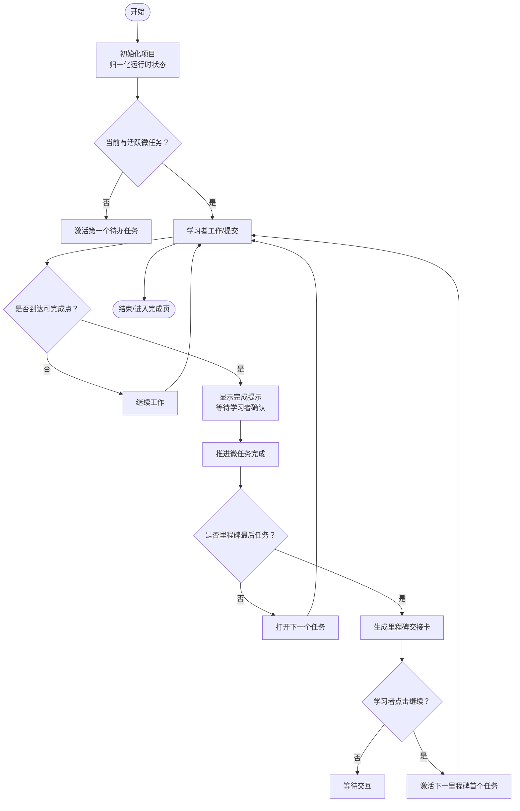
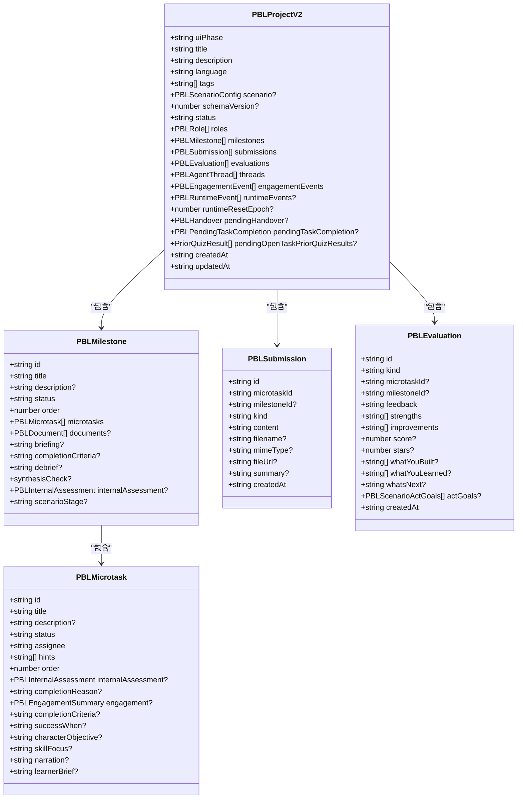
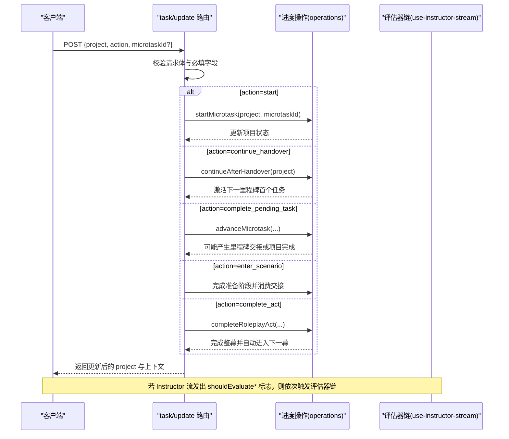
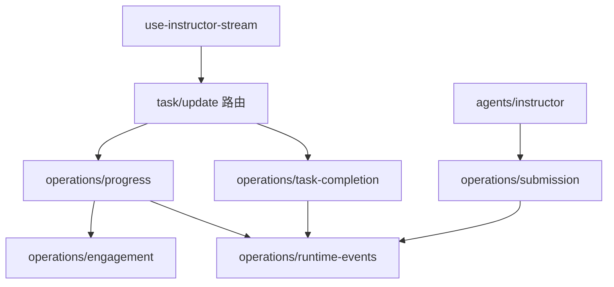

# PBL V2 核心 API

<cite>
**本文引用的文件**   
- [app/api/pbl/v2/task/update/route.ts](file://app/api/pbl/v2/task/update/route.ts)
- [lib/pbl/v2/types.ts](file://lib/pbl/v2/types.ts)
- [lib/pbl/v2/operations/progress.ts](file://lib/pbl/v2/operations/progress.ts)
- [lib/pbl/v2/operations/task-completion.ts](file://lib/pbl/v2/operations/task-completion.ts)
- [lib/pbl/v2/operations/submission.ts](file://lib/pbl/v2/operations/submission.ts)
- [lib/pbl/v2/agents/instructor.ts](file://lib/pbl/v2/agents/instructor.ts)
- [components/scene-renderers/pbl/v2/use-instructor-stream.ts](file://components/scene-renderers/pbl/v2/use-instructor-stream.ts)
</cite>

## 产品概述
PBL V2 是 OpenMAIC 的项目制学习（Project-Based Learning）V2 版本的核心 API，围绕“单导师引导”的学习流（Hero → Workspace → Completion）提供任务生命周期管理、状态转换、进度跟踪与评估能力。其目标用户为学习者、教师与平台集成方，核心价值在于：
- 以里程碑（Milestone）和微任务（Microtask）结构化组织学习路径
- 通过明确的阶段门控（如跨里程碑交接、任务完成确认）保障学习节奏
- 提供可审计的运行时事件与参与度指标，支撑智能评估与报告生成
- 支持情景角色扮演（Scenario）扩展，统一在 v2 数据模型下运行

适用场景包括：课堂项目式学习、交互式课件中的实践环节、在线课程的阶段性考核与反馈闭环。

## 核心业务流程
- 任务启动与推进：学习者点击侧边栏微任务或系统自动激活，进入进行中；完成后由导师或流程驱动推进到下一任务或里程碑
- 里程碑交接：当某里程碑最后一个微任务完成时，系统生成“继续到下一阶段”的门卡，学习者确认后解锁并激活下一个里程碑的第一个任务
- 任务完成确认：达到“可完成点”后，系统提示“完成”，学习者点击“完成”按钮触发最终推进
- 情景模式特殊流程：准备阶段直接进入场景；角色扮演的整幕可在满足参与条件后一键完成并自动进入下一幕
- 评估与报告：任务级、里程碑级与最终评估按顺序执行，最终评估用于生成完成报告

**章节来源**
- [lib/pbl/v2/operations/progress.ts:75-159](file://lib/pbl/v2/operations/progress.ts#L75-L159)
- [lib/pbl/v2/operations/progress.ts:463-636](file://lib/pbl/v2/operations/progress.ts#L463-L636)
- [lib/pbl/v2/operations/progress.ts:760-800](file://lib/pbl/v2/operations/progress.ts#L760-L800)
- [lib/pbl/v2/operations/task-completion.ts:116-152](file://lib/pbl/v2/operations/task-completion.ts#L116-L152)

## 功能模块清单
- 任务更新接口（POST /api/pbl/v2/task/update）
  - 作用：无 LLM 参与的纯状态变更端点，处理 start、continue_handover、complete_pending_task、enter_scenario、complete_act 等动作
  - 输入：project（PBLProjectV2）、action、microtaskId（部分动作需要）
  - 输出：返回更新后的 project 及必要上下文（如 nextMicrotaskId、milestoneCompleted 等）
- 进度与状态操作（operations/progress）
  - 归一化运行时状态、查找当前里程碑/微任务、启动任务、推进任务、完成角色扮演整幕、消费交接
- 任务完成门控（operations/task-completion）
  - 设置/清除“待完成”门、生成多语言完成提示、记录证据事件
- 提交物管理（operations/submission）
  - 新增提交、列出/获取最新提交、为评估器生成摘要文本
- 导师逻辑（agents/instructor）
  - 构建任务评估上下文、判断评估状态、拼接提交上下文
- 前端流式编排（use-instructor-stream）
  - 封装 SSE 解析、应用 project_patch、串联评估器链（任务→里程碑→最终）

**章节来源**
- [app/api/pbl/v2/task/update/route.ts:1-163](file://app/api/pbl/v2/task/update/route.ts#L1-L163)
- [lib/pbl/v2/operations/progress.ts:1-187](file://lib/pbl/v2/operations/progress.ts#L1-L187)
- [lib/pbl/v2/operations/task-completion.ts:1-187](file://lib/pbl/v2/operations/task-completion.ts#L1-L187)
- [lib/pbl/v2/operations/submission.ts:1-161](file://lib/pbl/v2/operations/submission.ts#L1-L161)
- [lib/pbl/v2/agents/instructor.ts:172-231](file://lib/pbl/v2/agents/instructor.ts#L172-L231)
- [components/scene-renderers/pbl/v2/use-instructor-stream.ts:1-31](file://components/scene-renderers/pbl/v2/use-instructor-stream.ts#L1-L31)

## 数据与状态
- 核心数据模型（PBLProjectV2）
  - 元数据：title、description、learningObjective、gains、language/languageDirective、tags、schemaVersion
  - 结构：roles（至少一个 Instructor）、milestones（含 microtasks）、submissions、evaluations、threads
  - 运行时：engagementEvents（参与度事件环形缓冲）、runtimeEvents（运行时事实事件）、pendingHandover（里程碑交接）、pendingTaskCompletion（任务完成门）、updatedAt/createdAt
  - 情景模式：scenario（setting、rules、learnerRole、characters、sceneVisual）
- 关键状态类型
  - 项目状态：designing | review | active | completed | archived
  - 里程碑状态：locked | active | completed
  - 微任务状态：todo | in_progress | completed | skipped
  - UI 阶段：hero | generating | workspace | completed
- 事件与审计
  - 参与度事件：microtask_opened、learner_turn、observation_*、closing_check、stage_synthesis_check、microtask_completed/skipped、proficiency_changed
  - 运行时事件：message_created、tool_call_*、submission_created、evaluation_created、status_changed、project_reset、handover_staged/consumed、task_completion_staged/cleared、proficiency_updated
- 评估与提交
  - 提交物：kind（text/file/link）、content、filename/mimeType、fileUrl、summary、createdAt
  - 评估：kind（task/milestone/final）、score/stars/feedback/strengths/improvements、final-only 字段（whatYouBuilt/whatYouLearned/whatsNext/actGoals）

**图表来源**
- [lib/pbl/v2/types.ts:767-888](file://lib/pbl/v2/types.ts#L767-L888)
- [lib/pbl/v2/types.ts:197-243](file://lib/pbl/v2/types.ts#L197-L243)
- [lib/pbl/v2/types.ts:129-180](file://lib/pbl/v2/types.ts#L129-L180)
- [lib/pbl/v2/types.ts:320-339](file://lib/pbl/v2/types.ts#L320-L339)
- [lib/pbl/v2/types.ts:371-399](file://lib/pbl/v2/types.ts#L371-L399)

**章节来源**
- [lib/pbl/v2/types.ts:22-70](file://lib/pbl/v2/types.ts#L22-L70)
- [lib/pbl/v2/types.ts:405-441](file://lib/pbl/v2/types.ts#L405-L441)
- [lib/pbl/v2/types.ts:468-535](file://lib/pbl/v2/types.ts#L468-L535)
- [lib/pbl/v2/types.ts:767-888](file://lib/pbl/v2/types.ts#L767-L888)

## 关键约束与边界
- 状态机与门控
  - 里程碑 LOCKED→ACTIVE 必须由学习者点击“继续”消费交接卡触发
  - 微任务完成需经过“可完成点”提示与学习者确认（除非情景模式整幕完成）
  - 情景模式中，准备阶段可直接进入场景；角色扮演整幕需满足“本幕已参与”的服务器校验
- 评估阈值与推进
  - 任务级评估通过阈值为 60 分；低于阈值不自动推进
  - 导师在构建评估上下文时会检查“最新提交 vs 最新评估时间戳”，避免未评估即推进
- 数据完整性与回退
  - 运行时归一化确保 Instructor 线程存在、活动里程碑与当前任务一致
  - 情景骨架修复保证角色与 stage 标记一致性，异常降级为普通项目
- 事件与审计
  - 所有状态变更均写入 runtimeEvents 与 engagementEvents，便于回放与评估
- 错误处理策略
  - 接口层对非法请求体、缺失必填字段、未知 action 返回标准错误响应
  - 操作函数返回 ok/error 结构，调用方据此决定 UI 提示与重试

**图表来源**
- [app/api/pbl/v2/task/update/route.ts:48-161](file://app/api/pbl/v2/task/update/route.ts#L48-L161)
- [lib/pbl/v2/operations/progress.ts:423-458](file://lib/pbl/v2/operations/progress.ts#L423-L458)
- [lib/pbl/v2/operations/progress.ts:760-800](file://lib/pbl/v2/operations/progress.ts#L760-L800)
- [lib/pbl/v2/operations/progress.ts:652-758](file://lib/pbl/v2/operations/progress.ts#L652-L758)
- [components/scene-renderers/pbl/v2/use-instructor-stream.ts:1-31](file://components/scene-renderers/pbl/v2/use-instructor-stream.ts#L1-L31)

**章节来源**
- [lib/pbl/v2/operations/task-completion.ts:15-21](file://lib/pbl/v2/operations/task-completion.ts#L15-L21)
- [lib/pbl/v2/agents/instructor.ts:172-231](file://lib/pbl/v2/agents/instructor.ts#L172-L231)
- [lib/pbl/v2/operations/progress.ts:75-159](file://lib/pbl/v2/operations/progress.ts#L75-L159)
- [lib/pbl/v2/operations/progress.ts:328-417](file://lib/pbl/v2/operations/progress.ts#L328-L417)

## 详细组件分析

### 任务更新接口（POST /api/pbl/v2/task/update）
- 职责：接收前端发送的 PBLProjectV2 与动作，进行纯状态变更并返回更新后的项目对象
- 支持的 action
  - start：将指定微任务置为进行中，必要时激活父里程碑
  - continue_handover：消费交接卡，激活下一里程碑首个任务
  - complete_pending_task：确认任务完成，推进至下一任务/里程碑/项目完成
  - enter_scenario：情景准备阶段直接转入场景阶段
  - complete_act：情景角色扮演整幕一次性完成并自动进入下一幕
- 错误处理
  - 请求体非 JSON、缺少 project、缺少 microtaskId（start 时）、非情景项目、无活跃任务/交接等，均返回 400 错误码与明确消息

**章节来源**
- [app/api/pbl/v2/task/update/route.ts:1-163](file://app/api/pbl/v2/task/update/route.ts#L1-L163)

### 进度与状态操作（operations/progress）
- 关键函数
  - normalizeProjectRuntime：确保 Instructor 线程、活动里程碑与当前任务存在，修复情景骨架
  - currentMilestone/currentMicrotask：定位当前活跃里程碑与任务
  - startMicrotask：启动任务，必要时激活父里程碑
  - advanceMicrotask：完成任务，推进到下一任务/里程碑/项目完成，生成交接或完成事件
  - completeRoleplayAct：情景整幕完成，要求本幕已有参与者消息
  - continueAfterHandover：消费交接卡，激活下一里程碑首个任务
- 复杂度与性能
  - 均为 O(n) 线性扫描（n 为里程碑/任务数量），适合典型规模；长会话中 engagement 事件采用环形缓冲控制大小

**章节来源**
- [lib/pbl/v2/operations/progress.ts:75-159](file://lib/pbl/v2/operations/progress.ts#L75-L159)
- [lib/pbl/v2/operations/progress.ts:423-458](file://lib/pbl/v2/operations/progress.ts#L423-L458)
- [lib/pbl/v2/operations/progress.ts:463-636](file://lib/pbl/v2/operations/progress.ts#L463-L636)
- [lib/pbl/v2/operations/progress.ts:652-758](file://lib/pbl/v2/operations/progress.ts#L652-L758)
- [lib/pbl/v2/operations/progress.ts:760-800](file://lib/pbl/v2/operations/progress.ts#L760-L800)

### 任务完成门控（operations/task-completion）
- 关键函数
  - setPendingTaskCompletion：设置“待完成”门，附带原因与证据
  - clearPendingTaskCompletion：清除门，记录运行时事件
  - appendTaskCompletionReadyMessage：追加多语言完成提示消息
  - taskEvaluationCanComplete：基于评分阈值判定是否可通过
- 业务规则
  - 只有达到“可完成点”才允许推进；提示消息去重且按语言本地化

**章节来源**
- [lib/pbl/v2/operations/task-completion.ts:48-79](file://lib/pbl/v2/operations/task-completion.ts#L48-L79)
- [lib/pbl/v2/operations/task-completion.ts:116-152](file://lib/pbl/v2/operations/task-completion.ts#L116-L152)
- [lib/pbl/v2/operations/task-completion.ts:15-21](file://lib/pbl/v2/operations/task-completion.ts#L15-L21)

### 提交物管理（operations/submission）
- 关键函数
  - addSubmission：新增提交物，记录运行时事件
  - listSubmissionsForMicrotask/latestSubmissionForMicrotask：查询与取最新
  - summarizeLatestSubmissionForMicrotask/summarizeSubmissionsForMicrotask：为评估器生成截断摘要
- 设计要点
  - 支持文本/文件/链接三种类型；图片提交时内容可为空，评估器会读取附件
  - 摘要长度限制防止超出评估器 token 预算

**章节来源**
- [lib/pbl/v2/operations/submission.ts:23-60](file://lib/pbl/v2/operations/submission.ts#L23-L60)
- [lib/pbl/v2/operations/submission.ts:62-76](file://lib/pbl/v2/operations/submission.ts#L62-L76)
- [lib/pbl/v2/operations/submission.ts:85-110](file://lib/pbl/v2/operations/submission.ts#L85-L110)
- [lib/pbl/v2/operations/submission.ts:129-160](file://lib/pbl/v2/operations/submission.ts#L129-L160)

### 导师逻辑（agents/instructor）
- 关键职责
  - 构建任务评估上下文，比较最新提交与评估时间戳，避免未评估即推进
  - 根据评分阈值与改进建议决定是否推进
- 集成点
  - 与 submission 摘要、评估结果共同构成评估器输入

**章节来源**
- [lib/pbl/v2/agents/instructor.ts:172-231](file://lib/pbl/v2/agents/instructor.ts#L172-L231)

### 前端流式编排（use-instructor-stream）
- 职责
  - 封装 SSE 解析与应用 project_patch，维护工作副本并在结束时发布
  - 串联评估器链：任务→里程碑→最终，依据 Instructor 流发出的 shouldEvaluate* 标志触发
- 容错
  - 错误时仍推送已应用的补丁，避免状态丢失

**章节来源**
- [components/scene-renderers/pbl/v2/use-instructor-stream.ts:1-31](file://components/scene-renderers/pbl/v2/use-instructor-stream.ts#L1-L31)

## 依赖分析
- 模块耦合
  - route.ts 依赖 operations/progress 与 task-completion，负责动作分发与错误处理
  - progress.ts 依赖 engagement/runtime-events 记录事件与状态变更
  - task-completion.ts 依赖 runtime-events 与 engagement
  - submission.ts 依赖 runtime-events 记录提交事件
  - instructor.ts 依赖 submission 摘要与评估结果构建上下文
  - use-instructor-stream.ts 依赖 SSE 协议与 patch 应用逻辑
- 外部依赖
  - Next.js 路由与请求处理
  - 评估器链（SSE 流）与 LLM 服务（通过上层编排）

**图表来源**
- [app/api/pbl/v2/task/update/route.ts:1-163](file://app/api/pbl/v2/task/update/route.ts#L1-L163)
- [lib/pbl/v2/operations/progress.ts:1-187](file://lib/pbl/v2/operations/progress.ts#L1-L187)
- [lib/pbl/v2/operations/task-completion.ts:1-187](file://lib/pbl/v2/operations/task-completion.ts#L1-L187)
- [lib/pbl/v2/operations/submission.ts:1-161](file://lib/pbl/v2/operations/submission.ts#L1-L161)
- [lib/pbl/v2/agents/instructor.ts:172-231](file://lib/pbl/v2/agents/instructor.ts#L172-L231)
- [components/scene-renderers/pbl/v2/use-instructor-stream.ts:1-31](file://components/scene-renderers/pbl/v2/use-instructor-stream.ts#L1-L31)

**章节来源**
- [lib/pbl/v2/operations/progress.ts:27-36](file://lib/pbl/v2/operations/progress.ts#L27-L36)
- [lib/pbl/v2/operations/task-completion.ts:10-11](file://lib/pbl/v2/operations/task-completion.ts#L10-L11)
- [lib/pbl/v2/operations/submission.ts:14-15](file://lib/pbl/v2/operations/submission.ts#L14-L15)

## 性能考虑
- 事件缓冲：engagementEvents 使用环形缓冲限制长度，避免长会话膨胀
- 摘要截断：提交物摘要与合并摘要限制字符数，控制评估器 token 预算
- 线性扫描：里程碑/任务查找为 O(n)，在典型规模下性能可接受；如需优化可对里程碑索引或缓存加速

[本节为通用指导，不直接分析具体文件]

## 故障排查指南
- 常见错误
  - 请求体无效或缺失必填字段：检查 JSON 结构与 project/action/microtaskId
  - 非情景项目却调用 enter_scenario/complete_act：确认 project.scenario 是否存在
  - 无活跃任务或交接卡：确认 normalizeProjectRuntime 与 continueAfterHandover 调用时机
  - 评估未通过：检查任务级评估分数是否≥60，以及最新提交与评估时间戳关系
- 调试建议
  - 查看 runtimeEvents 与 engagementEvents 以确定状态变更轨迹
  - 使用 isTaskCompletionReadyMessageContent 验证完成提示是否被识别
  - 在 Instructor 流中观察 shouldEvaluate* 标志与评估器链执行情况

**章节来源**
- [app/api/pbl/v2/task/update/route.ts:48-161](file://app/api/pbl/v2/task/update/route.ts#L48-L161)
- [lib/pbl/v2/operations/task-completion.ts:105-107](file://lib/pbl/v2/operations/task-completion.ts#L105-L107)
- [lib/pbl/v2/agents/instructor.ts:172-231](file://lib/pbl/v2/agents/instructor.ts#L172-L231)

## 结论
PBL V2 核心 API 以清晰的状态机与严格的门控机制，提供了稳健的任务生命周期管理与进度跟踪能力。结合丰富的运行时事件与评估链路，既保证了学习体验的可控性，也为智能评估与报告生成提供了充分的数据基础。集成方应遵循状态流转规则与错误处理约定，确保前后端一致性与用户体验的一致性。