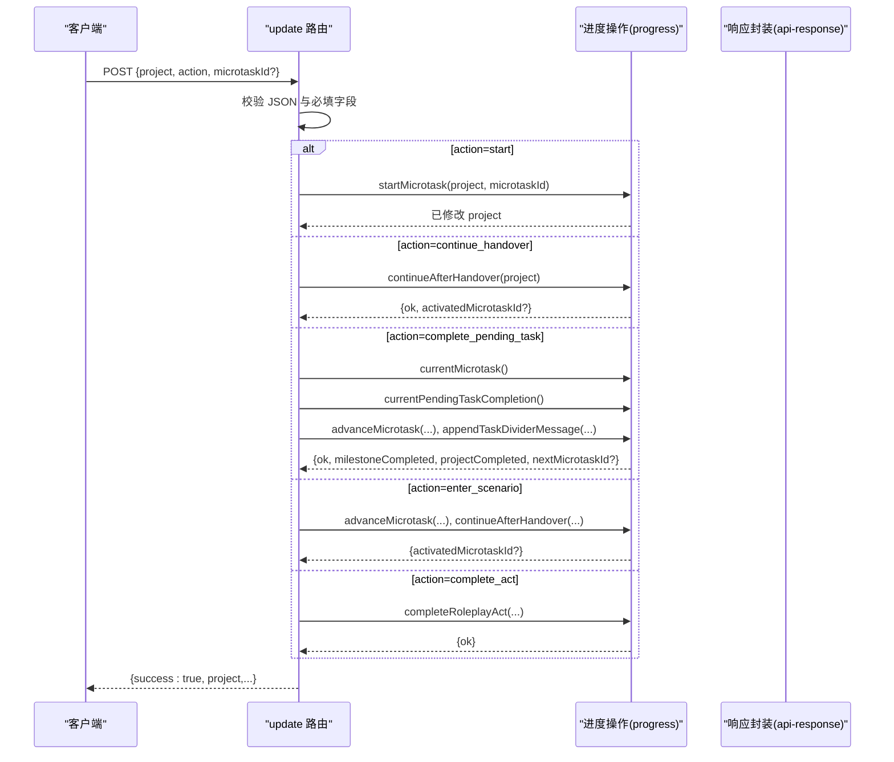
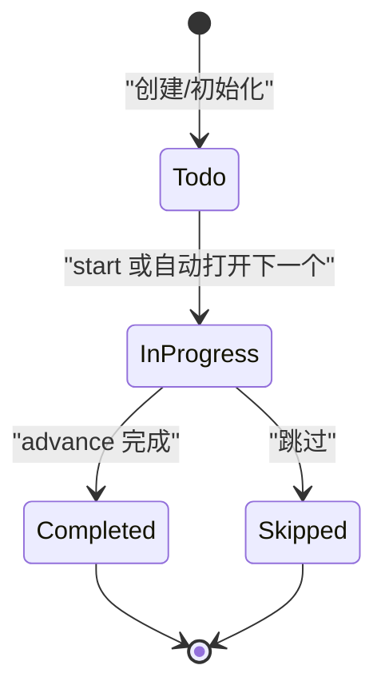
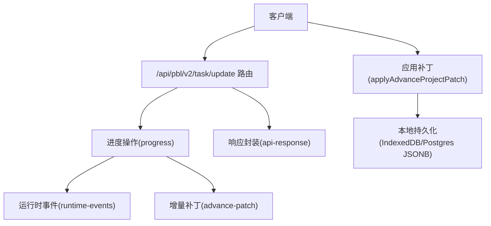
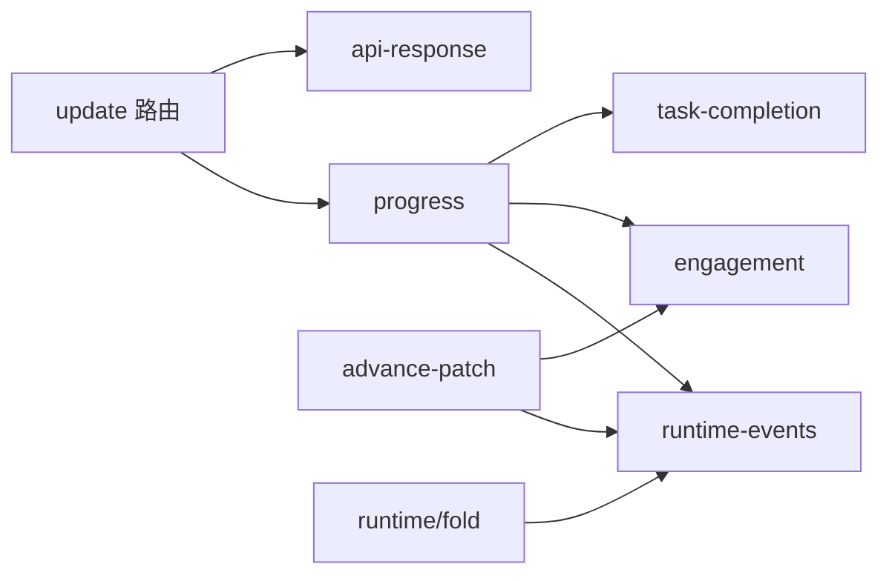

# PBL 任务更新 API

<cite>
**本文引用的文件**   
- [app/api/pbl/v2/task/update/route.ts](file://app/api/pbl/v2/task/update/route.ts)
- [lib/server/api-response.ts](file://lib/server/api-response.ts)
- [lib/pbl/v2/operations/progress.ts](file://lib/pbl/v2/operations/progress.ts)
- [lib/pbl/v2/operations/advance-patch.ts](file://lib/pbl/v2/operations/advance-patch.ts)
- [lib/pbl/v2/operations/task-completion.ts](file://lib/pbl/v2/operations/task-completion.ts)
- [lib/pbl/v2/runtime/fold.ts](file://lib/pbl/v2/runtime/fold.ts)
- [tests/pbl/v2/advance-patch.test.ts](file://tests/pbl/v2/advance-patch.test.ts)
</cite>

## 产品概述
本文件面向“PBL 任务更新 API”的增量更新能力，聚焦于学习任务在客户端与服务器之间的状态同步、版本控制、冲突解决与回滚机制。该接口为纯状态变更端点（无 LLM 参与），用于工作区 UI 对 PBLProjectV2 进行确定性推进：启动微任务、继续交接、完成待办任务、进入场景阶段、完成角色扮演等。通过“增量补丁 + 运行时事件”的传输协议，保证多端一致性与可审计性。

## 核心业务流程
- 请求入口：POST /api/pbl/v2/task/update
- 输入：完整的 PBLProjectV2 快照 + action 动作 + 可选 microtaskId
- 处理：根据 action 调用对应的纯函数执行状态变更（如 startMicrotask、continueAfterHandover、advanceMicrotask、completeRoleplayAct）
- 输出：返回变更后的 project 及必要上下文（如 nextMicrotaskId、milestoneCompleted、projectCompleted）
- 客户端应用：将返回的 project 持久化到本地存储；若使用 SSE/流式通道，则应用 advance 补丁并合并运行时事件

**图表来源** 
- [app/api/pbl/v2/task/update/route.ts:48-162](file://app/api/pbl/v2/task/update/route.ts#L48-L162)
- [lib/pbl/v2/operations/progress.ts:463-611](file://lib/pbl/v2/operations/progress.ts#L463-L611)

**章节来源**
- [app/api/pbl/v2/task/update/route.ts:1-163](file://app/api/pbl/v2/task/update/route.ts#L1-L163)
- [lib/server/api-response.ts:1-51](file://lib/server/api-response.ts#L1-L51)

## 功能模块清单
- 路由层（update 路由）
  - 职责：解析请求、参数校验、分发 action、调用业务操作、统一成功/失败响应
  - 验收要点：非法 JSON、缺失字段、未知 action、非场景项目等错误码正确返回
- 进度操作（progress）
  - 职责：微任务/里程碑状态推进、交接 staging、运行时事件记录、任务分隔消息追加
  - 验收要点：状态机约束（不可逆）、跨里程碑交接 staging、事件幂等
- 增量补丁（advance-patch）
  - 职责：构建/应用 advance 补丁，携带 completed/next 快照、engagementEvents、runtimeEvents 片段，确保客户端一致性
  - 验收要点：去重、幂等、运行时事件 ID 归一、场景模式抑制里程碑评估卡片
- 任务完成暂存（task-completion）
  - 职责：设置/清除 pendingTaskCompletion，记录证据与运行时事件
  - 验收要点：证据保留、清理事件、时间戳稳定
- 运行时折叠（fold）
  - 职责：回放/折叠运行时事件，维护 pendingTaskCompletion、proficiencyAssessment 等状态
  - 验收要点：缺失附件时报告 gap，不抛异常

**章节来源**
- [lib/pbl/v2/operations/progress.ts:1-611](file://lib/pbl/v2/operations/progress.ts#L1-L611)
- [lib/pbl/v2/operations/advance-patch.ts:1-240](file://lib/pbl/v2/operations/advance-patch.ts#L1-L240)
- [lib/pbl/v2/operations/task-completion.ts:48-79](file://lib/pbl/v2/operations/task-completion.ts#L48-L79)
- [lib/pbl/v2/runtime/fold.ts:262-305](file://lib/pbl/v2/runtime/fold.ts#L262-L305)

## 数据与状态
- 核心模型
  - PBLProjectV2：包含 uiPhase、title、description、proficiency、language、tags、status、roles、milestones、submissions、evaluations、threads、engagementEvents、createdAt、updatedAt，以及可选 scenario、pendingHandover、pendingTaskCompletion、runtimeEvents 等
  - PBLMilestone/PBLMicrotask：里程碑与微任务的状态机（todo/in_progress/completed/skipped/locked/active）
  - PBLHandover：里程碑交接载荷（completed/next 信息，consumed 标记）
  - PBLRuntimeEvent：运行时事件（status_changed、handover_staged、message_created、task_completion_staged/cleared 等）
- 关键状态流转
  - 微任务推进：todo → in_progress → completed；或 todo → skipped
  - 里程碑推进：当某里程碑所有微任务均为 completed/skipped 且至少一个 completed 时，里程碑置为 completed
  - 项目推进：最后一个里程碑完成后，项目置为 completed
  - 交接 staging：里程碑完成后生成 pendingHandover，等待用户点击“继续”消费
  - 任务完成暂存：服务端/客户端可先设置 pendingTaskCompletion，再由用户确认推进
- 数据所有权边界
  - 服务端是权威源，客户端通过 applyAdvanceProjectPatch 合并 server-carried runtimeEvents 与补丁，避免重复与乱序
  - engagementEvents 按指纹去重，防止重复累积

**图表来源** 
- [lib/pbl/v2/operations/progress.ts:463-611](file://lib/pbl/v2/operations/progress.ts#L463-L611)

**章节来源**
- [tests/pbl/v2/advance-patch.test.ts:1-451](file://tests/pbl/v2/advance-patch.test.ts#L1-L451)
- [lib/pbl/v2/runtime/fold.ts:262-305](file://lib/pbl/v2/runtime/fold.ts#L262-L305)

## 关键约束与边界
- 更新策略
  - 全量更新：客户端发送完整 PBLProjectV2 快照，服务端仅做状态推进并返回新快照
  - 增量更新：通过 advance 补丁（completed/next 快照、engagementEvents、runtimeEvents 片段）进行高效同步
  - 差异合并：客户端应用补丁时，基于 ID 与指纹去重，优先采用 server-carried runtimeEvents
- 数据一致性保证
  - 运行时事件带确定 ID，支持幂等合并与去重
  - 状态变更均写入 status_changed 事件，便于审计与回放
  - 场景模式抑制里程碑评估卡片，避免冗余交互
- 冲突解决
  - 以服务端权威为准；客户端通过 patch.runtimeEvents 去重与顺序修复
  - 对于 malformed 历史，fold 流程报告 gaps 而非崩溃
- 回滚机制
  - 当前实现为单向推进（不可逆），不支持直接回滚
  - 如需回滚，应通过“重置操作”（如 resetMicrotask/resetMilestone）恢复至先前状态（由其他操作提供）
- 性能与容量
  - engagementEvents 有上限裁剪，避免无限增长
  - runtimeEvents 存在容量限制，超出后仍会携带新增事件

**章节来源**
- [lib/pbl/v2/operations/advance-patch.ts:1-240](file://lib/pbl/v2/operations/advance-patch.ts#L1-L240)
- [lib/pbl/v2/runtime/fold.ts:262-305](file://lib/pbl/v2/runtime/fold.ts#L262-L305)
- [lib/pbl/v2/operations/progress.ts:1-611](file://lib/pbl/v2/operations/progress.ts#L1-L611)

## 接口规范与示例

### 请求格式
- 路径：POST /api/pbl/v2/task/update
- Body
  - project: PBLProjectV2（必需）
  - action: 枚举值
    - start：启动指定微任务
    - continue_handover：消费交接，激活下一里程碑首个任务
    - enter_scenario：进入场景（仅限 scenario 项目）
    - complete_act：完成角色扮演整幕（仅限 scenario 项目）
    - complete_pending_task：确认并完成待办任务
  - microtaskId: string（action=start 时必需）

### 响应格式
- 成功：{ success: true, project, ...附加字段 }
- 失败：{ success: false, errorCode, error, details? }

### 错误码与语义
- INVALID_REQUEST：动作不合法、状态不满足前置条件、非场景项目误用场景动作等
- MISSING_REQUIRED_FIELD：缺少必填字段（如 microtaskId）
- 其他通用错误码参考 api-response 定义

**章节来源**
- [app/api/pbl/v2/task/update/route.ts:37-162](file://app/api/pbl/v2/task/update/route.ts#L37-L162)
- [lib/server/api-response.ts:1-51](file://lib/server/api-response.ts#L1-L51)

### 增量补丁（SSE/流式）
- buildAdvanceProjectPatch：从服务端已推进的 project 构建补丁，包含：
  - kind='advance'
  - microtaskId、nextMicrotaskId
  - milestoneCompleted、projectCompleted
  - shouldEvaluateTask、shouldEvaluateMilestone、shouldEvaluateFinal
  - completedMicrotask、nextMicrotask、milestone 快照
  - engagementEvents（裁剪与去重）
  - runtimeEvents（仅携带新增片段）
- applyAdvanceProjectPatch：客户端应用补丁，确保：
  - 运行时事件幂等插入
  - 状态变更写入 status_changed 事件
  - engagementEvents 去重与上限裁剪
  - 项目级状态更新（status=completed）

**章节来源**
- [lib/pbl/v2/operations/advance-patch.ts:1-240](file://lib/pbl/v2/operations/advance-patch.ts#L1-L240)

### 变更检测算法与同步协议
- 变更检测
  - 服务端推进时记录 status_changed 事件，附带 from/to、实体类型与 ID
  - 运行时事件具备唯一 ID，客户端通过 ID 集合去重
- 同步协议
  - 全量：每次提交完整 project 快照
  - 增量：通过 advance 补丁携带最小必要变更与事件片段
  - 回放：fold 流程将事件序列折叠为稳定状态，缺失附件时报告 gaps

**章节来源**
- [lib/pbl/v2/operations/progress.ts:463-611](file://lib/pbl/v2/operations/progress.ts#L463-L611)
- [lib/pbl/v2/runtime/fold.ts:262-305](file://lib/pbl/v2/runtime/fold.ts#L262-L305)

### 批量更新、条件更新与冲突处理示例
- 批量更新
  - 通过多次调用 update 路由，或在一次会话中累积多个 action，最终提交最新 project 快照
  - 注意：服务端不聚合事务，需客户端自行保证顺序与幂等
- 条件更新
  - 使用 microtaskId 限定目标微任务
  - 使用 action 限定行为（如 enter_scenario 仅在 scenario 项目有效）
- 冲突处理
  - 客户端应用补丁时，依据 runtimeEvents 的 id 去重
  - engagementEvents 使用指纹去重，避免重复累积
  - fold 流程对 malformed 历史报告 gaps，不中断

**章节来源**
- [tests/pbl/v2/advance-patch.test.ts:170-211](file://tests/pbl/v2/advance-patch.test.ts#L170-L211)
- [lib/pbl/v2/operations/advance-patch.ts:214-240](file://lib/pbl/v2/operations/advance-patch.ts#L214-L240)

### 更新日志与审计追踪
- 运行时事件
  - status_changed：记录实体状态变化（microtask/milestone/project）
  - handover_staged：里程碑交接 staging
  - task_completion_staged/cleared：任务完成暂存与清理
  - message_created：消息创建
- 审计要点
  - 所有状态变更均有对应事件，支持回放与诊断
  - 事件具备 ts、actorType、entityId、microtaskId、milestoneId 等上下文

**章节来源**
- [lib/pbl/v2/operations/progress.ts:463-611](file://lib/pbl/v2/operations/progress.ts#L463-L611)
- [lib/pbl/v2/runtime/fold.ts:262-305](file://lib/pbl/v2/runtime/fold.ts#L262-L305)

## 架构总览

**图表来源** 
- [app/api/pbl/v2/task/update/route.ts:48-162](file://app/api/pbl/v2/task/update/route.ts#L48-L162)
- [lib/pbl/v2/operations/progress.ts:463-611](file://lib/pbl/v2/operations/progress.ts#L463-L611)
- [lib/pbl/v2/operations/advance-patch.ts:1-240](file://lib/pbl/v2/operations/advance-patch.ts#L1-L240)

## 详细组件分析

### 路由层（update 路由）
- 职责：解析请求体、校验 action 与必填字段、调用对应操作、返回统一响应
- 关键点：
  - start：需要 microtaskId
  - continue_handover：检查是否存在 pendingHandover
  - complete_pending_task：校验当前微任务与 pendingTaskCompletion，推进并追加分隔消息
  - enter_scenario/complete_act：仅限 scenario 项目，严格门控

**章节来源**
- [app/api/pbl/v2/task/update/route.ts:37-162](file://app/api/pbl/v2/task/update/route.ts#L37-L162)

### 进度操作（progress）
- 职责：推进微任务、完成里程碑、生成交接 staging、追加运行时事件
- 关键点：
  - advanceMicrotask：状态机推进、next 任务打开、里程碑完成判定、handover staging
  - 事件记录：status_changed、handover_staged、engagement 事件
  - 场景模式：抑制里程碑评估卡片，最终评估仍触发

**章节来源**
- [lib/pbl/v2/operations/progress.ts:463-611](file://lib/pbl/v2/operations/progress.ts#L463-L611)

### 增量补丁（advance-patch）
- 职责：构建/应用 advance 补丁，确保客户端与服务端一致
- 关键点：
  - buildAdvanceProjectPatch：携带快照、engagementEvents、runtimeEvents 片段
  - applyAdvanceProjectPatch：幂等插入事件、状态变更写入、去重与上限裁剪
  - 场景模式：shouldEvaluateMilestone=false，shouldEvaluateFinal=true

**章节来源**
- [lib/pbl/v2/operations/advance-patch.ts:1-240](file://lib/pbl/v2/operations/advance-patch.ts#L1-L240)

### 任务完成暂存（task-completion）
- 职责：设置 pendingTaskCompletion、记录证据、清理暂存
- 关键点：
  - setPendingTaskCompletion：创建暂存并记录事件
  - clearPendingTaskCompletion：清理并记录 cleared 事件

**章节来源**
- [lib/pbl/v2/operations/task-completion.ts:48-79](file://lib/pbl/v2/operations/task-completion.ts#L48-L79)
- [lib/pbl/v2/operations/task-completion.ts:154-186](file://lib/pbl/v2/operations/task-completion.ts#L154-L186)

### 运行时折叠（fold）
- 职责：回放事件序列，维护 pendingTaskCompletion、proficiencyAssessment 等
- 关键点：
  - 缺失附件时报告 gaps，不抛异常
  - 保持事件顺序与一致性

**章节来源**
- [lib/pbl/v2/runtime/fold.ts:262-305](file://lib/pbl/v2/runtime/fold.ts#L262-L305)

## 依赖分析
- 路由层依赖：
  - progress（状态推进）
  - api-response（统一响应）
- 进度操作依赖：
  - runtime-events（事件记录）
  - engagement（参与度事件）
  - task-completion（任务完成暂存）
- 增量补丁依赖：
  - runtime-events（事件 ID 归一）
  - engagement（事件裁剪）
- 运行时折叠依赖：
  - 事件序列与附件结构

**图表来源** 
- [app/api/pbl/v2/task/update/route.ts:24-36](file://app/api/pbl/v2/task/update/route.ts#L24-L36)
- [lib/pbl/v2/operations/progress.ts:27-36](file://lib/pbl/v2/operations/progress.ts#L27-L36)
- [lib/pbl/v2/operations/advance-patch.ts:12-18](file://lib/pbl/v2/operations/advance-patch.ts#L12-L18)

**章节来源**
- [app/api/pbl/v2/task/update/route.ts:24-36](file://app/api/pbl/v2/task/update/route.ts#L24-L36)
- [lib/pbl/v2/operations/progress.ts:27-36](file://lib/pbl/v2/operations/progress.ts#L27-L36)
- [lib/pbl/v2/operations/advance-patch.ts:12-18](file://lib/pbl/v2/operations/advance-patch.ts#L12-L18)

## 性能考虑
- 增量补丁减少网络传输与客户端计算开销
- engagementEvents 与 runtimeEvents 存在上限裁剪，避免内存膨胀
- 幂等合并与去重降低重复处理成本

[本节为通用指导，无需特定文件引用]

## 故障排查指南
- 常见错误
  - INVALID_REQUEST：检查 action 与前置状态（如非场景项目使用 enter_scenario）
  - MISSING_REQUIRED_FIELD：补充 microtaskId（start）
  - 状态不一致：核对 runtimeEvents 与补丁是否被正确应用
- 调试建议
  - 查看 status_changed 事件定位状态变更
  - 检查 pendingHandover 与 pendingTaskCompletion 是否存在
  - 使用 fold 诊断 gaps 与缺失附件

**章节来源**
- [app/api/pbl/v2/task/update/route.ts:55-162](file://app/api/pbl/v2/task/update/route.ts#L55-L162)
- [lib/pbl/v2/runtime/fold.ts:262-305](file://lib/pbl/v2/runtime/fold.ts#L262-L305)

## 结论
PBL 任务更新 API 通过“全量快照 + 增量补丁 + 运行时事件”的组合，实现了高一致性、可审计、可扩展的任务推进机制。结合严格的动作门控与状态机约束，确保在多端环境下的一致体验与可靠回放。未来可在不破坏现有契约的前提下扩展更多动作与评估维度。