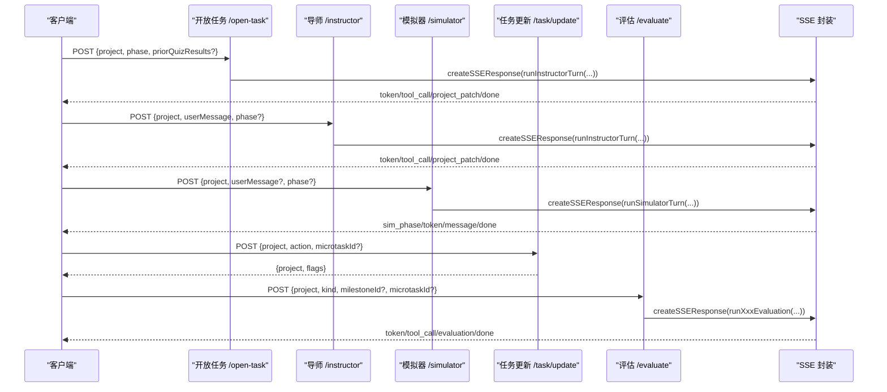
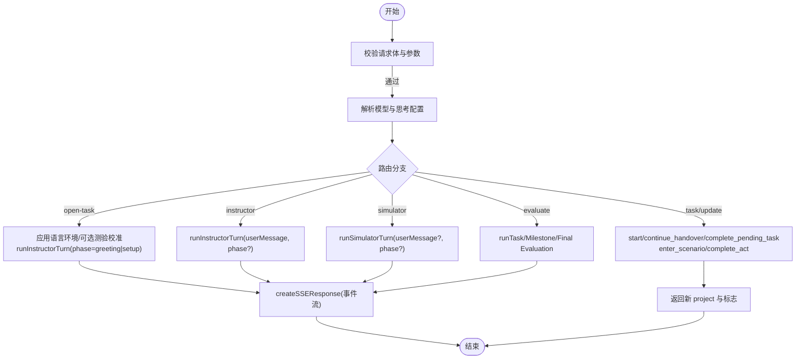

# PBL 学习 API

<cite>
**本文引用的文件**   
- [app/api/pbl/v2/evaluate/route.ts](file://app/api/pbl/v2/evaluate/route.ts)
- [app/api/pbl/v2/instructor/route.ts](file://app/api/pbl/v2/instructor/route.ts)
- [app/api/pbl/v2/open-task/route.ts](file://app/api/pbl/v2/open-task/route.ts)
- [app/api/pbl/v2/simulator/route.ts](file://app/api/pbl/v2/simulator/route.ts)
- [app/api/pbl/v2/task/update/route.ts](file://app/api/pbl/v2/task/update/route.ts)
- [lib/pbl/v2/api/sse.ts](file://lib/pbl/v2/api/sse.ts)
</cite>

## 目录
- 产品概述
- 核心业务流程
- 功能模块清单
- 数据与状态
- 关键约束与边界

## 产品概述
OpenMAIC PBL（项目制学习）API V2 提供面向“任务—里程碑—最终评估”的完整学习闭环。通过统一的 SSE 流式协议，将导师交互、角色扮演模拟器、开放任务引导、自动评估等能力串联起来，支持学生提交处理、进度推进、成绩计算与反馈生成。该版本强调无状态服务端、客户端持有并回传完整项目状态，便于并发扩展与幂等控制。

## 核心业务流程
- 开放任务启动：进入项目时触发 GREETING 或 SETUP，由 Instructor 首句引导，必要时融合前置测验结果进行自适应难度校准。
- 导师交互：学生发送消息后，Instructor 基于当前里程碑/微任务上下文生成回复、调用工具、推进流程，并以 SSE 事件流返回 token、工具调用与项目补丁。
- 模拟对话：在角色扮演场景下，Simulator 以角色身份输出旁白与台词，同样通过 SSE 流式返回。
- 任务更新：UI 侧发起 start/continue_handover/complete_pending_task/enter_scenario/complete_act 等操作，服务端对本地项目副本执行确定性状态变更并返回新状态。
- 自动评估：按 kind=task/milestone/final 分别运行评估器，SSE 流中携带 evaluation 补丁，最终 done 事件后客户端可链式触发下一阶段评估。

**图表来源** 
- [app/api/pbl/v2/open-task/route.ts](file://app/api/pbl/v2/open-task/route.ts)
- [app/api/pbl/v2/instructor/route.ts](file://app/api/pbl/v2/instructor/route.ts)
- [app/api/pbl/v2/simulator/route.ts](file://app/api/pbl/v2/simulator/route.ts)
- [app/api/pbl/v2/task/update/route.ts](file://app/api/pbl/v2/task/update/route.ts)
- [app/api/pbl/v2/evaluate/route.ts](file://app/api/pbl/v2/evaluate/route.ts)
- [lib/pbl/v2/api/sse.ts](file://lib/pbl/v2/api/sse.ts)

**章节来源**
- [app/api/pbl/v2/open-task/route.ts](file://app/api/pbl/v2/open-task/route.ts)
- [app/api/pbl/v2/instructor/route.ts](file://app/api/pbl/v2/instructor/route.ts)
- [app/api/pbl/v2/simulator/route.ts](file://app/api/pbl/v2/simulator/route.ts)
- [app/api/pbl/v2/task/update/route.ts](file://app/api/pbl/v2/task/update/route.ts)
- [app/api/pbl/v2/evaluate/route.ts](file://app/api/pbl/v2/evaluate/route.ts)
- [lib/pbl/v2/api/sse.ts](file://lib/pbl/v2/api/sse.ts)

## 功能模块清单
- 开放任务入口（/api/pbl/v2/open-task）
  - 职责：首次进入或新微任务激活时，驱动 Instructor 的 GREETING/SETUP 阶段；可选注入前置测验结果用于自适应校准。
  - 验收要点：仅接受 greeting/setup 两种 phase；成功返回与 /instructor 一致的 SSE 流；当存在 priorQuizResults 且为 greeting 时，需完成难度分层再入 Instructor。
- 导师交互（/api/pbl/v2/instructor）
  - 职责：接收学生消息与完整项目状态，运行 Instructor 回合，流式返回 token、工具调用与 project_patch。
  - 验收要点：校验必填字段；模型解析失败返回错误；SSE 流包含 message/advance/handover/engagement_event/proficiency 等补丁类型。
- 角色扮演模拟器（/api/pbl/v2/simulator）
  - 职责：仅在 scenario 项目的 roleplay 阶段生效，流式返回旁白与角色台词，支持 greeting/instructing 两阶段。
  - 验收要点：非 scenario 或阶段不符应拒绝；返回 sim_phase 事件指示当前生成阶段。
- 任务更新（/api/pbl/v2/task/update）
  - 职责：无 LLM 的状态变更端点，支持 start、continue_handover、complete_pending_task、enter_scenario、complete_act。
  - 验收要点：严格动作分支校验；scenario 专用动作需满足前置条件；返回新的 project 及必要标志位。
- 自动评估（/api/pbl/v2/evaluate）
  - 职责：统一入口，根据 kind 选择 task/milestone/final 评估器；SSE 流中携带 evaluation 补丁，done 后客户端可链式触发后续评估。
  - 验收要点：kind 与参数校验；支持 vision 能力检测；返回 shouldEvaluateTask/Milestone/Final 等指令供客户端编排。

**章节来源**
- [app/api/pbl/v2/open-task/route.ts](file://app/api/pbl/v2/open-task/route.ts)
- [app/api/pbl/v2/instructor/route.ts](file://app/api/pbl/v2/instructor/route.ts)
- [app/api/pbl/v2/simulator/route.ts](file://app/api/pbl/v2/simulator/route.ts)
- [app/api/pbl/v2/task/update/route.ts](file://app/api/pbl/v2/task/update/route.ts)
- [app/api/pbl/v2/evaluate/route.ts](file://app/api/pbl/v2/evaluate/route.ts)

## 数据与状态
- 项目状态（PBLProjectV2）
  - 客户端持有完整项目副本并在每次请求中回传，服务端仅做增量 patch 返回，保证无状态与可扩展性。
  - 关键子结构包括里程碑（milestones）、微任务（microtasks）、会话消息（chatMessages）、评估（evaluations）、参与事件（engagementEvents）、运行时事件（runtimeEvents）、待交接（pendingHandover）、能力评估（proficiencyAssessment）等。
- SSE 事件体系
  - token：LLM 文本增量
  - tool_call：工具调用记录
  - project_patch：项目增量补丁，含 message/advance/engagement_event/evaluation/handover/proficiency 等子类
  - sim_phase：模拟器阶段提示（narration/character）
  - reset_draft：丢弃未提交的草稿
  - error/done：错误与结束信号
- 状态转换规则
  - 微任务推进：start → in_progress → completed（可能触发 milestone 完成与 handover）
  - 里程碑交接：handover 消费后激活下一里程碑首个微任务
  - 角色扮演：prep → roleplay → wrapup（enter_scenario/complete_act 为场景专属快速路径）
  - 评估链路：task → milestone → final，由 advance 补丁中的 shouldEvaluate* 标志驱动

**图表来源** 
- [lib/pbl/v2/api/sse.ts](file://lib/pbl/v2/api/sse.ts)
- [app/api/pbl/v2/open-task/route.ts](file://app/api/pbl/v2/open-task/route.ts)
- [app/api/pbl/v2/instructor/route.ts](file://app/api/pbl/v2/instructor/route.ts)
- [app/api/pbl/v2/simulator/route.ts](file://app/api/pbl/v2/simulator/route.ts)
- [app/api/pbl/v2/task/update/route.ts](file://app/api/pbl/v2/task/update/route.ts)
- [app/api/pbl/v2/evaluate/route.ts](file://app/api/pbl/v2/evaluate/route.ts)

**章节来源**
- [lib/pbl/v2/api/sse.ts](file://lib/pbl/v2/api/sse.ts)
- [app/api/pbl/v2/task/update/route.ts](file://app/api/pbl/v2/task/update/route.ts)
- [app/api/pbl/v2/evaluate/route.ts](file://app/api/pbl/v2/evaluate/route.ts)

## 关键约束与边界
- 请求体与鉴权
  - 所有接口均要求 JSON 请求体，缺失必填字段返回 INVALID_REQUEST/MISSING_REQUIRED_FIELD。
  - 模型解析失败统一返回 INVALID_REQUEST，并附带错误信息。
- 超时与长连接
  - 各路由设置 maxDuration（如 300s），SSE 使用心跳保持连接，避免中间层中断。
- 安全与权限
  - 服务端无状态，不持久化项目；敏感操作依赖客户端正确传递 project 与上下文。
  - 场景专属动作（enter_scenario/complete_act）受项目类型与阶段强约束，防止误用。
- 性能与可扩展性
  - 客户端持有项目副本，服务端只做增量 patch，降低存储与同步成本。
  - SSE 流式传输 token 与补丁，提升实时体验与网络效率。
- 错误处理策略
  - 统一 apiError 返回结构化错误码与消息；SSE 流内以 error 事件通知异常，并以 done 收尾。
  - 客户端应在收到 error 后中止流并展示用户友好提示。

**章节来源**
- [app/api/pbl/v2/instructor/route.ts](file://app/api/pbl/v2/instructor/route.ts)
- [app/api/pbl/v2/open-task/route.ts](file://app/api/pbl/v2/open-task/route.ts)
- [app/api/pbl/v2/simulator/route.ts](file://app/api/pbl/v2/simulator/route.ts)
- [app/api/pbl/v2/task/update/route.ts](file://app/api/pbl/v2/task/update/route.ts)
- [app/api/pbl/v2/evaluate/route.ts](file://app/api/pbl/v2/evaluate/route.ts)
- [lib/pbl/v2/api/sse.ts](file://lib/pbl/v2/api/sse.ts)