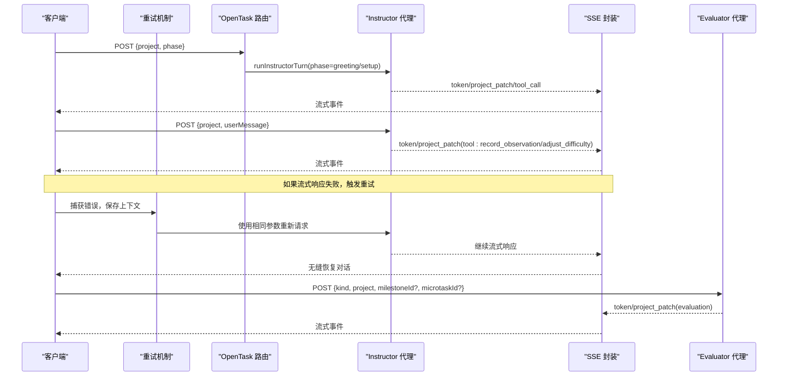
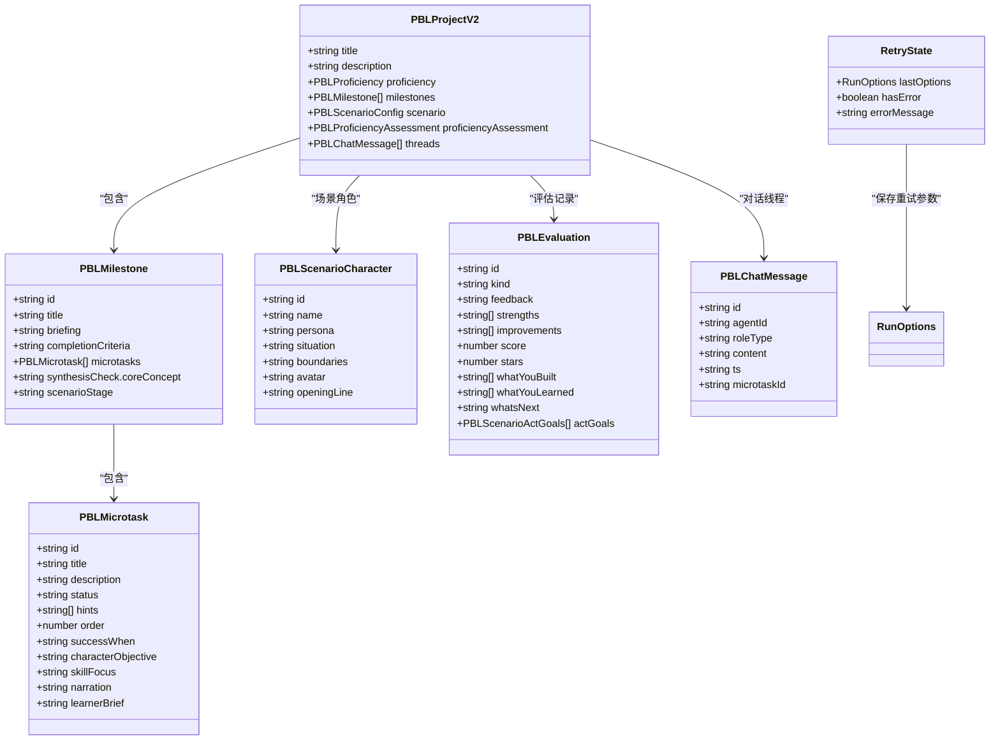
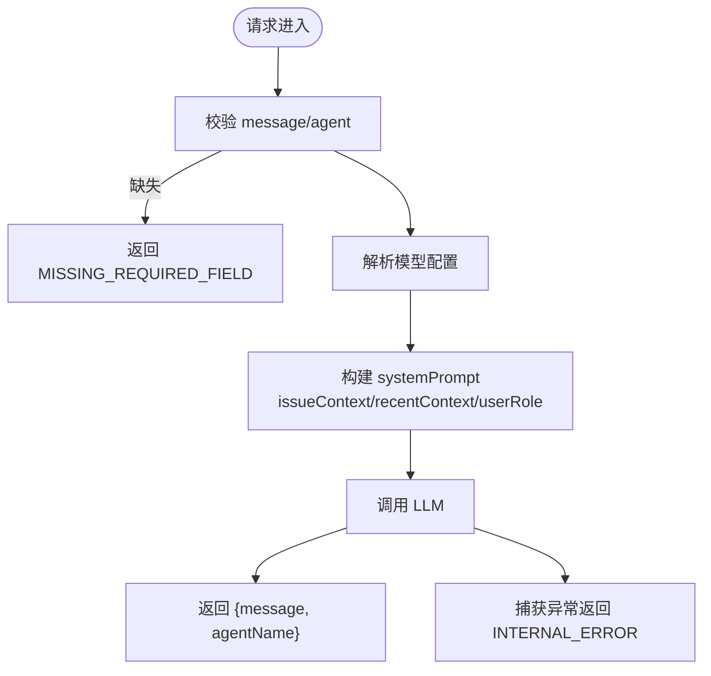
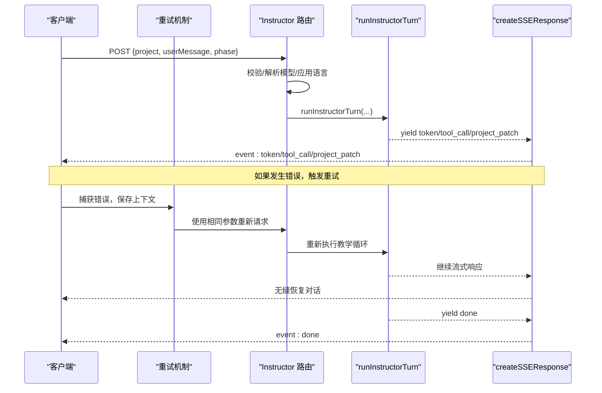
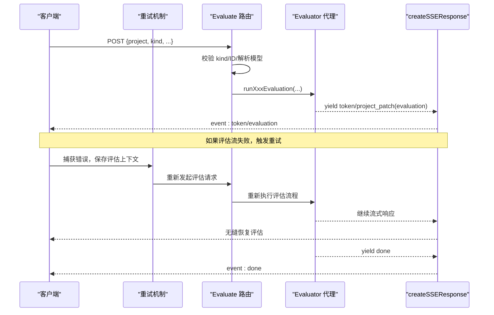
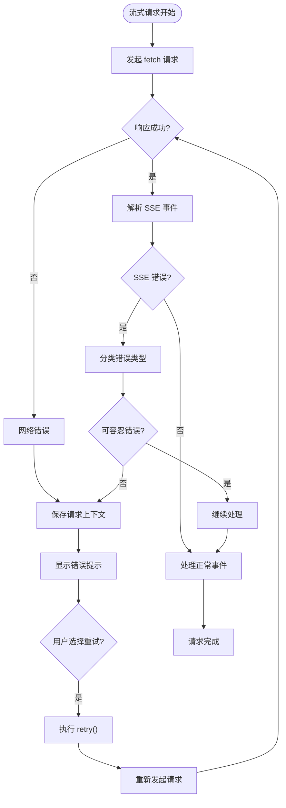
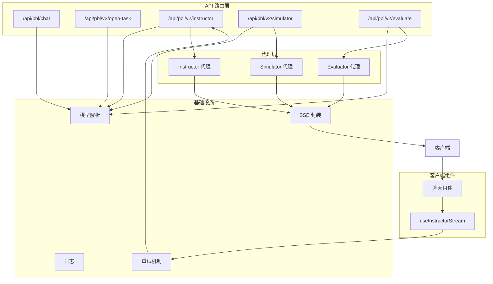

# PBL 导师 API

<cite>
**本文引用的文件**   
- [app/api/pbl/chat/route.ts](file://app/api/pbl/chat/route.ts)
- [app/api/pbl/v2/instructor/route.ts](file://app/api/pbl/v2/instructor/route.ts)
- [app/api/pbl/v2/evaluate/route.ts](file://app/api/pbl/v2/evaluate/route.ts)
- [app/api/pbl/v2/simulator/route.ts](file://app/api/pbl/v2/simulator/route.ts)
- [app/api/pbl/v2/open-task/route.ts](file://app/api/pbl/v2/open-task/route.ts)
- [lib/pbl/v2/agents/instructor.ts](file://lib/pbl/v2/agents/instructor.ts)
- [lib/pbl/v2/agents/simulator.ts](file://lib/pbl/v2/agents/simulator.ts)
- [lib/pbl/v2/agents/evaluator.ts](file://lib/pbl/v2/agents/evaluator.ts)
- [lib/pbl/v2/types.ts](file://lib/pbl/v2/types.ts)
- [lib/pbl/v2/api/sse.ts](file://lib/pbl/v2/api/sse.ts)
- [lib/pbl/v2/operations/dynamic-signals.ts](file://lib/pbl/v2/operations/dynamic-signals.ts)
- [components/scene-renderers/pbl/v2/use-instructor-stream.ts](file://components/scene-renderers/pbl/v2/use-instructor-stream.ts)
- [components/scene-renderers/pbl/v2/chat.tsx](file://components/scene-renderers/pbl/v2/chat.tsx)
- [tests/pbl/v2/use-instructor-stream.test.ts](file://tests/pbl/v2/use-instructor-stream.test.ts)
</cite>

## 更新摘要
**变更内容**   
- 新增错误重试机制章节，详细说明 PBL V2 导师流的无缝重试功能
- 更新流式处理组件分析，增加 retry() 方法和错误恢复逻辑
- 完善故障排查指南，包含重试相关的错误处理和用户交互
- 更新架构图表，展示重试机制在整体流程中的位置

## 产品概述
本文件面向 PBL（基于问题的学习）导师系统，聚焦 v2 版本的导师 API。该体系以"单一导师"为核心，贯穿项目引导、任务教学、情境模拟与评估反馈四大环节，通过 SSE 流式返回 token、工具调用与项目补丁，实现无状态、可扩展的实时交互。其核心价值在于：
- 智能决策：依据学情分析（提交物、错误、停留时长、问答行为）动态调整指导策略与难度。
- 多轮对话：统一的 SSE 协议承载 token、工具调用、项目变更与阶段事件，支持长连接与心跳保活。
- 情境模拟：为角色扮演类项目提供独立 Simulator 角色与旁白叙事，严格隔离教学与表演边界。
- 评估闭环：任务/里程碑/最终评估三合一入口，输出结构化评分与可渲染卡片。
- **错误重试**：支持流式响应失败时的无缝重试，保持用户上下文不丢失，提升系统可靠性。

适用场景：课堂互动、项目式学习、角色扮演训练、自适应教学与即时反馈。

## 核心业务流程
- 初始化与开场
  - 打开任务时触发 OpenTask 接口，进入 greeting/setup 阶段，导师主动发起引导。
- 教学对话
  - Instructor 接口接收学生消息，构建系统提示（含当前里程碑/微任务、历史摘要、语言策略），流式生成回复并可能调用教学工具（记录观察、调整难度）。
- 情境模拟（可选）
  - 当项目为角色扮演场景且处于 roleplay 阶段时，Simulator 负责角色台词与旁白叙事，Instructor 仅出现在 prep/wrapup。
- 评估反馈
  - Evaluate 接口根据 kind（task/milestone/final）驱动不同评估流程，输出文本反馈与结构化 JSON 尾部，持久化为 PBLEvaluation。
- **错误重试**
  - 当流式响应失败时，客户端自动触发重试机制，使用相同的请求参数和上下文状态重新发起请求。



**图表来源** 
- [app/api/pbl/v2/open-task/route.ts](file://app/api/pbl/v2/open-task/route.ts)
- [app/api/pbl/v2/instructor/route.ts](file://app/api/pbl/v2/instructor/route.ts)
- [app/api/pbl/v2/evaluate/route.ts](file://app/api/pbl/v2/evaluate/route.ts)
- [lib/pbl/v2/api/sse.ts](file://lib/pbl/v2/api/sse.ts)
- [lib/pbl/v2/agents/instructor.ts](file://lib/pbl/v2/agents/instructor.ts)
- [lib/pbl/v2/agents/evaluator.ts](file://lib/pbl/v2/agents/evaluator.ts)
- [components/scene-renderers/pbl/v2/use-instructor-stream.ts](file://components/scene-renderers/pbl/v2/use-instructor-stream.ts)

**章节来源**
- [app/api/pbl/v2/open-task/route.ts](file://app/api/pbl/v2/open-task/route.ts)
- [app/api/pbl/v2/instructor/route.ts](file://app/api/pbl/v2/instructor/route.ts)
- [app/api/pbl/v2/evaluate/route.ts](file://app/api/pbl/v2/evaluate/route.ts)
- [lib/pbl/v2/api/sse.ts](file://lib/pbl/v2/api/sse.ts)

## 功能模块清单
- 导师对话（v1 chat）
  - 职责：处理 @mention 路由，按 agentType（question/judge）拼接上下文，调用 LLM 生成回复。
  - 验收要点：必填字段校验、模型解析、最近消息上下文、错误码统一。
- 导师教学（v2 instructor）
  - 职责：按 phase（greeting/setup/instructing）组装系统提示，流式生成回复，执行教学工具（record_observation、adjust_difficulty），推进进度与更新能力评估。
  - 验收要点：SSE 事件完整性、工具调用与补丁一致性、空输出重试、语言策略遵循。
- 情境模拟（simulator）
  - 职责：仅在 scenario 项目的 roleplay 阶段运行；角色台词与旁白叙事分离，保证角色不越界、不自我旁白。
  - 验收要点：场景入场叙事、角色首句、instructing 阶段顺序（角色→旁白）、空输出软提示。
- 评估（evaluate）
  - 职责：三合一入口（task/milestone/final），流式生成反馈文本与结构化尾部，持久化 PBLEvaluation。
  - 验收要点：kind 校验、视觉输入（vision）路径、JSON 尾部解析容错、evaluation patch 下发。
- 开放任务（open-task）
  - 职责：项目首次进入或新微任务激活时的导师开场；支持前置测验结果校准能力层级。
  - 验收要点：phase 校验、priorQuizResults 折叠逻辑、SSE 流式响应。
- **错误重试机制**
  - 职责：捕获流式响应错误，保存完整上下文状态，自动重试失败的请求。
  - 验收要点：上下文保持、重试参数一致性、用户体验无缝性。

**章节来源**
- [app/api/pbl/chat/route.ts](file://app/api/pbl/chat/route.ts)
- [app/api/pbl/v2/instructor/route.ts](file://app/api/pbl/v2/instructor/route.ts)
- [app/api/pbl/v2/simulator/route.ts](file://app/api/pbl/v2/simulator/route.ts)
- [app/api/pbl/v2/evaluate/route.ts](file://app/api/pbl/v2/evaluate/route.ts)
- [app/api/pbl/v2/open-task/route.ts](file://app/api/pbl/v2/open-task/route.ts)
- [components/scene-renderers/pbl/v2/use-instructor-stream.ts](file://components/scene-renderers/pbl/v2/use-instructor-stream.ts)

## 数据与状态
- 核心数据模型（节选）
  - PBLProjectV2：包含 milestones、threads、proficiencyAssessment、scenario 等运行时结构。
  - PBLMilestone/PBLMicrotask：里程碑与微任务的状态、描述、完成标准、hint、engagement 摘要等。
  - PBLScenarioCharacter/PBLScenarioConfig：角色扮演角色与场景配置（setting、rules、learnerRole、characters）。
  - PBLEvaluation：评估结果（feedback、strengths、improvements、score、stars、whatYouBuilt/WhatYouLearned/whatsNext、actGoals）。
  - PBLChatMessage：消息体（roleType 可为 instructor/user/simulator/system 等）。
- 关键状态流转
  - 能力评估（proficiencyAssessment）：由 dynamic-signals 管线维护，支持 tier 转换与置信度更新，并通过 SSE proficiency patch 同步到客户端。
  - 进度推进（advance_micro_task）：由 Instructor 工具触发，返回 advance patch 携带 completedMicrotask/nextMicrotask/milestone 快照及 shouldEvaluateXxx 标志。
  - 评估链式触发：Instructor 推进后，客户端根据 shouldEvaluateTask/Milestone/Final 依次调用 evaluate 接口。
  - **重试状态管理**：lastOptionsRef 保存最后一次成功的请求选项，retry() 方法使用这些选项重新发起请求。
- 数据所有权边界
  - 项目副本在客户端持有，服务端仅返回差异补丁（project_patch），保持无状态与幂等。
  - 评估结果写入 evaluations 列表，UI 根据 kind 分支渲染。



**图表来源** 
- [lib/pbl/v2/types.ts](file://lib/pbl/v2/types.ts)
- [components/scene-renderers/pbl/v2/use-instructor-stream.ts](file://components/scene-renderers/pbl/v2/use-instructor-stream.ts)

**章节来源**
- [lib/pbl/v2/types.ts](file://lib/pbl/v2/types.ts)
- [lib/pbl/v2/api/sse.ts](file://lib/pbl/v2/api/sse.ts)
- [lib/pbl/v2/operations/dynamic-signals.ts](file://lib/pbl/v2/operations/dynamic-signals.ts)
- [components/scene-renderers/pbl/v2/use-instructor-stream.ts](file://components/scene-renderers/pbl/v2/use-instructor-stream.ts)

## 关键约束与边界
- 非功能性需求
  - SSE 长连接需心跳保活（默认 15s），中间件（Vercel/Cloudflare/nginx）不中断。
  - 最大请求时长限制（maxDuration=300s）保障长时间 LLM 调用稳定性。
  - 错误统一编码（INVALID_REQUEST、MISSING_REQUIRED_FIELD、STREAM_ERROR、LLM_ERROR 等）。
  - **重试机制约束**：重试时使用完全相同的请求参数，确保上下文一致性；避免无限重试循环。
- 依赖与集成边界
  - 模型解析通过 resolveModelFromRequest，支持 thinkingConfig 与能力探测（如 vision）。
  - 评估流程与教学流程解耦：Instructor 不直接执行评估，而是通过 shouldEvaluateXxx 标志驱动客户端串行调用 evaluate。
  - **重试边界**：仅对网络错误和临时性 LLM 错误进行重试，业务逻辑错误不进行自动重试。
- 业务约束
  - Instructor 不得自行标记任务完成，必须由右侧提交面板评估通过后由平台推进。
  - 角色扮演场景中，Simulator 仅负责角色台词与旁白，禁止教练/评估/推进逻辑混入。
  - 语言策略优先遵循 project.languageDirective，否则回退至 BCP-47 locale。

**章节来源**
- [app/api/pbl/v2/instructor/route.ts](file://app/api/pbl/v2/instructor/route.ts)
- [app/api/pbl/v2/evaluate/route.ts](file://app/api/pbl/v2/evaluate/route.ts)
- [lib/pbl/v2/agents/instructor.ts](file://lib/pbl/v2/agents/instructor.ts)
- [lib/pbl/v2/agents/simulator.ts](file://lib/pbl/v2/agents/simulator.ts)
- [lib/pbl/v2/api/sse.ts](file://lib/pbl/v2/api/sse.ts)
- [components/scene-renderers/pbl/v2/use-instructor-stream.ts](file://components/scene-renderers/pbl/v2/use-instructor-stream.ts)

## 详细组件分析

### 导师对话（v1 chat）
- 入口：POST /api/pbl/chat
- 输入：message、agent、currentIssue、recentMessages、userRole、agentType
- 处理：
  - 校验必填字段
  - 解析模型配置（resolveModelFromRequest）
  - 构建 systemPrompt（含 issueContext、recentContext、userRole）
  - 调用 callLLM 生成回复
- 输出：{ message, agentName }
- 错误：MISSING_REQUIRED_FIELD、INTERNAL_ERROR



**图表来源** 
- [app/api/pbl/chat/route.ts](file://app/api/pbl/chat/route.ts)

**章节来源**
- [app/api/pbl/chat/route.ts](file://app/api/pbl/chat/route.ts)

### 导师教学（v2 instructor）
- 入口：POST /api/pbl/v2/instructor
- 输入：project、userMessage、phase（默认 instructing）
- 处理：
  - 校验 project 与 userMessage
  - 解析模型配置（含 thinkingConfig）
  - applyRequestLocaleToProject 设置语言策略
  - runInstructorTurn 驱动教学循环（token 流、tool_call、project_patch）
- 输出：SSE 事件流（token/tool_call/project_patch/done）
- 错误：INVALID_REQUEST、模型解析失败



**图表来源** 
- [app/api/pbl/v2/instructor/route.ts](file://app/api/pbl/v2/instructor/route.ts)
- [lib/pbl/v2/agents/instructor.ts](file://lib/pbl/v2/agents/instructor.ts)
- [lib/pbl/v2/api/sse.ts](file://lib/pbl/v2/api/sse.ts)
- [components/scene-renderers/pbl/v2/use-instructor-stream.ts](file://components/scene-renderers/pbl/v2/use-instructor-stream.ts)

**章节来源**
- [app/api/pbl/v2/instructor/route.ts](file://app/api/pbl/v2/instructor/route.ts)
- [lib/pbl/v2/agents/instructor.ts](file://lib/pbl/v2/agents/instructor.ts)

### 情境模拟（simulator）
- 入口：POST /api/pbl/v2/simulator
- 输入：project、userMessage（可选）、phase（greeting/instructing）
- 处理：
  - 校验 project，解析模型配置
  - applyRequestLocaleToProject
  - runSimulatorTurn：
    - greeting：旁白叙事 → 角色首句（设计时 openingLine 或 LLM 生成）
    - instructing：记录 learner_turn → 角色台词流式生成 → 旁白叙事（非言语反应）
- 输出：SSE 事件流（sim_phase/token/project_patch/done）
- 错误：NOT_A_SCENARIO、NOT_IN_ROLEPLAY、NO_CHARACTER、STREAM_ERROR、EMPTY_LLM_OUTPUT

```mermaid
flowchart TD
Start(["请求进入"]) --> CheckScenario{"是否 scenario 项目?"}
CheckScenario --> |否| ErrNotScenario["返回 NOT_A_SCENARIO"]
CheckScenario --> CheckRoleplay{"是否 roleplay 阶段?"}
CheckRoleplay --> |否| ErrNotRoleplay["返回 NOT_IN_ROLEPLAY"]
CheckRoleplay --> Phase{"phase == greeting?"}
Phase --> |是| Narration["旁白叙事 (narration)"]
Narration --> OpeningLine{"有设计时 openingLine?"}
OpeningLine --> |是| EmitOpening["发送 openingLine"]
OpeningLine --> |否| GenLine["LLM 生成角色首句"]
Phase --> |否| RecordTurn["记录 learner_turn"]
RecordTurn --> StreamChar["流式生成角色台词"]
StreamChar --> NarratorPass["旁白叙事 (非言语反应)"]
Narration --> Done["done"]
GenLine --> Done
NarratorPass --> Done
Note over Start,Done: 支持错误重试机制
```

**图表来源** 
- [app/api/pbl/v2/simulator/route.ts](file://app/api/pbl/v2/simulator/route.ts)
- [lib/pbl/v2/agents/simulator.ts](file://lib/pbl/v2/agents/simulator.ts)

**章节来源**
- [app/api/pbl/v2/simulator/route.ts](file://app/api/pbl/v2/simulator/route.ts)
- [lib/pbl/v2/agents/simulator.ts](file://lib/pbl/v2/agents/simulator.ts)

### 评估（evaluate）
- 入口：POST /api/pbl/v2/evaluate
- 输入：project、kind（task/milestone/final）、milestoneId（可选）、microtaskId（可选）、recentChatSummary（可选）
- 处理：
  - 校验 kind 与必要 ID
  - 解析模型配置（含 vision 能力探测）
  - 根据 kind 选择对应评估函数（runTaskEvaluation/runMilestoneEvaluation/runFinalEvaluation）
  - 流式生成反馈文本与结构化尾部，持久化为 PBLEvaluation
- 输出：SSE 事件流（token/project_patch(evaluation)/done）
- 错误：INVALID_REQUEST、NOT_FOUND、STREAM_ERROR、LLM_ERROR



**图表来源** 
- [app/api/pbl/v2/evaluate/route.ts](file://app/api/pbl/v2/evaluate/route.ts)
- [lib/pbl/v2/agents/evaluator.ts](file://lib/pbl/v2/agents/evaluator.ts)
- [lib/pbl/v2/api/sse.ts](file://lib/pbl/v2/api/sse.ts)

**章节来源**
- [app/api/pbl/v2/evaluate/route.ts](file://app/api/pbl/v2/evaluate/route.ts)
- [lib/pbl/v2/agents/evaluator.ts](file://lib/pbl/v2/agents/evaluator.ts)

### 开放任务（open-task）
- 入口：POST /api/pbl/v2/open-task
- 输入：project、phase（greeting/setup）、priorQuizResults（可选）
- 处理：
  - 校验 project 与 phase
  - 解析模型配置
  - applyRequestLocaleToProject
  - 若 phase==greeting 且有 priorQuizResults，则折叠测验结果到 proficiencyAssessment
  - runInstructorTurn(phase) 驱动导师开场
- 输出：SSE 事件流（token/project_patch/done）
- 错误：INVALID_REQUEST、模型解析失败

**章节来源**
- [app/api/pbl/v2/open-task/route.ts](file://app/api/pbl/v2/open-task/route.ts)

### 错误重试机制（新增）
- 核心组件：useInstructorStream Hook
- 重试触发条件：
  - 流式响应网络错误（fetch 异常）
  - SSE 事件解析错误
  - 服务器返回错误事件（error type）
- 重试实现原理：
  - lastOptionsRef 保存最后一次成功的请求选项（endpoint、body、initialProject）
  - retry() 方法清除错误状态并使用保存的选项重新调用 run()
  - 保持 workingProject 状态，确保上下文连续性
- 错误分类处理：
  - 可容忍错误：EMPTY_LLM_OUTPUT（软提示，不影响评估结果）
  - 致命错误：STREAM_ERROR、LLM_ERROR（需要用户干预或自动重试）
- 用户体验：
  - 透明重试：用户感知不到重试过程
  - 状态保持：已应用的 project_patch 不会丢失
  - 错误提示：严重错误时显示友好提示信息



**图表来源** 
- [components/scene-renderers/pbl/v2/use-instructor-stream.ts](file://components/scene-renderers/pbl/v2/use-instructor-stream.ts)

**章节来源**
- [components/scene-renderers/pbl/v2/use-instructor-stream.ts](file://components/scene-renderers/pbl/v2/use-instructor-stream.ts)
- [tests/pbl/v2/use-instructor-stream.test.ts](file://tests/pbl/v2/use-instructor-stream.test.ts)

## 架构总览


**图表来源** 
- [app/api/pbl/chat/route.ts](file://app/api/pbl/chat/route.ts)
- [app/api/pbl/v2/open-task/route.ts](file://app/api/pbl/v2/open-task/route.ts)
- [app/api/pbl/v2/instructor/route.ts](file://app/api/pbl/v2/instructor/route.ts)
- [app/api/pbl/v2/simulator/route.ts](file://app/api/pbl/v2/simulator/route.ts)
- [app/api/pbl/v2/evaluate/route.ts](file://app/api/pbl/v2/evaluate/route.ts)
- [lib/pbl/v2/agents/instructor.ts](file://lib/pbl/v2/agents/instructor.ts)
- [lib/pbl/v2/agents/simulator.ts](file://lib/pbl/v2/agents/simulator.ts)
- [lib/pbl/v2/agents/evaluator.ts](file://lib/pbl/v2/agents/evaluator.ts)
- [lib/pbl/v2/api/sse.ts](file://lib/pbl/v2/api/sse.ts)
- [components/scene-renderers/pbl/v2/use-instructor-stream.ts](file://components/scene-renderers/pbl/v2/use-instructor-stream.ts)

## 性能考虑
- SSE 心跳保活避免中间节点超时断开。
- Instructor 单轮步骤预算（MAX_INSTRUCTOR_STEPS）控制工具调用与文本长度。
- 历史记录裁剪（MAX_HISTORY_MESSAGES）防止上下文膨胀。
- 评估流式文本不直接暴露原始 JSON，减少前端渲染开销。
- 视觉输入仅在模型具备 vision 能力时启用，避免不必要的带宽消耗。
- **重试机制优化**：避免重复请求造成的资源浪费，合理设置重试间隔和次数限制。

## 故障排查指南
- 常见错误码
  - INVALID_REQUEST：请求体无效或字段缺失
  - MISSING_REQUIRED_FIELD：缺少必填字段（project、userMessage、kind 等）
  - STREAM_ERROR：流式生成异常
  - LLM_ERROR：模型调用错误
  - NOT_A_SCENARIO/NOT_IN_ROLEPLAY/NO_CHARACTER：模拟器前置条件不满足
  - EMPTY_LLM_OUTPUT：空输出软提示（可容忍错误）
- 调试建议
  - 检查 request body 结构与类型
  - 确认模型解析成功（headers/body 中的 provider/model/thinkingConfig）
  - 查看 SSE 事件序列是否完整（token → tool_call → project_patch → done）
  - 对空输出场景，模拟器会进行一次性重试；若仍为空，提示用户重试
  - **重试问题排查**：检查 lastOptionsRef 是否正确保存请求选项，确认 retry() 方法被正确调用
- **重试相关故障**
  - 重试循环：检查错误分类逻辑，避免将业务错误误判为可重试错误
  - 上下文丢失：确认 workingProject 状态在重试过程中保持一致
  - 用户体验：确保重试过程对用户透明，不产生重复的消息或状态

**章节来源**
- [app/api/pbl/v2/instructor/route.ts](file://app/api/pbl/v2/instructor/route.ts)
- [app/api/pbl/v2/simulator/route.ts](file://app/api/pbl/v2/simulator/route.ts)
- [app/api/pbl/v2/evaluate/route.ts](file://app/api/pbl/v2/evaluate/route.ts)
- [lib/pbl/v2/api/sse.ts](file://lib/pbl/v2/api/sse.ts)
- [components/scene-renderers/pbl/v2/use-instructor-stream.ts](file://components/scene-renderers/pbl/v2/use-instructor-stream.ts)

## 结论
PBL 导师 API 通过清晰的职责分层（路由层/代理层/基础设施）、统一的 SSE 协议与无状态设计，实现了从教学引导到情境模拟再到评估反馈的完整闭环。其智能决策（学情分析、干预时机、内容生成）、多轮对话管理与情感识别（通过角色与旁白叙事）共同支撑了个性化、自适应的学习体验。**新增的错误重试机制进一步提升了系统的可靠性和用户体验，确保在网络波动或服务端临时故障时能够无缝恢复对话**。开发者可基于此文档快速集成与扩展导师能力。