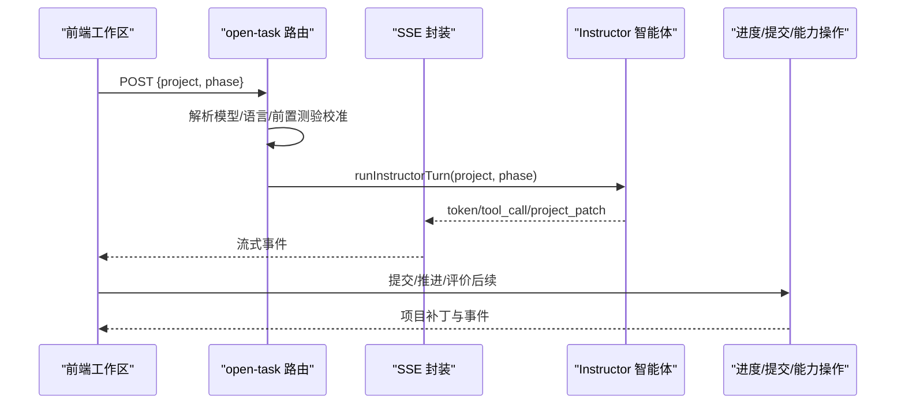
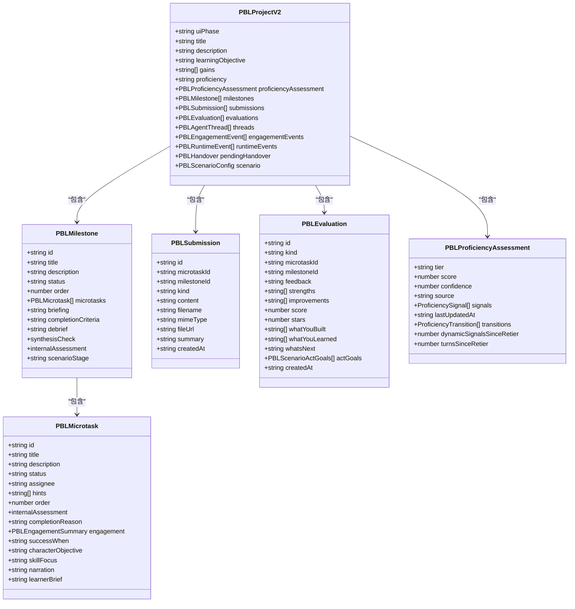

# PBL 开放任务 API

<cite>
**本文引用的文件**   
- [app/api/pbl/v2/open-task/route.ts](file://app/api/pbl/v2/open-task/route.ts)
- [lib/pbl/v2/api/sse.ts](file://lib/pbl/v2/api/sse.ts)
- [lib/pbl/v2/agents/instructor.ts](file://lib/pbl/v2/agents/instructor.ts)
- [lib/pbl/v2/types.ts](file://lib/pbl/v2/types.ts)
- [lib/pbl/v2/operations/progress.ts](file://lib/pbl/v2/operations/progress.ts)
- [lib/pbl/v2/operations/submission.ts](file://lib/pbl/v2/operations/submission.ts)
- [lib/pbl/v2/operations/proficiency.ts](file://lib/pbl/v2/operations/proficiency.ts)
- [lib/pbl/v2/operations/dynamic-signals.ts](file://lib/pbl/v2/operations/dynamic-signals.ts)
- [components/scene-renderers/pbl/v2/workspace.tsx](file://components/scene-renderers/pbl/v2/workspace.tsx)
</cite>

## 产品概述
PBL 开放任务 API 为“开放式学习项目”的发布与运行提供后端能力，支持自由选题、自主探索与创新展示。其核心由“导师（Instructor）智能体 + 结构化里程碑/微任务 + 自适应难度引擎 + 提交与评价流水线”组成，通过 SSE 流式返回教学对话、工具调用与项目状态变更，前端工作区负责渲染三栏布局（任务侧边栏、对话区、提交面板），并驱动任务生命周期与版本控制。

## 核心业务流程
- 首次进入或新微任务激活：前端调用 /api/pbl/v2/open-task，传入 project 与 phase（greeting/setup），服务端解析模型、应用语言策略、可选前置测验校准，随后以 Instructor 回合生成 SSE 流，仅记录导师消息。
- 教学回合：Instructor 构建系统提示（项目、阶段、当前微任务、历史提交与评估、脚手架状态等），流式输出文本与工具调用（如记录观察、调整难度、推进任务）。
- 任务完成与评价：当右侧提交面板产出可评作业后，平台触发任务级评价；若完成里程碑则触发里程碑评价；项目完成后触发最终评价。评价结果以 SSE patch 形式回写项目。
- 协作与版本：所有状态变更通过运行时事件与 engagement 事件记录，支持重置、手递卡片（handover）、场景角色扮演（scenario）等扩展流程。

**图表来源** 
- [app/api/pbl/v2/open-task/route.ts:40-93](file://app/api/pbl/v2/open-task/route.ts#L40-L93)
- [lib/pbl/v2/api/sse.ts:211-289](file://lib/pbl/v2/api/sse.ts#L211-L289)
- [lib/pbl/v2/agents/instructor.ts:58-102](file://lib/pbl/v2/agents/instructor.ts#L58-L102)

**章节来源**
- [app/api/pbl/v2/open-task/route.ts:1-94](file://app/api/pbl/v2/open-task/route.ts#L1-L94)
- [components/scene-renderers/pbl/v2/workspace.tsx:182-278](file://components/scene-renderers/pbl/v2/workspace.tsx#L182-L278)

## 功能模块清单
- 开放任务入口（/api/pbl/v2/open-task）
  - 职责：接收 project 与 phase，解析模型与语言，可选前置测验校准，启动 Instructor 回合并以 SSE 流式返回。
  - 验收要点：phase 校验、错误码规范、SSE 心跳保活、仅记录导师消息。
- SSE 事件协议
  - 职责：统一 token/tool_call/project_patch/sim_phase/reset_draft/error/done 等事件类型与编码格式，封装 Response 头与心跳。
  - 验收要点：事件判别联合类型、keepalive、异常兜底、done 终态。
- Instructor 智能体
  - 职责：组装系统提示（项目/阶段/微任务/提交上下文/脚手架/硬规则/场景感知），流式生成回复与工具调用，维护教学节奏与语言一致性。
  - 验收要点：阶段块（greeting/setup/instructing）、脚手架披露阶梯、场景 prep/roleplay/wrapup 分支、工具调用与进度推进。
- 进度与生命周期管理
  - 职责：里程碑/微任务状态机、手递卡片、角色扮演的单幕完成、项目重置、运行时规范化。
  - 验收要点：状态转换幂等、运行时事件记录、跨里程碑不自动打开下一阶段的门控。
- 提交与评价
  - 职责：新增/列举/摘要提交，按最新提交进行任务评价，支撑里程碑/最终评价链式触发。
  - 验收要点：提交摘要截断、图片/链接/文本多形态、评价顺序与证据完整性。
- 自适应能力引擎
  - 职责：静态信号（大纲/前序场景/用户画像/测验）+ 动态信号（观察/收尾检查/速度/提交分数）→ EWMA 评分 → 层级切换（含迟滞/冷却/最小信号门控）。
  - 验收要点：权重上限、置信度累积、tier 边界、调试事件与 dev badge。

**章节来源**
- [lib/pbl/v2/api/sse.ts:1-290](file://lib/pbl/v2/api/sse.ts#L1-L290)
- [lib/pbl/v2/agents/instructor.ts:108-600](file://lib/pbl/v2/agents/instructor.ts#L108-L600)
- [lib/pbl/v2/operations/progress.ts:463-758](file://lib/pbl/v2/operations/progress.ts#L463-L758)
- [lib/pbl/v2/operations/submission.ts:23-161](file://lib/pbl/v2/operations/submission.ts#L23-L161)
- [lib/pbl/v2/operations/proficiency.ts:58-174](file://lib/pbl/v2/operations/proficiency.ts#L58-L174)
- [lib/pbl/v2/operations/dynamic-signals.ts:96-224](file://lib/pbl/v2/operations/dynamic-signals.ts#L96-L224)

## 数据与状态
- 项目模型（PBLProjectV2）
  - 关键字段：uiPhase、title/description、learningObjective/gains、proficiency、proficiencyAssessment、milestones/microtasks、submissions/evaluations、threads、engagementEvents、runtimeEvents、pendingHandover、scenario（角色扮演）。
  - 作用域：作为 Instructor 输入与 SSE 补丁目标，前后端共享类型定义。
- 里程碑与微任务
  - 里程碑：标题/描述/状态/顺序/文档/简报/完成标准/合成检查/内部评估/场景阶段标记。
  - 微任务：标题/描述/状态/分配者/提示/顺序/内部评估/完成原因/参与摘要/场景专用字段（successWhen/characterObjective/skillFocus/narration/learnerBrief）。
- 提交与评价
  - 提交：kind（text/file/link）、content/filename/mimeType/fileUrl/summary/createdAt。
  - 评价：kind（task/milestone/final）、feedback/strengths/improvements/score/stars、final-only 字段（whatYouBuilt/whatYouLearned/whatsNext/actGoals）。
- 能力评估
  - 结构：tier/score/confidence/source/signals/lastUpdatedAt/transitions/dynamicSignalsSinceRetier/turnsSinceRetier。
  - 信号来源：outline_keyword/prior_scene_difficulty/user_bio/user_level_explicit/quiz_accuracy/submission_score/task_speed/help_request/concept_confusion/self_correction/force_advance/closing_check_quality。
- 运行时事件与参与事件
  - 运行时事件：message_created/tool_call_started/succeeded/failed/submission_created/evaluation_created/status_changed/project_reset/handover_staged/consumed/task_completion_staged/cleared/proficiency_updated。
  - 参与事件：microtask_opened/learner_turn/observation_xxx/closing_check/microtask_completed/skipped/proficiency_changed 等。

**图表来源** 
- [lib/pbl/v2/types.ts:767-800](file://lib/pbl/v2/types.ts#L767-L800)
- [lib/pbl/v2/types.ts:197-243](file://lib/pbl/v2/types.ts#L197-L243)
- [lib/pbl/v2/types.ts:129-180](file://lib/pbl/v2/types.ts#L129-L180)
- [lib/pbl/v2/types.ts:320-339](file://lib/pbl/v2/types.ts#L320-L339)
- [lib/pbl/v2/types.ts:371-399](file://lib/pbl/v2/types.ts#L371-L399)
- [lib/pbl/v2/types.ts:615-644](file://lib/pbl/v2/types.ts#L615-L644)

**章节来源**
- [lib/pbl/v2/types.ts:1-800](file://lib/pbl/v2/types.ts#L1-L800)

## 关键约束与边界
- 接口契约
  - open-task：请求体必须包含 project，phase 仅允许 greeting 或 setup；响应为 SSE 流，仅记录导师消息。
  - SSE：事件类型严格区分，必须发送 done 终态；中间件需保持 keep-alive 与禁用缓冲。
- 状态机约束
  - 里程碑完成时不自动打开下一阶段，需学习者点击 Continue 消费 handover。
  - 角色扮演模式（scenario）下，场景阶段由 Simulator 主导，Instructor 仅在 prep/wrapup 出现。
- 能力评估约束
  - 层级切换需满足迟滞、置信度阈值、最小动态信号数与冷却回合；默认无证据时为 intermediate。
- 提交与评价
  - 任务评价仅基于最新提交；长内容需截断以保证提示词预算；图片提交需走视觉评测路径。
- 性能与可靠性
  - Instructor 回合步骤上限、历史消息压缩、engagement 环形缓冲、SSE 心跳保活。

**章节来源**
- [app/api/pbl/v2/open-task/route.ts:40-93](file://app/api/pbl/v2/open-task/route.ts#L40-L93)
- [lib/pbl/v2/api/sse.ts:184-289](file://lib/pbl/v2/api/sse.ts#L184-L289)
- [lib/pbl/v2/operations/progress.ts:463-636](file://lib/pbl/v2/operations/progress.ts#L463-L636)
- [lib/pbl/v2/operations/proficiency.ts:740-789](file://lib/pbl/v2/operations/proficiency.ts#L740-L789)
- [lib/pbl/v2/operations/submission.ts:85-161](file://lib/pbl/v2/operations/submission.ts#L85-L161)

## 附录：示例与最佳实践
- 任务模板开发
  - 在 Planner 中定义里程碑与微任务，设置 briefing/completionCriteria/synthesisCheck 等脚本字段；必要时配置 scenario（setting/rules/learnerRole/characters）。
  - 使用 types.ts 中的数据结构确保字段完整与语义一致。
- 内容生成配置
  - 通过 open-task 传入 project 与 phase；如需语言策略，确保 project.languageDirective 或 language 正确设置。
  - 可在 greeting 阶段附带 priorQuizResults 进行前置校准。
- 成果展示方式
  - 支持 text/file/link 三种提交；文件上传保留 fileUrl 用于下载或视觉评测；文本提交可带 summary 缩短提示词。
  - 评价结果（task/milestone/final）以结构化字段呈现，最终评价可包含 actGoals 用于角色扮演复盘。
- 协作编辑与版本控制
  - 所有状态变更通过 runtimeEvents 与 engagementEvents 记录；支持 resetProjectProgress 重置学习进度但保留项目结构。
  - 场景模式下，completeRoleplayAct 一键完成整幕，并自动消费 handover 进入下一阶段。

**章节来源**
- [lib/pbl/v2/types.ts:197-317](file://lib/pbl/v2/types.ts#L197-L317)
- [lib/pbl/v2/operations/submission.ts:23-110](file://lib/pbl/v2/operations/submission.ts#L23-L110)
- [lib/pbl/v2/operations/progress.ts:203-276](file://lib/pbl/v2/operations/progress.ts#L203-L276)
- [lib/pbl/v2/operations/progress.ts:652-758](file://lib/pbl/v2/operations/progress.ts#L652-L758)