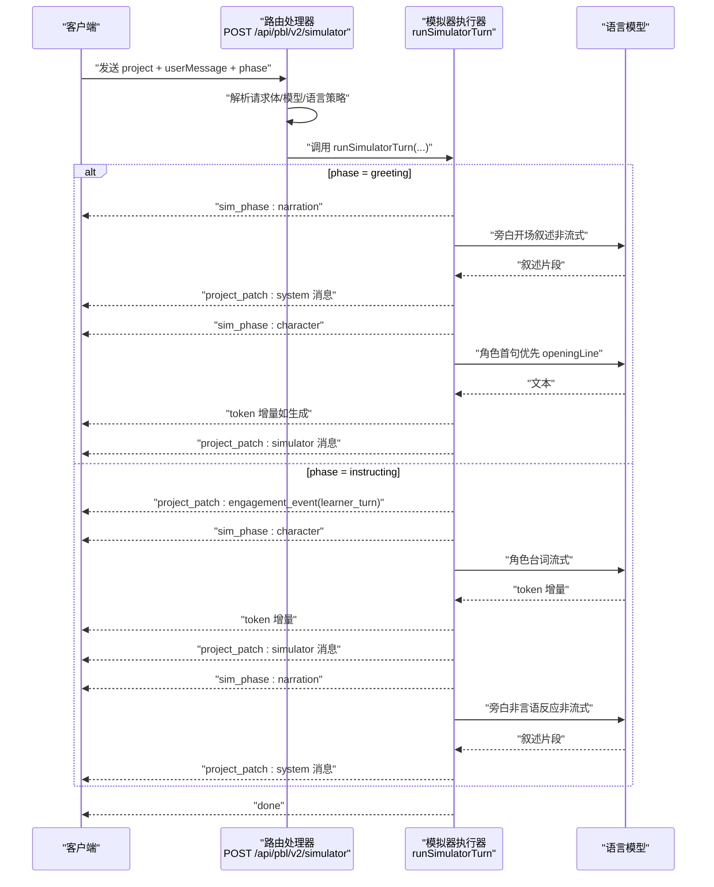
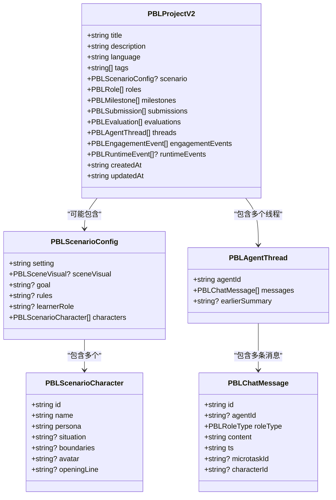
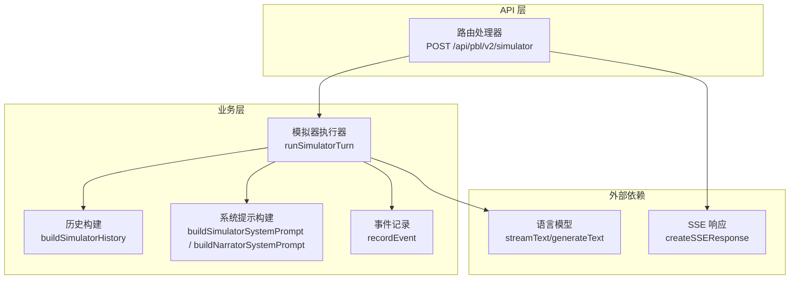
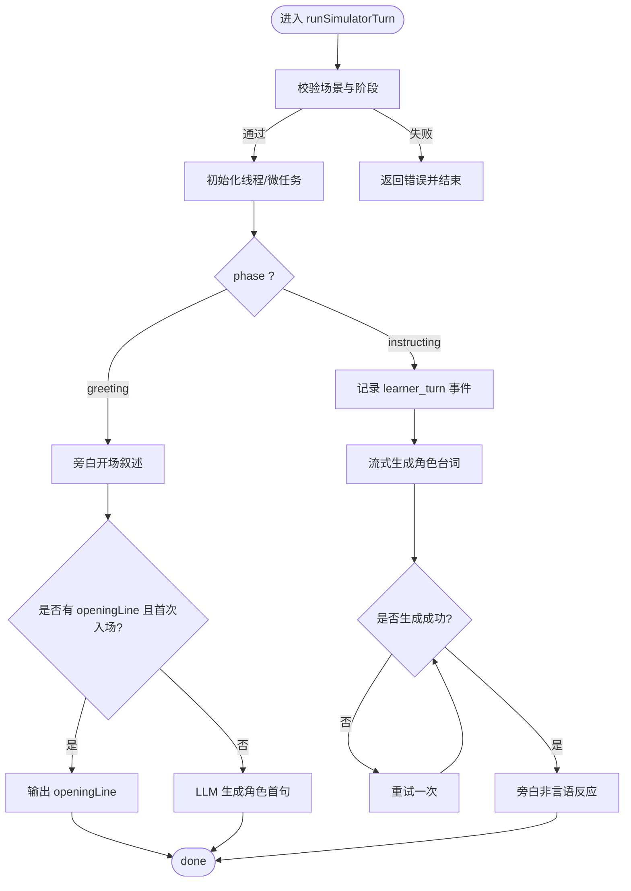

# PBL 模拟器 API

<cite>
**本文引用的文件**
- [app/api/pbl/v2/simulator/route.ts](file://app/api/pbl/v2/simulator/route.ts)
- [lib/pbl/v2/agents/simulator.ts](file://lib/pbl/v2/agents/simulator.ts)
- [lib/pbl/v2/types.ts](file://lib/pbl/v2/types.ts)
</cite>

## 产品概述
PBL 模拟器 API 是面向“场景型”项目的角色扮演模拟引擎，提供基于事件驱动的流式接口，用于生成虚拟场景、驱动角色行为并维护环境状态。该能力仅作用于处于“roleplay”阶段的场景项目，通过系统旁白与角色对话的双通道输出，确保沉浸感与一致性；同时以 SSE（Server-Sent Events）实时推送 token 增量与最终消息补丁，便于前端无缝渲染与同步。

核心价值：
- 为场景项目提供可重现的开场与一致的沉浸式对话体验
- 将“角色说话”和“旁白叙述”解耦，避免角色越界或旁白污染
- 通过事件记录与工程化状态管理，支撑教学评估与数据导出

适用场景：
- 情景演练、面试模拟、谈判/辩论训练等需要强沉浸感的互动学习
- 需要回放、评估与数据分析的教学闭环

## 核心业务流程
- 客户端调用 POST /api/pbl/v2/simulator，携带完整项目对象与学习者消息（可选），指定阶段 phase（greeting/instructing）。
- 服务端解析模型与语言策略，校验项目是否为场景且处于 roleplay 阶段。
- 若为 greeting：先由系统旁白生成开场叙述，再输出角色的首句（优先使用设计时 openingLine，否则由 LLM 生成）。
- 若为 instructing：记录学习者回合事件，先流式生成角色台词，再由旁白对可见非言语反应进行补充叙述。
- 所有输出以 SSE 事件形式返回：token 增量、project_patch（追加消息）、done 结束信号。

图表来源
- [app/api/pbl/v2/simulator/route.ts:39-74](file://app/api/pbl/v2/simulator/route.ts#L39-L74)
- [lib/pbl/v2/agents/simulator.ts:356-613](file://lib/pbl/v2/agents/simulator.ts#L356-L613)

章节来源
- [app/api/pbl/v2/simulator/route.ts:1-75](file://app/api/pbl/v2/simulator/route.ts#L1-L75)
- [lib/pbl/v2/agents/simulator.ts:356-613](file://lib/pbl/v2/agents/simulator.ts#L356-L613)

## 功能模块清单
- 路由层（SSE 入口）
  - 职责：接收请求、解析模型与语言策略、校验输入、创建 SSE 响应并转发给模拟器执行器。
  - 验收要点：错误码与消息规范、最大时长限制、phase 默认值处理、locale 注入。
- 模拟器执行器（核心逻辑）
  - 职责：构建历史上下文、生成系统提示词、驱动角色与旁白双通道输出、事件记录、异常重试与兜底。
  - 验收要点：仅在 roleplay 阶段运行、角色与旁白分离、SSE 事件顺序正确、空输出重试机制。
- 类型与数据模型
  - 职责：定义项目结构、角色、线程、事件、评估等类型，保障前后端一致性与可扩展性。
  - 验收要点：字段语义清晰、边界条件完备、兼容旧版本。

章节来源
- [app/api/pbl/v2/simulator/route.ts:1-75](file://app/api/pbl/v2/simulator/route.ts#L1-L75)
- [lib/pbl/v2/agents/simulator.ts:1-614](file://lib/pbl/v2/agents/simulator.ts#L1-L614)
- [lib/pbl/v2/types.ts:1-961](file://lib/pbl/v2/types.ts#L1-L961)

## 数据与状态
- 项目与场景
  - PBLProjectV2：包含元数据、生命周期、里程碑、微任务、提交物、评估、线程、事件等。
  - scenario：存在即标记为场景项目，内含 setting、rules、learnerRole、characters、sceneVisual 等。
- 线程与消息
  - threads：按 agentId 分线程，每条消息含 id、agentId、roleType、content、ts、microtaskId、characterId（仅 simulator）。
  - 角色与旁白：roleType 为 'simulator' 表示角色发言，'system' 表示中立旁白；两者均出现在场景项目。
- 事件与参与
  - engagementEvents：追加式事件账本，记录 learner_turn、microtask_opened、completion 等。
  - runtimeEvents：更广泛的运行时事实账本（消息、工具调用、状态变更等）。
- 状态机
  - uiPhase：hero → generating → workspace → completed
  - milestone.status：locked → active → completed
  - microtask.status：todo → in_progress → completed/skipped

图表来源
- [lib/pbl/v2/types.ts:767-888](file://lib/pbl/v2/types.ts#L767-L888)
- [lib/pbl/v2/types.ts:245-317](file://lib/pbl/v2/types.ts#L245-L317)
- [lib/pbl/v2/types.ts:669-705](file://lib/pbl/v2/types.ts#L669-L705)

章节来源
- [lib/pbl/v2/types.ts:1-961](file://lib/pbl/v2/types.ts#L1-L961)

## 关键约束与边界
- 运行阶段约束
  - 仅当 project.scenario 存在且当前 milestone.scenarioStage === 'roleplay' 时才允许进入模拟器流程。
  - 非场景或非 roleplay 阶段会返回明确错误并结束。
- 角色与旁白隔离
  - 角色历史不包含旁白内容，防止“旁白污染”导致角色模仿旁白风格。
  - 旁白仅描述可见的非言语反应与场景变化，不替角色说话。
- 开场与重现性
  - 首次入场优先使用设计时的 openingLine，保证打包场景的可重现性；后续阶段由 LLM 自然生成。
- 事件与审计
  - 每次学习者回合都会记录 engagement_event，便于统计与评估。
- 错误与重试
  - 流式输出为空时进行一次一次性重试，避免硬错误暴露给用户。
  - 网络/模型异常会返回标准化错误事件，客户端需妥善处理。

章节来源
- [lib/pbl/v2/agents/simulator.ts:356-410](file://lib/pbl/v2/agents/simulator.ts#L356-L410)
- [lib/pbl/v2/agents/simulator.ts:474-573](file://lib/pbl/v2/agents/simulator.ts#L474-L573)

## 架构总览

图表来源
- [app/api/pbl/v2/simulator/route.ts:39-74](file://app/api/pbl/v2/simulator/route.ts#L39-L74)
- [lib/pbl/v2/agents/simulator.ts:97-118](file://lib/pbl/v2/agents/simulator.ts#L97-L118)
- [lib/pbl/v2/agents/simulator.ts:123-196](file://lib/pbl/v2/agents/simulator.ts#L123-L196)
- [lib/pbl/v2/agents/simulator.ts:202-237](file://lib/pbl/v2/agents/simulator.ts#L202-L237)
- [lib/pbl/v2/agents/simulator.ts:356-613](file://lib/pbl/v2/agents/simulator.ts#L356-L613)

## 详细组件分析

### 路由处理器（POST /api/pbl/v2/simulator）
- 输入
  - project：完整的 PBLProjectV2 对象
  - userMessage：学习者消息（可选）
  - phase：'greeting' 或 'instructing'（默认 instructing）
- 处理
  - 解析 JSON 与模型配置，应用语言策略到项目
  - 调用 createSSEResponse 包装 runSimulatorTurn 的异步生成器
- 输出
  - SSE 事件流：token 增量、project_patch（message/engagement_event）、error、done

章节来源
- [app/api/pbl/v2/simulator/route.ts:1-75](file://app/api/pbl/v2/simulator/route.ts#L1-L75)

### 模拟器执行器（runSimulatorTurn）
- 前置校验
  - 确保项目为场景且处于 roleplay 阶段
  - 初始化线程与当前微任务
- 阶段分支
  - greeting：旁白开场 → 角色首句（openingLine 优先）→ done
  - instructing：记录 learner_turn → 角色台词（流式）→ 旁白非言语反应 → done
- 历史与提示
  - 构建角色/旁白各自的历史上下文，控制上下文窗口上限
  - 组装系统提示词，注入场景设定、规则、角色人设与当前节拍事实
- 异常与重试
  - 流式失败捕获并返回标准化错误
  - 空输出触发一次重试，避免硬错误

图表来源
- [lib/pbl/v2/agents/simulator.ts:356-613](file://lib/pbl/v2/agents/simulator.ts#L356-L613)

章节来源
- [lib/pbl/v2/agents/simulator.ts:356-613](file://lib/pbl/v2/agents/simulator.ts#L356-L613)

### 历史与系统提示构建
- buildSimulatorHistory
  - 根据 audience（character/director）过滤历史，避免旁白污染角色视角
  - 支持 earlierSummary 折叠，控制上下文长度
- buildSimulatorSystemPrompt
  - 注入场景设定、规则、学习者角色、当前节拍事实、角色人设与目标
  - 强调“只说角色台词”，禁止旁白/教练口吻
- buildNarratorSystemPrompt
  - 纯旁白人设，禁止替角色说话，仅描述可见非言语反应与场景变化
  - 支持 act 级上下文连续性，避免重复叙述

章节来源
- [lib/pbl/v2/agents/simulator.ts:97-118](file://lib/pbl/v2/agents/simulator.ts#L97-L118)
- [lib/pbl/v2/agents/simulator.ts:123-196](file://lib/pbl/v2/agents/simulator.ts#L123-L196)
- [lib/pbl/v2/agents/simulator.ts:202-237](file://lib/pbl/v2/agents/simulator.ts#L202-L237)

### 事件与数据导出
- engagementEvents
  - 记录 learner_turn、microtask_opened、completion 等，用于统计与评估
- runtimeEvents
  - 更广泛的运行时事实（消息、工具调用、状态变更），便于审计与回放
- 导出建议
  - 基于 engagementEvents 与 threads 生成对话回放与学习轨迹
  - 结合 evaluations 与 actGoals 生成场景表现报告

章节来源
- [lib/pbl/v2/types.ts:405-441](file://lib/pbl/v2/types.ts#L405-L441)
- [lib/pbl/v2/types.ts:447-535](file://lib/pbl/v2/types.ts#L447-L535)

## 性能考虑
- 上下文窗口控制
  - 历史消息上限 MAX_HISTORY_MESSAGES=300，避免过长上下文影响延迟与成本
  - earlierSummary 折叠策略保持关键信息不丢失
- 流式输出
  - 角色台词采用 streamText 增量推送，降低首字延迟
  - 旁白叙述为非流式短文本，减少长等待
- 重试与容错
  - 空输出一次性重试，提升成功率
  - 异常统一封装为 error 事件，客户端友好展示

[本节为通用指导，不直接分析具体文件]

## 故障排查指南
- 常见错误
  - NOT_A_SCENARIO：项目不是场景类型
  - NOT_IN_ROLEPLAY：不在 roleplay 阶段
  - NO_CHARACTER：未配置角色
  - STREAM_ERROR：流式输出异常
  - EMPTY_LLM_OUTPUT：角色本轮未生成内容（已重试仍为空）
- 排查步骤
  - 检查 project.scenario 与 milestone.scenarioStage
  - 确认角色 openingLine 与 persona 设置
  - 查看 engagementEvents 与 threads 中消息顺序
  - 关注 SSE 事件中的 error 与 done 信号

章节来源
- [lib/pbl/v2/agents/simulator.ts:366-390](file://lib/pbl/v2/agents/simulator.ts#L366-L390)
- [lib/pbl/v2/agents/simulator.ts:539-573](file://lib/pbl/v2/agents/simulator.ts#L539-L573)

## 结论
PBL 模拟器 API 通过严格的角色/旁白分离、事件驱动与流式输出，为场景型项目提供了高沉浸、可审计、可导出的角色扮演能力。其设计兼顾重现性与灵活性，适合教学评估与数据分析闭环。建议在集成时重点关注阶段校验、事件记录与错误处理，以确保稳定与用户体验。

[本节为总结性内容，不直接分析具体文件]