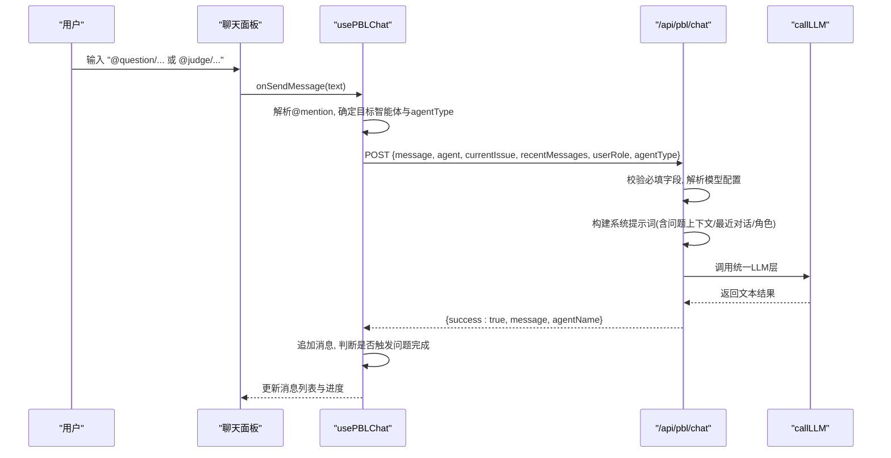
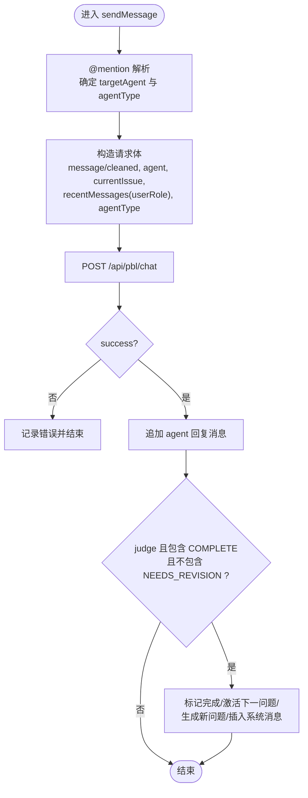
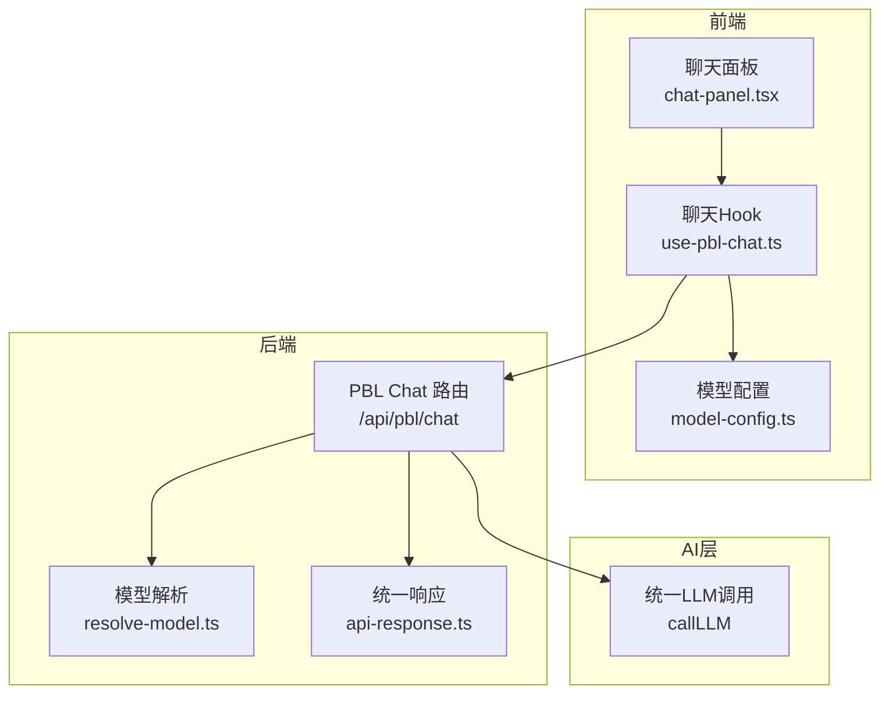
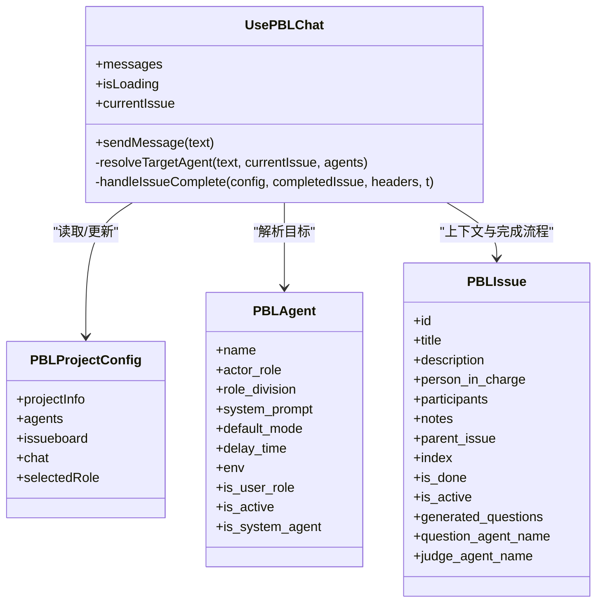
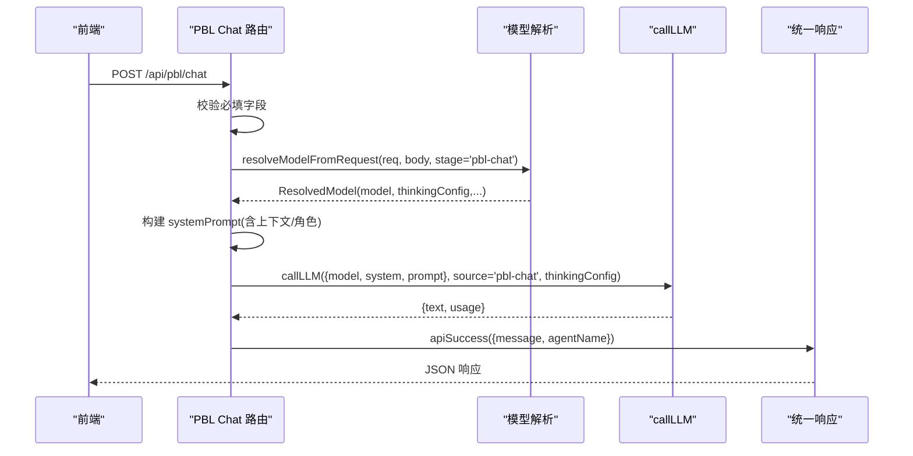
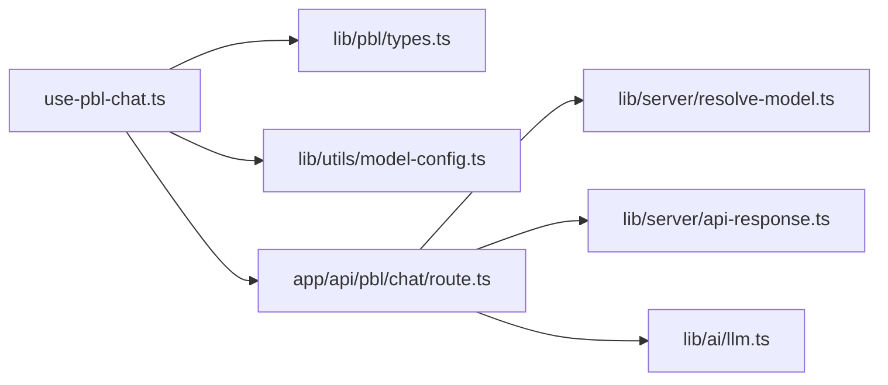

# PBL 聊天 API

<cite>
**本文引用的文件**   
- [app/api/pbl/chat/route.ts](file://app/api/pbl/chat/route.ts)
- [components/scene-renderers/pbl/use-pbl-chat.ts](file://components/scene-renderers/pbl/use-pbl-chat.ts)
- [lib/ai/llm.ts](file://lib/ai/llm.ts)
- [lib/server/api-response.ts](file://lib/server/api-response.ts)
- [lib/server/resolve-model.ts](file://lib/server/resolve-model.ts)
- [lib/pbl/types.ts](file://lib/pbl/types.ts)
- [components/scene-renderers/pbl/chat-panel.tsx](file://components/scene-renderers/pbl/chat-panel.tsx)
- [lib/utils/model-config.ts](file://lib/utils/model-config.ts)
</cite>

## 产品概述
PBL 聊天 API 为基于项目式学习（PBL）的课堂场景提供“@mention 路由”的实时对话能力。学生通过输入 @question 或 @judge 与不同智能体交互：问题智能体负责引导理解与生成问题，评判智能体负责评估与判定任务完成状态。该 API 将用户消息、当前问题上下文、最近对话与用户角色组装为系统提示词后调用统一的 LLM 层，返回结构化响应并支持前端自动推进问题流程。

## 核心业务流程
- 用户在聊天面板输入消息，若以 @question 或 @judge 开头，则解析为目标智能体；否则默认路由到问题智能体。
- 前端将清理后的消息、目标智能体、当前问题、最近若干条对话与用户角色发送到 /api/pbl/chat。
- 服务端根据 agentType（question/judge）拼接差异化上下文，构建系统提示词，调用统一 LLM 层生成回复。
- 前端收到成功响应后追加消息；若评判智能体回复包含完成信号且不含修订要求，则自动标记当前问题完成并激活下一问题，必要时自动生成新问题列表。

图表来源 
- [components/scene-renderers/pbl/use-pbl-chat.ts](file://components/scene-renderers/pbl/use-pbl-chat.ts)
- [app/api/pbl/chat/route.ts](file://app/api/pbl/chat/route.ts)
- [lib/ai/llm.ts](file://lib/ai/llm.ts)

章节来源
- [components/scene-renderers/pbl/use-pbl-chat.ts](file://components/scene-renderers/pbl/use-pbl-chat.ts)
- [app/api/pbl/chat/route.ts](file://app/api/pbl/chat/route.ts)

## 功能模块清单
- 前端聊天面板
  - 职责：渲染消息、处理输入与草稿缓存、语音转写、发送消息。
  - 验收要点：支持 Enter 发送、禁用重复提交、自动滚动到底部、显示加载态。
- 前端聊天 Hook（usePBLChat）
  - 职责：@mention 解析、消息清洗、构造请求体、错误处理、问题完成流程（标记完成、激活下一问题、生成新问题）。
  - 验收要点：@question/@judge 路由正确；最近消息限制长度；judge 完成信号识别准确。
- 后端聊天路由（/api/pbl/chat）
  - 职责：参数校验、模型解析、上下文构建、系统提示词组装、调用 LLM、统一响应封装。
  - 验收要点：缺失字段返回明确错误码；按 agentType 差异化上下文；错误日志记录完整。
- 统一 LLM 层（callLLM）
  - 职责：封装 AI SDK 调用、思考模式注入、重试与使用量统计。
  - 验收要点：支持 thinkingConfig；失败重试可配置；使用量上报不阻塞主流程。
- 模型解析（resolveModelFromRequest）
  - 职责：从请求头与 body 解析模型、密钥、基础 URL、代理与思考配置。
  - 验收要点：stage 路由优先；生产环境 SSRF 校验；受管提供商忽略客户端覆盖。
- 类型定义（PBL 类型）
  - 职责：定义智能体、问题、会话消息等数据结构。
  - 验收要点：字段齐全、语义清晰、前后端一致。

章节来源
- [components/scene-renderers/pbl/chat-panel.tsx](file://components/scene-renderers/pbl/chat-panel.tsx)
- [components/scene-renderers/pbl/use-pbl-chat.ts](file://components/scene-renderers/pbl/use-pbl-chat.ts)
- [app/api/pbl/chat/route.ts](file://app/api/pbl/chat/route.ts)
- [lib/ai/llm.ts](file://lib/ai/llm.ts)
- [lib/server/resolve-model.ts](file://lib/server/resolve-model.ts)
- [lib/pbl/types.ts](file://lib/pbl/types.ts)

## 数据与状态
- 请求体结构
  - message: string，用户消息（已去除 @mention 前缀）
  - agent: PBLAgent，目标智能体对象（name/system_prompt 等）
  - currentIssue: PBLIssue | null，当前活跃问题（标题、描述、负责人、生成问题等）
  - recentMessages: { agent_name: string; message: string }[]，最近若干条对话（用于上下文）
  - userRole: string，学生角色（用于系统提示词）
  - agentType?: 'question' | 'judge'，智能体类型（由前端根据目标智能体与当前问题推断）
- 响应格式
  - success: true/false
  - 成功时附加 message: string（AI 回复）、agentName: string（回复智能体名称）
  - 失败时 errorCode: string、error: string、details?: string
- 关键状态流转
  - 前端维护 messages 列表与 isLoading 状态；judge 回复包含完成信号时，触发问题完成流程：
    - 标记当前问题 is_done=true，is_active=false
    - 激活下一个未完成问题（按 index 排序）
    - 若新问题未生成问题列表，则再次调用本 API 生成
    - 插入系统消息提示进度变化

图表来源 
- [components/scene-renderers/pbl/use-pbl-chat.ts](file://components/scene-renderers/pbl/use-pbl-chat.ts)

章节来源
- [app/api/pbl/chat/route.ts](file://app/api/pbl/chat/route.ts)
- [components/scene-renderers/pbl/use-pbl-chat.ts](file://components/scene-renderers/pbl/use-pbl-chat.ts)
- [lib/server/api-response.ts](file://lib/server/api-response.ts)
- [lib/pbl/types.ts](file://lib/pbl/types.ts)

## 关键约束与边界
- 必填字段校验：缺少 message 或 agent 将返回 MISSING_REQUIRED_FIELD（400）。
- 模型解析优先级：stage 路由 > x-model > DEFAULT_MODEL；受管提供商忽略客户端覆盖；生产环境对非受管 baseUrl 进行 SSRF 校验。
- 上下文长度控制：最近对话仅保留最近若干条（前端取最近 10 条），避免过长影响性能与成本。
- 错误处理策略：服务端捕获异常并返回 INTERNAL_ERROR（500），附带错误信息；前端记录日志并降级展示。
- 完成信号识别：仅当 judge 回复包含“COMPLETE”且不含“NEEDS_REVISION”时才触发完成流程。
- 安全与鉴权：API Key 与服务端配置由 resolveModelFromRequest 决定，禁止客户端绕过；受管提供商不允许客户端覆盖。

章节来源
- [app/api/pbl/chat/route.ts](file://app/api/pbl/chat/route.ts)
- [lib/server/resolve-model.ts](file://lib/server/resolve-model.ts)
- [lib/server/api-response.ts](file://lib/server/api-response.ts)
- [components/scene-renderers/pbl/use-pbl-chat.ts](file://components/scene-renderers/pbl/use-pbl-chat.ts)

## 架构总览

图表来源 
- [components/scene-renderers/pbl/chat-panel.tsx](file://components/scene-renderers/pbl/chat-panel.tsx)
- [components/scene-renderers/pbl/use-pbl-chat.ts](file://components/scene-renderers/pbl/use-pbl-chat.ts)
- [lib/utils/model-config.ts](file://lib/utils/model-config.ts)
- [app/api/pbl/chat/route.ts](file://app/api/pbl/chat/route.ts)
- [lib/server/resolve-model.ts](file://lib/server/resolve-model.ts)
- [lib/server/api-response.ts](file://lib/server/api-response.ts)
- [lib/ai/llm.ts](file://lib/ai/llm.ts)

## 详细组件分析

### 前端聊天 Hook（usePBLChat）
- @mention 解析规则
  - 以 @question 开头 → 路由到当前问题的 question_agent_name 对应智能体
  - 以 @judge 开头 → 路由到当前问题的 judge_agent_name 对应智能体
  - 其他 @xxx → 尝试匹配 agents 中 name 包含 xxx 的智能体
  - 无 @mention 或无法识别 → 默认路由到 question_agent_name
- 请求构造
  - message：去除 @mention 前缀并 trim
  - agent：目标智能体对象
  - currentIssue：当前活跃问题
  - recentMessages：最近 10 条消息（仅保留 agent_name 与 message）
  - userRole：学生角色
  - agentType：judge 时为 'judge'，否则为 'question'
- 完成流程
  - 若 judge 回复包含 COMPLETE 且不含 NEEDS_REVISION：
    - 标记当前问题完成，激活下一个未完成问题
    - 若新问题未生成问题列表，调用本 API 生成
    - 插入系统消息提示进度

图表来源 
- [components/scene-renderers/pbl/use-pbl-chat.ts](file://components/scene-renderers/pbl/use-pbl-chat.ts)
- [lib/pbl/types.ts](file://lib/pbl/types.ts)

章节来源
- [components/scene-renderers/pbl/use-pbl-chat.ts](file://components/scene-renderers/pbl/use-pbl-chat.ts)
- [lib/pbl/types.ts](file://lib/pbl/types.ts)

### 后端聊天路由（/api/pbl/chat）
- 参数校验：缺失 message 或 agent 返回 400 错误
- 模型解析：从请求头与 body 解析 model、apiKey、baseUrl、providerType 与 thinkingConfig
- 上下文构建
  - 问题上下文：包含标题、描述、负责人；若存在 generated_questions，按 agentType 区分“待评估问题”或“生成问题”
  - 最近对话：拼接最近若干条消息
  - 用户角色：附加到系统提示词末尾
- 系统提示词组装：agent.system_prompt + 问题上下文 + 最近对话 + 用户角色
- LLM 调用：通过 callLLM 统一封装，支持 thinkingConfig 与重试
- 响应封装：成功返回 { success: true, message, agentName }；失败返回统一错误结构

图表来源 
- [app/api/pbl/chat/route.ts](file://app/api/pbl/chat/route.ts)
- [lib/server/resolve-model.ts](file://lib/server/resolve-model.ts)
- [lib/ai/llm.ts](file://lib/ai/llm.ts)
- [lib/server/api-response.ts](file://lib/server/api-response.ts)

章节来源
- [app/api/pbl/chat/route.ts](file://app/api/pbl/chat/route.ts)
- [lib/server/resolve-model.ts](file://lib/server/resolve-model.ts)
- [lib/ai/llm.ts](file://lib/ai/llm.ts)
- [lib/server/api-response.ts](file://lib/server/api-response.ts)

### 统一 LLM 层（callLLM）
- 功能要点
  - 封装 AI SDK 的 generateText/streamText
  - 注入 providerOptions（thinking 模式）
  - 支持重试与自定义 validate
  - 使用量统计（不影响主流程）
- 调用方式
  - callLLM(params, source, retryOptions?, thinking?)
  - params 包含 model、system、prompt 等
  - source 用于日志分组（如 'pbl-chat'）

章节来源
- [lib/ai/llm.ts](file://lib/ai/llm.ts)

### 模型解析（resolveModelFromRequest）
- 解析顺序：stage 路由 > x-model > DEFAULT_MODEL
- 受管提供商：忽略客户端 apiKey/baseUrl/providerType
- 生产环境：对非受管 baseUrl 进行 SSRF 校验
- thinkingConfig：可从 body 的 thinkingConfig/thinking 字段传入

章节来源
- [lib/server/resolve-model.ts](file://lib/server/resolve-model.ts)

### 聊天面板（ChatPanel）
- 功能要点
  - 输入框与发送按钮、Enter 发送、禁用重复提交
  - 草稿缓存与恢复
  - 自动滚动到底部
  - 语音转写集成
  - 系统消息与普通消息样式区分

章节来源
- [components/scene-renderers/pbl/chat-panel.tsx](file://components/scene-renderers/pbl/chat-panel.tsx)

## 依赖分析
- 前端依赖
  - usePBLChat 依赖 PBL 类型定义与模型配置工具
  - ChatPanel 依赖 i18n、消息渲染组件与语音按钮
- 后端依赖
  - 路由依赖模型解析、统一响应封装与 LLM 层
  - LLM 层依赖 AI SDK 与思考模式适配
- 外部依赖
  - AI 提供商（OpenAI/Anthropic/Google 等）通过 providers 注册
  - 存储与使用量统计（异步、不影响主流程）

图表来源 
- [components/scene-renderers/pbl/use-pbl-chat.ts](file://components/scene-renderers/pbl/use-pbl-chat.ts)
- [lib/pbl/types.ts](file://lib/pbl/types.ts)
- [lib/utils/model-config.ts](file://lib/utils/model-config.ts)
- [app/api/pbl/chat/route.ts](file://app/api/pbl/chat/route.ts)
- [lib/server/resolve-model.ts](file://lib/server/resolve-model.ts)
- [lib/server/api-response.ts](file://lib/server/api-response.ts)
- [lib/ai/llm.ts](file://lib/ai/llm.ts)

章节来源
- [components/scene-renderers/pbl/use-pbl-chat.ts](file://components/scene-renderers/pbl/use-pbl-chat.ts)
- [app/api/pbl/chat/route.ts](file://app/api/pbl/chat/route.ts)

## 性能考虑
- 上下文长度控制：recentMessages 仅保留最近若干条，降低 token 消耗与延迟
- 流式与重试：callLLM 支持重试与可选 validate，提升稳定性
- 使用量统计：异步上报，不阻塞主流程
- 模型路由：stage 路由可固定模型与 thinking 配置，减少解析开销

[本节为通用指导，无需引用具体文件]

## 故障排查指南
- 常见错误
  - MISSING_REQUIRED_FIELD：检查 message 与 agent 是否传递
  - INTERNAL_ERROR：查看服务端日志，确认 LLM 调用与上下文构建是否正常
  - 完成流程未触发：检查 judge 回复是否包含 COMPLETE 且不包含 NEEDS_REVISION
- 调试建议
  - 打印请求体与响应体，确认 agentType 与上下文是否正确
  - 检查 x-model/x-api-key/x-base-url/x-provider-type 是否正确设置
  - 确认 stage 路由是否覆盖了期望的模型与 thinking 配置

章节来源
- [lib/server/api-response.ts](file://lib/server/api-response.ts)
- [app/api/pbl/chat/route.ts](file://app/api/pbl/chat/route.ts)
- [components/scene-renderers/pbl/use-pbl-chat.ts](file://components/scene-renderers/pbl/use-pbl-chat.ts)

## 结论
PBL 聊天 API 通过 @mention 路由将学生与不同智能体解耦，结合上下文构建与统一 LLM 层，实现稳定、可扩展的问答与评判流程。前端在收到 judge 完成信号后可自动推进问题序列，形成闭环教学体验。建议在集成时严格遵循请求参数结构与错误处理策略，确保上下文长度与模型配置合理，以获得最佳性能与用户体验。

[本节为总结性内容，无需引用具体文件]