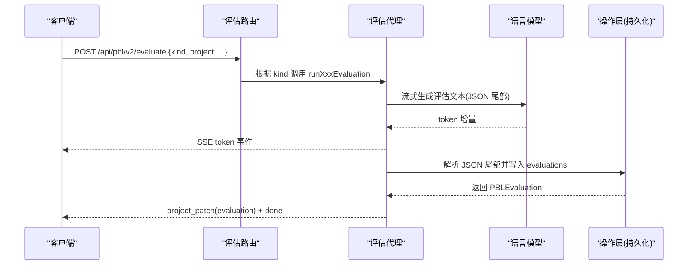
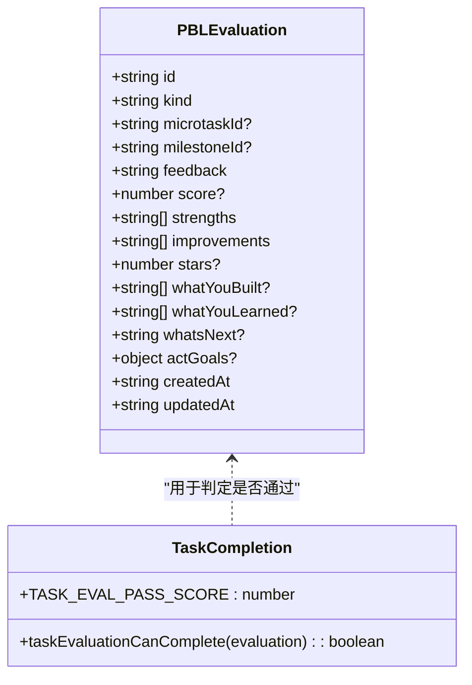

# PBL 评估 API

<cite>
**本文引用的文件**   
- [app/api/pbl/v2/evaluate/route.ts](file://app/api/pbl/v2/evaluate/route.ts)
- [lib/pbl/v2/agents/evaluator.ts](file://lib/pbl/v2/agents/evaluator.ts)
- [lib/pbl/v2/operations/eval-prompts.ts](file://lib/pbl/v2/operations/eval-prompts.ts)
- [lib/pbl/v2/operations/eval-tail-parser.ts](file://lib/pbl/v2/operations/eval-tail-parser.ts)
- [lib/pbl/v2/operations/task-completion.ts](file://lib/pbl/v2/operations/task-completion.ts)
- [components/scene-renderers/pbl/v2/chat.tsx](file://components/scene-renderers/pbl/v2/chat.tsx)
- [tests/pbl/v2/submission-flow.test.ts](file://tests/pbl/v2/submission-flow.test.ts)
</cite>

## 产品概述
PBL 评估 API 是 OpenMAIC 中面向项目式学习（PBL）的自动评估子系统，提供统一的 SSE 流式接口，对学生的学习提交进行质量评估、评分与反馈生成。系统支持三种评估粒度：
- 任务级评估（task）：在微任务完成且有提交时触发，输出简短反馈与结构化数据（优势、改进点、分数等）。
- 里程碑级评估（milestone）：在里程碑最后一个微任务完成后触发，输出反思卡片叙事与星级评价。
- 最终评估（final）：在项目完成后触发，输出总结报告（包含“你构建了什么”“你学到了什么”“下一步做什么”等）。

该 API 无状态，客户端负责维护项目克隆并在请求体中传入；服务端仅对流式生成的结果进行解析并追加到 evaluations，通过 project_patch 事件回传客户端。

## 核心业务流程
- 入口路由统一处理三种评估类型，依据请求体中的 kind 字段分发到对应评估函数。
- 评估流程采用流式生成（SSE），先输出文本片段用于前端即时展示，最后输出结构化 JSON 尾部并持久化。
- 任务级评估支持视觉能力模型的多模态输入（图片提交），非视觉或文本/PDF 走纯文本路径。
- 里程碑评估会对流式文本进行清洗，避免提前泄露下一阶段引导内容。
- 最终评估根据是否场景角色扮演（scenario）选择不同提示词与证据组织方式。

**图表来源** 
- [app/api/pbl/v2/evaluate/route.ts:1-132](file://app/api/pbl/v2/evaluate/route.ts#L1-L132)
- [lib/pbl/v2/agents/evaluator.ts:120-251](file://lib/pbl/v2/agents/evaluator.ts#L120-L251)

**章节来源**
- [app/api/pbl/v2/evaluate/route.ts:1-132](file://app/api/pbl/v2/evaluate/route.ts#L1-L132)
- [lib/pbl/v2/agents/evaluator.ts:120-251](file://lib/pbl/v2/agents/evaluator.ts#L120-L251)

## 功能模块清单
- 评估路由（POST /api/pbl/v2/evaluate）
  - 职责：参数校验、模型解析、按 kind 分派、创建 SSE 响应。
  - 验收要点：支持 task/milestone/final 三种 kind；缺失必填字段返回 400；支持 abortSignal。
- 评估代理（evaluator）
  - 职责：构建提示词、流式调用 LLM、解析 JSON 尾部、持久化评估结果、发送 project_patch。
  - 验收要点：任务级支持视觉输入；里程碑文本清洗；最终评估区分 scenario 与普通项目。
- 提示词构建（eval-prompts）
  - 职责：为三类评估组装 system/user 提示，整合项目上下文、提交摘要、参与度指标、历史评估等。
  - 验收要点：任务级排除未来微任务要求；里程碑级注入 engagement 信号；最终评估聚合里程碑反思与统计。
- 尾部解析器（eval-tail-parser）
  - 职责：从 LLM 输出中提取结构化 JSON 尾部，规范化 stars/score/string-list 等字段。
  - 验收要点：兼容 fenced/naked JSON；容错修复；数值范围钳制与半星舍入。
- 任务完成判定（task-completion）
  - 职责：基于评估分数判断是否可自动推进（阈值 60）。
  - 验收要点：score>=60 允许前进；undefined 不允许。
- 前端集成（chat.tsx）
  - 职责：消费 SSE 事件，渲染评估卡片（任务评估卡、里程碑卡、完成页 CTA）。
  - 验收要点：正确显示 feedback/strengths/improvements/stars；处理 project_patch 更新项目。

**章节来源**
- [app/api/pbl/v2/evaluate/route.ts:1-132](file://app/api/pbl/v2/evaluate/route.ts#L1-L132)
- [lib/pbl/v2/agents/evaluator.ts:81-109](file://lib/pbl/v2/agents/evaluator.ts#L81-L109)
- [lib/pbl/v2/operations/eval-prompts.ts:61-120](file://lib/pbl/v2/operations/eval-prompts.ts#L61-L120)
- [lib/pbl/v2/operations/eval-tail-parser.ts:56-79](file://lib/pbl/v2/operations/eval-tail-parser.ts#L56-L79)
- [lib/pbl/v2/operations/task-completion.ts:13-21](file://lib/pbl/v2/operations/task-completion.ts#L13-L21)
- [components/scene-renderers/pbl/v2/chat.tsx:30-58](file://components/scene-renderers/pbl/v2/chat.tsx#L30-L58)

## 数据与状态
- 评估结果数据结构（PBLEvaluation）
  - 通用字段：id、kind、microtaskId、milestoneId、feedback、createdAt、updatedAt。
  - 任务级特有：strengths（字符串数组）、improvements（字符串数组）、score（0-100 整数）。
  - 里程碑级特有：strengths（learned）、improvements[0]（performance）、stars（0-5，半星步进）。
  - 最终评估特有：whatYouBuilt、whatYouLearned、whatsNext、stars；场景模式额外 actGoals。
- 关键状态流转
  - 任务评估通过后（score>=60）可自动推进至下一微任务。
  - 里程碑评估后生成反思卡片，驱动 UI 展示。
  - 最终评估后生成完成报告，驱动完成页 Hero 展示。
- 数据所有权边界
  - 客户端持有项目克隆，服务端通过 project_patch 事件告知变更；失败解析不破坏已生成的叙述性反馈。

**图表来源** 
- [lib/pbl/v2/operations/eval-tail-parser.ts:172-219](file://lib/pbl/v2/operations/eval-tail-parser.ts#L172-L219)
- [lib/pbl/v2/operations/task-completion.ts:13-21](file://lib/pbl/v2/operations/task-completion.ts#L13-L21)

**章节来源**
- [lib/pbl/v2/agents/evaluator.ts:253-318](file://lib/pbl/v2/agents/evaluator.ts#L253-L318)
- [lib/pbl/v2/operations/task-completion.ts:13-21](file://lib/pbl/v2/operations/task-completion.ts#L13-L21)
- [tests/pbl/v2/submission-flow.test.ts:15-34](file://tests/pbl/v2/submission-flow.test.ts#L15-L34)

## 关键约束与边界
- 接口契约
  - 请求体必须包含 project 与 kind；kind 限定为 'task' | 'milestone' | 'final'。
  - kind='task' 需要 milestoneId 与 microtaskId；kind='milestone' 需要 milestoneId。
  - 支持 recentChatSummary 作为上下文增强。
- 模型与能力
  - 通过 resolveModelFromRequest 解析模型与 thinkingConfig；hasVision 控制多模态输入。
  - 最大请求时长 maxDuration=300s。
- 流式与错误处理
  - SSE 事件包括 token、error、project_patch、done；错误码如 LLM_ERROR、STREAM_ERROR、NOT_FOUND。
  - 结构化尾部解析失败不影响叙述性反馈展示。
- 业务规则
  - 任务通过阈值 TASK_EVAL_PASS_SCORE=60。
  - 里程碑评估文本需清洗，禁止提前泄露下一阶段引导。
  - 最终评估区分普通项目与场景角色扮演，使用不同提示词与证据组织。

**章节来源**
- [app/api/pbl/v2/evaluate/route.ts:49-88](file://app/api/pbl/v2/evaluate/route.ts#L49-L88)
- [lib/pbl/v2/agents/evaluator.ts:131-237](file://lib/pbl/v2/agents/evaluator.ts#L131-L237)
- [lib/pbl/v2/operations/eval-tail-parser.ts:142-154](file://lib/pbl/v2/operations/eval-tail-parser.ts#L142-L154)
- [lib/pbl/v2/operations/task-completion.ts:13-21](file://lib/pbl/v2/operations/task-completion.ts#L13-L21)