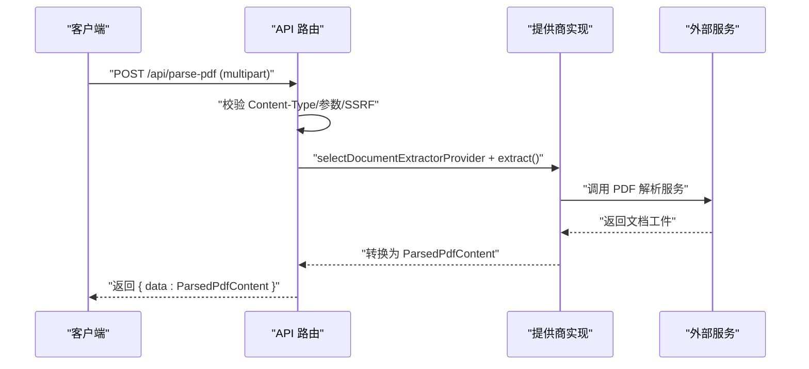
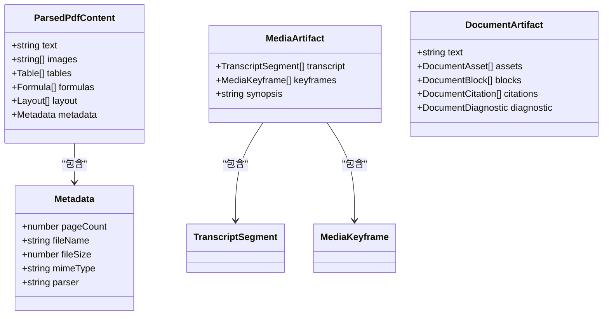
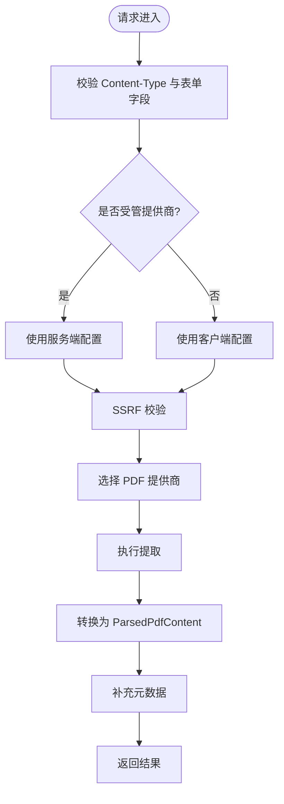
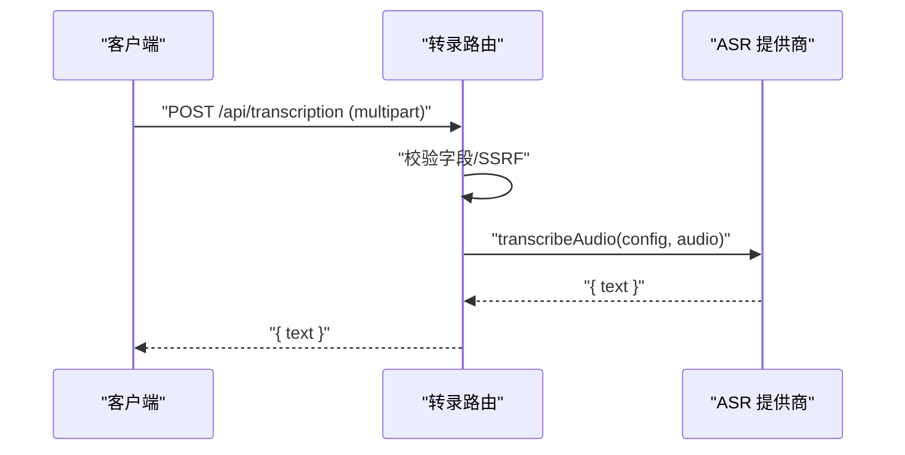
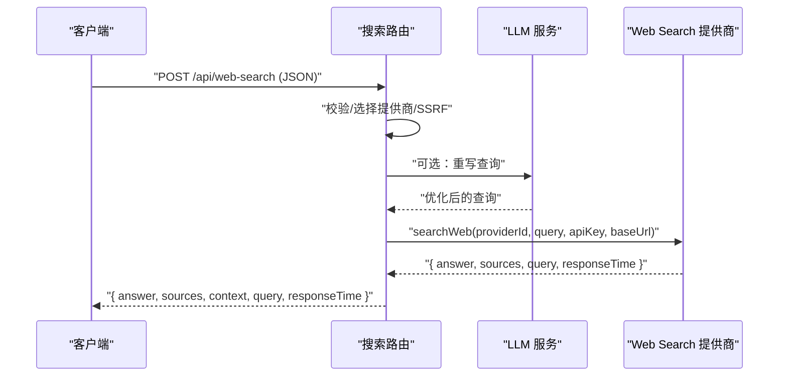
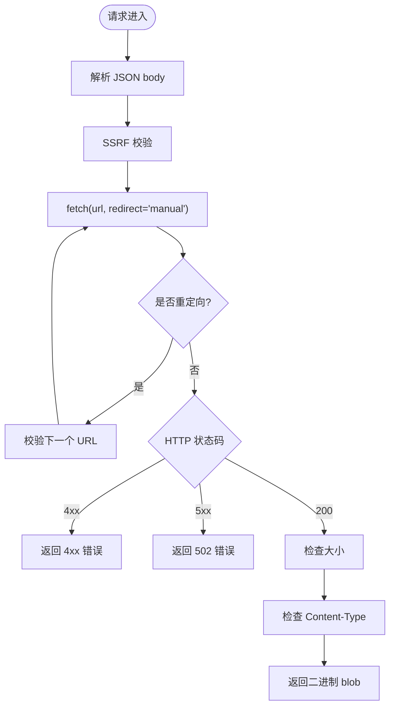
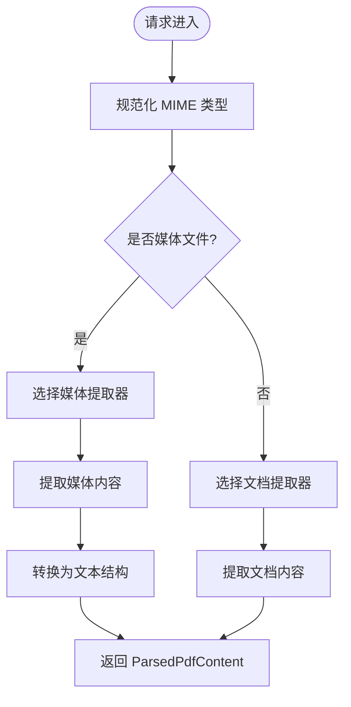
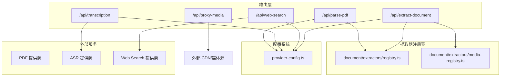

# 媒体处理 API

<cite>
**本文引用的文件**
- [app/api/parse-pdf/route.ts](file://app/api/parse-pdf/route.ts)
- [app/api/transcription/route.ts](file://app/api/transcription/route.ts)
- [app/api/web-search/route.ts](file://app/api/web-search/route.ts)
- [app/api/proxy-media/route.ts](file://app/api/proxy-media/route.ts)
- [app/api/extract-document/route.ts](file://app/api/extract-document/route.ts)
- [lib/document/index.ts](file://lib/document/index.ts)
- [lib/document/extract.ts](file://lib/document/extract.ts)
- [lib/document/extract-media.ts](file://lib/document/extract-media.ts)
- [lib/document/mime.ts](file://lib/document/mime.ts)
- [lib/document/extractors/registry.ts](file://lib/document/extractors/registry.ts)
- [lib/audio/asr-providers.ts](file://lib/audio/asr-providers.ts)
- [lib/web-search/index.ts](file://lib/web-search/index.ts)
- [lib/web-search/constants.ts](file://lib/web-search/constants.ts)
- [lib/server/provider-config.ts](file://lib/server/provider-config.ts)
- [lib/pdf/types.ts](file://lib/pdf/types.ts)
- [lib/pdf/constants.ts](file://lib/pdf/constants.ts)
- [lib/types/pdf.ts](file://lib/types/pdf.ts)
</cite>

## 产品概述
OpenMAIC 的媒体处理 API 提供统一的接口，用于解析 PDF、语音转文字（ASR）、网页搜索、媒体代理与文档提取。其核心价值在于：
- 统一多提供商接入（PDF、ASR、Web Search），通过服务器端配置管理密钥与基础地址，屏蔽下游差异。
- 安全边界：SSRF 校验、文件大小限制、超时控制、内容类型白名单等。
- 可扩展架构：基于提供者注册表与能力矩阵，按 MIME 类型与能力自动选择最佳实现。
- 面向课件生成：将 PDF/音视频/文本统一为结构化“文档工件”，供后续生成流水线消费。

适用场景包括：上传教材或讲义进行智能解析、将课堂录音转为字幕文本、结合上下文进行联网检索增强、跨域下载并缓存媒体资源到本地存储等。

## 核心业务流程
- PDF 解析流程：客户端上传 PDF → 路由校验与 SSRF 检查 → 选择 PDF 提取器 → 调用第三方或内置解析器 → 返回标准化 ParsedPdfContent（含文本、图片、元数据）。
- 语音转文字流程：客户端上传音频 → 路由校验与可选 SSRF 检查 → 根据 providerId 路由至 ASR 实现（OpenAI Whisper/Qwen/Azure/Lemonade）→ 返回转录文本。
- 网页搜索流程：客户端提交查询与可选 PDF 上下文 → 服务端重写查询（可调用 LLM）→ 选择 Web Search 提供商 → 聚合结果并格式化上下文 → 返回答案与来源。
- 媒体代理流程：客户端提交远程 URL → 服务端 SSRF 校验与重定向安全检查 → 限制大小与类型 → 以二进制流返回，便于前端持久化。
- 文档提取流程：支持 PDF、DOCX、PPTX、TXT/Markdown 以及音视频（MP4/MKV/AVI/MOV/WMV/MP3/WAV/AAC）→ 自动选择文档或媒体提取器 → 输出统一结构（文本/摘要/关键帧/转录片段）。

**图表来源**
- [app/api/parse-pdf/route.ts](file://app/api/parse-pdf/route.ts)
- [lib/document/extract.ts](file://lib/document/extract.ts)
- [lib/document/extractors/registry.ts](file://lib/document/extractors/registry.ts)

**章节来源**
- [app/api/parse-pdf/route.ts](file://app/api/parse-pdf/route.ts)
- [lib/document/extract.ts](file://lib/document/extract.ts)
- [lib/document/extractors/registry.ts](file://lib/document/extractors/registry.ts)

## 功能模块清单
- PDF 解析（/api/parse-pdf）
  - 职责：接收 PDF 文件，选择 PDF 提供商，返回结构化解析结果。
  - 输入：multipart/form-data，字段 pdf、providerId、apiKey、baseUrl。
  - 输出：{ data: ParsedPdfContent }，包含 text、images、metadata（pageCount、fileName、fileSize、parser）。
  - 关键点：受管提供商忽略客户端 key/baseUrl；生产环境对 baseUrl 做 SSRF 校验。
- 语音转文字（/api/transcription）
  - 职责：将音频文件转写为文本，支持多种 ASR 提供商。
  - 输入：multipart/form-data，字段 audio、providerId、modelId、language、apiKey、baseUrl。
  - 输出：{ text: string }。
  - 关键点：maxDuration=60s；受管提供商忽略客户端 key/baseUrl；生产环境对 baseUrl 做 SSRF 校验。
- 网页搜索（/api/web-search）
  - 职责：根据查询与可选 PDF 上下文，调用 Web Search 提供商，返回答案、来源与上下文。
  - 输入：JSON body，字段 query、pdfText、providerId、apiKey、baseUrl、baiduSubSources。
  - 输出：{ answer, sources, context, query, responseTime }。
  - 关键点：可选择使用 LLM 重写查询；受管提供商优先级高；SearXNG base URL 仅由服务端配置。
- 媒体代理（/api/proxy-media）
  - 职责：服务端代理下载远程媒体，规避浏览器 CORS 问题，限制大小与类型。
  - 输入：JSON body，字段 url。
  - 输出：二进制 blob，带正确的 Content-Type 与 Cache-Control。
  - 关键点：最大重定向次数 5；最大字节数 25MB；仅允许 image/video/audio 类型。
- 文档提取（/api/extract-document）
  - 职责：统一入口，支持文档与媒体提取，自动选择最佳提供商。
  - 输入：multipart/form-data，字段 file/pdf、providerId、apiKey、baseUrl、accessKeyId、accessKeySecret。
  - 输出：{ data: ParsedPdfContent }（文档）或媒体文本化结果（摘要/转录/关键帧）。
  - 关键点：支持 DOCX/PPTX/PDF/TXT/Markdown；音视频 MP4/MKV/AVI/MOV/WMV/MP3/WAV/AAC；最大 50MB；MIME 规范化与能力匹配。

**章节来源**
- [app/api/parse-pdf/route.ts](file://app/api/parse-pdf/route.ts)
- [app/api/transcription/route.ts](file://app/api/transcription/route.ts)
- [app/api/web-search/route.ts](file://app/api/web-search/route.ts)
- [app/api/proxy-media/route.ts](file://app/api/proxy-media/route.ts)
- [app/api/extract-document/route.ts](file://app/api/extract-document/route.ts)

## 数据与状态
- 核心数据模型
  - ParsedPdfContent：包含 text、images、tables、formulas、layout、metadata（pageCount、fileName、fileSize、mimeType、parser）。
  - MediaArtifact：包含 transcript（分段文本+时间戳）、keyframes（关键帧描述/OCR 文本）、synopsis（摘要）。
  - DocumentArtifact：文档抽象，包含文本块、图像、引用、诊断信息等。
- 状态流转
  - 路由层负责参数校验、SSRF 检查、受管提供商判定、配置解析。
  - 提取器注册表根据 MIME 类型与能力选择具体提供商。
  - 提供商实现返回原始工件，再由兼容层转换为统一格式。
- 数据所有权边界
  - 受管提供商的密钥与 base URL 由服务端配置决定，客户端传入值被忽略。
  - 非受管提供商完全依赖客户端传入的密钥与 base URL。

**图表来源**
- [lib/types/pdf.ts](file://lib/types/pdf.ts)
- [lib/document/types.ts](file://lib/document/types.ts)

**章节来源**
- [lib/types/pdf.ts](file://lib/types/pdf.ts)
- [lib/document/index.ts](file://lib/document/index.ts)

## 关键约束与边界
- 文件大小限制
  - 文档提取：最大 50MB。
  - 媒体代理：最大 25MB。
- 超时设置
  - 转录路由：maxDuration=60s。
  - 媒体代理：maxDuration=60s。
- 安全策略
  - 所有对外 URL 均进行 SSRF 校验（生产环境对 baseUrl、重定向目标严格检查）。
  - 媒体代理仅允许 image/video/audio 的 Content-Type，其他强制为 application/octet-stream。
- 提供商配置
  - 服务器端 YAML/环境变量优先，客户端传入值在受管模式下被忽略。
  - SearXNG base URL 仅由服务端配置，客户端不可覆盖。
- 错误恢复
  - 路由层捕获异常并返回标准错误响应（如 INVALID_REQUEST、MISSING_REQUIRED_FIELD、PARSE_FAILED、TRANSCRIPTION_FAILED、INTERNAL_ERROR）。
  - 短/静音音频被视为空转录，不抛错。
- 缓存策略
  - 媒体代理返回 private, max-age=3600，适合短期缓存。
  - 前端可将媒体持久化到 IndexedDB，避免重复下载。

**章节来源**
- [app/api/extract-document/route.ts](file://app/api/extract-document/route.ts)
- [app/api/proxy-media/route.ts](file://app/api/proxy-media/route.ts)
- [app/api/transcription/route.ts](file://app/api/transcription/route.ts)
- [lib/server/provider-config.ts](file://lib/server/provider-config.ts)

## 详细组件分析

### PDF 解析组件
- 路由逻辑：校验 multipart/form-data，解析 providerId/apiKey/baseUrl，受管模式忽略客户端 key/baseUrl，生产环境 SSRF 校验。
- 提取流程：调用 extractDocument()，选择 PDF 提供商（unpdf/mineru/mineru-cloud/alidocmind），转换结果为 ParsedPdfContent。
- 输出增强：补充 metadata（pageCount、fileName、fileSize、parser）。

**图表来源**
- [app/api/parse-pdf/route.ts](file://app/api/parse-pdf/route.ts)
- [lib/document/extract.ts](file://lib/document/extract.ts)
- [lib/document/extractors/registry.ts](file://lib/document/extractors/registry.ts)

**章节来源**
- [app/api/parse-pdf/route.ts](file://app/api/parse-pdf/route.ts)
- [lib/document/extract.ts](file://lib/document/extract.ts)
- [lib/document/extractors/registry.ts](file://lib/document/extractors/registry.ts)

### 语音转文字组件
- 路由逻辑：校验表单字段，默认 providerId=openai-whisper，受管模式忽略客户端 key/baseUrl，生产环境 SSRF 校验。
- 提供商实现：支持 OpenAI Whisper、Qwen ASR、Azure STT、Lemonade ASR，统一返回 { text }。
- 错误处理：短/静音音频返回空文本；网络错误抛出异常并被路由捕获。

**图表来源**
- [app/api/transcription/route.ts](file://app/api/transcription/route.ts)
- [lib/audio/asr-providers.ts](file://lib/audio/asr-providers.ts)

**章节来源**
- [app/api/transcription/route.ts](file://app/api/transcription/route.ts)
- [lib/audio/asr-providers.ts](file://lib/audio/asr-providers.ts)

### 网页搜索组件
- 路由逻辑：解析 JSON body，选择 Web Search 提供商（tavily/bocha/brave/baidu/minimax/doubao/searxng），受管提供商优先级高。
- 查询重写：可选调用 LLM 优化查询，结合 PDF 上下文提升相关性。
- 结果格式化：将搜索结果转换为上下文字符串，便于下游使用。

**图表来源**
- [app/api/web-search/route.ts](file://app/api/web-search/route.ts)
- [lib/web-search/index.ts](file://lib/web-search/index.ts)
- [lib/web-search/constants.ts](file://lib/web-search/constants.ts)

**章节来源**
- [app/api/web-search/route.ts](file://app/api/web-search/route.ts)
- [lib/web-search/index.ts](file://lib/web-search/index.ts)
- [lib/web-search/constants.ts](file://lib/web-search/constants.ts)

### 媒体代理组件
- 路由逻辑：解析 JSON body，校验 URL，限制重定向次数与大小，强制安全 Content-Type。
- 代理流程：手动处理重定向，每跳都进行 SSRF 校验，最终返回二进制 blob。
- 缓存策略：返回 private, max-age=3600，适合短期缓存。

**图表来源**
- [app/api/proxy-media/route.ts](file://app/api/proxy-media/route.ts)

**章节来源**
- [app/api/proxy-media/route.ts](file://app/api/proxy-media/route.ts)

### 文档提取组件
- 路由逻辑：支持文档与媒体提取，自动选择最佳提供商，校验 MIME 类型与能力。
- 媒体提取：将音视频转换为文本化结构（摘要/转录/关键帧），统一为 ParsedPdfContent 形状。
- 错误处理：无可用内容时返回 422 错误，提示无法提取任何信息。

**图表来源**
- [app/api/extract-document/route.ts](file://app/api/extract-document/route.ts)
- [lib/document/extract-media.ts](file://lib/document/extract-media.ts)
- [lib/document/mime.ts](file://lib/document/mime.ts)

**章节来源**
- [app/api/extract-document/route.ts](file://app/api/extract-document/route.ts)
- [lib/document/extract-media.ts](file://lib/document/extract-media.ts)
- [lib/document/mime.ts](file://lib/document/mime.ts)

## 依赖分析
- 提供商配置系统：server-providers.yml 与环境变量共同决定受管提供商，提供 resolve*ApiKey/BaseUrl 函数。
- 提取器注册表：按 MIME 类型与能力选择提供商，确保类型安全与扩展性。
- 外部服务集成：PDF 解析（unpdf/mineru/alidocmind）、ASR（OpenAI/Qwen/Azure/Lemonade）、Web Search（Tavily/Bocha/Brave/Baidu/MiniMax/Doubao/SearXNG）。

**图表来源**
- [lib/server/provider-config.ts](file://lib/server/provider-config.ts)
- [lib/document/extractors/registry.ts](file://lib/document/extractors/registry.ts)
- [lib/audio/asr-providers.ts](file://lib/audio/asr-providers.ts)
- [lib/web-search/index.ts](file://lib/web-search/index.ts)

**章节来源**
- [lib/server/provider-config.ts](file://lib/server/provider-config.ts)
- [lib/document/extractors/registry.ts](file://lib/document/extractors/registry.ts)
- [lib/audio/asr-providers.ts](file://lib/audio/asr-providers.ts)
- [lib/web-search/index.ts](file://lib/web-search/index.ts)

## 性能考虑
- 批量处理建议
  - 文档提取：合并多个小文件为 bundle，减少网络往返。
  - 语音转文字：分片长音频，避免单次请求过大。
  - 网页搜索：并行调用多个提供商，取最优结果。
- 缓存策略
  - 媒体代理：利用 Cache-Control 短期缓存，前端持久化到 IndexedDB。
  - 文档解析：对相同文件哈希缓存解析结果。
- 并发控制
  - 通过环境变量 PARALLEL_SCENE_CONCURRENCY 控制并发度，避免限流。
- 超时与重试
  - 合理设置 maxDuration，对瞬时错误实施指数退避重试。

[本节为通用指导，无需特定文件来源]

## 故障排除指南
- 常见问题
  - PDF 解析失败：检查 providerId 是否正确，确认 baseUrl 可达且未触发 SSRF。
  - 语音转文字为空：确认音频非静音/过短，检查语言代码与提供商支持格式。
  - 网页搜索无结果：验证 API Key 是否配置，尝试不同提供商。
  - 媒体代理失败：检查 URL 是否有效，确认重定向链不超过 5 次。
- 调试步骤
  - 查看服务端日志，定位错误堆栈。
  - 使用健康检查端点验证外部服务连通性。
  - 逐步缩小问题范围（如更换提供商、简化输入）。

**章节来源**
- [app/api/parse-pdf/route.ts](file://app/api/parse-pdf/route.ts)
- [app/api/transcription/route.ts](file://app/api/transcription/route.ts)
- [app/api/web-search/route.ts](file://app/api/web-search/route.ts)
- [app/api/proxy-media/route.ts](file://app/api/proxy-media/route.ts)

## 结论
OpenMAIC 媒体处理 API 通过统一的接口与安全边界，实现了 PDF 解析、语音转文字、网页搜索、媒体代理与文档提取的核心能力。其灵活的提供商架构与严格的配置管理，确保了系统的可扩展性与安全性。在实际部署中，建议结合业务需求选择合适的提供商，并充分利用缓存与并发控制优化性能。

[本节为总结性内容，无需特定文件来源]