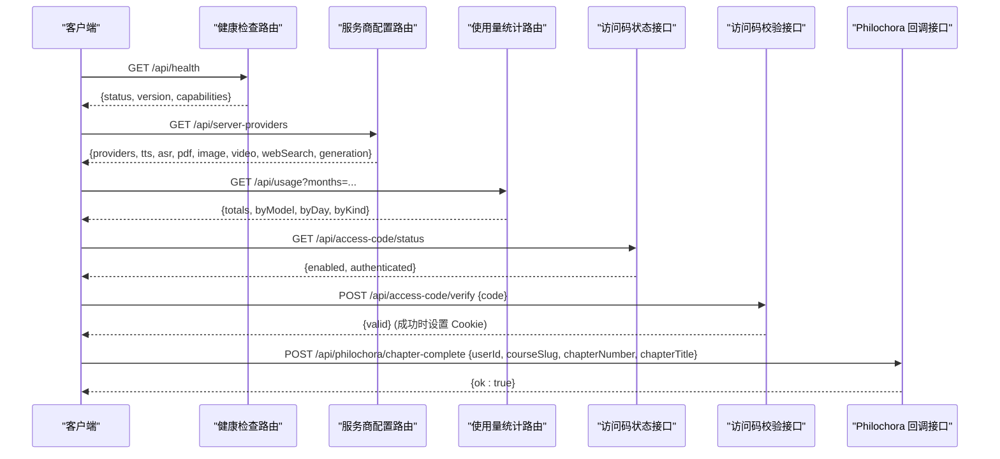
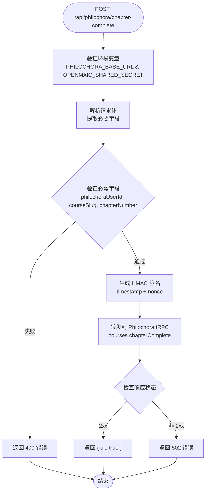

# 工具类 API

<cite>
**本文引用的文件**   
- [健康检查路由](file://app/api/health/route.ts)
- [服务商配置路由](file://app/api/server-providers/route.ts)
- [使用量统计路由](file://app/api/usage/route.ts)
- [访问码状态接口](file://app/api/access-code/status/route.ts)
- [访问码校验接口](file://app/api/access-code/verify/route.ts)
- [Philochora 章节完成回调接口](file://app/api/philochora/chapter-complete/route.ts)
- [连续学习组件](file://components/scene-renderers/next-lesson.tsx)
- [日志工具](file://lib/logger.ts)
- [访问令牌测试](file://tests/server/access-token.test.ts)
- [使用量接口测试](file://tests/usage/route.test.ts)
- [连续学习回调 E2E 测试](file://e2e/tests/continuous-learning-callback.spec.ts)
</cite>

## 产品概述
本章节面向 OpenMAIC 的"工具类 API"，聚焦系统运维与辅助能力，包括：
- 健康检查：对外暴露服务版本与核心能力开关（搜索、图像、视频、TTS）。
- 服务商配置：集中返回服务端可用的各类提供商及并发限制等运行参数。
- 使用量统计：聚合部署级用量记录，按模型、日期、模态维度汇总，支持按月筛选。
- 访问码管理：基于环境变量 ACCESS_CODE 的可选访问控制，提供状态查询与校验登录。
- **新增** Philochora 进度同步：为外部课程平台提供章节完成回调接口，实现学习进度自动上报。

这些接口为前端设置页、监控面板、权限守卫、连续学习等功能模块提供统一的数据来源与鉴权入口，支撑系统的可观测性、可配置性、安全性与跨平台集成能力。

## 核心业务流程
- 健康检查流程
  - 客户端 GET /api/health
  - 服务端读取各类型提供商配置，判断能力是否可用
  - 返回包含版本与能力布尔标志的统一成功响应

- 服务商配置获取流程
  - 客户端 GET /api/server-providers
  - 服务端聚合多类提供商信息与并发参数
  - 返回统一的成功结构；异常时返回错误并记录日志

- 使用量统计流程
  - 客户端 GET /api/usage?months=YYYY-MM,...
  - 服务端读取用量记录并按模型/日期/模态聚合
  - 返回总量与各分组桶；异常时记录日志并返回错误

- 访问码管理流程
  - 客户端 GET /api/access-code/status：根据环境变量与 Cookie 中的令牌判定启用与认证状态
  - 客户端 POST /api/access-code/verify：提交访问码进行常量时间比较，成功后写入安全 Cookie

- **新增** Philochora 进度同步流程
  - 客户端 POST /api/philochora/chapter-complete：提交章节完成事件
  - 服务端验证配置并进行 HMAC 签名
  - 转发到 Philochora tRPC 端点完成进度记录

**图表来源** 
- [健康检查路由:1-23](file://app/api/health/route.ts#L1-L23)
- [服务商配置路由:1-39](file://app/api/server-providers/route.ts#L1-L39)
- [使用量统计路由:1-117](file://app/api/usage/route.ts#L1-L117)
- [访问码状态接口:1-18](file://app/api/access-code/status/route.ts#L1-L18)
- [访问码校验接口:1-42](file://app/api/access-code/verify/route.ts#L1-L42)
- [Philochora 章节完成回调接口:16-93](file://app/api/philochora/chapter-complete/route.ts#L16-L93)

**章节来源**
- [健康检查路由:1-23](file://app/api/health/route.ts#L1-L23)
- [服务商配置路由:1-39](file://app/api/server-providers/route.ts#L1-L39)
- [使用量统计路由:1-117](file://app/api/usage/route.ts#L1-L117)
- [访问码状态接口:1-18](file://app/api/access-code/status/route.ts#L1-L18)
- [访问码校验接口:1-42](file://app/api/access-code/verify/route.ts#L1-L42)
- [Philochora 章节完成回调接口:16-93](file://app/api/philochora/chapter-complete/route.ts#L16-L93)

## 功能模块清单
- 健康检查
  - 职责：返回服务版本与能力开关（webSearch、imageGeneration、videoGeneration、tts）
  - 验收要点：capabilities 布尔值准确反映对应提供商可用性；version 非空
  - 参考实现路径：[健康检查路由:1-23](file://app/api/health/route.ts#L1-L23)

- 服务商配置
  - 职责：聚合 providers、tts、asr、pdf、image、video、webSearch 以及 generation.parallelSceneConcurrency
  - 验收要点：所有字段存在且结构一致；异常时返回标准错误
  - 参考实现路径：[服务商配置路由:1-39](file://app/api/server-providers/route.ts#L1-L39)

- 使用量统计
  - 职责：读取 usage 记录，按 model/day/kind 聚合，输出 totals 与分组桶
  - 验收要点：LLM token 合计不重复计入缓存字段；排序符合约定；支持 months 过滤
  - 参考实现路径：[使用量统计路由:1-117](file://app/api/usage/route.ts#L1-L117)

- 访问码管理
  - 职责：根据 ACCESS_CODE 决定是否启用访问控制；校验通过后设置安全 Cookie
  - 验收要点：常量时间比较；Cookie 安全属性正确；状态接口返回 enabled/authenticated
  - 参考实现路径：
    - [访问码状态接口:1-18](file://app/api/access-code/status/route.ts#L1-L18)
    - [访问码校验接口:1-42](file://app/api/access-code/verify/route.ts#L1-L42)

- **新增** Philochora 章节完成回调
  - 职责：接收前端章节完成事件，进行 HMAC 签名后转发到 Philochora tRPC 端点
  - 验收要点：必需字段验证（philochoraUserId、courseSlug、chapterNumber）；HMAC 签名生成；错误处理完善
  - 参考实现路径：[Philochora 章节完成回调接口:16-93](file://app/api/philochora/chapter-complete/route.ts#L16-L93)

**章节来源**
- [健康检查路由:1-23](file://app/api/health/route.ts#L1-L23)
- [服务商配置路由:1-39](file://app/api/server-providers/route.ts#L1-L39)
- [使用量统计路由:1-117](file://app/api/usage/route.ts#L1-L117)
- [访问码状态接口:1-18](file://app/api/access-code/status/route.ts#L1-L18)
- [访问码校验接口:1-42](file://app/api/access-code/verify/route.ts#L1-L42)
- [Philochora 章节完成回调接口:16-93](file://app/api/philochora/chapter-complete/route.ts#L16-L93)

## 数据与状态
- 健康检查响应
  - status: 固定字符串
  - version: 从包版本或默认值获取
  - capabilities: 布尔对象，表示 webSearch/imageGeneration/videoGeneration/tts 是否可用

- 服务商配置响应
  - providers: 通用提供商列表
  - tts/asr/pdf/image/video/webSearch: 各自类型的提供商信息
  - generation.parallelSceneConcurrency: 场景生成并发度

- 使用量统计响应
  - totals.requests: 总请求数
  - totals.llmTokens: LLM 输入+输出 token 总和（不含缓存细节重复计算）
  - byModel/byDay/byKind: 数组桶，每个桶包含 key/kind/unit/requests/inputTokens/outputTokens/cacheReadTokens/cacheCreationTokens/totalTokens/quantity

- 访问码状态响应
  - enabled: 是否启用访问码
  - authenticated: 当前会话是否已通过访问码验证

- 访问码校验请求/响应
  - 请求体：{ code }
  - 响应体：{ valid }
  - 成功时设置 Cookie openmaic_access（httpOnly、sameSite=lax、path=/、maxAge=7天、secure=生产环境）

- **新增** Philochora 章节完成回调
  - 请求体：{ philochoraUserId, courseSlug, chapterNumber, chapterTitle? }
  - 响应体：{ ok: boolean, error?: string }
  - 成功时返回 { ok: true }，失败时返回具体错误信息

**图表来源** 
- [Philochora 章节完成回调接口:16-93](file://app/api/philochora/chapter-complete/route.ts#L16-L93)

**章节来源**
- [使用量统计路由:1-117](file://app/api/usage/route.ts#L1-L117)
- [Philochora 章节完成回调接口:16-93](file://app/api/philochora/chapter-complete/route.ts#L16-L93)

## 关键约束与边界
- 健康检查
  - 能力检测依赖各类型提供商配置的可用性；若某类提供商为空或禁用，则对应 capability 为 false
  - 版本来源于 npm_package_version 或默认值

- 服务商配置
  - 所有提供商信息通过统一的 server provider-config 模块聚合
  - 并发参数 generation.parallelSceneConcurrency 由运行时配置决定

- 使用量统计
  - 仅读取 data/usage/*.jsonl 的记录，纯聚合逻辑，无成本
  - 支持 ?months=YYYY-MM,... 过滤；未传参则读取全部
  - LLM token 总计不包含缓存读/写计数重复累加；缓存细节作为独立字段保留

- 访问码管理
  - 当 ACCESS_CODE 未设置时，校验接口直接返回 valid=true（无需鉴权）
  - 校验采用常量时间比较防止时序攻击
  - Cookie 安全属性在生产环境启用 secure；跨站策略 sameSite=lax

- **新增** Philochora 章节完成回调
  - 必需环境变量：PHILOCHORA_BASE_URL（回调目标地址）、OPENMAIC_SHARED_SECRET（HMAC 密钥）
  - 必需字段：philochoraUserId（用户ID）、courseSlug（课程标识）、chapterNumber（章节序号）
  - 可选字段：chapterTitle（章节标题）
  - 安全机制：服务端生成 HMAC 签名，避免密钥泄露到浏览器
  - 错误处理：配置缺失返回 503，字段验证失败返回 400，外部调用失败返回 502

- 日志与监控
  - 所有错误路径均通过 createLogger(tag) 输出结构化日志
  - 日志级别可通过 LOG_LEVEL 控制；格式可通过 LOG_FORMAT=json 切换 JSON 输出

- 性能与可扩展性
  - 使用量聚合在内存中完成，适合中小规模数据集；大规模场景建议分页或增量聚合
  - 健康检查与服务商配置为轻量读取，延迟低
  - Philochora 回调为异步操作，不影响主流程体验

- 安全考虑
  - 访问码校验避免明文比较，使用 timingSafeEqual
  - Cookie 标记 httpOnly 与 sameSite，减少 XSS/CSRF 风险
  - 生产环境启用 secure，确保 HTTPS
  - Philochora 回调使用 HMAC 签名验证请求完整性

**章节来源**
- [健康检查路由:1-23](file://app/api/health/route.ts#L1-L23)
- [服务商配置路由:1-39](file://app/api/server-providers/route.ts#L1-L39)
- [使用量统计路由:1-117](file://app/api/usage/route.ts#L1-L117)
- [访问码状态接口:1-18](file://app/api/access-code/status/route.ts#L1-L18)
- [访问码校验接口:1-42](file://app/api/access-code/verify/route.ts#L1-L42)
- [Philochora 章节完成回调接口:16-93](file://app/api/philochora/chapter-complete/route.ts#L16-L93)
- [日志工具:1-53](file://lib/logger.ts#L1-L53)
- [访问令牌测试:1-17](file://tests/server/access-token.test.ts#L1-L17)
- [使用量接口测试:1-41](file://tests/usage/route.test.ts#L1-L41)

## 集成指南与最佳实践
- 健康检查
  - 启动后轮询 /api/health，用于服务就绪探测与能力展示
  - 将 capabilities 映射到前端功能开关

- 服务商配置
  - 应用启动时调用 /api/server-providers 获取可用提供商与并发限制
  - 动态刷新：在用户修改设置后重新拉取以反映最新配置

- 使用量统计
  - 定时拉取 /api/usage?months=YYYY-MM,... 构建仪表盘
  - 对 byModel 排序展示 Top N 模型；byDay 用于趋势图；byKind 用于模态分布

- 访问码管理
  - 首次进入页面调用 /api/access-code/status 判断是否需要鉴权
  - 若 enabled=true，引导用户输入访问码并通过 /api/access-code/verify 提交
  - 校验成功后，后续受保护资源可信任 Cookie openmaic_access

- **新增** Philochora 进度同步集成
  - 前端在课堂完成页挂载时自动触发章节完成回调
  - 确保配置环境变量 PHILOCHORA_BASE_URL 和 OPENMAIC_SHARED_SECRET
  - 前端只需发送基础字段，服务端负责 HMAC 签名和安全转发
  - 回调失败应静默处理，不影响用户体验

- 错误处理
  - 统一解析 apiError 返回的错误码与消息，提示用户或重试
  - 对网络异常与超时进行指数退避重试
  - Philochora 回调失败不应影响主流程，采用降级策略

- 日志与监控
  - 结合 LOG_LEVEL 与 LOG_FORMAT=json 接入集中式日志平台
  - 对关键接口（usage、access-code、philochora）增加请求耗时与错误率指标
  - 监控 Philochora 回调成功率，及时发现外部服务异常

- 运维配置
  - 通过环境变量 ACCESS_CODE 启用访问控制
  - 通过 NODE_ENV=production 启用 Cookie secure
  - 通过 LOG_LEVEL 调整日志粒度；LOG_FORMAT=json 便于机器解析
  - 通过 PHILOCHORA_BASE_URL 和 OPENMAIC_SHARED_SECRET 配置进度同步

**章节来源**
- [健康检查路由:1-23](file://app/api/health/route.ts#L1-L23)
- [服务商配置路由:1-39](file://app/api/server-providers/route.ts#L1-L39)
- [使用量统计路由:1-117](file://app/api/usage/route.ts#L1-L117)
- [访问码状态接口:1-18](file://app/api/access-code/status/route.ts#L1-L18)
- [访问码校验接口:1-42](file://app/api/access-code/verify/route.ts#L1-L42)
- [Philochora 章节完成回调接口:16-93](file://app/api/philochora/chapter-complete/route.ts#L16-L93)
- [连续学习组件:41-56](file://components/scene-renderers/next-lesson.tsx#L41-L56)
- [日志工具:1-53](file://lib/logger.ts#L1-L53)

## 结论
OpenMAIC 的工具类 API 提供了稳定的健康检查、服务商配置、使用量统计、访问码管理与 Philochora 进度同步能力，满足系统监控、动态配置、资源统计、访问控制与跨平台集成的核心需求。通过统一的响应结构与完善的错误处理、日志记录与安全策略，便于前后端高效集成与运维管理。新增的 Philochora 章节完成回调接口实现了与外部课程平台的无缝集成，支持学习进度的自动上报与同步。建议在生产环境中启用访问码控制、HTTPS 与结构化日志，并结合监控指标持续优化系统稳定性与可观测性。