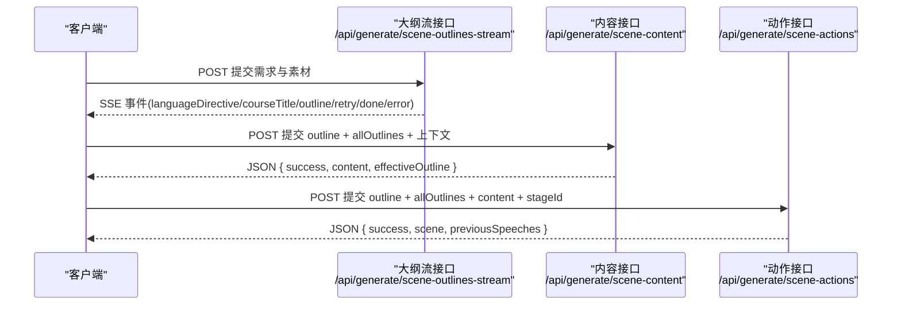
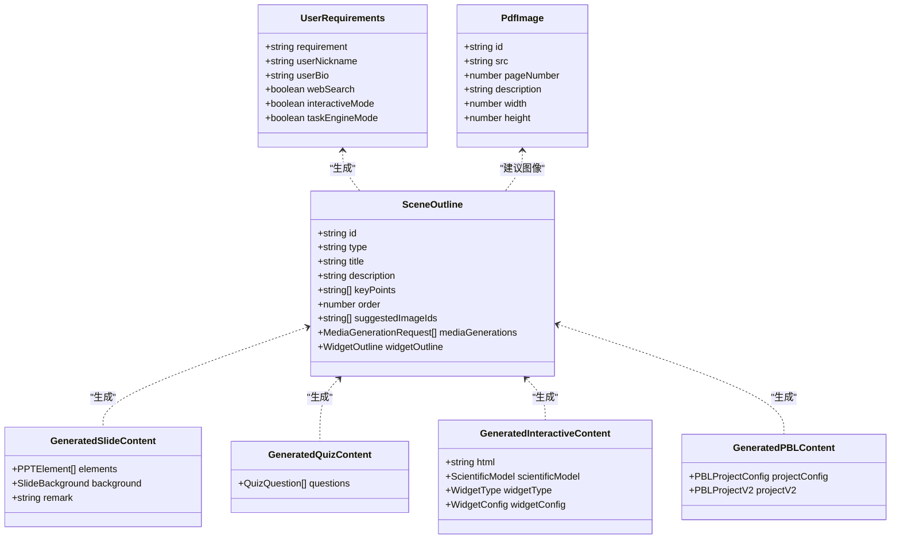
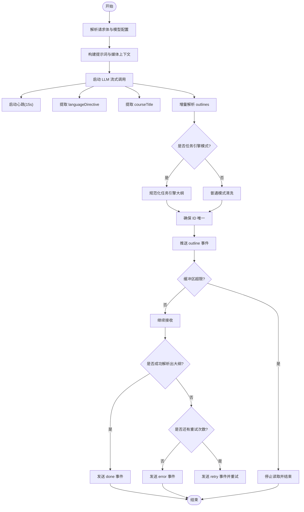
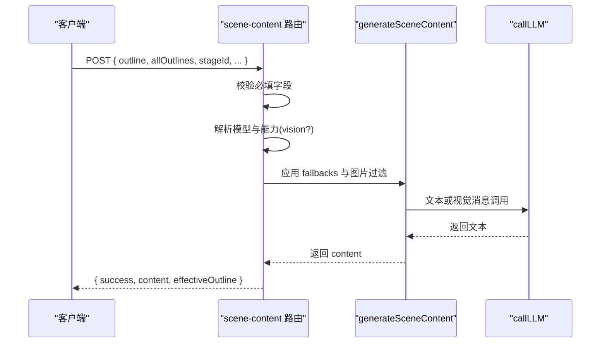
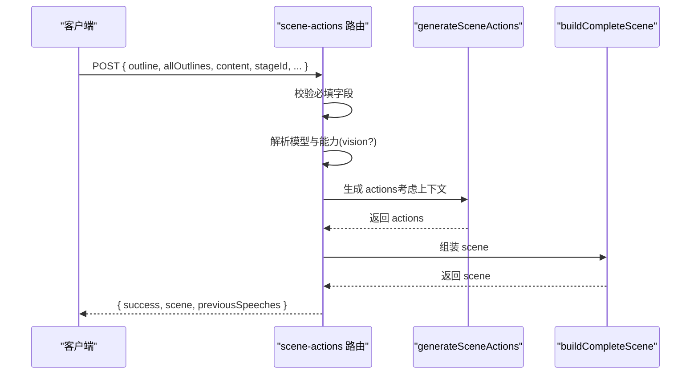
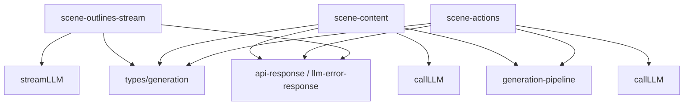

# 场景生成 API

<cite>
**本文引用的文件**
- [app/api/generate/scene-outlines-stream/route.ts](file://app/api/generate/scene-outlines-stream/route.ts)
- [app/api/generate/scene-content/route.ts](file://app/api/generate/scene-content/route.ts)
- [app/api/generate/scene-actions/route.ts](file://app/api/generate/scene-actions/route.ts)
- [lib/types/generation.ts](file://lib/types/generation.ts)
- [lib/generation/generation-pipeline.ts](file://lib/generation/generation-pipeline.ts)
- [lib/generation/pipeline-types.ts](file://lib/generation/pipeline-types.ts)
- [lib/server/api-response.ts](file://lib/server/api-response.ts)
- [lib/server/llm-error-response.ts](file://lib/server/llm-error-response.ts)
</cite>

## 产品概述
OpenMAIC 的场景生成 API 提供从“需求”到“完整课件场景”的端到端能力，覆盖三大核心接口：
- 场景大纲流式生成（SSE）：根据用户需求与文档素材，增量输出结构化大纲，支持语言指令、课程标题、逐条大纲事件与完成事件。
- 场景内容生成：基于单条大纲与上下文，生成具体页面内容（幻灯片、测验、交互式、PBL）。
- 场景动作生成：结合大纲与内容，生成动作序列并组装为完整场景对象。

目标用户包括教师、课程设计者与开发者；核心价值在于以 AI 驱动快速产出高质量、可交互的多媒体课件，并支持多智能体协作与视觉增强。

## 核心业务流程
整体流程分为两阶段：
- 阶段一：需求 → 大纲（SSE 流式返回）
- 阶段二：大纲 → 内容 → 动作 → 完整场景

**图表来源**
- [app/api/generate/scene-outlines-stream/route.ts](file://app/api/generate/scene-outlines-stream/route.ts)
- [app/api/generate/scene-content/route.ts](file://app/api/generate/scene-content/route.ts)
- [app/api/generate/scene-actions/route.ts](file://app/api/generate/scene-actions/route.ts)

**章节来源**
- [app/api/generate/scene-outlines-stream/route.ts](file://app/api/generate/scene-outlines-stream/route.ts)
- [app/api/generate/scene-content/route.ts](file://app/api/generate/scene-content/route.ts)
- [app/api/generate/scene-actions/route.ts](file://app/api/generate/scene-actions/route.ts)

## 功能模块清单
- 场景大纲流式生成（SSE）
  - 职责：解析需求与文档素材，构建提示词，流式调用 LLM，增量解析并推送大纲条目，维护心跳与重试，最终汇总 done 事件。
  - 验收要点：支持 languageDirective 与 courseTitle 早期提取；按顺序递增 order；保证 id 唯一；支持任务引擎模式与普通模式的差异化处理；错误时返回 error 事件。
- 场景内容生成
  - 职责：根据 outline 与 allOutlines 上下文，调用 LLM 生成具体内容（slide/quiz/interactive/pbl），支持视觉增强与语言指令透传。
  - 验收要点：必填字段校验；模型选择与能力检测；失败统一错误封装；返回 content 与 effectiveOutline。
- 场景动作生成
  - 职责：基于 outline 与 content 生成 actions，并组装完整 scene；维护跨页演讲连贯性。
  - 验收要点：必填字段校验；跨页上下文构建；返回 scene 与 previousSpeeches。

**章节来源**
- [app/api/generate/scene-outlines-stream/route.ts](file://app/api/generate/scene-outlines-stream/route.ts)
- [app/api/generate/scene-content/route.ts](file://app/api/generate/scene-content/route.ts)
- [app/api/generate/scene-actions/route.ts](file://app/api/generate/scene-actions/route.ts)

## 数据与状态
- 输入类型
  - UserRequirements：包含 requirement、userNickname、userBio、webSearch、interactiveMode、taskEngineMode 等。
  - PdfImage：PDF 抽取图像元数据，含 id、src、pageNumber、description、width、height 等。
  - ImageMapping：id → base64 URL 映射。
  - SceneOutline：大纲结构，含 id、type、title、description、keyPoints、order、suggestedImageIds、mediaGenerations、quizConfig、widgetType/widgetOutline 等。
  - GeneratedSlideContent / GeneratedQuizContent / GeneratedInteractiveContent / GeneratedPBLContent：各类型内容结构。
- 关键状态流转
  - 大纲流：languageDirective → courseTitle → outline（多次）→ retry（可选）→ done（汇总 outlines、languageDirective、courseTitle、taskEngineMode）或 error。
  - 内容生成：effectiveOutline 由 applyOutlineFallbacks 修正；aiCall 根据 vision 能力选择文本或视觉消息；返回 content。
  - 动作生成：构建 SceneGenerationContext（pageIndex、totalPages、allTitles、previousSpeeches）；生成 actions；buildCompleteScene 组装 scene；提取 previousSpeeches 用于后续连贯。

**图表来源**
- [lib/types/generation.ts](file://lib/types/generation.ts)
- [lib/generation/pipeline-types.ts](file://lib/generation/pipeline-types.ts)

**章节来源**
- [lib/types/generation.ts](file://lib/types/generation.ts)
- [lib/generation/pipeline-types.ts](file://lib/generation/pipeline-types.ts)

## 关键约束与边界
- HTTP 方法与 URL
  - POST /api/generate/scene-outlines-stream：SSE 流式返回大纲。
  - POST /api/generate/scene-content：返回 JSON 内容。
  - POST /api/generate/scene-actions：返回 JSON 完整场景。
- 请求参数与 DSL
  - 大纲流：requirements（UserRequirements）、pdfText、pdfImages、imageMapping、researchContext、agents（AgentInfo[]）。
  - 内容生成：outline（SceneOutline）、allOutlines（SceneOutline[]）、stageId、stageInfo、agents、languageDirective、requirements。
  - 动作生成：outline、allOutlines、content（各类型内容）、stageId、agents、previousSpeeches、userProfile、languageDirective。
- 响应格式
  - 大纲流：SSE 事件 data: {...}，包含 languageDirective、courseTitle、outline、retry、done、error。
  - 内容/动作：JSON { success, ...data } 或 { success: false, errorCode, error, details? }。
- 安全与认证
  - 通过 resolveModelFromRequest 解析模型配置；上游错误统一封装为 llmApiError；速率限制与鉴权错误映射为 RATE_LIMITED 或 UPSTREAM_ERROR。
- 性能与可靠性
  - 心跳保活（15s）；最大流缓冲上限（512KB）；自动重试（最多 2 次）；断连中止（AbortSignal）；去重 ID 与顺序稳定。

**章节来源**
- [app/api/generate/scene-outlines-stream/route.ts](file://app/api/generate/scene-outlines-stream/route.ts)
- [app/api/generate/scene-content/route.ts](file://app/api/generate/scene-content/route.ts)
- [app/api/generate/scene-actions/route.ts](file://app/api/generate/scene-actions/route.ts)
- [lib/server/api-response.ts](file://lib/server/api-response.ts)
- [lib/server/llm-error-response.ts](file://lib/server/llm-error-response.ts)

## 详细接口说明

### 接口一：场景大纲流式生成（SSE）
- 方法：POST
- URL：/api/generate/scene-outlines-stream
- 请求体
  - requirements：UserRequirements（必需）
  - pdfText：string（可选）
  - pdfImages：PdfImage[]（可选）
  - imageMapping：ImageMapping（可选）
  - researchContext：string（可选）
  - agents：AgentInfo[]（可选）
  - 头部控制
    - x-image-generation-enabled：true/false
    - x-video-generation-enabled：true/false
- 响应
  - Content-Type: text/event-stream
  - SSE 事件
    - languageDirective：{ type: 'languageDirective', data: string }
    - courseTitle：{ type: 'courseTitle', data: string }
    - outline：{ type: 'outline', data: SceneOutline, index: number }
    - retry：{ type: 'retry', attempt: number, maxAttempts: number }
    - done：{ type: 'done', outlines: SceneOutline[], languageDirective: string, courseTitle?: string, taskEngineMode: boolean }
    - error：{ type: 'error', error: string }
- 行为特性
  - 增量解析 JSON 数组与包装对象，O(n) 扫描；
  - 心跳保活防止超时；
  - 自动重试（最多 2 次），并在重试时发送 retry 事件；
  - 去重 ID、顺序递增；
  - 任务引擎模式与普通模式差异化处理。

**图表来源**
- [app/api/generate/scene-outlines-stream/route.ts](file://app/api/generate/scene-outlines-stream/route.ts)

**章节来源**
- [app/api/generate/scene-outlines-stream/route.ts](file://app/api/generate/scene-outlines-stream/route.ts)

### 接口二：场景内容生成
- 方法：POST
- URL：/api/generate/scene-content
- 请求体
  - outline：SceneOutline（必需）
  - allOutlines：SceneOutline[]（必需且非空）
  - stageId：string（必需）
  - stageInfo：{ name, description?, style? }（可选）
  - pdfImages：PdfImage[]（可选）
  - imageMapping：ImageMapping（可选）
  - agents：AgentInfo[]（可选）
  - languageDirective：string（可选）
  - requirements：UserRequirements（可选）
- 响应
  - JSON：{ success: true, content, effectiveOutline }
  - 错误：{ success: false, errorCode, error, details? }
- 行为特性
  - 模型选择按类型路由（如 scene-content:quiz）；
  - 视觉增强：当模型具备 vision 能力且存在 images 时，使用 messages 构造视觉用户内容；
  - 应用 fallback 策略（allowProceduralSkill 受 vocationalActive 控制）；
  - 过滤 assignedImages 并按优先级排序；
  - 统一错误封装（llmApiError）。

**图表来源**
- [app/api/generate/scene-content/route.ts](file://app/api/generate/scene-content/route.ts)
- [lib/generation/generation-pipeline.ts](file://lib/generation/generation-pipeline.ts)

**章节来源**
- [app/api/generate/scene-content/route.ts](file://app/api/generate/scene-content/route.ts)
- [lib/generation/generation-pipeline.ts](file://lib/generation/generation-pipeline.ts)

### 接口三：场景动作生成
- 方法：POST
- URL：/api/generate/scene-actions
- 请求体
  - outline：SceneOutline（必需）
  - allOutlines：SceneOutline[]（必需且非空）
  - content：GeneratedSlideContent | GeneratedQuizContent | GeneratedInteractiveContent | GeneratedPBLContent（必需）
  - stageId：string（必需）
  - agents：AgentInfo[]（可选）
  - previousSpeeches：string[]（可选）
  - userProfile：string（可选）
  - languageDirective：string（可选）
- 响应
  - JSON：{ success: true, scene, previousSpeeches }
  - 错误：{ success: false, errorCode, error, details? }
- 行为特性
  - 构建跨页上下文（pageIndex、totalPages、allTitles、previousSpeeches）；
  - 生成 actions 并组装 scene；
  - 提取 previousSpeeches 用于后续连贯。

**图表来源**
- [app/api/generate/scene-actions/route.ts](file://app/api/generate/scene-actions/route.ts)
- [lib/generation/generation-pipeline.ts](file://lib/generation/generation-pipeline.ts)

**章节来源**
- [app/api/generate/scene-actions/route.ts](file://app/api/generate/scene-actions/route.ts)
- [lib/generation/generation-pipeline.ts](file://lib/generation/generation-pipeline.ts)

## 依赖分析
- 组件耦合
  - 三个路由均依赖 resolveModelFromRequest 进行模型解析；
  - 内容/动作生成依赖 generation-pipeline 中的函数（generateSceneContent、generateSceneActions、buildCompleteScene）；
  - 错误处理统一使用 api-response 与 llm-error-response。
- 外部依赖
  - LLM 调用（streamLLM/callLLM）；
  - 文档与媒体工具（sortDocumentImagesForVision、formatImageDescription/Placeholder、buildVisionUserContent）。

**图表来源**
- [app/api/generate/scene-outlines-stream/route.ts](file://app/api/generate/scene-outlines-stream/route.ts)
- [app/api/generate/scene-content/route.ts](file://app/api/generate/scene-content/route.ts)
- [app/api/generate/scene-actions/route.ts](file://app/api/generate/scene-actions/route.ts)
- [lib/generation/generation-pipeline.ts](file://lib/generation/generation-pipeline.ts)
- [lib/types/generation.ts](file://lib/types/generation.ts)
- [lib/server/api-response.ts](file://lib/server/api-response.ts)
- [lib/server/llm-error-response.ts](file://lib/server/llm-error-response.ts)

**章节来源**
- [lib/generation/generation-pipeline.ts](file://lib/generation/generation-pipeline.ts)
- [lib/types/generation.ts](file://lib/types/generation.ts)
- [lib/server/api-response.ts](file://lib/server/api-response.ts)
- [lib/server/llm-error-response.ts](file://lib/server/llm-error-response.ts)

## 性能考虑
- 流式传输
  - 心跳保活（15s）避免连接超时；
  - 增量解析 JSON，避免 O(n²) 开销；
  - 最大缓冲 512KB 防止内存膨胀。
- 重试机制
  - 最多 2 次重试，减少一次性失败影响；
  - 客户端需处理 retry 事件并更新进度。
- 并发与资源
  - 媒体生成在客户端并行处理，API 仅占位符；
  - 断连中止（AbortSignal）及时释放上游资源。
- 优化建议
  - 合理设置 maxOutputTokens；
  - 使用 vision 能力时优先高优先级图像；
  - 缓存常用提示词模板与上下文。

[本节为通用指导，不直接分析具体文件]

## 故障排查指南
- 常见错误码
  - MISSING_REQUIRED_FIELD：缺少必填字段；
  - GENERATION_FAILED：生成失败；
  - RATE_LIMITED：上游速率限制；
  - UPSTREAM_ERROR：上游服务异常；
  - INTERNAL_ERROR：内部错误。
- 排查步骤
  - 检查请求体必填字段；
  - 查看 SSE 事件中的 error 与 retry；
  - 确认模型能力（vision）与图片映射；
  - 检查日志中的 modelString 与 outline 预览。

**章节来源**
- [lib/server/api-response.ts](file://lib/server/api-response.ts)
- [lib/server/llm-error-response.ts](file://lib/server/llm-error-response.ts)
- [app/api/generate/scene-outlines-stream/route.ts](file://app/api/generate/scene-outlines-stream/route.ts)

## 结论
OpenMAIC 的场景生成 API 提供了从需求到完整场景的端到端能力，具备流式传输、视觉增强、多智能体协作与健壮的错误处理。通过合理的客户端实现（SSE 处理、重试、进度跟踪）与性能优化（心跳、缓冲上限、并发媒体生成），可实现高效稳定的课件生成体验。

[本节为总结，不直接分析具体文件]