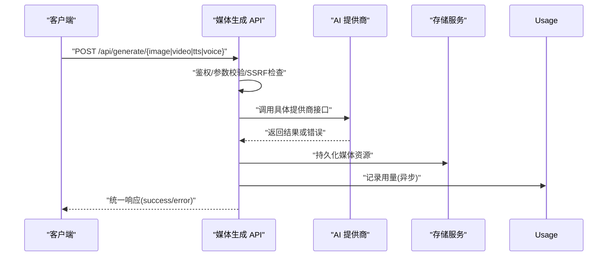
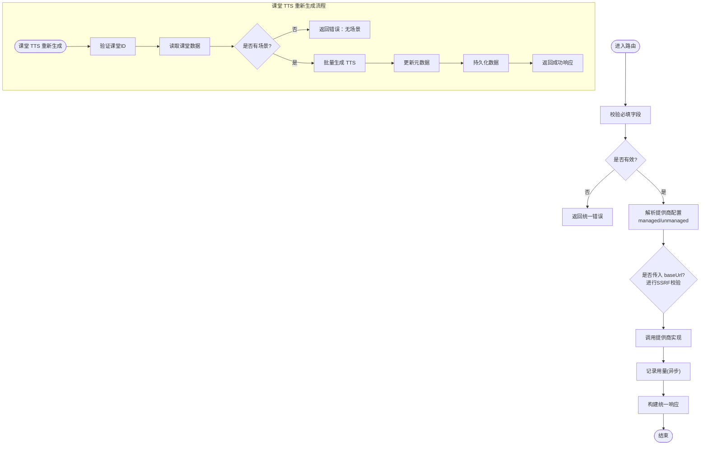
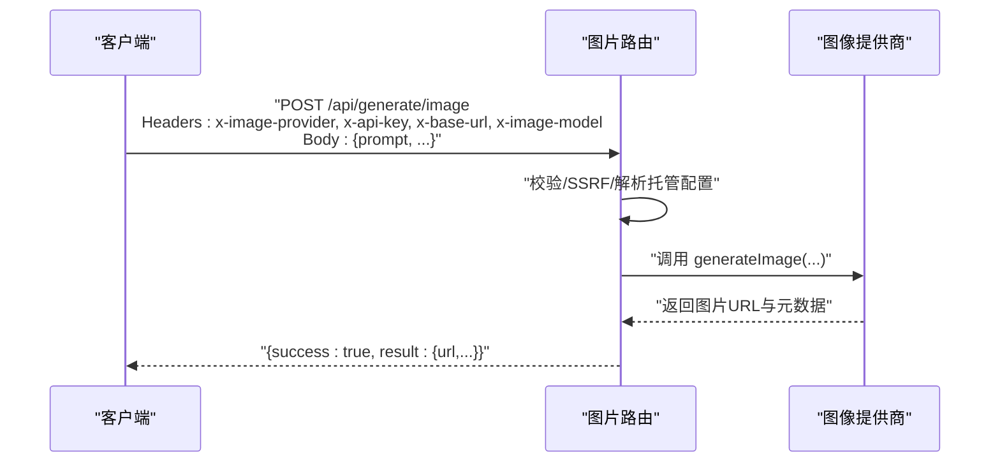
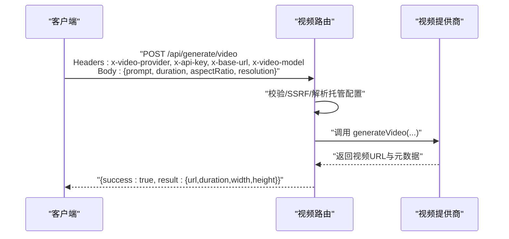
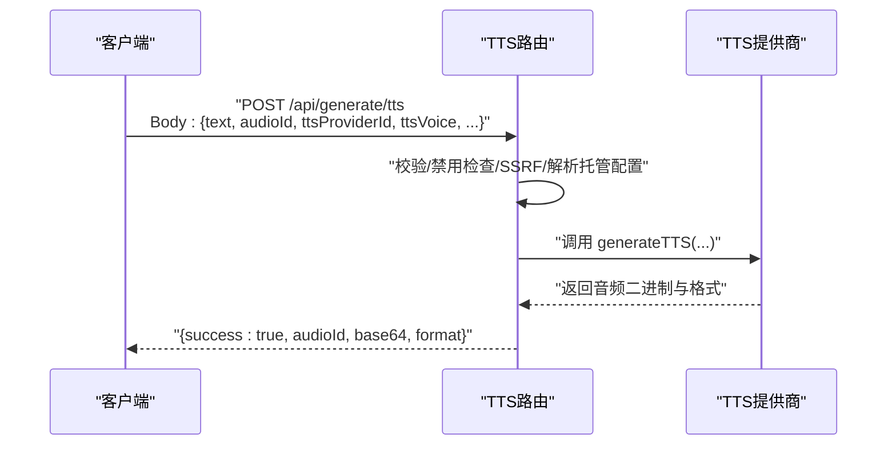
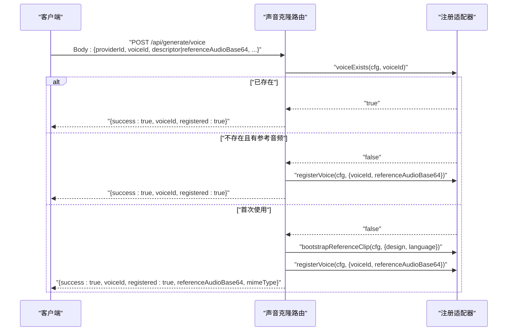
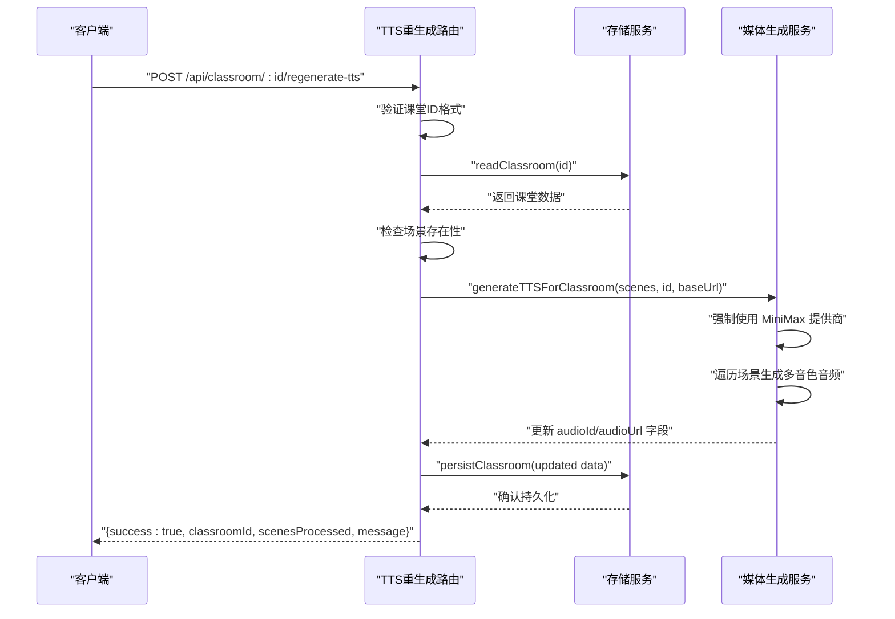

# 媒体生成 API

<cite>
**本文引用的文件**   
- [app/api/generate/image/route.ts](file://app/api/generate/image/route.ts)
- [app/api/generate/video/route.ts](file://app/api/generate/video/route.ts)
- [app/api/generate/tts/route.ts](file://app/api/generate/tts/route.ts)
- [app/api/generate/voice/route.ts](file://app/api/generate/voice/route.ts)
- [app/api/classroom/[id]/regenerate-tts/route.ts](file://app/api/classroom/[id]/regenerate-tts/route.ts)
- [lib/server/classroom-media-generation.ts](file://lib/server/classroom-media-generation.ts)
- [lib/server/classroom-storage.ts](file://lib/server/classroom-storage.ts)
- [lib/server/provider-config.ts](file://lib/server/provider-config.ts)
- [lib/server/api-response.ts](file://lib/server/api-response.ts)
- [lib/media/types.ts](file://lib/media/types.ts)
- [lib/server/usage-storage.ts](file://lib/server/usage-storage.ts)
- [lib/audio/constants.ts](file://lib/audio/constants.ts)
</cite>

## 更新摘要
**变更内容**   
- 新增课堂 TTS 重新生成 API 端点 `/api/classroom/[id]/regenerate-tts`
- 增强媒体生成流水线支持多音色预生成架构
- 完善错误处理和响应格式标准化
- 优化音频文件存储和元数据管理

## 产品概述
OpenMAIC 的媒体生成 API 提供统一的图片、视频、语音合成与声音克隆能力，服务于课件内容自动生成与课堂互动场景。通过多提供商抽象（图像/视频/TTS），支持服务端托管密钥与模型白名单、客户端自定义密钥与 Base URL、SSRF 防护、用量统计与错误码统一等特性，便于在多种 AI 服务提供商间灵活切换与统一管理。**新增功能**：支持为现有课堂批量重新生成 TTS 音频，使用强制 MiniMax 提供商设置和多音色预生成架构。

## 核心业务流程
- 图片生成：客户端提交提示词与尺寸/比例等参数，服务端校验并调用对应图像提供商，返回图片 URL 或错误信息。
- 视频生成：客户端提交提示词与时长/分辨率等参数，服务端校验并调用视频提供商，返回视频 URL 及元数据。
- 语音合成（TTS）：客户端提交文本、音色、速度等参数，服务端按提供商策略生成音频并返回 base64 编码结果。
- 声音克隆：客户端提交 voiceId 与描述或参考音频，服务端完成注册或复用已有音色，返回引用音频以便缓存。
- **新增**：课堂 TTS 重新生成：管理员或操作员为现有课堂重新生成所有场景的 TTS 音频，覆盖原有音频文件并更新元数据。

**章节来源**
- [app/api/generate/image/route.ts:1-116](file://app/api/generate/image/route.ts#L1-L116)
- [app/api/generate/video/route.ts:1-110](file://app/api/generate/video/route.ts#L1-L110)
- [app/api/generate/tts/route.ts:1-149](file://app/api/generate/tts/route.ts#L1-L149)
- [app/api/generate/voice/route.ts:1-154](file://app/api/generate/voice/route.ts#L1-L154)
- [app/api/classroom/[id]/regenerate-tts/route.ts:1-71](file://app/api/classroom/[id]/regenerate-tts/route.ts#L1-L71)
- [lib/server/api-response.ts:1-51](file://lib/server/api-response.ts#L1-L51)
- [lib/server/usage-storage.ts:1-203](file://lib/server/usage-storage.ts#L1-L203)

## 功能模块清单
- 图片生成 /api/generate/image
  - 职责：根据提示词与尺寸/比例等参数生成图片，支持多提供商与托管配置。
  - 验收要点：必填 prompt；可选 width/height/aspectRatio/style；支持 x-image-provider/x-api-key/x-base-url/x-image-model；成功返回 result.url 等；失败返回统一错误码。
- 视频生成 /api/generate/video
  - 职责：根据提示词与时长/分辨率等参数生成视频，支持多提供商与托管配置。
  - 验收要点：必填 prompt；可选 duration/aspectRatio/resolution；支持 x-video-provider/x-api-key/x-base-url/x-video-model；成功返回 result.url/duration/width/height；失败返回统一错误码。
- 语音合成 /api/generate/tts
  - 职责：将文本合成为音频，返回 base64 编码音频与格式。
  - 验收要点：必填 text/audioId/ttsProviderId/ttsVoice；可选 ttsModelId/ttsSpeed/ttsApiKey/ttsBaseUrl/ttsProviderOptions；支持 VoxCPM Auto Voice 上下文约束；失败区分限流与生成失败。
- 声音克隆 /api/generate/voice
  - 职责：为指定 provider 与 voiceId 完成音色注册或复用，支持从描述或参考音频生成/注册。
  - 验收要点：必填 providerId/voiceId；descriptor 或 referenceAudioBase64 二选一；支持 ttsApiKey/ttsBaseUrl/ttsModelId；已存在则无操作返回；首次使用会生成参考音频并返回供客户端缓存。
- **新增**：课堂 TTS 重新生成 /api/classroom/[id]/regenerate-tts
  - 职责：为现有课堂重新生成所有场景的 TTS 音频，使用当前音色策略。
  - 验收要点：必填 classroomId；验证课堂存在且有场景；强制使用 MiniMax 提供商；覆盖 data/classrooms/<id>/audio/ 下的所有音频文件；更新 classroom JSON 中的 audioId/audioUrl 字段。

**章节来源**
- [app/api/generate/image/route.ts:1-116](file://app/api/generate/image/route.ts#L1-L116)
- [app/api/generate/video/route.ts:1-110](file://app/api/generate/video/route.ts#L1-L110)
- [app/api/generate/tts/route.ts:1-149](file://app/api/generate/tts/route.ts#L1-L149)
- [app/api/generate/voice/route.ts:1-154](file://app/api/generate/voice/route.ts#L1-L154)
- [app/api/classroom/[id]/regenerate-tts/route.ts:1-71](file://app/api/classroom/[id]/regenerate-tts/route.ts#L1-L71)

## 数据与状态
- 请求参数与类型
  - 图片：prompt、negativePrompt、width、height、aspectRatio、style
  - 视频：prompt、duration、aspectRatio、resolution
  - TTS：text、audioId、ttsProviderId、ttsVoice、ttsModelId、ttsSpeed、ttsApiKey、ttsBaseUrl、ttsProviderOptions
  - 声音克隆：providerId、voiceId、descriptor、referenceAudioBase64、mimeType、language、ttsApiKey、ttsBaseUrl、ttsModelId
  - **新增**：课堂 TTS 重新生成：classroomId（路径参数）
- 响应结构
  - 成功：{ success: true, ... } 包含 result（图片/视频）、base64/format（TTS）、voiceId/registered/referenceAudioBase64/mimeType（声音克隆）
  - 失败：{ success: false, errorCode, error, details? }
  - **新增**：课堂 TTS 重新生成成功：{ success: true, classroomId, scenesProcessed, message }
- 用量统计
  - 图片：unit=image，quantity=1
  - 视频：unit=second，quantity=duration
  - TTS：unit=character，quantity=text.length
  - 声音克隆：不直接产生用量（仅注册）
  - **新增**：课堂 TTS 重新生成：按场景数量统计，每个 speech action 独立处理
- 状态流转
  - 图片/视频：请求→校验→调用提供商→记录用量→返回
  - TTS：请求→校验→调用提供商→转 base64→记录用量→返回
  - 声音克隆：请求→校验→适配器决策（存在/注册/引导）→返回
  - **新增**：课堂 TTS 重新生成：验证课堂ID→读取课堂数据→遍历场景→批量生成 TTS→更新元数据→持久化

**章节来源**
- [lib/media/types.ts:200-310](file://lib/media/types.ts#L200-L310)
- [lib/server/api-response.ts:1-51](file://lib/server/api-response.ts#L1-L51)
- [lib/server/usage-storage.ts:1-203](file://lib/server/usage-storage.ts#L1-L203)
- [app/api/classroom/[id]/regenerate-tts/route.ts:1-71](file://app/api/classroom/[id]/regenerate-tts/route.ts#L1-L71)

## 关键约束与边界
- 认证与托管
  - 若提供商在服务端已配置（managed），则忽略客户端传入的 apiKey/baseUrl，以服务端为准。
  - 未托管（unmanaged）时，完全使用客户端提供的密钥与 Base URL。
  - TTS 支持"强制禁用"开关，被禁用的提供商对所有客户端不可用。
  - **新增**：课堂 TTS 重新生成强制使用 MiniMax 提供商，忽略其他提供商配置。
- 安全
  - 所有可接受的 baseUrl 均进行 SSRF 校验，生产环境对视频接口强制校验。
  - 敏感内容拦截：当上游返回敏感内容相关错误时，返回 CONTENT_SENSITIVE。
  - **新增**：课堂 ID 验证使用正则表达式确保安全性。
- 速率限制与重试
  - TTS 接口在遇到限流时返回 RATE_LIMITED（429），客户端应据此实施指数退避重试。
  - 其他接口内部错误返回 INTERNAL_ERROR 或 GENERATION_FAILED，建议客户端结合业务重试策略。
  - **新增**：课堂 TTS 重新生成支持单个场景失败继续处理其他场景。
- 并发与超时
  - 各路由设置 maxDuration（如 300s/30s），长耗时任务需遵循平台限制。
  - 批量处理建议客户端并行发起多个请求，服务端无内置队列。
  - **新增**：课堂 TTS 重新生成按场景顺序处理，避免并发冲突。
- 资源存储与管理
  - 生成的媒体由提供商返回 URL，服务端不持久化二进制文件。
  - 建议客户端缓存参考音频（声音克隆）与生成结果，减少重复请求。
  - **新增**：课堂 TTS 音频存储在 data/classrooms/<id>/audio/ 目录，支持多音色预生成。

**章节来源**
- [lib/server/provider-config.ts:1-678](file://lib/server/provider-config.ts#L1-L678)
- [app/api/generate/image/route.ts:1-116](file://app/api/generate/image/route.ts#L1-L116)
- [app/api/generate/video/route.ts:1-110](file://app/api/generate/video/route.ts#L1-L110)
- [app/api/generate/tts/route.ts:1-149](file://app/api/generate/tts/route.ts#L1-L149)
- [app/api/generate/voice/route.ts:1-154](file://app/api/generate/voice/route.ts#L1-L154)
- [app/api/classroom/[id]/regenerate-tts/route.ts:1-71](file://app/api/classroom/[id]/regenerate-tts/route.ts#L1-L71)
- [lib/server/classroom-storage.ts:1-112](file://lib/server/classroom-storage.ts#L1-L112)

## 接口规范与示例

### 图片生成 /api/generate/image
- HTTP 方法：POST
- URL：/api/generate/image
- 请求头
  - x-image-provider：ImageProviderId（默认 seedream）
  - x-api-key：可选（未托管时生效）
  - x-base-url：可选（未托管时生效）
  - x-image-model：可选（覆盖模型）
- 请求体
  - prompt：字符串（必填）
  - negativePrompt：字符串（可选）
  - width：数字（可选）
  - height：数字（可选）
  - aspectRatio：'16:9'|'4:3'|'1:1'|'9:16'|'3:4'|'21:9'（可选）
  - style：字符串（可选）
- 响应体
  - 成功：{ success: true, result: { url, width, height, ... } }
  - 失败：{ success: false, errorCode, error, details? }
- 错误码
  - MISSING_REQUIRED_FIELD：缺少 prompt
  - INVALID_URL：baseUrl 非法（SSRF）
  - MISSING_API_KEY：托管提供商缺失密钥
  - CONTENT_SENSITIVE：敏感内容拦截
  - INTERNAL_ERROR：内部错误

**章节来源**
- [app/api/generate/image/route.ts:1-116](file://app/api/generate/image/route.ts#L1-L116)
- [lib/media/types.ts:200-310](file://lib/media/types.ts#L200-L310)
- [lib/server/api-response.ts:1-51](file://lib/server/api-response.ts#L1-L51)

### 视频生成 /api/generate/video
- HTTP 方法：POST
- URL：/api/generate/video
- 请求头
  - x-video-provider：VideoProviderId（默认 seedance）
  - x-api-key：可选（未托管时生效）
  - x-base-url：可选（未托管时生效）
  - x-video-model：可选（覆盖模型）
- 请求体
  - prompt：字符串（必填）
  - duration：数字（可选）
  - aspectRatio：'16:9'|'4:3'|'1:1'|'9:16'|'3:4'|'21:9'（可选）
  - resolution：'480p'|'720p'|'1080p'（可选）
- 响应体
  - 成功：{ success: true, result: { url, duration, width, height, poster? } }
  - 失败：{ success: false, errorCode, error, details? }
- 错误码
  - MISSING_REQUIRED_FIELD：缺少 prompt
  - INVALID_URL：baseUrl 非法（SSRF）
  - MISSING_API_KEY：缺失密钥
  - CONTENT_SENSITIVE：敏感内容拦截
  - INTERNAL_ERROR：内部错误

**章节来源**
- [app/api/generate/video/route.ts:1-110](file://app/api/generate/video/route.ts#L1-L110)
- [lib/media/types.ts:200-310](file://lib/media/types.ts#L200-L310)
- [lib/server/api-response.ts:1-51](file://lib/server/api-response.ts#L1-L51)

### 语音合成 /api/generate/tts
- HTTP 方法：POST
- URL：/api/generate/tts
- 请求体
  - text：字符串（必填）
  - audioId：字符串（必填）
  - ttsProviderId：TTSProviderId（必填）
  - ttsVoice：字符串（必填）
  - ttsModelId：字符串（可选）
  - ttsSpeed：数字（可选，默认 1.0）
  - ttsApiKey：字符串（可选，未托管时生效）
  - ttsBaseUrl：字符串（可选，未托管时生效）
  - ttsProviderOptions：对象（可选，含 voicePrompt/registeredVoiceId 等）
- 响应体
  - 成功：{ success: true, audioId, base64, format }
  - 失败：{ success: false, errorCode, error, details? }
- 错误码
  - MISSING_REQUIRED_FIELD：缺少必填字段
  - PROVIDER_DISABLED：提供商被服务器禁用
  - VOXCPM_AUTO_VOICE_REQUIRES_CONTEXT：Auto Voice 需要上下文
  - INVALID_URL：baseUrl 非法（SSRF）
  - RATE_LIMITED：限流（429）
  - GENERATION_FAILED：生成失败

**章节来源**
- [app/api/generate/tts/route.ts:1-149](file://app/api/generate/tts/route.ts#L1-L149)
- [lib/server/api-response.ts:1-51](file://lib/server/api-response.ts#L1-L51)

### 声音克隆 /api/generate/voice
- HTTP 方法：POST
- URL：/api/generate/voice
- 请求体
  - providerId：字符串（必填）
  - voiceId：字符串（必填）
  - descriptor：对象（可选，声音设计描述）
  - referenceAudioBase64：字符串（可选，参考音频 base64）
  - mimeType：字符串（可选）
  - language：字符串（可选）
  - ttsApiKey：字符串（可选，未托管时生效）
  - ttsBaseUrl：字符串（可选，未托管时生效）
  - ttsModelId：字符串（可选）
- 响应体
  - 成功：{ success: true, voiceId, registered: true, referenceAudioBase64?, mimeType? }
  - 失败：{ success: false, errorCode, error, details? }
- 错误码
  - MISSING_REQUIRED_FIELD：缺少必填字段
  - PROVIDER_DISABLED：提供商被服务器禁用
  - INVALID_REQUEST：不支持声音注册的提供商或缺少必要信息
  - INVALID_URL：baseUrl 非法（SSRF）
  - GENERATION_FAILED：注册失败

**章节来源**
- [app/api/generate/voice/route.ts:1-154](file://app/api/generate/voice/route.ts#L1-L154)
- [lib/server/api-response.ts:1-51](file://lib/server/api-response.ts#L1-L51)

### **新增**：课堂 TTS 重新生成 /api/classroom/[id]/regenerate-tts
- HTTP 方法：POST
- URL：/api/classroom/[id]/regenerate-tts
- 路径参数
  - id：课堂ID（必填，必须匹配 /^[a-zA-Z0-9_-]+$/）
- 请求体：无
- 响应体
  - 成功：{ success: true, classroomId, scenesProcessed, message }
  - 失败：{ success: false, errorCode, error, details? }
- 错误码
  - INVALID_REQUEST：课堂ID无效或课堂不存在
  - INTERNAL_ERROR：TTS 重新生成失败
- 处理流程
  1. 验证课堂ID格式
  2. 读取课堂数据并验证存在性
  3. 检查课堂是否有场景
  4. 强制使用 MiniMax TTS 提供商
  5. 遍历所有场景的 speech actions
  6. 为每个语音动作生成多音色音频（female-yujie, female-shaonv, male-qn-jingying, Chinese (Mandarin)_Gentleman）
  7. 更新 scene 中的 audioId 和 audioUrl 字段
  8. 持久化更新的课堂数据

**章节来源**
- [app/api/classroom/[id]/regenerate-tts/route.ts:1-71](file://app/api/classroom/[id]/regenerate-tts/route.ts#L1-L71)
- [lib/server/classroom-media-generation.ts:219-289](file://lib/server/classroom-media-generation.ts#L219-L289)
- [lib/server/classroom-storage.ts:75-112](file://lib/server/classroom-storage.ts#L75-L112)
- [lib/server/api-response.ts:1-51](file://lib/server/api-response.ts#L1-L51)

## 集成指南与最佳实践
- 提供商配置
  - 服务端 YAML/env 管理密钥与模型白名单，客户端仅传递 providerId 与可选 modelId。
  - 托管模式下，客户端传入的 apiKey/baseUrl 将被忽略。
  - **新增**：课堂 TTS 重新生成固定使用 MiniMax 提供商，无需客户端配置。
- 错误处理与重试
  - 针对 RATE_LIMITED（429）采用指数退避重试；对于 CONTENT_SENSITIVE 建议提示用户修改提示词。
  - 内部错误建议有限次重试，避免无限重试导致雪崩。
  - **新增**：课堂 TTS 重新生成支持部分失败，单个场景失败不影响其他场景处理。
- 批量处理
  - 客户端并行发起多个请求（图片/视频/TTS），服务端无队列；注意控制并发度以避免触发限流。
  - **新增**：课堂 TTS 重新生成按场景顺序处理，适合后台任务执行。
- 缓存策略
  - 声音克隆：缓存 referenceAudioBase64 与 mimeType，避免重复注册。
  - 媒体资源：缓存 URL 与元数据，减少重复生成。
  - **新增**：课堂 TTS 音频文件存储在本地文件系统，支持多音色版本缓存。
- 资源管理
  - 服务端不存储媒体二进制，依赖提供商 URL；建议客户端建立本地索引与过期策略。
  - **新增**：课堂 TTS 音频文件存储在 data/classrooms/<id>/audio/ 目录，文件名格式为 {audioId}_{voice}.{format}。
- **新增**：课堂 TTS 重新生成最佳实践
  - 建议在课堂编辑完成后或音色策略变更后执行
  - 支持增量更新，只重新生成有变化的语音动作
  - 建议添加进度反馈机制，因为处理大量场景可能需要较长时间
  - 注意磁盘空间管理，定期清理旧的音频文件

**章节来源**
- [lib/server/provider-config.ts:1-678](file://lib/server/provider-config.ts#L1-L678)
- [lib/server/usage-storage.ts:1-203](file://lib/server/usage-storage.ts#L1-L203)
- [lib/server/classroom-media-generation.ts:1-289](file://lib/server/classroom-media-generation.ts#L1-L289)
- [lib/audio/constants.ts:56-69](file://lib/audio/constants.ts#L56-L69)

## 附录：错误码与状态说明
- 通用错误码
  - MISSING_REQUIRED_FIELD：缺少必填字段
  - MISSING_API_KEY：缺失密钥
  - INVALID_REQUEST：请求无效
  - PROVIDER_DISABLED：提供商被禁用
  - INVALID_URL：URL 非法（SSRF）
  - CONTENT_SENSITIVE：敏感内容拦截
  - RATE_LIMITED：限流（429）
  - GENERATION_FAILED：生成失败
  - INTERNAL_ERROR：内部错误
- **新增**：课堂 TTS 重新生成特定错误
  - INVALID_REQUEST：课堂ID无效或课堂不存在
  - 内部错误：TTS 生成失败时的详细错误信息

**章节来源**
- [lib/server/api-response.ts:1-51](file://lib/server/api-response.ts#L1-L51)
- [app/api/classroom/[id]/regenerate-tts/route.ts:30-44](file://app/api/classroom/[id]/regenerate-tts/route.ts#L30-L44)