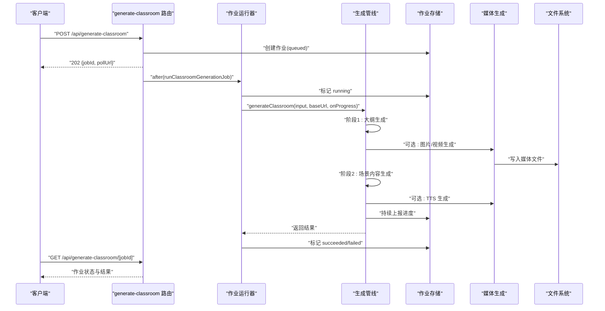
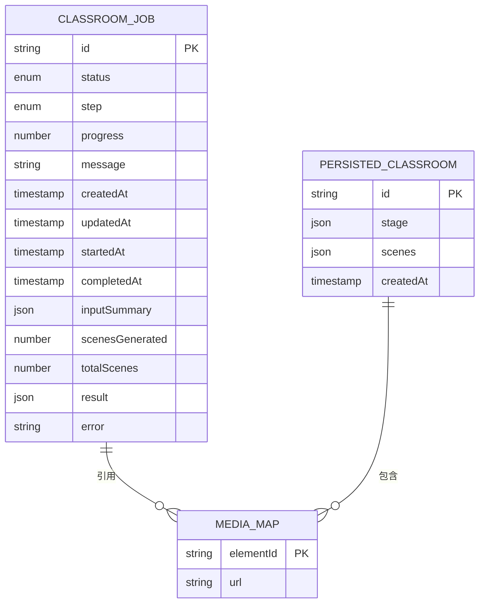
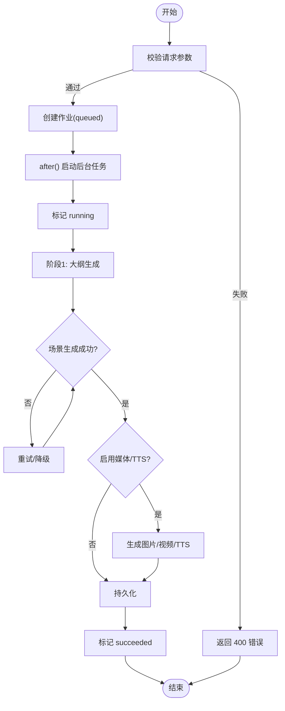

# 生成流水线 API

<cite>
**本文引用的文件**   
- [app/api/generate-classroom/route.ts](file://app/api/generate-classroom/route.ts)
- [app/api/generate-classroom/[jobId]/route.ts](file://app/api/generate-classroom/[jobId]/route.ts)
- [lib/server/classroom-generation.ts](file://lib/server/classroom-generation.ts)
- [lib/server/classroom-job-runner.ts](file://lib/server/classroom-job-runner.ts)
- [lib/server/classroom-job-store.ts](file://lib/server/classroom-job-store.ts)
- [lib/server/classroom-storage.ts](file://lib/server/classroom-storage.ts)
- [lib/generation/outline-generator.ts](file://lib/generation/outline-generator.ts)
- [lib/generation/scene-generator.ts](file://lib/generation/scene-generator.ts)
- [lib/server/classroom-media-generation.ts](file://lib/server/classroom-media-generation.ts)
</cite>

## 产品概述
OpenMAIC 的“生成流水线”面向教师与内容创作者，提供以自然语言驱动的多智能体课件（MAIC）自动生成能力。核心流程包括：接收用户输入→可选网络检索增强→两阶段生成（大纲生成→场景内容生成）→媒体资源生成（图片/视频/TTS）→持久化并输出可访问的课堂页面。系统通过 Next.js API 路由暴露异步任务接口，前端轮询获取进度与结果，支持失败恢复、并发控制与性能监控。

## 核心业务流程
- 入口与任务创建
  - POST /api/generate-classroom：校验请求体、创建作业、返回 job 信息与轮询地址，使用 after() 启动后台执行。
- 进度查询
  - GET /api/generate-classroom/[jobId]：读取作业状态、步骤、进度、错误信息，返回是否完成标志与轮询间隔建议。
- 后台执行
  - runClassroomGenerationJob：标记运行、调用 generateClassroom、更新成功/失败状态，保证同 jobId 幂等执行。
- 两阶段生成
  - 阶段一：根据需求生成课程大纲（含语言指令、标题、场景列表），支持 PDF 文本与图像上下文、可选网络搜索。
  - 阶段二：逐场景生成内容与动作，支持重试与降级；构建 Stage 与 Scene 集合。
- 媒体与语音
  - 可选生成图片/视频并落盘，替换占位符；可选 TTS 音频生成。
- 持久化与输出
  - 将 Stage+Scenes 写入 data/classrooms，返回课堂 URL；作业记录写入 data/classroom-jobs。

**图表来源** 
- [app/api/generate-classroom/route.ts:14-73](file://app/api/generate-classroom/route.ts#L14-L73)
- [app/api/generate-classroom/[jobId]/route.ts](file://app/api/generate-classroom/[jobId]/route.ts#L14-L55)
- [lib/server/classroom-job-runner.ts:13-51](file://lib/server/classroom-job-runner.ts#L13-L51)
- [lib/server/classroom-generation.ts:167-574](file://lib/server/classroom-generation.ts#L167-L574)
- [lib/server/classroom-job-store.ts:100-225](file://lib/server/classroom-job-store.ts#L100-L225)
- [lib/server/classroom-media-generation.ts:70-170](file://lib/server/classroom-media-generation.ts#L70-L170)

**章节来源**
- [app/api/generate-classroom/route.ts:14-73](file://app/api/generate-classroom/route.ts#L14-L73)
- [app/api/generate-classroom/[jobId]/route.ts:14-55](file://app/api/generate-classroom/[jobId]/route.ts#L14-L55)
- [lib/server/classroom-job-runner.ts:13-51](file://lib/server/classroom-job-runner.ts#L13-L51)
- [lib/server/classroom-generation.ts:167-574](file://lib/server/classroom-generation.ts#L167-L574)

## 功能模块清单
- 课堂生成入口 API
  - 职责：参数校验、作业创建、异步执行调度、返回轮询地址与间隔。
  - 验收要点：必填字段 requirement 校验；返回 202 与 pollUrl/pollIntervalMs；异常返回结构化错误。
- 作业状态查询 API
  - 职责：按 jobId 读取作业状态、进度、错误、完成标志；URL 重写兼容 basePath。
  - 验收要点：无效 jobId 返回 400；不存在返回 404；done 字段准确反映终态。
- 作业运行器
  - 职责：去重执行、状态流转（queued→running→succeeded/failed）、失败持久化。
  - 验收要点：同一 jobId 多次触发仅执行一次；异常时写回错误信息。
- 生成管线（两阶段）
  - 职责：大纲生成、场景内容/动作生成、多智能体配置、媒体与 TTS 集成、持久化。
  - 验收要点：每步 onProgress 上报；失败重试；无场景时抛错；最终产出 Stage+Scenes。
- 媒体与 TTS 生成
  - 职责：图片/视频生成、下载与落盘、占位符替换；TTS 分段与落盘。
  - 验收要点：缺密钥跳过；大小/超时保护；并行处理图片与视频。
- 存储与持久化
  - 职责：原子写入 JSON、目录初始化、绝对路径重写为相对路径（basePath）。
  - 验收要点：data/classrooms 与 data/classroom-jobs 结构稳定；URL 可被主站代理。

**章节来源**
- [app/api/generate-classroom/route.ts:14-73](file://app/api/generate-classroom/route.ts#L14-L73)
- [app/api/generate-classroom/[jobId]/route.ts:14-55](file://app/api/generate-classroom/[jobId]/route.ts#L14-L55)
- [lib/server/classroom-job-runner.ts:13-51](file://lib/server/classroom-job-runner.ts#L13-L51)
- [lib/server/classroom-generation.ts:167-574](file://lib/server/classroom-generation.ts#L167-L574)
- [lib/server/classroom-media-generation.ts:70-170](file://lib/server/classroom-media-generation.ts#L70-L170)
- [lib/server/classroom-storage.ts:1-112](file://lib/server/classroom-storage.ts#L1-L112)

## 数据与状态
- 作业模型（ClassroomGenerationJob）
  - 关键字段：id、status（queued/running/succeeded/failed）、step、progress、message、createdAt/updatedAt/startedAt/completedAt、inputSummary、scenesGenerated、totalScenes、result、error。
  - 行为：原子写入、单作业锁、过期检测（30 分钟无更新视为失败）。
- 生成输入（GenerateClassroomInput）
  - 关键字段：requirement、pdfContent、enableWebSearch、webSearchProviderId/webSearchApiKey/baiduSubSources、enableImageGeneration、enableVideoGeneration、enableTTS、agentMode。
- 生成进度（ClassroomGenerationProgress）
  - 关键字段：step（initializing/researching/generating_outlines/generating_scenes/generating_media/generating_tts/persisting/completed）、progress、message、scenesGenerated、totalScenes。
- 持久化数据（PersistedClassroomData）
  - 关键字段：id、stage、scenes、createdAt；服务 URL 由 baseUrl + /classroom/{id} 构成。
- 媒体映射
  - 生成后返回 elementId→mediaUrl 映射，用于替换场景中的占位 src/mediaRef。

**图表来源** 
- [lib/server/classroom-job-store.ts:15-41](file://lib/server/classroom-job-store.ts#L15-L41)
- [lib/server/classroom-storage.ts:46-51](file://lib/server/classroom-storage.ts#L46-L51)
- [lib/server/classroom-media-generation.ts:62-64](file://lib/server/classroom-media-generation.ts#L62-L64)

**章节来源**
- [lib/server/classroom-job-store.ts:15-41](file://lib/server/classroom-job-store.ts#L15-L41)
- [lib/server/classroom-generation.ts:40-78](file://lib/server/classroom-generation.ts#L40-L78)
- [lib/server/classroom-storage.ts:46-51](file://lib/server/classroom-storage.ts#L46-L51)

## 关键约束与边界
- 请求参数校验
  - requirement 必填；缺失返回 400 错误码与明确消息。
- 模型与密钥
  - 若 provider 需要 API Key 但未配置，快速失败并提示环境变量或配置文件设置位置。
- 网络搜索
  - 可选；未配置密钥或路由不可用时降级继续，不影响整体流程。
- 媒体与 TTS
  - 可选；缺少密钥或生成失败会记录警告并继续；下载限制（超时/大小）保障稳定性。
- 并发与幂等
  - 同一 jobId 重复提交仅执行一次；作业文件级锁避免竞态。
- 路径与跨域
  - buildRequestOrigin 优先使用 basePath 确保同源代理；支持受控的转发头信任。
- 性能与超时
  - API maxDuration=30s；轮询间隔建议 5000ms；大文件下载上限 100MB，超时 120s。
- 失败恢复
  - 作业 30 分钟无更新自动标记失败；错误信息持久化便于排查。

**章节来源**
- [app/api/generate-classroom/route.ts:12-40](file://app/api/generate-classroom/route.ts#L12-L40)
- [lib/server/classroom-generation.ts:193-199](file://lib/server/classroom-generation.ts#L193-L199)
- [lib/server/classroom-generation.ts:274-324](file://lib/server/classroom-generation.ts#L274-L324)
- [lib/server/classroom-media-generation.ts:49-60](file://lib/server/classroom-media-generation.ts#L49-L60)
- [lib/server/classroom-job-runner.ts:18-21](file://lib/server/classroom-job-runner.ts#L18-L21)
- [lib/server/classroom-storage.ts:31-44](file://lib/server/classroom-storage.ts#L31-L44)
- [lib/server/classroom-job-store.ts:76-94](file://lib/server/classroom-job-store.ts#L76-L94)

## 端到端示例与最佳实践
- 完整生命周期示例
  - 客户端 POST /api/generate-classroom 提交 requirement 与可选开关（PDF、网络搜索、图片/视频/TTS、agentMode）。
  - 服务端返回 202 与 pollUrl；客户端每 5 秒轮询 GET /api/generate-classroom/[jobId]。
  - 后台依次执行：初始化→研究→大纲生成→场景生成（逐场景，带重试）→媒体生成→TTS→持久化→完成。
  - 完成后 done=true，返回 result.url 指向课堂页面。
- 批量生成与并发控制
  - 对多个 requirement 分别创建独立 jobId；服务端按 jobId 去重执行，避免重复计算。
  - 媒体生成内部并行处理图片与视频，但各 Provider 内串行，降低限流风险。
- 资源优化
  - 仅在启用对应开关时调用 LLM/媒体服务；网络搜索失败不中断流程。
  - 使用 basePath 统一资源路径，减少跨域与代理复杂度。
- 错误处理与监控
  - 所有关键节点记录日志；失败时写回 error 字段；轮询客户端应区分 400/404/500 并提示重试或刷新。
  - 结合 onProgress 的 step/message 展示实时反馈，提升用户体验。

**图表来源** 
- [app/api/generate-classroom/route.ts:14-73](file://app/api/generate-classroom/route.ts#L14-L73)
- [lib/server/classroom-job-runner.ts:23-46](file://lib/server/classroom-job-runner.ts#L23-L46)
- [lib/server/classroom-generation.ts:326-574](file://lib/server/classroom-generation.ts#L326-L574)

**章节来源**
- [lib/generation/outline-generator.ts:36-160](file://lib/generation/outline-generator.ts#L36-L160)
- [lib/generation/scene-generator.ts:197-200](file://lib/generation/scene-generator.ts#L197-L200)
- [lib/server/classroom-media-generation.ts:70-170](file://lib/server/classroom-media-generation.ts#L70-L170)