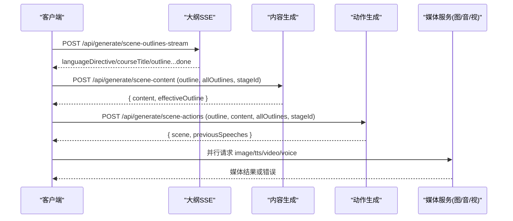
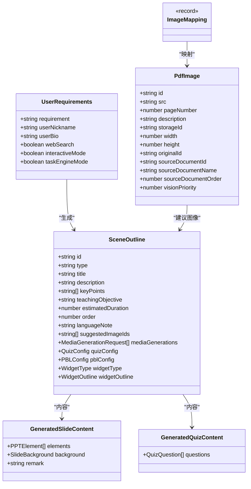
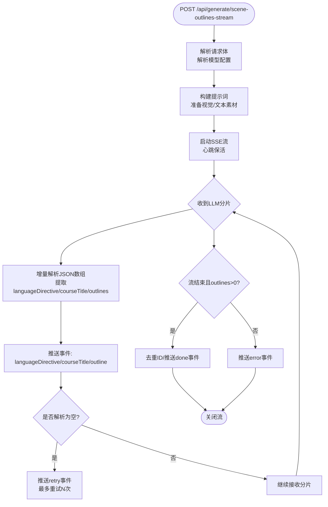
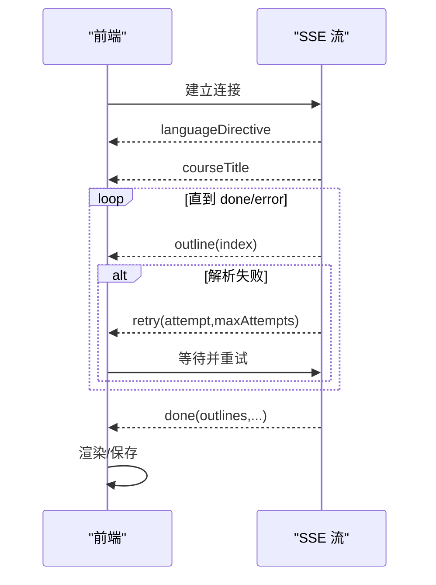

# 生成类 API

<cite>
**本文引用的文件**   
- [app/api/generate/scene-outlines-stream/route.ts](file://app/api/generate/scene-outlines-stream/route.ts)
- [app/api/generate/scene-content/route.ts](file://app/api/generate/scene-content/route.ts)
- [app/api/generate/scene-actions/route.ts](file://app/api/generate/scene-actions/route.ts)
- [app/api/generate/image/route.ts](file://app/api/generate/image/route.ts)
- [app/api/generate/tts/route.ts](file://app/api/generate/tts/route.ts)
- [app/api/generate/video/route.ts](file://app/api/generate/video/route.ts)
- [app/api/generate/voice/route.ts](file://app/api/generate/voice/route.ts)
- [lib/types/generation.ts](file://lib/types/generation.ts)
- [lib/server/api-response.ts](file://lib/server/api-response.ts)
</cite>

## 产品概述
OpenMAIC 的“生成类 API”面向课件（MAIC）自动化生产，提供从“需求到大纲、再到内容、动作与媒体素材”的一体化接口。核心能力包括：
- 场景大纲流式生成（SSE），支持语言指令、课程标题增量输出与重试提示
- 场景内容生成（幻灯片/测验/互动/PBL）
- 场景动作生成（演讲/交互等动作编排）
- 图片生成、语音合成（TTS）、视频生成、声音克隆（自动注册）

目标用户为课件编辑者、教师与课堂运营人员；核心价值在于通过自然语言快速产出结构化、可播放的交互式课件，并支持多模态素材（图/音/视频）的并行生成与集成。

## 核心业务流程
整体流程采用两阶段生成 + 媒体并行策略：
1. 大纲生成（SSE）：POST /api/generate/scene-outlines-stream
   - 输入：用户需求、可选 PDF 文本与图片、研究上下文、智能体信息
   - 输出：逐条推送 SceneOutline，最终返回 done 事件汇总
2. 内容生成：POST /api/generate/scene-content
   - 输入：单个 outline、全部 outlines、stageId、可选视觉图像映射
   - 输出：结构化内容（slide/quiz/interactive/pbl）
3. 动作生成：POST /api/generate/scene-actions
   - 输入：outline、content、allOutlines、stageId、历史台词等
   - 输出：完整 Scene（含 actions），并回传 previousSpeeches 用于跨场景连贯性
4. 媒体生成（并行）：
   - 图片：POST /api/generate/image
   - TTS：POST /api/generate/tts
   - 视频：POST /api/generate/video
   - 声音克隆：POST /api/generate/voice（按 provider 抽象注册）

**图表来源** 
- [app/api/generate/scene-outlines-stream/route.ts](file://app/api/generate/scene-outlines-stream/route.ts)
- [app/api/generate/scene-content/route.ts](file://app/api/generate/scene-content/route.ts)
- [app/api/generate/scene-actions/route.ts](file://app/api/generate/scene-actions/route.ts)
- [app/api/generate/image/route.ts](file://app/api/generate/image/route.ts)
- [app/api/generate/tts/route.ts](file://app/api/generate/tts/route.ts)
- [app/api/generate/video/route.ts](file://app/api/generate/video/route.ts)
- [app/api/generate/voice/route.ts](file://app/api/generate/voice/route.ts)

**章节来源**
- [app/api/generate/scene-outlines-stream/route.ts](file://app/api/generate/scene-outlines-stream/route.ts)
- [app/api/generate/scene-content/route.ts](file://app/api/generate/scene-content/route.ts)
- [app/api/generate/scene-actions/route.ts](file://app/api/generate/scene-actions/route.ts)

## 功能模块清单
- 场景大纲流式生成（SSE）
  - 职责：根据需求与文档材料，逐步产出 SceneOutline，并提前下发语言指令与课程标题
  - 验收要点：SSE 事件类型齐全、重试事件正确、完成事件包含去重后的 outlines
- 场景内容生成
  - 职责：基于 outline 生成具体页面内容（幻灯片/测验/互动/PBL）
  - 验收要点：返回 content 与 effectiveOutline，支持视觉模式与语言指令透传
- 场景动作生成
  - 职责：基于 outline+content 生成动作序列，组装完整 Scene，并回传 previousSpeeches
  - 验收要点：actions 数量合理、Scene 结构完整、previousSpeeches 可用于连贯性控制
- 图片生成
  - 职责：调用图像提供商生成图片，支持尺寸/比例/风格参数
  - 验收要点：成功返回 result，敏感内容拦截返回 CONTENT_SENSITIVE
- 语音合成（TTS）
  - 职责：将文本合成为音频（base64），支持速度、模型、音色等配置
  - 验收要点：返回 audioId/base64/format，限流时返回 RATE_LIMITED
- 视频生成
  - 职责：异步任务提交与轮询（服务端封装），返回视频 URL/时长/分辨率
  - 验收要点：成功返回 result，敏感内容拦截返回 CONTENT_SENSITIVE
- 声音克隆（自动注册）
  - 职责：按 provider 抽象注册稳定 voiceId，支持缓存复用与首次合成
  - 验收要点：幂等注册、失败时返回明确错误码

**章节来源**
- [app/api/generate/scene-outlines-stream/route.ts](file://app/api/generate/scene-outlines-stream/route.ts)
- [app/api/generate/scene-content/route.ts](file://app/api/generate/scene-content/route.ts)
- [app/api/generate/scene-actions/route.ts](file://app/api/generate/scene-actions/route.ts)
- [app/api/generate/image/route.ts](file://app/api/generate/image/route.ts)
- [app/api/generate/tts/route.ts](file://app/api/generate/tts/route.ts)
- [app/api/generate/video/route.ts](file://app/api/generate/video/route.ts)
- [app/api/generate/voice/route.ts](file://app/api/generate/voice/route.ts)

## 数据与状态
- 核心数据类型
  - UserRequirements：用户需求（自由文本、学生画像、是否开启交互/任务引擎模式等）
  - PdfImage：PDF 提取的图片元数据（id/src/page/description/storageId/尺寸/优先级等）
  - ImageMapping：image_id → base64 URL 映射
  - SceneOutline：单页大纲（type/title/description/keyPoints/order/quizConfig/pblConfig/widgetType/widgetOutline/mediaGenerations 等）
  - GeneratedSlideContent/GeneratedQuizContent：内容产物
- 关键状态流转
  - SSE 大纲流：languageDirective → courseTitle → outline × N → retry? → done/error
  - 内容→动作：content 生成后，actions 生成并组装 Scene，同时抽取 previousSpeeches 供后续场景使用
  - 媒体生成：由客户端并行发起，服务端记录用量并返回结果

**图表来源** 
- [lib/types/generation.ts](file://lib/types/generation.ts)

**章节来源**
- [lib/types/generation.ts](file://lib/types/generation.ts)

## 关键约束与边界
- 非功能性需求
  - 超时限制：各路由设置 maxDuration（如 300s/60s/30s），长耗时任务需遵循异步轮询或 SSE
  - 流式缓冲上限：大纲流对累积文本有字节上限保护，防止异常增长
  - 并发与限流：TTS 等外部服务可能触发 RATE_LIMITED，客户端需退避重试
- 依赖与集成边界
  - 模型选择：通过 resolveModelFromRequest 统一解析 model/modelInfo/thinkingConfig
  - 提供商管理：managed 模式下忽略客户端传入的 apiKey/baseUrl，强制服务器配置
  - SSRF 防护：所有允许自定义 baseUrl 的接口均进行 SSRF 校验
- 业务约束
  - 必填字段校验：如 requirements/outline/allOutlines/stageId 等缺失将返回 MISSING_REQUIRED_FIELD
  - 内容安全：图片/视频生成遇到敏感内容会返回 CONTENT_SENSITIVE
  - 语言指令透传：languageDirective 贯穿大纲→内容→动作全流程，保证语言一致性

**章节来源**
- [app/api/generate/scene-outlines-stream/route.ts](file://app/api/generate/scene-outlines-stream/route.ts)
- [app/api/generate/scene-content/route.ts](file://app/api/generate/scene-content/route.ts)
- [app/api/generate/scene-actions/route.ts](file://app/api/generate/scene-actions/route.ts)
- [app/api/generate/image/route.ts](file://app/api/generate/image/route.ts)
- [app/api/generate/tts/route.ts](file://app/api/generate/tts/route.ts)
- [app/api/generate/video/route.ts](file://app/api/generate/video/route.ts)
- [app/api/generate/voice/route.ts](file://app/api/generate/voice/route.ts)
- [lib/server/api-response.ts](file://lib/server/api-response.ts)

## 接口规范与示例

### 场景大纲生成（SSE）
- HTTP 方法：POST
- URL：/api/generate/scene-outlines-stream
- 请求头
  - x-image-generation-enabled: true/false（控制是否允许在大纲中插入图片占位）
  - x-video-generation-enabled: true/false（同上，视频）
  - 其他模型解析相关头由 resolveModelFromRequest 处理
- 请求体
  - requirements: UserRequirements（必需）
  - pdfText?: string
  - pdfImages?: PdfImage[]
  - imageMapping?: ImageMapping
  - researchContext?: string
  - agents?: AgentInfo[]
- 响应（SSE 事件）
  - languageDirective: { type: 'languageDirective', data: string }
  - courseTitle: { type: 'courseTitle', data: string }
  - outline: { type: 'outline', data: SceneOutline, index: number }
  - retry: { type: 'retry', attempt: number, maxAttempts: number }
  - done: { type: 'done', outlines: SceneOutline[], languageDirective: string, courseTitle?: string, taskEngineMode?: boolean }
  - error: { type: 'error', error: string }
- 错误处理
  - 内部错误：INTERNAL_ERROR
  - 空响应/解析失败：触发 retry 事件，最多重试若干次
- 性能与安全
  - 心跳保活（每 15s 发送注释）
  - 流缓冲上限（512KB）
  - 客户端断开即中止上游 LLM 请求

**图表来源** 
- [app/api/generate/scene-outlines-stream/route.ts](file://app/api/generate/scene-outlines-stream/route.ts)

**章节来源**
- [app/api/generate/scene-outlines-stream/route.ts](file://app/api/generate/scene-outlines-stream/route.ts)

### 场景内容生成
- HTTP 方法：POST
- URL：/api/generate/scene-content
- 请求体
  - outline: SceneOutline（必需）
  - allOutlines: SceneOutline[]（必需，非空）
  - stageId: string（必需）
  - pdfImages?: PdfImage[]
  - imageMapping?: ImageMapping
  - stageInfo?: { name, description?, style? }
  - agents?: AgentInfo[]
  - languageDirective?: string
  - requirements?: UserRequirements
- 响应
  - success: true
  - content: GeneratedSlideContent | GeneratedQuizContent | GeneratedInteractiveContent | GeneratedPBLContent
  - effectiveOutline: SceneOutline
- 错误处理
  - 缺少必填字段：MISSING_REQUIRED_FIELD
  - 生成失败：GENERATION_FAILED
  - 其他：llmApiError 包装

**章节来源**
- [app/api/generate/scene-content/route.ts](file://app/api/generate/scene-content/route.ts)

### 场景动作生成
- HTTP 方法：POST
- URL：/api/generate/scene-actions
- 请求体
  - outline: SceneOutline（必需）
  - allOutlines: SceneOutline[]（必需，非空）
  - content: 对应类型的生成内容（必需）
  - stageId: string（必需）
  - agents?: AgentInfo[]
  - previousSpeeches?: string[]
  - userProfile?: string
  - languageDirective?: string
- 响应
  - success: true
  - scene: 完整 Scene（含 actions）
  - previousSpeeches: string[]（本次生成的 speech 文本，供后续场景连贯性）
- 错误处理
  - 缺少必填字段：MISSING_REQUIRED_FIELD
  - 构建失败：GENERATION_FAILED
  - 其他：llmApiError 包装

**章节来源**
- [app/api/generate/scene-actions/route.ts](file://app/api/generate/scene-actions/route.ts)

### 图片生成
- HTTP 方法：POST
- URL：/api/generate/image
- 请求头
  - x-image-provider: ImageProviderId（默认 seedream）
  - x-api-key: string（可选，受 managed 模式影响）
  - x-base-url: string（可选，受 managed 模式影响）
  - x-image-model: string（可选）
- 请求体
  - prompt: string（必需）
  - negativePrompt?: string
  - width?: number
  - height?: number
  - aspectRatio?: string
  - style?: string
- 响应
  - success: true
  - result: ImageGenerationResult
- 错误处理
  - 缺少 prompt：MISSING_REQUIRED_FIELD
  - 未配置密钥：MISSING_API_KEY
  - 敏感内容：CONTENT_SENSITIVE
  - 其他：INTERNAL_ERROR

**章节来源**
- [app/api/generate/image/route.ts](file://app/api/generate/image/route.ts)

### 语音合成（TTS）
- HTTP 方法：POST
- URL：/api/generate/tts
- 请求体
  - text: string（必需）
  - audioId: string（必需）
  - ttsProviderId: TTSProviderId（必需）
  - ttsVoice: string（必需）
  - ttsModelId?: string
  - ttsSpeed?: number
  - ttsApiKey?: string
  - ttsBaseUrl?: string
  - ttsProviderOptions?: Record<string, unknown>
- 响应
  - success: true
  - audioId: string
  - base64: string（音频 base64）
  - format: string
- 错误处理
  - 缺少必填字段：MISSING_REQUIRED_FIELD
  - 浏览器原生 TTS 被拒绝：INVALID_REQUEST
  - 提供商禁用：PROVIDER_DISABLED
  - 限流：RATE_LIMITED
  - 其他：GENERATION_FAILED

**章节来源**
- [app/api/generate/tts/route.ts](file://app/api/generate/tts/route.ts)

### 视频生成
- HTTP 方法：POST
- URL：/api/generate/video
- 请求头
  - x-video-provider: VideoProviderId（默认 seedance）
  - x-api-key: string（可选，受 managed 模式影响）
  - x-base-url: string（可选，受 managed 模式影响）
  - x-video-model: string（可选）
- 请求体
  - prompt: string（必需）
  - duration?: number
  - aspectRatio?: string
  - resolution?: string
- 响应
  - success: true
  - result: VideoGenerationResult（包含 url/width/height/duration 等）
- 错误处理
  - 缺少 prompt：MISSING_REQUIRED_FIELD
  - 未配置密钥：MISSING_API_KEY
  - 敏感内容：CONTENT_SENSITIVE
  - 其他：INTERNAL_ERROR

**章节来源**
- [app/api/generate/video/route.ts](file://app/api/generate/video/route.ts)

### 声音克隆（自动注册）
- HTTP 方法：POST
- URL：/api/generate/voice
- 请求体
  - providerId: string（必需）
  - voiceId: string（必需）
  - descriptor?: unknown（声音描述）
  - referenceAudioBase64?: string（已有参考音频）
  - mimeType?: string
  - language?: string
  - ttsApiKey?: string
  - ttsBaseUrl?: string
  - ttsModelId?: string
- 响应
  - success: true
  - voiceId: string
  - registered: true
  - referenceAudioBase64?: string（首次注册时返回）
  - mimeType?: string
- 错误处理
  - 缺少必填字段：MISSING_REQUIRED_FIELD
  - 提供商不支持：INVALID_REQUEST
  - 提供商禁用：PROVIDER_DISABLED
  - 其他：GENERATION_FAILED

**章节来源**
- [app/api/generate/voice/route.ts](file://app/api/generate/voice/route.ts)

## SSE 使用示例与客户端实现指南
- 连接与事件
  - 使用 fetch 或 EventSource 连接 /api/generate/scene-outlines-stream
  - 监听事件类型：languageDirective、courseTitle、outline、retry、done、error
- 重试机制
  - 当收到 retry 事件时，客户端应等待并重试（服务端已内置最大重试次数）
- 进度跟踪
  - 每个 outline 事件携带 index，可用于前端增量渲染
  - done 事件包含完整的 outlines 列表，可作为最终落盘数据
- 性能优化技巧
  - 并行请求媒体资源（image/tts/video/voice），减少总耗时
  - 合理设置超时与退避策略，避免频繁重试导致雪崩
  - 利用心跳保持连接活跃，避免中间代理断开

**图表来源** 
- [app/api/generate/scene-outlines-stream/route.ts](file://app/api/generate/scene-outlines-stream/route.ts)

## 常见用例与请求响应示例
- 用例一：从零生成一页幻灯片
  - 步骤：
    1) POST /api/generate/scene-outlines-stream（requirements=requirement=“介绍机器学习基础”，interactiveMode=false）
    2) 收到 outline(type=slide) 后，POST /api/generate/scene-content（传入该 outline 与 allOutlines）
    3) 收到 content 后，POST /api/generate/scene-actions（传入 outline/content/allOutlines/stageId）
    4) 若需要配图，POST /api/generate/image（prompt 来自 outline.mediaGenerations 或自行构造）
    5) 若需要配音，POST /api/generate/tts（text 来自 actions 中的 speech）
- 用例二：生成互动场景并生成语音
  - 步骤：
    1) 大纲生成（interactiveMode=true）
    2) 内容生成（type=interactive）
    3) 动作生成（可能包含多个 speech）
    4) 并行 TTS 生成多条语音
- 用例三：视频与图片素材补充
  - 步骤：
    1) 在 outline 阶段启用媒体生成标志
    2) 内容生成后，根据 mediaGenerations 发起 image/video 请求
    3) 将返回的 URL 回填至元素映射

注意：以上示例仅描述流程与端点组合，不展示具体 JSON 内容。实际请求体字段请参考各接口的“请求体”小节。

## 错误处理与安全考虑
- 统一错误格式
  - 所有错误响应遵循 apiError 结构：{ success:false, errorCode, error, details? }
  - 常用错误码：MISSING_REQUIRED_FIELD、MISSING_API_KEY、PROVIDER_DISABLED、INVALID_URL、CONTENT_SENSITIVE、RATE_LIMITED、GENERATION_FAILED、INTERNAL_ERROR
- 安全要点
  - SSRF 防护：所有允许自定义 baseUrl 的接口均进行校验
  - 提供商托管模式：managed=true 时忽略客户端传入的 apiKey/baseUrl，强制服务器配置
  - 敏感内容过滤：图片/视频生成检测到敏感内容直接拒绝
- 可靠性要点
  - 流式缓冲上限与心跳保活
  - 客户端断开即中止上游请求，避免资源浪费
  - 限流与重试：TTS 限流返回 429，客户端应指数退避

**章节来源**
- [lib/server/api-response.ts](file://lib/server/api-response.ts)
- [app/api/generate/image/route.ts](file://app/api/generate/image/route.ts)
- [app/api/generate/tts/route.ts](file://app/api/generate/tts/route.ts)
- [app/api/generate/video/route.ts](file://app/api/generate/video/route.ts)
- [app/api/generate/voice/route.ts](file://app/api/generate/voice/route.ts)

## 结论
本套生成类 API 以“大纲流式生成 + 内容/动作两阶段 + 媒体并行”为核心架构，兼顾实时性与可扩展性。通过统一的错误码、SSRF 防护、托管模式与限流处理，确保在生产环境下的稳定性与安全性。客户端应充分利用 SSE 的事件语义、重试机制与并行媒体生成，以获得最佳的用户体验与性能表现。