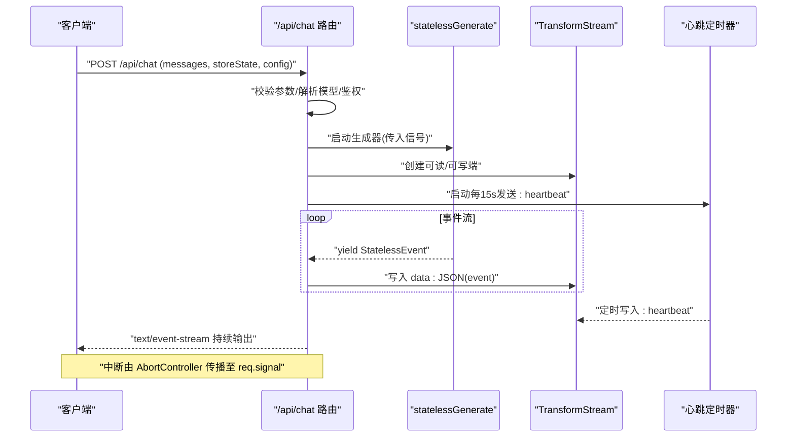
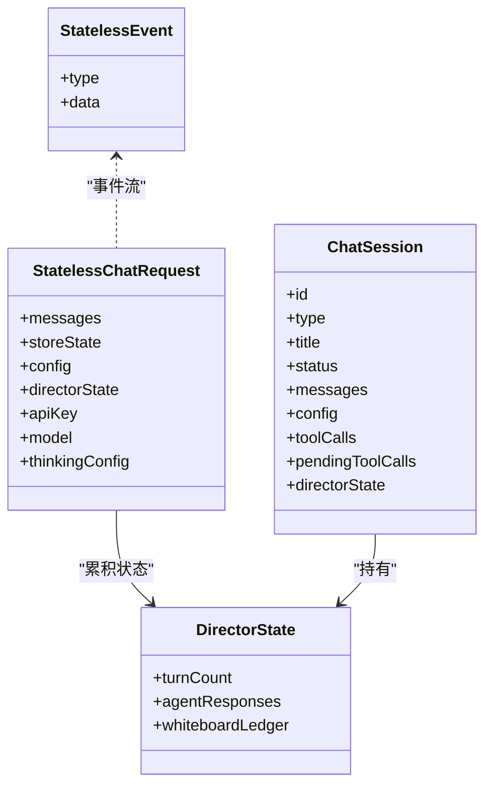
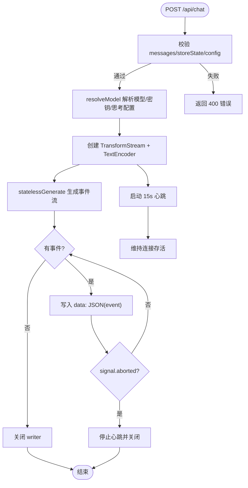
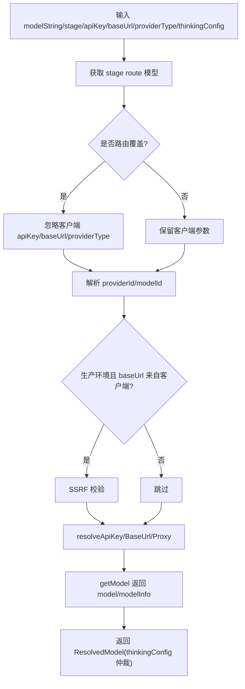
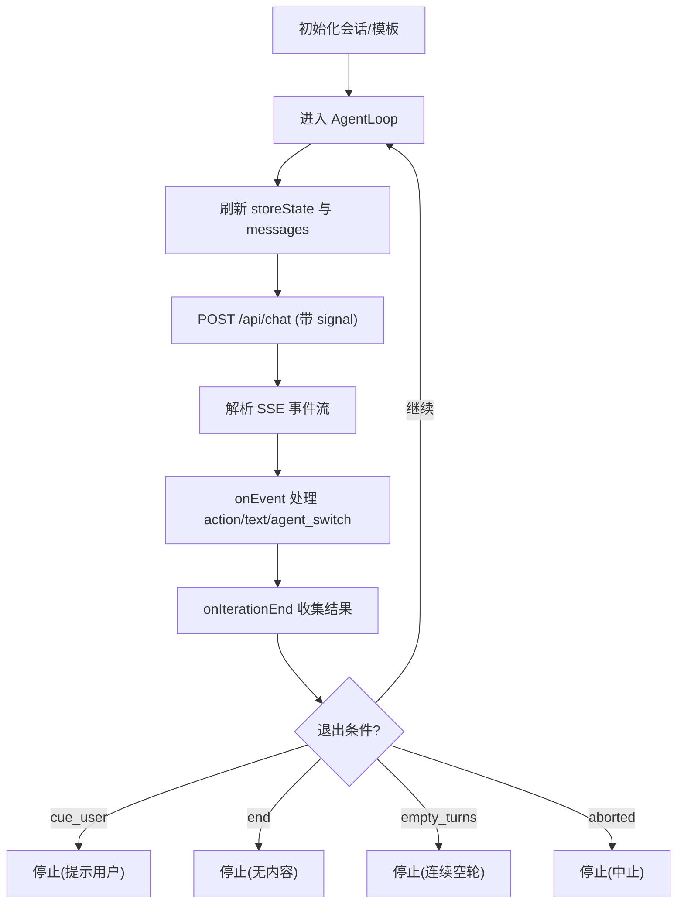
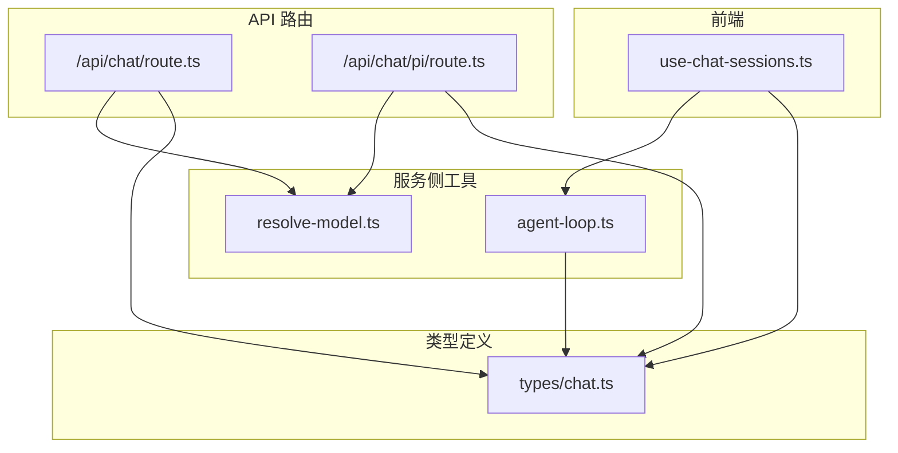

# 聊天对话 API

<cite>
**本文引用的文件**   
- [app/api/chat/route.ts](file://app/api/chat/route.ts)
- [app/api/chat/pi/route.ts](file://app/api/chat/pi/route.ts)
- [lib/types/chat.ts](file://lib/types/chat.ts)
- [lib/server/resolve-model.ts](file://lib/server/resolve-model.ts)
- [lib/chat/agent-loop.ts](file://lib/chat/agent-loop.ts)
- [components/chat/use-chat-sessions.ts](file://components/chat/use-chat-sessions.ts)
</cite>

## 产品概述
OpenMAIC 的聊天对话 API 提供多智能体实时对话能力，采用无状态设计并通过 Server-Sent Events（SSE）进行流式传输。客户端在每次请求中携带完整上下文（消息与 storeState），服务端执行单轮或多轮生成并返回事件流，包括文本增量、工具调用、角色切换、提示用户等。系统支持心跳保活、断线重连、错误事件上报、以及可选的 Pi 模式（课堂多智能体并行循环）。

## 核心业务流程
- 连接建立：客户端 POST 到 /api/chat 或 /api/chat/pi，服务端返回 text/event-stream 响应头，开启 SSE 通道。
- 发送消息：请求体包含 messages、storeState、config.agentIds 等；服务端校验后解析模型与凭据。
- 流式处理：服务端通过 TransformStream 写入 data: JSON 事件，周期性发送 :heartbeat 注释保持连接活跃。
- 结束与清理：收到 done 事件后关闭 writer；若被中止则静默关闭；异常时发送 error 事件。
- 前端循环：use-chat-sessions 驱动 runAgentLoop，逐轮刷新 storeState 并消费 SSE 事件，直到 director 指示 cue_user 或 end。



**图表来源** 
- [app/api/chat/route.ts:44-207](file://app/api/chat/route.ts#L44-L207)
- [lib/chat/agent-loop.ts:125-238](file://lib/chat/agent-loop.ts#L125-L238)

**章节来源**
- [app/api/chat/route.ts:44-207](file://app/api/chat/route.ts#L44-L207)
- [lib/chat/agent-loop.ts:125-238](file://lib/chat/agent-loop.ts#L125-L238)

## 功能模块清单
- 无状态聊天接口 /api/chat
  - 职责：接收完整上下文，运行 statelessGenerate，按事件流返回 SSE。
  - 关键点：maxDuration=60s；心跳间隔 15s；错误事件统一格式；Abort 传播。
- Pi 导演接口 /api/chat/pi
  - 职责：课堂多智能体并行循环 PoC，限制最大回合与动作数，可选白板工具。
  - 关键点：maxDuration=300s；启用开关 isPiChatEnabled；白名单 agentIds 校验。
- 模型解析 resolveModel
  - 职责：统一解析 modelString、apiKey、baseUrl、providerType、thinkingConfig；SSRF 防护；阶段路由覆盖。
- 前端会话管理 use-chat-sessions
  - 职责：构建请求模板、维护会话状态、消费 SSE 事件、驱动 AgentLoop、软关闭与恢复。
- 共享 AgentLoop
  - 职责：通用循环逻辑，迭代刷新 storeState，解析 SSE，判定退出条件（cue_user/end/空轮/中止）。

**章节来源**
- [app/api/chat/route.ts:44-207](file://app/api/chat/route.ts#L44-L207)
- [app/api/chat/pi/route.ts:28-213](file://app/api/chat/pi/route.ts#L28-L213)
- [lib/server/resolve-model.ts:40-128](file://lib/server/resolve-model.ts#L40-L128)
- [components/chat/use-chat-sessions.ts:1130-1932](file://components/chat/use-chat-sessions.ts#L1130-L1932)
- [lib/chat/agent-loop.ts:125-238](file://lib/chat/agent-loop.ts#L125-L238)

## 数据与状态
- 请求体 StatelessChatRequest
  - 字段：messages、storeState、config.agentIds/sessionType/triggerAgentId/piMaxAgentTurns/piMaxActionsPerAgent/piEnableWhiteboardTools、directorState、userProfile、apiKey/baseUrl/model/providerType/thinking/thinkingConfig。
- 事件类型 StatelessEvent
  - agent_start/agent_end/text_delta/action/thinking/cue_user/done/error。
- DirectorState
  - turnCount、agentResponses、whiteboardLedger；跨请求累积，客户端维护。
- 会话状态 ChatSession
  - id/type/title/status/messages/config/toolCalls/pendingToolCalls/createdAt/updatedAt/sceneId/endReason/softCloseDeadline/directorState。



**图表来源** 
- [lib/types/chat.ts:309-391](file://lib/types/chat.ts#L309-L391)
- [lib/types/chat.ts:408-449](file://lib/types/chat.ts#L408-L449)
- [lib/types/chat.ts:299-303](file://lib/types/chat.ts#L299-L303)
- [lib/types/chat.ts:49-66](file://lib/types/chat.ts#L49-L66)

**章节来源**
- [lib/types/chat.ts:309-391](file://lib/types/chat.ts#L309-L391)
- [lib/types/chat.ts:408-449](file://lib/types/chat.ts#L408-L449)
- [lib/types/chat.ts:299-303](file://lib/types/chat.ts#L299-L303)
- [lib/types/chat.ts:49-66](file://lib/types/chat.ts#L49-L66)

## 关键约束与边界
- 无状态设计：服务端不持久化会话，所有状态由客户端随请求传递；中断通过 AbortController 传播至 req.signal。
- 超时与限流：/api/chat maxDuration=60s；/api/chat/pi maxDuration=300s。
- 心跳保活：每 15s 发送 :heartbeat 注释，避免代理/浏览器关闭空闲 SSE。
- 模型解析优先级：stage route > x-model > DEFAULT_MODEL；受管 provider 忽略客户端 baseUrl；生产环境对非受管 baseUrl 做 SSRF 校验。
- 输入校验：messages/storeState/config.agentIds 必填；Pi 路径要求 agentIds 为非空、唯一、去空白字符串集合。
- 错误处理：统一返回 {success:false, errorCode, error}；SSE 内发送 error 事件；中止时静默关闭 writer。
- 性能优化：默认 thinking disabled；按需启用 Pi 白板工具；最小化重复状态传输。

**章节来源**
- [app/api/chat/route.ts:25-26](file://app/api/chat/route.ts#L25-L26)
- [app/api/chat/pi/route.ts:26](file://app/api/chat/pi/route.ts#L26)
- [app/api/chat/route.ts:100-120](file://app/api/chat/route.ts#L100-L120)
- [lib/server/resolve-model.ts:55-93](file://lib/server/resolve-model.ts#L55-L93)
- [app/api/chat/pi/route.ts:54-66](file://app/api/chat/pi/route.ts#L54-L66)
- [app/api/chat/route.ts:154-186](file://app/api/chat/route.ts#L154-L186)
- [lib/chat/agent-loop.ts:125-238](file://lib/chat/agent-loop.ts#L125-L238)

## 详细实现要点

### 无状态聊天接口 /api/chat
- 请求校验：messages、storeState、config.agentIds 必填；缺失返回 400。
- 模型解析：调用 resolveModel，必要时强制 thinking disabled 以降低延迟。
- SSE 流：使用 TransformStream 与 TextEncoder，逐事件写入 data: JSON；后台协程负责心跳与异常处理。
- 中断与错误：signal.aborted 时停止写入并关闭 writer；捕获异常后发送 error 事件。



**图表来源** 
- [app/api/chat/route.ts:44-207](file://app/api/chat/route.ts#L44-L207)

**章节来源**
- [app/api/chat/route.ts:44-207](file://app/api/chat/route.ts#L44-L207)

### Pi 导演接口 /api/chat/pi
- 特性开关：isPiChatEnabled() 控制是否可用。
- 参数校验：agentIds 必须为非空、唯一、去空白字符串；未知 agent 直接拒绝。
- 运行循环：runPiDirectorLoop 接收 send 回调，按 maxAgentTurns/maxActionsPerAgent 限制；可选启用白板工具。
- 心跳与错误：同 /api/chat 的心跳策略与错误事件上报。

```mermaid
sequenceDiagram
participant Client as "客户端"
participant PiRoute as "/api/chat/pi"
participant Loop as "runPiDirectorLoop"
participant Send as "send(event)"
Client->>PiRoute : "POST (messages, storeState, config)"
PiRoute->>PiRoute : "校验 agentIds/特征开关"
PiRoute->>Loop : "启动导演循环(含上限/信号)"
Loop->>Send : "emit 事件(text_delta/action/cue_user/done...)"
Send-->>Client : "SSE data : JSON"
Loop-->>PiRoute : "完成/错误/中止"
PiRoute-->>Client : "关闭流"
```

**图表来源** 
- [app/api/chat/pi/route.ts:28-213](file://app/api/chat/pi/route.ts#L28-L213)

**章节来源**
- [app/api/chat/pi/route.ts:28-213](file://app/api/chat/pi/route.ts#L28-L213)

### 模型解析 resolveModel
- 优先级：stage route > x-model > DEFAULT_MODEL；受管 provider 忽略客户端 baseUrl。
- 安全：生产环境对非受管 baseUrl 执行 SSRF 校验。
- Thinking：routed 场景以 stage thinking 为准；unrouted 场景尊重 client thinkingConfig。



**图表来源** 
- [lib/server/resolve-model.ts:40-128](file://lib/server/resolve-model.ts#L40-L128)

**章节来源**
- [lib/server/resolve-model.ts:40-128](file://lib/server/resolve-model.ts#L40-L128)

### 前端会话管理与 AgentLoop
- 会话创建：use-chat-sessions 构造 ChatRequestTemplate，注入 generated agentConfigs、Pi 边界上下文。
- 循环驱动：runAgentLoop 迭代刷新 storeState，POST 请求，解析 SSE 事件，onIterationEnd 收集结果。
- 退出条件：cue_user 停止；totalAgents=0 表示 END；连续两次空轮停止；abort 立即退出。
- 软关闭：会话结束时设置 softCloseDeadline，用于 UI 优雅关闭与恢复。



**图表来源** 
- [lib/chat/agent-loop.ts:125-238](file://lib/chat/agent-loop.ts#L125-L238)
- [components/chat/use-chat-sessions.ts:1130-1932](file://components/chat/use-chat-sessions.ts#L1130-L1932)

**章节来源**
- [lib/chat/agent-loop.ts:125-238](file://lib/chat/agent-loop.ts#L125-L238)
- [components/chat/use-chat-sessions.ts:1130-1932](file://components/chat/use-chat-sessions.ts#L1130-L1932)

## 依赖分析
- 路由层依赖：
  - /api/chat 依赖 statelessGenerate、resolveModel、isProviderKeyRequired、apiError、logger。
  - /api/chat/pi 依赖 runPiDirectorLoop、resolveAgentConfigs、getPiMax*、isPiChatEnabled、resolveModel。
- 类型与状态：
  - lib/types/chat.ts 定义 StatelessChatRequest、StatelessEvent、DirectorState、ChatSession。
- 前端与循环：
  - components/chat/use-chat-sessions.ts 驱动 runAgentLoop，注入 fetchChat/onEvent/onIterationEnd。
  - lib/chat/agent-loop.ts 提供通用循环逻辑。



**图表来源** 
- [app/api/chat/route.ts:44-207](file://app/api/chat/route.ts#L44-L207)
- [app/api/chat/pi/route.ts:28-213](file://app/api/chat/pi/route.ts#L28-L213)
- [lib/server/resolve-model.ts:40-128](file://lib/server/resolve-model.ts#L40-L128)
- [lib/chat/agent-loop.ts:125-238](file://lib/chat/agent-loop.ts#L125-L238)
- [lib/types/chat.ts:309-391](file://lib/types/chat.ts#L309-L391)
- [components/chat/use-chat-sessions.ts:1130-1932](file://components/chat/use-chat-sessions.ts#L1130-L1932)

**章节来源**
- [app/api/chat/route.ts:44-207](file://app/api/chat/route.ts#L44-L207)
- [app/api/chat/pi/route.ts:28-213](file://app/api/chat/pi/route.ts#L28-L213)
- [lib/server/resolve-model.ts:40-128](file://lib/server/resolve-model.ts#L40-L128)
- [lib/chat/agent-loop.ts:125-238](file://lib/chat/agent-loop.ts#L125-L238)
- [lib/types/chat.ts:309-391](file://lib/types/chat.ts#L309-L391)
- [components/chat/use-chat-sessions.ts:1130-1932](file://components/chat/use-chat-sessions.ts#L1130-L1932)

## 性能考虑
- 低延迟默认：thinking 默认 disabled，减少首字延迟。
- 心跳保活：15s 间隔，避免中间网络组件丢弃空闲连接。
- 流式处理：TransformStream + TextEncoder 降低内存占用，边生成边推送。
- 限制与保护：maxDuration 控制最长运行时间；SSRF 校验防止恶意 base URL。
- 前端缓冲：StreamBuffer 与 onIterationEnd 等待缓冲排空，避免 UI 抖动。

[本节为通用指导，不直接分析具体文件]

## 故障排查指南
- 常见错误码：
  - MISSING_REQUIRED_FIELD：缺少 messages/storeState/config.agentIds。
  - INVALID_REQUEST：agentIds 非法或存在未知 agent。
  - MISSING_API_KEY：必需 provider 未提供 apiKey。
  - INTERNAL_ERROR：服务器内部异常。
- 调试建议：
  - 检查 SSE 头部 Content-Type=text/event-stream 与 Cache-Control=no-cache。
  - 观察 :heartbeat 注释是否稳定出现，确认连接未被代理断开。
  - 打印 StatelessEvent 序列，定位 text_delta/action/cue_user/done 顺序是否符合预期。
  - 使用 AbortController 模拟中断，验证 signal.aborted 分支行为。
- 监控方法：
  - 记录日志：Chat API/Pi Chat API 的请求模型、消息数量、agent 列表、错误堆栈。
  - 指标采集：平均首字节延迟、事件吞吐、错误率、中断率。

**章节来源**
- [app/api/chat/route.ts:154-186](file://app/api/chat/route.ts#L154-L186)
- [app/api/chat/pi/route.ts:170-192](file://app/api/chat/pi/route.ts#L170-L192)
- [lib/logger.ts](file://lib/logger.ts)

## 结论
OpenMAIC 聊天对话 API 通过无状态设计与 SSE 流式传输，实现了高效、可扩展的多智能体实时对话。结合模型解析、心跳保活、错误事件与前端 AgentLoop，形成完整的端到端链路。Pi 模式进一步支持课堂场景下的多智能体协作与白板工具。建议在集成时严格遵循输入校验、错误处理与性能优化策略，确保稳定性与用户体验。