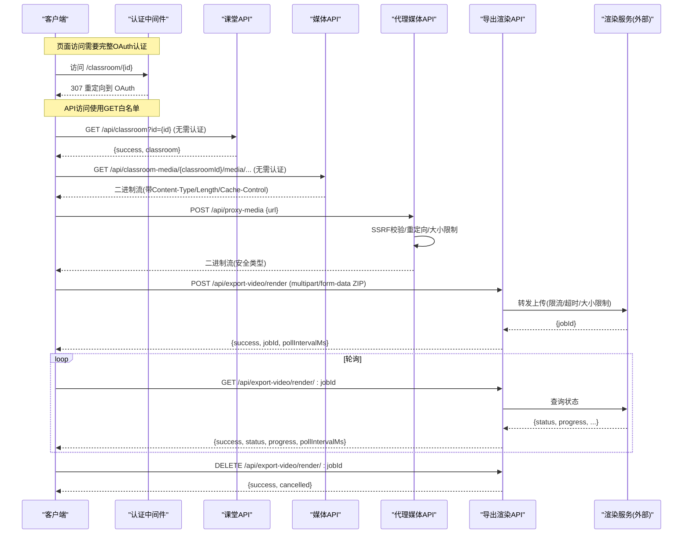
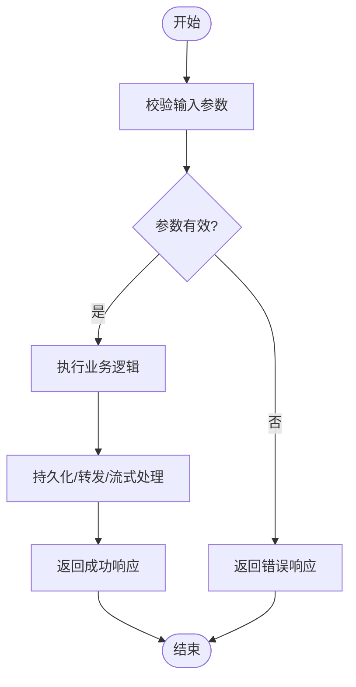

# 课堂管理类 API

<cite>
**本文引用的文件**   
- [app/api/classroom/route.ts](file://app/api/classroom/route.ts)
- [app/api/classroom-media/[classroomId]/[...path]/route.ts](file://app/api/classroom-media/[classroomId]/[...path]/route.ts)
- [app/api/export-video/render/route.ts](file://app/api/export-video/render/route.ts)
- [app/api/export-video/render/[jobId]/route.ts](file://app/api/export-video/render/[jobId]/route.ts)
- [app/api/export-video/capability/route.ts](file://app/api/export-video/capability/route.ts)
- [app/api/proxy-media/route.ts](file://app/api/proxy-media/route.ts)
- [app/api/generate-classroom/route.ts](file://app/api/generate-classroom/route.ts)
- [proxy.ts](file://proxy.ts)
- [lib/server/api-response.ts](file://lib/server/api-response.ts)
- [lib/logger.ts](file://lib/logger.ts)
</cite>

## 更新摘要
**所做更改**   
- 更新了认证机制说明，新增 GET-only 白名单功能，允许 /api/classroom 和 /api/classroom-media/ 的只读访问无需认证
- 详细说明了页面级 OAuth 重定向与 API 级认证的分离机制
- 增强了错误处理与日志记录功能的描述
- 优化了媒体文件访问的安全策略说明

## 产品概述
OpenMAIC 的课堂管理类 API 提供课堂（Classroom）的创建、查询与媒体资源管理，以及视频导出渲染的异步处理能力。该系列接口面向前端与集成方，统一通过 Next.js App Router 暴露 RESTful 端点，采用统一的响应封装与错误码体系，支持流式传输、SSRF 防护、大小限制与代理转发等关键能力。

**重要安全特性**：系统实现了分层认证机制，页面级访问需要完整的 OAuth 认证流程，而课堂数据读取 API 通过 GET-only 白名单实现无认证访问，确保内容可被公开访问的同时保持安全性。

## 核心业务流程
- 课堂创建与获取：POST /api/classroom 创建课堂并持久化；GET /api/classroom?id=... 获取课堂详情（无需认证）。
- 课堂媒体访问：GET /api/classroom-media/:classroomId/media|audio/... 安全地读取本地媒体文件，支持流式输出与缓存头（无需认证）。
- 远程媒体代理：POST /api/proxy-media 代理下载远端媒体，进行 SSRF 校验、重定向处理与类型白名单过滤。
- 视频导出渲染：POST /api/export-video/render 提交 ZIP 包到渲染服务；GET /api/export-video/render/:jobId 轮询状态；DELETE /api/export-video/render/:jobId 取消任务；GET /api/export-video/capability 探测渲染能力。
- 课堂生成（可选扩展）：POST /api/generate-classroom 创建生成任务；GET /api/generate-classroom/:jobId 轮询进度与结果。

**章节来源**
- [app/api/classroom/route.ts:14-49](file://app/api/classroom/route.ts#L14-L49)
- [app/api/classroom/route.ts:51-86](file://app/api/classroom/route.ts#L51-L86)
- [app/api/classroom-media/[classroomId]/[...path]/route.ts:23-95](file://app/api/classroom-media/[classroomId]/[...path]/route.ts#L23-L95)
- [app/api/proxy-media/route.ts:23-92](file://app/api/proxy-media/route.ts#L23-L92)
- [app/api/export-video/render/route.ts:46-113](file://app/api/export-video/render/route.ts#L46-L113)
- [app/api/export-video/render/[jobId]/route.ts:12-57](file://app/api/export-video/render/[jobId]/route.ts#L12-L57)
- [proxy.ts:43-50](file://proxy.ts#L43-L50)

## 功能模块清单
- 课堂 CRUD
  - 创建课堂：POST /api/classroom，接收 stage 与 scenes，返回 id 与 url。
  - 获取课堂：GET /api/classroom?id=...，返回 classroom 对象（**无需认证**）。
  - 删除/更新：当前路由未直接实现，可通过上层存储层或前端调用其他接口完成（本仓库未包含对应路由）。
- 课堂媒体管理
  - 读取媒体：GET /api/classroom-media/:classroomId/{media|audio}/...，仅允许 media 与 audio 子目录，防止路径穿越，流式输出（**无需认证**）。
- 远程媒体代理
  - 代理下载：POST /api/proxy-media，校验 URL、限制重定向次数、限制大小、强制安全 Content-Type。
- 视频导出渲染
  - 能力探测：GET /api/export-video/capability，返回 enabled。
  - 提交渲染：POST /api/export-video/render，转发 multipart/form-data 至渲染服务，返回 jobId 与轮询间隔。
  - 状态查询：GET /api/export-video/render/:jobId，返回状态、进度、阶段信息。
  - 取消任务：DELETE /api/export-video/render/:jobId，返回是否取消成功。
- 课堂生成（扩展）
  - 创建任务：POST /api/generate-classroom，返回 jobId、pollUrl、pollIntervalMs。
  - 轮询任务：GET /api/generate-classroom/:jobId，返回进度、步骤、结果与错误信息。

**章节来源**
- [app/api/classroom/route.ts:14-49](file://app/api/classroom/route.ts#L14-L49)
- [app/api/classroom/route.ts:51-86](file://app/api/classroom/route.ts#L51-L86)
- [app/api/classroom-media/[classroomId]/[...path]/route.ts:23-95](file://app/api/classroom-media/[classroomId]/[...path]/route.ts#L23-L95)
- [app/api/proxy-media/route.ts:23-92](file://app/api/proxy-media/route.ts#L23-L92)
- [app/api/export-video/capability/route.ts:13-16](file://app/api/export-video/capability/route.ts#L13-L16)
- [app/api/export-video/render/route.ts:46-113](file://app/api/export-video/render/route.ts#L46-L113)
- [app/api/export-video/render/[jobId]/route.ts:12-57](file://app/api/export-video/render/[jobId]/route.ts#L12-L57)
- [app/api/generate-classroom/route.ts:14-72](file://app/api/generate-classroom/route.ts#L14-L72)

## 数据与状态
- 课堂数据模型
  - 创建请求体：包含 stage（含 id）与 scenes 数组。
  - 创建响应：{ success: true, id, url }。
  - 查询响应：{ success: true, classroom }。
- 媒体访问
  - 路径约束：仅允许 media 与 audio 子目录；禁止 .. 与空字节字符；解析真实路径确保在课堂目录内。
  - 响应头：Content-Type 由扩展名决定；Content-Length 为文件大小；Cache-Control 公共缓存 86400 秒不可变。
- 代理媒体
  - 请求体：{ url: string }。
  - 响应：二进制流，Content-Type 限定 image/*、video/*、audio/*，否则回退 application/octet-stream。
  - 大小限制：最大 25 MiB（按 content-length 与 blob.size 双重校验）。
- 视频导出渲染
  - 提交请求：multipart/form-data，ZIP 包；服务端限制 300 MiB（按 content-length 与流计数双重校验）。
  - 提交响应：{ success: true, jobId, pollIntervalMs }，HTTP 202。
  - 状态查询：返回 status（queued/running/succeeded/failed/cancelled）、progress（0..1）、currentStage、framesRendered、totalFrames、error、done。
  - 取消任务：返回 { success: true, cancelled: true }。
- 课堂生成（扩展）
  - 提交请求：包含 requirement 等字段；返回 jobId、status、step、message、pollUrl、pollIntervalMs。
  - 轮询响应：包含 progress、scenesGenerated、totalScenes、result、error、done。

**章节来源**
- [app/api/classroom/route.ts:14-49](file://app/api/classroom/route.ts#L14-L49)
- [app/api/classroom/route.ts:51-86](file://app/api/classroom/route.ts#L51-L86)
- [app/api/classroom-media/[classroomId]/[...path]/route.ts:23-95](file://app/api/classroom-media/[classroomId]/[...path]/route.ts#L23-L95)
- [app/api/proxy-media/route.ts:23-92](file://app/api/proxy-media/route.ts#L23-L92)
- [app/api/export-video/render/route.ts:46-113](file://app/api/export-video/render/route.ts#L46-L113)
- [app/api/export-video/render/[jobId]/route.ts:12-57](file://app/api/export-video/render/[jobId]/route.ts#L12-L57)
- [app/api/generate-classroom/route.ts:14-72](file://app/api/generate-classroom/route.ts#L14-L72)

## 关键约束与边界
- **权限验证机制**
  - **GET-only 白名单**：/api/classroom 和 /api/classroom-media/ 的 GET 请求无需认证，允许公开访问课堂数据和媒体资源。
  - **页面级认证**：所有页面访问（如 /classroom/{id}）仍需完整的 OAuth 认证流程，未认证用户会被重定向到授权页面。
  - **其他 API**：除白名单外的所有 API 都需要有效的会话认证或服务密钥。
  - **速率限制**：即使白名单 API 也受速率限制保护，防止滥用。
- 文件大小限制
  - 课堂媒体：无显式上限，但受限于服务器磁盘与网络带宽。
  - 代理媒体：最大 25 MiB。
  - 导出渲染：最大 300 MiB（ZIP 包），同时设置上传超时与流式截断。
- 性能优化建议
  - 使用流式传输避免大文件内存占用（媒体与导出渲染均使用流）。
  - 合理设置 Cache-Control 提升缓存命中率（媒体默认 public immutable 1天；代理媒体 private 1小时）。
  - 对慢链路上传设置足够超时（导出渲染提交超时 300s）。
  - 使用能力探测接口在前端动态显示"一键 MP4 导出"选项。
- 错误处理策略
  - 统一使用 apiError 与 apiSuccess 封装响应，包含 errorCode、error、details。
  - 上游错误映射：429 速率限制、413 过大、502 上游错误、404 未找到等。
  - 日志记录：关键异常路径均记录结构化日志便于排查。
- 安全边界
  - 路径穿越防护：媒体读取严格校验子目录与真实路径。
  - SSRF 防护：代理媒体对初始 URL 与每次重定向目标进行校验。
  - 内容类型白名单：仅允许 image/*、video/*、audio/*，其余回退为 octet-stream。
  - **安全设计原则**：课堂 ID 使用不可猜测的 10 字符 nanoid，确保即使 API 公开访问也不会泄露敏感内容。

**章节来源**
- [proxy.ts:43-50](file://proxy.ts#L43-L50)
- [proxy.ts:101-116](file://proxy.ts#L101-L116)
- [lib/server/api-response.ts:1-51](file://lib/server/api-response.ts#L1-L51)
- [app/api/classroom-media/[classroomId]/[...path]/route.ts:23-95](file://app/api/classroom-media/[classroomId]/[...path]/route.ts#L23-L95)
- [app/api/proxy-media/route.ts:23-92](file://app/api/proxy-media/route.ts#L23-L92)
- [app/api/export-video/render/route.ts:46-113](file://app/api/export-video/render/route.ts#L46-L113)

## 增强错误处理与日志记录

### 文件系统错误处理改进
课堂媒体访问现在提供了更详细的文件系统错误处理，特别是针对 ENOENT（文件不存在）场景的专门处理：

- **ENOENT 错误检测**：当文件不存在时，系统会返回 404 状态码而不是通用错误
- **详细错误日志**：记录具体的 classroomId 和路径信息，便于问题定位
- **结构化错误响应**：返回清晰的错误消息而非技术细节

### HTTP 状态码捕获增强
所有 API 端点现在都实现了更精确的 HTTP 状态码捕获：

- **课堂创建**：成功返回 201，失败返回 500
- **课堂查询**：未找到返回 404，无效 ID 返回 400
- **媒体访问**：文件不存在返回 404，路径非法返回 400
- **代理媒体**：上游错误根据状态码分类处理（4xx 保持原样，5xx 转换为 502）
- **导出渲染**：渲染服务错误映射为适当的 HTTP 状态码

### 响应文本记录优化
错误处理现在包含响应文本的详细记录：

- **网络错误**：记录完整的错误消息和堆栈信息
- **API 错误**：捕获并记录上游服务的错误响应文本
- **调试信息**：支持 JSON 格式日志输出，便于自动化分析

**章节来源**
- [app/api/classroom-media/[classroomId]/[...path]/route.ts:85-94](file://app/api/classroom-media/[classroomId]/[...path]/route.ts#L85-L94)
- [app/api/classroom/route.ts:37-48](file://app/api/classroom/route.ts#L37-L48)
- [app/api/classroom/route.ts:74-85](file://app/api/classroom/route.ts#L74-L85)
- [app/api/proxy-media/route.ts:88-91](file://app/api/proxy-media/route.ts#L88-L91)
- [lib/logger.ts:1-53](file://lib/logger.ts#L1-L53)

## 附录：API 调用示例与集成指南
- 创建课堂
  - 方法：POST
  - 路径：/api/classroom
  - 请求体：{ stage: { id?: string }, scenes: any[] }
  - 响应：{ success: true, id: string, url: string }
  - 错误：MISSING_REQUIRED_FIELD、INTERNAL_ERROR
- 获取课堂详情
  - 方法：GET
  - 路径：/api/classroom?id={id}
  - 响应：{ success: true, classroom: object }
  - **无需认证**，可直接访问
  - 错误：INVALID_REQUEST、INTERNAL_ERROR
- 读取课堂媒体
  - 方法：GET
  - 路径：/api/classroom-media/{classroomId}/media/{...path} 或 /api/classroom-media/{classroomId}/audio/{...path}
  - 响应：二进制流（Content-Type、Content-Length、Cache-Control）
  - **无需认证**，可直接访问
  - 错误：INVALID_REQUEST、NOT_FOUND、INTERNAL_ERROR
- 代理远程媒体
  - 方法：POST
  - 路径：/api/proxy-media
  - 请求体：{ url: string }
  - 响应：二进制流（安全 Content-Type）
  - 错误：INVALID_URL、UPSTREAM_ERROR、INTERNAL_ERROR
- 导出渲染能力探测
  - 方法：GET
  - 路径：/api/export-video/capability
  - 响应：{ success: true, enabled: boolean }
- 提交导出渲染任务
  - 方法：POST
  - 路径：/api/export-video/render
  - 请求体：multipart/form-data（ZIP）
  - 响应：{ success: true, jobId: string, pollIntervalMs: number }
  - 错误：INVALID_REQUEST、RATE_LIMITED、UPSTREAM_ERROR、INTERNAL_ERROR
- 查询导出渲染状态
  - 方法：GET
  - 路径：/api/export-video/render/{jobId}
  - 响应：{ success: true, status, progress, currentStage, framesRendered, totalFrames, error, done, pollIntervalMs }
  - 错误：UPSTREAM_ERROR、INTERNAL_ERROR
- 取消导出渲染任务
  - 方法：DELETE
  - 路径：/api/export-video/render/{jobId}
  - 响应：{ success: true, cancelled: boolean }
  - 错误：UPSTREAM_ERROR、INTERNAL_ERROR
- 课堂生成（可选）
  - 方法：POST
  - 路径：/api/generate-classroom
  - 请求体：{ requirement, pdfContent?, enableWebSearch?, webSearchProviderId?, webSearchApiKey?, baiduSubSources?, enableImageGeneration?, enableVideoGeneration?, enableTTS?, agentMode? }
  - 响应：{ success: true, jobId, status, step, message, pollUrl, pollIntervalMs }
  - 错误：MISSING_REQUIRED_FIELD、INTERNAL_ERROR

**章节来源**
- [app/api/classroom/route.ts:14-49](file://app/api/classroom/route.ts#L14-L49)
- [app/api/classroom/route.ts:51-86](file://app/api/classroom/route.ts#L51-L86)
- [app/api/classroom-media/[classroomId]/[...path]/route.ts:23-95](file://app/api/classroom-media/[classroomId]/[...path]/route.ts#L23-L95)
- [app/api/proxy-media/route.ts:23-92](file://app/api/proxy-media/route.ts#L23-L92)
- [app/api/export-video/capability/route.ts:13-16](file://app/api/export-video/capability/route.ts#L13-L16)
- [app/api/export-video/render/route.ts:46-113](file://app/api/export-video/render/route.ts#L46-L113)
- [app/api/export-video/render/[jobId]/route.ts:12-57](file://app/api/export-video/render/[jobId]/route.ts#L12-L57)
- [app/api/generate-classroom/route.ts:14-72](file://app/api/generate-classroom/route.ts#L14-L72)
- [lib/server/api-response.ts:1-51](file://lib/server/api-response.ts#L1-L51)