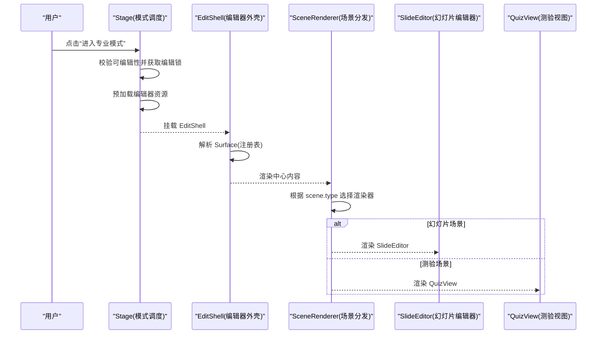
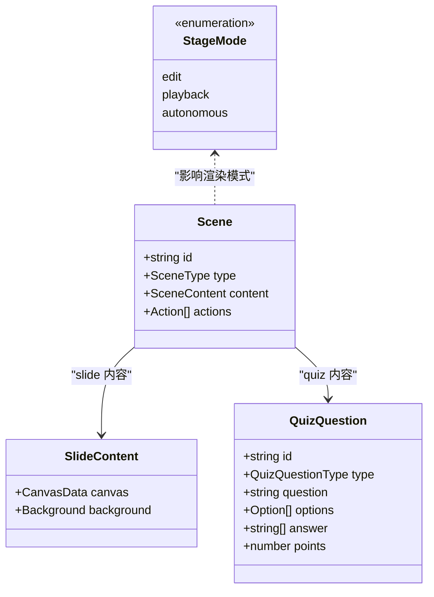

# UI 组件系统

<cite>
**本文引用的文件**   
- [components/stage.tsx](file://components/stage.tsx)
- [components/stage/scene-renderer.tsx](file://components/stage/scene-renderer.tsx)
- [components/slide-renderer/Editor/index.tsx](file://components/slide-renderer/Editor/index.tsx)
- [components/slide-renderer/Editor/Canvas/index.tsx](file://components/slide-renderer/Editor/Canvas/index.tsx)
- [components/edit/EditShell/EditShell.tsx](file://components/edit/EditShell/EditShell.tsx)
- [lib/edit/nnoop-surface.tsx](file://lib/edit/noop-surface.tsx)
- [components/scene-renderers/quiz-view.tsx](file://components/scene-renderers/quiz-view.tsx)
- [components/settings/index.tsx](file://components/settings/index.tsx)
- [components/ui/button.tsx](file://components/ui/button.tsx)
- [components/ui/dialog.tsx](file://components/ui/dialog.tsx)
- [lib/types/stage.ts](file://lib/types/stage.ts)
- [app/globals.css](file://app/globals.css)
</cite>

## 产品概述
OpenMAIC 的 UI 组件系统围绕“课件编辑”和“课堂回放”两大模式构建，提供幻灯片编辑器、场景渲染器、设置面板等核心能力。系统基于 Next.js + React 19，使用 Zustand 进行状态管理，并通过统一的 Stage 容器在编辑与回放模式间切换。UI 层采用 Tailwind CSS 与 shadcn/ui 基础组件（Button、Dialog 等），结合 motion 动画实现流畅的过渡效果。整体设计强调响应式布局、无障碍访问、主题化与跨浏览器兼容，同时通过可插拔的场景渲染器支持多种课件类型（幻灯片、测验、交互式页面、PBL）。

## 核心业务流程
- 模式切换：Stage 根据当前 mode（edit/playback/autonomous）决定挂载 EditChromeRoot 或 PlaybackChromeRoot，并在切换时执行清理与预加载，保证平滑过渡。
- 场景分发：SceneRenderer 依据 scene.type 选择对应渲染器（SlideEditor、QuizView、InteractiveRenderer、PBLRenderer），确保播放路径稳定。
- 编辑器外壳：EditShell 通过 SceneEditorRegistry 解析 surface，统一命令栏、浮动工具栏、提示条等 chrome，保持跨场景一致体验。
- 设置面板：SettingsDialog 集中管理各类 Provider（LLM、图像、视频、TTS、ASR、PDF、Web Search），支持动态添加、删除与模型探测。

**图表来源**  
- [components/stage.tsx:33-168](file://components/stage.tsx#L33-L168)
- [components/stage/scene-renderer.tsx:20-41](file://components/stage/scene-renderer.tsx#L20-L41)
- [components/edit/EditShell/EditShell.tsx:74-123](file://components/edit/EditShell/EditShell.tsx#L74-L123)

**章节来源**  
- [components/stage.tsx:33-168](file://components/stage.tsx#L33-L168)
- [components/stage/scene-renderer.tsx:20-41](file://components/stage/scene-renderer.tsx#L20-L41)
- [components/edit/EditShell/EditShell.tsx:74-123](file://components/edit/EditShell/EditShell.tsx#L74-L123)

## 功能模块清单
- 幻灯片编辑器（SlideEditor）
  - 职责：提供画布、元素操作（拖拽、缩放、旋转）、对齐线、网格、标尺、右键菜单等。
  - 用户价值：可视化编辑课件内容，支持复杂排版与交互。
  - 验收要点：元素操作流畅、对齐辅助准确、快捷键可用、上下文菜单完整。
- 场景渲染器（SceneRenderer）
  - 职责：根据场景类型分发到具体渲染器（幻灯片、测验、交互式、PBL）。
  - 用户价值：统一播放入口，支持多形态课件。
  - 验收要点：类型判断正确、渲染无闪烁、错误处理友好。
- 设置面板（SettingsDialog）
  - 职责：集中配置各类 Provider（LLM、图像、视频、TTS、ASR、PDF、Web Search）。
  - 用户价值：灵活扩展 AI 能力，支持自定义 Provider。
  - 验收要点：Provider 列表可增删改、模型探测正常、保存状态反馈清晰。
- 基础 UI 组件（Button、Dialog 等）
  - 职责：提供一致的视觉风格与交互行为。
  - 用户价值：提升开发效率与用户体验一致性。
  - 验收要点：样式可定制、无障碍标签完善、键盘导航支持。

**章节来源**  
- [components/slide-renderer/Editor/index.tsx:10-18](file://components/slide-renderer/Editor/index.tsx#L10-L18)
- [components/slide-renderer/Editor/Canvas/index.tsx:62-416](file://components/slide-renderer/Editor/Canvas/index.tsx#L62-L416)
- [components/scene-renderers/quiz-view.tsx:40-800](file://components/scene-renderers/quiz-view.tsx#L40-L800)
- [components/settings/index.tsx:220-800](file://components/settings/index.tsx#L220-L800)
- [components/ui/button.tsx:44-68](file://components/ui/button.tsx#L44-L68)
- [components/ui/dialog.tsx:10-143](file://components/ui/dialog.tsx#L10-L143)

## 数据与状态
- 核心数据模型
  - Scene：包含 id、type、content、actions 等字段，支持 slide、quiz、interactive、pbl 四种内容类型。
  - SlideContent：包含 canvas.elements、theme、background 等编辑相关数据。
  - QuizQuestion：包含 type、options、answer、points 等测验题目信息。
- 关键状态流转
  - Stage 模式：edit ↔ playback/autonomous，受编辑锁与可编辑性约束。
  - Canvas 状态：activeElementIdList、creatingElement、showRuler 等控制编辑器行为。
  - Quiz 状态：phase（not_started → answering → grading → reviewing）驱动测验流程。
- 数据所有权边界
  - StageStore 管理全局场景与模式。
  - CanvasStore 管理画布局部状态。
  - SettingsStore 管理 Provider 配置。
  - 各 Surface 通过 useSurfaceState 暴露编辑状态给 Chrome。

**图表来源**  
- [lib/types/stage.ts:105-155](file://lib/types/stage.ts#L105-L155)

**章节来源**  
- [lib/types/stage.ts:105-155](file://lib/types/stage.ts#L105-L155)
- [components/slide-renderer/Editor/Canvas/index.tsx:67-101](file://components/slide-renderer/Editor/Canvas/index.tsx#L67-L101)
- [components/scene-renderers/quiz-view.tsx:689-799](file://components/scene-renderers/quiz-view.tsx#L689-L799)

## 关键约束与边界
- 非功能性需求
  - 性能：Canvas 使用 useRef 与局部状态优化拖拽/缩放性能；Quiz 使用 memo 与 useMemo 减少重渲染。
  - 无障碍：Dialog、Button 等组件遵循 Radix UI 无障碍规范，支持键盘导航与屏幕阅读器。
  - 响应式：Tailwind 类名适配不同屏幕尺寸，StageGrid 提供弹性布局。
- 依赖与集成边界
  - 外部依赖：motion（动画）、@openmaic/dsl（课件 DSL）、Zustand（状态管理）。
  - 内部依赖：Stage 作为顶层容器，EditShell 作为编辑器外壳，SceneRenderer 作为分发器。
- 业务约束
  - 编辑模式需满足可编辑性条件（当前场景存在且未生成大纲）。
  - 多标签页编辑冲突通过编辑锁解决。
  - 交互式场景 iframe 在模式切换时保持存活，避免重复加载。

**章节来源**  
- [components/stage.tsx:45-97](file://components/stage.tsx#L45-L97)
- [components/edit/EditShell/EditShell.tsx:81-123](file://components/edit/EditShell/EditShell.tsx#L81-L123)
- [lib/edit/noop-surface.tsx:29-62](file://lib/edit/noop-surface.tsx#L29-L62)