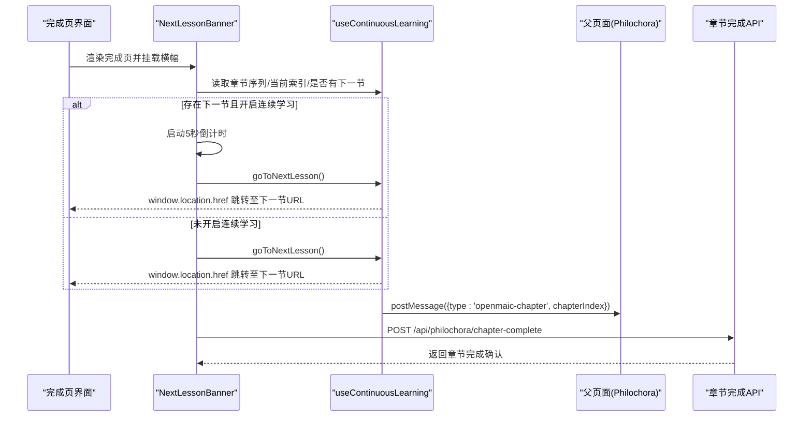
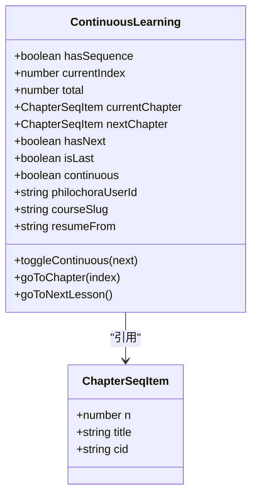

# 下一节课导航

<cite>
**本文引用的文件**   
- [components/scene-renderers/next-lesson.tsx](file://components/scene-renderers/next-lesson.tsx)
- [lib/hooks/use-continuous-learning.ts](file://lib/hooks/use-continuous-learning.ts)
- [components/scene-renderers/classroom-complete.tsx](file://components/scene-renderers/classroom-complete.tsx)
- [app/api/philochora/chapter-complete/route.ts](file://app/api/philochora/chapter-complete/route.ts)
- [e2e/tests/continuous-learning-callback.spec.ts](file://e2e/tests/continuous-learning-callback.spec.ts)
</cite>

## 更新摘要
**所做更改**   
- 更新了连续学习URL参数支持，新增courseSlug和resumeFrom参数
- 增强了章节完成回调机制，支持课程标识和用户进度追踪
- 改进了多章节学习状态管理，提供更精确的学习位置恢复功能
- 更新了API路由以支持新的参数验证和HMAC签名机制

## 产品概述
NextLesson（下一节课）导航组件用于在课堂完成页引导用户进入下一个学习场景或课程。它基于"连续学习"上下文，提供自动跳转与手动跳转两种模式，并在最后一节时给出"全部完成"的提示。该组件现在支持更丰富的URL参数，包括courseSlug（课程标识）和resumeFrom（恢复位置），用于实现更精确的多章节学习状态管理和异常退出后的学习位置恢复。

## 核心业务流程
- **入口与上下文**：课堂完成页渲染 NextLessonBanner，Hook useContinuousLearning 解析 URL 中的章节序列、当前索引、外部用户标识、课程标识和恢复位置；判断是否存在下一节、是否处于最后一节。
- **交互分支**：
  - 开启"连续学习"开关：显示可取消的倒计时自动跳转条，倒计时结束自动跳转到下一节；用户可随时点击"立即进入"提前跳转。
  - 关闭"连续学习"开关：显示"进入下一节"按钮，点击后跳转。
  - 已是最后一节：显示"课程全部完成"提示。
- **进度反馈**：底部显示当前进度（当前序号/总章节数）。
- **外部同步**：加载时向父窗口发送当前章节索引，供外部课程详情页同步高亮；同时通过API回调通知Philochora系统章节完成状态。

**图表来源** 
- [components/scene-renderers/next-lesson.tsx:36-51](file://components/scene-renderers/next-lesson.tsx#L36-L51)
- [lib/hooks/use-continuous-learning.ts:125-137](file://lib/hooks/use-continuous-learning.ts#L125-L137)
- [components/scene-renderers/next-lesson.tsx:40-56](file://components/scene-renderers/next-lesson.tsx#L40-L56)

## 功能模块清单
- **连续学习上下文解析**
  - 职责：从 URL 参数解析章节序列、当前索引、外部用户标识、课程标识和恢复位置；计算 hasNext/isLast/total/currentChapter/nextChapter。
  - 验收要点：无序列时不渲染；正确识别最后一节；跨代理路径（/openmaic/classroom/）兼容；支持新的courseSlug和resumeFrom参数。
- **导航横幅 UI**
  - 职责：展示"连续学习"开关、倒计时条、立即进入按钮、进度信息、完成提示。
  - 验收要点：倒计时可取消；按钮文案与图标清晰；暗色主题适配；无障碍标签可用。
- **跳转逻辑**
  - 职责：构造目标 URL（保留 chaptersRaw、philochoraUserId、courseSlug 和 resumeFrom），更新 chapterIndex，执行整页跳转。
  - 验收要点：保持所有必要参数；路径推导兼容不同部署前缀。
- **章节完成回调**
  - 职责：课堂完成页挂载时自动调用API，通知Philochora系统记录章节完成状态。
  - 验收要点：包含完整的用户ID、课程标识、章节编号和标题；静默失败不影响主流程。
- **外部同步**
  - 职责：加载时向父窗口发送当前章节索引，用于外部课程详情页高亮同步。
  - 验收要点：postMessage 安全调用；异常捕获不影响主流程。

**章节来源**
- [lib/hooks/use-continuous-learning.ts:27-40](file://lib/hooks/use-continuous-learning.ts#L27-L40)
- [lib/hooks/use-continuous-learning.ts:48-59](file://lib/hooks/use-continuous-learning.ts#L48-L59)
- [lib/hooks/use-continuous-learning.ts:108-127](file://lib/hooks/use-continuous-learning.ts#L108-L127)
- [components/scene-renderers/next-lesson.tsx:40-56](file://components/scene-renderers/next-lesson.tsx#L40-L56)

## 数据与状态
- **章节序列数据结构**
  - ChapterSeqItem：包含 n（章节号）、title（标题）、cid（OpenMAIC classroom id）。
  - 来源：URL 参数 chapters（base64(JSON)）解码得到。
- **关键状态**
  - hasSequence：是否存在有效章节序列。
  - currentIndex / total：当前索引与总数。
  - currentChapter / nextChapter：当前与下一节章节对象。
  - hasNext / isLast：是否有下一节、是否最后一节。
  - continuous：用户偏好开关（localStorage 持久化）。
  - philochoraUserId：Philochora 用户标识（用于进度回传）。
  - courseSlug：课程标识（用于进度回传识别课程）。
  - resumeFrom：恢复位置标识（异常退出后恢复学习位置）。
- **状态流转**
  - 初始化：解析 URL → 计算章节序列与索引 → 设置 continuous 初始值。
  - 用户操作：toggleContinuous 更新 localStorage 与状态；goToNextLesson/goToChapter 触发跳转。
  - 外部通信：currentIndex 变化时 postMessage 通知父页面；章节完成时调用API回调。

**图表来源** 
- [lib/hooks/use-continuous-learning.ts:17-23](file://lib/hooks/use-continuous-learning.ts#L17-L23)
- [lib/hooks/use-continuous-learning.ts:61-74](file://lib/hooks/use-continuous-learning.ts#L61-L74)

**章节来源**
- [lib/hooks/use-continuous-learning.ts:17-23](file://lib/hooks/use-continuous-learning.ts#L17-L23)
- [lib/hooks/use-continuous-learning.ts:61-74](file://lib/hooks/use-continuous-learning.ts#L61-L74)
- [lib/hooks/use-continuous-learning.ts:89-106](file://lib/hooks/use-continuous-learning.ts#L89-L106)

## 新增功能详解

### URL参数增强支持
连续学习钩子现在支持以下URL参数：
- **courseSlug**：课程唯一标识符，用于在多课程环境中区分不同的学习路径
- **resumeFrom**：恢复位置标识，支持异常退出后的学习位置恢复

这些参数在跳转时会被保留，确保学习状态的连续性。

### 章节完成回调机制
组件现在实现了自动化的章节完成回调：
- 课堂完成页挂载时自动调用 `/api/philochora/chapter-complete`
- 传递完整的学习上下文：用户ID、课程标识、章节编号和标题
- 服务端进行HMAC签名验证，确保请求安全性
- 静默失败处理，不影响用户体验

### 多章节学习状态管理
增强的状态管理支持：
- 精确的课程级别学习追踪
- 异常退出后的学习位置恢复
- 跨会话的学习进度同步

**章节来源**
- [lib/hooks/use-continuous-learning.ts:42-63](file://lib/hooks/use-continuous-learning.ts#L42-63)
- [lib/hooks/use-continuous-learning.ts:78-84](file://lib/hooks/use-continuous-learning.ts#L78-84)
- [app/api/philochora/chapter-complete/route.ts:36-43](file://app/api/philochora/chapter-complete/route.ts#L36-43)

## 关键约束与边界
- **非连续学习上下文**：当不存在章节序列时，组件不渲染任何内容，避免误触。
- **最后一节处理**：isLast 为真时仅展示"课程全部完成"，不再提供跳转能力。
- **路径兼容性**：跳转时根据当前 pathname 推导基础路径，兼容 /openmaic/classroom/ 与 /classroom/ 两种形态。
- **本地存储可用性**：localStorage 不可用时忽略错误，保证主流程稳定。
- **外部通信容错**：postMessage 失败不影响跳转与渲染。
- **API回调容错**：章节完成回调失败不影响主流程，静默处理错误。
- **性能考虑**：倒计时使用 setInterval，组件卸载时清理；连续学习开关持久化减少重复读取。
- **参数完整性**：跳转时保留所有必要的URL参数，确保学习状态的一致性。

**章节来源**
- [components/scene-renderers/next-lesson.tsx:53-66](file://components/scene-renderers/next-lesson.tsx#L53-L66)
- [lib/hooks/use-continuous-learning.ts:108-127](file://lib/hooks/use-continuous-learning.ts#L108-L127)
- [lib/hooks/use-continuous-learning.ts:129-137](file://lib/hooks/use-continuous-learning.ts#L129-L137)
- [components/scene-renderers/next-lesson.tsx:40-56](file://components/scene-renderers/next-lesson.tsx#L40-L56)

## 测试覆盖
系统包含完整的端到端测试，验证：
- 章节完成回调的正确触发和参数传递
- 无连续学习上下文时不触发回调
- API服务不可用时的容错处理
- 新参数的正确处理和传递

**章节来源**
- [e2e/tests/continuous-learning-callback.spec.ts:46-93](file://e2e/tests/continuous-learning-callback.spec.ts#L46-93)
- [e2e/tests/continuous-learning-callback.spec.ts:95-115](file://e2e/tests/continuous-learning-callback.spec.ts#L95-115)
- [e2e/tests/continuous-learning-callback.spec.ts:117-141](file://e2e/tests/continuous-learning-callback.spec.ts#L117-141)