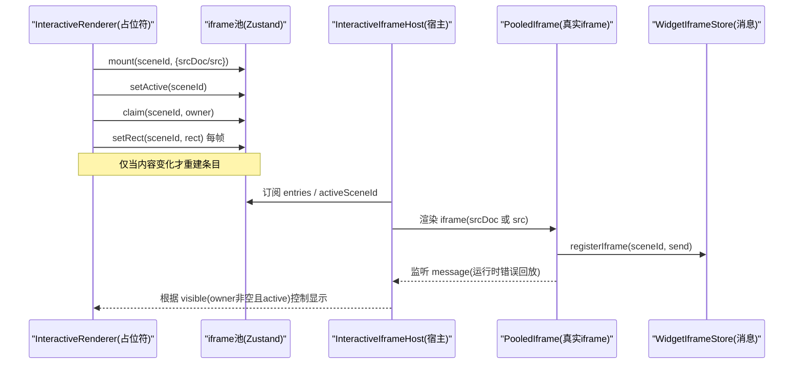
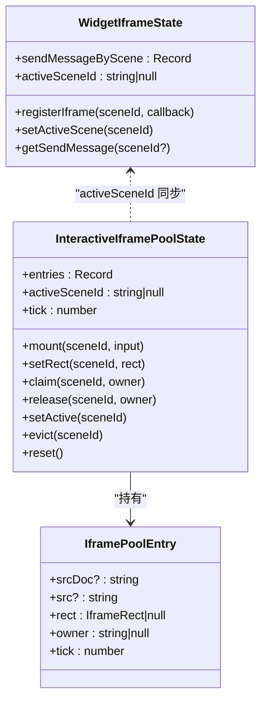
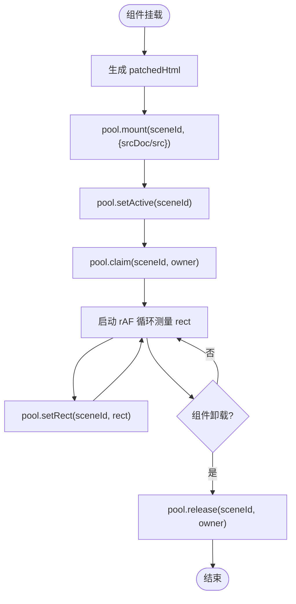
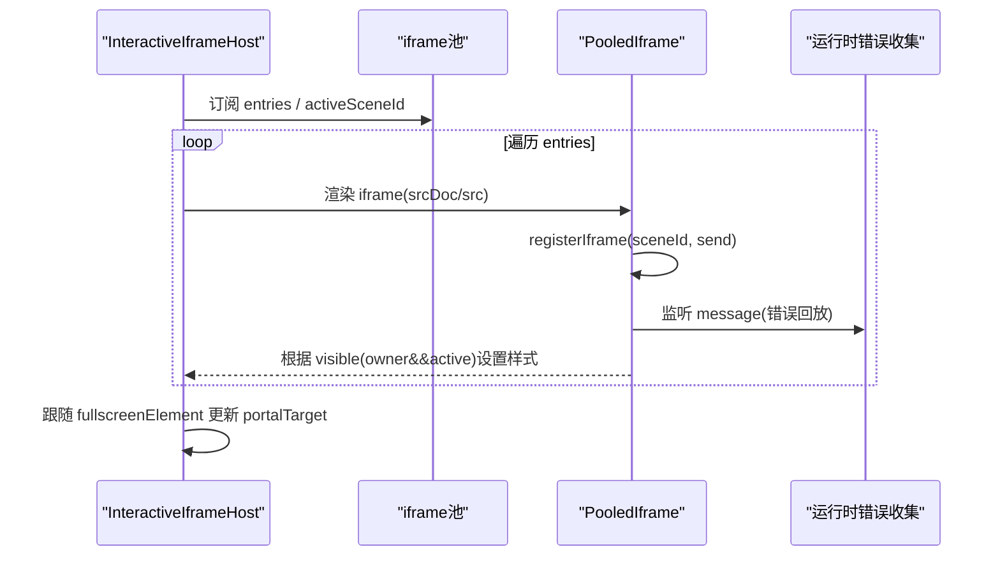
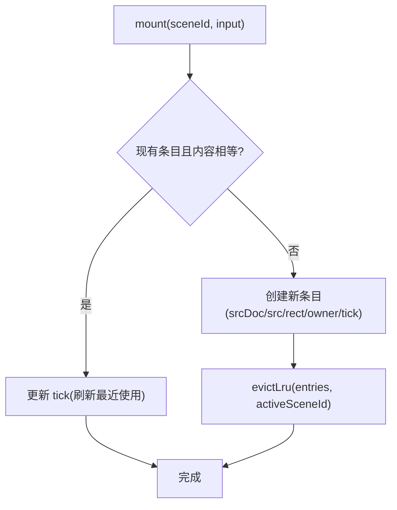
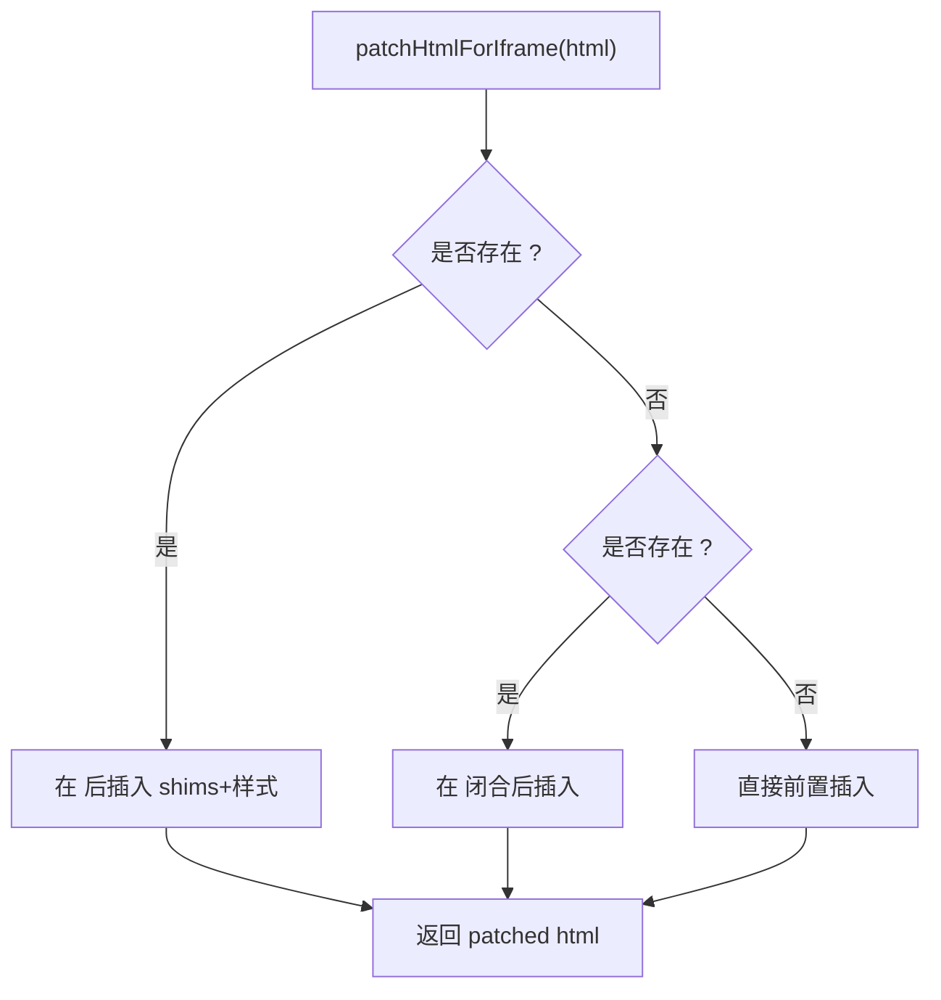
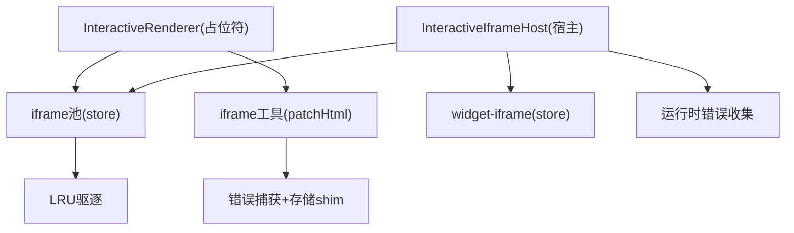

# 交互式内容渲染器

<cite>
**本文引用的文件**   
- [interactive-renderer.tsx](file://components/scene-renderers/interactive-renderer.tsx)
- [InteractiveIframeHost.tsx](file://components/scene-renderers/InteractiveIframeHost.tsx)
- [interactive-iframe-pool.ts](file://lib/store/interactive-iframe-pool.ts)
- [iframe.ts](file://lib/utils/iframe.ts)
- [widget-iframe.ts](file://lib/store/widget-iframe.ts)
- [interactive-iframe-keepalive-619.spec.ts](file://e2e/tests/interactive-iframe-keepalive-619.spec.ts)
- [iframe-sandbox.test.ts](file://tests/security/iframe-sandbox.test.ts)
</cite>

## 产品概述
本组件用于在课件中安全、稳定地渲染 HTML 交互式内容。通过“占位符 + 宿主”的架构，将实际的 iframe 元素从频繁重挂载的场景树中剥离，放入稳定的宿主节点中，从而避免页面切换、模式切换导致的文档重建与状态丢失。核心能力包括：
- 基于 iframe 池的内容持久化（LRU 上限）
- 生命周期管理（挂载、激活、可见性声明、释放）
- HTML 内容补丁与安全隔离（沙箱、存储 shim、错误捕获）
- 屏幕矩形跟踪（requestAnimationFrame 实时同步位置）
- 与 InteractiveIframeHost 协作实现跨组件状态保持
- 性能优化与内存管理最佳实践
- 常见问题排查与调试技巧

## 核心业务流程
- 占位符注册：InteractiveRenderer 在挂载时向 iframe 池登记场景内容与来源（srcDoc 或 src），并声明当前为活跃场景。
- 可见性声明：每个占位符实例拥有唯一 owner token，claim/release 保证竞态安全，避免旧实例卸载覆盖新实例的可见性。
- 屏幕矩形上报：使用 requestAnimationFrame 循环读取 slot 的 getBoundingClientRect，更新池中 rect，供宿主定位 iframe。
- 宿主渲染：InteractiveIframeHost 作为稳定根节点，按 entries 渲染真实 iframe，并通过 portal 跟随全屏容器。
- 通信与错误：通过 postMessage 进行父/子通信；iframe 内注入错误捕获与存储 shim，确保沙箱下可运行且可诊断。

**图表来源** 
- [interactive-renderer.tsx:22-69](file://components/scene-renderers/interactive-renderer.tsx#L22-L69)
- [interactive-iframe-pool.ts:96-172](file://lib/store/interactive-iframe-pool.ts#L96-L172)
- [InteractiveIframeHost.tsx:32-75](file://components/scene-renderers/InteractiveIframeHost.tsx#L32-L75)
- [InteractiveIframeHost.tsx:100-177](file://components/scene-renderers/InteractiveIframeHost.tsx#L100-L177)
- [widget-iframe.ts:27-50](file://lib/store/widget-iframe.ts#L27-L50)

**章节来源**
- [interactive-renderer.tsx:22-69](file://components/scene-renderers/interactive-renderer.tsx#L22-L69)
- [InteractiveIframeHost.tsx:32-75](file://components/scene-renderers/InteractiveIframeHost.tsx#L32-L75)
- [interactive-iframe-pool.ts:96-172](file://lib/store/interactive-iframe-pool.ts#L96-L172)
- [widget-iframe.ts:27-50](file://lib/store/widget-iframe.ts#L27-L50)

## 功能模块清单
- InteractiveRenderer（占位符）
  - 职责：注册内容、声明活跃与可见性、上报屏幕矩形、卸载时释放可见性但不驱逐条目。
  - 用户价值：确保 iframe 不随 React 重挂载而重建，实现零刷新返回。
  - 验收要点：mount/setActive/claim/release/setRect 调用顺序正确；rect 每帧更新；owner 竞态安全。
- InteractiveIframeHost（宿主）
  - 职责：稳定挂载、portal 到全屏容器、渲染 PooledIframe、同步 activeScene 到消息 store、收集运行时错误。
  - 用户价值：跨模式/场景切换保持 iframe 文档与状态；全屏模式下位置正确。
  - 验收要点：portal 目标跟随 fullscreenElement；visible 由 owner 与 activeSceneId 共同决定；错误回放生效。
- iframe 池（Zustand Store）
  - 职责：维护 entries（srcDoc/src/rect/owner/tick）、activeSceneId、LRU 驱逐、reset。
  - 用户价值：限制常驻文档数量，避免内存膨胀；快速路径复用相同内容。
  - 验收要点：mount 相等内容不重建；setRect 去抖比较；release 仅对 owner 生效；evict 保护 active。
- iframe 工具（patchHtmlForIframe）
  - 职责：注入错误捕获 shim、存储 shim、基础样式，确保沙箱下可运行与可观测。
  - 用户价值：避免 localStorage/sessionStorage 抛错导致白屏；统一尺寸与滚动行为。
  - 验收要点：shim 插入顺序（错误捕获优先于存储 shim）；head/head+attrs/fallback 三种插入策略。
- WidgetIframeStore（消息通道）
  - 职责：按 sceneId 注册 postMessage 回调；提供 getSendMessage；维护 activeSceneId 兼容旧路径。
  - 用户价值：避免多场景切换时的消息竞争；统一发送入口。
  - 验收要点：registerIframe 支持 null 注销；getSendMessage 回退到 activeSceneId。

**章节来源**
- [interactive-renderer.tsx:22-69](file://components/scene-renderers/interactive-renderer.tsx#L22-L69)
- [InteractiveIframeHost.tsx:32-75](file://components/scene-renderers/InteractiveIframeHost.tsx#L32-L75)
- [interactive-iframe-pool.ts:96-172](file://lib/store/interactive-iframe-pool.ts#L96-L172)
- [iframe.ts:110-146](file://lib/utils/iframe.ts#L110-L146)
- [widget-iframe.ts:27-50](file://lib/store/widget-iframe.ts#L27-L50)

## 数据与状态
- IframePoolEntry
  - srcDoc?: string — 内联 HTML（经 patch 后）
  - src?: string — 外部 URL
  - rect: IframeRect | null — 屏幕矩形（未测量前为 null）
  - owner: string | null — 可见性所有权 token
  - tick: number — LRU 时间戳
- InteractiveIframePoolState
  - entries: Record<string, IframePoolEntry>
  - activeSceneId: string | null
  - tick: number
  - 方法：mount/setRect/claim/release/setActive/evict/reset
- WidgetIframeState
  - sendMessageByScene: Record<string, (type, payload) => void>
  - activeSceneId: string | null
  - 方法：registerIframe/setActiveScene/getSendMessage

**图表来源** 
- [interactive-iframe-pool.ts:23-71](file://lib/store/interactive-iframe-pool.ts#L23-L71)
- [interactive-iframe-pool.ts:96-172](file://lib/store/interactive-iframe-pool.ts#L96-L172)
- [widget-iframe.ts:9-25](file://lib/store/widget-iframe.ts#L9-L25)

**章节来源**
- [interactive-iframe-pool.ts:23-71](file://lib/store/interactive-iframe-pool.ts#L23-L71)
- [interactive-iframe-pool.ts:96-172](file://lib/store/interactive-iframe-pool.ts#L96-L172)
- [widget-iframe.ts:9-25](file://lib/store/widget-iframe.ts#L9-L25)

## 关键约束与边界
- 安全隔离
  - iframe sandbox 不包含 allow-same-origin，避免 srcDoc 与父级同源风险；postMessage targetOrigin='*' 允许跨源通信。
  - 注入存储 shim 仅在 localStorage/sessionStorage 不可用时替换，保持沙箱完整。
- 生命周期与可见性
  - 占位符卸载仅 release(owner)，不驱逐条目；只有内容变更才会重建 iframe。
  - visible = owner !== null && sceneId === activeSceneId；未测量 rect 或 0×0 时不显示，避免闪烁。
- 性能与内存
  - LRU 上限 IFRAME_POOL_CAP=3，active 场景永不驱逐；mount 相等内容走快速路径。
  - setRect 比较四值，无变化则跳过更新；rAF 循环只在组件挂载期间运行。
- 全屏与 Portal
  - 宿主通过 createPortal 挂载到 document.fullscreenElement（存在时）或 document.body，确保全屏下 iframe 可见。
- 错误诊断
  - iframe 内捕获 window.onerror、unhandledrejection、console.error，缓冲并重放给父级；父级按 sceneId 聚合错误。

**章节来源**
- [InteractiveIframeHost.tsx:89-99](file://components/scene-renderers/InteractiveIframeHost.tsx#L89-L99)
- [iframe.ts:1-34](file://lib/utils/iframe.ts#L1-34)
- [iframe.ts:55-99](file://lib/utils/iframe.ts#L55-L99)
- [iframe.ts:110-146](file://lib/utils/iframe.ts#L110-L146)
- [interactive-iframe-pool.ts:77-94](file://lib/store/interactive-iframe-pool.ts#L77-L94)
- [interactive-iframe-pool.ts:126-141](file://lib/store/interactive-iframe-pool.ts#L126-L141)
- [InteractiveIframeHost.tsx:42-47](file://components/scene-renderers/InteractiveIframeHost.tsx#L42-L47)
- [InteractiveIframeHost.tsx:125-139](file://components/scene-renderers/InteractiveIframeHost.tsx#L125-L139)

## 详细组件分析

### InteractiveRenderer（占位符）
- 挂载流程
  - 计算 patchedHtml（若 content.html 存在则注入 shims 与样式）。
  - 调用 pool.mount(sceneId, {srcDoc/src})，标记 setActive 与 claim(owner)。
  - 启动 rAF 循环读取 slotRef.getBoundingClientRect 并 setRect。
  - 卸载时调用 release(sceneId, owner)，保留条目以维持文档。
- 关键点
  - owner 来自 useId，保证同一实例的唯一性与竞态安全。
  - 内容变化触发重新 mount，是唯一的 iframe 重建路径。
  - 使用 useMemo 缓存 patchedHtml，减少重复处理。

**图表来源** 
- [interactive-renderer.tsx:33-49](file://components/scene-renderers/interactive-renderer.tsx#L33-L49)
- [interactive-renderer.tsx:54-66](file://components/scene-renderers/interactive-renderer.tsx#L54-L66)

**章节来源**
- [interactive-renderer.tsx:22-69](file://components/scene-renderers/interactive-renderer.tsx#L22-L69)

### InteractiveIframeHost（宿主）
- 职责
  - 稳定挂载于 Stage 根，不受场景/模式切换影响。
  - 根据 entries 渲染 PooledIframe，visibility 由 owner 与 activeSceneId 决定。
  - 通过 createPortal 挂载到全屏容器，保证全屏下可见。
  - 注册 postMessage 回调，收集 iframe 运行时错误并回放。
- 关键点
  - sandbox="allow-scripts allow-forms allow-popups"，不含 allow-same-origin。
  - 使用 visibility:hidden 而非 display:none，避免隐藏后销毁文档。
  - 首次展示需等待 rect 非空且宽高>0，防止 0×0 闪烁。

**图表来源** 
- [InteractiveIframeHost.tsx:32-75](file://components/scene-renderers/InteractiveIframeHost.tsx#L32-L75)
- [InteractiveIframeHost.tsx:100-177](file://components/scene-renderers/InteractiveIframeHost.tsx#L100-L177)

**章节来源**
- [InteractiveIframeHost.tsx:32-75](file://components/scene-renderers/InteractiveIframeHost.tsx#L32-L75)
- [InteractiveIframeHost.tsx:100-177](file://components/scene-renderers/InteractiveIframeHost.tsx#L100-L177)

### iframe 池（Keep-Alive Pool）
- 数据结构
  - entries: 按 sceneId 索引的条目集合，包含 srcDoc/src、rect、owner、tick。
  - activeSceneId: 当前活跃场景，参与可见性判断与 LRU 保护。
- 核心逻辑
  - mount：相等内容快速路径（不重建 iframe），否则新建条目并 evictLru。
  - setRect：四值比较，避免不必要更新。
  - claim/release：owner 校验，防止竞态。
  - evict：按 tick 升序驱逐，active 场景豁免。
  - reset：清空所有条目与 active。

**图表来源** 
- [interactive-iframe-pool.ts:101-124](file://lib/store/interactive-iframe-pool.ts#L101-L124)
- [interactive-iframe-pool.ts:77-94](file://lib/store/interactive-iframe-pool.ts#L77-L94)

**章节来源**
- [interactive-iframe-pool.ts:96-172](file://lib/store/interactive-iframe-pool.ts#L96-L172)

### HTML 内容补丁与安全隔离
- 注入顺序
  - 错误捕获 shim（最先执行，捕获后续脚本错误）
  - 存储 shim（在 localStorage/sessionStorage 不可用时替换为内存实现）
  - 基础样式（html/body 尺寸与滚动）
- 插入策略
  - 优先在 <head> 后插入；若无 head，尝试匹配 <head ...>；最后回退到头部前置。
- 安全要点
  - iframe sandbox 不含 allow-same-origin，避免同源绕过。
  - postMessage 使用 targetOrigin='*'，配合父端 source 校验。

**图表来源** 
- [iframe.ts:110-146](file://lib/utils/iframe.ts#L110-L146)

**章节来源**
- [iframe.ts:1-34](file://lib/utils/iframe.ts#L1-34)
- [iframe.ts:55-99](file://lib/utils/iframe.ts#L55-L99)
- [iframe.ts:110-146](file://lib/utils/iframe.ts#L110-L146)

### 屏幕矩形跟踪机制
- 实现方式
  - 使用 requestAnimationFrame 循环读取 slotRef.getBoundingClientRect。
  - 将 left/top/width/height 写入 pool.setRect，供宿主定位 iframe。
- 性能考虑
  - 仅在组件挂载期间运行，卸载时 cancelAnimationFrame。
  - setRect 内部做四值比较，避免无效更新。

**章节来源**
- [interactive-renderer.tsx:54-66](file://components/scene-renderers/interactive-renderer.tsx#L54-L66)
- [interactive-iframe-pool.ts:126-141](file://lib/store/interactive-iframe-pool.ts#L126-L141)

### 与 InteractiveIframeHost 的协作模式
- 状态同步
  - Host 订阅 pool.entries 与 activeSceneId，渲染对应 iframe。
  - Host 将 activeSceneId 同步至 widget-iframe store，兼容旧路径。
- 通信与错误
  - 每个 PooledIframe 注册 sceneId→send 回调，供上层通过 widget-iframe store 发送消息。
  - 监听 message，过滤 e.source 与 __maicInteractive 标记，收集运行时错误并回放。

**章节来源**
- [InteractiveIframeHost.tsx:32-75](file://components/scene-renderers/InteractiveIframeHost.tsx#L32-L75)
- [InteractiveIframeHost.tsx:100-177](file://components/scene-renderers/InteractiveIframeHost.tsx#L100-L177)
- [widget-iframe.ts:27-50](file://lib/store/widget-iframe.ts#L27-L50)

## 依赖分析

**图表来源** 
- [interactive-renderer.tsx:22-69](file://components/scene-renderers/interactive-renderer.tsx#L22-L69)
- [InteractiveIframeHost.tsx:32-75](file://components/scene-renderers/InteractiveIframeHost.tsx#L32-L75)
- [interactive-iframe-pool.ts:96-172](file://lib/store/interactive-iframe-pool.ts#L96-L172)
- [iframe.ts:110-146](file://lib/utils/iframe.ts#L110-L146)
- [widget-iframe.ts:27-50](file://lib/store/widget-iframe.ts#L27-L50)

**章节来源**
- [interactive-renderer.tsx:22-69](file://components/scene-renderers/interactive-renderer.tsx#L22-L69)
- [InteractiveIframeHost.tsx:32-75](file://components/scene-renderers/InteractiveIframeHost.tsx#L32-L75)
- [interactive-iframe-pool.ts:96-172](file://lib/store/interactive-iframe-pool.ts#L96-L172)
- [iframe.ts:110-146](file://lib/utils/iframe.ts#L110-L146)
- [widget-iframe.ts:27-50](file://lib/store/widget-iframe.ts#L27-L50)

## 性能优化与内存管理
- 内容不变快速路径：mount 时比较 srcDoc/src 字符串，相等则仅刷新 tick，避免重建 iframe。
- LRU 上限：默认 3 个常驻文档，active 场景豁免；超出时按 tick 驱逐最久未用。
- 矩形更新去抖：setRect 比较四值，避免频繁 state 更新。
- 可见性控制：使用 visibility 而非 display，避免隐藏销毁文档；首次展示要求 rect 有效。
- 错误回放：iframe 内缓冲错误并在父端就绪后回放，避免漏报早期错误。
- Portal 目标：跟随 fullscreenElement，避免全屏下 iframe 脱离可视区域。

**章节来源**
- [interactive-iframe-pool.ts:101-124](file://lib/store/interactive-iframe-pool.ts#L101-L124)
- [interactive-iframe-pool.ts:77-94](file://lib/store/interactive-iframe-pool.ts#L77-L94)
- [interactive-iframe-pool.ts:126-141](file://lib/store/interactive-iframe-pool.ts#L126-L141)
- [InteractiveIframeHost.tsx:147-165](file://components/scene-renderers/InteractiveIframeHost.tsx#L147-L165)
- [iframe.ts:55-99](file://lib/utils/iframe.ts#L55-L99)

## 常见问题排查与调试
- 白屏/黑屏
  - 检查 iframe 是否已测量到有效 rect（宽/高>0）；未测量前不应显示。
  - 查看运行时错误收集：确认 __maicInteractive 标记与 errorKind/message 是否正确上报。
  - 验证 sandbox 配置：确保不包含 allow-same-origin。
- 状态丢失
  - 确认 mount 内容未变化（相等字符串应走快速路径）；若变化则属于预期重建。
  - 检查 owner 是否正确 claim/release，避免旧实例覆盖新实例可见性。
- 全屏异常
  - 确认 portal 目标跟随 fullscreenElement；在全屏模式下 iframe 应位于全屏子树内。
- 性能抖动
  - 观察 setRect 是否频繁触发；检查是否有不必要的重渲染。
  - 评估 entries 数量是否超过 IFRAME_POOL_CAP；必要时调整上限或优化内容大小。

**章节来源**
- [InteractiveIframeHost.tsx:147-165](file://components/scene-renderers/InteractiveIframeHost.tsx#L147-L165)
- [InteractiveIframeHost.tsx:125-139](file://components/scene-renderers/InteractiveIframeHost.tsx#L125-L139)
- [iframe-sandbox.test.ts:33-51](file://tests/security/iframe-sandbox.test.ts#L33-L51)
- [interactive-iframe-pool.ts:101-124](file://lib/store/interactive-iframe-pool.ts#L101-L124)
- [interactive-iframe-keepalive-619.spec.ts:178-205](file://e2e/tests/interactive-iframe-keepalive-619.spec.ts#L178-L205)

## 结论
InteractiveRenderer 与 InteractiveIframeHost 通过 iframe 池实现了交互式内容的持久化渲染与跨组件状态保持。其设计在保证安全隔离的前提下，提供了高效的内存管理与流畅的用户体验。通过严格的沙箱策略、完善的错误诊断与性能优化，该方案适用于需要稳定交互体验的课件场景。建议在生产环境中结合测试用例持续验证安全性与稳定性，并根据实际负载调整 LRU 上限与监控指标。