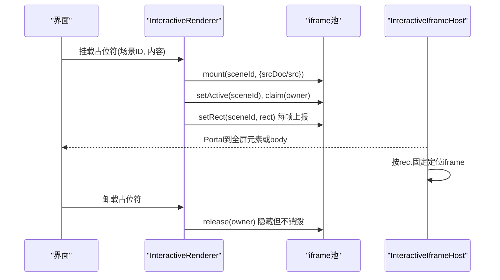
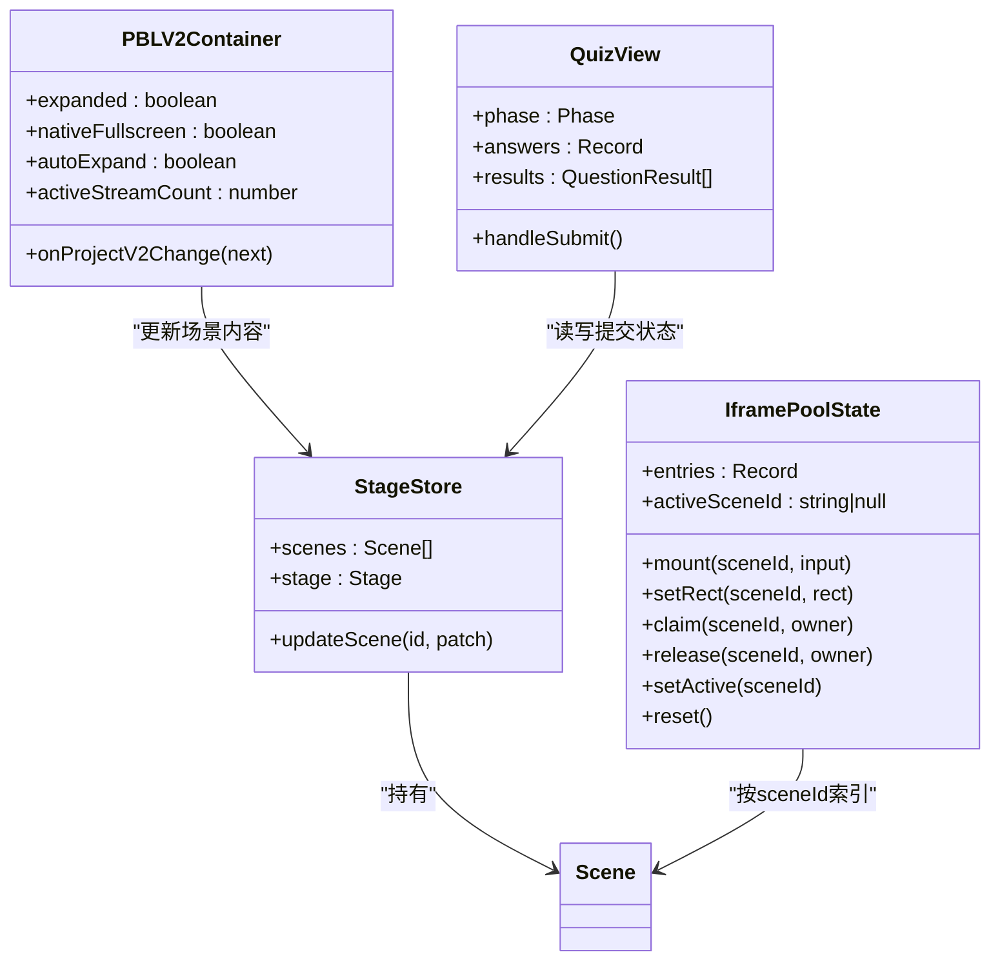

# 场景渲染组件

<cite>
**本文引用的文件**   
- [interactive-renderer.tsx](file://components/scene-renderers/interactive-renderer.tsx)
- [InteractiveIframeHost.tsx](file://components/scene-renderers/InteractiveIframeHost.tsx)
- [pbl-renderer.tsx](file://components/scene-renderers/pbl-renderer.tsx)
- [quiz-renderer.tsx](file://components/scene-renderers/quiz-renderer.tsx)
- [quiz-view.tsx](file://components/scene-renderers/quiz-view.tsx)
- [classroom-complete.tsx](file://components/scene-renderers/classroom-complete.tsx)
- [next-lesson.tsx](file://components/scene-renderers/next-lesson.tsx)
- [stage.ts](file://lib/types/stage.ts)
- [interactive-iframe-pool.ts](file://lib/store/interactive-iframe-pool.ts)
</cite>

## 目录
- 产品概述
- 核心业务流程
- 功能模块清单
- 数据与状态
- 关键约束与边界

## 产品概述
本章节聚焦“场景渲染组件”体系，覆盖四类典型教学场景的渲染与交互：交互式网页（iframe）、项目制学习（PBL v2/v1兼容）、测验答题与评分、课堂完成页总结与下一节课导航。系统基于 React + Zustand 状态管理，结合 DSL 数据模型进行场景类型分发与生命周期管理；通过 iframe 池化与 Portal 技术实现零重绘切换与沉浸式全屏体验；测验模块提供本地选择题评分与短答案 AI 评分，并持久化草稿与提交结果；完成页聚合统计、动画反馈与连续学习导航。

## 核心业务流程
- 交互式场景渲染流程
  - 占位符注册内容、声明可见性、上报屏幕矩形 → 宿主维护 iframe 池并按 rect 定位 → 切换场景时保持文档存活，避免重复加载。
- PBL 教学流程
  - Hero 引导 → 进入工作区（可全屏）→ 多流并发（讲师/评估/提交）→ 完成态回退至 Hero 或展示完成卡片 → 支持返回与继续。
- 测验流程
  - 封面 → 答题（单选/多选/简答）→ 提交 → 并行评分（本地选择 + 短答案 API）→ 回顾与分数展示 → 草稿恢复与持久化。
- 课堂完成页流程
  - 汇总各场景计数与测验得分 → 动画展示 → 推荐下一节课（连续学习开关与倒计时）。

**图表来源** 
- [interactive-renderer.tsx:22-69](file://components/scene-renderers/interactive-renderer.tsx#L22-L69)
- [InteractiveIframeHost.tsx:32-75](file://components/scene-renderers/InteractiveIframeHost.tsx#L32-L75)
- [interactive-iframe-pool.ts:96-172](file://lib/store/interactive-iframe-pool.ts#L96-L172)

**章节来源**
- [interactive-renderer.tsx:22-69](file://components/scene-renderers/interactive-renderer.tsx#L22-L69)
- [InteractiveIframeHost.tsx:32-75](file://components/scene-renderers/InteractiveIframeHost.tsx#L32-L75)
- [interactive-iframe-pool.ts:96-172](file://lib/store/interactive-iframe-pool.ts#L96-L172)

## 功能模块清单
- InteractiveRenderer 交互式渲染器
  - 职责：为交互式场景提供占位符，注册 srcDoc/src、声明活跃与可见性、上报屏幕矩形，确保 iframe 在宿主中稳定存在。
  - 关键点：使用 useId 作为可见性所有权令牌，避免模式切换竞态；requestAnimationFrame 跟踪布局变化。
  - 验收要点：切换场景不丢失页面状态；内容变更触发一次重建；全屏模式下正确跟随。
- PBLRenderer 项目制学习渲染器
  - 职责：承载 v2 工作区与 Hero，兼容 v1 projectConfig；管理展开/收起、原生全屏、后台流计数、阶段转换。
  - 关键点：Portal 到 body 或全屏根；autoExpand 一次性启动动画；activeStreamCount 控制忙碌态。
  - 验收要点：Hero→工作区过渡流畅；返回 Hero 保留进度；完成态全屏状态延续。
- QuizRenderer 测验渲染器（基础版）
  - 职责：渲染题目卡片与输入控件，支持单选/简答，自动模式提交按钮。
  - 关键点：选项值归一化（字符串或对象），本地答案状态。
  - 验收要点：选项显示与选中态一致；文本域输入正常。
- QuizView 测验视图（完整版）
  - 职责：封面、答题、评分、回顾、分数横幅、草稿恢复、持久化提交。
  - 关键点：选择题本地评分，短答案调用 /api/quiz-grade；Promise.all 并行；localStorage 持久化；语音转写辅助输入。
  - 验收要点：提交后进入评分态；错误降级给基础分；草稿恢复不覆盖已提交状态。
- ClassroomComplete 课堂完成页
  - 职责：汇总场景计数、测验得分环形图、鼓励文案、彩纸与奖杯动画、NextLesson 横幅。
  - 关键点：useMemo 计算摘要；尊重 reduced motion；日期格式化。
  - 验收要点：统计准确；动画可被用户偏好禁用；NextLesson 根据上下文渲染。
- NextLesson 下一节课导航
  - 职责：连续学习上下文下的下一节入口，支持开关自动跳转与倒计时取消。
  - 关键点：无序列不渲染；最后一节提示完成；倒计时与手动进入互斥。
  - 验收要点：连续学习开启时自动跳转；关闭后仅手动进入；进度信息正确。

**章节来源**
- [interactive-renderer.tsx:22-69](file://components/scene-renderers/interactive-renderer.tsx#L22-L69)
- [pbl-renderer.tsx:45-168](file://components/scene-renderers/pbl-renderer.tsx#L45-L168)
- [quiz-renderer.tsx:15-83](file://components/scene-renderers/quiz-renderer.tsx#L15-L83)
- [quiz-view.tsx:689-800](file://components/scene-renderers/quiz-view.tsx#L689-L800)
- [classroom-complete.tsx:309-506](file://components/scene-renderers/classroom-complete.tsx#L309-L506)
- [next-lesson.tsx:19-131](file://components/scene-renderers/next-lesson.tsx#L19-L131)

## 数据与状态
- 场景类型与 DSL 映射
  - SceneContent 联合类型包含 slide、quiz、interactive、pbl；AppScene 绑定 type 与 content.type，保证类型安全。
  - InteractiveContent 支持 url/html 与 widget 配置；PBLContent 支持 projectConfig 与 projectV2。
- 交互式 iframe 池状态
  - entries 以 sceneId 为键，记录 srcDoc/src、rect、owner、tick；LRU 上限 IFRAME_POOL_CAP=3；activeSceneId 控制当前活跃。
  - 操作：mount/setRect/claim/release/setActive/evict/reset。
- PBL v2 运行时
  - uiPhase 驱动 Hero/workspace/completed/generating；容器层维护 expanded/nativeFullscreen/autoExpand/streamCount。
  - 工作区层通过 createPortal 渲染，位置由 hostRef 测量与 ResizeObserver/scroll/RAF 同步。
- 测验状态
  - phase: not_started | answering | grading | reviewing；answers 按 questionId 存储；results 顺序与 questions 一致。
  - 草稿缓存 key 为 sceneId；提交后写入 localStorage；短答案评分失败降级。
- 完成页摘要
  - summarizeScenes 聚合 countsByType 与 quiz 统计；readAnswersForSummary 读取提交结果；AnimatedCounter/QuizRing 动画。
- 连续学习
  - hasSequence/hasNext/isLast/continuous/index/total 等状态；goToNextLesson 执行跳转；COUNTDOWN_SECONDS=5。

**图表来源** 
- [stage.ts:54-95](file://lib/types/stage.ts#L54-L95)
- [interactive-iframe-pool.ts:96-172](file://lib/store/interactive-iframe-pool.ts#L96-L172)
- [pbl-renderer.tsx:171-359](file://components/scene-renderers/pbl-renderer.tsx#L171-L359)
- [quiz-view.tsx:689-800](file://components/scene-renderers/quiz-view.tsx#L689-L800)

**章节来源**
- [stage.ts:54-95](file://lib/types/stage.ts#L54-L95)
- [interactive-iframe-pool.ts:96-172](file://lib/store/interactive-iframe-pool.ts#L96-L172)
- [pbl-renderer.tsx:171-359](file://components/scene-renderers/pbl-renderer.tsx#L171-L359)
- [quiz-view.tsx:689-800](file://components/scene-renderers/quiz-view.tsx#L689-L800)

## 关键约束与边界
- 安全性与沙箱
  - iframe sandbox 仅允许脚本、表单、弹窗，禁止 allow-same-origin，防止嵌入页面访问宿主状态；postMessage 使用 targetOrigin='*'。
- 性能与缓存
  - iframe 池 LRU 上限 3，避免内存膨胀；内容相同则复用 entry 避免重载；requestAnimationFrame + ResizeObserver 减少不必要重排。
  - 测验短答案评分并行请求，失败降级；草稿缓存隔离不同课堂场景。
- 全屏与层级
  - Portal 目标跟随 document.fullscreenElement，确保沉浸式播放时 iframe 可见；z-index 分层避免遮挡 Radix 弹出层。
- 数据一致性
  - PBL v2 运行时 normalizeProjectRuntime 保证结构一致；uiPhase 保护在 Hero 时不被工作区后台流覆盖。
  - 完成页摘要 useMemo 计算，避免重复评分；日期格式国际化处理。
- 可访问性与动效
  - 尊重 prefers-reduced-motion，禁用不必要的动画；屏幕阅读器单条 announce 替代频繁 live region。

**章节来源**
- [InteractiveIframeHost.tsx:100-177](file://components/scene-renderers/InteractiveIframeHost.tsx#L100-L177)
- [interactive-iframe-pool.ts:77-94](file://lib/store/interactive-iframe-pool.ts#L77-L94)
- [quiz-view.tsx:82-135](file://components/scene-renderers/quiz-view.tsx#L82-L135)
- [pbl-renderer.tsx:241-256](file://components/scene-renderers/pbl-renderer.tsx#L241-L256)
- [classroom-complete.tsx:309-350](file://components/scene-renderers/classroom-complete.tsx#L309-L350)