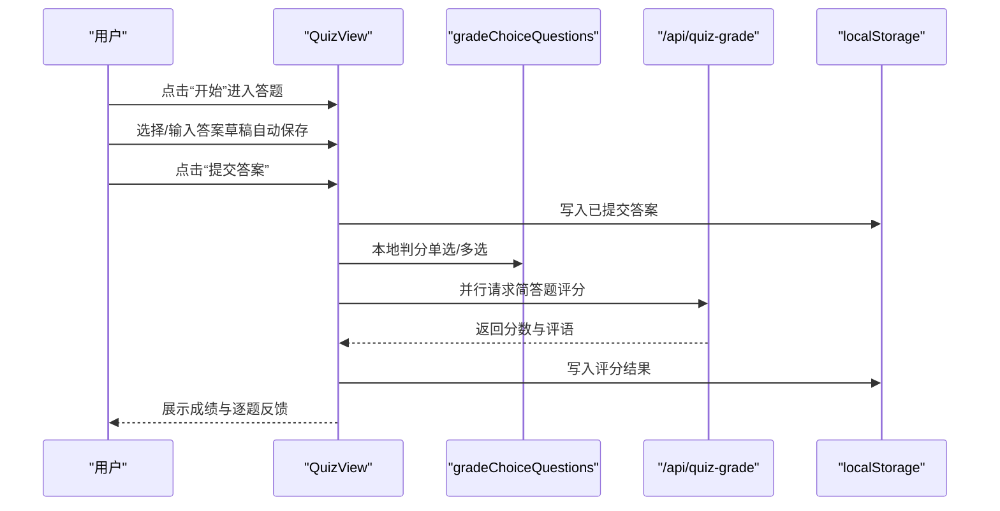
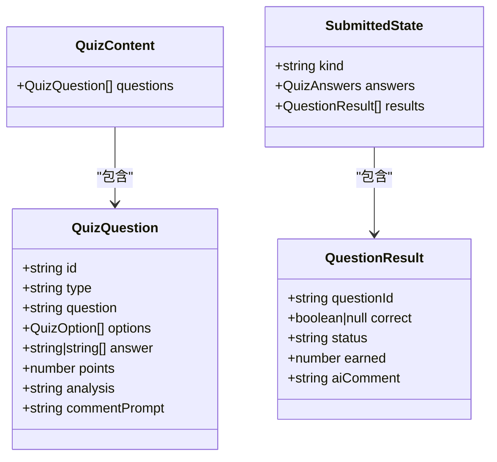

# 测验渲染器

<cite>
**本文引用的文件**   
- [components/scene-renderers/quiz-renderer.tsx](file://components/scene-renderers/quiz-renderer.tsx)
- [components/scene-renderers/quiz-view.tsx](file://components/scene-renderers/quiz-view.tsx)
- [lib/quiz/grading.ts](file://lib/quiz/grading.ts)
- [lib/quiz/math-text.ts](file://lib/quiz/math-text.ts)
- [lib/quiz/persistence.ts](file://lib/quiz/persistence.ts)
- [app/api/quiz-grade/route.ts](file://app/api/quiz-grade/route.ts)
- [lib/types/stage.ts](file://lib/types/stage.ts)
- [components/edit/surfaces/quiz/QuizSurface.tsx](file://components/edit/surfaces/quiz/QuizSurface.tsx)
</cite>

## 产品概述
本模块提供“测验渲染器”，用于在课堂回放与自主练习场景中展示并交互各类测验题目（单选、多选、简答），完成答题、即时反馈与评分，并提供数学公式渲染与持久化状态管理。其核心价值在于：
- 统一题型渲染与交互：单选、多选、简答三类题型的标准化呈现与操作。
- 智能评分与反馈：选择题本地判定，简答题调用服务端 LLM 进行评分与评语生成。
- 状态持久化与回退：草稿缓存、提交答案与结果持久化，支持重试与进度恢复。
- 数学公式渲染：基于 KaTeX 的 LaTeX 解析与内联/块级显示。
- 无障碍与国际化：组件遵循可访问性最佳实践，并通过 i18n 提供多语言文案。

适用场景：课堂互动测验、课后练习、AI 辅助批改与学习分析。

## 核心业务流程
- 封面页：展示题目数量与总分，引导开始答题。
- 答题阶段：按题型渲染选项或输入框，实时保存草稿；全部作答后允许提交。
- 评分阶段：选择题立即本地判分；简答题并行调用 /api/quiz-grade 获取分数与评语。
- 回顾阶段：汇总得分、正确率与每题解析/评语，支持重试。

**图表来源** 
- [components/scene-renderers/quiz-view.tsx](file://components/scene-renderers/quiz-view.tsx)
- [lib/quiz/grading.ts](file://lib/quiz/grading.ts)
- [app/api/quiz-grade/route.ts](file://app/api/quiz-grade/route.ts)
- [lib/quiz/persistence.ts](file://lib/quiz/persistence.ts)

**章节来源**
- [components/scene-renderers/quiz-view.tsx](file://components/scene-renderers/quiz-view.tsx)
- [lib/quiz/grading.ts](file://lib/quiz/grading.ts)
- [app/api/quiz-grade/route.ts](file://app/api/quiz-grade/route.ts)
- [lib/quiz/persistence.ts](file://lib/quiz/persistence.ts)

## 功能模块清单
- 基础渲染器（轻量版）
  - 职责：以最小 UI 展示题目与单选/简答输入，适用于简单集成或调试。
  - 验收要点：能渲染 QuizContent.questions，单选使用 radio，简答使用 textarea，模式为 autonomous 时显示提交按钮。
  - 参考路径：[components/scene-renderers/quiz-renderer.tsx](file://components/scene-renderers/quiz-renderer.tsx)

- 完整交互视图（QuizView）
  - 职责：封面页、答题、评分、回顾四阶段流程；支持单选/多选/简答；草稿缓存与提交持久化；数学公式渲染；语音输入辅助；i18n。
  - 验收要点：
    - 封面显示题目数与总分，点击开始进入答题。
    - 答题阶段：所有题目必须作答才能提交；提交后进入评分阶段。
    - 评分阶段：选择题即时判分，简答题并发调用服务端接口；完成后进入回顾。
    - 回顾阶段：总分、正确/错误统计、逐题反馈与解析；支持重试。
  - 参考路径：[components/scene-renderers/quiz-view.tsx](file://components/scene-renderers/quiz-view.tsx)

- 评分算法（本地）
  - 职责：对非简答题进行精确匹配判分，支持单/多选；输出 QuestionResult。
  - 验收要点：数组比较忽略顺序；未作答视为错误；分值按题目 points 计算。
  - 参考路径：[lib/quiz/grading.ts](file://lib/quiz/grading.ts)

- 简答题评分（服务端）
  - 职责：接收题目、学生答案、满分与提示语，调用 LLM 返回 JSON 分数与评语；失败降级给基础分。
  - 验收要点：参数校验；模型头透传；JSON 解析容错；返回分数范围限制。
  - 参考路径：[app/api/quiz-grade/route.ts](file://app/api/quiz-grade/route.ts)

- 数学公式渲染
  - 职责：识别显式分隔符与嵌入式公式，使用 KaTeX 渲染为 HTML；支持内联与块级。
  - 验收要点：支持 $...$、\(...\)、$$...$$、\[...\]；非法内容回退文本；合并相邻文本段。
  - 参考路径：[lib/quiz/math-text.ts](file://lib/quiz/math-text.ts)

- 状态持久化
  - 职责：按 sceneId 维护三套 key：草稿、已提交答案、评分结果；提供读取/写入/清理方法。
  - 验收要点：readSubmittedState 区分 answering/reviewing；readAnswersForSummary 优先提交答案，否则回退草稿；clearSubmitted/clearAllForScene 清理策略明确。
  - 参考路径：[lib/quiz/persistence.ts](file://lib/quiz/persistence.ts)

- 编辑器表面（编辑侧）
  - 职责：注册 quiz 场景编辑器表面，提供表单式编辑能力（非画布）。
  - 验收要点：通过 sceneEditorRegistry.register 暴露 quizSurface；EditShell 根据 scene.type 解析并渲染。
  - 参考路径：[components/edit/surfaces/quiz/QuizSurface.tsx](file://components/edit/surfaces/quiz/QuizSurface.tsx)

**章节来源**
- [components/scene-renderers/quiz-renderer.tsx](file://components/scene-renderers/quiz-renderer.tsx)
- [components/scene-renderers/quiz-view.tsx](file://components/scene-renderers/quiz-view.tsx)
- [lib/quiz/grading.ts](file://lib/quiz/grading.ts)
- [app/api/quiz-grade/route.ts](file://app/api/quiz-grade/route.ts)
- [lib/quiz/math-text.ts](file://lib/quiz/math-text.ts)
- [lib/quiz/persistence.ts](file://lib/quiz/persistence.ts)
- [components/edit/surfaces/quiz/QuizSurface.tsx](file://components/edit/surfaces/quiz/QuizSurface.tsx)

## 数据与状态
- 核心数据模型
  - QuizQuestion：包含 id、type（single/multiple/short_answer）、question、options、answer、points、analysis、commentPrompt 等字段。
  - QuizContent：questions 数组。
  - QuestionResult：questionId、correct（布尔或 null）、status（correct/incorrect）、earned、aiComment。
  - SubmittedState：{ kind: 'answering'|'reviewing', answers, results? }。
  - 类型定义由 DSL 导出并在 app 层重导出，确保类型一致性。

- 关键状态流转
  - Phase：not_started → answering → grading → reviewing。
  - 草稿缓存：useDraftCache 按 draftKey(sceneId) 存储，提交时清空。
  - 持久化键：
    - quizDraft:<sceneId>：进行中答案（防抖缓存）
    - quizAnswers:<sceneId>：提交的答案（重试时清除）
    - quizResults:<sceneId>：评分结果（重试时清除）

- 数据所有权边界
  - 前端负责：UI 状态、草稿缓存、本地判分、结果聚合。
  - 服务端负责：简答题评分与评语生成。
  - 持久化：localStorage 作为单一事实源，供 QuizView 与课堂完成页共同读取。

**图表来源** 
- [lib/types/stage.ts](file://lib/types/stage.ts)
- [lib/quiz/grading.ts](file://lib/quiz/grading.ts)
- [lib/quiz/persistence.ts](file://lib/quiz/persistence.ts)

**章节来源**
- [lib/types/stage.ts](file://lib/types/stage.ts)
- [lib/quiz/grading.ts](file://lib/quiz/grading.ts)
- [lib/quiz/persistence.ts](file://lib/quiz/persistence.ts)

## 关键约束与边界
- 题型与评分规则
  - 仅支持 single/multiple/short_answer 三种题型。
  - 选择题采用精确匹配判分，忽略顺序；未作答视为错误。
  - 简答题评分依赖 LLM，失败时降级为基础分（通常为满分的一半），并给出通用评语。
  - 每道题分值由 points 决定，总分由各题 points 求和。

- 交互约束
  - 答题阶段需全部作答方可提交。
  - 提交后进入评分阶段，完成后进入回顾；支持重试，重试会清除已提交答案与结果，保留草稿生命周期。

- 性能与可用性
  - 大量题目渲染：使用 memo 包裹数学文本渲染与子组件，减少重复计算与重绘。
  - 并发评分：简答题评分并行发起，缩短等待时间。
  - 草稿防抖：通过 useDraftCache 避免频繁写 localStorage。
  - 公式渲染：KaTeX 严格模式关闭但异常捕获，失败回退文本，避免阻塞渲染。

- 依赖与集成边界
  - 外部依赖：Next.js API Route、LLM 调用封装、KaTeX、motion 动画、lucide 图标、i18n。
  - 模型配置：通过请求头传递 x-model/x-api-key/x-base-url/x-provider-type，服务端动态解析模型。

- 无障碍与国际化
  - 组件使用语义化标签与键盘可达性；颜色对比度满足可读性要求。
  - 文案通过 i18n 钩子注入，支持中英文切换。

**章节来源**
- [components/scene-renderers/quiz-view.tsx](file://components/scene-renderers/quiz-view.tsx)
- [lib/quiz/grading.ts](file://lib/quiz/grading.ts)
- [lib/quiz/math-text.ts](file://lib/quiz/math-text.ts)
- [app/api/quiz-grade/route.ts](file://app/api/quiz-grade/route.ts)
- [lib/quiz/persistence.ts](file://lib/quiz/persistence.ts)