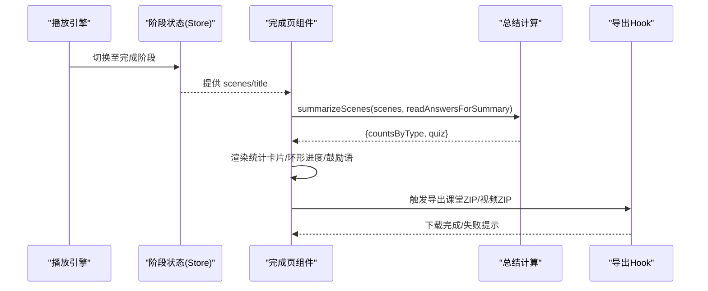

# 课堂完成页面

<cite>
**本文引用的文件**   
- [classroom-complete.tsx](file://components/scene-renderers/classroom-complete.tsx)
- [complete-summary.ts](file://lib/classroom/complete-summary.ts)
- [next-lesson.tsx](file://components/scene-renderers/next-lesson.tsx)
- [use-export-classroom.ts](file://lib/export/use-export-classroom.ts)
- [build-export-zip.ts](file://lib/video-export-app/build-export-zip.ts)
- [persistence.test.ts](file://tests/quiz/persistence.test.ts)
- [action-navigation.test.ts](file://tests/playback/action-navigation.test.ts)
- [drain.test.ts](file://tests/pbl/v2/drain.test.ts)
- [completion.test.ts](file://tests/pbl/v2/completion.test.ts)
- [feature-flags.ts](file://lib/config/feature-flags.ts)
- [globals.css](file://app/globals.css)
</cite>

## 产品概述
课堂完成页面（ClassroomComplete）在课堂结束时展示学习总结与成果，帮助用户快速回顾参与度、正确率与时间线索，并通过可视化图表呈现知识点掌握情况。该页面同时集成导出能力（课件下载与分享链接），并与播放引擎状态保持同步，确保数据一致性。此外，页面支持个性化学习建议的生成逻辑入口、主题定制与样式覆盖，以及移动端适配与响应式设计。

## 核心业务流程
- 进入完成页：从播放引擎或阶段状态切换到完成视图，读取当前章节标题与场景列表。
- 统计汇总：基于场景类型计数与测验答题结果计算正确率，渲染环形进度图与鼓励文案。
- 连续学习导航：根据连续学习上下文显示“下一节”横幅，支持自动倒计时跳转或手动进入。
- 导出与分享：通过导出 Hook 打包课堂 ZIP（含媒体与清单），并支持交互式 HTML 资源内联；视频导出路径可生成可离线播放的压缩包。
- 状态同步：完成页仅做一次性汇总计算，避免重复评分；与播放引擎的状态变更解耦，保证数据一致性与性能。



**图示来源** 
- [classroom-complete.tsx:309-506](file://components/scene-renderers/classroom-complete.tsx#L309-L506)
- [complete-summary.ts:11-33](file://lib/classroom/complete-summary.ts#L11-L33)
- [use-export-classroom.ts:48-241](file://lib/export/use-export-classroom.ts#L48-L241)

**章节来源**
- [classroom-complete.tsx:309-506](file://components/scene-renderers/classroom-complete.tsx#L309-L506)
- [complete-summary.ts:11-33](file://lib/classroom/complete-summary.ts#L11-L33)
- [use-export-classroom.ts:48-241](file://lib/export/use-export-classroom.ts#L48-L241)

## 功能模块清单
- 完成页主视图（ClassroomCompletePage）
  - 职责：聚合场景统计、测验正确率、日期与标题、鼓励文案、动画与无障碍提示。
  - 验收要点：按场景类型计数；测验环形进度与百分比；减少动效模式兼容；屏幕阅读器单条播报。
- 总结计算（summarizeScenes）
  - 职责：遍历场景统计类型数量；对 quiz 场景进行答案评分并计算正确率。
  - 验收要点：无 quiz 时 quiz 字段为 null；正确率四舍五入到整数百分比。
- 连续学习横幅（NextLessonBanner）
  - 职责：判断是否有章节序列；展示下一节信息；支持开启连续学习与倒计时自动跳转。
  - 验收要点：无序列不渲染；最后一节显示课程全部完成；倒计时可取消。
- 导出与分享（useExportClassroom / build-export-zip）
  - 职责：收集音频/媒体/Agent/场景内容，内联交互资源，生成 manifest.json 并打包 ZIP；视频导出构建 Hyperframes 项目文本与资产包。
  - 验收要点：manifest 包含 stage/agents/scenes/mediaIndex；部分资源无法内联时给出警告；ZIP 文件名安全化。
- 数据持久化与一致性（readAnswersForSummary）
  - 职责：优先使用已提交答案，回退到草稿；容错损坏 JSON。
  - 验收要点：提交优先于草稿；空数据返回空对象；损坏草稿不抛错。

**章节来源**
- [classroom-complete.tsx:309-506](file://components/scene-renderers/classroom-complete.tsx#L309-L506)
- [complete-summary.ts:11-33](file://lib/classroom/complete-summary.ts#L11-L33)
- [next-lesson.tsx:19-131](file://components/scene-renderers/next-lesson.tsx#L19-L131)
- [use-export-classroom.ts:48-241](file://lib/export/use-export-classroom.ts#L48-L241)
- [build-export-zip.ts:1-34](file://lib/video-export-app/build-export-zip.ts#L1-L34)
- [persistence.test.ts:105-124](file://tests/quiz/persistence.test.ts#L105-L124)

## 数据与状态
- 核心数据模型
  - CompleteSummary：包含 countsByType（各场景类型计数）与 quiz（correct/total/pct）。
  - ClassroomManifest：包含 formatVersion、exportedAt、appVersion、stage、agents、scenes、mediaIndex。
  - ManifestScene：type/title/order/content/actions/whiteboards/multiAgent。
  - MediaIndexEntry：audio/generated/missing 等元数据。
- 关键状态流转
  - 完成页挂载后一次性计算 summary，避免重复评分。
  - 连续学习横幅依赖 useContinuousLearning 提供的 hasSequence/hasNext/isLast/continuous 等状态。
  - 导出流程读取最新 stage 名称、Agent 记录、音频与媒体文件，生成 manifest 并打包 ZIP。
- 数据所有权边界
  - 答案数据来自 localStorage（提交优先于草稿），完成页只读。
  - 媒体与音频由 IndexedDB/内存 blob 提供，导出时统一收集并写入 ZIP。
  - 视频导出路径复用 build-export-zip 的前置编译与资产收集逻辑，保证两条路径一致。

```mermaid
classDiagram
class CompleteSummary {
+countsByType : Partial~Record~SceneType, number~~
+quiz : {correct : number; total : number; pct : number} | null
}
class ClassroomManifest {
+formatVersion : string
+exportedAt : string
+appVersion : string
+stage : ManifestStage
+agents : ManifestAgent[]
+scenes : ManifestScene[]
+mediaIndex : Record<string, MediaIndexEntry>
}
class ManifestScene {
+type : SceneType
+title : string
+order : number
+content : SceneContent
+actions : any[]?
+whiteboards : any[]?
+multiAgent? : any
}
class MediaIndexEntry {
+type : "audio"|"generated"|"missing"
+format? : string
+duration? : number
+voice? : string
+mimeType? : string
+size? : number
+prompt? : string
}
CompleteSummary <.. ClassroomManifest : "用于统计展示"
ClassroomManifest --> ManifestScene : "包含"
ClassroomManifest --> MediaIndexEntry : "索引"
```

**图示来源** 
- [complete-summary.ts:4-7](file://lib/classroom/complete-summary.ts#L4-L7)
- [use-export-classroom.ts:10-28](file://lib/export/use-export-classroom.ts#L10-L28)

**章节来源**
- [complete-summary.ts:4-7](file://lib/classroom/complete-summary.ts#L4-L7)
- [use-export-classroom.ts:10-28](file://lib/export/use-export-classroom.ts#L10-L28)

## 关键约束与边界
- 非功能性需求
  - 性能：完成页统计计算一次，避免重渲染开销；动画遵循用户减少动效偏好。
  - 可用性：无障碍单条播报；暗色模式与主题切换；国际化多语言。
  - 稳定性：localStorage 草稿损坏容错；导出部分资源内联失败时给出警告。
- 依赖与集成边界
  - 播放引擎：完成页仅消费 stage/scenes，不参与播放控制；动作导航与回放恢复由测试用例保障。
  - PBL v2：运行时事件排水与水位线隔离不同学习者，保证并发与幂等。
  - 导出：课堂 ZIP 与视频 ZIP 分别处理，前者侧重完整课堂结构，后者侧重 Hyperframes 项目与资产。
- 业务约束
  - 只有存在 quiz 场景才计算正确率；无 quiz 时 quiz 字段为 null。
  - 连续学习仅在具备章节序列时生效；最后一节显示完成提示。
  - 导出文件名需安全化处理，避免非法字符。

**章节来源**
- [action-navigation.test.ts:221-577](file://tests/playback/action-navigation.test.ts#L221-L577)
- [drain.test.ts:552-909](file://tests/pbl/v2/drain.test.ts#L552-L909)
- [completion.test.ts:73-91](file://tests/pbl/v2/completion.test.ts#L73-L91)
- [feature-flags.ts:41-76](file://lib/config/feature-flags.ts#L41-L76)
- [globals.css:129-160](file://app/globals.css#L129-L160)