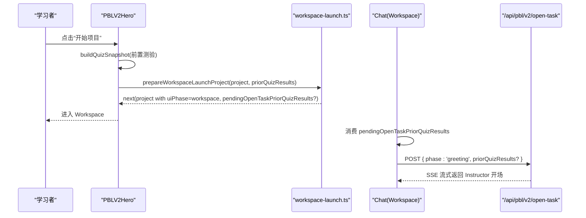
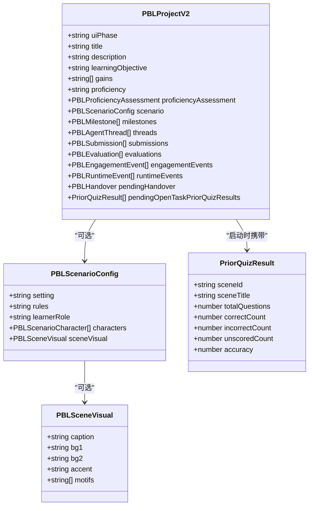
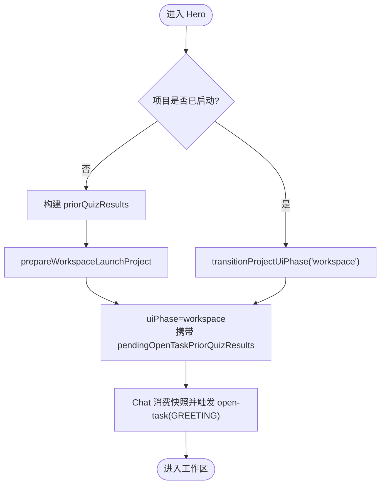

# Hero 组件实现

<cite>
**本文引用的文件**   
- [hero.tsx](file://components/scene-renderers/pbl/v2/hero.tsx)
- [types.ts](file://lib/pbl/v2/types.ts)
- [quiz-snapshot.ts](file://lib/pbl/v2/operations/quiz-snapshot.ts)
- [workspace-launch.ts](file://lib/pbl/v2/operations/workspace-launch.ts)
- [progress.ts](file://lib/pbl/v2/operations/progress.ts)
- [runtime-events.ts](file://lib/pbl/v2/operations/runtime-events.ts)
- [chat.tsx](file://components/scene-renderers/pbl/v2/chat.tsx)
- [scenario-briefing-gate.ts](file://components/scene-renderers/pbl/v2/scenario-briefing-gate.ts)
- [scene-types.ts](file://components/scene-renderers/pbl/v2/scene-stage/scene-types.ts)
</cite>

## 产品概述
Hero 是 PBL v2 学习场景的“首屏”入口，用于以极简信息引导学习者进入项目。它展示项目标题、描述、学习目标与能力增益（gains），并给出“开始项目/继续项目”的主要行动按钮。对于角色扮演类场景，还会呈现场景简报（背景、规则、角色）与视觉元素（背景渐变、强调色、主题符号）。在启动时，Hero 会基于历史测验结果进行自适应能力评估的预播放计算，确保后续 Instructor 的引导更贴合学习者水平。

## 核心业务流程
- 首屏渲染：读取 project.title、project.description、project.learningObjective 与 project.gains，按优先级渲染“你将学到什么”。
- 启动流程：点击“开始项目”后，构建 priorQuizResults 快照，调用 prepareWorkspaceLaunchProject 将 uiPhase 切换为 workspace，并将快照暂存于 pendingOpenTaskPriorQuizResults；随后 Workspace Chat 消费该字段触发 /api/pbl/v2/open-task 的 GREETING 流式对话。
- 继续流程：若项目已启动过，显示“继续项目”，直接通过 transitionProjectUiPhase 切换到 workspace，不重复发送 GREETING。
- 重置流程：确认后将进度回滚到全新状态，uiPhase 回到 hero，按钮恢复为“开始项目”。
- 场景简报可见性：仅在角色扮演场景且 prep 阶段完成后，右侧面板才显示场景简报标签页。

**图表来源** 
- [hero.tsx:102-139](file://components/scene-renderers/pbl/v2/hero.tsx#L102-L139)
- [workspace-launch.ts:10-21](file://lib/pbl/v2/operations/workspace-launch.ts#L10-L21)
- [chat.tsx:380-411](file://components/scene-renderers/pbl/v2/chat.tsx#L380-L411)

**章节来源**
- [hero.tsx:102-139](file://components/scene-renderers/pbl/v2/hero.tsx#L102-L139)
- [workspace-launch.ts:10-21](file://lib/pbl/v2/operations/workspace-launch.ts#L10-L21)
- [chat.tsx:380-411](file://components/scene-renderers/pbl/v2/chat.tsx#L380-L411)

## 功能模块清单
- 项目标题与描述渲染
  - 使用 project.title 与 project.description 作为主标题与简介。
- 学习目标与能力增益
  - 优先使用 project.gains（3-5条可读的能力陈述）；若无则回退至 project.learningObjective；两者均无则隐藏该区块。
- 统计与人物卡片
  - 常规项目：显示里程碑数与微任务数；显示导师（Instructor）角色卡。
  - 角色扮演项目：用“准备→模拟×N→收尾”的流程卡替代机械计数，并额外展示角色卡。
- 启动/继续/重置交互
  - 首次进入：显示“开始项目”，点击后进入工作区并触发 Instructor 开场。
  - 已启动：显示“继续项目”，直接进入工作区，不重复开场。
  - 重置：二次确认后清空学习进度，回到 Hero 初始态。
- 自适应能力评估预播放计算
  - 基于前置测验结果构建 PriorQuizResult[]，随 open-task 请求一并提交，服务端据此更新 proficiencyAssessment（source='pre-play'）。
- 场景简报与视觉元素
  - 场景简报：当 scenario.rules 存在时，Instructor 会在 prep 阶段明确讲解规则；场景视觉（背景渐变、强调色、主题符号）由 PBLSceneVisual 驱动并在渲染层做安全降级。
- 适配与布局
  - 使用 computeFitScale 对 Hero 卡片进行等比缩放，避免在高缩放比例下底部按钮被裁剪。

**章节来源**
- [hero.tsx:148-160](file://components/scene-renderers/pbl/v2/hero.tsx#L148-L160)
- [hero.tsx:233-311](file://components/scene-renderers/pbl/v2/hero.tsx#L233-L311)
- [hero.tsx:174-192](file://components/scene-renderers/pbl/v2/hero.tsx#L174-L192)
- [types.ts:273-317](file://lib/pbl/v2/types.ts#L273-L317)
- [scene-types.ts:1-35](file://components/scene-renderers/pbl/v2/scene-stage/scene-types.ts#L1-L35)

## 数据与状态
- 关键数据模型
  - PBLProjectV2：包含 title、description、learningObjective、gains、proficiency、proficiencyAssessment、scenario、milestones、threads、submissions、evaluations、engagementEvents、runtimeEvents、pendingHandover、pendingTaskCompletion、pendingOpenTaskPriorQuizResults 等。
  - PBLScenarioConfig：setting、rules、learnerRole、characters、sceneVisual。
  - PBLSceneVisual：caption、bg1、bg2、accent、motifs（渲染层仅做安全校验与中性回退）。
  - PriorQuizResult：聚合前置测验的正确率信号，供 pre-play 校准。
- 关键状态流转
  - uiPhase：'hero' → 'workspace'（启动或继续）；reset 后回到 'hero'。
  - hasStartedProject：根据线程消息、提交、评估、参与事件、里程碑完成等判定是否已启动。
  - pendingOpenTaskPriorQuizResults：仅在首次启动时携带，进入 Workspace 后被消费并清除。
- 数据所有权边界
  - 进度与运行时事件由 operations/progress.ts 与 operations/runtime-events.ts 管理；能力评估由 operations/proficiency.ts 与 quiz-snapshot.ts 维护；UI 仅消费与触发变更。

**图表来源** 
- [types.ts:767-961](file://lib/pbl/v2/types.ts#L767-L961)
- [types.ts:273-317](file://lib/pbl/v2/types.ts#L273-L317)
- [types.ts:646-663](file://lib/pbl/v2/types.ts#L646-L663)

**章节来源**
- [types.ts:767-961](file://lib/pbl/v2/types.ts#L767-L961)
- [types.ts:273-317](file://lib/pbl/v2/types.ts#L273-L317)
- [types.ts:646-663](file://lib/pbl/v2/types.ts#L646-L663)

## 关键约束与边界
- 语言与本地化
  - project.language 同步 UI locale（BCP-47 回退），但内容语言以 languageDirective 为准，不被覆盖。
- 能力增益渲染约束
  - 仅使用 planner 生成的 gains 或 legacy 的 learningObjective；绝不从任务标题反推，避免不可读片段。
- 场景简报可见性
  - 仅当 project.scenario 存在且首个 prep 里程碑已完成时，右侧简报标签页才显示。
- 自适应评估预播放
  - 仅聚合当前 PBL 之前的测验结果；短答题未评分不计入分母；空快照不会触发更新。
- 启动与继续
  - 首次启动携带 priorQuizResults 到 open-task；继续路径不重复开场，保持进度一致。
- 重置行为
  - 重置仅清理学习进度与运行时状态，不触碰 proficiency 与 proficiencyAssessment，避免误降等级。
- 视觉与布局
  - 高缩放比例下通过 computeFitScale 等比缩放卡片，保证按钮与提示始终可见。
- 错误处理与健壮性
  - 场景视觉字段缺失或非法时，渲染层提供中性回退；Alert 对话框防止误操作重置；instructorStreaming 期间禁用重置以避免流写入覆盖。

**章节来源**
- [hero.tsx:74-85](file://components/scene-renderers/pbl/v2/hero.tsx#L74-L85)
- [hero.tsx:148-160](file://components/scene-renderers/pbl/v2/hero.tsx#L148-L160)
- [scenario-briefing-gate.ts:18-23](file://components/scene-renderers/pbl/v2/scenario-briefing-gate.ts#L18-L23)
- [quiz-snapshot.ts:43-82](file://lib/pbl/v2/operations/quiz-snapshot.ts#L43-L82)
- [progress.ts:172-200](file://lib/pbl/v2/operations/progress.ts#L172-L200)
- [progress.ts:203-218](file://lib/pbl/v2/operations/progress.ts#L203-L218)
- [scene-types.ts:1-35](file://components/scene-renderers/pbl/v2/scene-stage/scene-types.ts#L1-L35)

## 详细实现要点（代码级说明）
- 启动流程函数
  - handleStart：构建 priorQuizResults → prepareWorkspaceLaunchProject → onLaunchReady/onProjectChange。
  - handleContinue：transitionProjectUiPhase('workspace') → onLaunchReady/onProjectChange。
  - handleReset：resetProjectProgress → onProjectChange。
- 自适应能力评估
  - buildQuizSnapshot：遍历前置 quiz 场景，聚合正确/错误/未评分数量，计算准确率。
  - applyQuizSignalsToProject：服务端将快照应用到 proficiencyAssessment（source='pre-play'），必要时更新 tier 与 runtime 事件。
- 场景简报与视觉
  - shouldShowScenarioBriefing：prep 完成即显示简报。
  - PBLSceneVisual：bg1/bg2/accent/motifs/caption，渲染层做 HEX 校验与中性回退。
- 运行时事件与状态转换
  - transitionProjectUiPhase：记录 ui_phase 状态变更事件。
  - hasStartedProject：综合线程、提交、评估、参与事件、里程碑完成等判断是否已启动。

**图表来源** 
- [hero.tsx:102-139](file://components/scene-renderers/pbl/v2/hero.tsx#L102-L139)
- [workspace-launch.ts:10-21](file://lib/pbl/v2/operations/workspace-launch.ts#L10-L21)
- [chat.tsx:380-411](file://components/scene-renderers/pbl/v2/chat.tsx#L380-L411)

**章节来源**
- [hero.tsx:102-139](file://components/scene-renderers/pbl/v2/hero.tsx#L102-L139)
- [workspace-launch.ts:10-21](file://lib/pbl/v2/operations/workspace-launch.ts#L10-L21)
- [chat.tsx:380-411](file://components/scene-renderers/pbl/v2/chat.tsx#L380-L411)
- [quiz-snapshot.ts:43-82](file://lib/pbl/v2/operations/quiz-snapshot.ts#L43-L82)
- [progress.ts:172-200](file://lib/pbl/v2/operations/progress.ts#L172-L200)
- [runtime-events.ts:111-125](file://lib/pbl/v2/operations/runtime-events.ts#L111-L125)
- [scenario-briefing-gate.ts:18-23](file://components/scene-renderers/pbl/v2/scenario-briefing-gate.ts#L18-L23)
- [scene-types.ts:1-35](file://components/scene-renderers/pbl/v2/scene-stage/scene-types.ts#L1-L35)