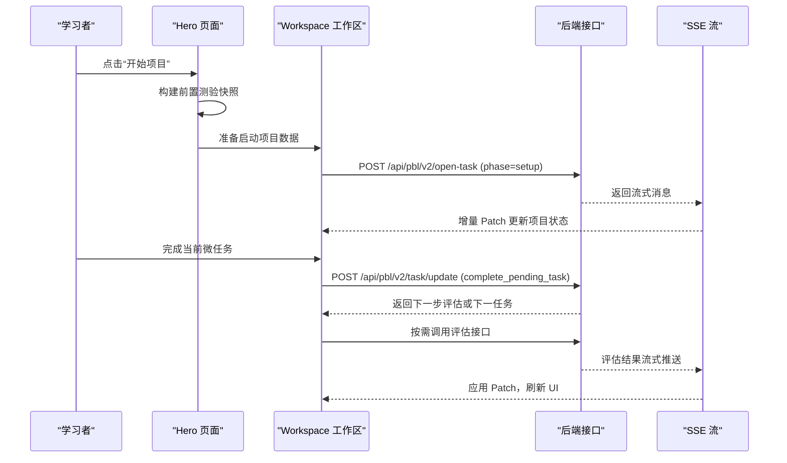
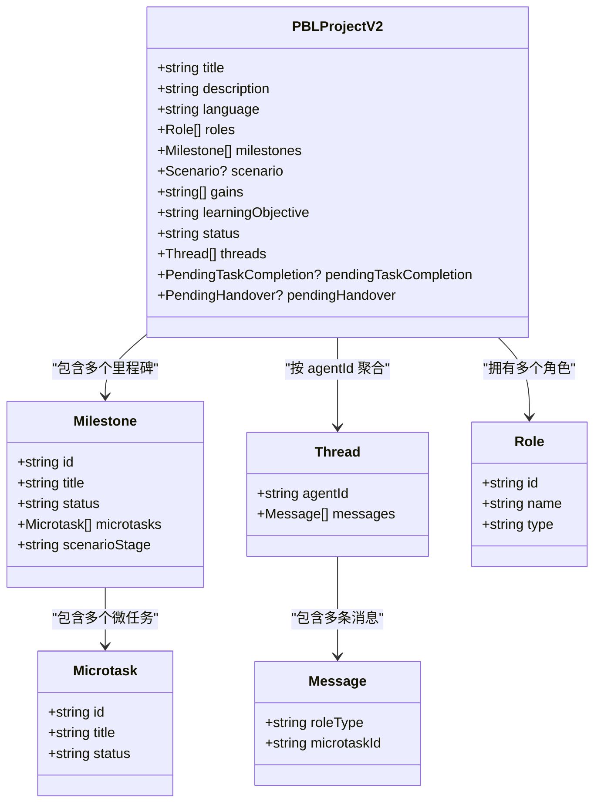

# PBL v2 架构设计

<cite>
**本文引用的文件**   
- [hero.tsx](file://components/scene-renderers/pbl/v2/hero.tsx)
- [workspace.tsx](file://components/scene-renderers/pbl/v2/workspace.tsx)
- [sidebar.tsx](file://components/scene-renderers/pbl/v2/sidebar.tsx)
- [agent-tabs.tsx](file://components/scene-renderers/pbl/v2/agent-tabs.tsx)
- [use-instructor-stream.ts](file://components/scene-renderers/pbl/v2/use-instructor-stream.ts)
- [operations/progress.ts](file://lib/pbl/v2/operations/progress.ts)
- [operations/runtime-events.ts](file://lib/pbl/v2/operations/runtime-events.ts)
- [operations/workspace-launch.ts](file://lib/pbl/v2/operations/workspace-launch.ts)
- [operations/quiz-snapshot.ts](file://lib/pbl/v2/operations/quiz-snapshot.ts)
- [api/sse.ts](file://lib/pbl/v2/api/sse.ts)
- [types.ts](file://lib/pbl/v2/types.ts)
</cite>

## 产品概述
PBL v2 是 OpenMAIC 的项目式学习（PBL）渲染与交互引擎的第二代。它在前端采用 Next.js + React 19 + Zustand，结合 AI 编排层（LangGraph + Vercel AI SDK），以自定义 DSL 驱动课件生成与课堂回放。v2 的核心目标是：
- 提供更清晰的“项目入口—工作空间”双阶段体验，降低认知负荷并提升启动效率
- 引入 uiPhase 状态机与运行时数据模型，统一 Hero、Workspace、Completion 等阶段的切换
- 通过 SSE 流式更新与增量 Patch，优化长时任务（教师引导、评估）的响应与一致性
- 支持场景化角色扮演（prep → roleplay → wrapup）与多角色协作（Instructor/Evaluator/Mentor/Collaborator）
- 提供可伸缩的三栏工作区布局与实时协作能力，兼顾教学与评测流程

## 核心业务流程
- 项目启动（Hero）
  - 展示项目标题、描述、学习目标/能力增益、阶段与任务概览
  - 首次点击“开始项目”会构建前置测验快照，准备 Workspace 启动数据，并触发 Instructor 的 GREETING 开场流
  - 若已有进度，则直接进入 Workspace 并保留全部进度
- 工作区（Workspace）
  - 左侧为里程碑树（含场景三段式标签与操作按钮），中间为 Agent 聊天（支持多角色 Tab），右侧为提交/评估面板或场景简报
  - 完成当前微任务后，自动进入评估（任务/里程碑/最终）或开启下一个任务的引导流
  - 支持拖拽调整三栏宽度，顶部显示当前里程碑进度条
- 场景化角色扮演（Scenario）
  - 仅当 project.scenario 存在时启用；侧边栏显示“进入场景/继续交接/结束本轮”等操作
  - 场景内节拍推进由引擎判定，用户不可手动跳过

**章节来源**
- [hero.tsx:102-137](file://components/scene-renderers/pbl/v2/hero.tsx#L102-L137)
- [workspace.tsx:229-278](file://components/scene-renderers/pbl/v2/workspace.tsx#L229-L278)
- [use-instructor-stream.ts](file://components/scene-renderers/pbl/v2/use-instructor-stream.ts)

## 功能模块清单
- Hero 页面
  - 职责：项目概览、语言回退设置、启动/继续/重置入口、适配缩放
  - 验收要点：首次启动触发 Instructor 开场流；已存在进度可直接继续；重置后回到初始状态
- Workspace 工作区
  - 职责：三栏布局、里程碑导航、Agent 聊天、提交/评估面板、场景简报（可选）、流式处理
  - 验收要点：支持拖拽调整列宽；顶部里程碑进度条正确；流式消息实时更新项目状态
- Sidebar 侧边栏
  - 职责：里程碑树展开/折叠、普通项目任务列表、场景三段式标签与操作按钮
  - 验收要点：场景模式下隐藏内部节拍，仅显示 Act 行；非场景模式保持传统任务树
- Agent Tabs 聊天
  - 职责：多角色 Tab（Instructor/Evaluator/Mentor/Collaborator），默认单角色不显示 Tab 栏
  - 验收要点：切换 Agent 时路由到对应线程；外部流状态可注入
- 流式处理（SSE）
  - 职责：统一封装 open-task/evaluate 接口，维护草稿输出与提交态，增量 Patch 合并
  - 验收要点：流中断不影响重试；Patch 类型安全；UI 与项目状态一致

**章节来源**
- [workspace.tsx:107-418](file://components/scene-renderers/pbl/v2/workspace.tsx#L107-L418)
- [sidebar.tsx:66-230](file://components/scene-renderers/pbl/v2/sidebar.tsx#L66-L230)
- [agent-tabs.tsx:35-97](file://components/scene-renderers/pbl/v2/agent-tabs.tsx#L35-L97)
- [use-instructor-stream.ts](file://components/scene-renderers/pbl/v2/use-instructor-stream.ts)

## 数据与状态
- PBLProjectV2 类型与数据结构
  - 顶层字段：title、description、language（BCP-47 回退）、roles（含 instructor/evaluator/mentor/collaborator）、milestones（里程碑数组）、scenario（可选，场景配置）、gains（能力增益）、learningObjective（兼容旧版）
  - 里程碑：id、title、status（locked/active/completed）、microtasks（微任务数组）、scenarioStage（prep/roleplay/wrapup，场景专用）
  - 线程与消息：threads（按 agentId 聚合），消息包含 roleType、microtaskId（用于节拍判定）
  - 其他：pendingTaskCompletion、pendingHandover、status（项目级状态）
- uiPhase 状态机
  - 状态：hero | workspace | completion（由父渲染器路由）
  - 转换：transitionProjectUiPhase 负责在 Hero ↔ Workspace 之间切换，避免重复开场流
- 运行时数据与兼容性
  - language 与 languageDirective：前者为 UI 回退，后者为权威内容语言策略（来自 Planner）
  - gains vs learningObjective：优先使用 gains，否则回退至 learningObjective，避免从任务标题拼凑
- 关键状态流转
  - 项目启动：prepareWorkspaceLaunchProject 整合前置测验快照，返回 ready 项目
  - 任务完成：complete_pending_task 可能触发里程碑评估或最终评估，或开启下一任务 setup
  - 场景推进：enter_scenario/continue_handover/complete_act 通过 /api/pbl/v2/task/update 无 LLM 直接替换服务端状态

**图表来源**
- [types.ts](file://lib/pbl/v2/types.ts)

**章节来源**
- [types.ts](file://lib/pbl/v2/types.ts)
- [operations/runtime-events.ts](file://lib/pbl/v2/operations/runtime-events.ts)
- [operations/workspace-launch.ts](file://lib/pbl/v2/operations/workspace-launch.ts)
- [operations/progress.ts](file://lib/pbl/v2/operations/progress.ts)
- [operations/quiz-snapshot.ts](file://lib/pbl/v2/operations/quiz-snapshot.ts)
- [api/sse.ts](file://lib/pbl/v2/api/sse.ts)

## 关键约束与边界
- 非功能性需求
  - 流式更新需保证幂等与容错：SSE 断线后可重试，Patch 合并需去重
  - 界面性能：Hero 自适应缩放避免溢出；Workspace 三栏拖拽限制最小/最大宽度
  - 国际化：language 仅作为 BCP-47 回退，不得覆盖 languageDirective
- 依赖与集成边界
  - 后端接口：/api/pbl/v2/open-task（开场/任务引导）、/api/pbl/v2/evaluate（评估）、/api/pbl/v2/task/update（场景动作与任务完成）
  - 前端状态：Zustand store（stage.scenes）用于读取历史场景与测验快照
- 业务约束
  - 场景模式下的节拍推进由引擎判定，用户不可手动跳过
  - 评估阶段区分 task/milestone/final，分别对应不同 SSE 状态与 UI 表现
  - 重置进度仅在 Hero 页生效，且需在 Instructor 流未进行时允许

**章节来源**
- [workspace.tsx:143-181](file://components/scene-renderers/pbl/v2/workspace.tsx#L143-L181)
- [workspace.tsx:229-278](file://components/scene-renderers/pbl/v2/workspace.tsx#L229-L278)
- [hero.tsx:74-85](file://components/scene-renderers/pbl/v2/hero.tsx#L74-L85)
- [use-instructor-stream.ts](file://components/scene-renderers/pbl/v2/use-instructor-stream.ts)