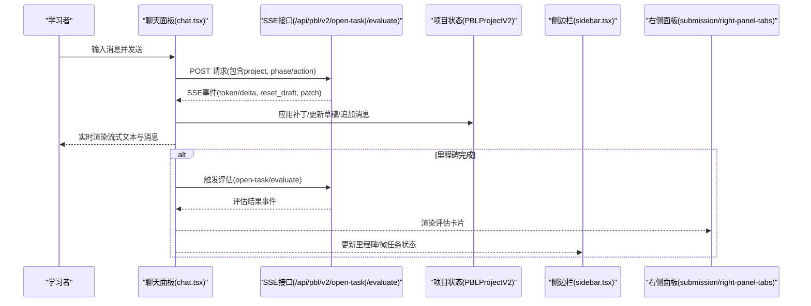
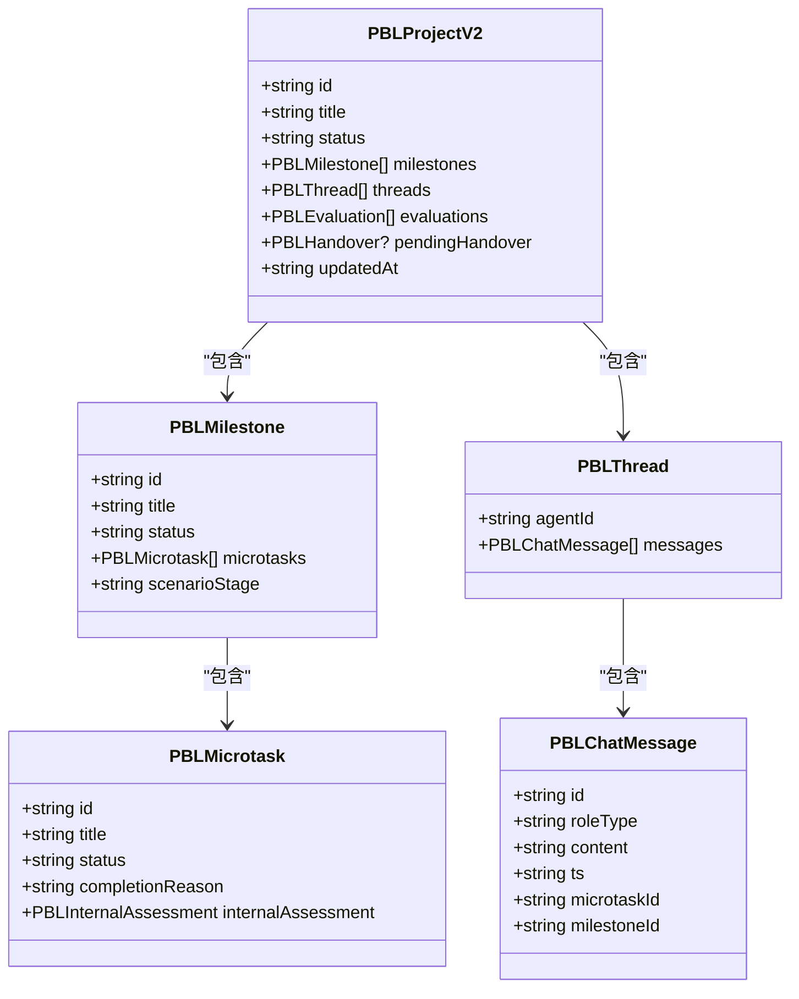

# Workspace 工作空间

<cite>
**本文引用的文件**   
- [workspace.tsx](file://components/scene-renderers/pbl/v2/workspace.tsx)
- [sidebar.tsx](file://components/scene-renderers/pbl/v2/sidebar.tsx)
- [chat.tsx](file://components/scene-renderers/pbl/v2/chat.tsx)
- [use-chat-sessions.ts](file://components/chat/use-chat-sessions.ts)
- [chat-area.tsx](file://components/chat/chat-area.tsx)
- [route.ts](file://app/api/chat/route.ts)
- [progress.ts](file://lib/pbl/v2/operations/progress.ts)
- [mime.ts](file://lib/document/mime.ts)
- [README.md](file://lib/pdf/README.md)
- [pbl-renderer.tsx](file://components/scene-renderers/pbl-renderer.tsx)
</cite>

## 产品概述
本工作空间为 OpenMAIC 的项目制学习（PBL v2）核心交互界面，采用三栏布局：左侧任务导航侧边栏、中间多标签聊天面板、右侧提交与评估面板。支持里程碑进度可视化、微任务列表与完成状态指示；聊天面板提供讲师/角色对话、流式消息渲染、工具调用透明展示与场景角色特殊处理；同时集成文件上传与预览（PDF、图片等），并通过虚拟滚动、消息折叠与内存管理策略保障性能。

## 核心业务流程
- 用户进入工作空间后，左侧侧边栏展示项目里程碑树与微任务清单，顶部进度条反映当前里程碑内任务推进情况。
- 中间聊天面板根据“普通项目”或“场景角色扮演”切换不同智能体线程（讲师或模拟器），支持多轮对话、流式输出与评估结果时间线合并。
- 右侧面板在场景模式下显示“场景简报”，否则显示提交与评估面板；当里程碑完成后出现“继续到下一阶段”的交接卡片。
- 用户在输入框发送消息后，前端通过 SSE 流式接收事件（token、重置草稿、项目补丁等），实时更新聊天与项目状态。
- 任务完成时触发评估流程（任务/里程碑/最终评估），评估结果以时间线形式插入聊天流中，保持视觉连贯性。

**图表来源** 
- [chat.tsx:125-300](file://components/scene-renderers/pbl/v2/chat.tsx#L125-L300)
- [progress.ts:460-611](file://lib/pbl/v2/operations/progress.ts#L460-L611)
- [workspace.tsx:182-218](file://components/scene-renderers/pbl/v2/workspace.tsx#L182-L218)

**章节来源**
- [workspace.tsx:107-218](file://components/scene-renderers/pbl/v2/workspace.tsx#L107-L218)
- [chat.tsx:125-300](file://components/scene-renderers/pbl/v2/chat.tsx#L125-L300)
- [progress.ts:460-611](file://lib/pbl/v2/operations/progress.ts#L460-L611)

## 功能模块清单
- 三栏布局与工作区外壳：定义默认宽度、可拖拽调整、主题变量与网格布局。
- 侧边栏任务导航：里程碑树、微任务列表、完成状态图标、场景阶段标记与操作按钮（进入场景/继续交接/完成行动）。
- 聊天面板：多标签（讲义/聊天）、会话管理、流式消息渲染、角色头像区分、工具调用透明展示、评估结果时间线合并。
- 右侧面板：提交与评估面板、场景简报（场景模式）、评估状态同步。
- 文件上传与预览：支持 PDF、图片等多种格式，解析文本与图像，生成内容映射。
- 性能优化：虚拟滚动、消息折叠、内存管理、流式缓冲与冲突顺序时钟。

**章节来源**
- [workspace.tsx:56-96](file://components/scene-renderers/pbl/v2/workspace.tsx#L56-L96)
- [sidebar.tsx:146-200](file://components/scene-renderers/pbl/v2/sidebar.tsx#L146-L200)
- [chat.tsx:515-1225](file://components/scene-renderers/pbl/v2/chat.tsx#L515-L1225)
- [mime.ts:57-105](file://lib/document/mime.ts#L57-L105)
- [README.md:76-120](file://lib/pdf/README.md#L76-L120)

## 数据与状态
- PBLProjectV2：包含里程碑数组、线程消息、评估记录、内部评估、交接信息等。
- 里程碑状态：locked/active/completed，微任务状态：todo/in_progress/completed/skipped。
- 聊天会话：使用 use-chat-sessions 管理多个会话，支持流式缓冲、软关闭、暂停/恢复。
- 冲突顺序时钟：nextChatUpdatedAt 确保本地与恢复数据的单调性。
- 流式状态：draftAssistant、streamCommittedOutput、instructorStreaming 计数控制忙碌状态。

**图表来源** 
- [progress.ts:1-611](file://lib/pbl/v2/operations/progress.ts#L1-L611)
- [chat.tsx:100-114](file://components/scene-renderers/pbl/v2/chat.tsx#L100-L114)

**章节来源**
- [progress.ts:1-611](file://lib/pbl/v2/operations/progress.ts#L1-L611)
- [chat.tsx:100-114](file://components/scene-renderers/pbl/v2/chat.tsx#L100-L114)
- [use-chat-sessions.ts:814-849](file://components/chat/use-chat-sessions.ts#L814-L849)

## 关键约束与边界
- 非功能性需求：SSE 流式响应最大时长 60 秒，客户端中断通过 abort fetch 实现。
- 依赖与集成边界：AI 编排层使用 LangGraph + Vercel AI SDK，课件 DSL 位于 packages/@openmaic/dsl。
- 业务约束：场景模式中，角色扮演阶段的节拍推进由引擎检测用户行为触发，不允许手动跳过；普通项目无此限制。
- 性能约束：虚拟滚动用于长列表，消息折叠减少渲染压力，内存管理通过清理流式缓冲与未使用对象。

**章节来源**
- [route.ts:1-171](file://app/api/chat/route.ts#L1-L171)
- [pbl-renderer.tsx:216-231](file://components/scene-renderers/pbl-renderer.tsx#L216-L231)
- [mime.ts:57-105](file://lib/document/mime.ts#L57-L105)