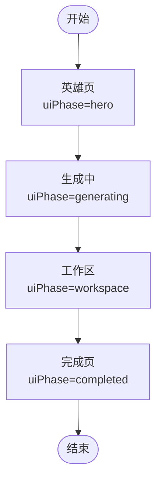
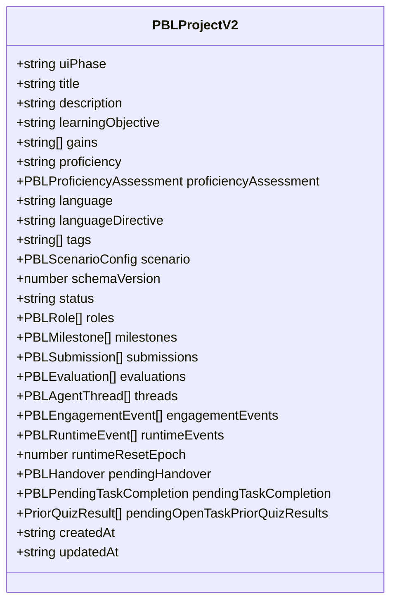
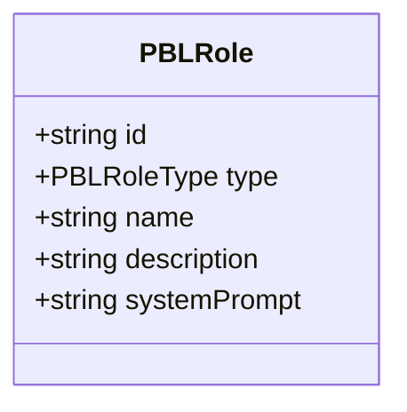
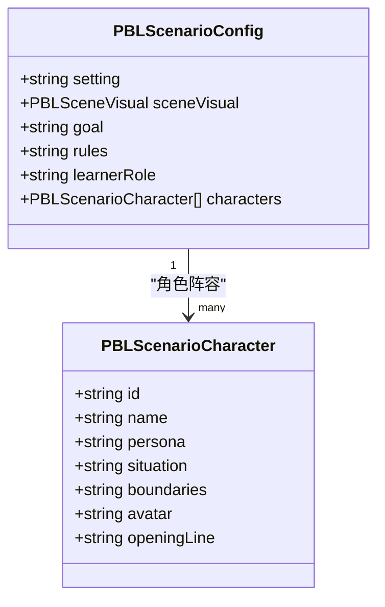
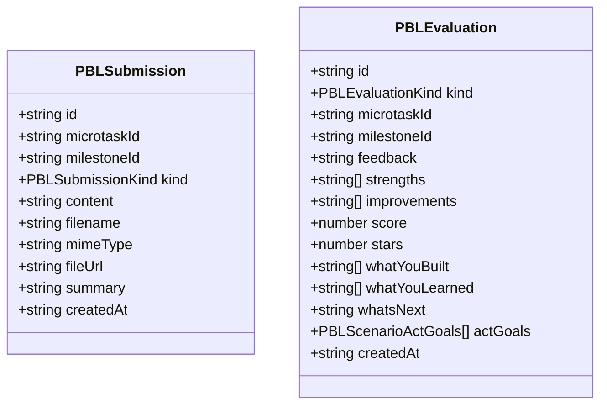
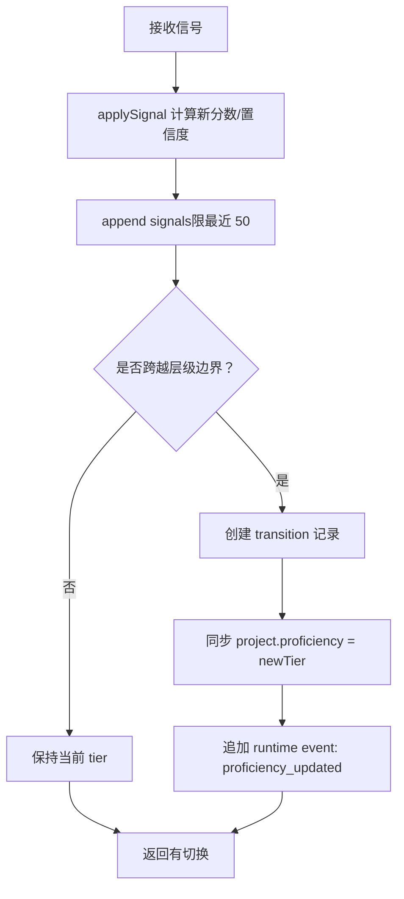
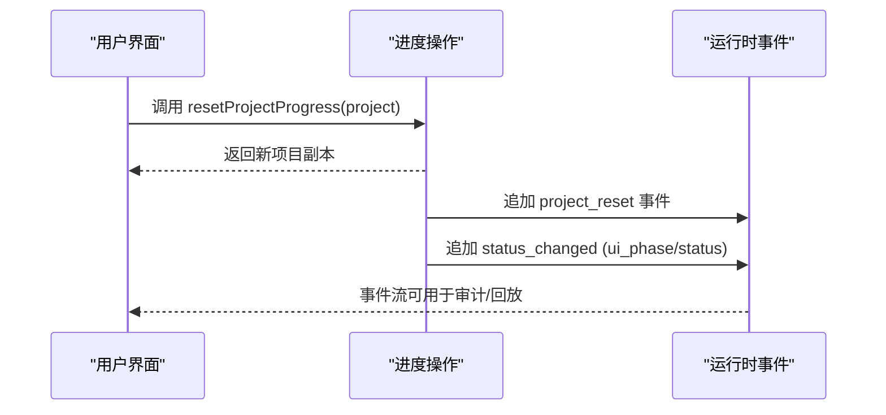
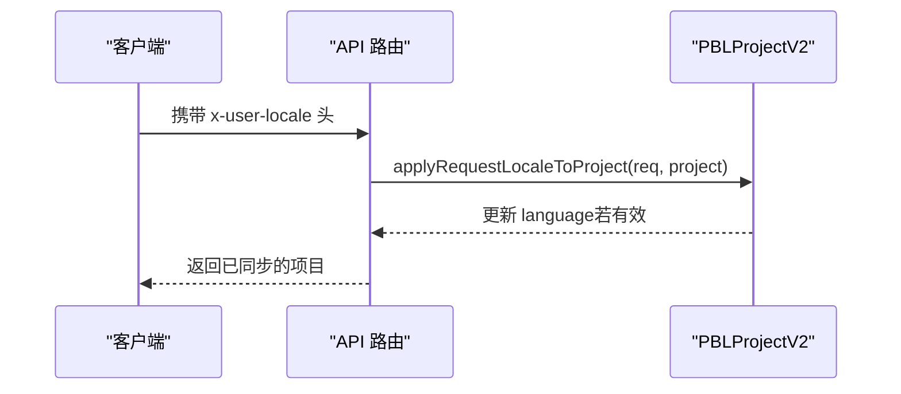

# 数据模型设计

<cite>
**本文引用的文件**   
- [types.ts](file://lib/pbl/v2/types.ts)
- [progress.ts](file://lib/pbl/v2/operations/progress.ts)
- [proficiency.ts](file://lib/pbl/v2/operations/proficiency.ts)
- [planner.ts](file://lib/pbl/v2/agents/planner.ts)
- [instructor.ts](file://lib/pbl/v2/agents/instructor.ts)
- [eval-prompts.ts](file://lib/pbl/v2/operations/eval-prompts.ts)
- [hero.tsx](file://components/scene-renderers/pbl/v2/hero.tsx)
- [chat.tsx](file://components/scene-renderers/pbl/v2/chat.tsx)
- [pbl-renderer.tsx](file://components/scene-renderers/pbl-renderer.tsx)
- [advance-patch.test.ts](file://tests/pbl/v2/advance-patch.test.ts)
- [submission-flow.test.ts](file://tests/pbl/v2/submission-flow.test.ts)
- [submission.test.ts](file://tests/pbl/v2/submission.test.ts)
- [locale.test.ts](file://tests/pbl/v2/locale.test.ts)
- [fold.test.ts](file://tests/pbl/v2/fold.test.ts)
</cite>

## 产品概述
本文件聚焦 PBL v2 的数据模型设计，围绕核心类型 PBLProjectV2、角色系统（PBLRole）、里程碑与微任务层次结构、场景配置与角色卡、提交物与评估、以及自适应能力评估（ProficiencyAssessment）进行系统化说明。该模型用于支撑“英雄页 → 生成中 → 工作区 → 完成”的 UI 状态机，并贯穿 Instructor 引导式教学、多阶段里程碑推进、结构化评估与学习分析等关键业务链路。

## 核心业务流程
- 项目生命周期：由 uiPhase 驱动 hero → generating → workspace → completed 四阶段流转；status 字段维护 designing/review/active/completed/archived 等运行期状态。
- 里程碑与微任务：每个里程碑包含若干微任务，通过状态机 todo → in_progress → completed/skipped 推进；跨里程碑需显式“继续”确认（pendingHandover）。
- 提交与评估：支持文本、文件、链接三类提交；评估分为 task/milestone/final 三级，含分数、星级、优势与改进建议等结构化字段。
- 自适应能力评估：基于信号（观察、错误、概念解锁、求助、自我纠正、关闭检查质量等）使用 EWMA 更新分数与置信度，动态调整 tier（beginner/intermediate/advanced）。
- 场景角色扮演：当存在 project.scenario 时，进入 prep → roleplay ×N → wrapup 三幕流程，角色卡与旁白消息参与对话渲染。



**章节来源**
- [types.ts:69-71](file://lib/pbl/v2/types.ts#L69-L71)
- [types.ts:828](file://lib/pbl/v2/types.ts#L828)
- [progress.ts:188-218](file://lib/pbl/v2/operations/progress.ts#L188-L218)

## 功能模块清单
- 核心项目模型（PBLProjectV2）
  - 职责：承载项目元数据、语言策略、里程碑/微任务、提交/评估、聊天线程、事件账本、运行时标记等。
  - 验收要点：JSON 序列化无损；isPBLProjectV2 守卫可用；最小化必填字段可构造。
- 角色系统（PBLRole）
  - 职责：定义参与者（当前仅 Instructor），支持 description/systemPrompt 等元信息；预留 evaluator/mentor/collaborator/simulator/system 类型。
  - 验收要点：Planner 仅允许 instructor 类型；Instructor 唯一性校验。
- 里程碑与微任务（PBLMilestone/PBLMicrotask）
  - 职责：组织学习任务与交付；内置内部评估、完成标准、场景化 successWhen/skillFocus/learnerBrief 等。
  - 验收要点：状态机推进、跨里程碑 handover、engagement 摘要缓存。
- 场景配置与角色卡（PBLScenarioConfig/PBLScenarioCharacter）
  - 职责：描述角色设定、边界、开场线、场景视觉；prep/roleplay/wrapup 三幕骨架。
  - 验收要点：presence of scenario 作为角色扮演项目的唯一门控。
- 提交物与评估（PBLSubmission/PBLEvaluation）
  - 职责：记录 learner 产出与 Instructor 结构化反馈；支持文本/文件/链接；final 评估含 actGoals。
  - 验收要点：提交追加、最新提交摘要、自动进阶阈值（如 60 分）。
- 自适应能力评估（ProficiencyAssessment）
  - 职责：EWMA 分数与置信度更新、信号聚合、层级切换与冷却机制。
  - 验收要点：ensureAssessment/updateProjectAssessment/describeAssessment 行为正确。

**章节来源**
- [types.ts:767-888](file://lib/pbl/v2/types.ts#L767-L888)
- [types.ts:78-91](file://lib/pbl/v2/types.ts#L78-L91)
- [types.ts:128-180](file://lib/pbl/v2/types.ts#L128-L180)
- [types.ts:197-243](file://lib/pbl/v2/types.ts#L197-L243)
- [types.ts:245-317](file://lib/pbl/v2/types.ts#L245-L317)
- [types.ts:319-399](file://lib/pbl/v2/types.ts#L319-L399)
- [types.ts:538-644](file://lib/pbl/v2/types.ts#L538-L644)
- [planner.ts:649-685](file://lib/pbl/v2/agents/planner.ts#L649-L685)
- [submission-flow.test.ts:29-34](file://tests/pbl/v2/submission-flow.test.ts#L29-L34)

## 数据与状态
### PBLProjectV2 核心类型与字段
- 元数据：title、description、learningObjective、gains、language/languageDirective、tags、schemaVersion。
- 结构与生命周期：roles、milestones、submissions、evaluations、threads、status、createdAt/updatedAt。
- 运行时状态：engagementEvents、runtimeEvents、runtimeResetEpoch、pendingHandover、pendingTaskCompletion、pendingOpenTaskPriorQuizResults。
- 自适应能力：proficiency（与 assessment.tier 同步）、proficiencyAssessment（score/confidence/signals/transitions 等）。



**图表来源**
- [types.ts:767-888](file://lib/pbl/v2/types.ts#L767-L888)

**章节来源**
- [types.ts:767-888](file://lib/pbl/v2/types.ts#L767-L888)

### 角色系统（PBLRole）
- 字段：id、type、name、description（面向学习者）、systemPrompt（内部人格/声音）。
- 权限控制：当前仅 instructor 被接入；其他类型（evaluator/mentor/collaborator/simulator/system）为预留或消息级 roleType。
- Planner 约束：只允许添加一个 instructor，重复则拒绝。



**图表来源**
- [types.ts:78-91](file://lib/pbl/v2/types.ts#L78-L91)

**章节来源**
- [types.ts:40-47](file://lib/pbl/v2/types.ts#L40-L47)
- [planner.ts:649-685](file://lib/pbl/v2/agents/planner.ts#L649-L685)

### 里程碑与微任务层次结构
- PBLMilestone：标题、描述、status（locked/active/completed）、order、microtasks、briefing/completionCriteria/debrief、synthesisCheck、internalAssessment、scenarioStage（prep/roleplay/wrapup）。
- PBLMicrotask：标题、描述、status（todo/in_progress/completed/skipped）、assignee（user）、hints、order、internalAssessment、completionReason、engagement、completionCriteria、successWhen、characterObjective、skillFocus、narration、learnerBrief。
- 状态推进：advanceMicrotask/startMicrotask 等操作函数驱动状态变更，并在必要时触发 handover 与 runtime 事件。

```mermaid
classDiagram
class PBLMilestone {
+string id
+string title
+string description
+PBLMilestoneStatus status
+number order
+PBLMicrotask[] microtasks
+PBLDocument[] documents
+string briefing
+string completionCriteria
+string debrief
+{coreConcept : string} synthesisCheck
+PBLInternalAssessment internalAssessment
+string scenarioStage
}
class PBLMicrotask {
+string id
+string title
+string description
+PBLMicrotaskStatus status
+PBLAssignee assignee
+string[] hints
+number order
+PBLInternalAssessment internalAssessment
+string completionReason
+PBLEngagementSummary engagement
+string completionCriteria
+string successWhen
+string characterObjective
+string skillFocus
+string narration
+string learnerBrief
}
PBLMilestone "1" --> "many" PBLMicrotask : "包含"
```

**图表来源**
- [types.ts:197-243](file://lib/pbl/v2/types.ts#L197-L243)
- [types.ts:128-180](file://lib/pbl/v2/types.ts#L128-L180)

**章节来源**
- [types.ts:197-243](file://lib/pbl/v2/types.ts#L197-L243)
- [types.ts:128-180](file://lib/pbl/v2/types.ts#L128-L180)
- [progress.ts:1-39](file://lib/pbl/v2/operations/progress.ts#L1-39)

### 场景配置与角色卡（角色扮演）
- PBLScenarioConfig：setting、sceneVisual、goal、rules、learnerRole、characters。
- PBLScenarioCharacter：name、persona、situation、boundaries、avatar、openingLine。
- 三幕骨架：prep（引入设定与角色）→ roleplay（沉浸式对话，可能多幕）→ wrapup（轻量数据驱动反馈）。



**图表来源**
- [types.ts:297-317](file://lib/pbl/v2/types.ts#L297-L317)
- [types.ts:245-271](file://lib/pbl/v2/types.ts#L245-L271)

**章节来源**
- [types.ts:297-317](file://lib/pbl/v2/types.ts#L297-L317)
- [types.ts:245-271](file://lib/pbl/v2/types.ts#L245-L271)
- [eval-prompts.ts:438-451](file://lib/pbl/v2/operations/eval-prompts.ts#L438-L451)

### 提交物与评估
- PBLSubmission：id、microtaskId、milestoneId、kind（text/file/link）、content、filename/mimeType、fileUrl（原始文件 URL）、summary（LLM 摘要）、createdAt。
- PBLEvaluation：kind（task/milestone/final）、microtaskId/milestoneId、feedback、strengths、improvements、score（可选）、stars（0.5 步进）、whatYouBuilt/whatYouLearned/whatsNext（final）、actGoals（scenario final）、createdAt。



**图表来源**
- [types.ts:319-339](file://lib/pbl/v2/types.ts#L319-L339)
- [types.ts:369-399](file://lib/pbl/v2/types.ts#L369-L399)

**章节来源**
- [types.ts:319-339](file://lib/pbl/v2/types.ts#L319-L339)
- [types.ts:369-399](file://lib/pbl/v2/types.ts#L369-L399)
- [submission.test.ts:38-52](file://tests/pbl/v2/submission.test.ts#L38-L52)
- [submission-flow.test.ts:29-34](file://tests/pbl/v2/submission-flow.test.ts#L29-L34)

### 自适应能力评估（ProficiencyAssessment）
- 信号种类：静态（outline_keyword/prior_scene_difficulty/user_bio/user_level_explicit/quiz_accuracy）与动态（submission_score/task_speed/help_request/concept_confusion/self_correction/force_advance/closing_check_quality）。
- 评估结构：tier、score（[-1,+1]）、confidence（[0,1]）、source、signals（最近 50）、lastUpdatedAt、transitions、dynamicSignalsSinceRetier、turnsSinceRetier。
- 算法要点：EWMA 更新分数与置信度；shouldRetier 考虑冷却与信号数量；ensureAssessment/updateProjectAssessment/describeAssessment 提供入口与视图。



**图表来源**
- [proficiency.ts:709-726](file://lib/pbl/v2/operations/proficiency.ts#L709-L726)
- [proficiency.ts:863-876](file://lib/pbl/v2/operations/proficiency.ts#L863-L876)
- [proficiency.ts:878-893](file://lib/pbl/v2/operations/proficiency.ts#L878-L893)

**章节来源**
- [types.ts:538-644](file://lib/pbl/v2/types.ts#L538-L644)
- [proficiency.ts:484-521](file://lib/pbl/v2/operations/proficiency.ts#L484-L521)
- [proficiency.ts:606-625](file://lib/pbl/v2/operations/proficiency.ts#L606-L625)
- [proficiency.ts:709-726](file://lib/pbl/v2/operations/proficiency.ts#L709-L726)
- [proficiency.ts:844-857](file://lib/pbl/v2/operations/proficiency.ts#L844-L857)
- [proficiency.ts:863-876](file://lib/pbl/v2/operations/proficiency.ts#L863-L876)
- [proficiency.ts:878-893](file://lib/pbl/v2/operations/proficiency.ts#L878-L893)

### 运行时事件与重置
- runtimeEvents：message_created/tool_call_*、submission_created/evaluation_created、status_changed、project_reset、handover_staged/consumed、task_completion_staged/cleared、proficiency_updated。
- resetProjectProgress：清空进度但保留结构（roles/milestones/title/language 等），重置 uiPhase/status/submissions/evaluations/engagementEvents/threads 等，递增 runtimeResetEpoch。



**图表来源**
- [progress.ts:188-218](file://lib/pbl/v2/operations/progress.ts#L188-L218)
- [types.ts:468-535](file://lib/pbl/v2/types.ts#L468-L535)

**章节来源**
- [types.ts:468-535](file://lib/pbl/v2/types.ts#L468-L535)
- [progress.ts:188-218](file://lib/pbl/v2/operations/progress.ts#L188-L218)

### 语言与区域设置
- language：BCP-47 回退语言代码；languageDirective：课堂内容语言策略（权威来源）。
- 请求级 locale 同步：applyRequestLocaleToProject 根据 x-user-locale 头更新 project.language（忽略不支持的 locale）。



**图表来源**
- [types.ts:800-812](file://lib/pbl/v2/types.ts#L800-L812)
- [locale.test.ts:28-49](file://tests/pbl/v2/locale.test.ts#L28-L49)

**章节来源**
- [types.ts:800-812](file://lib/pbl/v2/types.ts#L800-L812)
- [locale.test.ts:28-49](file://tests/pbl/v2/locale.test.ts#L28-L49)

## 关键约束与边界
- 角色约束：仅 instructor 类型在 Planner 阶段允许创建且唯一；其他角色类型仅作为消息 roleType 出现于场景模式。
- 里程碑门控：LOCKED→ACTIVE 必须由学习者点击 Continue 触发（pendingHandover 卡片），避免自动推进。
- 提交与评估阈值：任务评估自动进阶阈值（例如 60 分）决定是否可以推进到下一任务。
- 事件容量：engagementEvents/runtimeEvents 采用环形缓冲限制，防止场景内容膨胀。
- JSON 无损：所有类型必须支持 JSON.stringify/parse 无损往返，确保持久化安全。
- 场景模式门控：presence of project.scenario 标志角色扮演项目；normal 项目不包含 scenario。

**章节来源**
- [planner.ts:649-685](file://lib/pbl/v2/agents/planner.ts#L649-L685)
- [progress.ts:1-39](file://lib/pbl/v2/operations/progress.ts#L1-39)
- [submission-flow.test.ts:29-34](file://tests/pbl/v2/submission-flow.test.ts#L29-L34)
- [types.ts:297-317](file://lib/pbl/v2/types.ts#L297-317)
- [types.ts:950-961](file://lib/pbl/v2/types.ts#L950-L961)