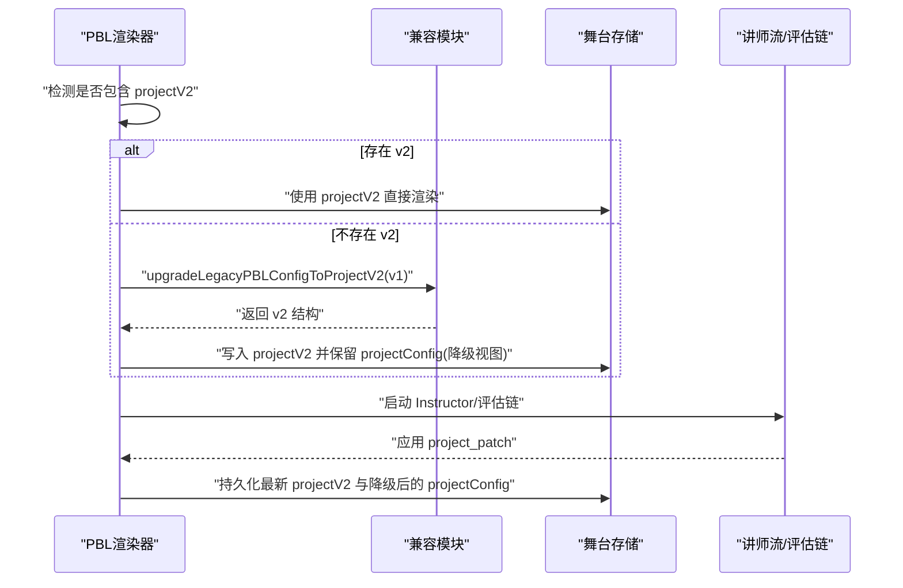
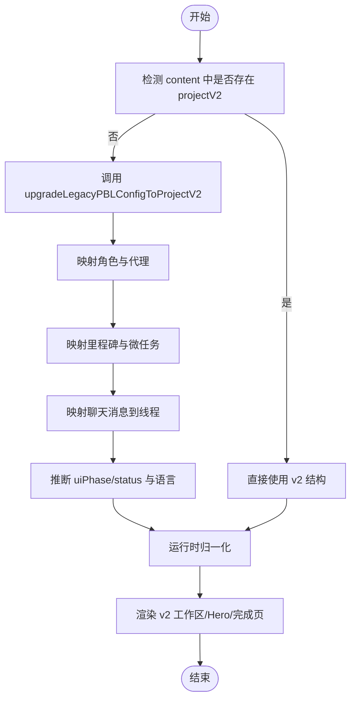
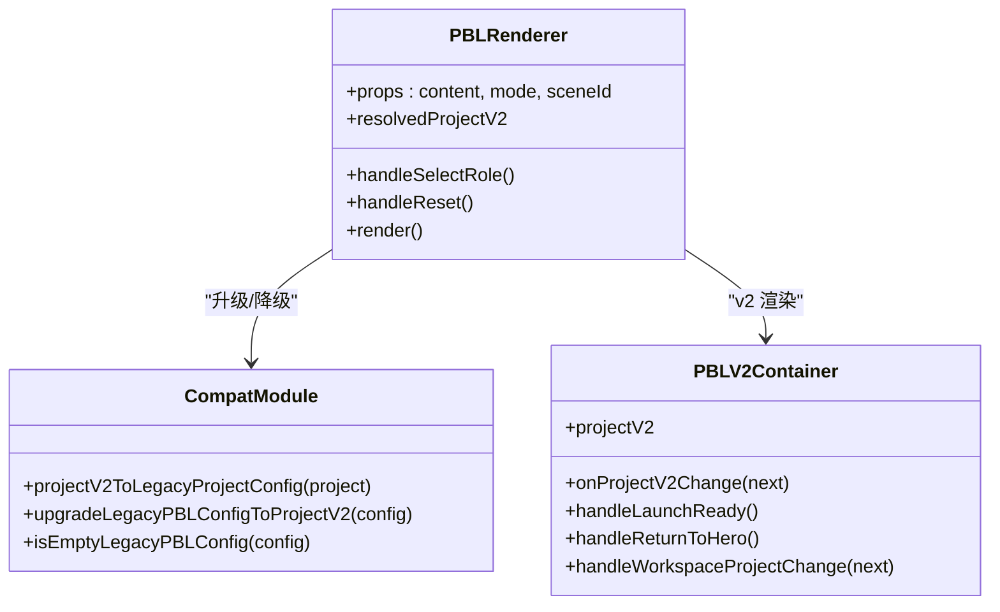
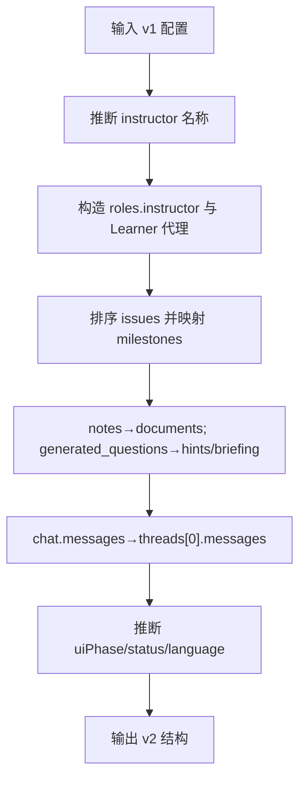
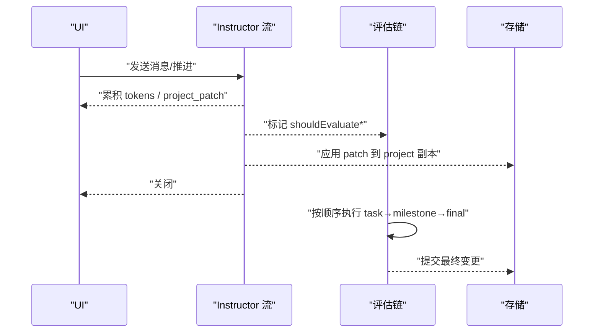
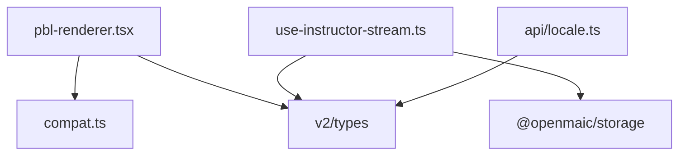

# 版本兼容性处理

<cite>
**本文引用的文件**   
- [pbl-renderer.tsx](file://components/scene-renderers/pbl-renderer.tsx)
- [compat.ts](file://lib/pbl/v2/compat.ts)
- [types.test.ts](file://tests/pbl/v2/types.test.ts)
- [drain.test.ts](file://tests/pbl/v2/drain.test.ts)
- [fold.test.ts](file://tests/pbl/v2/fold.test.ts)
- [pbl-v2-scene-routing.test.ts](file://tests/generation/pbl-v2-scene-routing.test.ts)
- [use-instructor-stream.ts](file://components/scene-renderers/pbl/v2/use-instructor-stream.ts)
- [locale.ts](file://lib/pbl/v2/api/locale.ts)
</cite>

## 产品概述
本文件聚焦于 PBL v1 到 v2 的版本兼容与迁移策略，覆盖数据结构映射、向后兼容保持、字段级默认值填充与废弃字段降级、渲染器分支逻辑、测试与验证机制，以及故障排除指南。目标是确保 v1 项目能够在 v2 环境中无缝运行，同时为后续演进提供清晰的边界与约束。

## 核心业务流程
- 数据入口与识别：渲染器接收内容后，优先判断是否存在 v2 结构；若无则回退到 v1 结构并执行升级。
- 双向转换：v1→v2 的升级与 v2→v1 的降级在渲染层与存储层之间保持一致，保证持久化与回放一致性。
- 运行时状态归一化：对 v2 运行时进行规范化，确保 UI 阶段、任务状态等一致。
- 流式事件与评估链：Instructor 流推进时应用补丁，随后按顺序触发评估链（任务→里程碑→最终）。
- 国际化同步：请求级别的语言设置与项目语言字段对齐，避免时序差异导致的显示不一致。

图表来源
- [pbl-renderer.tsx:45-168](file://components/scene-renderers/pbl-renderer.tsx#L45-L168)
- [compat.ts:74-148](file://lib/pbl/v2/compat.ts#L74-L148)
- [use-instructor-stream.ts:1-31](file://components/scene-renderers/pbl/v2/use-instructor-stream.ts#L1-L31)

章节来源
- [pbl-renderer.tsx:45-168](file://components/scene-renderers/pbl-renderer.tsx#L45-L168)
- [compat.ts:74-148](file://lib/pbl/v2/compat.ts#L74-L148)
- [use-instructor-stream.ts:1-31](file://components/scene-renderers/pbl/v2/use-instructor-stream.ts#L1-L31)

## 功能模块清单
- 渲染器分支与版本选择
  - 职责：根据 content.projectV2 或 projectConfig 决定渲染路径；若为 v1 则升级至 v2 再渲染。
  - 验收要点：v1 项目可正常进入 Hero/Workspace/Completion；v2 项目直接渲染且支持全屏/展开动画。
- 兼容转换模块
  - 职责：v1↔v2 的双向转换，包括角色、里程碑/问题板、聊天消息、语言推断、状态推导等。
  - 验收要点：round-trip 无损；缺失字段有合理默认值；废弃字段被正确降级。
- 运行时归一化与事件处理
  - 职责：对 v2 运行时进行规范化，处理 Instructor 流推进与评估链顺序。
  - 验收要点：patch 应用幂等；错误时仍推送已应用的变更；评估链顺序稳定。
- 国际化同步
  - 职责：将请求头中的用户语言同步到项目 language 字段，不影响 languageDirective。
  - 验收要点：仅在受支持区域设置下生效；不覆盖课程语言策略。

章节来源
- [pbl-renderer.tsx:45-168](file://components/scene-renderers/pbl-renderer.tsx#L45-L168)
- [compat.ts:12-148](file://lib/pbl/v2/compat.ts#L12-L148)
- [use-instructor-stream.ts:1-31](file://components/scene-renderers/pbl/v2/use-instructor-stream.ts#L1-L31)
- [locale.ts:1-21](file://lib/pbl/v2/api/locale.ts#L1-L21)

## 数据与状态
- v1→v2 升级映射
  - 角色与代理：从 v1 的 agents 与 issueboard 推断 instructor 名称，构造 v2 roles 中的 instructor 角色；创建 Learner 代理用于兼容。
  - 里程碑与微任务：将 v1 的 issues 排序后映射为 milestones，每个 milestone 包含一个 microtask；notes 转为 documents；generated_questions 作为 hints 或 briefing。
  - 聊天消息：将 v1 chat.messages 转换为 v2 threads[0].messages，区分 user/instructor 角色类型，时间戳标准化为 ISO。
  - 状态与阶段：根据 selectedRole、chat 历史、issue 完成度推断 uiPhase（hero/workspace/completed）与 status。
  - 语言推断：基于文本特征自动推断 BCP-47 语言代码，缺省 en-US。
- v2→v1 降级映射
  - 将 v2 milestones 映射为 v1 issues，计算 is_active/is_done、current_issue_id。
  - 将 v2 roles 中的 instructor 映射为 v1 agent，并生成 Learner 代理。
  - 将 v2 threads 中的消息映射回 v1 chat.messages，保持角色语义。
- 字段级默认值与废弃字段处理
  - 缺失字段：如 proficiency/tags/submissions/evaluations/engagementEvents 初始化为空数组或空字符串；createdAt/updatedAt 使用当前时间。
  - 废弃字段：v1 的 notes 降级为 documents 列表；selectedRole 仅用于推断起始阶段，不作为持久化主键。
- 运行时状态流转
  - uiPhase：hero → workspace → completed；通过 transitionProjectUiPhase 驱动。
  - milestone/microtask 状态：locked/active/completed 与 todo/in_progress/completed/skipped 对应。
  - 流式推进：Instructor 流产出 advance patch，随后依次触发 task/milestone/final 评估。

图表来源
- [compat.ts:74-148](file://lib/pbl/v2/compat.ts#L74-L148)
- [pbl-renderer.tsx:45-168](file://components/scene-renderers/pbl-renderer.tsx#L45-L168)

章节来源
- [compat.ts:74-148](file://lib/pbl/v2/compat.ts#L74-L148)
- [pbl-renderer.tsx:45-168](file://components/scene-renderers/pbl-renderer.tsx#L45-L168)

## 关键约束与边界
- 渲染器分支逻辑
  - 优先级：content.projectV2 存在则走 v2 路径；否则检查 isEmptyLegacyPBLConfig；若为空则提示“空项目”；未选择角色则进入角色选择；选中角色后进入工作区。
  - 全屏与展开：workspace/completion 阶段通过 portal 固定帧承载，避免 remount 导致状态丢失。
- 向后兼容策略
  - 持久化同时保存 projectV2 与降级后的 projectConfig，确保旧组件仍可读取。
  - 类型守卫 isPBLProjectV2 严格区分 v1/v2 结构，防止误判。
- 字段级兼容性
  - 缺失字段默认值：如 tags=[]、proficiency=""、submissions/evaluations/threads/engagementEvents 初始为空。
  - 废弃字段降级：notes→documents；selectedRole 仅用于推断起始阶段。
- 国际化边界
  - 仅当 x-user-locale 为受支持区域时更新 project.language；不覆盖 languageDirective。
- 性能与稳定性
  - 运行时归一化采用结构化克隆与最小化重渲染；流式事件计数避免并发冲突。
- 测试与验证
  - 类型与 round-trip 测试确保 JSON 序列化无损。
  - 场景路由测试验证 single-call 优先与回退策略。
  - drain/fold 测试保障运行时记录与折叠的正确性。

章节来源
- [pbl-renderer.tsx:45-168](file://components/scene-renderers/pbl-renderer.tsx#L45-L168)
- [types.test.ts:192-255](file://tests/pbl/v2/types.test.ts#L192-L255)
- [pbl-v2-scene-routing.test.ts:82-148](file://tests/generation/pbl-v2-scene-routing.test.ts#L82-L148)
- [drain.test.ts:1-39](file://tests/pbl/v2/drain.test.ts#L1-L39)
- [fold.test.ts:1-16](file://tests/pbl/v2/fold.test.ts#L1-L16)
- [locale.ts:1-21](file://lib/pbl/v2/api/locale.ts#L1-L21)

## 详细组件分析

### 渲染器分支与版本选择
- 行为说明
  - 若 content.projectV2 存在，直接进入 v2 容器；否则尝试升级 v1 配置。
  - 空项目或未选择角色时分别给出提示与角色选择界面。
  - v2 容器负责全屏/展开动画、portal 宿主同步、流式活动计数。
- 关键点
  - onProjectV2Change 回调会同时写入 projectV2 与降级后的 projectConfig，确保双格式持久化。
  - handleWorkspaceProjectChange 在 Hero 阶段阻止非 hero 的 uiPhase 写入，避免意外导航。

图表来源
- [pbl-renderer.tsx:45-168](file://components/scene-renderers/pbl-renderer.tsx#L45-L168)
- [compat.ts:12-148](file://lib/pbl/v2/compat.ts#L12-L148)

章节来源
- [pbl-renderer.tsx:45-168](file://components/scene-renderers/pbl-renderer.tsx#L45-L168)

### 兼容转换模块（v1↔v2）
- v1→v2 升级
  - 角色：推断 instructor 名称，构造 instructor 角色；添加 Learner 代理。
  - 里程碑：issues 排序后映射为 milestones，microtasks 由单个任务构成；notes→documents；generated_questions→hints/briefing。
  - 聊天：chat.messages→threads[0].messages，区分 user/instructor 角色类型。
  - 状态：根据 selectedRole/chat/issue 完成度推断 uiPhase 与 status。
  - 语言：基于文本特征推断 BCP-47 语言代码。
- v2→v1 降级
  - milestones→issues，计算 is_active/is_done 与 current_issue_id。
  - roles.instructor→agents；threads→chat.messages。
- 字段级默认值与废弃字段
  - 缺失字段填充默认值；notes 降级为 documents；selectedRole 仅用于推断起始阶段。

图表来源
- [compat.ts:74-148](file://lib/pbl/v2/compat.ts#L74-L148)

章节来源
- [compat.ts:74-148](file://lib/pbl/v2/compat.ts#L74-L148)

### 流式事件与评估链
- 行为说明
  - Instructor 流推进时收集 shouldEvaluateTask/Milestone/Final 标志，待 Instructor 关闭后按顺序开启评估流。
  - 错误时仍推送已应用的 project 变更，避免进度丢失。
- 关键点
  - 流式计数避免并发冲突；UI 在 streaming 时禁用发送。
  - 评估链顺序稳定：task→milestone→final。

图表来源
- [use-instructor-stream.ts:1-31](file://components/scene-renderers/pbl/v2/use-instructor-stream.ts#L1-L31)

章节来源
- [use-instructor-stream.ts:1-31](file://components/scene-renderers/pbl/v2/use-instructor-stream.ts#L1-L31)

### 国际化同步
- 行为说明
  - 从请求头 x-user-locale 获取用户语言，若为受支持区域则更新 project.language。
  - 不覆盖 languageDirective，确保课程内容语言策略权威。
- 关键点
  - 路由级别同步弥补 Hero 客户端副作用的时间差。

章节来源
- [locale.ts:1-21](file://lib/pbl/v2/api/locale.ts#L1-L21)

## 依赖分析
- 组件耦合
  - 渲染器依赖兼容模块进行 v1/v2 转换；容器管理全屏/展开与流式活动计数。
  - 流式钩子与评估链依赖运行时存储与类型定义。
- 外部依赖
  - 类型定义来自 lib/pbl/v2/types；存储来自 @openmaic/storage；DSL 运行时来自 @openmaic/dsl。
- 循环依赖
  - 兼容模块与渲染器单向依赖，无循环。

图表来源
- [pbl-renderer.tsx:45-168](file://components/scene-renderers/pbl-renderer.tsx#L45-L168)
- [compat.ts:12-148](file://lib/pbl/v2/compat.ts#L12-L148)
- [use-instructor-stream.ts:1-31](file://components/scene-renderers/pbl/v2/use-instructor-stream.ts#L1-L31)
- [locale.ts:1-21](file://lib/pbl/v2/api/locale.ts#L1-L21)

章节来源
- [pbl-renderer.tsx:45-168](file://components/scene-renderers/pbl-renderer.tsx#L45-L168)
- [compat.ts:12-148](file://lib/pbl/v2/compat.ts#L12-L148)
- [use-instructor-stream.ts:1-31](file://components/scene-renderers/pbl/v2/use-instructor-stream.ts#L1-L31)
- [locale.ts:1-21](file://lib/pbl/v2/api/locale.ts#L1-L21)

## 性能考虑
- 运行时归一化使用结构化克隆与最小化重渲染，避免不必要的状态更新。
- 流式事件计数确保并发安全，减少 UI 抖动。
- 全屏/展开动画通过 requestAnimationFrame 与 ResizeObserver 优化，避免频繁重排。

## 故障排除指南
- 现象：v1 项目无法进入工作区
  - 排查：确认 isEmptyLegacyPBLConfig 是否为真；检查 upgradeLegacyPBLConfigToProjectV2 是否正确推断 uiPhase。
  - 参考：[pbl-renderer.tsx:131-168](file://components/scene-renderers/pbl-renderer.tsx#L131-L168)、[compat.ts:74-148](file://lib/pbl/v2/compat.ts#L74-L148)
- 现象：JSON 序列化后数据丢失
  - 排查：运行 types.test.ts 中的 round-trip 测试；检查可选字段是否被正确填充默认值。
  - 参考：[types.test.ts:192-255](file://tests/pbl/v2/types.test.ts#L192-L255)
- 现象：single-call 失败后未回退
  - 排查：检查 pbl-v2-scene-routing.test.ts 的回退逻辑；确认环境变量与 mock 设置。
  - 参考：[pbl-v2-scene-routing.test.ts:82-148](file://tests/generation/pbl-v2-scene-routing.test.ts#L82-L148)
- 现象：运行时记录异常
  - 排查：运行 drain.test.ts 与 fold.test.ts；检查 withRuntimeStorageExclusiveLock 与 record-payloads 版本。
  - 参考：[drain.test.ts:1-39](file://tests/pbl/v2/drain.test.ts#L1-L39)、[fold.test.ts:1-16](file://tests/pbl/v2/fold.test.ts#L1-L16)
- 现象：语言设置未生效
  - 排查：确认 x-user-locale 是否在受支持区域；检查 applyRequestLocaleToProject 是否被调用。
  - 参考：[locale.ts:1-21](file://lib/pbl/v2/api/locale.ts#L1-L21)

章节来源
- [pbl-renderer.tsx:131-168](file://components/scene-renderers/pbl-renderer.tsx#L131-L168)
- [compat.ts:74-148](file://lib/pbl/v2/compat.ts#L74-L148)
- [types.test.ts:192-255](file://tests/pbl/v2/types.test.ts#L192-L255)
- [pbl-v2-scene-routing.test.ts:82-148](file://tests/generation/pbl-v2-scene-routing.test.ts#L82-L148)
- [drain.test.ts:1-39](file://tests/pbl/v2/drain.test.ts#L1-L39)
- [fold.test.ts:1-16](file://tests/pbl/v2/fold.test.ts#L1-L16)
- [locale.ts:1-21](file://lib/pbl/v2/api/locale.ts#L1-L21)

## 结论
通过严格的类型守卫、双向转换、运行时归一化与流式事件处理，PBL v2 实现了与 v1 的无缝兼容。字段级默认值填充与废弃字段降级确保了数据完整性与向后兼容。测试套件覆盖了类型、round-trip、场景路由与运行时记录，为迁移准确性提供了保障。开发者可依据本指南快速定位与解决兼容性问题，确保 v1 项目在 v2 环境中稳定运行。