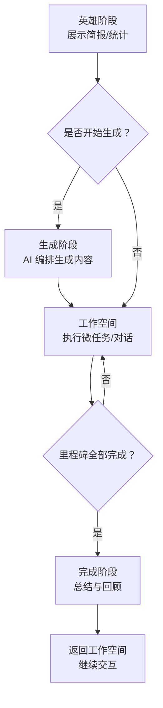
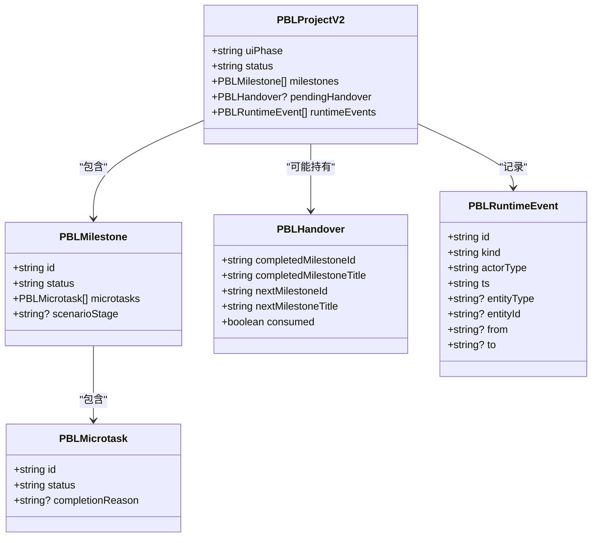
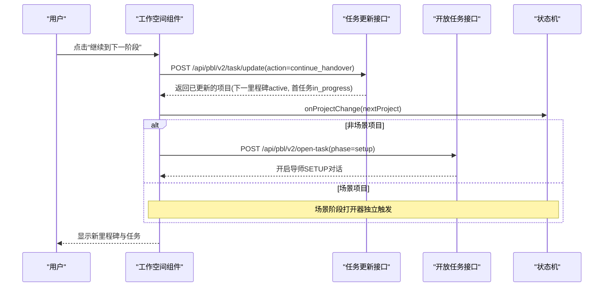
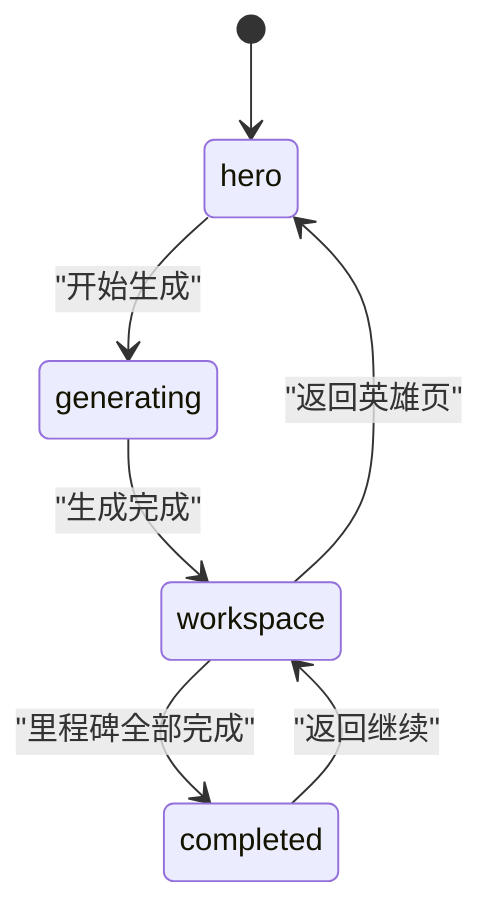
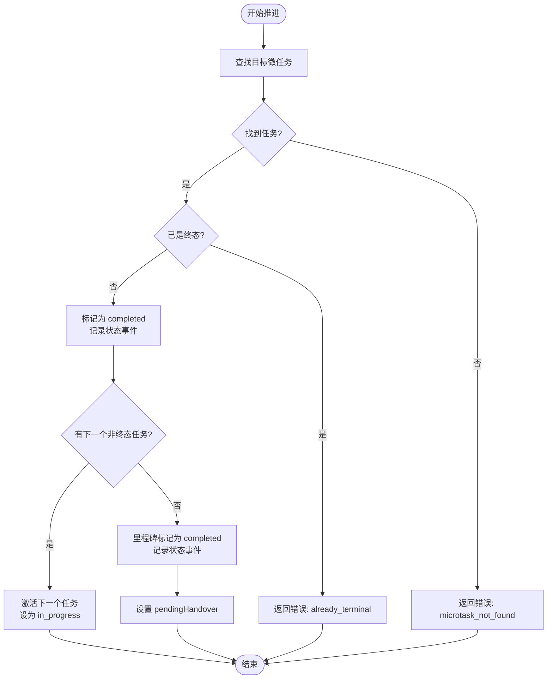
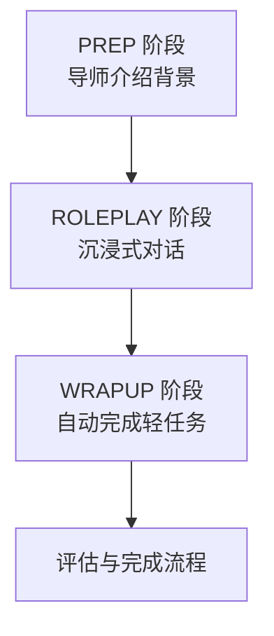
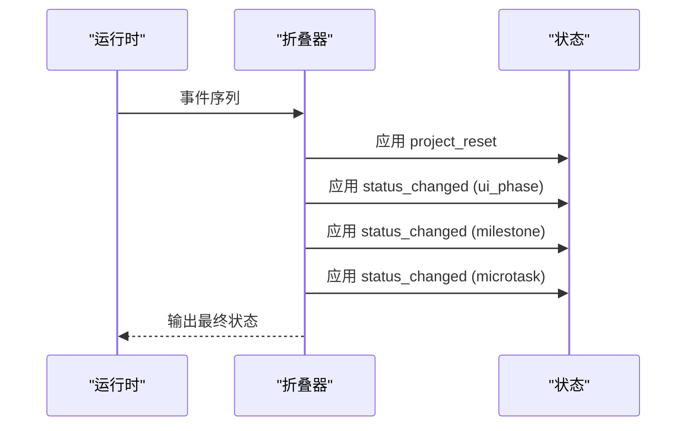
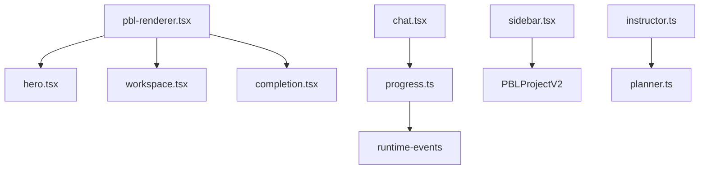

# 状态机与流程控制

<cite>
**本文引用的文件**   
- [pbl-renderer.tsx](file://components/scene-renderers/pbl-renderer.tsx)
- [hero.tsx](file://components/scene-renderers/pbl/v2/hero.tsx)
- [chat.tsx](file://components/scene-renderers/pbl/v2/chat.tsx)
- [sidebar.tsx](file://components/scene-renderers/pbl/v2/sidebar.tsx)
- [progress.ts](file://lib/pbl/v2/operations/progress.ts)
- [instructor.ts](file://lib/pbl/v2/agents/instructor.ts)
- [planner.ts](file://lib/pbl/v2/agents/planner.ts)
- [fold.ts](file://lib/pbl/v2/runtime/fold.ts)
- [advance-patch.test.ts](file://tests/pbl/v2/advance-patch.test.ts)
- [types.test.ts](file://tests/pbl/v2/types.test.ts)
- [chat-timeline.test.ts](file://tests/pbl/v2/chat-timeline.test.ts)
</cite>

## 产品概述
本文件聚焦 PBL v2 的状态机与流程控制，覆盖 UI 阶段状态机（PBLUiPhase）、里程碑与微任务状态流转、场景阶段（scenarioStage）的三段式行为、运行时事件系统（PBLRuntimeEvent），以及错误处理与回滚策略。目标是帮助开发者与产品人员准确理解从“英雄页”到“工作空间”，再到“完成总结”的全链路控制逻辑，确保状态一致性与可观测性。

## 核心业务流程
- 英雄阶段（hero）：展示项目简报、角色与里程碑概览；支持进入生成阶段或启动工作空间。
- 生成阶段（generating）：由编排层驱动内容生成，完成后自动转入工作空间。
- 工作空间（workspace）：学习者执行微任务、与导师对话、推进里程碑；遇到手递卡片需确认才能进入下一阶段。
- 完成阶段（completed）：汇总学习成果，提供返回工作空间的入口以继续交互。

**章节来源**
- [pbl-renderer.tsx:306-327](file://components/scene-renderers/pbl-renderer.tsx#L306-L327)
- [pbl-renderer.tsx:618-632](file://components/scene-renderers/pbl-renderer.tsx#L618-L632)

## 功能模块清单
- UI 阶段状态机（PBLUiPhase）
  - 职责：管理 hero → generating → workspace → completed 的切换与渲染选择。
  - 验收要点：各阶段渲染正确、过渡动画合理、返回逻辑不丢失进度。
- 里程碑与微任务推进
  - 职责：维护 milestone（locked → active → completed）与 microtask（todo → in_progress → completed/skipped）状态。
  - 验收要点：推进后事件记录完整、下一项自动激活、门控条件满足。
- 手递卡片（PBLHandover）
  - 职责：在里程碑完成后提示用户确认进入下一阶段，防止自动越界。
  - 验收要点：仅当 pendingHandover 存在且未消费时显示；确认后标记 consumed。
- 场景阶段（scenarioStage）
  - 职责：prep/roleplay/wrapup 三阶段差异化行为，含自动完成与门控。
  - 验收要点：prep 引导、roleplay 沉浸交互、wrapup 自动完成并触发后续流程。
- 运行时事件系统（PBLRuntimeEvent）
  - 职责：记录所有状态变更与关键动作，支持折叠与回放。
  - 验收要点：事件类型齐全、时间戳与实体标识准确、重置后旧事件丢弃。

**章节来源**
- [progress.ts:460-579](file://lib/pbl/v2/operations/progress.ts#L460-L579)
- [progress.ts:760-801](file://lib/pbl/v2/operations/progress.ts#L760-L801)
- [chat.tsx:190-262](file://components/scene-renderers/pbl/v2/chat.tsx#L190-L262)
- [sidebar.tsx:39-64](file://components/scene-renderers/pbl/v2/sidebar.tsx#L39-L64)
- [fold.ts:149-187](file://lib/pbl/v2/runtime/fold.ts#L149-L187)

## 数据与状态
- UI 阶段状态机（PBLUiPhase）
  - 状态集合：hero、generating、workspace、completed。
  - 转换规则：
    - hero → generating：由用户操作或生成流程触发。
    - generating → workspace：生成完成后自动切换。
    - workspace ↔ completed：完成阶段可返回工作空间；工作空间可进入完成阶段。
  - 渲染选择：根据 uiPhase 决定渲染 Hero、Workspace 或 Completion。
- 里程碑状态（milestone.status）
  - 状态集合：locked、active、completed。
  - 初始分配：首个里程碑为 active，其余为 locked。
  - 推进条件：当前里程碑内所有微任务达到终态（completed/skipped）且至少有一个真正完成。
- 微任务状态（microtask.status）
  - 状态集合：todo、in_progress、completed、skipped。
  - 推进路径：todo → in_progress → completed/skipped。
  - 自动激活：完成当前微任务后，同一里程碑内的下一个非终态微任务自动设为 in_progress。
- 手递卡片（pendingHandover）
  - 结构字段：completedMilestoneId、completedMilestoneTitle、nextMilestoneId、nextMilestoneTitle、consumed。
  - 消费机制：用户点击“继续到下一阶段”后，服务器将 next 里程碑置为 active，首个微任务置为 in_progress，并将 handover 标记为 consumed。
- 场景阶段（scenarioStage）
  - 取值：prep、roleplay、wrapup。
  - 行为差异：
    - prep：导师介绍背景与角色，无任务，等待用户进入场景。
    - roleplay：沉浸式角色扮演，持续交互直至用户主动结束。
    - wrapup：导师基于真实对话进行轻量反馈，自动完成该阶段的单条轻任务，无需确认。
- 运行时事件（PBLRuntimeEvent）
  - 类型包括：project_reset、status_changed（entityType: project/ui_phase/microtask/milestone）、handover_consumed、tool_call_started 等。
  - 追踪机制：每次状态变更追加 status_changed 事件，附带 from/to 与实体 ID；重置事件会清空旧事件与快照。

**图表来源**
- [progress.ts:460-579](file://lib/pbl/v2/operations/progress.ts#L460-L579)
- [progress.ts:760-801](file://lib/pbl/v2/operations/progress.ts#L760-L801)
- [types.test.ts:147-190](file://tests/pbl/v2/types.test.ts#L147-L190)

**章节来源**
- [progress.ts:188-218](file://lib/pbl/v2/operations/progress.ts#L188-L218)
- [progress.ts:460-579](file://lib/pbl/v2/operations/progress.ts#L460-L579)
- [progress.ts:760-801](file://lib/pbl/v2/operations/progress.ts#L760-L801)
- [fold.ts:149-187](file://lib/pbl/v2/runtime/fold.ts#L149-L187)
- [types.test.ts:147-190](file://tests/pbl/v2/types.test.ts#L147-L190)

## 关键约束与边界
- UI 阶段切换约束
  - 生成阶段完成后自动进入工作空间；完成阶段与工作空间之间可互相返回，但保持进度不变。
  - 返回英雄页时重置展开状态，避免全屏残留影响下次启动动画。
- 里程碑推进门控
  - 只有当里程碑内所有微任务处于终态且至少有一个真正完成时，才允许里程碑标记为 completed。
  - 若全部微任务均为 skipped，则不视为真正完成，里程碑保持非 completed。
- 手递卡片确认机制
  - 跨里程碑推进必须由用户显式点击“继续到下一阶段”；服务端在 continue_handover 中设置 next 里程碑为 active 并激活首个微任务。
  - 客户端在收到更新后的项目后立即打开新任务的 SETUP 对话（非场景项目）。
- 场景阶段特殊处理
  - prep：禁止自动推进，仅提供问答与引导。
  - roleplay：持续交互，直到用户主动结束；无中间节拍推进。
  - wrapup：自动完成该阶段唯一轻任务，无需确认；随后进入评估与完成流程。
- 运行时事件与一致性
  - 每次状态变更必须追加 status_changed 事件，包含实体类型、ID、from/to。
  - project_reset 事件会递增 resetEpoch，丢弃旧事件与快照，保证回放一致性。
- 错误处理与回滚
  - 网络请求失败时通过聊天错误横幅提示；避免静默失败。
  - 应用补丁时需校验微任务是否存在、状态是否合法，必要时回滚或拒绝应用。

**图表来源**
- [chat.tsx:190-262](file://components/scene-renderers/pbl/v2/chat.tsx#L190-L262)

**章节来源**
- [pbl-renderer.tsx:271-281](file://components/scene-renderers/pbl-renderer.tsx#L271-L281)
- [chat.tsx:190-262](file://components/scene-renderers/pbl/v2/chat.tsx#L190-L262)
- [advance-patch.test.ts:170-211](file://tests/pbl/v2/advance-patch.test.ts#L170-L211)
- [advance-patch.test.ts:398-450](file://tests/pbl/v2/advance-patch.test.ts#L398-L450)
- [chat-timeline.test.ts:291-340](file://tests/pbl/v2/chat-timeline.test.ts#L291-L340)

## 详细组件分析

### UI 阶段状态机（PBLUiPhase）
- 状态定义与渲染映射
  - hero：渲染英雄页，展示项目信息、角色、里程碑统计。
  - generating：生成阶段，由编排层驱动，完成后切换到 workspace。
  - workspace：工作空间，承载对话、任务列表、侧边栏控制。
  - completed：完成阶段，展示总结并提供返回工作空间入口。
- 转换逻辑
  - 从 hero 进入 generating：由用户操作或生成流程触发。
  - 从 generating 进入 workspace：生成完成后自动切换。
  - workspace 与 completed 之间可互返，保持进度不变。
- 动画与体验
  - 首次 launch 使用更慢的展开动画，提升沉浸感。
  - 返回英雄页时重置展开状态，避免全屏残留。

**图表来源**
- [pbl-renderer.tsx:306-327](file://components/scene-renderers/pbl-renderer.tsx#L306-L327)
- [pbl-renderer.tsx:618-632](file://components/scene-renderers/pbl-renderer.tsx#L618-L632)

**章节来源**
- [pbl-renderer.tsx:306-327](file://components/scene-renderers/pbl-renderer.tsx#L306-L327)
- [pbl-renderer.tsx:618-632](file://components/scene-renderers/pbl-renderer.tsx#L618-L632)

### 里程碑与微任务推进
- 微任务推进
  - 调用 advanceMicrotask 将当前微任务标记为 completed，并记录状态变更事件。
  - 若同一里程碑内存在下一个非终态微任务，自动将其设为 in_progress 并记录 opened 事件。
  - 若无下一个微任务，则将里程碑标记为 completed，并记录里程碑状态变更事件。
- 里程碑完成门控
  - 仅当所有微任务处于终态且至少有一个真正完成时，里程碑才可标记为 completed。
  - 若全部微任务均为 skipped，则不视为真正完成。
- 手递卡片
  - 里程碑完成后，设置 pendingHandover，等待用户确认。
  - 用户确认后，调用 continueAfterHandover 激活下一里程碑并启动首个微任务。

**图表来源**
- [progress.ts:460-579](file://lib/pbl/v2/operations/progress.ts#L460-L579)

**章节来源**
- [progress.ts:460-579](file://lib/pbl/v2/operations/progress.ts#L460-L579)
- [progress.ts:760-801](file://lib/pbl/v2/operations/progress.ts#L760-L801)
- [advance-patch.test.ts:398-450](file://tests/pbl/v2/advance-patch.test.ts#L398-L450)

### 场景阶段（scenarioStage）特殊处理
- prep 阶段
  - 导师介绍背景与角色，无任务，禁止自动推进。
  - 用户可随时进入场景，侧边栏提供“进入场景”按钮。
- roleplay 阶段
  - 沉浸式角色扮演，持续交互直至用户主动结束。
  - 无中间节拍推进，强调自然对话流。
- wrapup 阶段
  - 导师基于真实对话进行轻量反馈，自动完成该阶段唯一轻任务。
  - 无需用户确认，直接触发后续评估与完成流程。

**图表来源**
- [instructor.ts:1659-1694](file://lib/pbl/v2/agents/instructor.ts#L1659-L1694)
- [planner.ts:1121-1155](file://lib/pbl/v2/agents/planner.ts#L1121-L1155)

**章节来源**
- [instructor.ts:1659-1694](file://lib/pbl/v2/agents/instructor.ts#L1659-L1694)
- [planner.ts:1121-1155](file://lib/pbl/v2/agents/planner.ts#L1121-L1155)
- [sidebar.tsx:39-64](file://components/scene-renderers/pbl/v2/sidebar.tsx#L39-L64)

### 运行时事件系统（PBLRuntimeEvent）
- 事件类型
  - project_reset：项目重置，递增 resetEpoch，丢弃旧事件与快照。
  - status_changed：状态变更，包含 entityType、entityId、from、to。
  - handover_consumed：手递卡片被消费。
  - tool_call_started：工具调用开始，记录 agent 行为。
- 折叠与回放
  - 按事件顺序应用状态变更，遇到 project_reset 时重置状态。
  - 支持 gap 检测与修复，确保回放一致性。

**图表来源**
- [fold.ts:149-187](file://lib/pbl/v2/runtime/fold.ts#L149-L187)

**章节来源**
- [fold.ts:149-187](file://lib/pbl/v2/runtime/fold.ts#L149-L187)
- [chat-timeline.test.ts:291-340](file://tests/pbl/v2/chat-timeline.test.ts#L291-L340)

## 依赖分析
- 组件依赖
  - pbl-renderer.tsx 依赖 hero.tsx、workspace.tsx、completion.tsx 进行阶段渲染。
  - chat.tsx 依赖 progress.ts 进行任务推进与手递卡片处理。
  - sidebar.tsx 提供场景阶段控制按钮，依赖项目状态决定显示内容。
- 状态依赖
  - progress.ts 依赖 runtime-events 工具函数记录状态变更。
  - instructor.ts 与 planner.ts 协作确保场景阶段设计与执行的一致性。
- 外部依赖
  - API 路由 /api/pbl/v2/task/update 与 /api/pbl/v2/open-task 负责状态持久化与任务开启。

**图表来源**
- [pbl-renderer.tsx:306-327](file://components/scene-renderers/pbl-renderer.tsx#L306-L327)
- [chat.tsx:190-262](file://components/scene-renderers/pbl/v2/chat.tsx#L190-L262)
- [progress.ts:460-579](file://lib/pbl/v2/operations/progress.ts#L460-L579)

**章节来源**
- [pbl-renderer.tsx:306-327](file://components/scene-renderers/pbl-renderer.tsx#L306-L327)
- [chat.tsx:190-262](file://components/scene-renderers/pbl/v2/chat.tsx#L190-L262)
- [progress.ts:460-579](file://lib/pbl/v2/operations/progress.ts#L460-L579)

## 性能考虑
- 状态变更最小化：仅在必要时机更新项目状态，避免频繁重渲染。
- 事件批量处理：折叠器按顺序应用事件，减少重复计算。
- 动画优化：首次 launch 使用更平滑的动画，提升用户体验。

## 故障排除指南
- 常见问题
  - 手递卡片未显示：检查 pendingHandover 是否存在且未消费。
  - 微任务无法推进：确认任务状态是否为非终态，检查是否有下一个任务可激活。
  - 场景阶段卡住：验证 scenarioStage 是否正确设置，检查 wrapup 是否自动完成。
- 调试建议
  - 查看 runtimeEvents 日志，确认状态变更事件是否记录。
  - 检查 API 响应格式，确保项目对象正确返回。
  - 使用测试用例验证状态转换逻辑，如 advance-patch.test.ts。

**章节来源**
- [chat-timeline.test.ts:291-340](file://tests/pbl/v2/chat-timeline.test.ts#L291-L340)
- [advance-patch.test.ts:170-211](file://tests/pbl/v2/advance-patch.test.ts#L170-L211)

## 结论
PBL v2 的状态机与流程控制通过清晰的 UI 阶段划分、严格的里程碑与微任务推进逻辑、场景阶段的差异化处理，以及完善的运行时事件系统，确保了学习流程的可控性与可观测性。开发者应重点关注状态一致性、错误处理与用户体验优化，以确保系统的稳定与高效。