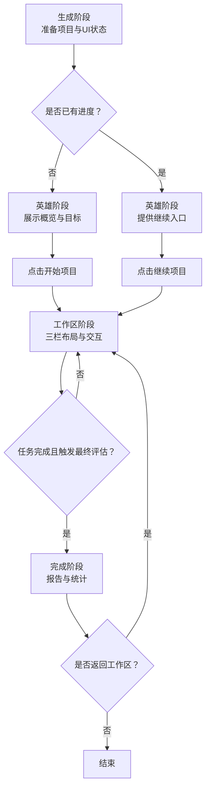
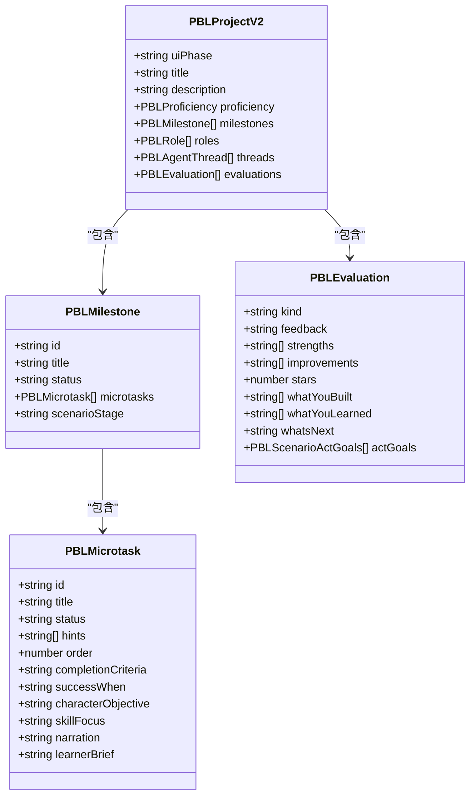
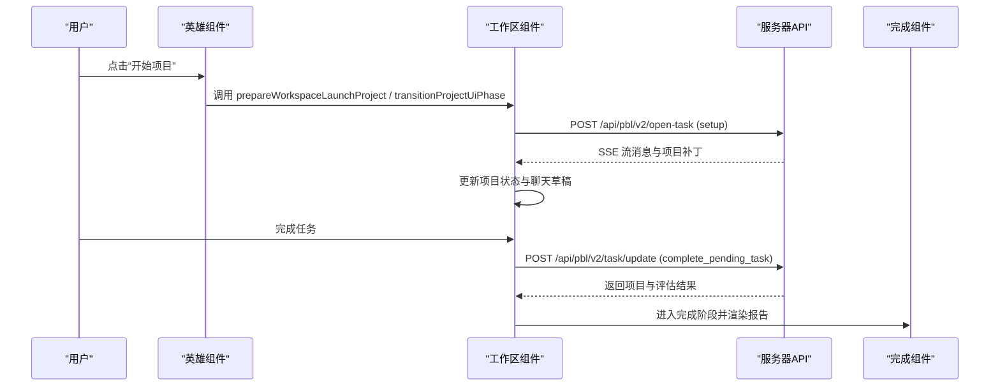
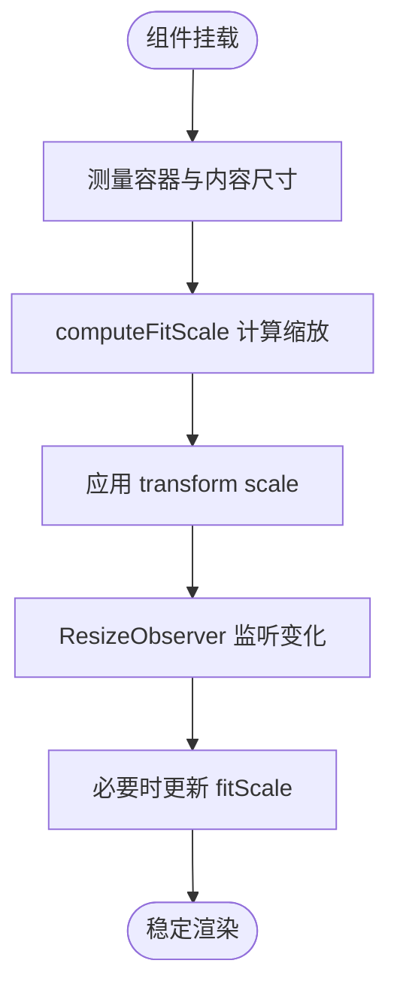
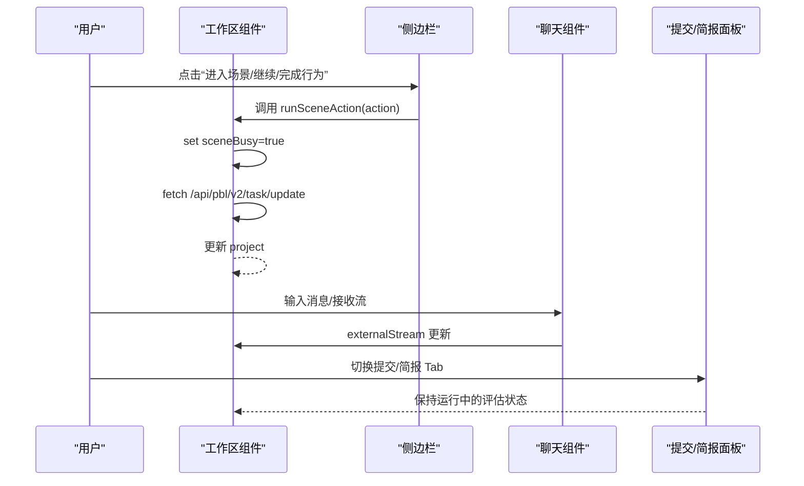
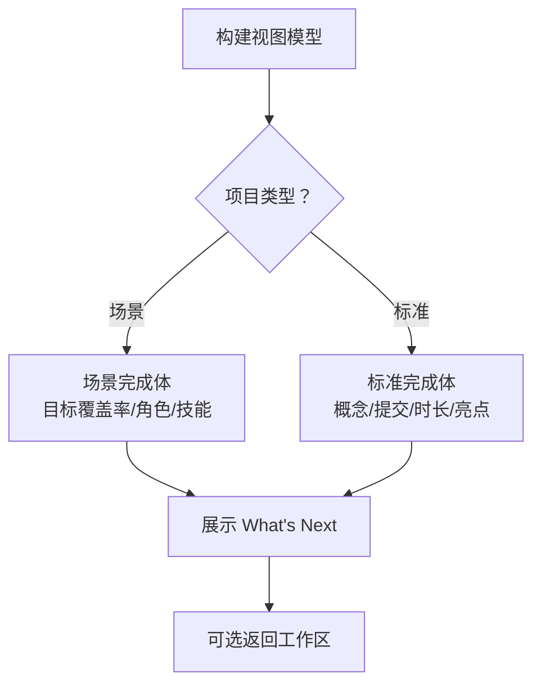
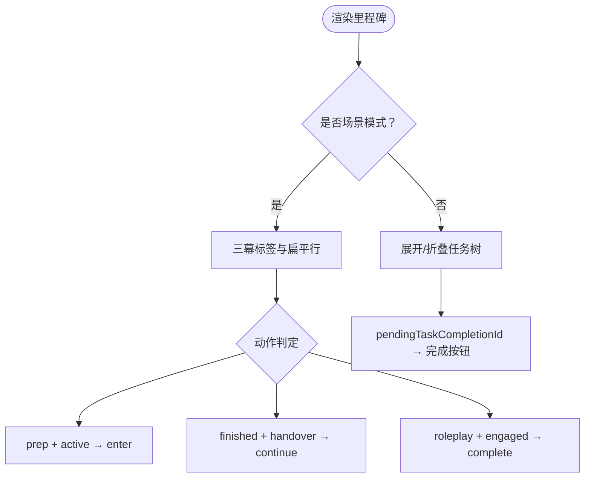
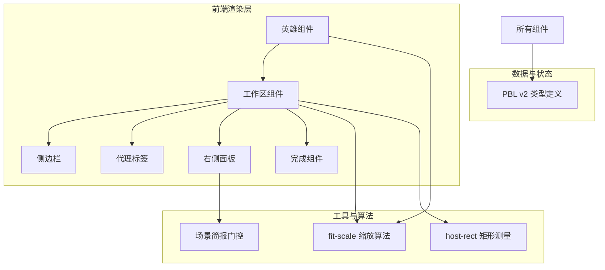
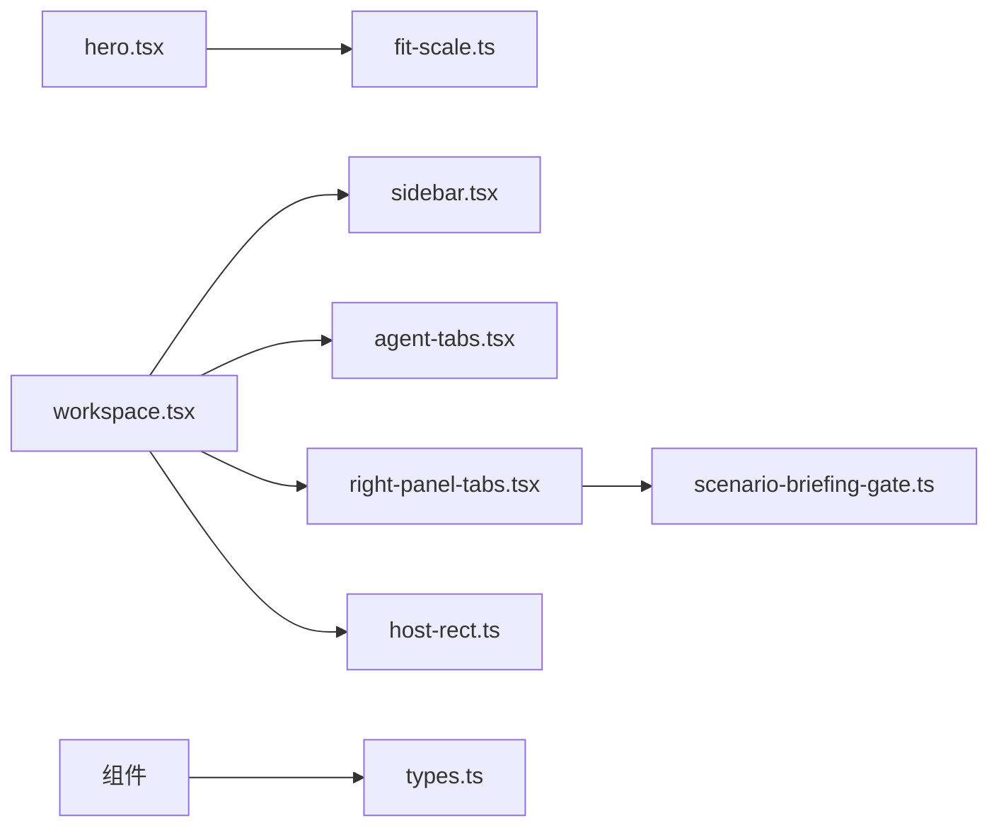

# 场景阶段管理

<cite>
**本文引用的文件**   
- [lib/pbl/v2/types.ts](file://lib/pbl/v2/types.ts)
- [components/scene-renderers/pbl/v2/hero.tsx](file://components/scene-renderers/pbl/v2/hero.tsx)
- [components/scene-renderers/pbl/v2/workspace.tsx](file://components/scene-renderers/pbl/v2/workspace.tsx)
- [components/scene-renderers/pbl/v2/completion.tsx](file://components/scene-renderers/pbl/v2/completion.tsx)
- [components/scene-renderers/pbl/v2/sidebar.tsx](file://components/scene-renderers/pbl/v2/sidebar.tsx)
- [components/scene-renderers/pbl/v2/agent-tabs.tsx](file://components/scene-renderers/pbl/v2/agent-tabs.tsx)
- [components/scene-renderers/pbl/v2/right-panel-tabs.tsx](file://components/scene-renderers/pbl/v2/right-panel-tabs.tsx)
- [components/scene-renderers/pbl/v2/scenario-briefing-gate.ts](file://components/scene-renderers/pbl/v2/scenario-briefing-gate.ts)
- [components/scene-renderers/pbl/v2/host-rect.ts](file://components/scene-renderers/pbl/v2/host-rect.ts)
- [components/scene-renderers/pbl/v2/fit-scale.ts](file://components/scene-renderers/pbl/v2/fit-scale.ts)
</cite>

## 产品概述
本文件聚焦 PBL（基于项目的学习）v2 的场景阶段管理，覆盖从“生成阶段”到“英雄阶段”“工作区阶段”再到“完成阶段”的完整生命周期。文档解释场景简报的显示逻辑与用户交互、主机矩形测量与定位算法（支持窗口尺寸变化与响应式布局）、阶段切换的条件判断与状态同步机制、全屏模式的实现细节（含原生全屏 API 的使用与兼容性处理），以及阶段状态的持久化恢复与错误恢复策略，并提供自定义阶段扩展的开发指南。

## 核心业务流程
- 生成阶段（generating）：系统准备项目数据与初始 UI 状态，等待进入英雄阶段。
- 英雄阶段（hero）：展示项目概览、学习目标与关键信息；点击“开始项目”后进入工作区；若已存在进度则提供“继续项目”。
- 工作区阶段（workspace）：三栏布局（左侧里程碑树、中间聊天、右侧提交面板或场景简报）；任务推进、评估流与场景控制在此阶段进行。
- 完成阶段（completed）：最终评估报告与统计汇总，支持返回工作区查看细节。

**章节来源**
- [lib/pbl/v2/types.ts:69-71](file://lib/pbl/v2/types.ts#L69-L71)
- [components/scene-renderers/pbl/v2/hero.tsx:102-138](file://components/scene-renderers/pbl/v2/hero.tsx#L102-L138)
- [components/scene-renderers/pbl/v2/workspace.tsx:107-418](file://components/scene-renderers/pbl/v2/workspace.tsx#L107-L418)
- [components/scene-renderers/pbl/v2/completion.tsx:107-199](file://components/scene-renderers/pbl/v2/completion.tsx#L107-L199)

## 功能模块清单
- 英雄阶段（Hero）
  - 职责：展示项目标题、描述、学习目标、角色信息与启动按钮；计算自适应缩放以适配容器高度。
  - 用户价值：降低认知负荷，明确下一步行动；支持继续与重置进度。
  - 验收要点：首次启动与继续路径一致；语言设置同步；缩放不裁剪底部内容。
- 工作区阶段（Workspace）
  - 职责：三栏布局、里程碑导航、聊天与评估流、提交面板或场景简报；支持面板宽度拖拽调整。
  - 用户价值：集中化的任务推进与反馈；清晰的进度可视化。
  - 验收要点：面板可调整且受最小/最大限制；场景动作在生成中禁用；右侧面板根据场景简报门控切换。
- 完成阶段（Completion）
  - 职责：聚合 LLM 总结与确定性统计；按项目类型（标准/场景）渲染不同内容。
  - 用户价值：结构化回顾与能力画像；可返回工作区深入查看。
  - 验收要点：评分与星级显示；阶段详情与亮点；场景目标的达成情况。
- 侧边栏（Sidebar）
  - 职责：里程碑树展开/折叠；场景动作（进入/继续/完成行为）；普通任务的完成入口。
  - 用户价值：直观路线图与上下文操作；场景模式下的沉浸式区分。
  - 验收要点：场景模式下的三幕标签与视觉差异；动作门控正确。
- 聊天与代理（Agent Tabs）
  - 职责：多代理标签（当前仅 Instructor）；承载场景入场动画与横幅（场景模式）。
  - 用户价值：统一的对话体验；场景沉浸感。
  - 验收要点：单代理时隐藏标签栏；场景横幅仅在 roleplay 阶段出现。
- 右侧面板（Right Panel Tabs）
  - 职责：提交面板与场景简报双 Tab；保持两个面板挂载以避免中断评估流。
  - 用户价值：在场景模式下获取背景信息与任务提示。
  - 验收要点：默认显示提交面板；切换不影响运行中的评估。
- 场景简报门控（Scenario Briefing Gate）
  - 职责：纯函数决定何时显示场景简报 Tab。
  - 用户价值：确保仅在 prep 完成后显示，避免干扰。
  - 验收要点：非场景项目始终返回 false；prep 完成后永久为 true。

**章节来源**
- [components/scene-renderers/pbl/v2/hero.tsx:50-192](file://components/scene-renderers/pbl/v2/hero.tsx#L50-L192)
- [components/scene-renderers/pbl/v2/workspace.tsx:56-68](file://components/scene-renderers/pbl/v2/workspace.tsx#L56-L68)
- [components/scene-renderers/pbl/v2/completion.tsx:79-98](file://components/scene-renderers/pbl/v2/completion.tsx#L79-L98)
- [components/scene-renderers/pbl/v2/sidebar.tsx:146-229](file://components/scene-renderers/pbl/v2/sidebar.tsx#L146-L229)
- [components/scene-renderers/pbl/v2/agent-tabs.tsx:35-97](file://components/scene-renderers/pbl/v2/agent-tabs.tsx#L35-L97)
- [components/scene-renderers/pbl/v2/right-panel-tabs.tsx:37-88](file://components/scene-renderers/pbl/v2/right-panel-tabs.tsx#L37-L88)
- [components/scene-renderers/pbl/v2/scenario-briefing-gate.ts:20-23](file://components/scene-renderers/pbl/v2/scenario-briefing-gate.ts#L20-L23)

## 数据与状态
- 项目状态机（uiPhase）
  - 类型：'hero' | 'generating' | 'workspace' | 'completed'
  - 作用：驱动渲染器选择对应阶段组件。
- 里程碑与微任务
  - 里程碑状态：'locked' | 'active' | 'completed'
  - 微任务状态：'todo' | 'in_progress' | 'completed' | 'skipped'
  - 场景模式：milestone.scenarioStage ∈ {'prep','roleplay','wrapup'}
- 评估与提交
  - 评估种类：'task' | 'milestone' | 'final'
  - 提交种类：'text' | 'file' | 'link'
- 参与事件与分析缓存
  - 追加式事件账本（engagement events）与缓存摘要（engagement summary）用于报告与评估。

**图表来源**
- [lib/pbl/v2/types.ts:767-800](file://lib/pbl/v2/types.ts#L767-L800)
- [lib/pbl/v2/types.ts:197-243](file://lib/pbl/v2/types.ts#L197-L243)
- [lib/pbl/v2/types.ts:129-180](file://lib/pbl/v2/types.ts#L129-L180)
- [lib/pbl/v2/types.ts:371-399](file://lib/pbl/v2/types.ts#L371-L399)

**章节来源**
- [lib/pbl/v2/types.ts:22-30](file://lib/pbl/v2/types.ts#L22-L30)
- [lib/pbl/v2/types.ts:69-71](file://lib/pbl/v2/types.ts#L69-L71)
- [lib/pbl/v2/types.ts:197-243](file://lib/pbl/v2/types.ts#L197-L243)
- [lib/pbl/v2/types.ts:129-180](file://lib/pbl/v2/types.ts#L129-L180)
- [lib/pbl/v2/types.ts:371-399](file://lib/pbl/v2/types.ts#L371-L399)

## 关键约束与边界
- 阶段切换条件
  - 生成→英雄：项目就绪后进入 hero。
  - 英雄→工作区：点击“开始项目”或“继续项目”，调用 prepareWorkspaceLaunchProject 或 transitionProjectUiPhase。
  - 工作区→完成：任务完成并触发 final 评估后进入 completed。
- 状态同步机制
  - onProjectChange 作为单一更新入口，确保各组件共享最新项目状态。
  - instructorStreaming 跨组件透传，防止并发冲突（如 Hero↔Workspace 往返时的流状态）。
- 场景简报显示
  - shouldShowScenarioBriefing 为纯函数，依赖 project.scenario 与 milestone.scenarioStage==='prep' 且 status==='completed'。
- 主机矩形测量与定位
  - host-rect 工具提供 LayoutRect 与 rectsEqual 用于脏检查，避免每帧重渲染。
  - fit-scale 计算统一缩放比例，保证内容在固定 16:9 容器中完全可见且不放大。
- 全屏模式
  - 工作区顶部栏提供“进入全屏”按钮；需结合原生全屏 API 与兼容性处理（如 requestFullscreen、exitFullscreen、fullscreenchange 监听）。
- 持久化与恢复
  - 项目状态通过 onProjectChange 持久化（例如 IndexedDB 或后端存储），恢复时重建 uiPhase 与里程碑/微任务状态。
- 错误恢复
  - 网络请求失败时保留按钮可用性以便重试；流状态清理与忙标志复位。

**图表来源**
- [components/scene-renderers/pbl/v2/hero.tsx:102-138](file://components/scene-renderers/pbl/v2/hero.tsx#L102-L138)
- [components/scene-renderers/pbl/v2/workspace.tsx:182-278](file://components/scene-renderers/pbl/v2/workspace.tsx#L182-L278)
- [components/scene-renderers/pbl/v2/completion.tsx:107-199](file://components/scene-renderers/pbl/v2/completion.tsx#L107-L199)

**章节来源**
- [components/scene-renderers/pbl/v2/scenario-briefing-gate.ts:20-23](file://components/scene-renderers/pbl/v2/scenario-briefing-gate.ts#L20-L23)
- [components/scene-renderers/pbl/v2/host-rect.ts:11-27](file://components/scene-renderers/pbl/v2/host-rect.ts#L11-L27)
- [components/scene-renderers/pbl/v2/fit-scale.ts:18-40](file://components/scene-renderers/pbl/v2/fit-scale.ts#L18-L40)
- [components/scene-renderers/pbl/v2/workspace.tsx:420-529](file://components/scene-renderers/pbl/v2/workspace.tsx#L420-L529)

## 详细组件分析

### 英雄阶段（Hero）
- 自适应缩放：使用 ResizeObserver 测量容器与内容尺寸，调用 computeFitScale 计算统一缩放比例，避免底部被裁剪。
- 语言同步：组件挂载时同步 locale 到 project.language（BCP-47 fallback），不影响 content-language 权威源。
- 启动与继续：首次启动构建 priorQuizSnapshot 并调用 prepareWorkspaceLaunchProject；继续直接 transitionProjectUiPhase('workspace')。
- 重置进度：resetProjectProgress 回到全新项目状态。

**图表来源**
- [components/scene-renderers/pbl/v2/hero.tsx:174-192](file://components/scene-renderers/pbl/v2/hero.tsx#L174-L192)
- [components/scene-renderers/pbl/v2/fit-scale.ts:18-40](file://components/scene-renderers/pbl/v2/fit-scale.ts#L18-L40)

**章节来源**
- [components/scene-renderers/pbl/v2/hero.tsx:72-138](file://components/scene-renderers/pbl/v2/hero.tsx#L72-L138)

### 工作区阶段（Workspace）
- 三栏布局：sidebar/chat/submission 百分比宽度，支持左右拖拽调整，带最小/最大限制。
- 场景动作：enter_scenario、continue_handover、complete_act 通过 /api/pbl/v2/task/update 调用，busy 标志防抖。
- 评估流：runOneStream 对接 open-task 与 evaluate 端点，维护 draftAssistant 与 committedOutput。
- 任务完成：complete_pending_task 后根据里程碑/项目完成状态触发相应评估流。

**图表来源**
- [components/scene-renderers/pbl/v2/workspace.tsx:143-181](file://components/scene-renderers/pbl/v2/workspace.tsx#L143-L181)
- [components/scene-renderers/pbl/v2/workspace.tsx:182-278](file://components/scene-renderers/pbl/v2/workspace.tsx#L182-L278)
- [components/scene-renderers/pbl/v2/right-panel-tabs.tsx:37-88](file://components/scene-renderers/pbl/v2/right-panel-tabs.tsx#L37-L88)

**章节来源**
- [components/scene-renderers/pbl/v2/workspace.tsx:56-68](file://components/scene-renderers/pbl/v2/workspace.tsx#L56-L68)
- [components/scene-renderers/pbl/v2/workspace.tsx:279-336](file://components/scene-renderers/pbl/v2/workspace.tsx#L279-L336)

### 完成阶段（Completion）
- 视图模型：buildCompletionReportViewModel 聚合总任务数、完成数、最终评估与统计。
- 分支渲染：stats.kind === 'scenario' 走场景专用体，否则标准体。
- 统计与亮点：概念解锁、独立率、错误恢复等确定性指标；LLM 生成的 whatYouBuilt/whatYouLearned/whatsNext。

**图表来源**
- [components/scene-renderers/pbl/v2/completion.tsx:79-98](file://components/scene-renderers/pbl/v2/completion.tsx#L79-L98)
- [components/scene-renderers/pbl/v2/completion.tsx:180-199](file://components/scene-renderers/pbl/v2/completion.tsx#L180-L199)

**章节来源**
- [components/scene-renderers/pbl/v2/completion.tsx:107-199](file://components/scene-renderers/pbl/v2/completion.tsx#L107-L199)

### 侧边栏（Sidebar）
- 场景模式三幕：prep/roleplay/wrapup 分段标签与视觉区分；roleplay 行扁平化不可展开。
- 动作门控：enter/continue/complete 依据 activeMilestoneId、pendingHandover 与 hasEngagedAct 判定。
- 普通任务：pendingTaskCompletionId 显示完成按钮。

**图表来源**
- [components/scene-renderers/pbl/v2/sidebar.tsx:146-229](file://components/scene-renderers/pbl/v2/sidebar.tsx#L146-L229)
- [components/scene-renderers/pbl/v2/sidebar.tsx:266-409](file://components/scene-renderers/pbl/v2/sidebar.tsx#L266-L409)

**章节来源**
- [components/scene-renderers/pbl/v2/sidebar.tsx:146-229](file://components/scene-renderers/pbl/v2/sidebar.tsx#L146-L229)

### 聊天与代理（Agent Tabs）
- 单代理隐藏标签栏；多代理显示角色图标与名称。
- 场景模式：ScenarioStage 组件在 chat 列顶部渲染入场动画与横幅（仅 roleplay 阶段）。

**章节来源**
- [components/scene-renderers/pbl/v2/agent-tabs.tsx:35-97](file://components/scene-renderers/pbl/v2/agent-tabs.tsx#L35-L97)

### 右侧面板（Right Panel Tabs）
- 默认提交面板；切换到简报时保持两个面板挂载，避免中断评估流。
- 场景简报门控：shouldShowScenarioBriefing 决定是否渲染该 Tab。

**章节来源**
- [components/scene-renderers/pbl/v2/right-panel-tabs.tsx:37-88](file://components/scene-renderers/pbl/v2/right-panel-tabs.tsx#L37-L88)
- [components/scene-renderers/pbl/v2/scenario-briefing-gate.ts:20-23](file://components/scene-renderers/pbl/v2/scenario-briefing-gate.ts#L20-L23)

## 架构总览

**图表来源**
- [components/scene-renderers/pbl/v2/hero.tsx:174-192](file://components/scene-renderers/pbl/v2/hero.tsx#L174-L192)
- [components/scene-renderers/pbl/v2/workspace.tsx:56-68](file://components/scene-renderers/pbl/v2/workspace.tsx#L56-L68)
- [components/scene-renderers/pbl/v2/completion.tsx:79-98](file://components/scene-renderers/pbl/v2/completion.tsx#L79-L98)
- [components/scene-renderers/pbl/v2/fit-scale.ts:18-40](file://components/scene-renderers/pbl/v2/fit-scale.ts#L18-L40)
- [components/scene-renderers/pbl/v2/host-rect.ts:11-27](file://components/scene-renderers/pbl/v2/host-rect.ts#L11-L27)
- [components/scene-renderers/pbl/v2/scenario-briefing-gate.ts:20-23](file://components/scene-renderers/pbl/v2/scenario-briefing-gate.ts#L20-L23)
- [lib/pbl/v2/types.ts:767-800](file://lib/pbl/v2/types.ts#L767-L800)

## 依赖分析
- 组件耦合
  - Hero 与 Workspace 通过 onProjectChange/onLaunchReady 松耦合；Workspace 内部依赖 Sidebar、AgentTabs、RightPanel。
- 外部依赖
  - API 端点：/api/pbl/v2/open-task、/api/pbl/v2/evaluate、/api/pbl/v2/task/update。
  - 浏览器 API：ResizeObserver、requestFullscreen/exitFullscreen（全屏模式）。
- 循环依赖
  - 无直接循环导入；工具函数（fit-scale、host-rect、briefing-gate）为纯函数，无副作用。

**图表来源**
- [components/scene-renderers/pbl/v2/hero.tsx:174-192](file://components/scene-renderers/pbl/v2/hero.tsx#L174-L192)
- [components/scene-renderers/pbl/v2/workspace.tsx:56-68](file://components/scene-renderers/pbl/v2/workspace.tsx#L56-L68)
- [components/scene-renderers/pbl/v2/right-panel-tabs.tsx:37-88](file://components/scene-renderers/pbl/v2/right-panel-tabs.tsx#L37-L88)
- [components/scene-renderers/pbl/v2/scenario-briefing-gate.ts:20-23](file://components/scene-renderers/pbl/v2/scenario-briefing-gate.ts#L20-L23)
- [components/scene-renderers/pbl/v2/host-rect.ts:11-27](file://components/scene-renderers/pbl/v2/host-rect.ts#L11-L27)
- [lib/pbl/v2/types.ts:767-800](file://lib/pbl/v2/types.ts#L767-L800)

**章节来源**
- [components/scene-renderers/pbl/v2/workspace.tsx:143-181](file://components/scene-renderers/pbl/v2/workspace.tsx#L143-L181)
- [components/scene-renderers/pbl/v2/agent-tabs.tsx:35-97](file://components/scene-renderers/pbl/v2/agent-tabs.tsx#L35-L97)

## 性能考虑
- 缩放与测量
  - ResizeObserver 仅在容器/内容尺寸变化时触发；fitScale 阈值比较避免频繁状态更新。
- 主机矩形跟踪
  - rectsEqual 用于脏检查，减少不必要的 React 重渲染。
- 流状态管理
  - externalStream 与 instructorStreaming 跨组件透传，避免重复请求与状态竞争。

[本节为通用指导，不直接分析具体文件]

## 故障排查指南
- 网络错误
  - 任务更新失败时保留按钮可用并重试；确保 finally 块复位 busy 标志。
- 流状态异常
  - 检查 onInstructorStreamingChange 是否正确传递；externalStream 状态清理。
- 缩放异常
  - 确认容器与内容节点引用有效；ResizeObserver 未泄漏。
- 场景简报不显示
  - 验证 shouldShowScenarioBriefing 返回值；检查 project.scenario 与 prep 里程碑状态。

**章节来源**
- [components/scene-renderers/pbl/v2/workspace.tsx:229-278](file://components/scene-renderers/pbl/v2/workspace.tsx#L229-L278)
- [components/scene-renderers/pbl/v2/hero.tsx:174-192](file://components/scene-renderers/pbl/v2/hero.tsx#L174-L192)
- [components/scene-renderers/pbl/v2/scenario-briefing-gate.ts:20-23](file://components/scene-renderers/pbl/v2/scenario-briefing-gate.ts#L20-L23)

## 结论
PBL v2 的场景阶段管理通过清晰的状态机与模块化组件实现了从生成到完成的流畅用户体验。自适应缩放、主机矩形测量与场景简报门控确保了在不同设备与窗口尺寸下的稳定表现。阶段切换条件严格、状态同步机制可靠，配合流管理与错误恢复策略提升了鲁棒性。遵循本文档的扩展指南，可在不破坏现有流程的前提下添加自定义阶段或增强场景模式。

[本节为总结性内容，不直接分析具体文件]