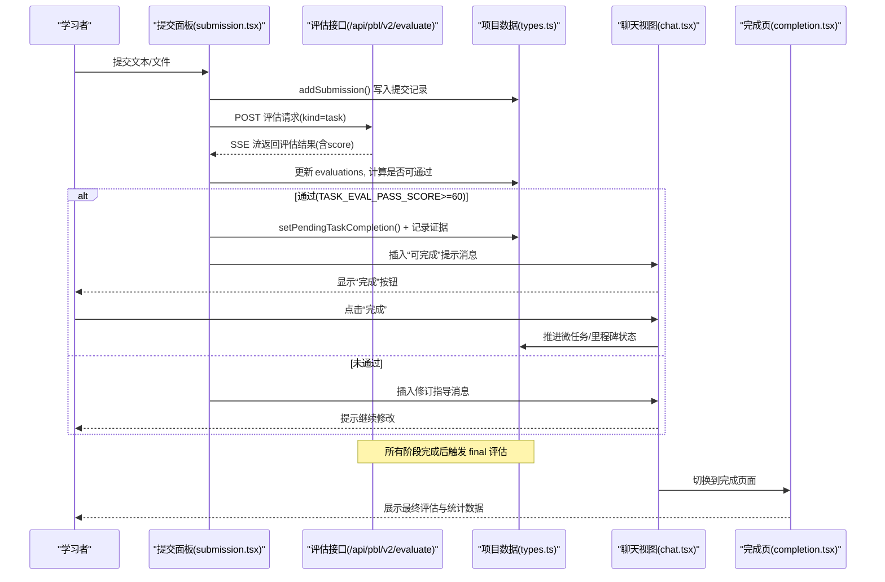
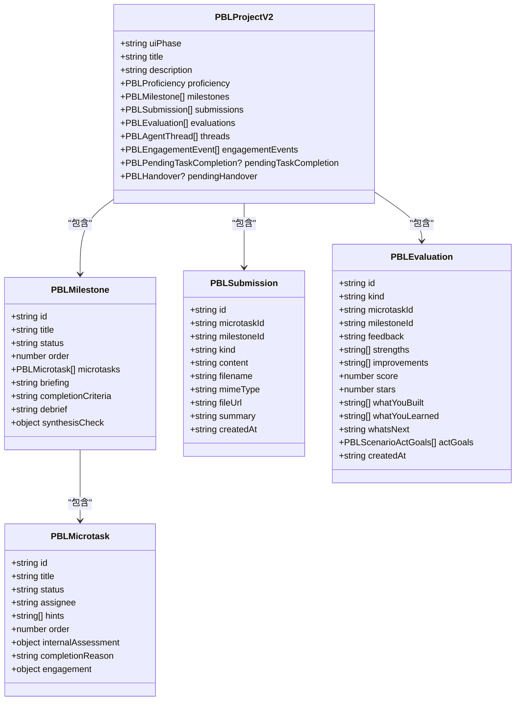
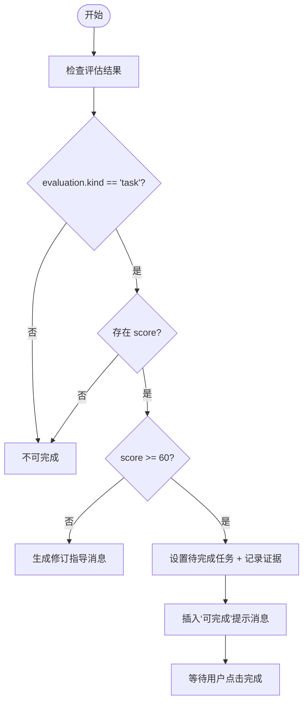
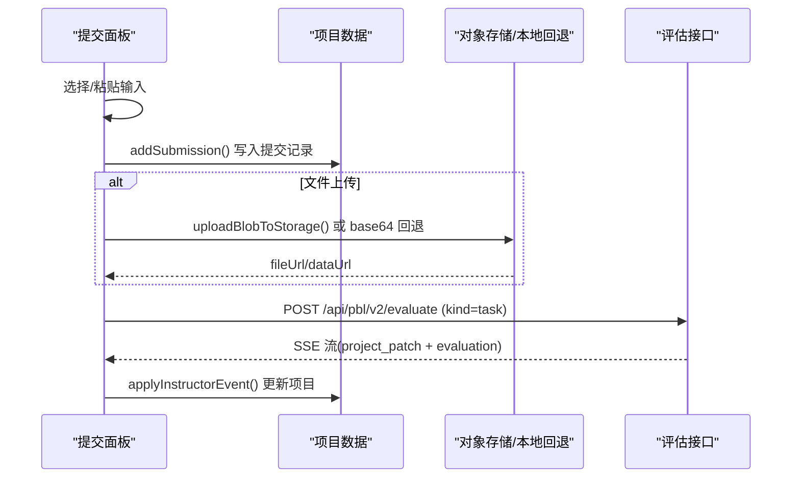

# 完成流程

<cite>
**本文引用的文件**   
- [components/scene-renderers/pbl/v2/completion.tsx](file://components/scene-renderers/pbl/v2/completion.tsx)
- [components/scene-renderers/pbl/v2/submission.tsx](file://components/scene-renderers/pbl/v2/submission.tsx)
- [lib/pbl/v2/types.ts](file://lib/pbl/v2/types.ts)
- [lib/pbl/v2/operations/task-completion.ts](file://lib/pbl/v2/operations/task-completion.ts)
- [lib/pbl/v2/operations/submission.ts](file://lib/pbl/v2/operations/submission.ts)
- [lib/pbl/v2/operations/completion-stats.ts](file://lib/pbl/v2/operations/completion-stats.ts)
- [lib/pbl/v2/operations/runtime-events.ts](file://lib/pbl/v2/operations/runtime-events.ts)
- [lib/pbl/v2/operations/progress.ts](file://lib/pbl/v2/operations/progress.ts)
- [components/scene-renderers/pbl/v2/chat.tsx](file://components/scene-renderers/pbl/v2/chat.tsx)
- [lib/pbl/v2/agents/instructor.ts](file://lib/pbl/v2/agents/instructor.ts)
- [eval/pbl-v2-planner/judge-prompt-completability.md](file://eval/pbl-v2-planner/judge-prompt-completability.md)
- [packages/@openmaic/storage/src/runtime/pg.ts](file://packages/@openmaic/storage/src/runtime/pg.ts)
</cite>

## 产品概述
本文件聚焦 OpenMAIC 的 PBL（项目式学习）完成流程，覆盖从“任务提交与评估”到“最终评估与完成页展示”，再到“状态持久化、历史记录与重置”的全链路。核心目标：
- 明确“完成”的判定条件与触发机制（任务级评分阈值、里程碑合成检查、最终评估）。
- 记录提交流程的数据收集、格式校验与服务器上传路径。
- 描述完成页面的内容结构（成果展示、评分结果、学习总结）。
- 说明完成状态的持久化存储与历史管理。
- 提供重新开始的控制与状态重置机制。
- 给出完成数据的导出与分享扩展点。
- 提供自定义扩展与第三方集成的方法指引。

## 核心业务流程
PBL v2 的完成流程由“提交 → 评估 → 推进 → 最终评估 → 完成页”构成，关键节点如下：
- 任务提交：在右侧提交面板粘贴文本或上传小文件，系统生成提交记录并追加到项目数据中。
- 任务评估：通过 SSE 流调用 /api/pbl/v2/evaluate，返回任务级评估（含分数），若达到阈值则标记可完成。
- 任务完成准备：当评估通过时，设置“待完成任务”并提示用户点击“完成”进入下一步；同时记录证据事件。
- 里程碑推进：最后一个微任务通过后，可能触发里程碑级评估与手递卡（handover），引导进入下一阶段。
- 最终评估：在所有阶段完成后，触发 final 评估，产出结构化总结（whatYouBuilt/whatYouLearned/whatsNext/stars）。
- 完成页展示：基于最终评估与确定性统计指标渲染完成报告。

**图表来源** 
- [components/scene-renderers/pbl/v2/submission.tsx:404-611](file://components/scene-renderers/pbl/v2/submission.tsx#L404-L611)
- [lib/pbl/v2/operations/submission.ts:23-60](file://lib/pbl/v2/operations/submission.ts#L23-L60)
- [lib/pbl/v2/operations/task-completion.ts:15-21](file://lib/pbl/v2/operations/task-completion.ts#L15-L21)
- [components/scene-renderers/pbl/v2/chat.tsx:591-610](file://components/scene-renderers/pbl/v2/chat.tsx#L591-L610)
- [components/scene-renderers/pbl/v2/completion.tsx:79-98](file://components/scene-renderers/pbl/v2/completion.tsx#L79-L98)

**章节来源**
- [components/scene-renderers/pbl/v2/submission.tsx:404-611](file://components/scene-renderers/pbl/v2/submission.tsx#L404-L611)
- [lib/pbl/v2/operations/submission.ts:23-60](file://lib/pbl/v2/operations/submission.ts#L23-L60)
- [lib/pbl/v2/operations/task-completion.ts:15-21](file://lib/pbl/v2/operations/task-completion.ts#L15-L21)
- [components/scene-renderers/pbl/v2/chat.tsx:591-610](file://components/scene-renderers/pbl/v2/chat.tsx#L591-L610)
- [components/scene-renderers/pbl/v2/completion.tsx:79-98](file://components/scene-renderers/pbl/v2/completion.tsx#L79-L98)

## 功能模块清单
- 提交面板（submission.tsx）
  - 职责：收集文本/文件输入，执行本地验证（类型、大小、图片字幕要求），追加提交记录，触发任务评估流。
  - 验收要点：支持 5MB 上限；非视觉模型需图片字幕；SSE 错误处理与重试提示；提交后自动评估与反馈。
- 任务完成判定（task-completion.ts）
  - 职责：定义通过阈值（TASK_EVAL_PASS_SCORE=60）、设置“待完成任务”、插入“可完成”提示消息、记录证据事件。
  - 验收要点：仅当 evaluation.kind='task' 且 score≥60 才允许推进；证据事件写入 engagement。
- 提交操作（submission.ts）
  - 职责：新增提交项、按 microtaskId 查询/汇总最新提交、为评估构建摘要（限制字符数）。
  - 验收要点：latestSubmissionForMicrotask 取最新；summarizeLatestSubmissionForMicrotask 控制长度与截断标记。
- 完成页（completion.tsx）
  - 职责：构建完成报告 ViewModel（final 评估 + 确定性统计），区分标准项目与情景项目的展示分支。
  - 验收要点：intro 清理模板占位符；stats 来自 completion-stats；场景模式展示 act goals 覆盖率。
- 完成统计（completion-stats.ts）
  - 职责：纯函数计算独立率、总轮次、时长、提交数、最难点阶段、亮点等；场景模式聚合 act goals 覆盖率。
  - 验收要点：严格对齐 LLM 返回的 goalIndex，失败回退到只读目标列表。
- 运行时事件（runtime-events.ts）
  - 职责：追加运行事件、状态变更事件、UI 阶段切换、事件容量限制。
  - 验收要点：MAX_RUNTIME_EVENTS=500；status_changed 事件用于追踪 ui_phase 变化。
- 进度与重置（progress.ts）
  - 职责：resetProjectProgress 清空学习态（提交、评估、对话、里程碑状态），保留设计结构与学员能力评估。
  - 验收要点：不触碰 proficiencyAssessment；重置 epoch 递增。
- 评估提示与上下文（instructor.ts）
  - 职责：构建提交上下文块（包含最新提交摘要与评估状态），供评估器使用。
  - 验收要点：buildSubmissionContextBlock 整合 summary 与 evalStatus。

**章节来源**
- [components/scene-renderers/pbl/v2/submission.tsx:1-120](file://components/scene-renderers/pbl/v2/submission.tsx#L1-L120)
- [lib/pbl/v2/operations/task-completion.ts:1-79](file://lib/pbl/v2/operations/task-completion.ts#L1-L79)
- [lib/pbl/v2/operations/submission.ts:1-161](file://lib/pbl/v2/operations/submission.ts#L1-L161)
- [components/scene-renderers/pbl/v2/completion.tsx:1-120](file://components/scene-renderers/pbl/v2/completion.tsx#L1-L120)
- [lib/pbl/v2/operations/completion-stats.ts:1-130](file://lib/pbl/v2/operations/completion-stats.ts#L1-L130)
- [lib/pbl/v2/operations/runtime-events.ts:1-126](file://lib/pbl/v2/operations/runtime-events.ts#L1-L126)
- [lib/pbl/v2/operations/progress.ts:188-218](file://lib/pbl/v2/operations/progress.ts#L188-L218)
- [lib/pbl/v2/agents/instructor.ts:220-231](file://lib/pbl/v2/agents/instructor.ts#L220-L231)

## 数据与状态
- 核心数据模型（types.ts）
  - PBLProjectV2：包含 uiPhase、milestones、submissions、evaluations、threads、engagementEvents、pendingHandover、pendingTaskCompletion 等。
  - PBLSubmission：kind(text/file/link)、content、filename、mimeType、fileUrl、summary、createdAt。
  - PBLEvaluation：kind(task/milestone/final)、feedback、strengths、improvements、score、stars、whatYouBuilt/whatYouLearned/whatsNext、actGoals。
  - PBLMicrotask/PBLMilestone：status、order、engagement 缓存、synthesisCheck（核心概念综合检查）。
  - PBLRuntimeEvent：message_created、evaluation_created、status_changed、task_completion_staged/cleared、project_reset 等。
- 关键状态流转
  - uiPhase：hero → workspace → completed（通过 transitionProjectUiPhase 记录 status_changed）。
  - milestone.status：locked → active → completed（通过 handover 卡片驱动）。
  - microtask.status：todo → in_progress → completed/skipped。
  - pendingTaskCompletion：setPendingTaskCompletion → clearPendingTaskCompletion（用户点击“完成”后清除）。
- 数据所有权边界
  - 项目数据位于 Stage store（IndexedDB 持久化），提交与评估通过 onProjectChange 同步。
  - 运行时事件与 engagement 事件作为审计与统计源，受容量限制与去重保护。

**图表来源** 
- [lib/pbl/v2/types.ts:767-800](file://lib/pbl/v2/types.ts#L767-L800)
- [lib/pbl/v2/types.ts:320-399](file://lib/pbl/v2/types.ts#L320-L399)
- [lib/pbl/v2/types.ts:129-180](file://lib/pbl/v2/types.ts#L129-L180)
- [lib/pbl/v2/types.ts:197-243](file://lib/pbl/v2/types.ts#L197-L243)

**章节来源**
- [lib/pbl/v2/types.ts:767-800](file://lib/pbl/v2/types.ts#L767-L800)
- [lib/pbl/v2/types.ts:320-399](file://lib/pbl/v2/types.ts#L320-L399)
- [lib/pbl/v2/types.ts:129-180](file://lib/pbl/v2/types.ts#L129-L180)
- [lib/pbl/v2/types.ts:197-243](file://lib/pbl/v2/types.ts#L197-L243)

## 关键约束与边界
- 任务完成阈值：TASK_EVAL_PASS_SCORE=60，仅当 evaluation.kind='task' 且 score≥60 才允许推进。
- 提交限制：最大 5MB；非视觉模型上传图片需附带字幕；文本/链接提交无二进制解析。
- 评估流：SSE 顺序串行（task → milestone → final），互不交错；错误容忍策略对 followup 流进行软忽略。
- 完成页数据来源：final 评估为叙事来源，completion-stats 为确定性事实来源，二者互补。
- 持久化与历史：
  - IndexedDB 持久化项目快照与运行时事件；事件容量 MAX_RUNTIME_EVENTS=500。
  - 提交历史按时间倒序展示，支持查看与下载（原始 URL 或 text/plain 重建）。
- 重置边界：resetProjectProgress 清空学习态（提交、评估、对话、里程碑状态），保留设计结构与学员能力评估（proficiencyAssessment 不变）。
- 可完成性评估（Planner）：judge-prompt-completability.md 定义 pass/riskLevel/blockers 评分规则，确保真实运行时可完成。

**章节来源**
- [lib/pbl/v2/operations/task-completion.ts:13-21](file://lib/pbl/v2/operations/task-completion.ts#L13-L21)
- [components/scene-renderers/pbl/v2/submission.tsx:127-147](file://components/scene-renderers/pbl/v2/submission.tsx#L127-L147)
- [components/scene-renderers/pbl/v2/use-instructor-stream.ts:28-42](file://components/scene-renderers/pbl/v2/use-instructor-stream.ts#L28-L42)
- [components/scene-renderers/pbl/v2/completion.tsx:79-98](file://components/scene-renderers/pbl/v2/completion.tsx#L79-L98)
- [lib/pbl/v2/operations/runtime-events.ts:1-29](file://lib/pbl/v2/operations/runtime-events.ts#L1-L29)
- [lib/pbl/v2/operations/progress.ts:188-218](file://lib/pbl/v2/operations/progress.ts#L188-L218)
- [eval/pbl-v2-planner/judge-prompt-completability.md:64-93](file://eval/pbl-v2-planner/judge-prompt-completability.md#L64-L93)

## 完成流程详解

### 任务完成检查与质量验证
- 任务评估通过判定：evaluation.kind='task' 且 score≥60。
- 质量验证：
  - 提交内容摘要（summarizeLatestSubmissionForMicrotask）控制长度，避免超出评估提示预算。
  - 图片字幕要求（imageRequiresCaption）在非视觉模型下强制附加字幕。
  - 评估流错误容忍（isToleratedReactionStreamError）确保 followup 流失败不影响主评估结果。

**图表来源** 
- [lib/pbl/v2/operations/task-completion.ts:15-21](file://lib/pbl/v2/operations/task-completion.ts#L15-L21)
- [lib/pbl/v2/operations/submission.ts:85-110](file://lib/pbl/v2/operations/submission.ts#L85-L110)
- [components/scene-renderers/pbl/v2/submission.tsx:235-241](file://components/scene-renderers/pbl/v2/submission.tsx#L235-L241)

**章节来源**
- [lib/pbl/v2/operations/task-completion.ts:15-21](file://lib/pbl/v2/operations/task-completion.ts#L15-L21)
- [lib/pbl/v2/operations/submission.ts:85-110](file://lib/pbl/v2/operations/submission.ts#L85-L110)
- [components/scene-renderers/pbl/v2/submission.tsx:235-241](file://components/scene-renderers/pbl/v2/submission.tsx#L235-L241)

### 提交流程实现（数据收集、格式验证、服务器上传）
- 数据收集：
  - 文本粘贴直接存入 submission.content。
  - 文件上传读取 file.text()（小文本文件），PDF/图像走 fileUrl 存储（对象存储或 base64 回退）。
- 格式验证：
  - 文件大小 ≤ 5MB；图片字幕要求（非视觉模型）。
  - MIME 类型判断（text/*、image/*、application/json/xml）。
- 服务器上传：
  - 提交本身不直接上传至服务端路由，而是写入项目数据并通过 onProjectChange 持久化。
  - 评估通过 /api/pbl/v2/evaluate 发起 SSE 流，返回 project_patch 与评估结果。

**图表来源** 
- [components/scene-renderers/pbl/v2/submission.tsx:369-402](file://components/scene-renderers/pbl/v2/submission.tsx#L369-L402)
- [lib/pbl/v2/operations/submission.ts:23-60](file://lib/pbl/v2/operations/submission.ts#L23-L60)
- [components/scene-renderers/pbl/v2/submission.tsx:404-514](file://components/scene-renderers/pbl/v2/submission.tsx#L404-L514)

**章节来源**
- [components/scene-renderers/pbl/v2/submission.tsx:369-402](file://components/scene-renderers/pbl/v2/submission.tsx#L369-L402)
- [lib/pbl/v2/operations/submission.ts:23-60](file://lib/pbl/v2/operations/submission.ts#L23-L60)
- [components/scene-renderers/pbl/v2/submission.tsx:404-514](file://components/scene-renderers/pbl/v2/submission.tsx#L404-L514)

### 完成页面展示内容
- 完成报告 ViewModel：
  - 来源：latest final evaluation（whatYouBuilt/whatYouLearned/whatsNext/stars）。
  - 统计：computeCompletionStats 提供确定性指标（概念解锁、独立率、总轮次、时长、提交数、亮点）。
- 展示分支：
  - 标准项目：知识型指标（概念、阶段回顾、亮点）。
  - 情景项目：技能练习指标（act 覆盖率、角色名单、每幕目标回顾）。
- 标题与引言：cleanCompletionIntro 清理模板占位符（如 {{NAME}}）。

**章节来源**
- [components/scene-renderers/pbl/v2/completion.tsx:79-98](file://components/scene-renderers/pbl/v2/completion.tsx#L79-L98)
- [lib/pbl/v2/operations/completion-stats.ts:123-161](file://lib/pbl/v2/operations/completion-stats.ts#L123-L161)
- [components/scene-renderers/pbl/v2/completion.tsx:100-105](file://components/scene-renderers/pbl/v2/completion.tsx#L100-L105)

### 完成状态的持久化存储与历史记录管理
- 持久化：
  - 项目快照与运行时事件通过 @openmaic/storage 的 kvPersistStorage 适配层写入 IndexedDB。
  - 运行时事件容量限制（MAX_RUNTIME_EVENTS=500），防止无限增长。
- 历史记录：
  - 提交历史按时间倒序展示，支持查看（图片/文本预览）与下载（原始 URL 或 text/plain 重建）。
  - 运行时事件用于审计与回放，fold.ts 负责合并快照与增量事件恢复状态。

**章节来源**
- [packages/@openmaic/storage/src/runtime/pg.ts:33-72](file://packages/@openmaic/storage/src/runtime/pg.ts#L33-L72)
- [lib/pbl/v2/operations/runtime-events.ts:1-29](file://lib/pbl/v2/operations/runtime-events.ts#L1-L29)
- [components/scene-renderers/pbl/v2/submission.tsx:369-402](file://components/scene-renderers/pbl/v2/submission.tsx#L369-L402)
- [lib/pbl/v2/runtime/fold.ts:341-382](file://lib/pbl/v2/runtime/fold.ts#L341-L382)

### 重新开始的流程控制与状态重置机制
- resetProjectProgress：
  - 清空 submissions、evaluations、engagementEvents、threads、milestone 状态。
  - 保留设计结构（roles、milestones、title、language）与学员能力评估（proficiencyAssessment）。
  - 递增 runtimeResetEpoch，重置 uiPhase 为 hero，status 为 active。
- 重置事件：
  - 追加 project_reset 运行时事件，标记 epoch 边界，后续事件按新 epoch 重建。

**章节来源**
- [lib/pbl/v2/operations/progress.ts:188-218](file://lib/pbl/v2/operations/progress.ts#L188-L218)
- [lib/pbl/v2/types.ts:505-535](file://lib/pbl/v2/types.ts#L505-L535)

### 完成数据的导出与分享选项
- 导出：
  - 提交下载：fileUrl 直链下载；text 内容以 text/plain 重建下载。
  - 完成报告：当前页面为前端展示，可扩展为 JSON/Markdown 导出（基于 buildCompletionReportViewModel 与 stats）。
- 分享：
  - 可将 final evaluation 的 whatYouBuilt/whatYouLearned/whatsNext 与 stars 打包为分享卡片。
  - 场景项目可附加 act goals 覆盖率摘要。

**章节来源**
- [components/scene-renderers/pbl/v2/submission.tsx:369-402](file://components/scene-renderers/pbl/v2/submission.tsx#L369-L402)
- [components/scene-renderers/pbl/v2/completion.tsx:79-98](file://components/scene-renderers/pbl/v2/completion.tsx#L79-L98)

### 完成流程的自定义扩展与第三方集成方法
- 扩展评估流：
  - 在 runStream 中增加新的 endpoint（如 /api/pbl/v2/custom-eval），遵循 SSE 协议返回 project_patch。
  - 使用 applyInstructorEvent 将 patch 应用到 workingProject。
- 自定义提交类型：
  - 扩展 PBLSubmissionKind 与 validate 逻辑（如 link 类型校验）。
  - 在 addSubmission 中处理新类型的 content/fileUrl 逻辑。
- 第三方存储集成：
  - 替换 uploadBlobToStorage 实现，支持 S3/OSS 等后端。
  - 保持 fileUrl 一致性以便下载与预览。
- 完成报告扩展：
  - 在 computeCompletionStats 中添加自定义指标（如协作度、工具使用频率）。
  - 在 completion.tsx 中渲染新字段。

**章节来源**
- [components/scene-renderers/pbl/v2/submission.tsx:404-514](file://components/scene-renderers/pbl/v2/submission.tsx#L404-L514)
- [lib/pbl/v2/operations/submission.ts:23-60](file://lib/pbl/v2/operations/submission.ts#L23-L60)
- [lib/pbl/v2/operations/completion-stats.ts:123-161](file://lib/pbl/v2/operations/completion-stats.ts#L123-L161)