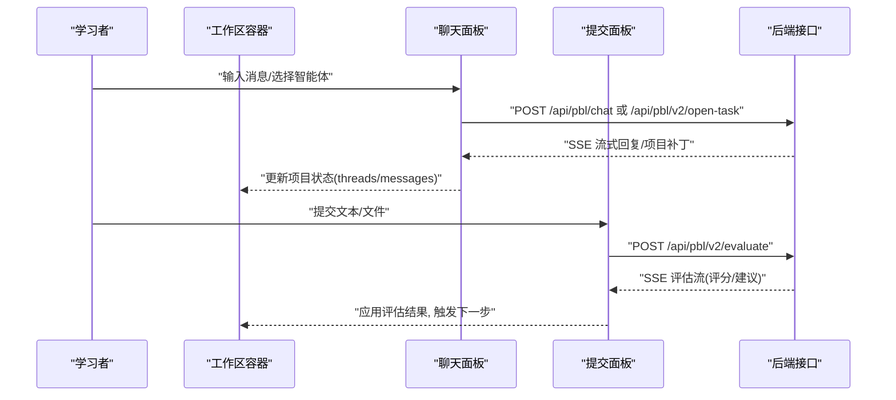
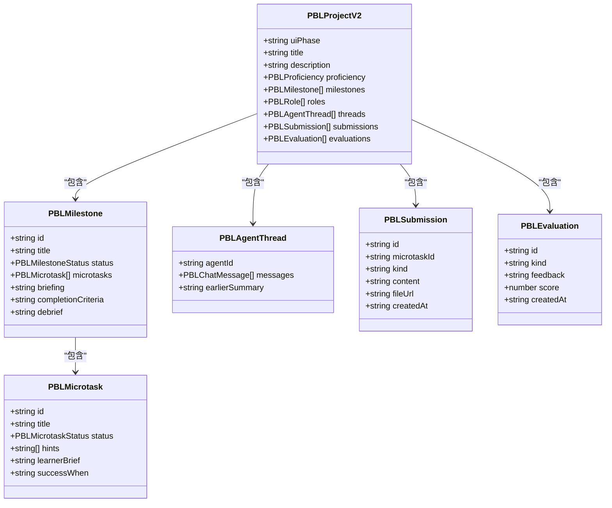

# 工作区管理

<cite>
**本文引用的文件**   
- [components/scene-renderers/pbl/v2/workspace.tsx](file://components/scene-renderers/pbl/v2/workspace.tsx)
- [components/scene-renderers/pbl/v2/sidebar.tsx](file://components/scene-renderers/pbl/v2/sidebar.tsx)
- [components/scene-renderers/pbl/v2/agent-tabs.tsx](file://components/scene-renderers/pbl/v2/agent-tabs.tsx)
- [components/scene-renderers/pbl/v2/right-panel-tabs.tsx](file://components/scene-renderers/pbl/v2/right-panel-tabs.tsx)
- [components/scene-renderers/pbl/v2/submission.tsx](file://components/scene-renderers/pbl/v2/submission.tsx)
- [components/scene-renderers/pbl/workspace.tsx](file://components/scene-renderers/pbl/workspace.tsx)
- [components/scene-renderers/pbl/issueboard-panel.tsx](file://components/scene-renderers/pbl/issueboard-panel.tsx)
- [components/scene-renderers/pbl/chat-panel.tsx](file://components/scene-renderers/pbl/chat-panel.tsx)
- [components/scene-renderers/pbl/use-pbl-chat.ts](file://components/scene-renderers/pbl/use-pbl-chat.ts)
- [lib/pbl/types.ts](file://lib/pbl/types.ts)
- [lib/pbl/v2/types.ts](file://lib/pbl/v2/types.ts)
</cite>

## 产品概述
本工作区为 PBL（项目式学习）提供沉浸式、多面板的协作与任务推进界面。v1 版本采用“左侧任务板 + 右侧聊天”的两栏布局，v2 版本升级为“三栏布局”：左侧为里程碑树与场景控制的中枢侧边栏，中间为多智能体对话与实时流式反馈的主内容区，右侧为提交与评估面板（在情景模式下可切换为“情景简报”）。工作区支持多标签页（按角色/智能体）、文件上传与代码编辑、实时 SSE 流式评估与指导、以及全局状态同步与持久化。

## 核心业务流程
- 进入工作区：顶部导航显示项目名称与进度条；用户可在 Hero ↔ Workspace 之间返回并保留进度。
- 任务推进：侧边栏展示里程碑与微任务树，完成当前微任务后触发评估或下一里程碑交接。
- 提交与评估：右侧面板支持文本粘贴与文件上传（含图片/PDF），提交后触发即时评估流，根据结果生成修订建议或自动推进。
- 情景模式：当项目包含情景配置时，右侧面板可切换“提交/简报”，并在聊天区顶部渲染情景横幅与入场动画。
- 实时协作：通过 SSE 流将 Instructor/Evaluator 的回复与项目补丁推送到前端，实时更新聊天与项目状态。

**图表来源** 
- [components/scene-renderers/pbl/v2/workspace.tsx](file://components/scene-renderers/pbl/v2/workspace.tsx)
- [components/scene-renderers/pbl/v2/submission.tsx](file://components/scene-renderers/pbl/v2/submission.tsx)
- [components/scene-renderers/pbl/use-pbl-chat.ts](file://components/scene-renderers/pbl/use-pbl-chat.ts)

**章节来源**
- [components/scene-renderers/pbl/v2/workspace.tsx](file://components/scene-renderers/pbl/v2/workspace.tsx)
- [components/scene-renderers/pbl/v2/submission.tsx](file://components/scene-renderers/pbl/v2/submission.tsx)
- [components/scene-renderers/pbl/use-pbl-chat.ts](file://components/scene-renderers/pbl/use-pbl-chat.ts)

## 功能模块清单
- 工作区容器（v2）：三栏网格布局、顶部进度条、面板宽度拖拽调整、主题变量注入。
- 侧边栏（里程碑树）：展开/折叠里程碑、微任务状态可视化、情景模式下的场景控制按钮（进入/继续/完成）。
- 聊天面板（多智能体）：按角色分标签、流式消息渲染、草稿缓存、语音转文字输入。
- 右侧面板（提交/简报）：任务描述与提示、文本/文件上传、提交历史、评估状态与错误提示、情景简报切换。
- v1 兼容模块：任务板（Issueboard）+ 聊天面板，支持问题列表、状态标记、进度统计。

**章节来源**
- [components/scene-renderers/pbl/v2/workspace.tsx](file://components/scene-renderers/pbl/v2/workspace.tsx)
- [components/scene-renderers/pbl/v2/sidebar.tsx](file://components/scene-renderers/pbl/v2/sidebar.tsx)
- [components/scene-renderers/pbl/v2/agent-tabs.tsx](file://components/scene-renderers/pbl/v2/agent-tabs.tsx)
- [components/scene-renderers/pbl/v2/right-panel-tabs.tsx](file://components/scene-renderers/pbl/v2/right-panel-tabs.tsx)
- [components/scene-renderers/pbl/workspace.tsx](file://components/scene-renderers/pbl/workspace.tsx)
- [components/scene-renderers/pbl/issueboard-panel.tsx](file://components/scene-renderers/pbl/issueboard-panel.tsx)
- [components/scene-renderers/pbl/chat-panel.tsx](file://components/scene-renderers/pbl/chat-panel.tsx)

## 数据与状态
- 项目模型（v2）：PBLProjectV2 包含里程碑（Milestone）、微任务（Microtask）、角色（Roles）、线程（Threads）、提交（Submissions）、评估（Evaluations）、参与度事件（Engagement Events）等。
- 状态流转：里程碑状态 locked → active → completed；微任务状态 todo → in_progress → completed/skipped；UI 阶段 hero → workspace → completed。
- 数据所有权：前端为 truth source（Stage Store + IndexedDB），通过 onProjectChange 向上同步；服务端无状态路由，仅处理请求并返回 SSE 流。
- 同步策略：SSE 事件（project_patch/message/evaluation）直接应用至本地项目副本，再回调 onProjectChange 触发 UI 更新。

**图表来源** 
- [lib/pbl/v2/types.ts](file://lib/pbl/v2/types.ts)

**章节来源**
- [lib/pbl/v2/types.ts](file://lib/pbl/v2/types.ts)
- [lib/pbl/types.ts](file://lib/pbl/types.ts)

## 关键约束与边界
- 非功能性需求：
  - 性能：SSE 流式处理避免阻塞 UI；大文件上传限制 5MB，图片回退 base64 限制 2MB。
  - 可用性：拖拽调整面板宽度、键盘快捷键（Enter 发送）、无障碍标签（aria-*）。
  - 兼容性：v1 Issueboard 与 v2 模型共存，渲染器根据 content.projectV2 分支。
- 依赖与集成边界：
  - 后端接口：/api/pbl/chat（v1）、/api/pbl/v2/open-task、/api/pbl/v2/evaluate、/api/pbl/v2/task/update。
  - 存储：IndexedDB 持久化 Stage Store；对象存储可选（OSS）用于文件 URL。
- 业务约束：
  - 情景模式：仅当 project.scenario 存在时启用；角色play 阶段隐藏 beat 细节，仅显示 act 概览。
  - 评估门控：任务完成需满足评分阈值或证据条件；里程碑交接需用户显式点击 Continue。

**章节来源**
- [components/scene-renderers/pbl/v2/submission.tsx](file://components/scene-renderers/pbl/v2/submission.tsx)
- [components/scene-renderers/pbl/v2/workspace.tsx](file://components/scene-renderers/pbl/v2/workspace.tsx)
- [lib/pbl/v2/types.ts](file://lib/pbl/v2/types.ts)