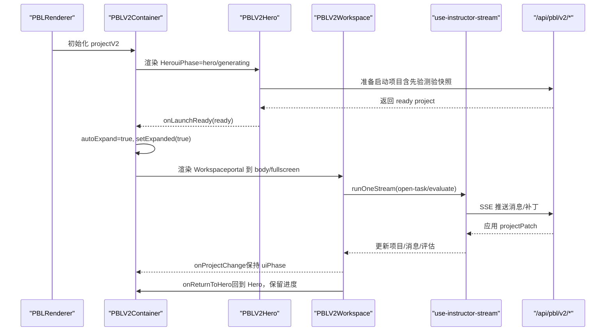
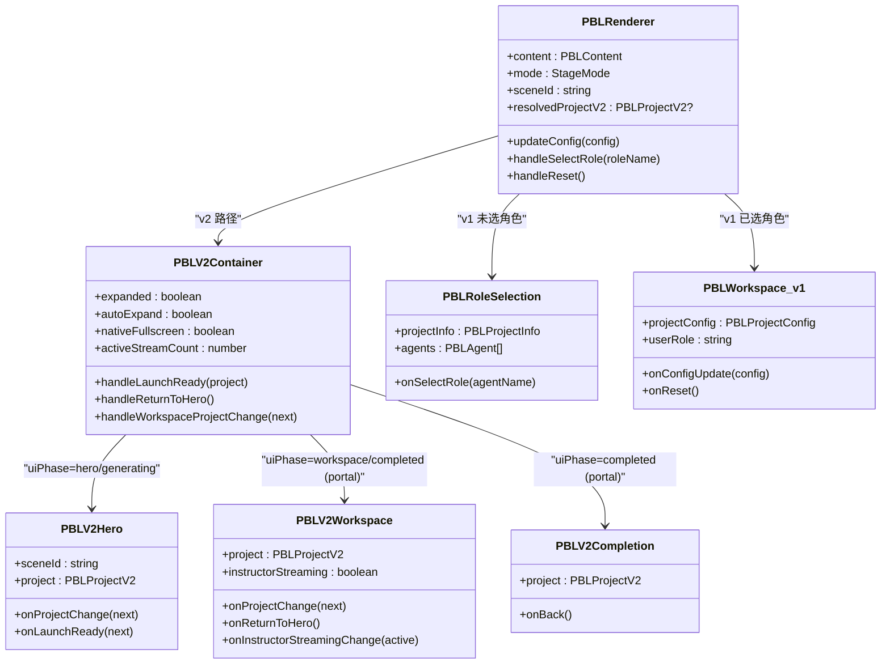

# 核心组件架构

<cite>
**本文引用的文件**   
- [pbl-renderer.tsx](file://components/scene-renderers/pbl-renderer.tsx)
- [workspace.tsx（v1）](file://components/scene-renderers/pbl/workspace.tsx)
- [role-selection.tsx](file://components/scene-renderers/pbl/role-selection.tsx)
- [workspace.tsx（v2）](file://components/scene-renderers/pbl/v2/workspace.tsx)
- [hero.tsx（v2）](file://components/scene-renderers/pbl/v2/hero.tsx)
- [completion.tsx（v2）](file://components/scene-renderers/pbl/v2/completion.tsx)
- [types.ts（v1）](file://lib/pbl/types.ts)
- [types.ts（v2）](file://lib/pbl/v2/types.ts)
- [compat.ts（兼容层）](file://lib/pbl/v2/compat.ts)
- [use-instructor-stream.ts](file://components/scene-renderers/pbl/v2/use-instructor-stream.ts)
</cite>

## 产品概述
本项目制学习（PBL）渲染子系统提供两种形态：
- v1（legacy）：基于角色选择与问题板的轻量工作区，适合旧版项目。
- v2（当前主线）：Hero → Workspace → Completion 的完整引导式流程，支持单 Instructor 流式交互、里程碑/微任务结构、评估与完成报告、全屏沉浸式体验与 Portal 机制。

PBLRenderer 作为入口，负责版本兼容性处理（legacy vs v2）、状态管理与渲染决策；PBLV2Container 管理全屏模式、Portal 挂载点与动画过渡；PBLRoleSelection 负责角色选择与智能体配置；PBLWorkspace（v1/v2）分别承载不同布局与功能模块组织。

## 核心业务流程
- 进入 PBLRenderer：根据 content 中的 projectV2 或 projectConfig 决定走 v2 还是 legacy 路径。
- v2 流程：
  - Hero：展示项目概览与“开始/继续”按钮，点击后准备 workspace 启动数据并自动展开。
  - Workspace：三列布局（侧边栏/聊天/提交面板），通过 SSE 流式推进 Instructor/评估流程，支持全屏与返回 Hero。
  - Completion：汇总最终评估与统计数据，支持回退到 Workspace。
- v1 流程：
  - Role Selection：从 agents 中筛选可选择的开发角色，选择后进入工作区。
  - Workspace：左侧 Issueboard，右侧 Chat，支持重置与指南。

**图表来源**
- [pbl-renderer.tsx:45-169](file://components/scene-renderers/pbl-renderer.tsx#L45-L169)
- [pbl-renderer.tsx:171-358](file://components/scene-renderers/pbl-renderer.tsx#L171-L358)
- [hero.tsx（v2）:102-137](file://components/scene-renderers/pbl/v2/hero.tsx#L102-L137)
- [workspace.tsx（v2）:182-278](file://components/scene-renderers/pbl/v2/workspace.tsx#L182-L278)
- [use-instructor-stream.ts:1-31](file://components/scene-renderers/pbl/v2/use-instructor-stream.ts#L1-L31)

**章节来源**
- [pbl-renderer.tsx:45-169](file://components/scene-renderers/pbl-renderer.tsx#L45-L169)
- [pbl-renderer.tsx:171-358](file://components/scene-renderers/pbl-renderer.tsx#L171-L358)
- [hero.tsx（v2）:102-137](file://components/scene-renderers/pbl/v2/hero.tsx#L102-L137)
- [workspace.tsx（v2）:182-278](file://components/scene-renderers/pbl/v2/workspace.tsx#L182-L278)
- [use-instructor-stream.ts:1-31](file://components/scene-renderers/pbl/v2/use-instructor-stream.ts#L1-L31)

## 功能模块清单
- PBLRenderer（主组件）
  - 职责：统一入口，解析 content 中的 projectV2/projectConfig，进行版本兼容转换，渲染 v2 容器或 legacy 工作区。
  - 关键点：
    - 若存在 projectV2，则走 v2 路径；否则尝试将 legacy projectConfig 升级为 projectV2。
    - 无 projectConfig 或为空时显示占位提示。
    - 未选择角色时渲染角色选择；已选择则渲染工作区。
- PBLV2Container（v2 容器）
  - 职责：管理全屏模式、Portal 宿主、动画过渡、工作区流计数与 UI 阶段切换。
  - 关键点：
    - expanded/autoExpand/nativeFullscreen 控制 web 全屏与原生全屏。
    - createPortal 将工作区/完成页渲染到 document.body 或 native fullscreen 元素。
    - activeStreamCount 计数保证后台流完成后不丢失“思考中”指示。
    - handleWorkspaceProjectChange 保护 Hero 阶段的 uiPhase，避免被后台写入覆盖。
- PBLRoleSelection（角色选择）
  - 职责：展示项目信息与可选角色卡片，过滤系统角色与非开发角色。
  - 关键点：
    - onSelectRole 更新 selectedRole 并可能注入欢迎消息（当问题板包含生成问题时）。
- PBLWorkspace（v1 工作区）
  - 职责：左侧 Issueboard（~35%），右侧 Chat（~65%），支持重启确认与指南面板。
  - 关键点：
    - usePBLChat 管理消息、加载状态与发送逻辑。
    - 重置会清空 chat 与 issueboard 状态，激活第一个问题。
- PBLV2Workspace（v2 工作区）
  - 职责：三列布局（侧边栏 ~22%，聊天 ~52%，提交/右侧面板 ~26%），支持拖拽调整宽度。
  - 关键点：
    - 场景操作（enter_scenario/continue_handover/complete_act）调用 /api/pbl/v2/task/update。
    - 任务完成流程触发 milestone/final 评估，SSE 流式推进。
    - 顶部面包屑导航返回 Hero，保留进度。
- PBLV2Hero（v2 英雄页）
  - 职责：展示项目标题、描述、学习目标、阶段/任务统计，提供“开始/继续/重置”。
  - 关键点：
    - 构建 priorQuizSnapshot 用于 proficiency 预评估。
    - prepareWorkspaceLaunchProject 生成 ready 项目并触发 autoExpand。
- PBLV2Completion（v2 完成报告）
  - 职责：汇总最终评估、统计数据、亮点与下一步建议，支持回退到 Workspace。
  - 关键点：
    - 区分标准项目与情景项目的报告视图。
    - 使用 computeCompletionStats 计算确定性指标。

**章节来源**
- [pbl-renderer.tsx:45-169](file://components/scene-renderers/pbl-renderer.tsx#L45-L169)
- [pbl-renderer.tsx:171-358](file://components/scene-renderers/pbl-renderer.tsx#L171-L358)
- [role-selection.tsx:13-63](file://components/scene-renderers/pbl/role-selection.tsx#L13-L63)
- [workspace.tsx（v1）:19-92](file://components/scene-renderers/pbl/workspace.tsx#L19-L92)
- [workspace.tsx（v2）:107-418](file://components/scene-renderers/pbl/v2/workspace.tsx#L107-L418)
- [hero.tsx（v2）:65-137](file://components/scene-renderers/pbl/v2/hero.tsx#L65-L137)
- [completion.tsx（v2）:107-199](file://components/scene-renderers/pbl/v2/completion.tsx#L107-L199)

## 数据与状态
- 核心数据模型
  - v1 类型定义：PBLProjectConfig、PBLAgent、PBLIssue、PBLChatMessage 等。
  - v2 类型定义：PBLProjectV2、PBLMilestone、PBLMicrotask、PBLRole、PBLChatMessage、PBLEvaluation、PBLEngagementEvent 等。
- 关键状态流转
  - uiPhase：'hero' | 'generating' | 'workspace' | 'completed'，由容器根据用户操作与流式结果切换。
  - instructorStreaming：计数型标志，确保多流并发时的“思考中”状态正确。
  - expanded/autoExpand/nativeFullscreen：控制全屏与动画过渡。
- 数据所有权边界
  - PBLRenderer 持有 content（stage store），通过 updateScene 同步变更。
  - PBLV2Container 维护运行时副本（structuredClone + normalizeProjectRuntime），仅当 changed 时才写回。
  - 工作区/完成页通过 onProjectChange 回调向上同步，避免直接修改父级状态。

**图表来源**
- [pbl-renderer.tsx:45-169](file://components/scene-renderers/pbl-renderer.tsx#L45-L169)
- [pbl-renderer.tsx:171-358](file://components/scene-renderers/pbl-renderer.tsx#L171-L358)
- [role-selection.tsx:13-63](file://components/scene-renderers/pbl/role-selection.tsx#L13-L63)
- [workspace.tsx（v1）:19-92](file://components/scene-renderers/pbl/workspace.tsx#L19-L92)
- [workspace.tsx（v2）:107-418](file://components/scene-renderers/pbl/v2/workspace.tsx#L107-L418)
- [hero.tsx（v2）:65-137](file://components/scene-renderers/pbl/v2/hero.tsx#L65-L137)
- [completion.tsx（v2）:107-199](file://components/scene-renderers/pbl/v2/completion.tsx#L107-L199)

**章节来源**
- [types.ts（v1）:1-80](file://lib/pbl/types.ts#L1-L80)
- [types.ts（v2）:1-800](file://lib/pbl/v2/types.ts#L1-L800)
- [pbl-renderer.tsx:45-169](file://components/scene-renderers/pbl-renderer.tsx#L45-L169)
- [pbl-renderer.tsx:171-358](file://components/scene-renderers/pbl-renderer.tsx#L171-L358)

## 关键约束与边界
- 版本兼容性
  - 若 content.projectV2 存在，优先使用 v2；否则尝试将 legacy projectConfig 升级为 projectV2。
  - 兼容层提供 projectV2ToLegacyProjectConfig 与 upgradeLegacyPBLConfigToProjectV2 双向转换。
- 全屏与 Portal
  - 工作区/完成页通过 createPortal 渲染到 document.body 或 native fullscreen 元素，避免在原生全屏下空白。
  - 监听 fullscreenchange 事件同步 fsRoot 与 nativeFullscreen。
- 动画过渡
  - 首次 Hero→Workspace 使用较慢的 expandDuration/ease，后续手动展开使用默认快速过渡。
  - 背景遮罩与 frame 位置通过 motion 动画平滑过渡。
- 流式处理
  - use-instructor-stream 封装 fetch+SSE+projectPatch 应用循环，支持 evaluator 链式调用（task→milestone→final）。
  - activeStreamCount 计数确保多流并发时状态一致。
- 状态同步策略
  - PBLRenderer 通过 useStageStore.updateScene 同步内容变更。
  - PBLV2Container 对来自工作区的 next 进行 uiPhase 保护，避免在 Hero 阶段被覆盖。
- 业务约束
  - v1 工作区不支持场景操作（enter_scenario/continue_handover/complete_act），这些仅在 v2 中可用。
  - 完成报告区分标准项目与情景项目，后者展示角色目标达成情况。

**章节来源**
- [compat.ts（兼容层）:1-300](file://lib/pbl/v2/compat.ts#L1-L300)
- [pbl-renderer.tsx:171-358](file://components/scene-renderers/pbl-renderer.tsx#L171-L358)
- [use-instructor-stream.ts:1-31](file://components/scene-renderers/pbl/v2/use-instructor-stream.ts#L1-L31)
- [workspace.tsx（v2）:143-180](file://components/scene-renderers/pbl/v2/workspace.tsx#L143-L180)
- [completion.tsx（v2）:107-199](file://components/scene-renderers/pbl/v2/completion.tsx#L107-L199)