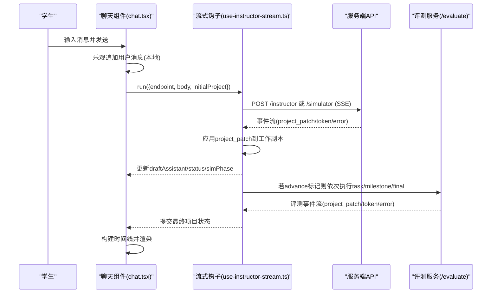
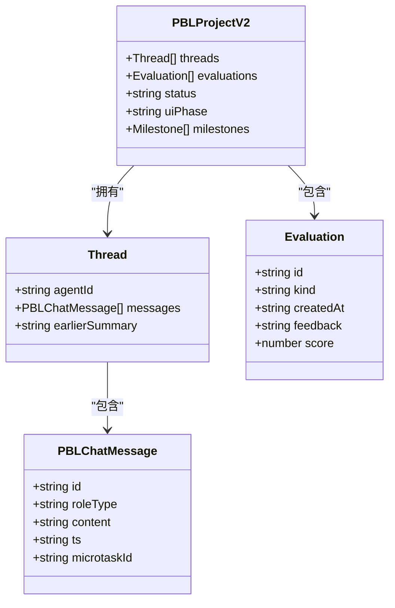
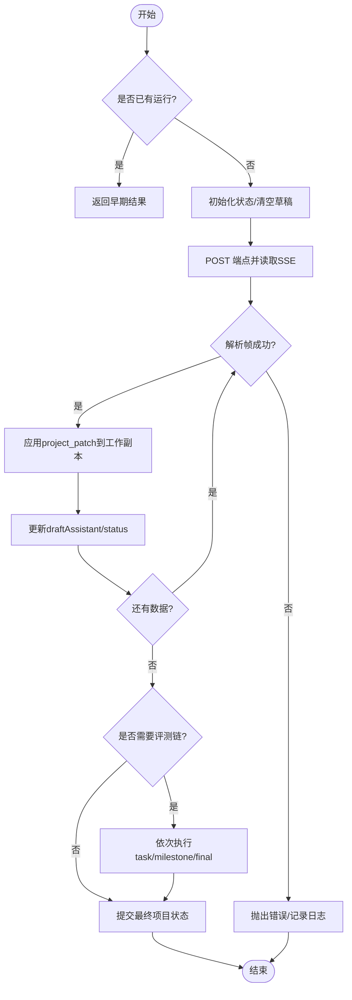

# 聊天对话系统

<cite>
**本文引用的文件**   
- [app/api/pbl/chat/route.ts](file://app/api/pbl/chat/route.ts)
- [components/scene-renderers/pbl/v2/chat.tsx](file://components/scene-renderers/pbl/v2/chat.tsx)
- [components/scene-renderers/pbl/v2/use-instructor-stream.ts](file://components/scene-renderers/pbl/v2/use-instructor-stream.ts)
- [lib/pbl/v2/agents/instructor.ts](file://lib/pbl/v2/agents/instructor.ts)
- [tests/pbl/v2/chat-timeline.test.ts](file://tests/pbl/v2/chat-timeline.test.ts)
</cite>

## 产品概述
本章节面向 PBL（基于项目的学习）场景下的多智能体聊天对话系统，聚焦于教师智能体与学生智能体的对话编排、流式处理与消息管理机制。该系统通过前端 React 组件与后端 Next.js API 协作，实现：
- 教师智能体主导的引导式对话与任务推进
- 角色扮演的“模拟器”智能体在情景阶段参与对话
- 实时思考过程与进度反馈（SSE 流式事件）
- 统一的消息时间线（消息与评测卡片交错显示）
- 可扩展的消息类型与评估链（任务/里程碑/最终评估）

该能力服务于课堂互动、任务驱动学习与即时反馈的教学场景。

**章节来源**
- [components/scene-renderers/pbl/v2/chat.tsx:1-800](file://components/scene-renderers/pbl/v2/chat.tsx#L1-L800)
- [components/scene-renderers/pbl/v2/use-instructor-stream.ts:1-411](file://components/scene-renderers/pbl/v2/use-instructor-stream.ts#L1-L411)
- [app/api/pbl/chat/route.ts:1-84](file://app/api/pbl/chat/route.ts#L1-L84)
- [lib/pbl/v2/agents/instructor.ts:882-903](file://lib/pbl/v2/agents/instructor.ts#L882-L903)

## 核心业务流程
PBL v2 聊天流程围绕“用户输入 → 流式编排 → 评测链 → 时间线渲染”展开：
- 用户在聊天面板输入消息，触发乐观追加本地消息并调用对应端点（普通项目为 /api/pbl/v2/instructor；角色扮演阶段为 /api/pbl/v2/simulator）。
- useInstructorStream 钩子负责建立 SSE 连接、解析事件、应用 project_patch 到工作副本，并在 Instructor 流结束后按顺序执行评测链（task → milestone → final）。
- 评测结果与消息按时间戳合并成统一时间线，由 chat.tsx 渲染为气泡与评测卡片。
- 对于情景阶段，角色扮演的 Simulator 线程会在完成后折叠为可折叠的历史块，保持阅读连续性。

**图表来源**
- [components/scene-renderers/pbl/v2/chat.tsx:451-610](file://components/scene-renderers/pbl/v2/chat.tsx#L451-L610)
- [components/scene-renderers/pbl/v2/use-instructor-stream.ts:126-276](file://components/scene-renderers/pbl/v2/use-instructor-stream.ts#L126-L276)
- [lib/pbl/v2/agents/instructor.ts:1758-1789](file://lib/pbl/v2/agents/instructor.ts#L1758-L1789)

**章节来源**
- [components/scene-renderers/pbl/v2/chat.tsx:481-506](file://components/scene-renderers/pbl/v2/chat.tsx#L481-L506)
- [components/scene-renderers/pbl/v2/use-instructor-stream.ts:126-276](file://components/scene-renderers/pbl/v2/use-instructor-stream.ts#L126-L276)
- [lib/pbl/v2/agents/instructor.ts:1758-1789](file://lib/pbl/v2/agents/instructor.ts#L1758-L1789)

## 功能模块清单
- 聊天界面与交互
  - 职责：展示消息时间线、流式草稿、错误提示、手递阶段提示、语音输入等。
  - 验收要点：空聊自动开场、角色扮演的历史折叠、评测卡片交错显示、滚动与自动增长输入框。
- 流式编排与评测链
  - 职责：管理单次运行锁、SSE 解析、project_patch 应用、评测链顺序执行、状态上报。
  - 验收要点：同一时刻仅一个流运行、错误可恢复（特定软错误容忍）、最终状态回写。
- 教师智能体编排
  - 职责：构建系统提示词、历史消息裁剪、setup/greeting/instructing 阶段处理、流式输出。
  - 验收要点：历史摘要与最近消息拼接、空内容兜底、token 增量推送。
- 快速问答路由（@mention）
  - 职责：接收 @question/@judge 请求，组装上下文并调用 LLM 生成回复。
  - 验收要点：必填字段校验、模型配置透传、错误日志与响应封装。

**章节来源**
- [components/scene-renderers/pbl/v2/chat.tsx:1-120](file://components/scene-renderers/pbl/v2/chat.tsx#L1-L120)
- [components/scene-renderers/pbl/v2/use-instructor-stream.ts:1-120](file://components/scene-renderers/pbl/v2/use-instructor-stream.ts#L1-L120)
- [lib/pbl/v2/agents/instructor.ts:882-903](file://lib/pbl/v2/agents/instructor.ts#L882-L903)
- [app/api/pbl/chat/route.ts:16-39](file://app/api/pbl/chat/route.ts#L16-L39)

## 数据与状态
- 消息格式定义
  - 客户端消息结构包含 id、roleType、content、ts、microtaskId 等字段，用于标识与排序。
  - 时间戳使用 ISO 字符串，保证跨端一致性与排序稳定性。
- 已读状态跟踪
  - 通过 seenMessageIdsRef 记录当前 agentId 下已渲染的消息 ID 集合，避免重复动画与重绘。
- 聊天历史数据结构
  - threads 数组按 agentId 组织，每个 thread 持有 messages 列表；scenario 阶段存在独立的 simulator 线程。
  - evaluations 数组承载任务/里程碑/最终评测，与消息按 createdAt/ts 合并排序。
- 存储策略
  - 前端采用结构化克隆的工作副本进行流式应用，最终一次性 onProjectChange 提交。
  - 运行时事件（message_created 等）附加到项目以支持回放与审计。
- 服务器同步
  - SSE 事件中的 project_patch 直接应用到工作副本，onProjectUpdated 回调推动 UI 增量更新。
  - 评测链结束后返回完整项目状态，确保一致性。

**图表来源**
- [components/scene-renderers/pbl/v2/chat.tsx:298-319](file://components/scene-renderers/pbl/v2/chat.tsx#L298-L319)
- [lib/pbl/v2/agents/instructor.ts:882-903](file://lib/pbl/v2/agents/instructor.ts#L882-L903)

**章节来源**
- [components/scene-renderers/pbl/v2/chat.tsx:298-319](file://components/scene-renderers/pbl/v2/chat.tsx#L298-L319)
- [components/scene-renderers/pbl/v2/chat.tsx:451-610](file://components/scene-renderers/pbl/v2/chat.tsx#L451-L610)
- [components/scene-renderers/pbl/v2/use-instructor-stream.ts:288-355](file://components/scene-renderers/pbl/v2/use-instructor-stream.ts#L288-L355)

## 关键约束与边界
- 流式传输与错误处理
  - 单一运行锁防止并发重复发起；错误时保留已应用的 patch 并设置 error 状态。
  - 对特定软错误（如 EMPTY_LLM_OUTPUT）在 instructor 反应流中容忍，不中断评测结果。
- 重连机制
  - 当前实现未内置自动重连；建议在外部层捕获网络异常后重试 runOneStream，并携带 startingProject 锚点。
- 消息过滤与搜索
  - 时间线构建函数 buildTimeline 提供按时间排序与类型合并；可在上层扩展过滤条件（按角色、微任务、关键词）。
- 自定义消息类型扩展
  - 通过新增 project_patch.kind 与 applyInstructorEvent 分支处理新消息类型；SSE 事件解析器需兼容新 event type。
- 性能与边界
  - 大文本输入限制最大高度；大量消息时使用 useMemo 与 diff 减少重渲染；评测卡片与消息交错渲染需控制 DOM 节点数量。

**图表来源**
- [components/scene-renderers/pbl/v2/use-instructor-stream.ts:126-276](file://components/scene-renderers/pbl/v2/use-instructor-stream.ts#L126-L276)
- [components/scene-renderers/pbl/v2/use-instructor-stream.ts:288-355](file://components/scene-renderers/pbl/v2/use-instructor-stream.ts#L288-L355)

**章节来源**
- [components/scene-renderers/pbl/v2/use-instructor-stream.ts:357-384](file://components/scene-renderers/pbl/v2/use-instructor-stream.ts#L357-L384)
- [tests/pbl/v2/chat-timeline.test.ts:43-83](file://tests/pbl/v2/chat-timeline.test.ts#L43-L83)