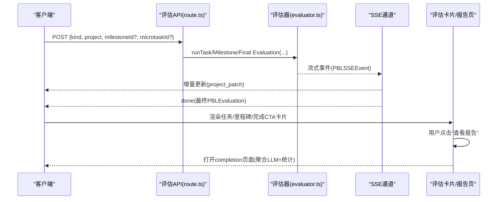
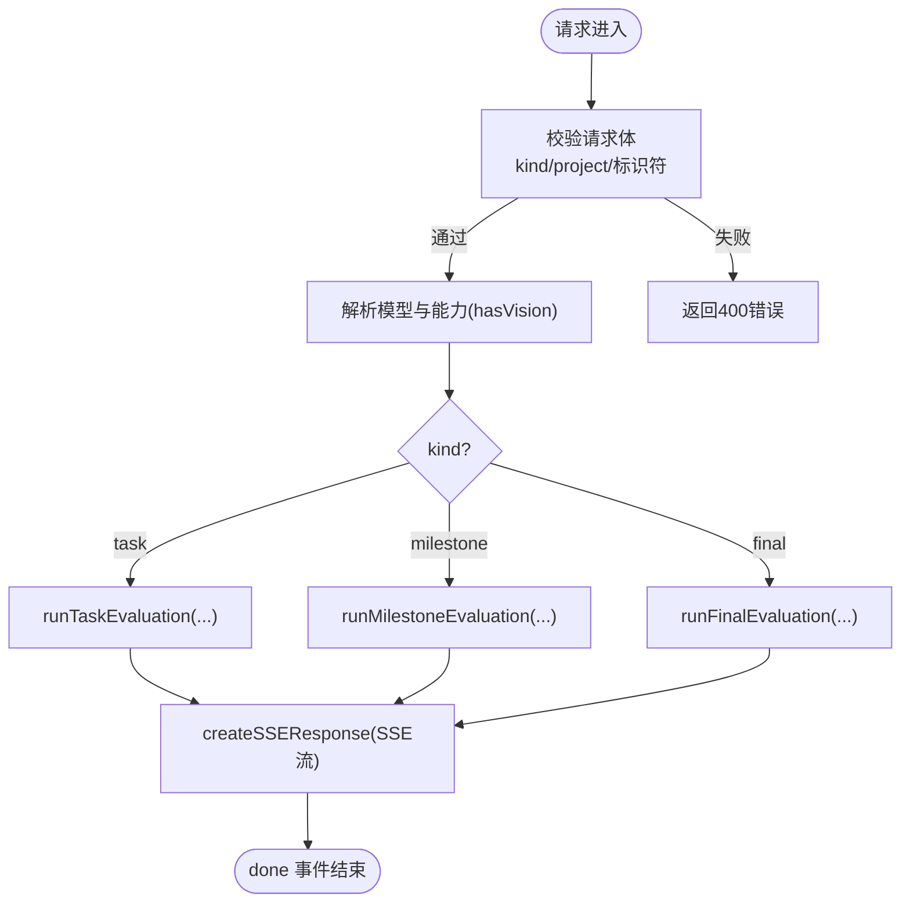
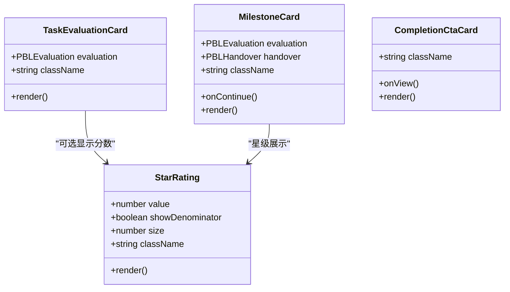
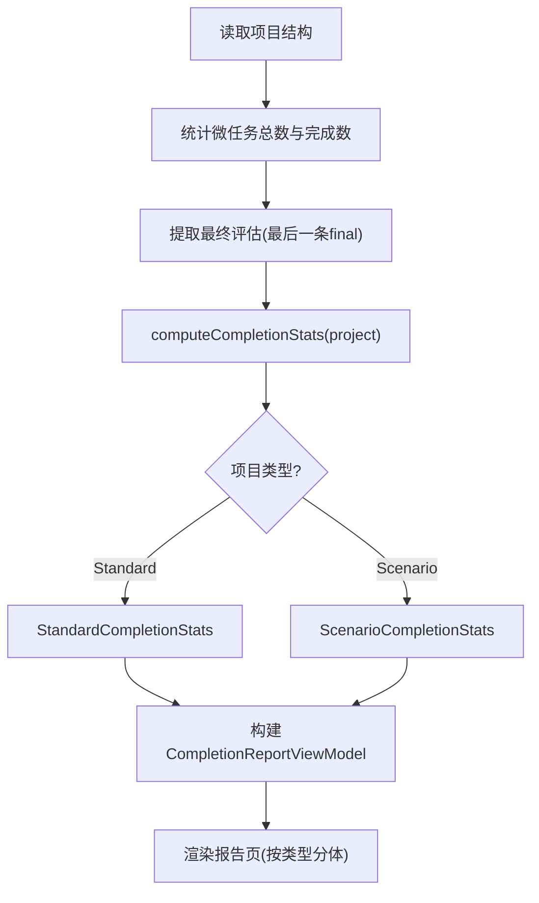

# 评估系统

<cite>
**本文引用的文件**   
- [app/api/pbl/v2/evaluate/route.ts](file://app/api/pbl/v2/evaluate/route.ts)
- [lib/pbl/v2/agents/evaluator.ts](file://lib/pbl/v2/agents/evaluator.ts)
- [components/scene-renderers/pbl/v2/eval-cards/task-evaluation-card.tsx](file://components/scene-renderers/pbl/v2/eval-cards/task-evaluation-card.tsx)
- [components/scene-renderers/pbl/v2/eval-cards/star-rating.tsx](file://components/scene-renderers/pbl/v2/eval-cards/star-rating.tsx)
- [components/scene-renderers/pbl/v2/eval-cards/milestone-card.tsx](file://components/scene-renderers/pbl/v2/eval-cards/milestone-card.tsx)
- [components/scene-renderers/pbl/v2/eval-cards/completion-cta-card.tsx](file://components/scene-renderers/pbl/v2/eval-cards/completion-cta-card.tsx)
- [components/scene-renderers/pbl/v2/completion.tsx](file://components/scene-renderers/pbl/v2/completion.tsx)
- [lib/pbl/v2/operations/completion-stats.ts](file://lib/pbl/v2/operations/completion-stats.ts)
- [lib/pbl/v2/types.ts](file://lib/pbl/v2/types.ts)
</cite>

## 产品概述
本文件面向 PBL（项目式学习）评估子系统，聚焦 v2 版本的自动评估引擎与前端评估卡片组件。其核心价值在于：
- 以 SSE 流式接口统一触发三类评估：任务级、里程碑级、最终总结级，降低客户端复杂度并复用模型解析与心跳机制。
- 通过“LLM 叙事 + 确定性统计”的双源报告，既提供可读性强的反馈，又保证可验证的指标不幻觉。
- 以轻量卡片组件呈现星级评分、里程碑交接与完成度提示，提升学习者的即时反馈体验。
- 支持按项目类型（标准知识型 / 情景演练型）差异化展示结果，便于教学场景扩展。

适用场景：课堂内实时任务评估、阶段里程碑回顾、项目结项报告生成与导出分析。

## 核心业务流程
- 触发入口：POST /api/pbl/v2/evaluate，请求体携带 project 克隆与 kind（task/milestone/final），服务端根据 kind 路由到对应评估运行器。
- 流式处理：SSE 推送 PBLSSEEvent，最终以 project_patch 事件携带新的 PBLEvaluation，并以 done 结束。
- 前端渲染：
  - 任务评估：在聊天气泡中显示 TaskEvaluationCard（优势/改进/可选分数）。
  - 里程碑评估：显示 MilestoneCard（叙述、学到的要点、表现建议、继续按钮或最终项目提示）。
  - 最终评估：完成后出现 CompletionCtaCard，点击进入独立 completion 页面。
- 报告页：CompletionReportViewModel 聚合 LLM 总结与 computeCompletionStats 生成的确定性统计，按项目类型分体渲染。

图表来源 
- [app/api/pbl/v2/evaluate/route.ts:1-132](file://app/api/pbl/v2/evaluate/route.ts#L1-L132)
- [lib/pbl/v2/agents/evaluator.ts](file://lib/pbl/v2/agents/evaluator.ts)
- [components/scene-renderers/pbl/v2/completion.tsx:79-98](file://components/scene-renderers/pbl/v2/completion.tsx#L79-L98)

章节来源
- [app/api/pbl/v2/evaluate/route.ts:1-132](file://app/api/pbl/v2/evaluate/route.ts#L1-L132)
- [components/scene-renderers/pbl/v2/completion.tsx:79-98](file://components/scene-renderers/pbl/v2/completion.tsx#L79-L98)

## 功能模块清单
- 评估入口与路由
  - 职责：统一接收评估请求、参数校验、模型解析、SSE 封装与心跳。
  - 验收要点：三种 kind 均能正确路由；缺失字段返回明确错误；SSE 正常结束于 done。
- 评估运行器（后端）
  - 职责：按 kind 调用具体评估逻辑，产出 PBLEvaluation 并流式推送。
  - 验收要点：任务/里程碑/最终评估均可稳定输出结构化字段（strengths/improvements/stars/whatYouBuilt/whatYouLearned/whatsNext 等）。
- 评估卡片组件（前端）
  - 任务评估卡片：在聊天气泡内展示 strengths/improvements 与可选 score/100。
  - 星级评分：支持 0.5 步进、半星渲染与可选分母显示。
  - 里程碑卡片：整合叙述、学到要点、表现建议与交接 CTA，末里程碑隐藏继续按钮。
  - 完成 CTA 卡片：最终评估完成后提示查看报告。
- 完成报告页
  - 职责：聚合 LLM 总结与确定性统计，按项目类型分别渲染。
  - 验收要点：指标一致可复现；无数据时回退文案友好；场景模式包含目标覆盖与角色名单。

章节来源
- [components/scene-renderers/pbl/v2/eval-cards/task-evaluation-card.tsx:1-105](file://components/scene-renderers/pbl/v2/eval-cards/task-evaluation-card.tsx#L1-L105)
- [components/scene-renderers/pbl/v2/eval-cards/star-rating.tsx:1-74](file://components/scene-renderers/pbl/v2/eval-cards/star-rating.tsx#L1-L74)
- [components/scene-renderers/pbl/v2/eval-cards/milestone-card.tsx:1-196](file://components/scene-renderers/pbl/v2/eval-cards/milestone-card.tsx#L1-L196)
- [components/scene-renderers/pbl/v2/eval-cards/completion-cta-card.tsx:1-62](file://components/scene-renderers/pbl/v2/eval-cards/completion-cta-card.tsx#L1-L62)
- [components/scene-renderers/pbl/v2/completion.tsx:1-730](file://components/scene-renderers/pbl/v2/completion.tsx#L1-L730)

## 数据与状态
- 核心数据模型
  - PBLEvaluation：评估结果对象，包含 kind、strengths、improvements、stars、score（任务）、whatYouBuilt、whatYouLearned、whatsNext、feedback 等。
  - PBLProjectV2：项目结构，含 milestones、microtasks、evaluations 等，用于统计与报告构建。
  - PBLHandover：里程碑交接信息，控制“继续到下一阶段”的状态与锁定。
- 关键状态流转
  - 任务评估：提交后触发，生成 strengths/improvements 与可选 score，嵌入聊天气泡。
  - 里程碑评估：生成叙述与 learned/performance，附带 handover 控制下一步解锁。
  - 最终评估：汇总 whatYouBuilt/whatYouLearned/whatsNext/stars，并在聊天中插入完成 CTA。
- 数据所有权边界
  - 服务端：负责评估计算与 project_patch 事件；客户端持有 project 克隆并应用补丁。
  - 前端：负责渲染、交互与本地统计展示（如 completion 页的确定性统计）。

章节来源
- [lib/pbl/v2/types.ts](file://lib/pbl/v2/types.ts)
- [components/scene-renderers/pbl/v2/eval-cards/milestone-card.tsx:177-180](file://components/scene-renderers/pbl/v2/eval-cards/milestone-card.tsx#L177-L180)
- [components/scene-renderers/pbl/v2/completion.tsx:79-98](file://components/scene-renderers/pbl/v2/completion.tsx#L79-L98)

## 关键约束与边界
- 非功能性需求
  - SSE 超时：评估接口设置最大时长（例如 300s），需考虑重试与降级策略。
  - 模型能力：是否具备视觉能力影响评估输入（hasVision）。
  - 幂等性：project 为客户端克隆，服务端仅做增量 patch，避免重复计算副作用。
- 依赖与集成边界
  - 模型解析：统一通过 resolveModelFromRequest 获取 model/thinkingConfig/modelInfo。
  - SSE 封装：createSSEResponse 统一处理心跳与信号中断。
- 业务约束
  - 任务评估不显示星级，仅展示分数 chip（可选）。
  - 里程碑卡片仅在 consumed=false 时允许继续，否则禁用按钮。
  - 最终里程碑不显示“继续”按钮，改为“项目即将完成”提示。

章节来源
- [app/api/pbl/v2/evaluate/route.ts:43-90](file://app/api/pbl/v2/evaluate/route.ts#L43-L90)
- [components/scene-renderers/pbl/v2/eval-cards/task-evaluation-card.tsx:37-45](file://components/scene-renderers/pbl/v2/eval-cards/task-evaluation-card.tsx#L37-L45)
- [components/scene-renderers/pbl/v2/eval-cards/milestone-card.tsx:132-172](file://components/scene-renderers/pbl/v2/eval-cards/milestone-card.tsx#L132-L172)

## 自动评估引擎工作原理
- 入口与路由
  - 单一 POST 端点根据 kind 分支到 runTaskEvaluation/runMilestoneEvaluation/runFinalEvaluation。
  - 请求体校验严格，缺失关键字段返回 400 错误。
- 模型与能力
  - 通过 resolveModelFromRequest 解析模型与思考配置，检测 vision 能力以决定输入格式。
- 流式输出
  - createSSEResponse 将评估运行器包装为 SSE 流，支持 signal 取消与心跳。
- 评估产物
  - 任务：strengths、improvements、可选 score。
  - 里程碑：feedback（经 stripEvaluationTail 清理）、strengths（learned）、improvements[0]（performance）、stars。
  - 最终：whatYouBuilt、whatYouLearned、whatsNext、stars、feedback。

图表来源 
- [app/api/pbl/v2/evaluate/route.ts:57-131](file://app/api/pbl/v2/evaluate/route.ts#L57-L131)
- [lib/pbl/v2/agents/evaluator.ts](file://lib/pbl/v2/agents/evaluator.ts)

章节来源
- [app/api/pbl/v2/evaluate/route.ts:57-131](file://app/api/pbl/v2/evaluate/route.ts#L57-L131)
- [lib/pbl/v2/agents/evaluator.ts](file://lib/pbl/v2/agents/evaluator.ts)

## 评估卡片组件设计
- 任务评估卡片
  - 位置：聊天气泡内，紧凑布局。
  - 内容：strengths（绿色强调）、improvements（琥珀色强调）、可选 score/100 芯片。
  - 行为：若无内容则不渲染。
- 星级评分
  - 规则：0–5，步长 0.5，半星通过 CSS 渐变实现。
  - 变体：plain（里程碑反思）与 showDenominator（任务评估分数）。
- 里程碑卡片
  - 结构：头部（阶段标签+星级）、叙述段落、学到的要点、表现建议、交接底部。
  - 行为：consumed=false 时启用“继续到下一阶段”，否则禁用；末里程碑显示“项目即将完成”。
- 完成 CTA 卡片
  - 时机：最终评估流结束后出现。
  - 作用：引导用户回到聊天记录后再打开报告页，尊重用户浏览习惯。

图表来源 
- [components/scene-renderers/pbl/v2/eval-cards/star-rating.tsx:1-74](file://components/scene-renderers/pbl/v2/eval-cards/star-rating.tsx#L1-L74)
- [components/scene-renderers/pbl/v2/eval-cards/task-evaluation-card.tsx:1-105](file://components/scene-renderers/pbl/v2/eval-cards/task-evaluation-card.tsx#L1-L105)
- [components/scene-renderers/pbl/v2/eval-cards/milestone-card.tsx:1-196](file://components/scene-renderers/pbl/v2/eval-cards/milestone-card.tsx#L1-L196)
- [components/scene-renderers/pbl/v2/eval-cards/completion-cta-card.tsx:1-62](file://components/scene-renderers/pbl/v2/eval-cards/completion-cta-card.tsx#L1-L62)

章节来源
- [components/scene-renderers/pbl/v2/eval-cards/task-evaluation-card.tsx:1-105](file://components/scene-renderers/pbl/v2/eval-cards/task-evaluation-card.tsx#L1-L105)
- [components/scene-renderers/pbl/v2/eval-cards/star-rating.tsx:1-74](file://components/scene-renderers/pbl/v2/eval-cards/star-rating.tsx#L1-L74)
- [components/scene-renderers/pbl/v2/eval-cards/milestone-card.tsx:1-196](file://components/scene-renderers/pbl/v2/eval-cards/milestone-card.tsx#L1-L196)
- [components/scene-renderers/pbl/v2/eval-cards/completion-cta-card.tsx:1-62](file://components/scene-renderers/pbl/v2/eval-cards/completion-cta-card.tsx#L1-L62)

## 评估数据的计算逻辑与统计方法
- 完成报告视图模型
  - buildCompletionReportViewModel：汇总 totalMicrotasks、completedMicrotasks、stageCount、finalEvaluation 与 stats。
  - cleanCompletionIntro：清理 feedback 中的模板与尾部指令，保留自然语言介绍。
- 确定性统计
  - computeCompletionStats：基于 microtask 参与缓存计算概念解锁、独立性率、错误恢复、总回合数、总时长、提交次数等。
  - 区分两种项目类型：
    - StandardCompletionStats：知识型项目，展示概念、回合、范围、时长、提交与亮点。
    - ScenarioCompletionStats：情景演练型，展示目标覆盖率、幕次、回合、时长与角色名单。
- 指标含义
  - 正确率/完成时间/参与度：由 microtask 状态与计时缓存推导，确保可验证且不幻觉。
  - 亮点：独立性、韧性（错误恢复）、完成度等。

图表来源 
- [components/scene-renderers/pbl/v2/completion.tsx:79-98](file://components/scene-renderers/pbl/v2/completion.tsx#L79-L98)
- [lib/pbl/v2/operations/completion-stats.ts](file://lib/pbl/v2/operations/completion-stats.ts)

章节来源
- [components/scene-renderers/pbl/v2/completion.tsx:79-98](file://components/scene-renderers/pbl/v2/completion.tsx#L79-L98)
- [lib/pbl/v2/operations/completion-stats.ts](file://lib/pbl/v2/operations/completion-stats.ts)

## 评估结果的可视化展示与用户反馈
- 聊天内即时反馈
  - 任务评估卡片：优势/改进列表与可选分数芯片。
  - 里程碑卡片：叙述、学到的要点、表现建议与交接按钮。
  - 完成 CTA 卡片：最终评估完成后提示查看报告。
- 报告页可视化
  - 英雄区：标题、摘要、星级（若有）。
  - 指标卡：概念解锁、回合数、范围、时长、提交次数（标准型）；目标覆盖率、幕次数、回合数、时长（情景型）。
  - LLM 总结：whatYouBuilt/whatYouLearned/whatsNext。
  - 阶段回顾/目标覆盖：按阶段或幕次展开细节。
  - 亮点：独立性、韧性、完成度等。
- 用户反馈机制
  - 里程碑交接按钮受 consumed 状态保护，防止重复进入。
  - 最终里程碑隐藏继续按钮，改为“项目即将完成”提示，避免误导。

章节来源
- [components/scene-renderers/pbl/v2/eval-cards/task-evaluation-card.tsx:1-105](file://components/scene-renderers/pbl/v2/eval-cards/task-evaluation-card.tsx#L1-L105)
- [components/scene-renderers/pbl/v2/eval-cards/milestone-card.tsx:1-196](file://components/scene-renderers/pbl/v2/eval-cards/milestone-card.tsx#L1-L196)
- [components/scene-renderers/pbl/v2/eval-cards/completion-cta-card.tsx:1-62](file://components/scene-renderers/pbl/v2/eval-cards/completion-cta-card.tsx#L1-L62)
- [components/scene-renderers/pbl/v2/completion.tsx:1-730](file://components/scene-renderers/pbl/v2/completion.tsx#L1-L730)

## 评估规则的自定义配置与扩展方法
- 规则定义位置
  - 评估提示词位于 prompts 目录（如 evaluator-task.md、evaluator-milestone.md、evaluator-final.md、evaluator-final-scenario.md），用于指导 LLM 输出结构与语气。
- 扩展方式
  - 新增评估维度：在 evaluator 运行器中扩展输出字段，并在前端卡片/报告中适配渲染。
  - 调整评分策略：修改星级归一化与分数映射逻辑（如 normalizeStars、score/100 芯片）。
  - 项目类型扩展：在 completion-stats 中增加新类型的统计维度与渲染分支。
- 注意事项
  - 保持 SSE 契约不变（PBLSSEEvent 与 project_patch/done 事件）。
  - 前端组件对空值与异常值的防御性渲染（如无 strengths/improvements 时不显示）。

章节来源
- [lib/pbl/v2/prompts/evaluator-task.md](file://lib/pbl/v2/prompts/evaluator-task.md)
- [lib/pbl/v2/prompts/evaluator-milestone.md](file://lib/pbl/v2/prompts/evaluator-milestone.md)
- [lib/pbl/v2/prompts/evaluator-final.md](file://lib/pbl/v2/prompts/evaluator-final.md)
- [lib/pbl/v2/prompts/evaluator-final-scenario.md](file://lib/pbl/v2/prompts/evaluator-final-scenario.md)
- [components/scene-renderers/pbl/v2/eval-cards/star-rating.tsx:1-74](file://components/scene-renderers/pbl/v2/eval-cards/star-rating.tsx#L1-L74)

## 评估数据的导出与分析
- 数据来源
  - PBLEvaluation：LLM 生成的总结与建议。
  - CompletionStats：确定性统计（概念解锁、回合、时长、提交、目标覆盖等）。
- 导出建议
  - 将 project.evaluations 与 computeCompletionStats 的结果序列化为 JSON，供外部分析工具消费。
  - 针对情景型项目，额外导出 goalCoverage 与 characterNames。
- 分析维度
  - 参与度：总回合数、提交次数、时长分布。
  - 掌握度：概念解锁、目标覆盖率、核心概念理解质量。
  - 韧性：错误恢复次数与里程碑级别的错误密度。

章节来源
- [components/scene-renderers/pbl/v2/completion.tsx:79-98](file://components/scene-renderers/pbl/v2/completion.tsx#L79-L98)
- [lib/pbl/v2/operations/completion-stats.ts](file://lib/pbl/v2/operations/completion-stats.ts)

## 调试工具与性能优化建议
- 调试工具
  - SSE 日志：在 evaluate route 中记录模型解析与评估运行器的错误信息，便于定位问题。
  - 前端控制台：观察 project_patch 事件与 done 事件顺序，确认状态一致性。
  - 报告页回退：当 LLM 输出为空时，使用 noDataFallback 与 stripEvaluationTail 清理无效文本。
- 性能优化
  - SSE 心跳：确保 createSSEResponse 的心跳间隔合理，避免连接超时。
  - 大对象传输：project 克隆体积较大时，考虑压缩或分页推送 project_patch。
  - 渲染优化：评估卡片按需渲染（无内容不渲染），减少 DOM 节点数量。
  - 模型调用：复用 thinkingConfig 与模型能力判断，减少不必要的推理开销。

章节来源
- [app/api/pbl/v2/evaluate/route.ts:43-90](file://app/api/pbl/v2/evaluate/route.ts#L43-L90)
- [components/scene-renderers/pbl/v2/eval-cards/task-evaluation-card.tsx:37-45](file://components/scene-renderers/pbl/v2/eval-cards/task-evaluation-card.tsx#L37-L45)
- [components/scene-renderers/pbl/v2/completion.tsx:100-105](file://components/scene-renderers/pbl/v2/completion.tsx#L100-L105)