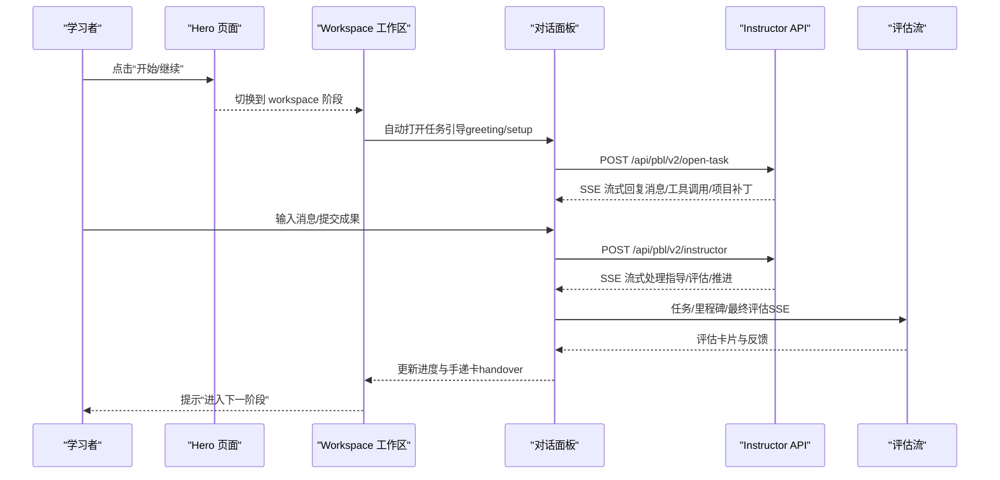
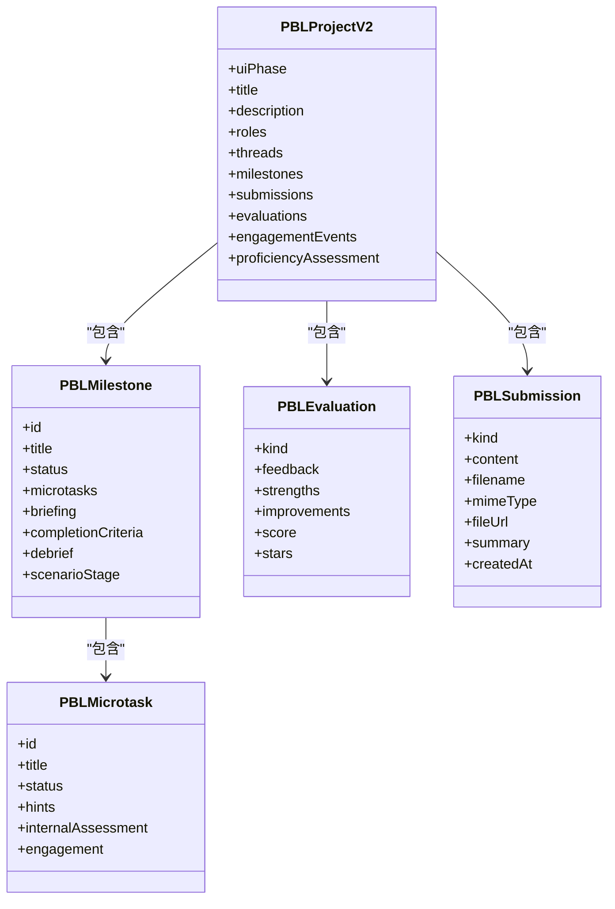
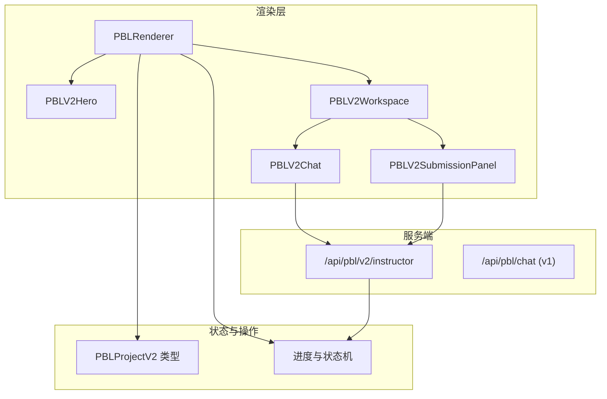
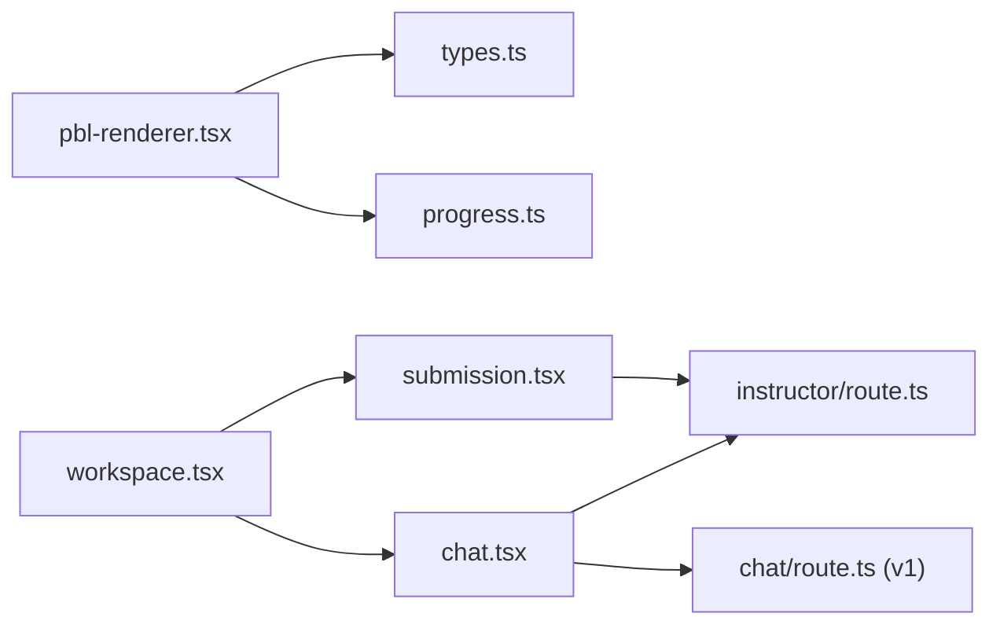

# 项目制学习渲染器

<cite>
**本文引用的文件**   
- [pbl-renderer.tsx](file://components/scene-renderers/pbl-renderer.tsx)
- [hero.tsx](file://components/scene-renderers/pbl/v2/hero.tsx)
- [workspace.tsx](file://components/scene-renderers/pbl/v2/workspace.tsx)
- [chat.tsx](file://components/scene-renderers/pbl/v2/chat.tsx)
- [submission.tsx](file://components/scene-renderers/pbl/v2/submission.tsx)
- [types.ts](file://lib/pbl/v2/types.ts)
- [progress.ts](file://lib/pbl/v2/operations/progress.ts)
- [instructor/route.ts](file://app/api/pbl/v2/instructor/route.ts)
- [chat/route.ts](file://app/api/pbl/chat/route.ts)
</cite>

## 产品概述
本项目制学习（PBL）渲染器用于在 OpenMAIC 课堂场景中承载“基于项目的教学”体验。它通过单一 Instructor 智能体驱动 Hero → Workspace → Completion 的三阶段流程，支持多角色协作（Instructor + 可选场景角色）、任务驱动学习与评估闭环。渲染器同时兼容 v1 旧版 PBL 配置与 v2 新架构，提供无缝迁移与降级能力。

核心价值：
- 以里程碑与微任务组织学习路径，配合即时对话、提交与评估形成完整学习闭环
- 支持沉浸式角色扮演场景（prep → roleplay ×N → wrapup），强化情境化学习
- 统一的流式交互（SSE）与状态机，保证跨组件、跨全屏切换的状态一致性
- 内置自适应能力等级与参与度指标，为教师提供过程性反馈

适用场景：
- 项目式课程、案例研讨、角色扮演模拟、综合实践课等需要“做中学”的教学模式

**章节来源**
- [pbl-renderer.tsx:45-168](file://components/scene-renderers/pbl-renderer.tsx#L45-L168)
- [types.ts:767-800](file://lib/pbl/v2/types.ts#L767-L800)

## 核心业务流程
PBL v2 的核心流程由 UI 状态机驱动，贯穿 Hero、Workspace、Completion 三个阶段，并通过 Instructor 流式对话推进任务与评估。

关键链路：
- Hero：展示项目概览、学习目标与参与角色；点击“开始/继续”进入 Workspace
- Workspace：三栏布局（左侧里程碑导航、中间对话、右侧提交面板）；完成微任务后触发评估或开启下一任务
- Completion：最终评估结果与回顾报告入口

**图表来源**
- [pbl-renderer.tsx:307-328](file://components/scene-renderers/pbl-renderer.tsx#L307-L328)
- [chat.tsx:370-411](file://components/scene-renderers/pbl/v2/chat.tsx#L370-L411)
- [instructor/route.ts:38-76](file://app/api/pbl/v2/instructor/route.ts#L38-L76)

**章节来源**
- [pbl-renderer.tsx:113-168](file://components/scene-renderers/pbl-renderer.tsx#L113-L168)
- [hero.tsx:102-137](file://components/scene-renderers/pbl/v2/hero.tsx#L102-L137)
- [workspace.tsx:143-180](file://components/scene-renderers/pbl/v2/workspace.tsx#L143-L180)
- [chat.tsx:481-506](file://components/scene-renderers/pbl/v2/chat.tsx#L481-L506)

## 功能模块清单
- 渲染容器与阶段路由
  - 负责 v1/v2 兼容、全屏包裹、状态提升与生命周期管理
- Hero 页面
  - 项目概览、学习目标、角色介绍、开始/继续/重置
- Workspace 工作区
  - 三栏布局、里程碑导航、Agent 标签页、可调整宽度
- 对话面板（Instructor/Simulator）
  - 流式消息、草稿态、错误横幅、任务就绪打字机效果
- 提交面板
  - 文本粘贴/文件上传、历史查看、即时评估、修订建议
- 类型与操作库
  - 项目模型、里程碑/微任务状态机、参与度事件、评估结构

验收要点：
- 阶段切换流畅且状态持久化（IndexedDB）
- 流式交互无阻塞，错误可恢复
- 提交与评估联动，手递卡正确出现与消费
- 全屏/窗口缩放适配良好

**章节来源**
- [pbl-renderer.tsx:171-359](file://components/scene-renderers/pbl-renderer.tsx#L171-L359)
- [workspace.tsx:107-180](file://components/scene-renderers/pbl/v2/workspace.tsx#L107-L180)
- [chat.tsx:125-180](file://components/scene-renderers/pbl/v2/chat.tsx#L125-L180)
- [submission.tsx:290-360](file://components/scene-renderers/pbl/v2/submission.tsx#L290-L360)

## 数据与状态
PBL v2 使用统一的项目模型与运行时事件记录，确保前端与后端一致。

核心数据模型：
- PBLProjectV2：包含 uiPhase、roles、threads、milestones、submissions、evaluations、engagementEvents、proficiencyAssessment 等
- PBLMilestone/PBLMicrotask：里程碑与微任务状态机（locked/active/completed；todo/in_progress/completed/skipped）
- PBLEvaluation：任务/里程碑/最终评估，含分数、星级、结构化反馈
- PBLSubmission：文本/文件/链接提交，支持预览与下载
- 参与度事件：按时间追加的事件账本，滚动缓存避免膨胀

关键状态流转：
- normalizeProjectRuntime：加载时修复线程、活跃里程碑与当前任务
- advanceMicrotask：推进微任务，必要时完成里程碑并生成 handover
- continueAfterHandover：消费手递卡，激活下一里程碑首个任务
- resetProjectProgress：重置学习进度，保留结构设计

**图表来源**
- [types.ts:767-800](file://lib/pbl/v2/types.ts#L767-L800)
- [types.ts:197-243](file://lib/pbl/v2/types.ts#L197-L243)
- [types.ts:319-339](file://lib/pbl/v2/types.ts#L319-L339)
- [types.ts:371-399](file://lib/pbl/v2/types.ts#L371-L399)

**章节来源**
- [progress.ts:75-159](file://lib/pbl/v2/operations/progress.ts#L75-L159)
- [progress.ts:463-636](file://lib/pbl/v2/operations/progress.ts#L463-L636)
- [progress.ts:760-800](file://lib/pbl/v2/operations/progress.ts#L760-L800)
- [types.ts:767-800](file://lib/pbl/v2/types.ts#L767-L800)

## 关键约束与边界
- 流式交互锁：提交与评估期间禁用重复提交，防止状态交错
- 全屏与 Portal：Workspace 层通过 portal 到 body，跟随原生全屏元素，避免内容空白
- 数据所有权：v2 为客户端真值，提交直接写入 project 克隆并通过 onProjectChange 发布，服务端无状态
- 场景骨架修复：roleplay 场景缺失 stage 标记时自动修复，保证渲染一致性
- 性能与大数据：参与度事件采用环形缓冲，长会话不致内存膨胀；图片 base64 回退有大小上限

非功能性需求：
- 响应式布局与缩放适配（Hero 自适应缩放）
- 错误可恢复（网络失败、SSE 解析异常）
- 国际化与语言指令（project.language 与用户界面语言同步）

业务约束：
- 角色选择仅 v1 旧版使用；v2 固定 Instructor 单智能体
- 场景角色仅在 project.scenario 存在时生效
- 手递卡必须由学习者主动点击“继续”才能推进

**章节来源**
- [pbl-renderer.tsx:388-536](file://components/scene-renderers/pbl-renderer.tsx#L388-L536)
- [submission.tsx:107-116](file://components/scene-renderers/pbl/v2/submission.tsx#L107-L116)
- [progress.ts:328-417](file://lib/pbl/v2/operations/progress.ts#L328-L417)
- [hero.tsx:74-85](file://components/scene-renderers/pbl/v2/hero.tsx#L74-L85)

## 架构总览

**图表来源**
- [pbl-renderer.tsx:113-168](file://components/scene-renderers/pbl-renderer.tsx#L113-L168)
- [workspace.tsx:107-180](file://components/scene-renderers/pbl/v2/workspace.tsx#L107-L180)
- [chat.tsx:125-180](file://components/scene-renderers/pbl/v2/chat.tsx#L125-L180)
- [submission.tsx:290-360](file://components/scene-renderers/pbl/v2/submission.tsx#L290-L360)
- [instructor/route.ts:38-76](file://app/api/pbl/v2/instructor/route.ts#L38-L76)
- [chat/route.ts:25-83](file://app/api/pbl/chat/route.ts#L25-L83)

## 详细组件分析

### PBLRenderer 与 v2 容器
职责：
- 根据 content.projectV2 或 legacy projectConfig 决定渲染分支
- 管理全屏包裹层、Portal 宿主、展开/收起动画与背景锁定
- 提升 activeStreamCount 以维持跨组件重挂载的“思考中”指示

关键点：
- 首次 Hero 启动延迟展开（autoExpand），后续手动展开走默认动效
- 返回 Hero 时保持所有进度，仅改变 uiPhase
- 监听原生全屏变化，动态调整 portal 宿主

**章节来源**
- [pbl-renderer.tsx:171-359](file://components/scene-renderers/pbl-renderer.tsx#L171-L359)
- [pbl-renderer.tsx:388-536](file://components/scene-renderers/pbl-renderer.tsx#L388-L536)

### Hero 页面
职责：
- 展示项目标题、描述、学习目标（gains）、阶段/任务计数与角色信息
- 支持开始/继续/重置，并在开始前构建 priorQuizResults 快照

关键点：
- 语言字段与界面语言同步（project.language）
- 场景项目显示 prep → roleplay ×N → wrapup 的流程卡片

**章节来源**
- [hero.tsx:65-137](file://components/scene-renderers/pbl/v2/hero.tsx#L65-L137)
- [hero.tsx:148-160](file://components/scene-renderers/pbl/v2/hero.tsx#L148-L160)

### Workspace 工作区
职责：
- 三栏布局（侧边栏/对话/提交），支持拖拽调整宽度
- 场景控制（enter_scenario/continue_handover/complete_act）与任务完成流程
- 外部流（evaluation/opener）与内部流（instructor）的统一显示

关键点：
- 场景按钮在任意生成进行中被禁用，防止竞态
- 顶部进度条基于里程碑内微任务位置计算点位置

**章节来源**
- [workspace.tsx:107-180](file://components/scene-renderers/pbl/v2/workspace.tsx#L107-L180)
- [workspace.tsx:229-278](file://components/scene-renderers/pbl/v2/workspace.tsx#L229-L278)
- [workspace.tsx:540-558](file://components/scene-renderers/pbl/v2/workspace.tsx#L540-L558)

### 对话面板（Instructor/Simulator）
职责：
- 维护当前 Agent 线程（Instructor 或 Simulator），自动开场问候
- 合并消息与评估时间线，支持打字机效果与错误横幅
- 角色扮演阶段切换线程与角色头像

关键点：
- 使用 useInstructorStream 管理 SSE 流与草稿态
- 任务就绪消息触发打字机动画，完成后延迟清除
- 场景阶段 opener 独立于聊天，保证路径无关

**章节来源**
- [chat.tsx:125-180](file://components/scene-renderers/pbl/v2/chat.tsx#L125-L180)
- [chat.tsx:370-411](file://components/scene-renderers/pbl/v2/chat.tsx#L370-L411)
- [chat.tsx:481-506](file://components/scene-renderers/pbl/v2/chat.tsx#L481-L506)

### 提交面板与评估
职责：
- 当前任务描述与提示，文本/文件提交，历史记录查看
- 即时任务评估（SSE），通过后标记任务完成就绪，否则给出修订建议
- 提交锁机制防止并发冲突

关键点：
- 文件大小限制（5MB），图片 base64 回退上限（2MB）
- 评估流结束后追加指导消息与证据记录
- 非视觉模型需文本说明以避免无效评分

**章节来源**
- [submission.tsx:290-360](file://components/scene-renderers/pbl/v2/submission.tsx#L290-L360)
- [submission.tsx:404-511](file://components/scene-renderers/pbl/v2/submission.tsx#L404-L511)
- [submission.tsx:127-137](file://components/scene-renderers/pbl/v2/submission.tsx#L127-L137)

## 依赖分析
- 渲染层依赖 lib/pbl/v2/types.ts 定义的数据模型与 operations/progress.ts 的状态机
- 对话与评估通过 /api/pbl/v2/instructor 与 /api/pbl/chat（v1）进行流式通信
- Workspace 与 Chat 共享 instructorStreaming 标志，确保跨重挂载的一致性

**图表来源**
- [pbl-renderer.tsx:113-168](file://components/scene-renderers/pbl-renderer.tsx#L113-L168)
- [workspace.tsx:107-180](file://components/scene-renderers/pbl/v2/workspace.tsx#L107-L180)
- [chat.tsx:125-180](file://components/scene-renderers/pbl/v2/chat.tsx#L125-L180)
- [submission.tsx:290-360](file://components/scene-renderers/pbl/v2/submission.tsx#L290-L360)
- [instructor/route.ts:38-76](file://app/api/pbl/v2/instructor/route.ts#L38-L76)
- [chat/route.ts:25-83](file://app/api/pbl/chat/route.ts#L25-L83)

**章节来源**
- [types.ts:767-800](file://lib/pbl/v2/types.ts#L767-L800)
- [progress.ts:75-159](file://lib/pbl/v2/operations/progress.ts#L75-L159)

## 性能考虑
- 参与度事件环形缓冲：避免长会话导致项目 JSON 膨胀
- 图片 base64 回退上限：防止 IndexedDB 过大
- 全屏与动画优化：仅在 toggle/autoExpand 时启用过渡，其余帧率敏感场景使用 requestAnimationFrame 脏检查
- 流式处理：SSE 增量应用 project_patch，减少全量刷新

[本节为通用性能建议，不直接分析具体文件]

## 故障排查指南
常见问题：
- 对话无响应：检查 instructorStreaming 标志是否被其他实例占用；确认 SSE 连接正常
- 提交被锁定：确认无正在进行的评估或流式回复；查看 isSubmitLockedDuringStream 条件
- 场景阶段错乱：检查 normalizeScenario 是否修复了缺失的 scenarioStage
- 全屏空白：确认 portal 宿主跟随 document.fullscreenElement

定位方法：
- 查看 chat.tsx 的错误横幅与 console.error 输出
- 检查 progress.ts 中的状态变更事件与 normalized 结果
- 验证 types.ts 数据结构是否符合预期

**章节来源**
- [chat.tsx:642-652](file://components/scene-renderers/pbl/v2/chat.tsx#L642-L652)
- [submission.tsx:107-116](file://components/scene-renderers/pbl/v2/submission.tsx#L107-L116)
- [progress.ts:328-417](file://lib/pbl/v2/operations/progress.ts#L328-L417)

## 结论
PBL 渲染器通过清晰的阶段划分、统一的数据模型与流式交互，构建了完整的“教—学—评”闭环。v2 架构在兼容性、可扩展性与性能方面均做了充分设计，适合复杂教学场景的落地。建议在扩展新功能时优先复用现有状态机与事件体系，确保前后端一致性与可观测性。

[本节为总结性内容，不直接分析具体文件]