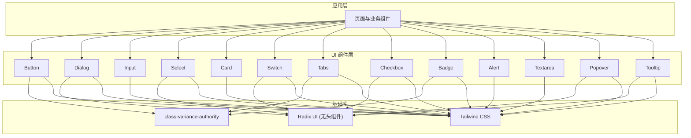
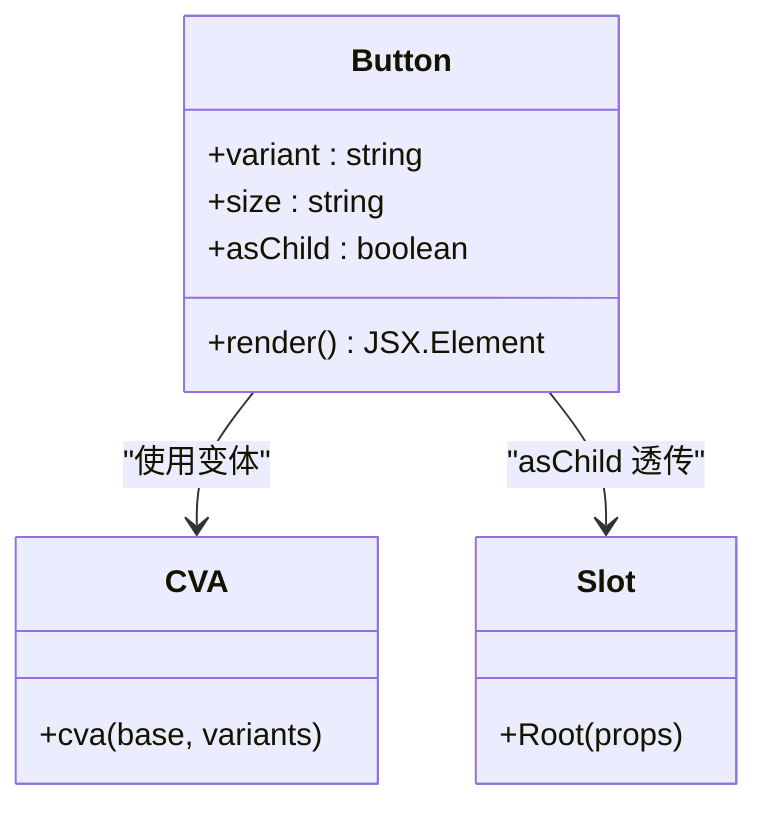
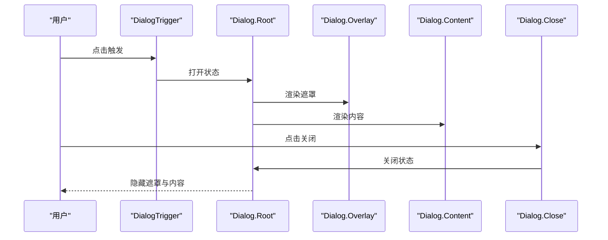
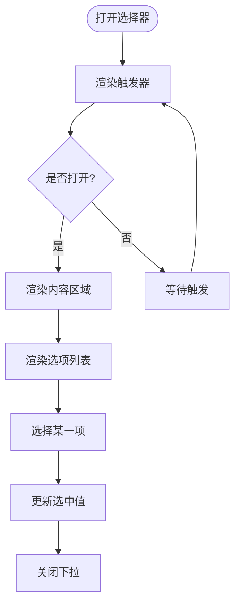
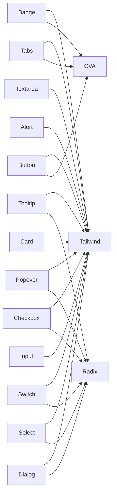

# 基础 UI 组件

<cite>
**本文引用的文件**   
- [components/ui/button.tsx](file://components/ui/button.tsx)
- [components/ui/dialog.tsx](file://components/ui/dialog.tsx)
- [components/ui/input.tsx](file://components/ui/input.tsx)
- [components/ui/select.tsx](file://components/ui/select.tsx)
- [components/ui/card.tsx](file://components/ui/card.tsx)
- [components/ui/switch.tsx](file://components/ui/switch.tsx)
- [components/ui/tabs.tsx](file://components/ui/tabs.tsx)
- [components/ui/checkbox.tsx](file://components/ui/checkbox.tsx)
- [components/ui/badge.tsx](file://components/ui/badge.tsx)
- [components/ui/alert.tsx](file://components/ui/alert.tsx)
- [components/ui/textarea.tsx](file://components/ui/textarea.tsx)
- [components/ui/popover.tsx](file://components/ui/popover.tsx)
- [components/ui/tooltip.tsx](file://components/ui/tooltip.tsx)
- [app/globals.css](file://app/globals.css)
</cite>

## 产品概述
OpenMAIC 的基础 UI 组件层基于 shadcn/ui 与 Radix UI 构建，提供高可定制、无障碍友好的原子化组件。这些组件以 Tailwind CSS 为核心样式方案，通过 class-variance-authority（CVA）实现变体系统，结合 Radix 的无头组件能力，确保在 Next.js + React 19 环境下具备一致的交互体验、主题能力与跨浏览器兼容性。

## 核心业务流程
- 用户触发：按钮、输入框、选择器、开关等基础控件作为入口，驱动表单或状态变更。
- 弹窗流程：对话框（Dialog）承载确认、设置与引导流程，配合遮罩与焦点管理保证可访问性。
- 信息组织：卡片（Card）、标签（Badge）、提示（Tooltip）、气泡（Popover）用于信息分层与上下文提示。
- 导航与分组：选项卡（Tabs）组织多视图内容；下拉选择（Select）提供结构化选项。
- 反馈与校验：告警（Alert）与输入校验状态（aria-invalid）统一呈现错误与成功反馈。

## 功能模块清单
- Button（按钮）
  - 职责：通用操作入口，支持多种变体与尺寸，可与图标组合。
  - 属性：variant（default/outline/secondary/ghost/destructive/link）、size（default/xs/sm/lg/icon/icon-xs/icon-sm/icon-lg）、asChild（透传为其他元素）。
  - 事件：标准 button 事件（onClick/onFocus/onBlur 等），可通过 asChild 透传给目标元素。
  - 样式：使用 CVA 定义变体与尺寸，data-slot/data-variant/data-size 便于定位与覆盖。
  - 响应式：默认适配移动端触控尺寸，图标大小随 size 变化。
  - 无障碍：focus-visible 环、禁用态、语义化按钮。
  - 动画：transition-all 过渡，hover/focus 状态切换。
  - 参考路径：[components/ui/button.tsx:7-42](file://components/ui/button.tsx#L7-L42)、[components/ui/button.tsx:44-65](file://components/ui/button.tsx#L44-L65)

- Dialog（对话框）
  - 职责：模态窗口，包含标题、描述、头部、底部与关闭按钮。
  - 子组件：Dialog、DialogTrigger、DialogPortal、DialogClose、DialogOverlay、DialogContent、DialogHeader、DialogFooter、DialogTitle、DialogDescription。
  - 属性：showCloseButton（是否显示右上角关闭按钮）、position/align（Radix 原生对齐与定位）。
  - 事件：打开/关闭回调由 Radix 提供，支持键盘 ESC 关闭与焦点锁定。
  - 样式：数据状态 data-open/data-closed 控制淡入/缩放动画，z-index 层级固定。
  - 无障碍：自动焦点管理、屏幕阅读器文本（sr-only）、ARIA 属性。
  - 动画：fade-in/out、zoom-in/out、slide-in-from-*。
  - 参考路径：[components/ui/dialog.tsx:10-12](file://components/ui/dialog.tsx#L10-L12)、[components/ui/dialog.tsx:42-73](file://components/ui/dialog.tsx#L42-L73)

- Input（输入框）
  - 职责：单行文本输入，支持 placeholder、禁用态、校验态。
  - 属性：type、className、以及所有原生 input 属性。
  - 事件：onChange/onFocus/onBlur 等原生事件。
  - 样式：边框、聚焦环、无效态（aria-invalid）颜色与阴影。
  - 无障碍：label 关联建议、placeholder 辅助说明。
  - 参考路径：[components/ui/input.tsx:5-16](file://components/ui/input.tsx#L5-L16)

- Select（选择器）
  - 职责：下拉选择，支持分组、分隔线、滚动按钮、占位符。
  - 子组件：Select、SelectGroup、SelectValue、SelectTrigger、SelectContent、SelectLabel、SelectItem、SelectSeparator、SelectScrollUpButton、SelectScrollDownButton。
  - 属性：position（item-aligned/popper）、align（center/left/right）、size（sm/default）。
  - 事件：值变更由 Radix 管理，支持键盘导航与搜索。
  - 样式：数据状态控制动画与位置，viewport 自适应触发器宽高。
  - 无障碍：ARIA 列表、选中项指示、禁用态。
  - 动画：fade、zoom、slide-in-from-*。
  - 参考路径：[components/ui/select.tsx:27-51](file://components/ui/select.tsx#L27-L51)、[components/ui/select.tsx:53-88](file://components/ui/select.tsx#L53-L88)

- Card（卡片）
  - 职责：信息容器，支持头部、内容、动作区、底部。
  - 子组件：Card、CardHeader、CardTitle、CardDescription、CardAction、CardContent、CardFooter。
  - 属性：size（default/sm），影响内边距与字号。
  - 样式：圆角、阴影、图片首尾圆角处理、网格布局。
  - 参考路径：[components/ui/card.tsx:5-21](file://components/ui/card.tsx#L5-L21)、[components/ui/card.tsx:23-34](file://components/ui/card.tsx#L23-L34)

- Switch（开关）
  - 职责：布尔值切换控件。
  - 属性：checked/onChange、ref、className。
  - 样式：轨道与滑块，checked/unchecked 状态切换，禁用态。
  - 无障碍：ARIA 开关语义、键盘空格切换。
  - 动画：translate-x 滑动效果。
  - 参考路径：[components/ui/switch.tsx:8-26](file://components/ui/switch.tsx#L8-L26)

- Tabs（选项卡）
  - 职责：多面板内容切换，支持水平/垂直方向与 line/default 变体。
  - 子组件：Tabs、TabsList、TabsTrigger、TabsContent。
  - 属性：orientation（horizontal/vertical）、variant（default/line）。
  - 样式：激活态下划线/背景切换，focus-visible 环。
  - 无障碍：ARIA tablist/tab/tabpanel 语义。
  - 参考路径：[components/ui/tabs.tsx:9-22](file://components/ui/tabs.tsx#L9-L22)、[components/ui/tabs.tsx:39-52](file://components/ui/tabs.tsx#L39-L52)

- Checkbox（复选框）
  - 职责：多选勾选控件。
  - 属性：checked/onChange、ref、className。
  - 样式：选中态填充色与对勾图标。
  - 无障碍：ARIA 复选框语义、键盘空格切换。
  - 参考路径：[components/ui/checkbox.tsx:9-25](file://components/ui/checkbox.tsx#L9-L25)

- Badge（标签）
  - 职责：轻量状态标记，支持多种变体与图标插槽。
  - 属性：variant（default/secondary/destructive/outline/ghost/link）、asChild。
  - 样式：CVA 变体、聚焦环、无效态。
  - 参考路径：[components/ui/badge.tsx:7-25](file://components/ui/badge.tsx#L7-L25)、[components/ui/badge.tsx:27-43](file://components/ui/badge.tsx#L27-L43)

- Alert（告警）
  - 职责：消息提示，支持默认与破坏性两种变体。
  - 子组件：Alert、AlertTitle、AlertDescription、AlertAction。
  - 属性：variant（default/destructive）。
  - 样式：网格布局、图标与文字排版、右侧操作区。
  - 无障碍：role="alert"。
  - 参考路径：[components/ui/alert.tsx:6-20](file://components/ui/alert.tsx#L6-L20)、[components/ui/alert.tsx:22-35](file://components/ui/alert.tsx#L22-L35)

- Textarea（多行文本）
  - 职责：多行文本输入，支持自适应高度与校验态。
  - 属性：className、以及所有原生 textarea 属性。
  - 样式：边框、聚焦环、无效态、禁用态。
  - 参考路径：[components/ui/textarea.tsx:5-16](file://components/ui/textarea.tsx#L5-L16)

- Popover（气泡）
  - 职责：浮层内容展示，常用于工具栏与详情预览。
  - 子组件：Popover、PopoverTrigger、PopoverAnchor、PopoverContent、PopoverClose。
  - 属性：align、sideOffset。
  - 样式：淡入/缩放动画、箭头定位。
  - 无障碍：ARIA 弹出层语义。
  - 参考路径：[components/ui/popover.tsx:16-32](file://components/ui/popover.tsx#L16-L32)

- Tooltip（提示）
  - 职责：悬停或聚焦时显示简短说明。
  - 子组件：TooltipProvider、Tooltip、TooltipTrigger、TooltipContent。
  - 属性：delayDuration、sideOffset。
  - 样式：淡入/缩放动画、箭头。
  - 无障碍：ARIA 提示语义。
  - 参考路径：[components/ui/tooltip.tsx:8-19](file://components/ui/tooltip.tsx#L8-L19)、[components/ui/tooltip.tsx:33-55](file://components/ui/tooltip.tsx#L33-L55)

## 数据与状态
- 主题变量：全局颜色、圆角、阴影等通过 CSS 变量集中管理，支持明暗主题切换。
- 数据绑定：各组件遵循受控/非受控模式，优先使用受控 props（如 checked/value）与 onChange。
- 状态流转：Dialog/Select/Popover/Tooltip 等依赖 Radix 内部状态，外部通过 open/selected 等属性控制。
- 数据所有权：UI 组件仅负责展示与交互，业务数据由上层状态管理（Zustand/React State）持有。

## 关键约束与边界
- 依赖边界：基于 Radix 无头组件与 Tailwind CSS，避免直接修改底层 DOM 结构。
- 样式覆盖：通过 data-slot 与 className 扩展，不建议覆盖 Radix 内部类名。
- 无障碍：必须保留 ARIA 语义与键盘交互，避免自定义焦点管理冲突。
- 性能：避免在高频渲染路径中创建新对象，合理使用 memo/useMemo。
- 兼容性：遵循现代浏览器特性，必要时降级处理（如 prefers-reduced-motion）。

## 架构总览

**图表来源** 
- [components/ui/button.tsx:7-42](file://components/ui/button.tsx#L7-L42)
- [components/ui/dialog.tsx:10-12](file://components/ui/dialog.tsx#L10-L12)
- [components/ui/select.tsx:27-51](file://components/ui/select.tsx#L27-L51)
- [components/ui/tabs.tsx:9-22](file://components/ui/tabs.tsx#L9-L22)
- [components/ui/switch.tsx:8-26](file://components/ui/switch.tsx#L8-L26)
- [components/ui/checkbox.tsx:9-25](file://components/ui/checkbox.tsx#L9-L25)
- [components/ui/badge.tsx:7-25](file://components/ui/badge.tsx#L7-L25)
- [components/ui/alert.tsx:6-20](file://components/ui/alert.tsx#L6-L20)
- [components/ui/popover.tsx:16-32](file://components/ui/popover.tsx#L16-L32)
- [components/ui/tooltip.tsx:8-19](file://components/ui/tooltip.tsx#L8-L19)

## 详细组件分析

### Button 组件
- 设计要点：CVA 变体系统，asChild 透传，data-slot 定位。
- 复杂度：O(1) 渲染，样式计算基于 CVA 缓存。
- 依赖链：Button → CVA → Tailwind；asChild → Radix Slot。
- 优化点：避免重复创建 variant/size 配置，复用 cn 合并类名。
- 错误处理：disabled 状态禁用交互，aria-invalid 用于表单校验。
- 参考路径：[components/ui/button.tsx:7-42](file://components/ui/button.tsx#L7-L42)、[components/ui/button.tsx:44-65](file://components/ui/button.tsx#L44-L65)

**图表来源** 
- [components/ui/button.tsx:7-42](file://components/ui/button.tsx#L7-L42)
- [components/ui/button.tsx:44-65](file://components/ui/button.tsx#L44-L65)

**章节来源**
- [components/ui/button.tsx:7-42](file://components/ui/button.tsx#L7-L42)
- [components/ui/button.tsx:44-65](file://components/ui/button.tsx#L44-L65)

### Dialog 组件
- 设计要点：Portal 挂载、Overlay 遮罩、Content 居中与动画。
- 复杂度：O(1) 渲染，动画由 CSS 类驱动。
- 依赖链：Dialog → Radix Dialog.* → Portal/Overlay/Content。
- 优化点：避免在 Content 中频繁重排，使用固定尺寸与 transform。
- 错误处理：ESC 关闭、点击遮罩关闭、焦点锁定。
- 参考路径：[components/ui/dialog.tsx:10-12](file://components/ui/dialog.tsx#L10-L12)、[components/ui/dialog.tsx:42-73](file://components/ui/dialog.tsx#L42-L73)

**图表来源** 
- [components/ui/dialog.tsx:10-12](file://components/ui/dialog.tsx#L10-L12)
- [components/ui/dialog.tsx:42-73](file://components/ui/dialog.tsx#L42-L73)

**章节来源**
- [components/ui/dialog.tsx:10-12](file://components/ui/dialog.tsx#L10-L12)
- [components/ui/dialog.tsx:42-73](file://components/ui/dialog.tsx#L42-L73)

### Select 组件
- 设计要点：分组、分隔线、滚动按钮、占位符、对齐与定位。
- 复杂度：O(n) 渲染选项，支持虚拟滚动（Radix Viewport）。
- 依赖链：Select → Radix Select.* → Portal/Viewport。
- 优化点：大量选项时使用虚拟化，避免一次性渲染。
- 错误处理：禁用项、无效态、键盘导航。
- 参考路径：[components/ui/select.tsx:27-51](file://components/ui/select.tsx#L27-L51)、[components/ui/select.tsx:53-88](file://components/ui/select.tsx#L53-L88)

**图表来源** 
- [components/ui/select.tsx:27-51](file://components/ui/select.tsx#L27-L51)
- [components/ui/select.tsx:53-88](file://components/ui/select.tsx#L53-L88)

**章节来源**
- [components/ui/select.tsx:27-51](file://components/ui/select.tsx#L27-L51)
- [components/ui/select.tsx:53-88](file://components/ui/select.tsx#L53-L88)

### Tabs 组件
- 设计要点：水平/垂直方向、line/default 变体、激活态下划线。
- 复杂度：O(1) 渲染，切换内容按需加载。
- 依赖链：Tabs → Radix Tabs.*。
- 优化点：懒加载 TabContent，减少初始渲染压力。
- 错误处理：禁用 Tab、键盘左右切换。
- 参考路径：[components/ui/tabs.tsx:9-22](file://components/ui/tabs.tsx#L9-L22)、[components/ui/tabs.tsx:39-52](file://components/ui/tabs.tsx#L39-L52)

**章节来源**
- [components/ui/tabs.tsx:9-22](file://components/ui/tabs.tsx#L9-L22)
- [components/ui/tabs.tsx:39-52](file://components/ui/tabs.tsx#L39-L52)

### Switch/Checkbox 组件
- 设计要点：布尔状态切换，受控/非受控模式。
- 复杂度：O(1) 渲染，状态切换动画。
- 依赖链：Switch/Checkbox → Radix.*。
- 优化点：避免不必要的重渲染，使用 memo 包裹。
- 错误处理：禁用态、键盘空格切换。
- 参考路径：[components/ui/switch.tsx:8-26](file://components/ui/switch.tsx#L8-L26)、[components/ui/checkbox.tsx:9-25](file://components/ui/checkbox.tsx#L9-L25)

**章节来源**
- [components/ui/switch.tsx:8-26](file://components/ui/switch.tsx#L8-L26)
- [components/ui/checkbox.tsx:9-25](file://components/ui/checkbox.tsx#L9-L25)

### Badge/Alert 组件
- 设计要点：轻量状态标记与消息提示，支持图标与动作区。
- 复杂度：O(1) 渲染。
- 依赖链：Badge/Alert → CVA/Tailwind。
- 优化点：避免复杂嵌套，保持扁平结构。
- 错误处理：destructive 变体用于错误提示。
- 参考路径：[components/ui/badge.tsx:7-25](file://components/ui/badge.tsx#L7-L25)、[components/ui/alert.tsx:6-20](file://components/ui/alert.tsx#L6-L20)

**章节来源**
- [components/ui/badge.tsx:7-25](file://components/ui/badge.tsx#L7-L25)
- [components/ui/alert.tsx:6-20](file://components/ui/alert.tsx#L6-L20)

### Popover/Tooltip 组件
- 设计要点：浮层内容展示，箭头定位与动画。
- 复杂度：O(1) 渲染，延迟显示（Tooltip）。
- 依赖链：Popover/Tooltip → Radix.* → Portal。
- 优化点：避免频繁重定位，使用 requestAnimationFrame。
- 错误处理：边界检测与自动翻转。
- 参考路径：[components/ui/popover.tsx:16-32](file://components/ui/popover.tsx#L16-L32)、[components/ui/tooltip.tsx:33-55](file://components/ui/tooltip.tsx#L33-L55)

**章节来源**
- [components/ui/popover.tsx:16-32](file://components/ui/popover.tsx#L16-L32)
- [components/ui/tooltip.tsx:33-55](file://components/ui/tooltip.tsx#L33-L55)

## 依赖分析
- 组件耦合：UI 组件之间低耦合，通过 props 传递数据与事件。
- 外部依赖：Radix（无头组件）、CVA（变体系统）、Tailwind（样式）。
- 循环依赖：无直接循环导入，组件间通过命名导出解耦。
- 集成点：全局样式变量（globals.css）提供主题与动画基础。

**图表来源** 
- [components/ui/button.tsx:7-42](file://components/ui/button.tsx#L7-L42)
- [components/ui/dialog.tsx:10-12](file://components/ui/dialog.tsx#L10-L12)
- [components/ui/select.tsx:27-51](file://components/ui/select.tsx#L27-L51)
- [components/ui/tabs.tsx:9-22](file://components/ui/tabs.tsx#L9-L22)
- [components/ui/switch.tsx:8-26](file://components/ui/switch.tsx#L8-L26)
- [components/ui/checkbox.tsx:9-25](file://components/ui/checkbox.tsx#L9-L25)
- [components/ui/badge.tsx:7-25](file://components/ui/badge.tsx#L7-L25)
- [components/ui/alert.tsx:6-20](file://components/ui/alert.tsx#L6-L20)
- [components/ui/popover.tsx:16-32](file://components/ui/popover.tsx#L16-L32)
- [components/ui/tooltip.tsx:8-19](file://components/ui/tooltip.tsx#L8-L19)

**章节来源**
- [components/ui/button.tsx:7-42](file://components/ui/button.tsx#L7-L42)
- [components/ui/dialog.tsx:10-12](file://components/ui/dialog.tsx#L10-L12)
- [components/ui/select.tsx:27-51](file://components/ui/select.tsx#L27-L51)
- [components/ui/tabs.tsx:9-22](file://components/ui/tabs.tsx#L9-L22)
- [components/ui/switch.tsx:8-26](file://components/ui/switch.tsx#L8-L26)
- [components/ui/checkbox.tsx:9-25](file://components/ui/checkbox.tsx#L9-L25)
- [components/ui/badge.tsx:7-25](file://components/ui/badge.tsx#L7-L25)
- [components/ui/alert.tsx:6-20](file://components/ui/alert.tsx#L6-L20)
- [components/ui/popover.tsx:16-32](file://components/ui/popover.tsx#L16-L32)
- [components/ui/tooltip.tsx:8-19](file://components/ui/tooltip.tsx#L8-L19)

## 性能考虑
- 渲染优化：避免在高频组件中创建新对象，使用 useMemo/useCallback 缓存函数与值。
- 样式优化：利用 Tailwind 预编译类，减少运行时样式计算。
- 动画优化：使用 CSS 动画与 transform，避免 JS 驱动动画。
- 内存优化：及时清理事件监听与定时器，避免闭包引用导致泄漏。
- 无障碍优化：尊重 prefers-reduced-motion，减少动画对敏感用户的影响。

## 故障排查指南
- 样式未生效：检查 data-slot 是否正确，确认 Tailwind 扫描路径包含组件目录。
- 动画不播放：确认 CSS 动画类是否存在，检查浏览器兼容性。
- 无障碍问题：验证 ARIA 属性与键盘交互，使用屏幕阅读器测试。
- 主题不一致：检查 CSS 变量定义，确保明暗主题切换正确。
- 参考路径：[app/globals.css:17-58](file://app/globals.css#L17-L58)、[app/globals.css:60-127](file://app/globals.css#L60-L127)

**章节来源**
- [app/globals.css:17-58](file://app/globals.css#L17-L58)
- [app/globals.css:60-127](file://app/globals.css#L60-L127)

## 结论
OpenMAIC 的基础 UI 组件层以 shadcn/ui 与 Radix UI 为核心，结合 Tailwind CSS 与 CVA 变体系统，提供了高可定制、无障碍友好、跨浏览器兼容的原子化组件。通过统一的样式变量与数据状态管理，确保了主题一致性与交互一致性。在实际使用中，建议遵循受控模式、保留 ARIA 语义、合理使用动画与性能优化技巧，以获得最佳的用户体验。