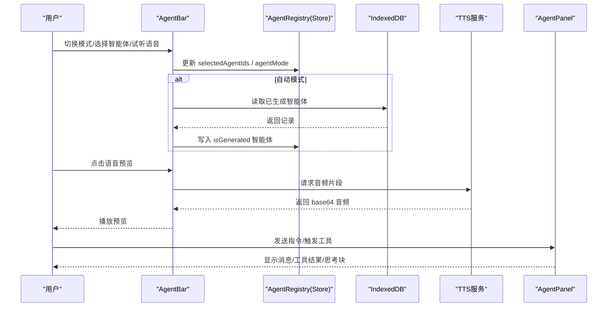
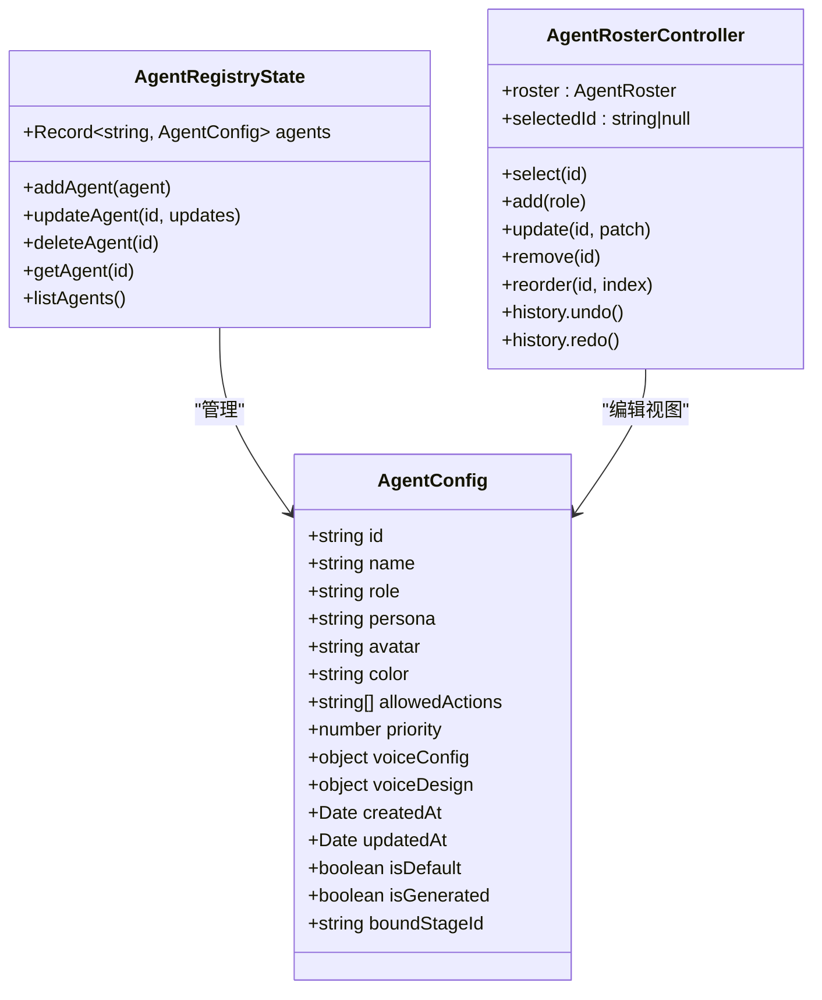
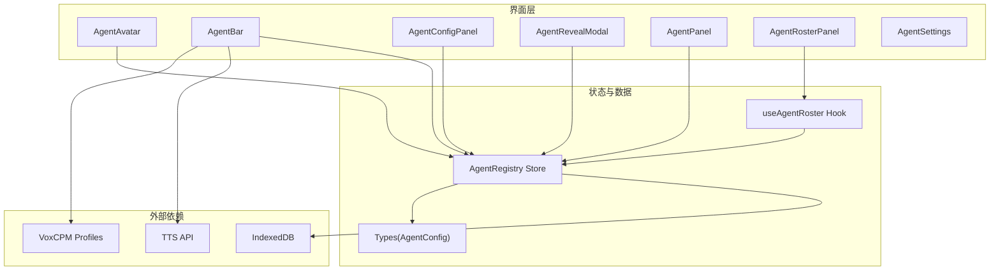
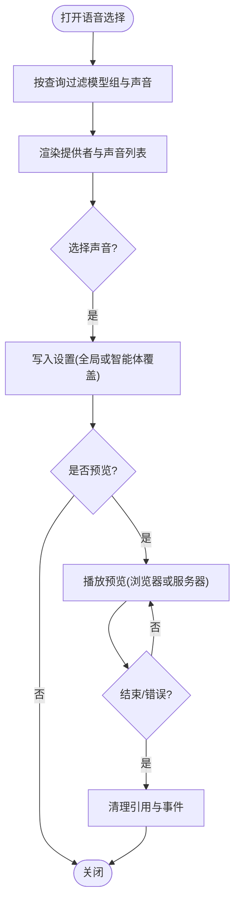
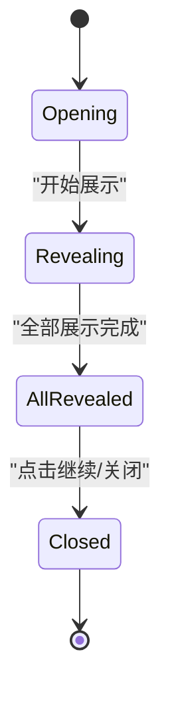
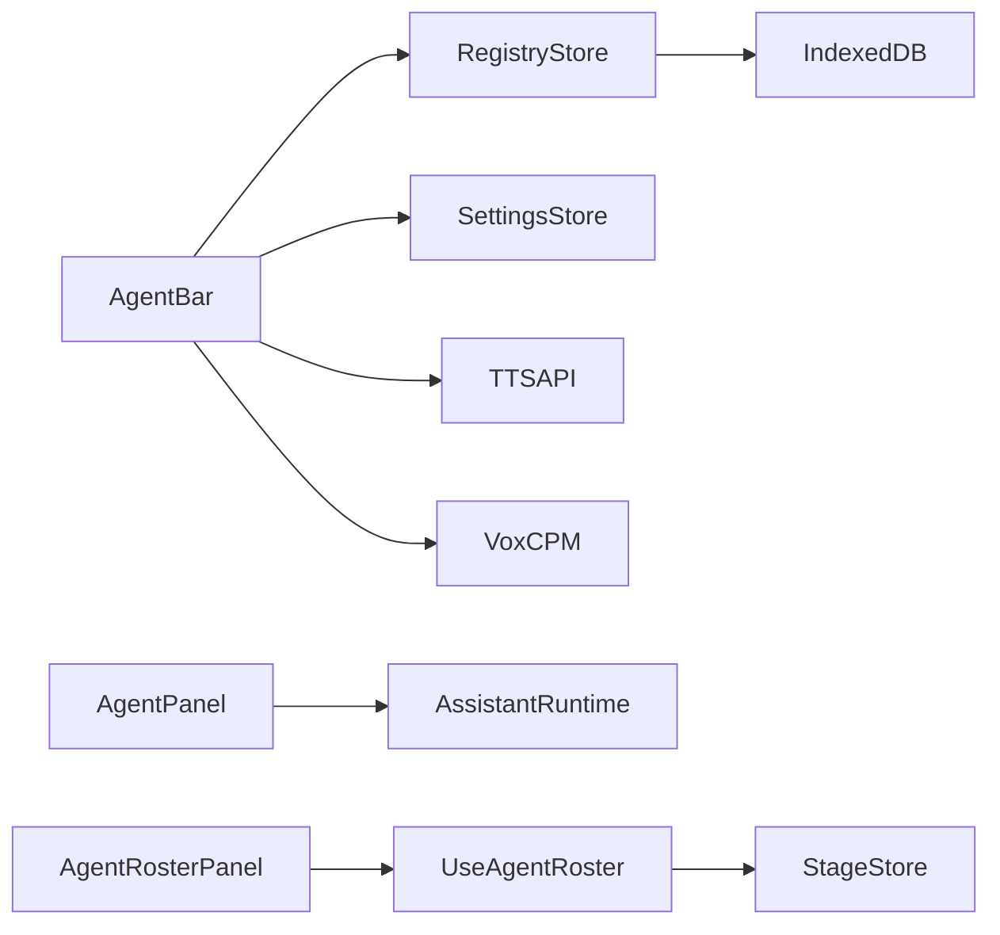

# 智能体组件

<cite>
**本文引用的文件**   
- [agent-avatar.tsx](file://components/agent/agent-avatar.tsx)
- [agent-bar.tsx](file://components/agent/agent-bar.tsx)
- [agent-config-panel.tsx](file://components/agent/agent-config-panel.tsx)
- [agent-reveal-modal.tsx](file://components/agent/agent-reveal-modal.tsx)
- [AgentPanel.tsx](file://components/edit/AgentPanel/AgentPanel.tsx)
- [store.ts](file://lib/orchestration/registry/store.ts)
- [types.ts](file://lib/orchestration/registry/types.ts)
- [useAgentRoster.ts](file://components/edit/AgentsView/useAgentRoster.ts)
- [AgentRosterPanel.tsx](file://components/edit/AgentsView/AgentRosterPanel.tsx)
- [AvatarPicker.tsx](file://components/edit/AgentsView/AvatarPicker.tsx)
- [agent-settings.tsx](file://components/settings/agent-settings.tsx)
</cite>

## 产品概述
本章节聚焦 OpenMAIC 中的“智能体”相关前端组件与状态管理，覆盖以下能力：
- 智能体头像展示与交互（AgentAvatar）
- 智能体工具栏（AgentBar）的启用、选择与 TTS 语音预览
- 智能体配置面板（AgentConfigPanel）的增删查改
- 智能体揭示模态框（AgentRevealModal）的动画与流程控制
- 编辑面板（AgentPanel）的智能体对话与工具调用
- 多智能体编排集成（注册表、生成代理加载与持久化）
- 性能优化与资源管理策略（TTS 预取、内存清理、渲染优化）

OpenMAIC 基于 Next.js + React + Zustand 构建，AI 编排使用 LangGraph + Vercel AI SDK。智能体数据通过本地持久化与 IndexedDB 协同，支持预设与自动生成两类智能体，并在课堂回放与编辑场景中统一呈现。

## 核心业务流程
- 预设模式：用户在 AgentBar 或设置中选择若干智能体（含教师角色），系统按优先级排序并参与讨论。
- 自动模式：根据当前舞台（stage）从 IndexedDB 加载生成的智能体，清空旧生成数据后注入注册表，进入自动编排。
- 语音合成：AgentBar 提供全局教师语音与每个智能体的独立语音覆盖；支持浏览器原生与服务器端 TTS 预览。
- 编辑场景：AgentPanel 以右侧边栏形式提供“用 AI 编辑”的能力，包含消息流、工具卡片、思考块与停止控制。
- 阵容编辑：AgentRosterPanel 提供对教师与同学的增删改查、重排与撤销重做，最终同步到 stage 存储。

图表来源 
- [agent-bar.tsx:614-780](file://components/agent/agent-bar.tsx#L614-L780)
- [store.ts:336-437](file://lib/orchestration/registry/store.ts#L336-L437)
- [AgentPanel.tsx:177-595](file://components/edit/AgentPanel/AgentPanel.tsx#L177-L595)

章节来源
- [agent-bar.tsx:614-780](file://components/agent/agent-bar.tsx#L614-L780)
- [store.ts:207-264](file://lib/orchestration/registry/store.ts#L207-L264)
- [AgentPanel.tsx:177-595](file://components/edit/AgentPanel/AgentPanel.tsx#L177-L595)

## 功能模块清单
- AgentAvatar：在聊天消息中显示智能体头像与名称，支持 URL/Emoji 两种头像源与主题色边框。
- AgentBar：智能体工具栏，负责模式切换（预设/自动）、多选智能体、教师语音与智能体语音覆盖、TTS 预览。
- AgentConfigPanel：智能体配置面板，列出所有智能体，支持删除与新建入口（编辑按钮预留）。
- AgentRevealModal：生成后的智能体揭示动画，逐张翻转展示，完成后提供继续按钮。
- AgentPanel：编辑侧边栏，承载与智能体的对话流、工具调用卡片、思考块、语音输入与停止控制。
- 注册表 Store：Zustand 状态管理，维护默认与自定义智能体，提供 CRUD、列表、转换参与者、加载/保存生成智能体等能力。
- 类型定义：AgentConfig/AgentTemplate 及角色动作映射，确保前后端一致。
- 阵容编辑器：AgentRosterPanel + useAgentRoster + AvatarPicker，提供可撤销/重做的编辑历史与 UI。
- 设置页：AgentSettings 提供模式切换与多选 UI，反馈单/多智能体模式提示。

章节来源
- [agent-avatar.tsx:1-49](file://components/agent/agent-avatar.tsx#L1-L49)
- [agent-bar.tsx:1-344](file://components/agent/agent-bar.tsx#L1-L344)
- [agent-config-panel.tsx:1-153](file://components/agent/agent-config-panel.tsx#L1-L153)
- [agent-reveal-modal.tsx:1-404](file://components/agent/agent-reveal-modal.tsx#L1-L404)
- [AgentPanel.tsx:1-595](file://components/edit/AgentPanel/AgentPanel.tsx#L1-L595)
- [store.ts:1-437](file://lib/orchestration/registry/store.ts#L1-L437)
- [types.ts:1-96](file://lib/orchestration/registry/types.ts#L1-L96)
- [useAgentRoster.ts:1-187](file://components/edit/AgentsView/useAgentRoster.ts#L1-L187)
- [AgentRosterPanel.tsx:1-563](file://components/edit/AgentsView/AgentRosterPanel.tsx#L1-L563)
- [AvatarPicker.tsx:1-36](file://components/edit/AgentsView/AvatarPicker.tsx#L1-L36)
- [agent-settings.tsx:1-177](file://components/settings/agent-settings.tsx#L1-L177)

## 数据与状态
- AgentConfig：智能体配置模型，包含 id、name、role、persona、avatar、color、allowedActions、priority、voiceConfig、voiceDesign、时间戳与元信息（isDefault/isGenerated/boundStageId）。
- 注册表 Store：
  - 默认智能体：内置 teacher/assistant/student 等多角色模板，始终可用。
  - 持久化：Zustand persist 合并默认与缓存，仅保留非默认且非生成的自定义智能体。
  - 生成智能体：loadGeneratedAgentsForStage 清空旧生成数据并载入新数据；saveGeneratedAgents 写回 IndexedDB 并预热语音。
  - 参与者映射：agentsToParticipants 将智能体转为课堂参与者，保证教师优先与用户加入。
- 阵容编辑：
  - useAgentRoster 维护历史栈（past/present/future），操作包括 add/update/remove/reorder/undo/redo。
  - 变更仅在用户实际编辑后标记 dirty 并同步至 stage store。
- 设置与选择：
  - AgentBar 与 AgentSettings 共同维护 selectedAgentIds 与 agentMode，区分预设与自动模式。
  - 教师语音为全局单一来源，智能体语音可通过覆盖实现个性化。

图表来源 
- [types.ts:1-96](file://lib/orchestration/registry/types.ts#L1-L96)
- [store.ts:17-264](file://lib/orchestration/registry/store.ts#L17-L264)
- [useAgentRoster.ts:68-187](file://components/edit/AgentsView/useAgentRoster.ts#L68-L187)

章节来源
- [types.ts:1-96](file://lib/orchestration/registry/types.ts#L1-L96)
- [store.ts:17-264](file://lib/orchestration/registry/store.ts#L17-L264)
- [useAgentRoster.ts:68-187](file://components/edit/AgentsView/useAgentRoster.ts#L68-L187)

## 关键约束与边界
- 教师角色不可被取消选择（在 AgentBar 与设置中禁用勾选），保证至少一位主讲。
- 自动模式下，切换会清空已选预设 ID，避免与生成智能体不同步。
- 生成智能体生命周期：
  - 加载时先清空旧生成数据，再写入新数据，防止跨课堂泄漏。
  - 保存时同时清理注册表中 isGenerated 的记录，保持一致性。
- TTS 预览：
  - 浏览器原生与服务器端路径分离，后者需处理 AbortController 与错误恢复。
  - VOXCPM 自动语音不支持预览，UI 会隐藏预览按钮。
- 编辑面板：
  - 仅当 canSend 为真时才允许发送；运行时支持 cancelRun 中断响应。
  - 空状态文案根据场景类型（slide/interactive）动态变化。
- 性能与资源：
  - 预览音频在组件卸载时释放引用与事件监听，避免内存泄漏。
  - 生成智能体保存后执行语音预热，减少首次说话延迟。
  - 列表过滤与分组查询在 Popover 内完成，避免全量渲染。

章节来源
- [agent-bar.tsx:614-780](file://components/agent/agent-bar.tsx#L614-L780)
- [agent-reveal-modal.tsx:1-404](file://components/agent/agent-reveal-modal.tsx#L1-L404)
- [store.ts:336-437](file://lib/orchestration/registry/store.ts#L336-L437)
- [AgentPanel.tsx:177-595](file://components/edit/AgentPanel/AgentPanel.tsx#L177-L595)

## 架构总览

图表来源 
- [agent-avatar.tsx:1-49](file://components/agent/agent-avatar.tsx#L1-L49)
- [agent-bar.tsx:1-344](file://components/agent/agent-bar.tsx#L1-L344)
- [agent-config-panel.tsx:1-153](file://components/agent/agent-config-panel.tsx#L1-L153)
- [agent-reveal-modal.tsx:1-404](file://components/agent/agent-reveal-modal.tsx#L1-L404)
- [AgentPanel.tsx:1-595](file://components/edit/AgentPanel/AgentPanel.tsx#L1-L595)
- [AgentRosterPanel.tsx:1-563](file://components/edit/AgentsView/AgentRosterPanel.tsx#L1-L563)
- [useAgentRoster.ts:1-187](file://components/edit/AgentsView/useAgentRoster.ts#L1-L187)
- [store.ts:1-437](file://lib/orchestration/registry/store.ts#L1-L437)
- [types.ts:1-96](file://lib/orchestration/registry/types.ts#L1-L96)

## 详细组件分析

### AgentAvatar 智能体头像组件
- 职责：在聊天消息中展示智能体头像与名称，支持 URL/Emoji 头像与主题色边框。
- 交互：无直接交互，作为只读展示组件。
- 数据：接收 avatar、color、name、size 属性。
- 复杂度：O(1)，仅条件判断与样式计算。
- 错误处理：URL 检测失败回退到 Emoji/首字母。

章节来源
- [agent-avatar.tsx:1-49](file://components/agent/agent-avatar.tsx#L1-L49)

### AgentBar 智能体工具栏
- 职责：模式切换（预设/自动）、智能体多选、教师语音与智能体语音覆盖、TTS 预览。
- 交互：
  - 模式切换：preset 模式保留用户选择；auto 模式清空预设选择并加载生成智能体。
  - 语音预览：支持浏览器原生与服务器端 TTS，自动中止与错误恢复。
- 数据：
  - selectedAgentIds、agentMode、ttsEnabled、ttsProvidersConfig、voxcpmProfiles。
  - 可用语音提供者由 getSelectableProvidersWithVoices 聚合。
- 性能：
  - 预览音频使用 AbortController 与 ref 引用，避免内存泄漏。
  - Popover 内搜索与分组过滤，减少渲染开销。

图表来源 
- [agent-bar.tsx:68-344](file://components/agent/agent-bar.tsx#L68-L344)

章节来源
- [agent-bar.tsx:1-344](file://components/agent/agent-bar.tsx#L1-L344)

### AgentConfigPanel 智能体配置面板
- 职责：列出所有智能体，支持删除与新建入口。
- 交互：点击卡片选中，删除前二次确认。
- 数据：来自 useAgentRegistry.listAgents。
- 扩展点：编辑按钮预留，便于后续接入编辑表单。

章节来源
- [agent-config-panel.tsx:1-153](file://components/agent/agent-config-panel.tsx#L1-L153)

### AgentRevealModal 智能体揭示模态框
- 职责：生成智能体逐一翻转展示，完成后显示继续按钮。
- 交互：
  - 定时器驱动 revealedCount，逐个显示卡片。
  - 全部展示后触发 onAllRevealed，供上层继续流程。
- 动画：使用 motion 的 AnimatePresence 与 3D 翻转，结束后切换为 flat 以支持滚动。
- 性能：一次性清理定时器与状态重置，避免重复触发。

图表来源 
- [agent-reveal-modal.tsx:1-404](file://components/agent/agent-reveal-modal.tsx#L1-L404)

章节来源
- [agent-reveal-modal.tsx:1-404](file://components/agent/agent-reveal-modal.tsx#L1-L404)

### AgentPanel 编辑面板
- 职责：右侧边栏“用 AI 编辑”，承载消息流、工具卡片、思考块、语音输入与停止控制。
- 交互：
  - 发送消息：ComposerPrimitive.Send 提交文本。
  - 停止运行：runtime.thread.cancelRun 中断响应。
  - 语音输入：SpeechButton 转录后追加到 composer 文本。
- 数据：AssistantRuntimeProvider 管理线程状态；naked 模式仅渲染内容区。
- 性能：
  - 思考指示器仅在首个 token 到达前显示。
  - 工具卡片与推理块按需渲染，避免冗余。

章节来源
- [AgentPanel.tsx:1-595](file://components/edit/AgentPanel/AgentPanel.tsx#L1-L595)

### 智能体注册表与类型
- 类型：AgentConfig/AgentTemplate 定义字段与默认动作映射。
- 注册表：
  - 默认智能体：teacher/assistant/student 等模板。
  - 持久化：merge 策略保留自定义智能体，忽略默认与生成智能体。
  - 生成智能体：load/save 方法确保 IndexedDB 与注册表一致。
  - 参与者映射：agentsToParticipants 用于课堂 UI。

章节来源
- [types.ts:1-96](file://lib/orchestration/registry/types.ts#L1-L96)
- [store.ts:1-437](file://lib/orchestration/registry/store.ts#L1-L437)

### 阵容编辑器（AgentRosterPanel + useAgentRoster + AvatarPicker）
- 职责：编辑教师与同学智能体，支持增删改查、重排与撤销重做。
- 交互：
  - 展开/折叠卡片，编辑名称与人设描述。
  - 上移/下移调整顺序，移出课堂删除。
  - 撤销/重做历史栈。
- 数据：useAgentRoster 维护 present 快照，dirty 标记后同步 stage store。
- 头像选择：AvatarPicker 提供内置头像网格。

章节来源
- [AgentRosterPanel.tsx:1-563](file://components/edit/AgentsView/AgentRosterPanel.tsx#L1-L563)
- [useAgentRoster.ts:1-187](file://components/edit/AgentsView/useAgentRoster.ts#L1-L187)
- [AvatarPicker.tsx:1-36](file://components/edit/AgentsView/AvatarPicker.tsx#L1-L36)

### 设置页（AgentSettings）
- 职责：模式切换（预设/自动）与智能体多选 UI。
- 交互：
  - preset 模式：多选智能体，教师角色不可取消。
  - auto 模式：说明自动生成逻辑。
- 反馈：根据选择数量显示单/多智能体模式提示。

章节来源
- [agent-settings.tsx:1-177](file://components/settings/agent-settings.tsx#L1-L177)

## 依赖分析
- 组件耦合：
  - AgentBar 依赖 useAgentRegistry、settings store、TTS 解析与 VoxCPM profiles。
  - AgentPanel 依赖 AssistantRuntimeProvider 与工具 UI 组件。
  - AgentRosterPanel 依赖 useAgentRoster 与 stage store。
- 外部依赖：
  - IndexedDB：生成智能体持久化。
  - TTS API：服务器端语音合成。
  - VoxCPM：语音配置文件。
- 循环依赖：无直接循环，模块间通过 store/hook 解耦。

图表来源 
- [agent-bar.tsx:1-344](file://components/agent/agent-bar.tsx#L1-L344)
- [AgentPanel.tsx:1-595](file://components/edit/AgentPanel/AgentPanel.tsx#L1-L595)
- [AgentRosterPanel.tsx:1-563](file://components/edit/AgentsView/AgentRosterPanel.tsx#L1-L563)
- [useAgentRoster.ts:1-187](file://components/edit/AgentsView/useAgentRoster.ts#L1-L187)
- [store.ts:1-437](file://lib/orchestration/registry/store.ts#L1-L437)

章节来源
- [agent-bar.tsx:1-344](file://components/agent/agent-bar.tsx#L1-L344)
- [AgentPanel.tsx:1-595](file://components/edit/AgentPanel/AgentPanel.tsx#L1-L595)
- [AgentRosterPanel.tsx:1-563](file://components/edit/AgentsView/AgentRosterPanel.tsx#L1-L563)
- [useAgentRoster.ts:1-187](file://components/edit/AgentsView/useAgentRoster.ts#L1-L187)
- [store.ts:1-437](file://lib/orchestration/registry/store.ts#L1-L437)

## 性能考虑
- TTS 预览：
  - 使用 AbortController 与 Audio 实例 ref，确保及时释放。
  - VOXCPM 自动语音跳过预览，减少无效请求。
- 列表与过滤：
  - Popover 内即时过滤与分组，避免全量渲染。
- 生成智能体：
  - 保存后预热语音，降低首次说话延迟。
  - 加载时先清空旧生成数据，避免内存累积。
- 编辑面板：
  - 思考指示器仅在首个 token 前显示，减少闪烁。
  - 工具卡片与推理块按需渲染。

[本节为通用指导，不直接分析具体文件]

## 故障排查指南
- 语音无法预览：
  - 检查 ttsEnabled 与可用提供者；浏览器原生与服务器端路径分别验证。
  - 查看网络请求与 base64 返回格式。
- 智能体未显示：
  - 确认 selectedAgentIds 与 agentMode；自动模式下检查 IndexedDB 是否有生成数据。
- 编辑面板无响应：
  - 检查 canSend 与 runtime 状态；必要时调用 cancelRun 重置。
- 生成智能体冲突：
  - 确认 loadGeneratedAgentsForStage 是否正确清空旧数据；saveGeneratedAgents 是否同步注册表。

章节来源
- [agent-bar.tsx:614-780](file://components/agent/agent-bar.tsx#L614-L780)
- [store.ts:336-437](file://lib/orchestration/registry/store.ts#L336-L437)
- [AgentPanel.tsx:177-595](file://components/edit/AgentPanel/AgentPanel.tsx#L177-L595)

## 结论
本组件体系围绕智能体的展示、配置、编辑与编排展开，通过注册表与 IndexedDB 协同实现预设与自动生成双轨并行。AgentBar 与设置页提供灵活的语音与选择控制，AgentPanel 支撑编辑场景下的实时交互。整体设计注重性能与资源管理，确保流畅的用户体验与可扩展性。