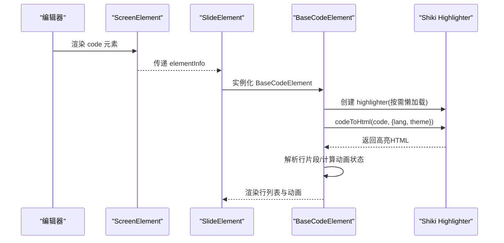
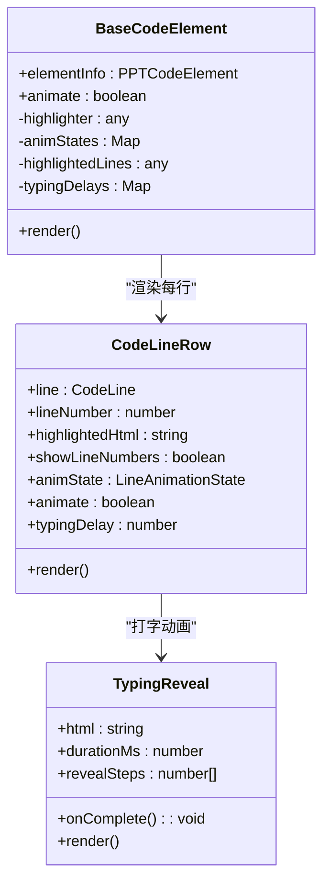
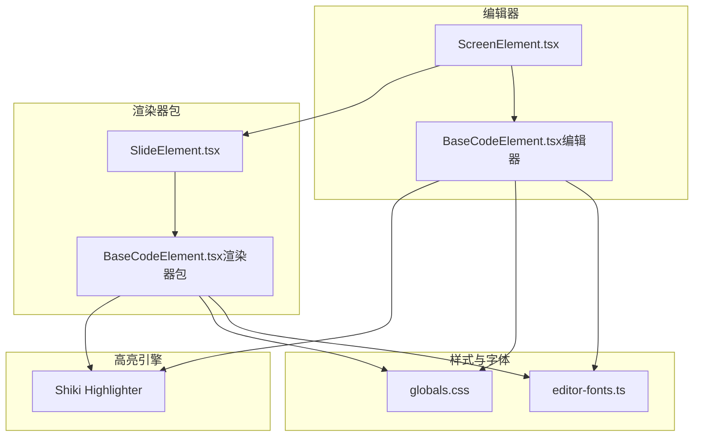
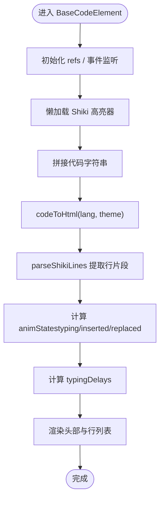
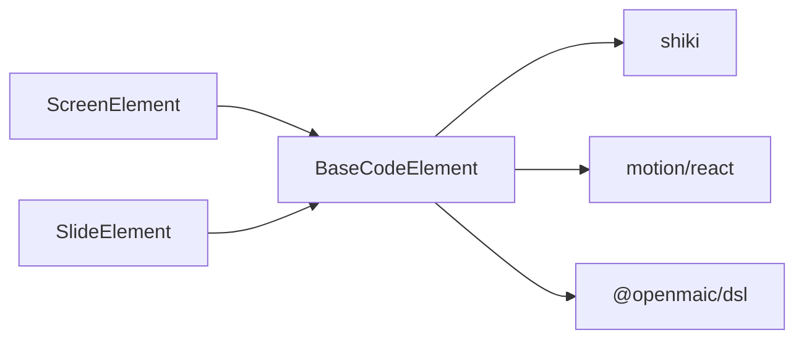

# 代码元素组件

<cite>
**本文引用的文件**   
- [BaseCodeElement.tsx（编辑器）](file://components/slide-renderer/components/element/CodeElement/BaseCodeElement.tsx)
- [BaseCodeElement.tsx（渲染器包）](file://packages/@openmaic/renderer/src/elements/code/BaseCodeElement.tsx)
- [ScreenElement.tsx（编辑器映射）](file://components/slide-renderer/Editor/ScreenElement.tsx)
- [SlideElement.tsx（渲染器入口）](file://packages/@openmaic/renderer/src/SlideElement.tsx)
- [code-line-budget.ts（行预算）](file://lib/orchestration/summarizers/code-line-budget.ts)
- [editor-fonts.ts（字体加载）](file://app/editor-fonts.ts)
- [globals.css（主题与暗色模式）](file://app/globals.css)
- [edit-elements-patch.ts（安全过滤）](file://lib/agent/tools/edit-elements-patch.ts)
- [proxy-media/route.ts（媒体代理限制）](file://app/api/proxy-media/route.ts)
- [egress-smoke.sh（出站网络隔离）](file://render-service/scripts/egress-smoke.sh)
- [prompts/index.ts（模板ID）](file://lib/prompts/index.ts)
- [timing.ts（动画时长）](file://lib/choreography/timing.ts)
</cite>

## 产品概述
本章节聚焦“代码元素组件”在 OpenMAIC 课件编辑与回放中的角色：以 Shiki 实现语法高亮，提供打字式逐行动画、行号显示、文件名与语言标识、拖拽滚动与滚轮隔离等能力；同时给出多语言支持、主题与字体配置、安全与沙箱策略、以及扩展自定义语言的指南。该组件既用于编辑器内的可视化编辑，也用于播放/课堂场景的只读展示。

## 核心业务流程
- 渲染流程
  - 编辑器通过 ScreenElement 将 code 类型映射到 BaseCodeElement。
  - 渲染器包 SlideElement 同样将 code 类型映射到 BaseCodeElement。
  - BaseCodeElement 使用 Shiki 对代码进行语法高亮，按行拆分 HTML 片段，结合 AnimatePresence 与 motion 实现逐行打字、插入与替换动画。
- 交互流程
  - 代码区域支持指针拖拽滚动，阻止外层白板平移/缩放事件传播。
  - 头部与边框区域的滚轮事件被拦截，避免误触发画布缩放。
- 数据流
  - 输入为 PPTCodeElement（包含 language、lines、fileName、showLineNumbers、fontSize）。
  - 输出为带高亮的可动画行列表，行内内容通过 dangerouslySetInnerHTML 注入，但外部输入经过转义与白名单过滤。

图表来源 
- [ScreenElement.tsx（编辑器映射）:13-35](file://components/slide-renderer/Editor/ScreenElement.tsx#L13-L35)
- [SlideElement.tsx（渲染器入口）:19-104](file://packages/@openmaic/renderer/src/SlideElement.tsx#L19-L104)
- [BaseCodeElement.tsx（编辑器）:365-725](file://components/slide-renderer/components/element/CodeElement/BaseCodeElement.tsx#L365-L725)
- [BaseCodeElement.tsx（渲染器包）:368-731](file://packages/@openmaic/renderer/src/elements/code/BaseCodeElement.tsx#L368-L731)

章节来源
- [ScreenElement.tsx（编辑器映射）:13-35](file://components/slide-renderer/Editor/ScreenElement.tsx#L13-L35)
- [SlideElement.tsx（渲染器入口）:19-104](file://packages/@openmaic/renderer/src/SlideElement.tsx#L19-L104)
- [BaseCodeElement.tsx（编辑器）:365-725](file://components/slide-renderer/components/element/CodeElement/BaseCodeElement.tsx#L365-L725)
- [BaseCodeElement.tsx（渲染器包）:368-731](file://packages/@openmaic/renderer/src/elements/code/BaseCodeElement.tsx#L368-L731)

## 功能模块清单
- 语法高亮与多语言
  - 基于 Shiki 的高亮器单例，预置多种语言（Python、JavaScript、TypeScript、JSON、Go、Rust、Java、C/C++、HTML、CSS、Bash、SQL、YAML、Markdown、JSX、TSX）。
  - 主题固定为 github-light，可通过后续扩展切换。
- 代码动画与展示
  - 逐行打字动画、插入高亮、替换选择过渡。
  - 可选行号显示、文件名与语言标签。
  - 字体族与字号可配置，默认等宽字体栈。
- 交互与滚动
  - 指针拖拽滚动、滚轮事件隔离，防止与白板平移冲突。
- 安全与过滤
  - 文本内容转义；富文本补丁使用严格白名单与样式正则校验。
- 性能与预算
  - 代码行渲染预算控制，避免超大代码块导致提示膨胀。
- 模板与片段
  - 提供 code-content 模板 ID，便于生成阶段注入代码片段。
- 主题与字体
  - 全局 CSS 变量与暗色模式；编辑器字体按需懒加载。

章节来源
- [BaseCodeElement.tsx（编辑器）:12-40](file://components/slide-renderer/components/element/CodeElement/BaseCodeElement.tsx#L12-L40)
- [BaseCodeElement.tsx（编辑器）:49-63](file://components/slide-renderer/components/element/CodeElement/BaseCodeElement.tsx#L49-L63)
- [BaseCodeElement.tsx（编辑器）:365-725](file://components/slide-renderer/components/element/CodeElement/BaseCodeElement.tsx#L365-L725)
- [BaseCodeElement.tsx（渲染器包）:12-40](file://packages/@openmaic/renderer/src/elements/code/BaseCodeElement.tsx#L12-L40)
- [BaseCodeElement.tsx（渲染器包）:368-731](file://packages/@openmaic/renderer/src/elements/code/BaseCodeElement.tsx#L368-L731)
- [code-line-budget.ts（行预算）:1-34](file://lib/orchestration/summarizers/code-line-budget.ts#L1-L34)
- [edit-elements-patch.ts（安全过滤）:36-85](file://lib/agent/tools/edit-elements-patch.ts#L36-L85)
- [prompts/index.ts（模板ID）:26-49](file://lib/prompts/index.ts#L26-L49)
- [editor-fonts.ts（字体加载）:1-40](file://app/editor-fonts.ts#L1-L40)
- [globals.css（主题与暗色模式）:17-49](file://app/globals.css#L17-L49)
- [globals.css（主题与暗色模式）:95-127](file://app/globals.css#L95-L127)

## 数据与状态
- 输入模型（PPTCodeElement）
  - language：语言标识（如 python、javascript），影响 Shiki 高亮。
  - lines：CodeLine[]，每行含 id 与 content，用于稳定 diff 与动画。
  - fileName：可选文件名，显示于头部。
  - showLineNumbers：是否显示行号。
  - fontSize：字号（px）。
- 内部状态
  - highlighter：Shiki 高亮器实例（懒加载单例）。
  - animStates：Map<lineId, LineAnimationState>，记录 typing/inserted/replaced 及时间戳。
  - highlightedLines：高亮后的行 HTML 片段映射。
  - typingDelays：逐行打字延迟累计。
- 状态流转
  - 首次渲染：根据 animate 标志初始化 typing 状态。
  - 后续更新：对比 prevLinesRef 与当前 lines，生成 inserted/replaced 状态。
  - 高亮失败回退：降级为纯文本转义。

图表来源 
- [BaseCodeElement.tsx（编辑器）:66-70](file://components/slide-renderer/components/element/CodeElement/BaseCodeElement.tsx#L66-L70)
- [BaseCodeElement.tsx（编辑器）:196-362](file://components/slide-renderer/components/element/CodeElement/BaseCodeElement.tsx#L196-L362)
- [BaseCodeElement.tsx（编辑器）:127-194](file://components/slide-renderer/components/element/CodeElement/BaseCodeElement.tsx#L127-L194)

章节来源
- [BaseCodeElement.tsx（编辑器）:66-70](file://components/slide-renderer/components/element/CodeElement/BaseCodeElement.tsx#L66-L70)
- [BaseCodeElement.tsx（编辑器）:196-362](file://components/slide-renderer/components/element/CodeElement/BaseCodeElement.tsx#L196-L362)
- [BaseCodeElement.tsx（编辑器）:127-194](file://components/slide-renderer/components/element/CodeElement/BaseCodeElement.tsx#L127-L194)
- [BaseCodeElement.tsx（渲染器包）:62-65](file://packages/@openmaic/renderer/src/elements/code/BaseCodeElement.tsx#L62-L65)
- [BaseCodeElement.tsx（渲染器包）:202-364](file://packages/@openmaic/renderer/src/elements/code/BaseCodeElement.tsx#L202-L364)
- [BaseCodeElement.tsx（渲染器包）:122-192](file://packages/@openmaic/renderer/src/elements/code/BaseCodeElement.tsx#L122-L192)

## 关键约束与边界
- 多编程语言支持
  - 内置语言列表由 Shiki 初始化决定，如需新增语言需扩展 langs 数组并保证主题可用。
  - 语言显示名称映射 LANG_DISPLAY_NAMES 用于头部展示。
- 代码模板管理
  - 模板 ID 中包含 code-content，可用于生成阶段注入代码片段或模板。
- 代码格式化、缩进与自动补全
  - 组件为只读展示，未集成编辑器（无自动补全/格式化）。缩进通过 tabSize 与 whiteSpace: pre 保持原样。
- 代码执行、输出展示与错误处理
  - 不执行代码；仅渲染与动画。若高亮失败则回退为转义文本。
  - 运行时错误通过 useSceneRuntimeErrors 聚合（非本组件直接处理）。
- 代码片段库与快捷插入
  - 通过 prompts 系统加载 snippet/prompt；可在生成阶段组合 code-content 模板。
- 主题定制、字体配置与暗色模式
  - 主题固定为 github-light；字体族与字号由组件样式与 editor-fonts.ts 共同决定；暗色模式通过 CSS 变量覆盖。
- 编辑器扩展与自定义语言支持
  - 扩展点：getHighlighter 中 langs/themes 配置；parseShikiLines 的行解析逻辑；LANG_DISPLAY_NAMES 映射。
- 代码安全、沙箱执行与资源限制
  - 文本转义；富文本补丁采用严格白名单与样式正则。
  - 媒体代理限制大小与 Content-Type，防 SSRF。
  - 渲染服务容器出站网络隔离（egress lockdown），阻断新出站连接。
  - 代码行渲染预算上限，避免超大代码块导致上下文膨胀。

章节来源
- [BaseCodeElement.tsx（编辑器）:12-40](file://components/slide-renderer/components/element/CodeElement/BaseCodeElement.tsx#L12-L40)
- [BaseCodeElement.tsx（编辑器）:706-724](file://components/slide-renderer/components/element/CodeElement/BaseCodeElement.tsx#L706-L724)
- [prompts/index.ts（模板ID）:26-49](file://lib/prompts/index.ts#L26-L49)
- [BaseCodeElement.tsx（编辑器）:49-63](file://components/slide-renderer/components/element/CodeElement/BaseCodeElement.tsx#L49-L63)
- [BaseCodeElement.tsx（编辑器）:698-704](file://components/slide-renderer/components/element/CodeElement/BaseCodeElement.tsx#L698-L704)
- [edit-elements-patch.ts（安全过滤）:36-85](file://lib/agent/tools/edit-elements-patch.ts#L36-L85)
- [proxy-media/route.ts（媒体代理限制）:67-93](file://app/api/proxy-media/route.ts#L67-L93)
- [egress-smoke.sh（出站网络隔离）:1-30](file://render-service/scripts/egress-smoke.sh#L1-L30)
- [code-line-budget.ts（行预算）:1-34](file://lib/orchestration/summarizers/code-line-budget.ts#L1-L34)
- [editor-fonts.ts（字体加载）:1-40](file://app/editor-fonts.ts#L1-L40)
- [globals.css（主题与暗色模式）:17-49](file://app/globals.css#L17-L49)
- [globals.css（主题与暗色模式）:95-127](file://app/globals.css#L95-L127)

## 架构总览

图表来源 
- [ScreenElement.tsx（编辑器映射）:13-35](file://components/slide-renderer/Editor/ScreenElement.tsx#L13-L35)
- [SlideElement.tsx（渲染器入口）:19-104](file://packages/@openmaic/renderer/src/SlideElement.tsx#L19-L104)
- [BaseCodeElement.tsx（编辑器）:365-725](file://components/slide-renderer/components/element/CodeElement/BaseCodeElement.tsx#L365-L725)
- [BaseCodeElement.tsx（渲染器包）:368-731](file://packages/@openmaic/renderer/src/elements/code/BaseCodeElement.tsx#L368-L731)
- [globals.css（主题与暗色模式）:17-49](file://app/globals.css#L17-L49)
- [editor-fonts.ts（字体加载）:1-40](file://app/editor-fonts.ts#L1-L40)

## 详细组件分析
### BaseCodeElement（编辑器版）
- 职责
  - 接收 PPTCodeElement，懒加载 Shiki 高亮器，生成行级高亮 HTML 与动画状态。
  - 处理指针拖拽滚动与滚轮隔离，确保与白板交互不冲突。
  - 渲染头部（三色圆点、文件名、语言标签）与代码体（行号、行内容、动画）。
- 关键点
  - parseShikiLines 从 Shiki 输出中提取行片段。
  - TypingReveal 使用 clipPath 与 requestAnimationFrame 实现逐字揭示。
  - CodeLineRow 负责插入/替换动画与高亮闪烁。
- 性能
  - 高亮器单例复用；行级动画状态最小化更新；失败回退为纯文本。

图表来源 
- [BaseCodeElement.tsx（编辑器）:365-725](file://components/slide-renderer/components/element/CodeElement/BaseCodeElement.tsx#L365-L725)

章节来源
- [BaseCodeElement.tsx（编辑器）:12-40](file://components/slide-renderer/components/element/CodeElement/BaseCodeElement.tsx#L12-L40)
- [BaseCodeElement.tsx（编辑器）:49-63](file://components/slide-renderer/components/element/CodeElement/BaseCodeElement.tsx#L49-L63)
- [BaseCodeElement.tsx（编辑器）:127-194](file://components/slide-renderer/components/element/CodeElement/BaseCodeElement.tsx#L127-L194)
- [BaseCodeElement.tsx（编辑器）:196-362](file://components/slide-renderer/components/element/CodeElement/BaseCodeElement.tsx#L196-L362)
- [BaseCodeElement.tsx（编辑器）:365-725](file://components/slide-renderer/components/element/CodeElement/BaseCodeElement.tsx#L365-L725)

### BaseCodeElement（渲染器包版）
- 职责
  - 与编辑器版一致，但样式与类名略有差异，适配渲染器环境。
- 关键点
  - 同样的 Shiki 单例与行解析逻辑。
  - 动画状态计算与打字揭示保持一致。
- 差异
  - 样式更贴近渲染器包的布局约定。

章节来源
- [BaseCodeElement.tsx（渲染器包）:12-40](file://packages/@openmaic/renderer/src/elements/code/BaseCodeElement.tsx#L12-L40)
- [BaseCodeElement.tsx（渲染器包）:44-58](file://packages/@openmaic/renderer/src/elements/code/BaseCodeElement.tsx#L44-L58)
- [BaseCodeElement.tsx（渲染器包）:122-192](file://packages/@openmaic/renderer/src/elements/code/BaseCodeElement.tsx#L122-L192)
- [BaseCodeElement.tsx（渲染器包）:202-364](file://packages/@openmaic/renderer/src/elements/code/BaseCodeElement.tsx#L202-L364)
- [BaseCodeElement.tsx（渲染器包）:368-731](file://packages/@openmaic/renderer/src/elements/code/BaseCodeElement.tsx#L368-L731)

### 编辑器映射与渲染器入口
- ScreenElement.tsx
  - 将 ElementTypes.CODE 映射到 BaseCodeElement（编辑器版）。
- SlideElement.tsx
  - 将 code 类型映射到 BaseCodeElement（渲染器包版）。

章节来源
- [ScreenElement.tsx（编辑器映射）:13-35](file://components/slide-renderer/Editor/ScreenElement.tsx#L13-L35)
- [SlideElement.tsx（渲染器入口）:19-104](file://packages/@openmaic/renderer/src/SlideElement.tsx#L19-L104)

### 动画与时长
- wbDrawCodeMs
  - 打字动画时长公式：基础 800ms + 50ms/行，上限 3000ms。
- 其他动作时长常量
  - WB_OPEN_MS、WB_DRAW_MS、WB_EDIT_MS、WB_DELETE_MS、WB_CLOSE_MS、WIDGET_MS。

章节来源
- [timing.ts（动画时长）:33-66](file://lib/choreography/timing.ts#L33-L66)

### 安全与沙箱
- 富文本补丁
  - allowedTags/allowedAttributes/allowedSchemes/allowedStyles 严格白名单与正则校验。
- 媒体代理
  - 最大字节数限制、Content-Type 白名单、SSRF 防护。
- 渲染服务出站隔离
  - egress lockdown active，仅允许环回与健康检查。

章节来源
- [edit-elements-patch.ts（安全过滤）:36-85](file://lib/agent/tools/edit-elements-patch.ts#L36-L85)
- [proxy-media/route.ts（媒体代理限制）:67-93](file://app/api/proxy-media/route.ts#L67-L93)
- [egress-smoke.sh（出站网络隔离）:1-30](file://render-service/scripts/egress-smoke.sh#L1-L30)

### 主题与字体
- 主题
  - 固定 github-light；可通过扩展 Shiki 主题配置切换。
- 字体
  - 编辑器字体通过 @fontsource 按需加载，CJK 子集懒加载。
  - 代码字体族为等宽字体栈，字号可配置。
- 暗色模式
  - 通过 CSS 变量覆盖背景、前景、边框等颜色。

章节来源
- [BaseCodeElement.tsx（编辑器）:12-40](file://components/slide-renderer/components/element/CodeElement/BaseCodeElement.tsx#L12-L40)
- [editor-fonts.ts（字体加载）:1-40](file://app/editor-fonts.ts#L1-L40)
- [globals.css（主题与暗色模式）:17-49](file://app/globals.css#L17-L49)
- [globals.css（主题与暗色模式）:95-127](file://app/globals.css#L95-L127)

### 模板与片段
- 模板 ID
  - PROMPT_IDS.CODE_CONTENT 用于代码内容模板。
- 片段加载
  - loadSnippet/buildPrompt 支持片段组合与变量插值。

章节来源
- [prompts/index.ts（模板ID）:26-49](file://lib/prompts/index.ts#L26-L49)

## 依赖分析
- 组件耦合
  - BaseCodeElement 依赖 Shiki（高亮）、motion（动画）、@openmaic/dsl（类型定义）。
  - 编辑器与渲染器分别引入不同版本的 BaseCodeElement，但行为一致。
- 外部依赖
  - Shiki 动态导入，减少初始包体积。
  - CSS 变量与字体包影响外观与性能。
- 潜在循环
  - 无循环依赖；高亮器为模块级单例。

图表来源 
- [BaseCodeElement.tsx（编辑器）:1-6](file://components/slide-renderer/components/element/CodeElement/BaseCodeElement.tsx#L1-L6)
- [BaseCodeElement.tsx（渲染器包）:1-6](file://packages/@openmaic/renderer/src/elements/code/BaseCodeElement.tsx#L1-L6)
- [ScreenElement.tsx（编辑器映射）:13-35](file://components/slide-renderer/Editor/ScreenElement.tsx#L13-L35)
- [SlideElement.tsx（渲染器入口）:19-104](file://packages/@openmaic/renderer/src/SlideElement.tsx#L19-L104)

章节来源
- [BaseCodeElement.tsx（编辑器）:1-6](file://components/slide-renderer/components/element/CodeElement/BaseCodeElement.tsx#L1-L6)
- [BaseCodeElement.tsx（渲染器包）:1-6](file://packages/@openmaic/renderer/src/elements/code/BaseCodeElement.tsx#L1-L6)
- [ScreenElement.tsx（编辑器映射）:13-35](file://components/slide-renderer/Editor/ScreenElement.tsx#L13-L35)
- [SlideElement.tsx（渲染器入口）:19-104](file://packages/@openmaic/renderer/src/SlideElement.tsx#L19-L104)

## 性能考虑
- 高亮器单例与懒加载，避免重复初始化。
- 行级动画状态最小化更新，仅在 lines 变化时计算差异。
- 高亮失败回退为纯文本，保障可用性。
- 代码行渲染预算限制，防止超大代码块影响上下文与渲染。

章节来源
- [BaseCodeElement.tsx（编辑器）:12-40](file://components/slide-renderer/components/element/CodeElement/BaseCodeElement.tsx#L12-L40)
- [BaseCodeElement.tsx（编辑器）:465-523](file://components/slide-renderer/components/element/CodeElement/BaseCodeElement.tsx#L465-L523)
- [BaseCodeElement.tsx（编辑器）:529-564](file://components/slide-renderer/components/element/CodeElement/BaseCodeElement.tsx#L529-L564)
- [code-line-budget.ts（行预算）:1-34](file://lib/orchestration/summarizers/code-line-budget.ts#L1-L34)

## 故障排查指南
- 高亮不生效
  - 检查 language 是否在 Shiki langs 列表中；确认 getHighlighter 成功加载。
  - 查看 parseShikiLines 是否能正确解析行片段。
- 动画异常
  - 确认 animate 标志与 animStates 初始化；检查 typingDelays 累计是否正确。
- 滚动冲突
  - 检查 pointerdown/move/up 与 wheel 事件是否被正确捕获与阻止冒泡。
- 安全风险
  - 富文本补丁是否命中白名单；媒体代理是否拒绝非法 URL 或过大资源。
- 运行时错误
  - 查看 useSceneRuntimeErrors 聚合的错误信息，定位具体 sceneId 与错误消息。

章节来源
- [BaseCodeElement.tsx（编辑器）:12-40](file://components/slide-renderer/components/element/CodeElement/BaseCodeElement.tsx#L12-L40)
- [BaseCodeElement.tsx（编辑器）:49-63](file://components/slide-renderer/components/element/CodeElement/BaseCodeElement.tsx#L49-L63)
- [BaseCodeElement.tsx（编辑器）:379-463](file://components/slide-renderer/components/element/CodeElement/BaseCodeElement.tsx#L379-L463)
- [edit-elements-patch.ts（安全过滤）:36-85](file://lib/agent/tools/edit-elements-patch.ts#L36-L85)
- [proxy-media/route.ts（媒体代理限制）:67-93](file://app/api/proxy-media/route.ts#L67-L93)

## 结论
代码元素组件以 Shiki 为核心，提供稳定、高性能的代码高亮与动画展示，满足课件编辑与课堂回放的多语言需求。通过严格的样式与内容过滤、媒体代理限制与渲染服务出站隔离，确保安全性与稳定性。未来可扩展更多语言、主题与交互能力，同时保持只读渲染的定位与性能预算。