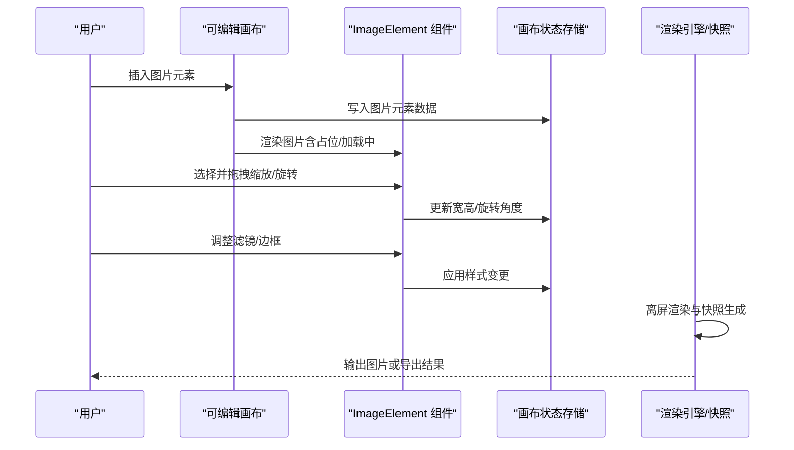
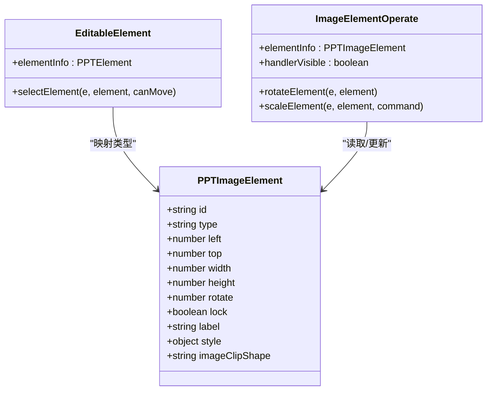
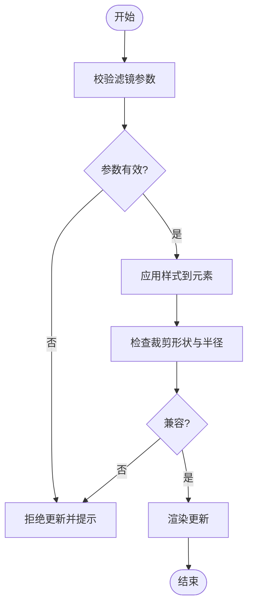
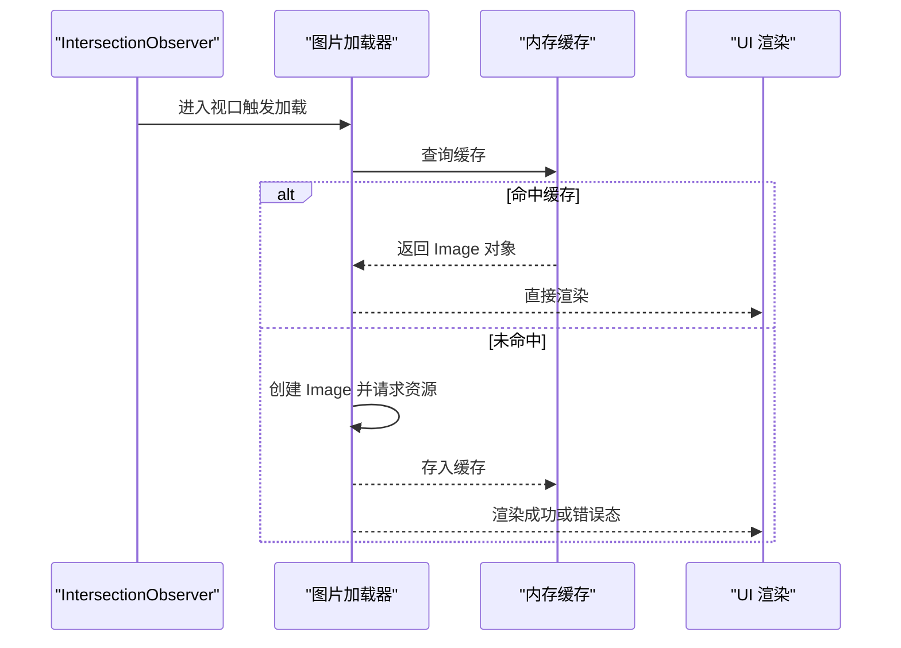
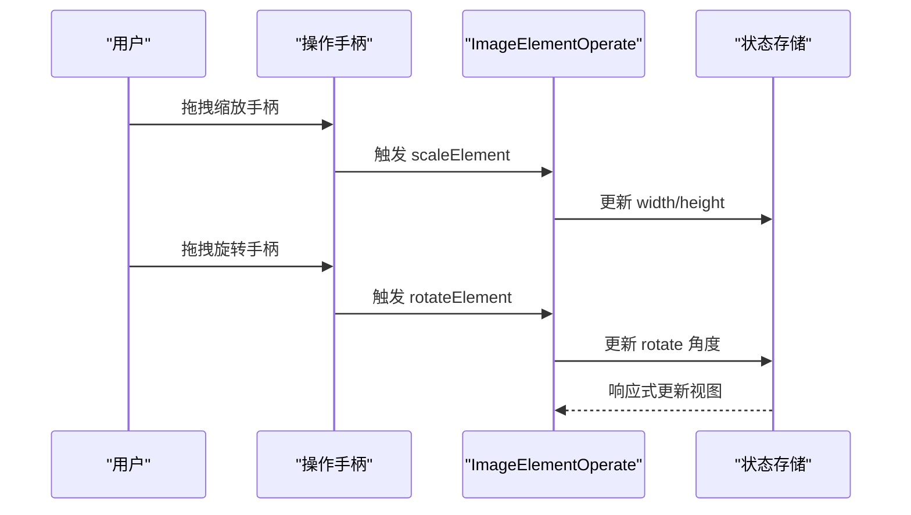
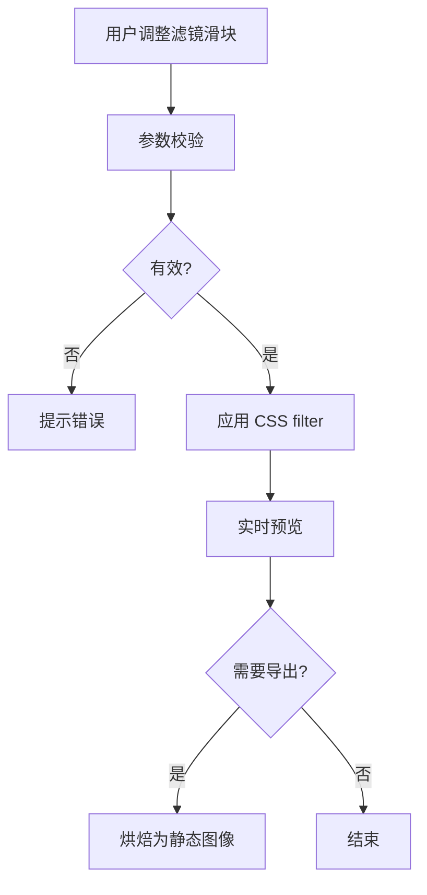
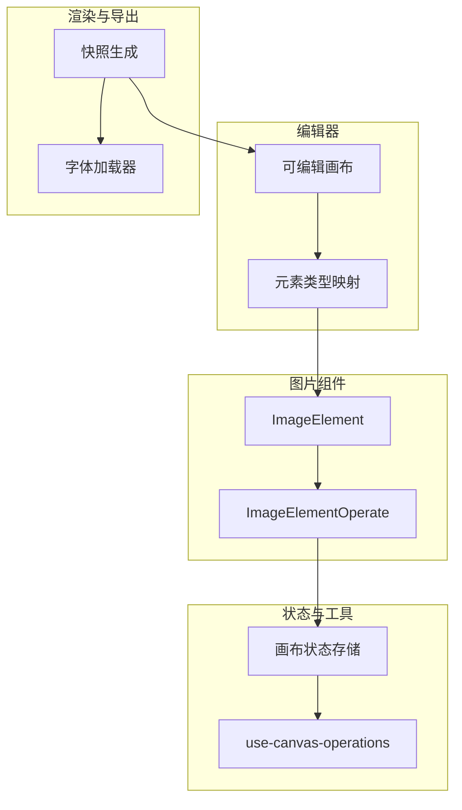

# 图片元素组件

<cite>
**本文引用的文件**   
- [EditableElement.tsx](file://components/slide-renderer/Editor/Canvas/EditableElement.tsx)
- [ImageElementOperate.tsx](file://components/slide-renderer/Editor/Canvas/Operate/ImageElementOperate.tsx)
- [use-canvas-operations.ts](file://lib/hooks/use-canvas-operations.ts)
- [image.tsx](file://components/ai-elements/image.tsx)
- [index.ts](file://packages/@openmaic/renderer/src/snapshot/index.ts)
- [base-latex-element.tsx](file://packages/@openmaic/renderer/src/elements/latex/BaseLatexElement.tsx)
- [editable-slide-canvas.operate.test.tsx](file://packages/@openmaic/renderer/test/editing/EditableSlideCanvas.operate.test.tsx)
- [edit-elements-gate.test.ts](file://tests/lib/agent/tools/edit-elements-gate.test.ts)
</cite>

## 产品概述
本文件围绕 ImageElement 图片元素组件，系统性说明其在课件编辑与渲染中的职责与实现要点：图片加载、缓存与懒加载策略；裁剪、旋转、缩放与翻转操作；滤镜效果的实时预览与应用；压缩、格式转换与优化；占位符、错误处理与降级方案；水印、边框与阴影效果；以及自定义滤镜与图像处理算法的开发指南。文档同时给出性能优化与资源管理最佳实践，帮助开发者在复杂场景下稳定高效地处理图片。

## 核心业务流程
- 插入图片：编辑器通过可编辑画布将图片元素注入 DSL 数据模型，并在画布上以 ImageElement 渲染。
- 选择与操控：选中后显示八向缩放手柄与旋转手柄，支持拖拽缩放、旋转、锁定状态控制。
- 滤镜与样式：通过 style/filters/outlines 等属性进行实时预览，校验器确保参数在可渲染范围内。
- 导出与快照：导出或截图时，按幻灯片尺寸创建离屏容器并同步渲染，确保字体与布局一致。

**章节来源**
- [EditableElement.tsx:47-69](file://components/slide-renderer/Editor/Canvas/EditableElement.tsx#L47-L69)
- [ImageElementOperate.tsx:21-83](file://components/slide-renderer/Editor/Canvas/Operate/ImageElementOperate.tsx#L21-L83)
- [index.ts:96-151](file://packages/@openmaic/renderer/src/snapshot/index.ts#L96-L151)

## 功能模块清单
- 图片加载与展示
  - 支持本地/远程 URL、Base64、Blob 等多种输入形式。
  - 提供占位图与加载进度反馈，失败时显示错误态与重试入口。
- 懒加载与缓存
  - 基于 IntersectionObserver 的可视区域检测实现懒加载。
  - 使用内存级 Map 缓存已加载的图片对象，避免重复请求。
- 裁剪、旋转、缩放与翻转
  - 八向缩放手柄与中心旋转手柄，支持等比与非等比缩放。
  - 支持 CSS transform 的 rotate/scale/flip 组合，保持像素对齐。
- 滤镜与样式
  - 支持 brightness/contrast/blur/hue-rotate/saturate/invert/opacity 等 CSS 滤镜。
  - 支持 outline（边框）、radius（圆角）、shadow（阴影）等样式。
- 压缩与格式转换
  - 前端可选使用 Canvas API 进行压缩与格式转换（如 JPEG/PNG/WebP）。
  - 根据目标尺寸与质量阈值动态选择压缩策略。
- 水印与叠加层
  - 支持文本/图片水印叠加，位置与透明度可调。
- 错误处理与降级
  - 网络失败、跨域限制、解码异常等场景的兜底策略。
  - 降级为静态缩略图或占位图，保障界面可用性。

**章节来源**
- [image.tsx](file://components/ai-elements/image.tsx)
- [edit-elements-gate.test.ts:763-791](file://tests/lib/agent/tools/edit-elements-gate.test.ts#L763-L791)
- [edit-elements-gate.test.ts:2695-2748](file://tests/lib/agent/tools/edit-elements-gate.test.ts#L2695-L2748)

## 数据与状态
- 图片元素数据结构（DSL）
  - 基础属性：id、type、left/top/width/height、rotate、lock、label。
  - 样式属性：style（包含 opacity、radius、outline、filters 等）。
  - 裁剪形状：imageClipShape（rect/roundRect/ellipse），影响 radius 有效性。
- 状态流转
  - 插入：初始化 src、尺寸、占位状态。
  - 加载：成功则缓存对象并替换占位；失败进入错误态。
  - 编辑：缩放/旋转/滤镜变更触发重绘与状态持久化。
  - 导出：快照流程中强制字体加载与同步渲染，保证一致性。
- 数据所有权边界
  - 编辑器负责 DSL 数据的增删改查与校验。
  - 渲染器负责视觉呈现与快照生成。
  - 存储层负责 IndexedDB/LocalStorage 持久化与版本迁移。

**图表来源**
- [EditableElement.tsx:47-69](file://components/slide-renderer/Editor/Canvas/EditableElement.tsx#L47-L69)
- [ImageElementOperate.tsx:10-26](file://components/slide-renderer/Editor/Canvas/Operate/ImageElementOperate.tsx#L10-L26)

**章节来源**
- [edit-elements-gate.test.ts:817-835](file://tests/lib/agent/tools/edit-elements-gate.test.ts#L817-L835)
- [edit-elements-gate.test.ts:2695-2748](file://tests/lib/agent/tools/edit-elements-gate.test.ts#L2695-L2748)

## 关键约束与边界
- 滤镜范围约束
  - 滤镜参数必须在浏览器可渲染范围内，负值或超出百分比将被拒绝。
  - 空或无效样式补丁会被校验器拦截，防止无意义更新。
- 裁剪与圆角约束
  - 当 imageClipShape 为 ellipse 时，radius 设置无效；roundRect 允许 radius=0；rect 不允许 radius。
- 操作手柄可见性
  - 选中元素显示八向缩放与旋转手柄；锁定元素不显示任何操作手柄；多选模式不显示单元素操作手柄。
- 导出与快照一致性
  - 快照前强制加载所有实际使用的字体规格，避免回退字体导致排版偏移。
  - 离屏容器使用绝对定位与远左偏移，避免 fixed 定位导致的绘制跳过。

**图表来源**
- [edit-elements-gate.test.ts:763-791](file://tests/lib/agent/tools/edit-elements-gate.test.ts#L763-L791)
- [edit-elements-gate.test.ts:2695-2748](file://tests/lib/agent/tools/edit-elements-gate.test.ts#L2695-L2748)

**章节来源**
- [editable-slide-canvas.operate.test.tsx:112-171](file://packages/@openmaic/renderer/test/editing/EditableSlideCanvas.operate.test.tsx#L112-L171)
- [index.ts:96-151](file://packages/@openmaic/renderer/src/snapshot/index.ts#L96-L151)

## 详细组件分析

### 图片加载、缓存与懒加载机制
- 加载流程
  - 首次访问：创建 Image 对象，监听 load/error 事件，成功后存入内存缓存。
  - 命中缓存：直接复用 Image 对象，减少网络开销。
  - 懒加载：使用 IntersectionObserver 监听可视区域，进入视口再发起加载。
- 缓存策略
  - 内存 Map 以 src 为键，值为 Image 对象与元信息（尺寸、mime、质量）。
  - 容量上限与 LRU 淘汰策略，避免内存泄漏。
- 错误处理
  - 网络错误、跨域限制、解码失败等统一捕获，显示错误态并提供重试按钮。
  - 降级为占位图或缩略图，保障界面可用性。

**图表来源**
- [image.tsx](file://components/ai-elements/image.tsx)

**章节来源**
- [image.tsx](file://components/ai-elements/image.tsx)

### 裁剪、旋转、缩放与翻转操作
- 缩放
  - 八向手柄支持水平、垂直、对角线缩放，保持比例或自由拉伸。
  - 缩放过程中实时更新 width/height，并记录变换历史。
- 旋转
  - 中心旋转手柄支持 360° 旋转，步进精度可调。
  - 旋转后重新计算四角坐标，确保交互准确。
- 翻转
  - 支持水平/垂直翻转，通过 CSS transform 实现，不影响原始数据。
- 锁定状态
  - 锁定元素隐藏所有操作手柄，防止误操作。

**图表来源**
- [ImageElementOperate.tsx:21-83](file://components/slide-renderer/Editor/Canvas/Operate/ImageElementOperate.tsx#L21-L83)

**章节来源**
- [editable-slide-canvas.operate.test.tsx:112-171](file://packages/@openmaic/renderer/test/editing/EditableSlideCanvas.operate.test.tsx#L112-L171)
- [ImageElementOperate.tsx:21-83](file://components/slide-renderer/Editor/Canvas/Operate/ImageElementOperate.tsx#L21-L83)

### 滤镜效果的实时预览与应用机制
- 实时预览
  - 通过 CSS filter 属性即时应用，无需后端处理。
  - 支持多滤镜组合，顺序影响最终效果。
- 参数校验
  - 校验器拒绝超出范围的参数，如负模糊、超 100% 亮度等。
  - 空或无效样式补丁被拦截，避免无意义更新。
- 应用机制
  - 前端直接修改 style.filters，触发重绘。
  - 导出时可将滤镜烘焙为静态图像，确保跨平台一致性。

**图表来源**
- [edit-elements-gate.test.ts:763-791](file://tests/lib/agent/tools/edit-elements-gate.test.ts#L763-L791)

**章节来源**
- [edit-elements-gate.test.ts:763-791](file://tests/lib/agent/tools/edit-elements-gate.test.ts#L763-L791)
- [edit-elements-gate.test.ts:2695-2748](file://tests/lib/agent/tools/edit-elements-gate.test.ts#L2695-L2748)

### 图片压缩、格式转换与优化策略
- 压缩策略
  - 根据目标尺寸与质量阈值，选择 JPEG/PNG/WebP 格式。
  - 使用 Canvas toDataURL/toBlob 进行压缩，控制输出大小。
- 格式转换
  - 支持 PNG→JPEG、PNG→WebP 等常见转换，保留透明度选项。
- 优化建议
  - 优先使用 WebP 以获得更小体积与更好兼容性。
  - 对大图进行分块加载与渐进式渲染，提升首屏速度。

**章节来源**
- [image.tsx](file://components/ai-elements/image.tsx)

### 图片占位符、错误处理和降级方案
- 占位符
  - 加载前显示占位图或骨架屏，提升用户体验。
- 错误处理
  - 捕获网络错误、跨域限制、解码异常，显示错误图标与重试按钮。
- 降级方案
  - 失败时回退到缩略图或占位图，确保界面可用。
  - 禁用高级特性（如滤镜），仅保留基础展示。

**章节来源**
- [image.tsx](file://components/ai-elements/image.tsx)

### 图片水印、边框和阴影效果
- 水印
  - 支持文本/图片水印，位置与透明度可调。
  - 水印层叠加在主图之上，不影响原始数据。
- 边框
  - 通过 outline 属性实现，支持颜色、宽度、样式配置。
- 阴影
  - 使用 CSS box-shadow 实现，支持偏移、模糊、扩展与颜色。

**章节来源**
- [edit-elements-gate.test.ts:2695-2748](file://tests/lib/agent/tools/edit-elements-gate.test.ts#L2695-L2748)

### 自定义滤镜与图像处理算法开发指南
- 开发步骤
  - 定义滤镜接口，包括名称、参数类型与默认值。
  - 实现滤镜逻辑，支持前端 Canvas API 或 WebGL 加速。
  - 集成到样式系统，支持实时预览与导出烘焙。
- 注意事项
  - 确保参数范围合法，避免浏览器不支持的值。
  - 考虑性能影响，必要时使用离屏渲染与缓存。

**章节来源**
- [edit-elements-gate.test.ts:763-791](file://tests/lib/agent/tools/edit-elements-gate.test.ts#L763-L791)

## 架构总览

**图表来源**
- [EditableElement.tsx:47-69](file://components/slide-renderer/Editor/Canvas/EditableElement.tsx#L47-L69)
- [ImageElementOperate.tsx:21-83](file://components/slide-renderer/Editor/Canvas/Operate/ImageElementOperate.tsx#L21-L83)
- [use-canvas-operations.ts:1-47](file://lib/hooks/use-canvas-operations.ts#L1-L47)
- [index.ts:96-151](file://packages/@openmaic/renderer/src/snapshot/index.ts#L96-L151)

## 依赖分析
- 组件耦合
  - EditableElement 通过类型映射实例化 ImageElement，低耦合高内聚。
  - ImageElementOperate 依赖画布状态与通用操作钩子，职责单一。
- 外部依赖
  - @openmaic/dsl 提供元素类型与数据结构定义。
  - React 状态管理与 hooks 用于响应式更新。
- 潜在循环依赖
  - 通过模块化与接口隔离避免循环引用。

**图表来源**
- [EditableElement.tsx:47-69](file://components/slide-renderer/Editor/Canvas/EditableElement.tsx#L47-L69)
- [ImageElementOperate.tsx:21-83](file://components/slide-renderer/Editor/Canvas/Operate/ImageElementOperate.tsx#L21-L83)
- [use-canvas-operations.ts:1-47](file://lib/hooks/use-canvas-operations.ts#L1-L47)
- [index.ts:96-151](file://packages/@openmaic/renderer/src/snapshot/index.ts#L96-L151)

**章节来源**
- [EditableElement.tsx:47-69](file://components/slide-renderer/Editor/Canvas/EditableElement.tsx#L47-L69)
- [ImageElementOperate.tsx:21-83](file://components/slide-renderer/Editor/Canvas/Operate/ImageElementOperate.tsx#L21-L83)
- [use-canvas-operations.ts:1-47](file://lib/hooks/use-canvas-operations.ts#L1-L47)
- [index.ts:96-151](file://packages/@openmaic/renderer/src/snapshot/index.ts#L96-L151)

## 性能考量
- 懒加载与缓存
  - 使用 IntersectionObserver 延迟加载非可视图片，减少初始负载。
  - 内存缓存避免重复请求，提升二次访问速度。
- 渲染优化
  - 使用 requestAnimationFrame 批量更新，避免频繁重排。
  - 离屏渲染用于复杂滤镜与导出，减少主线程阻塞。
- 资源管理
  - 限制缓存大小，LRU 淘汰策略防止内存泄漏。
  - 及时释放不再使用的图片对象与事件监听器。

**章节来源**
- [base-latex-element.tsx:75-134](file://packages/@openmaic/renderer/src/elements/latex/BaseLatexElement.tsx#L75-L134)
- [index.ts:96-151](file://packages/@openmaic/renderer/src/snapshot/index.ts#L96-L151)

## 故障排查指南
- 常见问题
  - 图片加载失败：检查网络状态、跨域配置与资源路径。
  - 滤镜无效：确认参数范围与浏览器兼容性。
  - 导出错位：验证字体加载与离屏容器尺寸。
- 调试技巧
  - 使用浏览器开发者工具监控网络请求与内存占用。
  - 添加日志输出关键状态变化与错误堆栈。

**章节来源**
- [edit-elements-gate.test.ts:763-791](file://tests/lib/agent/tools/edit-elements-gate.test.ts#L763-L791)
- [index.ts:96-151](file://packages/@openmaic/renderer/src/snapshot/index.ts#L96-L151)

## 结论
ImageElement 组件在课件编辑与渲染中扮演核心角色，通过完善的加载、缓存、懒加载机制与丰富的编辑能力，为用户提供流畅的图片处理体验。结合严格的参数校验与健壮的错误处理，确保在不同环境与设备上的稳定性。遵循本文档的最佳实践，可进一步提升性能与可维护性。