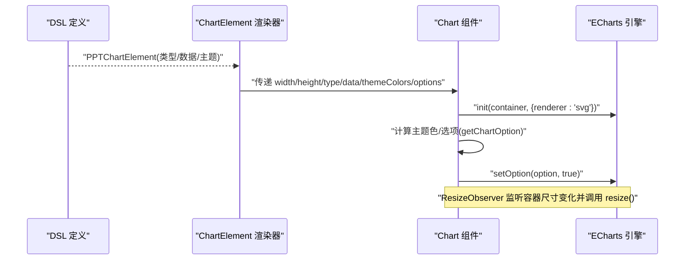
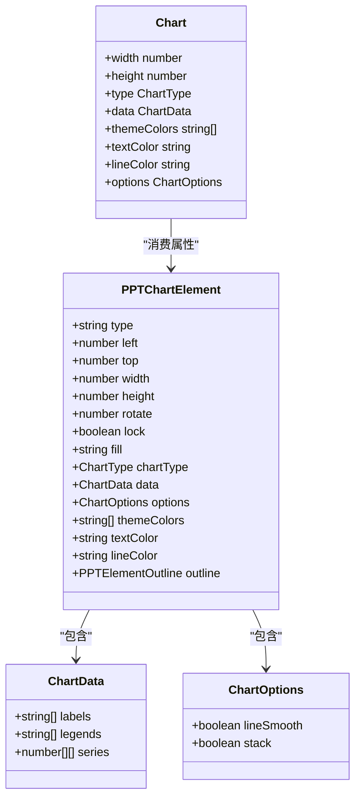
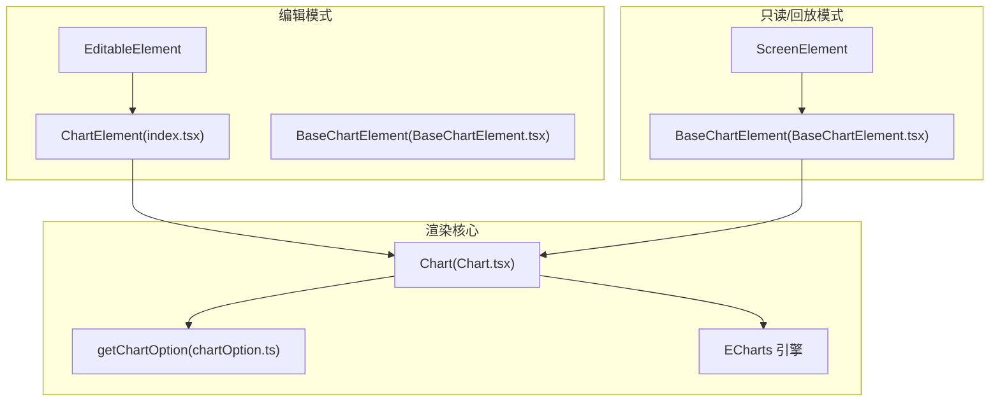
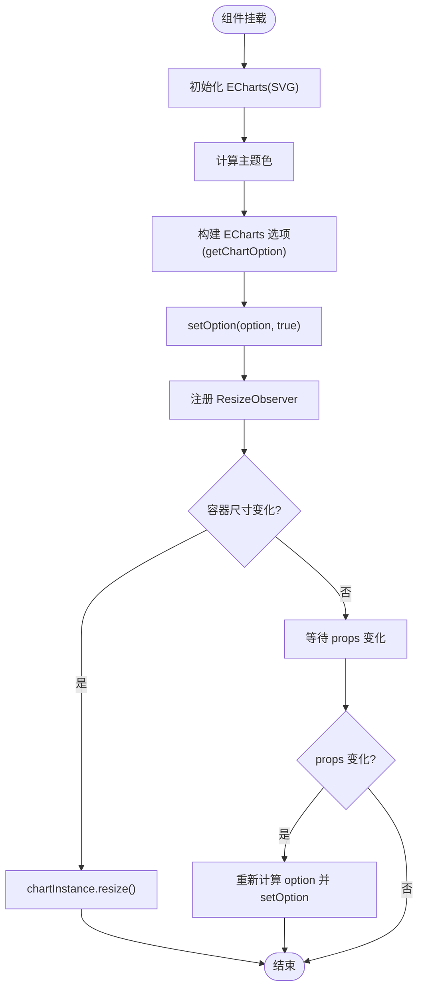
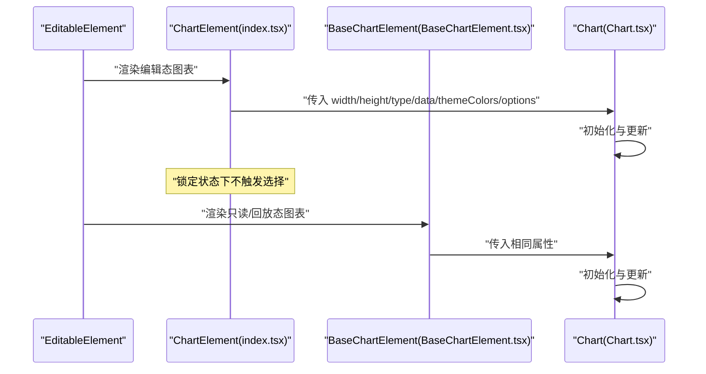
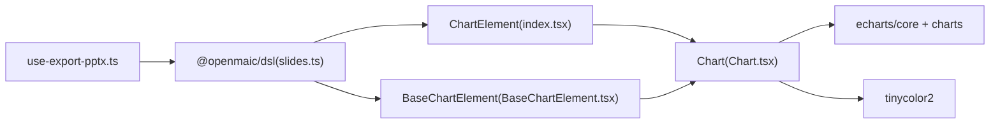

# 图表元素组件

<cite>
**本文引用的文件**   
- [components/slide-renderer/components/element/ChartElement/index.tsx](file://components/slide-renderer/components/element/ChartElement/index.tsx)
- [components/slide-renderer/components/element/ChartElement/BaseChartElement.tsx](file://components/slide-renderer/components/element/ChartElement/BaseChartElement.tsx)
- [components/slide-renderer/components/element/ChartElement/Chart.tsx](file://components/slide-renderer/components/element/ChartElement/Chart.tsx)
- [components/slide-renderer/components/element/ChartElement/chartOption.ts](file://components/slide-renderer/components/element/ChartElement/chartOption.ts)
- [configs/chart.ts](file://configs/chart.ts)
- [packages/@openmaic/dsl/src/slides.ts](file://packages/@openmaic/dsl/src/slides.ts)
- [lib/export/use-export-pptx.ts](file://lib/export/use-export-pptx.ts)
- [lib/chat/pi/tools/call-agent.ts](file://lib/chat/pi/tools/call-agent.ts)
- [lib/orchestration/tool-schemas.ts](file://lib/orchestration/tool-schemas.ts)
- [components/slide-renderer/Editor/Canvas/EditableElement.tsx](file://components/slide-renderer/Editor/Canvas/EditableElement.tsx)
- [components/slide-renderer/Editor/ScreenElement.tsx](file://components/slide-renderer/Editor/ScreenElement.tsx)
</cite>

## 产品概述
本章节面向“图表元素组件”（ChartElement），它是 OpenMAIC 课件渲染体系中的可视化数据展示单元。该组件基于 ECharts 实现，支持多种图表类型与主题定制，提供编辑模式与只读/回放模式的统一渲染能力，并参与 PPTX 导出流程。其核心价值在于：
- 为课件生成、课堂讲解与回放提供一致的数据可视化体验
- 通过 DSL 驱动图表结构与样式，便于 AI 编排与工具链集成
- 在编辑器与播放端保持一致的交互与外观

适用场景包括：课堂演示中的数据对比、趋势分析、占比展示、多维雷达评估、散点相关性等；同时支持在白板或课件中动态绘制与更新。

## 核心业务流程
下图展示了从 DSL 到前端渲染的关键链路：DSL 定义图表结构，组件根据类型与数据生成 ECharts 配置，实例化并监听尺寸变化进行自适应渲染。

**图示来源** 
- [components/slide-renderer/components/element/ChartElement/index.tsx](file://components/slide-renderer/components/element/ChartElement/index.tsx)
- [components/slide-renderer/components/element/ChartElement/Chart.tsx](file://components/slide-renderer/components/element/ChartElement/Chart.tsx)
- [components/slide-renderer/components/element/ChartElement/chartOption.ts](file://components/slide-renderer/components/element/ChartElement/chartOption.ts)
- [packages/@openmaic/dsl/src/slides.ts](file://packages/@openmaic/dsl/src/slides.ts)

**章节来源**
- [components/slide-renderer/components/element/ChartElement/index.tsx](file://components/slide-renderer/components/element/ChartElement/index.tsx)
- [components/slide-renderer/components/element/ChartElement/Chart.tsx](file://components/slide-renderer/components/element/ChartElement/Chart.tsx)
- [components/slide-renderer/components/element/ChartElement/chartOption.ts](file://components/slide-renderer/components/element/ChartElement/chartOption.ts)
- [packages/@openmaic/dsl/src/slides.ts](file://packages/@openmaic/dsl/src/slides.ts)

## 功能模块清单
- 图表渲染与初始化
  - 职责：根据 DSL 提供的 type、data、themeColors、options 生成 ECharts 配置并初始化实例
  - 验收要点：不同 chartType 均能正确渲染；空数据时不报错；尺寸变化自动适配
- 编辑模式与只读模式
  - 职责：编辑模式下支持选中与拖拽；只读/回放模式仅渲染
  - 验收要点：锁定状态不可选；缩略图下禁用指针事件
- 主题与样式定制
  - 职责：主题色推导、文本颜色、网格线颜色、圆角、堆叠、平滑曲线等
  - 验收要点：单色主题自动生成多色；textColor/lineColor 生效；stack/lineSmooth 控制
- 数据模型与校验
  - 职责：遵循 DSL 的 ChartData/PPTChartElement 结构；防御性检查 series 非空
  - 验收要点：非法数据返回 null 且不崩溃
- 导出集成
  - 职责：将图表映射至 PPTX 对应类型，参与导出流程
  - 验收要点：bar/column/line/radar/pie/scatter 等类型映射正确

**章节来源**
- [components/slide-renderer/components/element/ChartElement/index.tsx](file://components/slide-renderer/components/element/ChartElement/index.tsx)
- [components/slide-renderer/components/element/ChartElement/BaseChartElement.tsx](file://components/slide-renderer/components/element/ChartElement/BaseChartElement.tsx)
- [components/slide-renderer/components/element/ChartElement/Chart.tsx](file://components/slide-renderer/components/element/ChartElement/Chart.tsx)
- [components/slide-renderer/components/element/ChartElement/chartOption.ts](file://components/slide-renderer/components/element/ChartElement/chartOption.ts)
- [configs/chart.ts](file://configs/chart.ts)
- [lib/export/use-export-pptx.ts](file://lib/export/use-export-pptx.ts)

## 数据与状态
- 核心数据结构
  - ChartType：'bar' | 'column' | 'line' | 'pie' | 'ring' | 'area' | 'radar' | 'scatter'
  - ChartOptions：lineSmooth、stack
  - ChartData：labels、legends、series（二维数组）
  - PPTChartElement：type='chart'，包含位置、旋转、填充、边框、主题色、文字颜色、网格颜色、扩展选项与数据
- 关键状态流转
  - 初始化：创建 ECharts 实例，设置 SVG 渲染器
  - 更新：props 变化时重新计算 option 并 setOption(true)
  - 响应式：ResizeObserver 监听容器尺寸变化，触发 resize()
- 数据所有权边界
  - 数据源由 DSL 提供，组件仅负责渲染与交互；编辑态选择逻辑由上层 Editor 处理

**图示来源** 
- [packages/@openmaic/dsl/src/slides.ts](file://packages/@openmaic/dsl/src/slides.ts)
- [components/slide-renderer/components/element/ChartElement/Chart.tsx](file://components/slide-renderer/components/element/ChartElement/Chart.tsx)

**章节来源**
- [packages/@openmaic/dsl/src/slides.ts](file://packages/@openmaic/dsl/src/slides.ts)
- [components/slide-renderer/components/element/ChartElement/Chart.tsx](file://components/slide-renderer/components/element/ChartElement/Chart.tsx)

## 关键约束与边界
- 支持的图表类型
  - 柱状图(bar)、条形图(column)、折线图(line)、面积图(area)、饼图(pie)、环形图(ring)、雷达图(radar)、散点图(scatter)
  - 类型映射与默认数据见配置文件
- 数据约束
  - series 必须为非空数组，否则 getChartOption 返回 null，避免无效渲染
  - pie/ring/scatter 对 series 的结构有特定要求（如单系列值数组或双系列坐标）
- 交互与编辑
  - 编辑模式下，lock=true 的元素不可选中；缩略图目标下禁用指针事件
  - 选择回调由上层 Editor 注入，组件本身不维护全局状态
- 性能与渲染
  - 使用 SVG 渲染器，适合静态与中小规模数据；大数据量建议分页/采样或使用 Canvas 渲染器
  - 通过 ResizeObserver 避免重复初始化，仅在 props 变化时更新 option
- 导出限制
  - 导出层将 chartType 映射到 pptxgenjs 的 ChartType；部分类型（如 radar）在导出时需特殊处理
- 第三方依赖
  - ECharts 按需引入 BarChart、LineChart、PieChart、ScatterChart、RadarChart、LegendComponent、SVGRenderer
  - 主题色生成依赖 tinycolor2

**章节来源**
- [components/slide-renderer/components/element/ChartElement/chartOption.ts](file://components/slide-renderer/components/element/ChartElement/chartOption.ts)
- [configs/chart.ts](file://configs/chart.ts)
- [components/slide-renderer/components/element/ChartElement/index.tsx](file://components/slide-renderer/components/element/ChartElement/index.tsx)
- [components/slide-renderer/components/element/ChartElement/BaseChartElement.tsx](file://components/slide-renderer/components/element/ChartElement/BaseChartElement.tsx)
- [lib/export/use-export-pptx.ts](file://lib/export/use-export-pptx.ts)
- [components/slide-renderer/components/element/ChartElement/Chart.tsx](file://components/slide-renderer/components/element/ChartElement/Chart.tsx)

## 架构总览
下图概览了图表元素在编辑与只读两种模式下的组件关系与数据流向。

**图示来源** 
- [components/slide-renderer/Editor/Canvas/EditableElement.tsx](file://components/slide-renderer/Editor/Canvas/EditableElement.tsx)
- [components/slide-renderer/Editor/ScreenElement.tsx](file://components/slide-renderer/Editor/ScreenElement.tsx)
- [components/slide-renderer/components/element/ChartElement/index.tsx](file://components/slide-renderer/components/element/ChartElement/index.tsx)
- [components/slide-renderer/components/element/ChartElement/BaseChartElement.tsx](file://components/slide-renderer/components/element/ChartElement/BaseChartElement.tsx)
- [components/slide-renderer/components/element/ChartElement/Chart.tsx](file://components/slide-renderer/components/element/ChartElement/Chart.tsx)
- [components/slide-renderer/components/element/ChartElement/chartOption.ts](file://components/slide-renderer/components/element/ChartElement/chartOption.ts)

## 详细组件分析

### 图表渲染核心（Chart.tsx）
- 初始化与生命周期
  - 使用 useRef 保存 DOM 引用与 ECharts 实例
  - 初始化时指定 SVG 渲染器，确保可缩放与清晰输出
  - 通过 ResizeObserver 监听容器尺寸变化，调用 resize()
- 数据更新策略
  - useMemo 缓存 updateOption 函数，当 type/data/themeColors/textColor/lineColor/options 变化时触发 setOption(true)
  - 防御性检查：series 为空则返回 null，避免无效渲染
- 主题与样式
  - 主题色推导：若少于 10 个颜色，使用 tinycolor2 生成类似色系以补齐
  - 文本与网格颜色通过 textColor/lineColor 注入 axisLabel/axisLine/splitLine
- 动画与过渡
  - 依赖 ECharts 内置动画；可通过 options.lineSmooth 控制折线平滑
  - 未显式配置动画时长，保持默认行为

**图示来源** 
- [components/slide-renderer/components/element/ChartElement/Chart.tsx](file://components/slide-renderer/components/element/ChartElement/Chart.tsx)
- [components/slide-renderer/components/element/ChartElement/chartOption.ts](file://components/slide-renderer/components/element/ChartElement/chartOption.ts)

**章节来源**
- [components/slide-renderer/components/element/ChartElement/Chart.tsx](file://components/slide-renderer/components/element/ChartElement/Chart.tsx)
- [components/slide-renderer/components/element/ChartElement/chartOption.ts](file://components/slide-renderer/components/element/ChartElement/chartOption.ts)

### 编辑模式与只读模式
- 编辑模式（ChartElement/index.tsx）
  - 接收 elementInfo 与 selectElement 回调
  - 处理鼠标/触摸事件，阻止冒泡并在未锁定时触发选择
  - 应用旋转、背景色、边框与占位布局
- 只读/回放模式（BaseChartElement.tsx）
  - 仅渲染图表，缩略图目标下禁用指针事件
  - 同样应用旋转、背景色、边框与占位布局

**图示来源** 
- [components/slide-renderer/Editor/Canvas/EditableElement.tsx](file://components/slide-renderer/Editor/Canvas/EditableElement.tsx)
- [components/slide-renderer/Editor/ScreenElement.tsx](file://components/slide-renderer/Editor/ScreenElement.tsx)
- [components/slide-renderer/components/element/ChartElement/index.tsx](file://components/slide-renderer/components/element/ChartElement/index.tsx)
- [components/slide-renderer/components/element/ChartElement/BaseChartElement.tsx](file://components/slide-renderer/components/element/ChartElement/BaseChartElement.tsx)
- [components/slide-renderer/components/element/ChartElement/Chart.tsx](file://components/slide-renderer/components/element/ChartElement/Chart.tsx)

**章节来源**
- [components/slide-renderer/components/element/ChartElement/index.tsx](file://components/slide-renderer/components/element/ChartElement/index.tsx)
- [components/slide-renderer/components/element/ChartElement/BaseChartElement.tsx](file://components/slide-renderer/components/element/ChartElement/BaseChartElement.tsx)
- [components/slide-renderer/Editor/Canvas/EditableElement.tsx](file://components/slide-renderer/Editor/Canvas/EditableElement.tsx)
- [components/slide-renderer/Editor/ScreenElement.tsx](file://components/slide-renderer/Editor/ScreenElement.tsx)

### 图表类型与配置（chartOption.ts）
- 支持的类型与特性
  - bar/column：分类轴与数值轴，支持标签显示与圆角
  - line/area：折线与面积图，支持平滑与堆叠
  - pie/ring：饼图与环形图，强调样式与标签
  - radar：雷达图，指标名称来自 labels
  - scatter：散点图，支持双系列坐标
- 通用样式
  - color：主题色数组
  - textStyle：文本颜色
  - legend：多系列时底部图例
  - splitLine：网格线颜色
- 堆叠与平滑
  - options.stack 启用堆叠
  - options.lineSmooth 启用平滑曲线

**章节来源**
- [components/slide-renderer/components/element/ChartElement/chartOption.ts](file://components/slide-renderer/components/element/ChartElement/chartOption.ts)

### 预设主题与默认数据（configs/chart.ts）
- CHART_TYPE_MAP：中文名称映射，便于 UI 展示
- CHART_DEFAULT_DATA：各类型的默认数据样例，用于快速预览与测试
- CHART_PRESET_THEMES：多套预设主题色，供编辑器选择

**章节来源**
- [configs/chart.ts](file://configs/chart.ts)

### DSL 数据模型（slides.ts）
- ChartType、ChartOptions、ChartData、PPTChartElement 的定义与注释
- 明确 chartType 的基础类型与衍生关系，以及数据结构的字段含义

**章节来源**
- [packages/@openmaic/dsl/src/slides.ts](file://packages/@openmaic/dsl/src/slides.ts)

### 导出集成（use-export-pptx.ts）
- 将 chartType 映射到 pptxgenjs 的 ChartType（bar、line、area、radar、scatter、pie、doughnut）
- 针对不同类型设置导出参数（如 marker、overlap、gapWidth 等）

**章节来源**
- [lib/export/use-export-pptx.ts](file://lib/export/use-export-pptx.ts)

### 工具与编排集成（call-agent.ts、tool-schemas.ts）
- call-agent.ts：校验白板上绘制图表的参数，包含 chartType、位置、尺寸、数据与主题色
- tool-schemas.ts：定义“添加图表”工具的参数描述，便于 AI 编排生成

**章节来源**
- [lib/chat/pi/tools/call-agent.ts](file://lib/chat/pi/tools/call-agent.ts)
- [lib/orchestration/tool-schemas.ts](file://lib/orchestration/tool-schemas.ts)

## 依赖分析
- 组件耦合
  - ChartElement/BaseChartElement 依赖 Chart 与 ElementOutline
  - Chart 依赖 ECharts 与 tinycolor2
  - 所有组件消费 DSL 类型定义
- 外部依赖
  - ECharts：按需引入图表与组件
  - tinycolor2：主题色推导
  - pptxgenjs：导出阶段使用

**图示来源** 
- [packages/@openmaic/dsl/src/slides.ts](file://packages/@openmaic/dsl/src/slides.ts)
- [components/slide-renderer/components/element/ChartElement/index.tsx](file://components/slide-renderer/components/element/ChartElement/index.tsx)
- [components/slide-renderer/components/element/ChartElement/BaseChartElement.tsx](file://components/slide-renderer/components/element/ChartElement/BaseChartElement.tsx)
- [components/slide-renderer/components/element/ChartElement/Chart.tsx](file://components/slide-renderer/components/element/ChartElement/Chart.tsx)
- [lib/export/use-export-pptx.ts](file://lib/export/use-export-pptx.ts)

**章节来源**
- [packages/@openmaic/dsl/src/slides.ts](file://packages/@openmaic/dsl/src/slides.ts)
- [components/slide-renderer/components/element/ChartElement/index.tsx](file://components/slide-renderer/components/element/ChartElement/index.tsx)
- [components/slide-renderer/components/element/ChartElement/BaseChartElement.tsx](file://components/slide-renderer/components/element/ChartElement/BaseChartElement.tsx)
- [components/slide-renderer/components/element/ChartElement/Chart.tsx](file://components/slide-renderer/components/element/ChartElement/Chart.tsx)
- [lib/export/use-export-pptx.ts](file://lib/export/use-export-pptx.ts)

## 性能考虑
- 渲染优化
  - 使用 SVG 渲染器提升清晰度与缩放质量；大数据量时可切换为 Canvas 渲染器
  - 通过 ResizeObserver 避免频繁重建实例，仅在尺寸变化时 resize()
  - useMemo 缓存 option 计算，减少不必要的重渲染
- 数据优化
  - 对超大数据集进行采样或分页加载，降低单次渲染压力
  - 合理设置 series 长度与标签数量，避免过多 DOM/SVG 节点
- 动画与交互
  - 默认动画由 ECharts 控制；如需自定义，可在 options 中调整动画时长与缓动
  - 交互（缩放、筛选、下钻、联动）需在上层 Editor 或业务层实现，当前组件聚焦于渲染

[本节为通用指导，不直接分析具体文件]

## 故障排查指南
- 图表不显示
  - 检查 series 是否为空数组；为空时 getChartOption 返回 null
  - 确认容器尺寸有效且可见
- 主题色异常
  - 检查 themeColors 长度与格式；少于 10 个时会按类似色系补齐
- 导出失败
  - 核对 chartType 是否在导出映射范围内；部分类型需要额外参数
- 交互无响应
  - 编辑模式下确认 lock=false；缩略图目标下禁用指针事件属预期行为

**章节来源**
- [components/slide-renderer/components/element/ChartElement/chartOption.ts](file://components/slide-renderer/components/element/ChartElement/chartOption.ts)
- [components/slide-renderer/components/element/ChartElement/BaseChartElement.tsx](file://components/slide-renderer/components/element/ChartElement/BaseChartElement.tsx)
- [lib/export/use-export-pptx.ts](file://lib/export/use-export-pptx.ts)

## 结论
ChartElement 组件以 DSL 为核心，结合 ECharts 提供了稳定、可扩展的图表渲染能力。通过统一的类型定义与配置接口，既满足编辑器的交互需求，也保证只读/回放的一致性体验。配合导出与工具链，形成从生成、编辑到导出的完整闭环。未来可在大数据量与复杂交互方面进一步增强，以满足更广泛的课堂与演示场景。