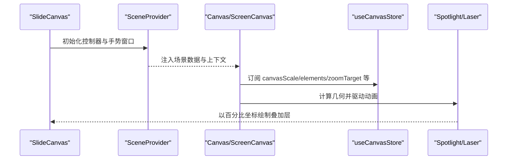
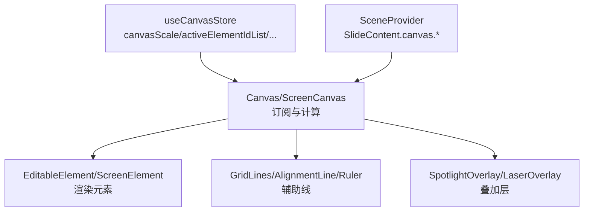
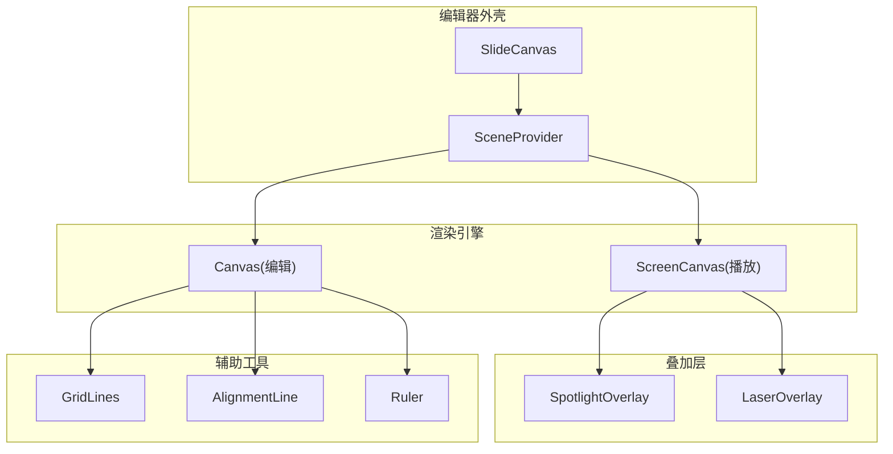
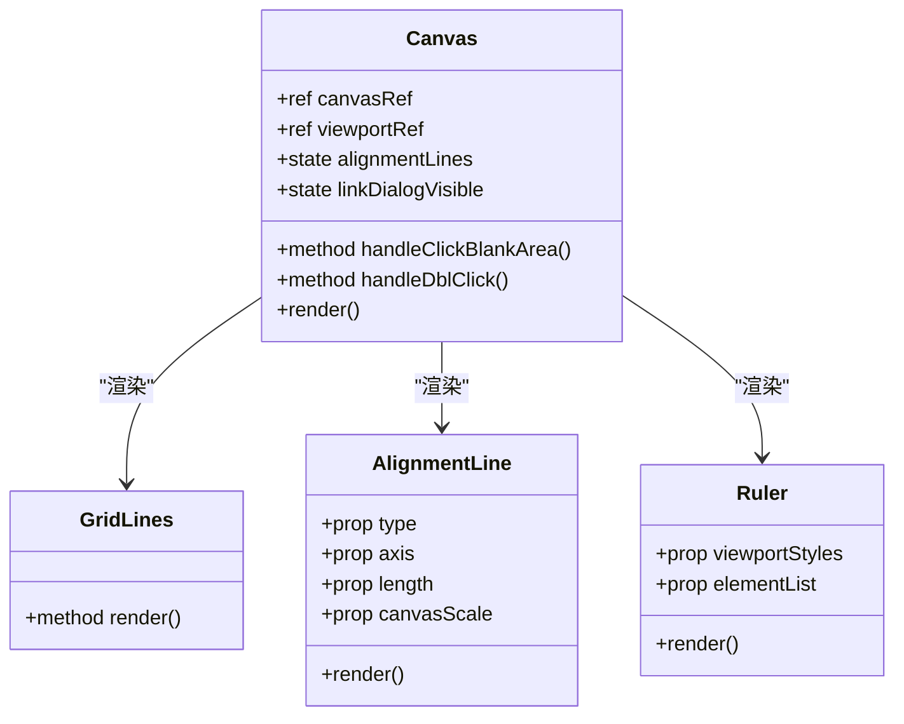
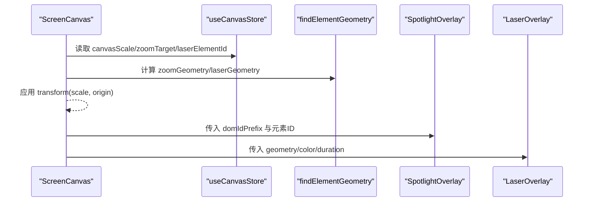
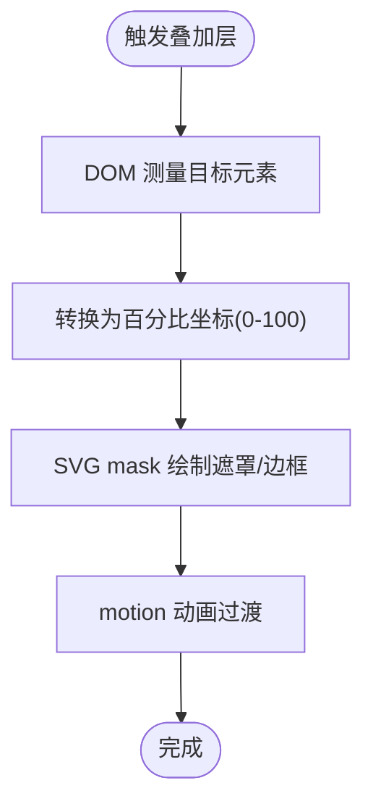
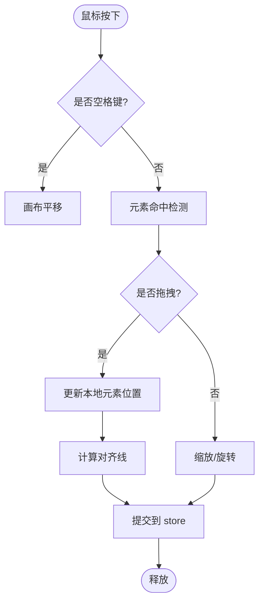
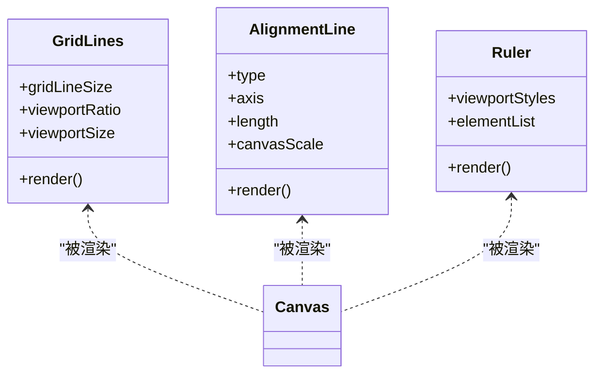
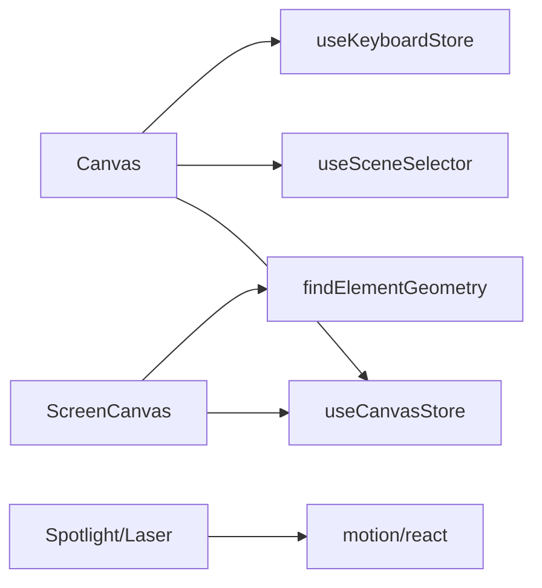

# 幻灯片画布组件

<cite>
**本文引用的文件**   
- [SlideCanvas.tsx](file://components/edit/surfaces/slide/SlideCanvas.tsx)
- [index.tsx](file://components/slide-renderer/Editor/index.tsx)
- [ScreenCanvas.tsx](file://components/slide-renderer/Editor/ScreenCanvas.tsx)
- [Canvas/index.tsx](file://components/slide-renderer/Editor/Canvas/index.tsx)
- [GridLines.tsx](file://components/slide-renderer/Editor/Canvas/GridLines.tsx)
- [AlignmentLine.tsx](file://components/slide-renderer/Editor/Canvas/AlignmentLine.tsx)
- [MouseSelection.tsx](file://components/slide-renderer/Editor/Canvas/MouseSelection.tsx)
- [Ruler.tsx](file://components/slide-renderer/Editor/Canvas/Ruler.tsx)
- [LaserOverlay.tsx](file://components/slide-renderer/Editor/LaserOverlay.tsx)
- [SpotlightOverlay.tsx](file://components/slide-renderer/Editor/SpotlightOverlay.tsx)
</cite>

## 产品概述
本组件为 OpenMAIC 的幻灯片画布渲染与编辑核心，提供：
- 基于 React + CSS transform 的高性能缩放/平移画布
- 元素选择、拖拽、旋转、缩放等交互能力
- 网格线、对齐线、标尺等辅助工具
- 激光笔与聚光灯叠加层效果（播放/编辑模式一致）
- 通过 SceneProvider 将编辑变更自动同步到舞台状态，实现“所见即所得”的编辑体验

适用场景：课件编辑、课堂回放、交互式演示。

## 核心业务流程
- 编辑入口：SlideCanvas 包裹 Canvas，并注入 SceneProvider，使所有渲染提交进入 slide-edit-session，自动持久化。
- 渲染路径：
  - 编辑模式：Canvas 负责元素操作、选择、对齐、网格、标尺等。
  - 播放模式：ScreenCanvas 负责背景、元素列表、缩放目标、叠加层（激光/聚光）。
- 叠加层：SpotlightOverlay 与 LaserPointerOverlay/LaserOverlay 根据当前选中元素或动作触发，使用百分比坐标与 DOM 测量定位。
- 键盘与手势：Esc 取消创建态；空格键切换画布拖拽；右键上下文菜单提供常用操作。

**章节来源**
- [SlideCanvas.tsx:19-76](file://components/edit/surfaces/slide/SlideCanvas.tsx#L19-L76)
- [index.tsx:10-18](file://components/slide-renderer/Editor/index.tsx#L10-L18)
- [ScreenCanvas.tsx:18-123](file://components/slide-renderer/Editor/ScreenCanvas.tsx#L18-L123)
- [Canvas/index.tsx:44-108](file://components/slide-renderer/Editor/Canvas/index.tsx#L44-L108)

## 功能模块清单
- 画布容器与视口
  - 职责：管理视口尺寸、缩放比例、平移位置；承载元素与叠加层。
  - 验收要点：缩放后元素不失真、平移流畅、无重排抖动。
- 元素渲染与操作
  - 职责：渲染 PPTElement，支持选择、拖拽、旋转、缩放、连线关键点移动。
  - 验收要点：多元素选择、对齐吸附、变换边界正确。
- 辅助线系统
  - 职责：网格线、对齐线、标尺显示与联动。
  - 验收要点：网格颜色自适应背景亮度；对齐线随拖拽实时出现；标尺刻度与选区高亮。
- 叠加层效果
  - 职责：激光笔与聚光灯效果，按元素几何与 DOM 测量定位。
  - 验收要点：跨模式（编辑/播放）效果一致，动画平滑。
- 上下文菜单与快捷键
  - 职责：粘贴、全选、标尺开关、网格大小、重置页面等。
  - 验收要点：快捷键响应、菜单项禁用/隐藏逻辑正确。

**章节来源**
- [Canvas/index.tsx:109-175](file://components/slide-renderer/Editor/Canvas/index.tsx#L109-L175)
- [Canvas/index.tsx:176-224](file://components/slide-renderer/Editor/Canvas/index.tsx#L176-L224)
- [GridLines.tsx:6-49](file://components/slide-renderer/Editor/Canvas/GridLines.tsx#L6-L49)
- [AlignmentLine.tsx:13-38](file://components/slide-renderer/Editor/Canvas/AlignmentLine.tsx#L13-L38)
- [Ruler.tsx:12-122](file://components/slide-renderer/Editor/Canvas/Ruler.tsx#L12-L122)

## 数据与状态
- 核心状态（来自 useCanvasStore）
  - canvasScale：画布缩放比例
  - activeElementIdList / handleElementId / activeGroupElementId：选择与激活状态
  - hiddenElementIdList：隐藏元素集合
  - creatingElement / creatingCustomShape：创建态控制
  - showRuler / gridLineSize：标尺与网格配置
  - viewportRatio / viewportSize：视口宽高比与基准尺寸
  - laserElementId / laserOptions / zoomTarget / spotlightElementId / spotlightOptions：叠加层与缩放目标
- 场景数据（来自 SceneProvider/useSceneSelector）
  - SlideContent.canvas.elements：元素列表
  - SlideContent.canvas.background：背景样式
- 本地缓存（Canvas 内部）
  - elementListRef / elementList：用于拖拽/缩放/旋转的本地副本，避免频繁深拷贝导致的重渲染

**章节来源**
- [Canvas/index.tsx:62-101](file://components/slide-renderer/Editor/Canvas/index.tsx#L62-L101)
- [ScreenCanvas.tsx:18-59](file://components/slide-renderer/Editor/ScreenCanvas.tsx#L18-L59)

## 关键约束与边界
- 坐标系统
  - 元素与叠加层统一采用百分比坐标（0-100），确保缩放与平移一致性。
  - 聚光灯通过 DOM getBoundingClientRect 测量，避免百分比转换带来的对齐偏差。
- 渲染性能
  - 使用 CSS transform 进行缩放/平移，减少布局重排；叠加层在 scale 层外绘制，避免重绘放大区域。
  - 局部订阅（useSceneSelector 精确切片）降低无关更新。
- 交互边界
  - 空白点击清除选择；空格键切换画布拖拽；双击空白插入文本（预留接口）。
  - 右键菜单需忽略 ContextMenu Portal 节点，防止误触发空白点击逻辑。
- 扩展点
  - 自定义叠加层：遵循百分比坐标约定，使用 AnimatePresence 控制显隐与过渡。
  - 新元素类型：在 EditableElement/ScreenElement 中注册渲染分支，并在操作钩子中补充行为。

**章节来源**
- [ScreenCanvas.tsx:61-123](file://components/slide-renderer/Editor/ScreenCanvas.tsx#L61-L123)
- [SpotlightOverlay.tsx:43-82](file://components/slide-renderer/Editor/SpotlightOverlay.tsx#L43-L82)
- [Canvas/index.tsx:138-168](file://components/slide-renderer/Editor/Canvas/index.tsx#L138-L168)

## 架构总览

**图表来源**
- [SlideCanvas.tsx:33-76](file://components/edit/surfaces/slide/SlideCanvas.tsx#L33-L76)
- [index.tsx:10-18](file://components/slide-renderer/Editor/index.tsx#L10-L18)
- [ScreenCanvas.tsx:18-123](file://components/slide-renderer/Editor/ScreenCanvas.tsx#L18-L123)
- [Canvas/index.tsx:226-352](file://components/slide-renderer/Editor/Canvas/index.tsx#L226-L352)

## 详细组件分析

### 画布渲染引擎与坐标系统（Canvas）
- 视口与缩放
  - 外层 wrapper 设置 width/height/left/top 由 viewportStyles 与 canvasScale 决定。
  - 内层 viewport 使用 transform: scale(canvasScale) 实现缩放，保证子元素相对坐标不变。
- 元素列表与本地副本
  - 从 SceneProvider 订阅 elements，复制到 elementListRef 与 elementList，供拖拽/缩放等操作直接修改，减少状态同步开销。
- 选择与多选
  - 单击选择单元素；按住 Shift 或框选实现多选；空白点击清空选择。
- 拖拽与对齐
  - 拖拽过程中计算对齐线（水平/垂直），吸附阈值与长度由算法决定。
- 旋转与缩放
  - 旋转围绕元素中心；缩放支持单/多元素，保持比例或自由缩放。
- 网格线与标尺
  - GridLines 根据 viewportSize 与 gridLineSize 生成 SVG path；颜色依据背景亮度动态选择。
  - Ruler 显示主/次刻度，并在有选中元素时高亮范围。

**图表来源**
- [Canvas/index.tsx:62-108](file://components/slide-renderer/Editor/Canvas/index.tsx#L62-L108)
- [GridLines.tsx:6-49](file://components/slide-renderer/Editor/Canvas/GridLines.tsx#L6-L49)
- [AlignmentLine.tsx:13-38](file://components/slide-renderer/Editor/Canvas/AlignmentLine.tsx#L13-L38)
- [Ruler.tsx:12-122](file://components/slide-renderer/Editor/Canvas/Ruler.tsx#L12-L122)

**章节来源**
- [Canvas/index.tsx:226-352](file://components/slide-renderer/Editor/Canvas/index.tsx#L226-L352)

### 屏幕渲染与缩放目标（ScreenCanvas）
- 背景与元素
  - 背景样式由 useSlideBackgroundStyle 计算；元素列表映射为 ScreenElement。
- 缩放目标
  - zoomTarget 包含 elementId 与 scale；通过 findElementGeometry 获取 centerX/centerY，设置 transformOrigin 与 scale。
- 叠加层
  - SpotlightOverlay 覆盖整页；LaserOverlay 基于 PercentageGeometry 百分比定位，使用 motion 动画。

**图表来源**
- [ScreenCanvas.tsx:18-123](file://components/slide-renderer/Editor/ScreenCanvas.tsx#L18-L123)

**章节来源**
- [ScreenCanvas.tsx:18-123](file://components/slide-renderer/Editor/ScreenCanvas.tsx#L18-L123)

### 激光笔与聚光灯叠加层
- 激光笔
  - 从最近角飞入元素中心，带呼吸光环与光核；使用 AnimatePresence 控制入场/离场。
- 聚光灯
  - 通过 DOM 测量目标元素的 .element-content 或自身，转换为 viewBox 0-100 坐标；使用 SVG mask 实现遮罩与白边框。
- 编辑模式适配
  - 通过 domIdPrefix="editable-element-" 匹配编辑器的元素 ID 前缀，保证效果一致。

**图表来源**
- [LaserOverlay.tsx:20-83](file://components/slide-renderer/Editor/LaserOverlay.tsx#L20-L83)
- [SpotlightOverlay.tsx:33-82](file://components/slide-renderer/Editor/SpotlightOverlay.tsx#L33-L82)

**章节来源**
- [LaserOverlay.tsx:20-83](file://components/slide-renderer/Editor/LaserOverlay.tsx#L20-L83)
- [SpotlightOverlay.tsx:33-182](file://components/slide-renderer/Editor/SpotlightOverlay.tsx#L33-L182)

### 元素选择、拖拽与变换
- 选择
  - 单击选择；空白点击清空；Shift+拖拽框选多选。
- 拖拽
  - 使用本地 elementListRef 记录拖拽过程中的位置变化，完成后回写 store。
- 旋转与缩放
  - 旋转围绕中心点；缩放支持多元素，保持相对布局。
- 对齐线
  - 拖拽过程中计算与其他元素的边距差，达到阈值显示对齐线。

**图表来源**
- [Canvas/index.tsx:109-175](file://components/slide-renderer/Editor/Canvas/index.tsx#L109-L175)

**章节来源**
- [Canvas/index.tsx:109-175](file://components/slide-renderer/Editor/Canvas/index.tsx#L109-L175)

### 网格线、对齐线和参考线
- 网格线
  - 根据 viewportSize 与 gridLineSize 生成 SVG path；颜色依据背景亮度选择黑/白半透明。
- 对齐线
  - 拖拽过程中计算轴坐标与长度，按 canvasScale 换算像素位置。
- 参考线（标尺）
  - 显示主/次刻度；当存在选中元素时，高亮其在标尺上的范围。

**图表来源**
- [GridLines.tsx:6-49](file://components/slide-renderer/Editor/Canvas/GridLines.tsx#L6-L49)
- [AlignmentLine.tsx:13-38](file://components/slide-renderer/Editor/Canvas/AlignmentLine.tsx#L13-L38)
- [Ruler.tsx:12-122](file://components/slide-renderer/Editor/Canvas/Ruler.tsx#L12-L122)

**章节来源**
- [GridLines.tsx:6-49](file://components/slide-renderer/Editor/Canvas/GridLines.tsx#L6-L49)
- [AlignmentLine.tsx:13-38](file://components/slide-renderer/Editor/Canvas/AlignmentLine.tsx#L13-L38)
- [Ruler.tsx:12-122](file://components/slide-renderer/Editor/Canvas/Ruler.tsx#L12-L122)

### 高性能渲染优化与 GPU 加速
- CSS transform 缩放/平移：避免布局重排，利用合成层提升帧率。
- 局部订阅：useSceneSelector 仅订阅需要的字段，减少不必要的重渲染。
- 本地副本：elementListRef 用于高频操作，降低 store 同步成本。
- 叠加层独立层级：在 scale 层外绘制，避免放大区域的重复重绘。
- SVG 路径一次性生成：GridLines 使用 useMemo 缓存 path，避免每帧计算。

**章节来源**
- [Canvas/index.tsx:91-101](file://components/slide-renderer/Editor/Canvas/index.tsx#L91-L101)
- [GridLines.tsx:15-37](file://components/slide-renderer/Editor/Canvas/GridLines.tsx#L15-L37)
- [ScreenCanvas.tsx:61-99](file://components/slide-renderer/Editor/ScreenCanvas.tsx#L61-L99)

### 画布扩展开发与自定义叠加层指南
- 新增元素类型
  - 在 EditableElement/ScreenElement 中增加渲染分支；在操作钩子中补充拖拽/缩放/旋转逻辑。
- 自定义叠加层
  - 遵循百分比坐标（0-100）；使用 AnimatePresence 控制显隐；如需 DOM 测量，优先使用 getBoundingClientRect 并转换为百分比。
- 事件处理最佳实践
  - 区分空白点击与菜单点击；空格键切换画布拖拽；Esc 取消创建态；右键菜单项阻止冒泡。

**章节来源**
- [SlideCanvas.tsx:33-76](file://components/edit/surfaces/slide/SlideCanvas.tsx#L33-L76)
- [Canvas/index.tsx:138-175](file://components/slide-renderer/Editor/Canvas/index.tsx#L138-L175)

## 依赖分析
- 组件耦合
  - Canvas 依赖 useCanvasStore、useSceneSelector、useKeyboardStore；内部组合多个 hooks 与子组件。
  - ScreenCanvas 依赖 useCanvasStore 与 geometry 工具函数。
  - 叠加层依赖 DOM 测量与 motion 动画库。
- 外部依赖
  - motion/react：动画与过渡
  - @openmaic/dsl：PPTElement 类型定义
  - lib/utils/geometry：元素几何计算

**图表来源**
- [Canvas/index.tsx:4-31](file://components/slide-renderer/Editor/Canvas/index.tsx#L4-L31)
- [ScreenCanvas.tsx:1-16](file://components/slide-renderer/Editor/ScreenCanvas.tsx#L1-L16)
- [LaserOverlay.tsx:1-10](file://components/slide-renderer/Editor/LaserOverlay.tsx#L1-L10)
- [SpotlightOverlay.tsx:1-10](file://components/slide-renderer/Editor/SpotlightOverlay.tsx#L1-L10)

**章节来源**
- [Canvas/index.tsx:4-31](file://components/slide-renderer/Editor/Canvas/index.tsx#L4-L31)
- [ScreenCanvas.tsx:1-16](file://components/slide-renderer/Editor/ScreenCanvas.tsx#L1-L16)

## 性能考虑
- 使用 transform 替代 top/left 定位，减少重排。
- 对昂贵计算（如网格 path、几何计算）使用 useMemo。
- 仅在必要时更新 store，拖拽过程使用本地副本。
- 叠加层使用 pointer-events-none，避免影响命中测试。

[本节为通用指导，不直接分析具体文件]

## 故障排查指南
- 聚光灯错位
  - 检查 domIdPrefix 是否与元素 ID 前缀一致；确认 .element-content 是否存在。
- 网格线不显示
  - 检查 gridLineSize 是否为 0；确认 viewportSize 与 viewportRatio 是否正确。
- 缩放目标异常
  - 检查 zoomTarget.elementId 是否存在；确认 findElementGeometry 返回的 centerX/centerY 有效。
- 右键菜单无效
  - 确认点击目标不是 ContextMenu Portal 节点；handler 未阻止冒泡。

**章节来源**
- [SpotlightOverlay.tsx:43-82](file://components/slide-renderer/Editor/SpotlightOverlay.tsx#L43-L82)
- [GridLines.tsx:6-22](file://components/slide-renderer/Editor/Canvas/GridLines.tsx#L6-L22)
- [ScreenCanvas.tsx:50-59](file://components/slide-renderer/Editor/ScreenCanvas.tsx#L50-L59)
- [Canvas/index.tsx:138-159](file://components/slide-renderer/Editor/Canvas/index.tsx#L138-L159)

## 结论
SlideCanvas 通过分层渲染、百分比坐标系统与 CSS transform 实现了高效、稳定的幻灯片画布。其叠加层与辅助工具提供了完整的编辑与演示体验。扩展开发应遵循坐标约定与事件处理规范，以获得一致的交互与性能表现。

[本节为总结性内容，不直接分析具体文件]