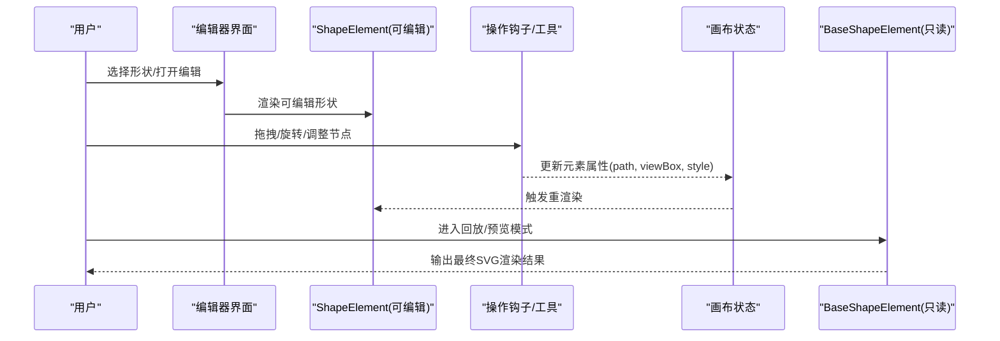
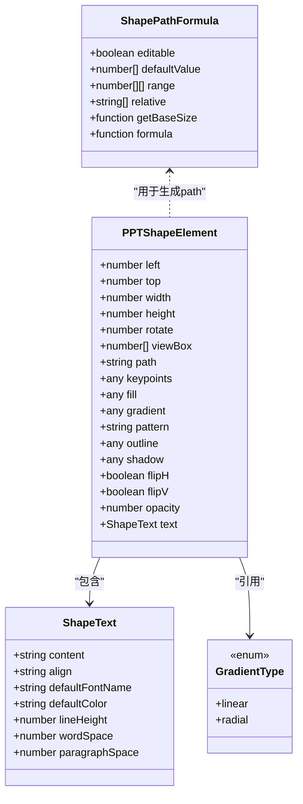
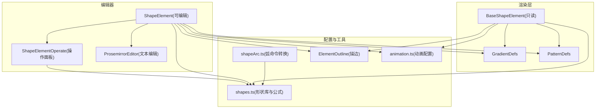
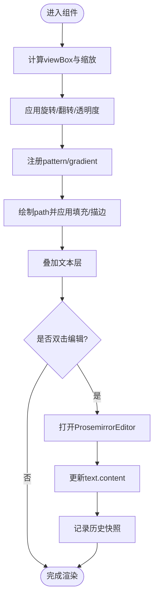
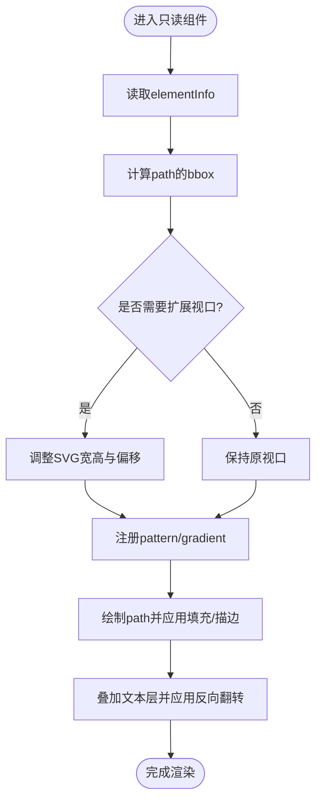
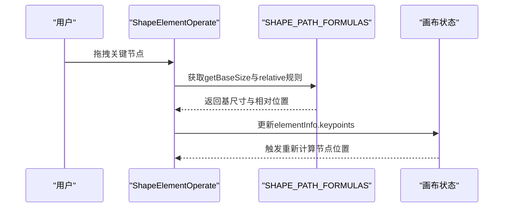
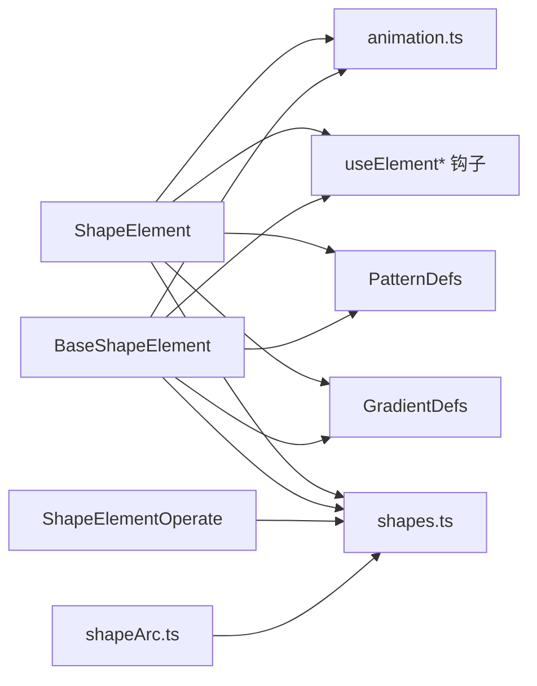

# 形状元素组件

<cite>
**本文引用的文件**   
- [components/slide-renderer/components/element/ShapeElement/index.tsx](file://components/slide-renderer/components/element/ShapeElement/index.tsx)
- [components/slide-renderer/components/element/ShapeElement/BaseShapeElement.tsx](file://components/slide-renderer/components/element/ShapeElement/BaseShapeElement.tsx)
- [components/slide-renderer/components/element/ShapeElement/GradientDefs.tsx](file://components/slide-renderer/components/element/ShapeElement/GradientDefs.tsx)
- [components/slide-renderer/components/element/ShapeElement/PatternDefs.tsx](file://components/slide-renderer/components/element/ShapeElement/PatternDefs.tsx)
- [components/slide-renderer/Editor/Canvas/Operate/ShapeElementOperate.tsx](file://components/slide-renderer/Editor/Canvas/Operate/ShapeElementOperate.tsx)
- [configs/shapes.ts](file://configs/shapes.ts)
- [packages/@openmaic/renderer/src/elements/shape/BaseShapeElement.tsx](file://packages/@openmaic/renderer/src/elements/shape/BaseShapeElement.tsx)
- [packages/@openmaic/importer/src/shapes/shapeArc.ts](file://packages/@openmaic/importer/src/shapes/shapeArc.ts)
- [components/slide-renderer/components/element/ElementOutline.tsx](file://components/slide-renderer/components/element/ElementOutline.tsx)
- [configs/animation.ts](file://configs/animation.ts)
</cite>

## 产品概述
本组件文档聚焦于 ShapeElement 形状元素组件，围绕 SVG 矢量图形的绘制与渲染机制展开，覆盖预定义形状库的使用、自定义形状的创建、渐变与图案填充、路径编辑与节点控制、组合与布尔运算、动画与交互状态，以及扩展图形库与跨浏览器兼容性优化。该组件在编辑器与播放/只读两种模式下分别提供可编辑与基础渲染能力，并通过统一的 DSL 数据模型驱动渲染。

## 核心业务流程
- 插入形状：从形状库选择预设或公式化形状，生成 path 与 viewBox，并写入元素属性（位置、尺寸、旋转等）。
- 编辑形状：支持拖拽缩放、旋转、关键节点调整（如圆角半径、切角比例），通过公式化路径实时更新 path。
- 样式设置：配置纯色、渐变（线性/径向）、图案（图片平铺）填充；设置描边宽度、颜色、虚线样式；添加阴影与翻转。
- 文本叠加：在形状内部叠加富文本内容，支持对齐、行距、字间距与段落间距。
- 导出与回放：在只读/回放模式下使用 BaseShapeElement 进行高效渲染，必要时对超出边界的路径做视口扩展以保证导出一致性。

**章节来源**
- [components/slide-renderer/components/element/ShapeElement/index.tsx](file://components/slide-renderer/components/element/ShapeElement/index.tsx)
- [components/slide-renderer/Editor/Canvas/Operate/ShapeElementOperate.tsx](file://components/slide-renderer/Editor/Canvas/Operate/ShapeElementOperate.tsx)
- [packages/@openmaic/renderer/src/elements/shape/BaseShapeElement.tsx](file://packages/@openmaic/renderer/src/elements/shape/BaseShapeElement.tsx)

## 功能模块清单
- 可编辑形状组件（ShapeElement/index.tsx）
  - 职责：承载形状 SVG 渲染、渐变/图案定义、文本编辑、选择与双击进入编辑、历史记录快照。
  - 验收要点：双击进入文本编辑；渐变与图案切换生效；边框与阴影正确应用；锁定状态下不可编辑。
- 只读/回放形状组件（BaseShapeElement.tsx）
  - 职责：高效渲染形状与文本，处理路径越界时的视口扩展，确保导出 PNG 时不被裁剪。
  - 验收要点：path 超出 viewBox 时仍完整显示；翻转后文字保持正向；无交互事件开销。
- 渐变定义（GradientDefs.tsx）
  - 职责：根据类型生成 linearGradient/radialGradient，支持角度旋转与多色标。
  - 验收要点：线性渐变按角度旋转；径向渐变颜色过渡正确。
- 图案定义（PatternDefs.tsx）
  - 职责：基于外部图片 URL 生成 pattern，使用 objectBoundingBox 单位适配形状尺寸。
  - 验收要点：图片平铺覆盖形状；preserveAspectRatio 切片适配。
- 形状操作面板（ShapeElementOperate.tsx）
  - 职责：渲染缩放手柄、旋转手柄、关键节点（keypoints）；计算节点位置与相对坐标。
  - 验收要点：节点随缩放/旋转正确定位；拖拽节点更新 pathFormula 参数。
- 形状库与公式（configs/shapes.ts）
  - 职责：维护预设形状列表与公式化路径（圆角矩形、切角、箭头、对话气泡等），提供 getBaseSize 与 relative 定位规则。
  - 验收要点：新增形状需声明 viewBox、path 与可选 pathFormula；公式化形状支持范围与默认值。
- 导入器弧命令（packages/@openmaic/importer/src/shapes/shapeArc.ts）
  - 职责：将 OOXML 弧规范转换为 SVG A 命令，保证导入 PPTX 时弧线一致。
  - 验收要点：顺时针扫掠、大弧判定、闭合 Z 指令正确。
- 通用描边（ElementOutline.tsx）
  - 职责：为元素绘制统一边框，支持颜色、宽度与虚线数组。
  - 验收要点：边框不随缩放失真；虚线样式正确。
- 动画配置（configs/animation.ts）
  - 职责：提供进入、强调、退出等动画类别与值，供形状元素叠加动画效果。
  - 验收要点：动画类名前缀与触发方式一致；与形状变换兼容。

**章节来源**
- [components/slide-renderer/components/element/ShapeElement/index.tsx](file://components/slide-renderer/components/element/ShapeElement/index.tsx)
- [components/slide-renderer/components/element/ShapeElement/BaseShapeElement.tsx](file://components/slide-renderer/components/element/ShapeElement/BaseShapeElement.tsx)
- [components/slide-renderer/components/element/ShapeElement/GradientDefs.tsx](file://components/slide-renderer/components/element/ShapeElement/GradientDefs.tsx)
- [components/slide-renderer/components/element/ShapeElement/PatternDefs.tsx](file://components/slide-renderer/components/element/ShapeElement/PatternDefs.tsx)
- [components/slide-renderer/Editor/Canvas/Operate/ShapeElementOperate.tsx](file://components/slide-renderer/Editor/Canvas/Operate/ShapeElementOperate.tsx)
- [configs/shapes.ts](file://configs/shapes.ts)
- [packages/@openmaic/importer/src/shapes/shapeArc.ts](file://packages/@openmaic/importer/src/shapes/shapeArc.ts)
- [components/slide-renderer/components/element/ElementOutline.tsx](file://components/slide-renderer/components/element/ElementOutline.tsx)
- [configs/animation.ts](file://configs/animation.ts)

## 数据与状态
- 形状元素数据结构（PPTShapeElement）
  - 几何：left/top/width/height、rotate、viewBox、path、keypoints（用于公式化形状的参数）。
  - 样式：fill、gradient（type/colors/rotate）、pattern（src）、outline（color/width/dasharray）、shadow、flipH/flipV、opacity。
  - 文本：text.content、align、defaultFontName、defaultColor、lineHeight、wordSpace、paragraphSpace。
- 状态流转
  - 编辑态：ShapeElement 监听鼠标/触摸事件，调用 updateElement/removeElementProps 更新状态，并记录历史快照。
  - 只读态：BaseShapeElement 仅读取 elementInfo，计算 path 的 bbox 以扩展 SVG 视口，避免导出裁剪。
- 数据所有权边界
  - 形状库与公式位于 configs/shapes.ts，作为只读配置被编辑器与渲染层共享。
  - 导入器 shapeArc.ts 负责将外部格式转为 SVG path，确保跨平台一致性。

**图表来源**
- [components/slide-renderer/components/element/ShapeElement/index.tsx](file://components/slide-renderer/components/element/ShapeElement/index.tsx)
- [configs/shapes.ts](file://configs/shapes.ts)

**章节来源**
- [components/slide-renderer/components/element/ShapeElement/index.tsx](file://components/slide-renderer/components/element/ShapeElement/index.tsx)
- [packages/@openmaic/renderer/src/elements/shape/BaseShapeElement.tsx](file://packages/@openmaic/renderer/src/elements/shape/BaseShapeElement.tsx)
- [configs/shapes.ts](file://configs/shapes.ts)

## 关键约束与边界
- SVG 路径与视口
  - path 可能超出 width×height 边界（如曲线连接器的凸出部分），只读渲染会计算 bbox 并扩展 SVG 视口，防止导出时被裁剪。
  - viewBox 必须为正数且有限，否则回退到 width/height。
- 渐变与图案优先级
  - 若存在 pattern，则优先使用图案填充；否则使用 gradient；两者均不存在时使用纯色 fill。
- 描边与缩放
  - 使用 vectorEffect="non-scaling-stroke" 确保描边宽度不受缩放影响。
- 翻转与文字方向
  - 父层对 SVG path 应用 flipStyle，文字层叠加相同 flipStyle 以抵消镜像，保持文字正向。
- 动画与交互
  - 动画类名前缀与触发方式由动画配置管理；形状元素本身不包含复杂动画逻辑，通常由上层容器注入动画类。
- 跨浏览器兼容性
  - 使用标准 SVG 元素（linearGradient、radialGradient、pattern、image）与 CSS transform；避免非标准属性。
  - 导出 PNG 时需确保 SVG 视口足够容纳所有几何，避免 html2canvas 裁剪。

**章节来源**
- [packages/@openmaic/renderer/src/elements/shape/BaseShapeElement.tsx](file://packages/@openmaic/renderer/src/elements/shape/BaseShapeElement.tsx)
- [components/slide-renderer/components/element/ShapeElement/GradientDefs.tsx](file://components/slide-renderer/components/element/ShapeElement/GradientDefs.tsx)
- [components/slide-renderer/components/element/ShapeElement/PatternDefs.tsx](file://components/slide-renderer/components/element/ShapeElement/PatternDefs.tsx)
- [components/slide-renderer/components/element/ElementOutline.tsx](file://components/slide-renderer/components/element/ElementOutline.tsx)
- [configs/animation.ts](file://configs/animation.ts)

## 架构总览

**图表来源**
- [components/slide-renderer/components/element/ShapeElement/index.tsx](file://components/slide-renderer/components/element/ShapeElement/index.tsx)
- [components/slide-renderer/Editor/Canvas/Operate/ShapeElementOperate.tsx](file://components/slide-renderer/Editor/Canvas/Operate/ShapeElementOperate.tsx)
- [components/slide-renderer/components/element/ShapeElement/GradientDefs.tsx](file://components/slide-renderer/components/element/ShapeElement/GradientDefs.tsx)
- [components/slide-renderer/components/element/ShapeElement/PatternDefs.tsx](file://components/slide-renderer/components/element/ShapeElement/PatternDefs.tsx)
- [configs/shapes.ts](file://configs/shapes.ts)
- [packages/@openmaic/importer/src/shapes/shapeArc.ts](file://packages/@openmaic/importer/src/shapes/shapeArc.ts)
- [components/slide-renderer/components/element/ElementOutline.tsx](file://components/slide-renderer/components/element/ElementOutline.tsx)
- [configs/animation.ts](file://configs/animation.ts)

## 详细组件分析

### 可编辑形状组件（ShapeElement/index.tsx）
- 渲染流程
  - 计算 viewBox 与缩放比例，应用旋转与翻转样式。
  - 在 defs 中注册 pattern 或 gradient，随后用 path 绘制形状，并叠加文本层。
  - 双击进入文本编辑，使用 ProsemirrorEditor 更新 text.content，并触发历史记录快照。
- 交互与状态
  - 选中与移动受 lock 状态控制；updateElement/removeElementProps 直接修改元素属性。
  - 支持阴影、翻转、描边与透明度。
- 性能考虑
  - 使用 useMemo 计算默认文本与 viewBox；useCallback 缓存更新函数。

**图表来源**
- [components/slide-renderer/components/element/ShapeElement/index.tsx](file://components/slide-renderer/components/element/ShapeElement/index.tsx)

**章节来源**
- [components/slide-renderer/components/element/ShapeElement/index.tsx](file://components/slide-renderer/components/element/ShapeElement/index.tsx)

### 只读/回放形状组件（BaseShapeElement.tsx）
- 渲染流程
  - 读取 elementInfo，计算 path 的坐标边界（bbox），必要时扩展 SVG 视口并偏移，确保导出时不被裁剪。
  - 在 defs 中注册 pattern/gradient，绘制 path，叠加文本层并对文字应用反向翻转以保持正向。
- 性能与兼容性
  - 无交互事件，减少重绘；使用标准 SVG 元素与 CSS transform，兼容主流浏览器。
  - 对科学计数法数字与未知命令进行安全跳过，避免解析异常。

**图表来源**
- [packages/@openmaic/renderer/src/elements/shape/BaseShapeElement.tsx](file://packages/@openmaic/renderer/src/elements/shape/BaseShapeElement.tsx)

**章节来源**
- [packages/@openmaic/renderer/src/elements/shape/BaseShapeElement.tsx](file://packages/@openmaic/renderer/src/elements/shape/BaseShapeElement.tsx)

### 渐变与图案定义（GradientDefs.tsx / PatternDefs.tsx）
- 渐变
  - 线性渐变：支持 x1/y1/x2/y2 与 rotate 角度；多色标按 pos 百分比分布。
  - 径向渐变：中心与半径由浏览器默认，颜色标按 pos 分布。
- 图案
  - 使用 patternContentUnits/patternUnits 为 objectBoundingBox，使图片按形状尺寸自适应。
  - image 使用 preserveAspectRatio="xMidYMid slice" 保证切片覆盖。

**章节来源**
- [components/slide-renderer/components/element/ShapeElement/GradientDefs.tsx](file://components/slide-renderer/components/element/ShapeElement/GradientDefs.tsx)
- [components/slide-renderer/components/element/ShapeElement/PatternDefs.tsx](file://components/slide-renderer/components/element/ShapeElement/PatternDefs.tsx)

### 形状操作面板（ShapeElementOperate.tsx）
- 功能
  - 渲染缩放手柄、旋转手柄与关键节点（keypoints）。
  - 根据 pathFormula 的 getBaseSize 与 relative 规则计算节点位置，支持缩放与旋转下的坐标换算。
- 交互
  - 拖拽节点调用 moveShapeKeypoint 更新 elementInfo.keypoints，从而改变 path。

**图表来源**
- [components/slide-renderer/Editor/Canvas/Operate/ShapeElementOperate.tsx](file://components/slide-renderer/Editor/Canvas/Operate/ShapeElementOperate.tsx)
- [configs/shapes.ts](file://configs/shapes.ts)

**章节来源**
- [components/slide-renderer/Editor/Canvas/Operate/ShapeElementOperate.tsx](file://components/slide-renderer/Editor/Canvas/Operate/ShapeElementOperate.tsx)
- [configs/shapes.ts](file://configs/shapes.ts)

### 形状库与公式（configs/shapes.ts）
- 结构
  - SHAPE_LIST：分组展示预设形状（矩形、常用形状、箭头、其他），每个条目含 viewBox、path、可选 pptxShapeType。
  - SHAPE_PATH_FORMULAS：公式化形状（圆角矩形、切角、L形、环形、甜甜圈、斜条纹、加号、三角形、平行四边形、梯形、子弹头、指示器等），提供 editable、defaultValue、range、relative、getBaseSize、formula。
- 扩展指南
  - 新增形状：在对应分组追加条目，指定 viewBox 与 path；如需可编辑，提供 pathFormula 键与公式实现。
  - 公式实现：根据 width/height 与 values 生成 SVG path 字符串；relative 决定节点相对位置（left/right/center/top/bottom 等）。

**章节来源**
- [configs/shapes.ts](file://configs/shapes.ts)

### 导入器弧命令（packages/@openmaic/importer/src/shapes/shapeArc.ts）
- 功能
  - 将 OOXML 弧规范转换为 SVG A 命令，处理角度弧度转换、顺时针扫掠与大弧判定，支持闭合 Z。
- 兼容性
  - 遵循 OOXML 约定，确保导入 PPTX 时弧线一致。

**章节来源**
- [packages/@openmaic/importer/src/shapes/shapeArc.ts](file://packages/@openmaic/importer/src/shapes/shapeArc.ts)

### 通用描边（ElementOutline.tsx）
- 功能
  - 为元素绘制矩形边框，支持颜色、宽度与虚线数组；使用 vectorEffect 避免缩放失真。
- 使用场景
  - 适用于需要统一边框样式的元素，包括形状与文本框。

**章节来源**
- [components/slide-renderer/components/element/ElementOutline.tsx](file://components/slide-renderer/components/element/ElementOutline.tsx)

### 动画配置（configs/animation.ts）
- 功能
  - 提供进入、强调、退出等动画类别与值，配合类名前缀与触发方式（如 click）。
- 使用建议
  - 在形状元素外层容器注入动画类，避免与 SVG 变换冲突。

**章节来源**
- [configs/animation.ts](file://configs/animation.ts)

## 依赖分析
- 组件耦合
  - ShapeElement 依赖 useElementFill/useElementOutline/useElementShadow/useElementFlip 等钩子，以及 GradientDefs/PatternDefs 与 ProsemirrorEditor。
  - BaseShapeElement 依赖相同的钩子与定义组件，但无交互逻辑。
- 外部依赖
  - shapes.ts 提供形状库与公式；shapeArc.ts 提供弧命令转换；animation.ts 提供动画配置。
- 潜在循环依赖
  - 组件与配置之间为单向依赖，无循环引用风险。

**图表来源**
- [components/slide-renderer/components/element/ShapeElement/index.tsx](file://components/slide-renderer/components/element/ShapeElement/index.tsx)
- [packages/@openmaic/renderer/src/elements/shape/BaseShapeElement.tsx](file://packages/@openmaic/renderer/src/elements/shape/BaseShapeElement.tsx)
- [configs/shapes.ts](file://configs/shapes.ts)
- [packages/@openmaic/importer/src/shapes/shapeArc.ts](file://packages/@openmaic/importer/src/shapes/shapeArc.ts)
- [configs/animation.ts](file://configs/animation.ts)

**章节来源**
- [components/slide-renderer/components/element/ShapeElement/index.tsx](file://components/slide-renderer/components/element/ShapeElement/index.tsx)
- [packages/@openmaic/renderer/src/elements/shape/BaseShapeElement.tsx](file://packages/@openmaic/renderer/src/elements/shape/BaseShapeElement.tsx)
- [configs/shapes.ts](file://configs/shapes.ts)

## 性能考虑
- 渲染优化
  - 只读模式避免交互事件与状态更新，提升回放性能。
  - 使用 useMemo/useCallback 减少不必要的重计算与重渲染。
- 视口扩展
  - 对超出边界的 path 进行视口扩展，避免导出裁剪，同时限制最大扩展值防止极端情况。
- 描边与缩放
  - vectorEffect="non-scaling-stroke" 确保描边宽度稳定，减少重绘复杂度。

[本节为通用指导，不直接分析具体文件]

## 故障排查指南
- 渐变/图案未生效
  - 检查是否存在 pattern 覆盖 gradient；确认 id 唯一且 defs 已注册。
- 路径被裁剪
  - 在只读模式下确认 bbox 计算与视口扩展逻辑；检查 viewBox 是否为正数。
- 描边失真
  - 确认使用 vectorEffect="non-scaling-stroke"；检查 strokeDashArray 是否正确。
- 文字方向错误
  - 确认文字层叠加了与 SVG 相同的 flipStyle 以抵消镜像。
- 节点位置异常
  - 检查 pathFormula 的 relative 与 getBaseSize 实现；确认 canvasScale 与元素尺寸一致。

**章节来源**
- [components/slide-renderer/components/element/ShapeElement/GradientDefs.tsx](file://components/slide-renderer/components/element/ShapeElement/GradientDefs.tsx)
- [components/slide-renderer/components/element/ShapeElement/PatternDefs.tsx](file://components/slide-renderer/components/element/ShapeElement/PatternDefs.tsx)
- [packages/@openmaic/renderer/src/elements/shape/BaseShapeElement.tsx](file://packages/@openmaic/renderer/src/elements/shape/BaseShapeElement.tsx)
- [components/slide-renderer/components/element/ElementOutline.tsx](file://components/slide-renderer/components/element/ElementOutline.tsx)
- [components/slide-renderer/Editor/Canvas/Operate/ShapeElementOperate.tsx](file://components/slide-renderer/Editor/Canvas/Operate/ShapeElementOperate.tsx)

## 结论
ShapeElement 组件通过清晰的编辑与只读双模式、完善的形状库与公式化路径、灵活的渐变与图案填充、稳健的描边与阴影、以及跨浏览器兼容的 SVG 渲染策略，提供了强大的形状元素能力。结合动画配置与操作面板，可满足课件编辑与回放的多场景需求。扩展图形库时，遵循公式化路径规范与相对节点定位规则，即可快速新增形状并保持一致的编辑体验。