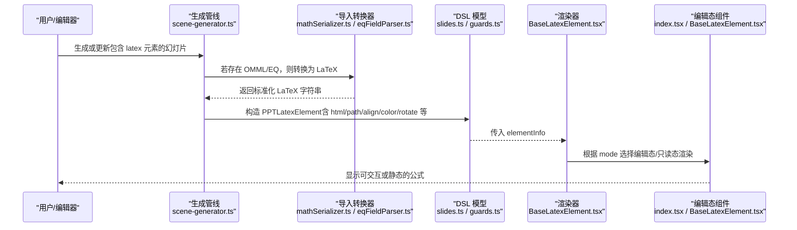
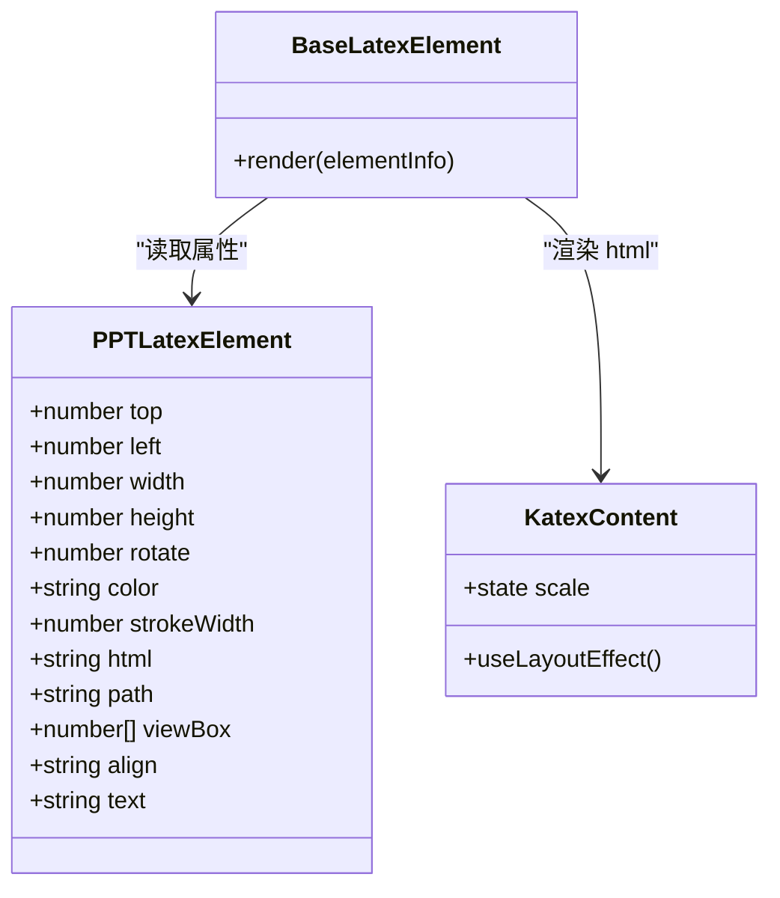
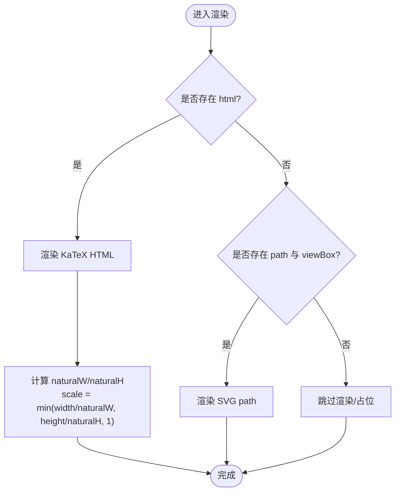
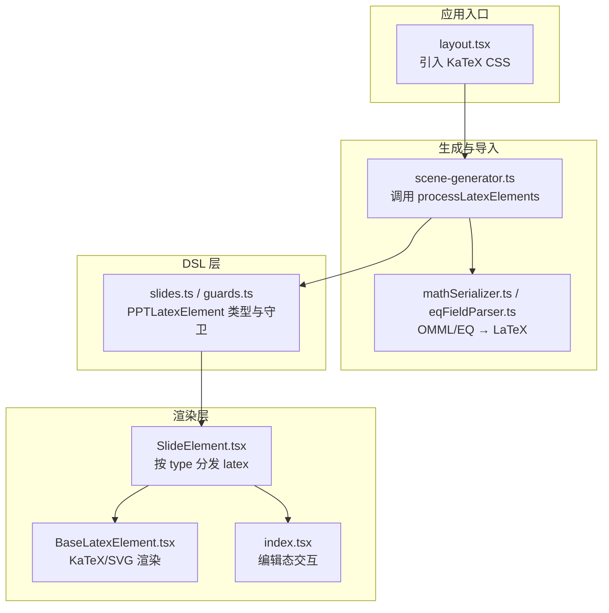
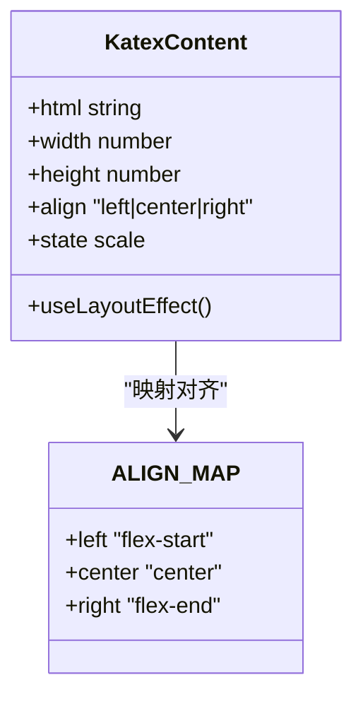
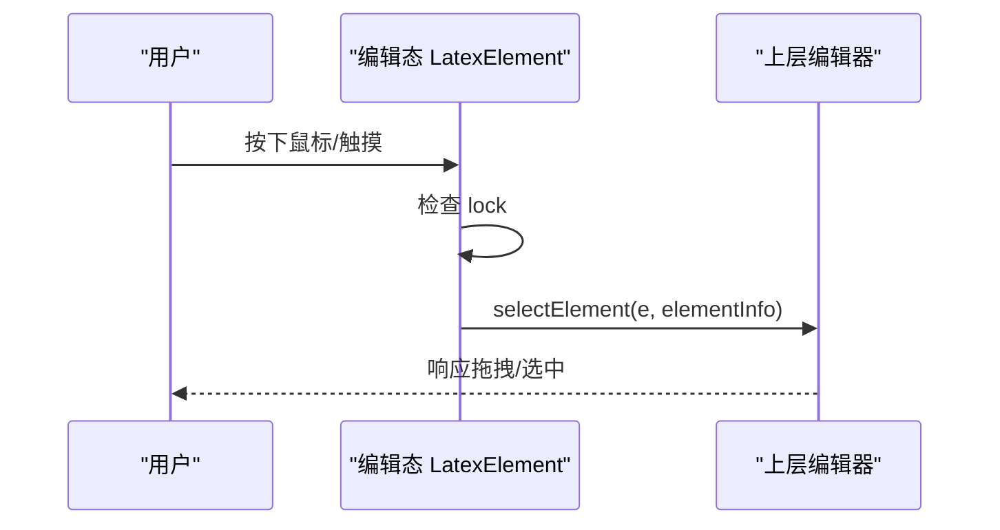
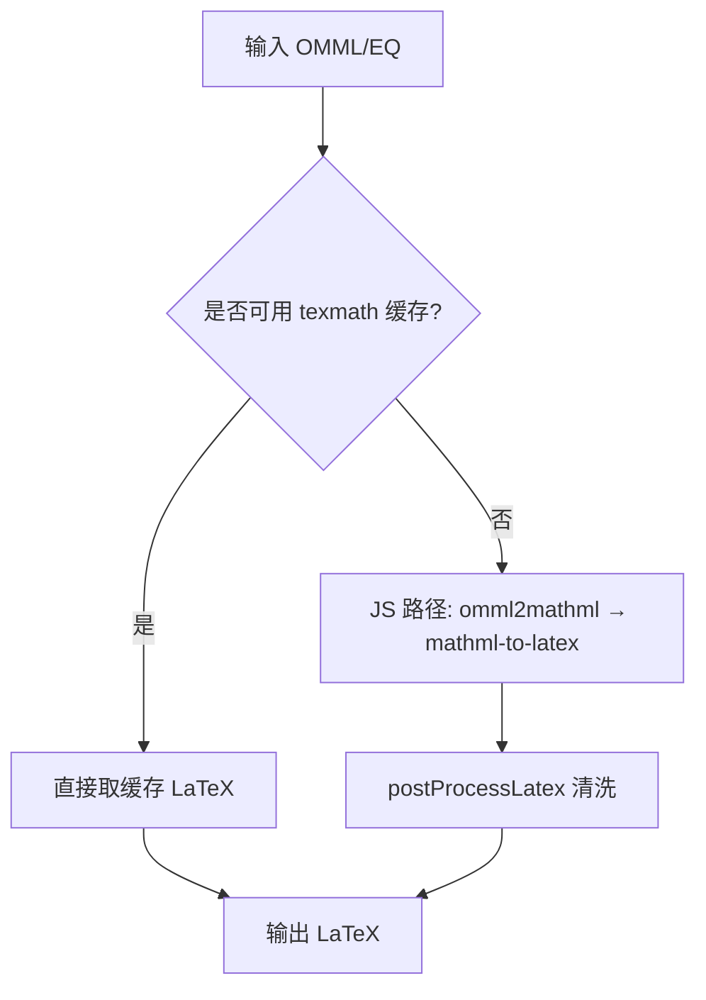
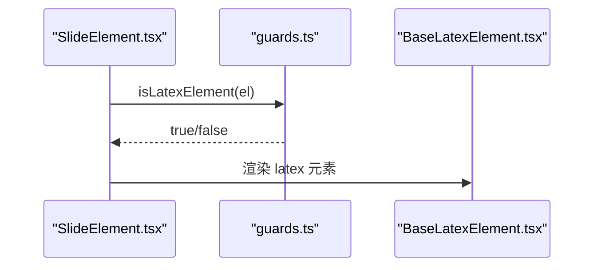
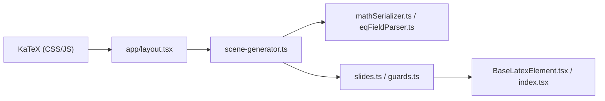

# 数学公式组件

<cite>
**本文引用的文件**   
- [BaseLatexElement.tsx（渲染器）](file://packages/@openmaic/renderer/src/elements/latex/BaseLatexElement.tsx)
- [index.tsx（编辑态 LatexElement）](file://components/slide-renderer/components/element/LatexElement/index.tsx)
- [BaseLatexElement.tsx（基础渲染）](file://components/slide-renderer/components/element/LatexElement/BaseLatexElement.tsx)
- [SlideElement.tsx（元素路由）](file://packages/@openmaic/renderer/src/SlideElement.tsx)
- [mathSerializer.ts（OMML→LaTeX 转换）](file://packages/@openmaic/importer/src/serializer/mathSerializer.ts)
- [eqFieldParser.ts（Word EQ 字段解析）](file://packages/@openmaic/importer/src/utils/eqFieldParser.ts)
- [scene-generator.ts（生成管线中的 LaTeX 处理）](file://lib/generation/scene-generator.ts)
- [layout.tsx（全局 KaTeX 样式引入）](file://app/layout.tsx)
- [edit-elements-gate.ts（编辑校验与约束）](file://lib/agent/tools/edit-elements-gate.ts)
- [cue-meta.ts（动作元数据）](file://components/edit/ActionsBar/cue-meta.ts)
- [slides.ts（DSL 类型定义）](file://packages/@openmaic/dsl/src/slides.ts)
- [guards.ts（DSL 守卫）](file://packages/@openmaic/dsl/src/guards.ts)
</cite>

## 产品概述
本组件为 OpenMAIC 课件系统中的“数学公式”（LaTeX）元素，负责在幻灯片上以 KaTeX 渲染数学公式，并提供编辑态与播放态两种渲染模式。核心能力包括：
- 将 LaTeX 源码通过 KaTeX 渲染为 HTML/SVG，并自适应缩放至元素框内
- 支持旋转、颜色、对齐、位置等常见属性
- 兼容历史 SVG path 回退路径，确保旧内容仍可显示
- 在导入流程中将 OMML/EQ 转换为 LaTeX，保障多来源公式一致性
- 提供编辑态选择、锁定、拖拽交互的基础支撑

适用场景：课堂课件中插入数学公式、科学符号、分式、矩阵、积分等表达式；支持从 PPTX/Word 导入的公式自动转换与渲染。

## 核心业务流程
下图展示从“公式输入/导入”到“最终渲染”的关键链路：

**图表来源** 
- [scene-generator.ts:740-750](file://lib/generation/scene-generator.ts#L740-L750)
- [mathSerializer.ts:354-374](file://packages/@openmaic/importer/src/serializer/mathSerializer.ts#L354-L374)
- [eqFieldParser.ts:24-34](file://packages/@openmaic/importer/src/utils/eqFieldParser.ts#L24-L34)
- [slides.ts:703-810](file://packages/@openmaic/dsl/src/slides.ts#L703-L810)
- [BaseLatexElement.tsx（渲染器）:1-73](file://packages/@openmaic/renderer/src/elements/latex/BaseLatexElement.tsx#L1-L73)
- [index.tsx（编辑态）:17-76](file://components/slide-renderer/components/element/LatexElement/index.tsx#L17-L76)

**章节来源**
- [scene-generator.ts:740-750](file://lib/generation/scene-generator.ts#L740-L750)
- [mathSerializer.ts:354-374](file://packages/@openmaic/importer/src/serializer/mathSerializer.ts#L354-L374)
- [eqFieldParser.ts:24-34](file://packages/@openmaic/importer/src/utils/eqFieldParser.ts#L24-L34)
- [slides.ts:703-810](file://packages/@openmaic/dsl/src/slides.ts#L703-L810)
- [BaseLatexElement.tsx（渲染器）:1-73](file://packages/@openmaic/renderer/src/elements/latex/BaseLatexElement.tsx#L1-L73)
- [index.tsx（编辑态）:17-76](file://components/slide-renderer/components/element/LatexElement/index.tsx#L17-L76)

## 功能模块清单
- 渲染引擎集成（KaTeX）
  - 通过 KaTeX 将 LaTeX 转为 HTML，并在容器内按宽高自适应缩放
  - 支持 left/center/right 水平对齐与 transformOrigin 控制缩放原点
  - 当无 HTML 时回退到 SVG path 渲染，保证兼容性
- 编辑态交互
  - 支持选中、锁定、拖拽移动（由上层 Canvas/Editor 驱动）
  - 点击/触摸事件冒泡控制，避免误触
- 导入与转换
  - OMML → MathML → LaTeX（JS 兜底），必要时走服务端 texmath 缓存
  - Word EQ 字段解析为 LaTeX，覆盖老版本 PPT 中的公式
- 属性与样式
  - 支持 color、strokeWidth、rotate、align、width/height/top/left
  - 颜色继承 KaTeX 字体样式，避免浏览器默认色覆盖
- 动画与逐步显示
  - 通过编排层 cue-meta 标记 latex 淡入等动效
  - 结合时间轴实现逐步揭示

**章节来源**
- [BaseLatexElement.tsx（渲染器）:75-134](file://packages/@openmaic/renderer/src/elements/latex/BaseLatexElement.tsx#L75-L134)
- [index.tsx（编辑态）:17-76](file://components/slide-renderer/components/element/LatexElement/index.tsx#L17-L76)
- [mathSerializer.ts:354-374](file://packages/@openmaic/importer/src/serializer/mathSerializer.ts#L354-L374)
- [eqFieldParser.ts:24-34](file://packages/@openmaic/importer/src/utils/eqFieldParser.ts#L24-L34)
- [cue-meta.ts:131](file://components/edit/ActionsBar/cue-meta.ts#L131)

## 数据与状态
- 数据模型（PPTLatexElement）
  - 位置与尺寸：top、left、width、height
  - 变换：rotate（角度）、align（left/center/right）
  - 样式：color、strokeWidth
  - 渲染分支：html（KaTeX 渲染结果）、path + viewBox（SVG 回退）
  - 可选：text/plainText（辅助文本）
- 状态流转
  - 生成/导入阶段：确定 latex 字符串 → 渲染为 html 或 fallback svg
  - 编辑阶段：锁定/解锁、选中态、拖拽坐标更新
  - 播放阶段：只读渲染，按 align 与 scale 适配
- 数据所有权边界
  - 生成管线产出 DSL 对象，渲染器仅消费，不修改
  - 编辑态通过上层 Editor 状态管理变更，再写回 DSL

**图表来源** 
- [slides.ts:703-810](file://packages/@openmaic/dsl/src/slides.ts#L703-L810)
- [BaseLatexElement.tsx（渲染器）:1-73](file://packages/@openmaic/renderer/src/elements/latex/BaseLatexElement.tsx#L1-L73)
- [BaseLatexElement.tsx（渲染器）:75-134](file://packages/@openmaic/renderer/src/elements/latex/BaseLatexElement.tsx#L75-L134)

**章节来源**
- [slides.ts:703-810](file://packages/@openmaic/dsl/src/slides.ts#L703-L810)
- [guards.ts:65](file://packages/@openmaic/dsl/src/guards.ts#L65)
- [BaseLatexElement.tsx（渲染器）:1-73](file://packages/@openmaic/renderer/src/elements/latex/BaseLatexElement.tsx#L1-L73)
- [BaseLatexElement.tsx（渲染器）:75-134](file://packages/@openmaic/renderer/src/elements/latex/BaseLatexElement.tsx#L75-L134)

## 关键约束与边界
- 渲染性能
  - 使用 useLayoutEffect 计算自然宽高后按比例缩放，且上限为 1（不放大），避免短公式在大框内被放大导致模糊
  - 仅在 html/width/height 变化时重算缩放，减少重复计算
- 移动端兼容
  - 编辑态支持 touchStart 事件，配合上层拖拽逻辑完成移动
  - CSS 使用 transform 与 flex 布局，兼容主流移动端浏览器
- 导入兼容性
  - OMML → LaTeX 失败时回退 JS 路径；必要时优先使用服务端 texmath 缓存提升质量与速度
  - Word EQ 字段解析失败时保留原始代码，避免中断导入
- 编辑约束
  - 若 latex 元素无可见渲染分支（既无 html 也无 path+viewBox），编辑校验会拒绝操作
  - 行内 KaTeX 颜色可能覆盖元素级 color，需提示冲突

**图表来源** 
- [BaseLatexElement.tsx（渲染器）:41-68](file://packages/@openmaic/renderer/src/elements/latex/BaseLatexElement.tsx#L41-L68)
- [BaseLatexElement.tsx（渲染器）:95-105](file://packages/@openmaic/renderer/src/elements/latex/BaseLatexElement.tsx#L95-L105)

**章节来源**
- [BaseLatexElement.tsx（渲染器）:95-105](file://packages/@openmaic/renderer/src/elements/latex/BaseLatexElement.tsx#L95-L105)
- [edit-elements-gate.ts:836-837](file://lib/agent/tools/edit-elements-gate.ts#L836-L837)
- [edit-elements-gate.ts:874-875](file://lib/agent/tools/edit-elements-gate.ts#L874-L875)
- [layout.tsx:7](file://app/layout.tsx#L7)

## 架构总览

**图表来源** 
- [layout.tsx:7](file://app/layout.tsx#L7)
- [scene-generator.ts:740-750](file://lib/generation/scene-generator.ts#L740-L750)
- [mathSerializer.ts:354-374](file://packages/@openmaic/importer/src/serializer/mathSerializer.ts#L354-L374)
- [eqFieldParser.ts:24-34](file://packages/@openmaic/importer/src/utils/eqFieldParser.ts#L24-L34)
- [slides.ts:703-810](file://packages/@openmaic/dsl/src/slides.ts#L703-L810)
- [SlideElement.tsx:16-94](file://packages/@openmaic/renderer/src/SlideElement.tsx#L16-L94)
- [BaseLatexElement.tsx（渲染器）:1-73](file://packages/@openmaic/renderer/src/elements/latex/BaseLatexElement.tsx#L1-L73)
- [index.tsx（编辑态）:17-76](file://components/slide-renderer/components/element/LatexElement/index.tsx#L17-L76)

## 详细组件分析

### 渲染引擎集成（KaTeX）
- 渲染策略
  - 优先渲染 KaTeX HTML；若无 html，则回退到 SVG path
  - 通过 innerRef 获取自然宽高，计算缩放比例，限制最大为 1
  - 根据 align 设置 justify 与 transformOrigin，使缩放中心符合预期
- 样式与颜色
  - 元素 color 传递给 KaTeX 子树，避免浏览器默认色覆盖
  - SVG 回退路径使用 stroke/strokeWidth 保持视觉一致

**图表来源** 
- [BaseLatexElement.tsx（渲染器）:75-134](file://packages/@openmaic/renderer/src/elements/latex/BaseLatexElement.tsx#L75-L134)

**章节来源**
- [BaseLatexElement.tsx（渲染器）:75-134](file://packages/@openmaic/renderer/src/elements/latex/BaseLatexElement.tsx#L75-L134)

### 编辑态交互（选择、锁定、拖拽）
- 事件处理
  - onMouseDown/onTouchStart 触发 selectElement，阻止冒泡
  - lock 状态下禁用交互，cursor 切换为 default/move
- 与上层协作
  - 编辑态组件仅负责事件捕获与状态透传，实际拖拽与坐标更新由上层 Canvas/Editor 完成

**图表来源** 
- [index.tsx（编辑态）:17-45](file://components/slide-renderer/components/element/LatexElement/index.tsx#L17-L45)

**章节来源**
- [index.tsx（编辑态）:17-45](file://components/slide-renderer/components/element/LatexElement/index.tsx#L17-L45)

### 导入与转换（OMML/EQ → LaTeX）
- 转换路径
  - 优先使用服务端 texmath 缓存（/api/texmath），否则回退 JS 路径（omml2mathml + mathml-to-latex）
  - postProcessLatex 清理 Unicode、实体、特殊符号（如 ∂→\partial、∇→\nabla）
- Word EQ 字段
  - 解析 \f、\o、\b\lc…\rc、\a\vs…、\s\up、\s\do、\r、\i 等指令为 LaTeX
- 多行公式
  - 多个 OMML 节点用 gathered 环境堆叠，确保每行都保留

**图表来源** 
- [mathSerializer.ts:354-374](file://packages/@openmaic/importer/src/serializer/mathSerializer.ts#L354-L374)
- [eqFieldParser.ts:24-34](file://packages/@openmaic/importer/src/utils/eqFieldParser.ts#L24-L34)

**章节来源**
- [mathSerializer.ts:354-374](file://packages/@openmaic/importer/src/serializer/mathSerializer.ts#L354-L374)
- [eqFieldParser.ts:24-34](file://packages/@openmaic/importer/src/utils/eqFieldParser.ts#L24-L34)

### 元素路由与类型守卫
- 路由分发
  - SlideElement 根据 type === 'latex' 选择对应渲染组件
- 类型守卫
  - isLatexElement 用于判断元素是否为 PPTLatexElement，便于工具链安全处理

**图表来源** 
- [SlideElement.tsx:16-94](file://packages/@openmaic/renderer/src/SlideElement.tsx#L16-L94)
- [guards.ts:65](file://packages/@openmaic/dsl/src/guards.ts#L65)

**章节来源**
- [SlideElement.tsx:16-94](file://packages/@openmaic/renderer/src/SlideElement.tsx#L16-L94)
- [guards.ts:65](file://packages/@openmaic/dsl/src/guards.ts#L65)

### 动画与逐步显示
- 通过 cue-meta 标注 latex 淡入等效果
- 编排层依据时间轴控制元素可见性，实现逐步揭示

**章节来源**
- [cue-meta.ts:131](file://components/edit/ActionsBar/cue-meta.ts#L131)

## 依赖分析
- 外部依赖
  - KaTeX：CSS 与运行时脚本由 app/layout.tsx 引入
- 内部依赖
  - 生成管线 scene-generator.ts 调用 processLatexElements
  - 导入器 mathSerializer.ts / eqFieldParser.ts 提供 LaTeX 转换
  - DSL slides.ts 定义 PPTLatexElement 类型与守卫

**图表来源** 
- [layout.tsx:7](file://app/layout.tsx#L7)
- [scene-generator.ts:740-750](file://lib/generation/scene-generator.ts#L740-L750)
- [mathSerializer.ts:354-374](file://packages/@openmaic/importer/src/serializer/mathSerializer.ts#L354-L374)
- [eqFieldParser.ts:24-34](file://packages/@openmaic/importer/src/utils/eqFieldParser.ts#L24-L34)
- [slides.ts:703-810](file://packages/@openmaic/dsl/src/slides.ts#L703-L810)
- [BaseLatexElement.tsx（渲染器）:1-73](file://packages/@openmaic/renderer/src/elements/latex/BaseLatexElement.tsx#L1-L73)
- [index.tsx（编辑态）:17-76](file://components/slide-renderer/components/element/LatexElement/index.tsx#L17-L76)

**章节来源**
- [layout.tsx:7](file://app/layout.tsx#L7)
- [scene-generator.ts:740-750](file://lib/generation/scene-generator.ts#L740-L750)
- [mathSerializer.ts:354-374](file://packages/@openmaic/importer/src/serializer/mathSerializer.ts#L354-L374)
- [eqFieldParser.ts:24-34](file://packages/@openmaic/importer/src/utils/eqFieldParser.ts#L24-L34)
- [slides.ts:703-810](file://packages/@openmaic/dsl/src/slides.ts#L703-L810)
- [BaseLatexElement.tsx（渲染器）:1-73](file://packages/@openmaic/renderer/src/elements/latex/BaseLatexElement.tsx#L1-L73)
- [index.tsx（编辑态）:17-76](file://components/slide-renderer/components/element/LatexElement/index.tsx#L17-L76)

## 性能考虑
- 缩放计算
  - 使用 useLayoutEffect 在布局完成后测量 scrollWidth/scrollHeight，避免闪烁
  - 缩放上限为 1，防止短公式被放大导致模糊
- 渲染回退
  - 无 html 时回退 SVG path，降低对 KaTeX 的强依赖
- 导入优化
  - 优先使用服务端 texmath 缓存，减少 JS 路径开销
  - 批量预取（prefetchTexmath）提高转换吞吐

[本节为通用性能建议，不直接分析具体文件]

## 故障排查指南
- 公式未显示
  - 检查 elementInfo.html 是否为空；若无，确认 path/viewBox 是否存在
  - 查看 KaTeX CSS 是否正确引入（app/layout.tsx）
- 公式颜色异常
  - 行内 KaTeX 颜色可能覆盖元素级 color，注意冲突提示
- 导入失败
  - 检查 OMML/EQ 是否有效；必要时查看 postProcessLatex 清洗逻辑
- 编辑操作被拒绝
  - 若 latex 元素无可见渲染分支，编辑校验会拒绝；请补充 html 或 path+viewBox

**章节来源**
- [BaseLatexElement.tsx（渲染器）:41-68](file://packages/@openmaic/renderer/src/elements/latex/BaseLatexElement.tsx#L41-L68)
- [layout.tsx:7](file://app/layout.tsx#L7)
- [edit-elements-gate.ts:836-837](file://lib/agent/tools/edit-elements-gate.ts#L836-L837)
- [edit-elements-gate.ts:874-875](file://lib/agent/tools/edit-elements-gate.ts#L874-L875)

## 结论
LaTeX 数学公式组件在 OpenMAIC 中承担“从多源公式到统一渲染”的关键职责。通过 KaTeX 渲染、OMML/EQ 转换、SVG 回退与编辑态交互，实现了稳定、兼容、可扩展的公式处理能力。后续可在模板库、符号扩展、导出分享与版本管理方面进一步增强，以满足更丰富的教学与科研场景需求。