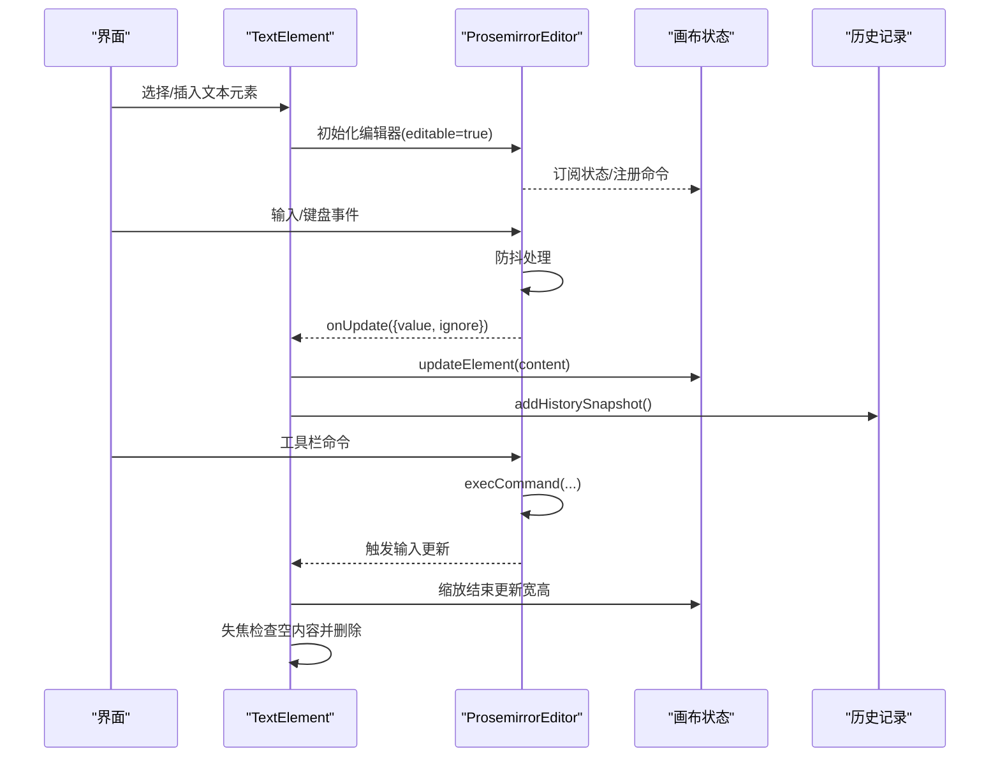
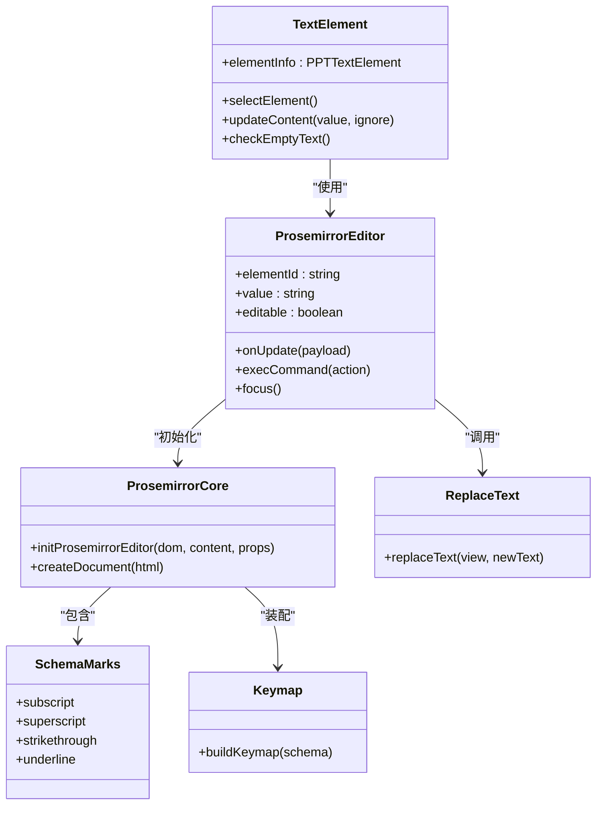
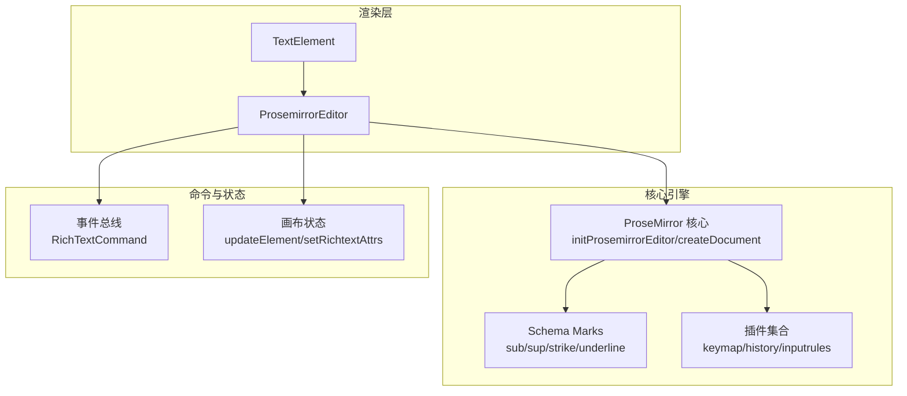

# 文本元素组件

<cite>
**本文引用的文件**   
- [components/slide-renderer/components/element/TextElement/index.tsx](file://components/slide-renderer/components/element/TextElement/index.tsx)
- [components/slide-renderer/components/element/ProsemirrorEditor.tsx](file://components/slide-renderer/components/element/ProsemirrorEditor.tsx)
- [lib/prosemirror/index.ts](file://lib/prosemirror/index.ts)
- [lib/prosemirror/schema/marks.ts](file://lib/prosemirror/schema/marks.ts)
- [lib/prosemirror/commands/replaceText.ts](file://lib/prosemirror/commands/replaceText.ts)
- [lib/prosemirror/plugins/keymap.ts](file://lib/prosemirror/plugins/keymap.ts)
</cite>

## 产品概述
本组件文档聚焦于“文本元素（TextElement）”在幻灯片渲染与编辑中的实现，核心基于 ProseMirror 构建富文本编辑器能力。该组件负责：
- 将 PPT 风格的文本元素与 ProseMirror 编辑器集成，提供可编辑、可格式化的文本体验
- 支持字体、字号、颜色、对齐、缩进、列表、链接等常见文本格式化
- 处理内容序列化/反序列化、版本兼容、空内容清理、自动高度调整
- 提供搜索替换、高亮、溢出处理、自动换行、多语言书写模式支持
- 通过命令总线与外部工具栏联动，支持格式刷、批量操作
- 兼顾性能优化与内存管理，确保大量文本元素场景下的流畅性

## 核心业务流程
- 用户选择或插入文本元素后，进入编辑态，触发 ProseMirror 初始化
- 输入事件经防抖处理后同步到上层状态，并记录历史快照
- 工具栏命令通过事件总线分发到当前活跃编辑器，执行对应格式化
- 缩放结束时根据实际内容尺寸更新元素宽高
- 失去焦点时检测空内容并删除空元素

图表来源 
- [components/slide-renderer/components/element/TextElement/index.tsx](file://components/slide-renderer/components/element/TextElement/index.tsx)
- [components/slide-renderer/components/element/ProsemirrorEditor.tsx](file://components/slide-renderer/components/element/ProsemirrorEditor.tsx)

章节来源
- [components/slide-renderer/components/element/TextElement/index.tsx](file://components/slide-renderer/components/element/TextElement/index.tsx)
- [components/slide-renderer/components/element/ProsemirrorEditor.tsx](file://components/slide-renderer/components/element/ProsemirrorEditor.tsx)

## 功能模块清单
- 文本元素容器与布局
  - 职责：定位、旋转、背景色、透明度、阴影、边框描边、垂直/水平书写模式、行高、字间距、段落间距
  - 验收要点：样式属性正确映射到 DOM；缩放结束后宽高持久化；锁定状态下不可交互
- ProseMirror 编辑器集成
  - 职责：初始化 EditorView、创建文档、插件装配、事务派发、焦点管理、可编辑切换
  - 验收要点：输入防抖、命令执行、选中态属性同步、自动聚焦
- 文本格式化与样式
  - 职责：加粗、斜体、下划线、删除线、上标/下标、代码块、引用块、链接、字体族/字号、前景/背景色、对齐、缩进、列表
  - 验收要点：命令覆盖完整；格式刷可用；清除格式有效
- 内容序列化与反序列化
  - 职责：HTML 字符串解析为 ProseMirror 文档；DOM 变更回写 HTML 字符串
  - 验收要点：跨版本兼容；空内容清理；特殊字符与标签安全
- 搜索替换与高亮
  - 职责：全文替换、保留原有格式、按节点类型重建
  - 验收要点：替换结果一致；无格式丢失；边界情况稳定
- 溢出与换行、多语言
  - 职责：自动换行、垂直书写模式、CJK 排版适配
  - 验收要点：长文本不溢出；滚动行为符合预期
- 动画与过渡
  - 职责：缩放结束后的尺寸过渡、阴影效果
  - 验收要点：动画平滑、无闪烁

章节来源
- [components/slide-renderer/components/element/TextElement/index.tsx](file://components/slide-renderer/components/element/TextElement/index.tsx)
- [components/slide-renderer/components/element/ProsemirrorEditor.tsx](file://components/slide-renderer/components/element/ProsemirrorEditor.tsx)
- [lib/prosemirror/index.ts](file://lib/prosemirror/index.ts)
- [lib/prosemirror/schema/marks.ts](file://lib/prosemirror/schema/marks.ts)
- [lib/prosemirror/commands/replaceText.ts](file://lib/prosemirror/commands/replaceText.ts)
- [lib/prosemirror/plugins/keymap.ts](file://lib/prosemirror/plugins/keymap.ts)

## 数据与状态
- 文本元素数据结构（PPTTextElement）
  - 关键字段：id、content（HTML 字符串）、width/height、top/left、rotate、fill、opacity、defaultColor、defaultFontName、lineHeight、wordSpace、paragraphSpace、vertical、lock、outline、shadow
  - 作用域：由画布状态管理，文本元素仅读写自身 id 对应的 props
- 编辑器状态
  - EditorView：持有 ProseMirror 的 state/doc/selection
  - RichTextAttrs：当前选区/文档的格式属性（颜色、字号等），用于工具栏同步
  - ActiveEditorRegistry：当前活跃的文本编辑器实例，用于命令路由
- 状态流转
  - 输入 → 防抖 → 生成新 HTML → 调用 updateElement → 记录历史快照
  - 工具栏命令 → 事件总线 → execCommand → 修改 schema marks/nodes → 触发更新
  - 缩放结束 → ResizeObserver 测量 → 更新 width/height
  - 失焦 → 空内容检测 → 删除元素

图表来源 
- [components/slide-renderer/components/element/TextElement/index.tsx](file://components/slide-renderer/components/element/TextElement/index.tsx)
- [components/slide-renderer/components/element/ProsemirrorEditor.tsx](file://components/slide-renderer/components/element/ProsemirrorEditor.tsx)
- [lib/prosemirror/index.ts](file://lib/prosemirror/index.ts)
- [lib/prosemirror/schema/marks.ts](file://lib/prosemirror/schema/marks.ts)
- [lib/prosemirror/commands/replaceText.ts](file://lib/prosemirror/commands/replaceText.ts)
- [lib/prosemirror/plugins/keymap.ts](file://lib/prosemirror/plugins/keymap.ts)

章节来源
- [components/slide-renderer/components/element/TextElement/index.tsx](file://components/slide-renderer/components/element/TextElement/index.tsx)
- [components/slide-renderer/components/element/ProsemirrorEditor.tsx](file://components/slide-renderer/components/element/ProsemirrorEditor.tsx)
- [lib/prosemirror/index.ts](file://lib/prosemirror/index.ts)

## 关键约束与边界
- 非功能性需求
  - 性能：输入事件防抖（300ms），避免频繁更新；ResizeObserver 仅在需要时观察；销毁时释放 EditorView
  - 内存：编辑器实例在组件卸载时 destroy；避免循环引用；只读共享 schema
  - 兼容性：HTML 解析采用标准 DOMParser；schema 定义与基本标记兼容
- 依赖与集成边界
  - 依赖 ProseMirror 核心库与基础 schema；命令通过事件总线与工具栏解耦
  - 与画布状态耦合点：updateElement、setRichtextAttrs、setDisableHotkeysState
- 业务约束
  - 锁定元素不可编辑；空内容自动删除；垂直/水平书写模式互斥
  - 工具栏命令需匹配目标 elementId，避免跨元素误操作

章节来源
- [components/slide-renderer/components/element/TextElement/index.tsx](file://components/slide-renderer/components/element/TextElement/index.tsx)
- [components/slide-renderer/components/element/ProsemirrorEditor.tsx](file://components/slide-renderer/components/element/ProsemirrorEditor.tsx)
- [lib/prosemirror/index.ts](file://lib/prosemirror/index.ts)

## 详细技术说明

### 基于 ProseMirror 的编辑器集成与配置
- 初始化流程
  - 使用 initProsemirrorEditor 创建 EditorView，传入初始 HTML 内容
  - createDocument 将 HTML 字符串解析为 ProseMirror 文档
  - buildPlugins 装配 keymap、history、inputrules 等插件
- 事务派发与属性同步
  - dispatchTransaction 中应用事务并可选推送工具栏属性（shouldPushAttrs 守卫）
  - 通过 shouldPushAttrs 减少不必要的属性同步，提升性能
- 可编辑切换
  - editable 函数动态控制编辑态，播放模式下禁用编辑，保持字节不变路径

章节来源
- [lib/prosemirror/index.ts](file://lib/prosemirror/index.ts)
- [components/slide-renderer/components/element/ProsemirrorEditor.tsx](file://components/slide-renderer/components/element/ProsemirrorEditor.tsx)

### 文本格式化、样式设置与字体管理
- 支持的格式
  - 加粗/斜体/下划线/删除线/上标/下标/代码/引用块
  - 字体族/字号（含增减）、前景色/背景色
  - 对齐方式、段落缩进、首行缩进
  - 无序/有序列表及样式
  - 链接（添加/移除/更新）
- 实现要点
  - 通过 schema marks 定义文本标记，parseDOM/toDOM 保证 HTML 双向转换
  - execCommand 统一处理命令分发，自动选择文本并应用 mark
  - 格式刷：收集 textFormatPainter 属性，批量执行 clear 与新增属性

章节来源
- [lib/prosemirror/schema/marks.ts](file://lib/prosemirror/schema/marks.ts)
- [components/slide-renderer/components/element/ProsemirrorEditor.tsx](file://components/slide-renderer/components/element/ProsemirrorEditor.tsx)

### 文本内容的序列化、反序列化与版本兼容
- 反序列化
  - createDocument 将 HTML 字符串解析为文档树，兼容常见标签与样式
- 序列化
  - 编辑器 DOM innerHTML 作为内容存储，避免复杂结构丢失
- 版本兼容
  - 通过 schema 扩展与 parseDOM 规则兼容旧版 HTML
  - 空内容清理策略：去除纯文本为空则删除元素

章节来源
- [lib/prosemirror/index.ts](file://lib/prosemirror/index.ts)
- [components/slide-renderer/components/element/TextElement/index.tsx](file://components/slide-renderer/components/element/TextElement/index.tsx)

### 文本搜索、替换与高亮
- 替换实现
  - replaceText 按行拆分，保留首行格式与节点类型，重建文档
  - 适用于批量替换并保持原有样式
- 高亮
  - 可通过自定义 mark 或临时样式层实现，当前未内置高亮逻辑
  - 建议：在替换前后插入高亮 mark，完成后移除

章节来源
- [lib/prosemirror/commands/replaceText.ts](file://lib/prosemirror/commands/replaceText.ts)
- [components/slide-renderer/components/element/ProsemirrorEditor.tsx](file://components/slide-renderer/components/element/ProsemirrorEditor.tsx)

### 文本溢出处理、自动换行与多语言支持
- 溢出与换行
  - CSS break-words 与固定宽度容器配合，确保长文本换行
  - ResizeObserver 监听内容变化，自动调整元素高度/宽度
- 多语言
  - writingMode 支持 vertical-rl/horizontal-tb，满足 CJK 竖排
  - 行高、字间距、段落间距可配置，适配不同语言排版

章节来源
- [components/slide-renderer/components/element/TextElement/index.tsx](file://components/slide-renderer/components/element/TextElement/index.tsx)

### 文本动画与过渡效果
- 缩放结束过渡
  - 缩放过程中缓存尺寸，结束后一次性更新，避免抖动
- 阴影与描边
  - useElementShadow 计算阴影样式，ElementOutline 绘制描边

章节来源
- [components/slide-renderer/components/element/TextElement/index.tsx](file://components/slide-renderer/components/element/TextElement/index.tsx)

### 自定义文本格式与插件开发指南
- 自定义 Mark
  - 在 schema marks 中定义新的 MarkSpec，实现 parseDOM/toDOM
  - 在 execCommand 中添加命令分支，应用 mark
- 自定义插件
  - 在 buildPlugins 中注册插件，如搜索高亮、拼写检查
  - 通过 shouldPushAttrs 控制属性同步时机
- 命令扩展
  - 通过事件总线发布 RichTextCommand，统一路由到 execCommand

章节来源
- [lib/prosemirror/schema/marks.ts](file://lib/prosemirror/schema/marks.ts)
- [components/slide-renderer/components/element/ProsemirrorEditor.tsx](file://components/slide-renderer/components/element/ProsemirrorEditor.tsx)

### 性能优化与内存管理策略
- 输入防抖：300ms 延迟合并更新，降低重绘压力
- 选择性属性同步：shouldPushAttrs 判断是否需要同步工具栏属性
- 资源释放：组件卸载时销毁 EditorView，取消 ResizeObserver
- 只读共享：schema 与插件全局复用，避免重复创建

章节来源
- [components/slide-renderer/components/element/ProsemirrorEditor.tsx](file://components/slide-renderer/components/element/ProsemirrorEditor.tsx)
- [components/slide-renderer/components/element/TextElement/index.tsx](file://components/slide-renderer/components/element/TextElement/index.tsx)

## 架构总览

图表来源 
- [components/slide-renderer/components/element/TextElement/index.tsx](file://components/slide-renderer/components/element/TextElement/index.tsx)
- [components/slide-renderer/components/element/ProsemirrorEditor.tsx](file://components/slide-renderer/components/element/ProsemirrorEditor.tsx)
- [lib/prosemirror/index.ts](file://lib/prosemirror/index.ts)
- [lib/prosemirror/schema/marks.ts](file://lib/prosemirror/schema/marks.ts)
- [lib/prosemirror/plugins/keymap.ts](file://lib/prosemirror/plugins/keymap.ts)

## 依赖分析
- 组件内聚与耦合
  - TextElement 与 ProsemirrorEditor 强内聚，负责 UI 与编辑器桥接
  - ProsemirrorEditor 与 lib/prosemirror 核心解耦，通过接口初始化与命令分发
- 外部依赖
  - ProseMirror 核心库与基础 schema
  - 事件总线用于命令路由，避免直接依赖工具栏实现
- 潜在循环依赖
  - 通过事件总线与 ref 传递避免循环

章节来源
- [components/slide-renderer/components/element/TextElement/index.tsx](file://components/slide-renderer/components/element/TextElement/index.tsx)
- [components/slide-renderer/components/element/ProsemirrorEditor.tsx](file://components/slide-renderer/components/element/ProsemirrorEditor.tsx)
- [lib/prosemirror/index.ts](file://lib/prosemirror/index.ts)

## 性能考量
- 输入事件合并：debounce 300ms，trailing 模式确保最后一次输入生效
- 属性同步节流：shouldPushAttrs 减少不必要的全量同步
- 尺寸测量优化：ResizeObserver 仅在元素可见且需要时观察
- 内存回收：destroy EditorView，取消观察者，避免泄漏

[本节为通用指导，无需源码引用]

## 故障排查指南
- 编辑器无法聚焦
  - 检查 editable 是否为 true；确认 editingElementId 与 elementId 一致
- 格式无效
  - 检查 execCommand 分支是否覆盖；确认 mark 已定义在 schema
- 替换失败
  - 检查 replaceText 的节点类型与 marks 提取逻辑
- 空元素未删除
  - 检查 checkEmptyText 的纯文本过滤与 debounce 配置

章节来源
- [components/slide-renderer/components/element/ProsemirrorEditor.tsx](file://components/slide-renderer/components/element/ProsemirrorEditor.tsx)
- [lib/prosemirror/commands/replaceText.ts](file://lib/prosemirror/commands/replaceText.ts)
- [components/slide-renderer/components/element/TextElement/index.tsx](file://components/slide-renderer/components/element/TextElement/index.tsx)

## 结论
TextElement 组件以 ProseMirror 为核心，构建了可扩展、高性能的富文本编辑能力。通过清晰的模块化设计与事件驱动的命令系统，实现了丰富的文本格式化、内容序列化、搜索替换与多语言支持。建议在后续迭代中补充高亮插件、增强版本迁移策略，并持续优化大文档场景下的性能表现。