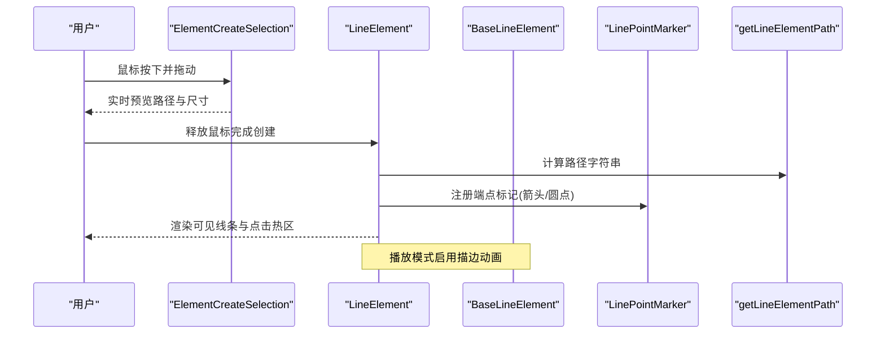
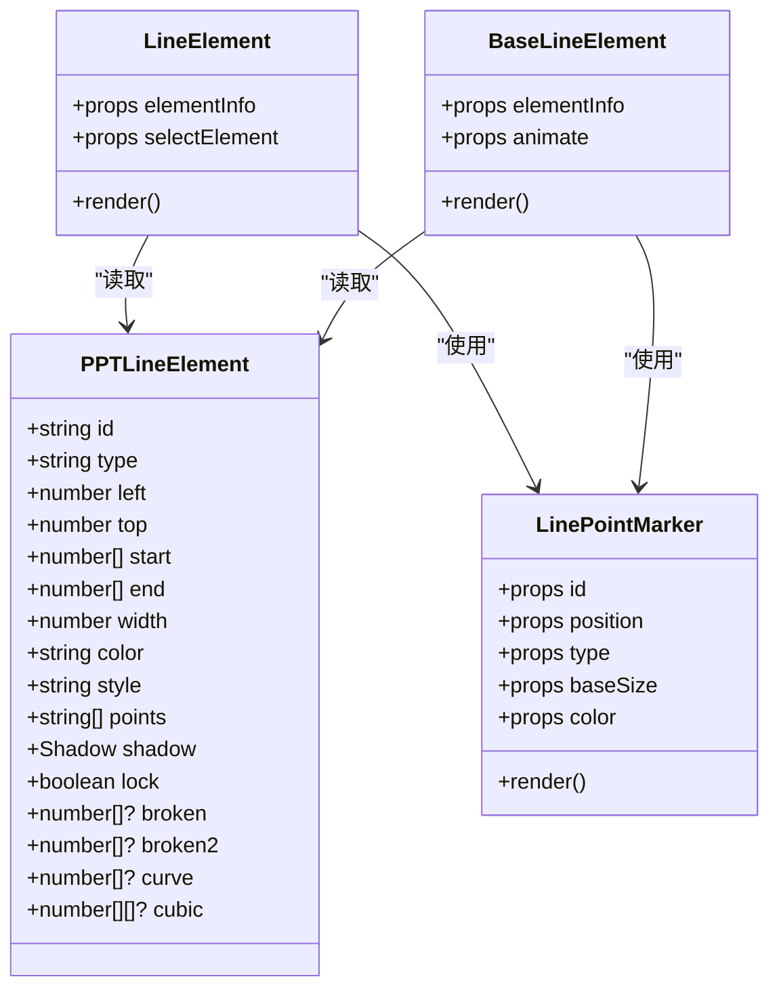
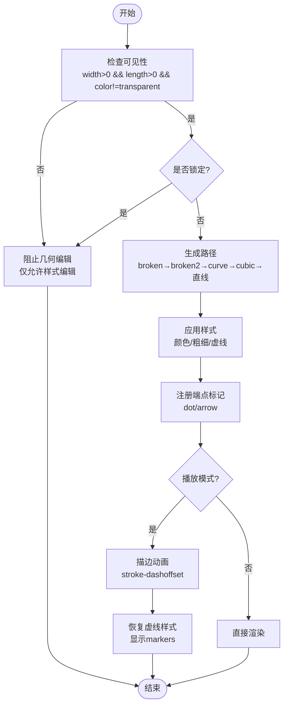
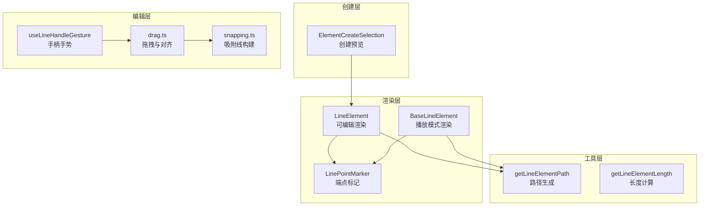
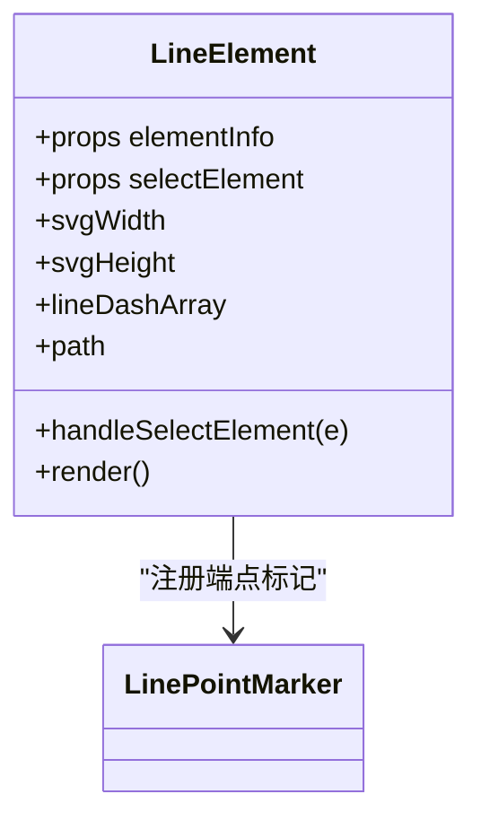
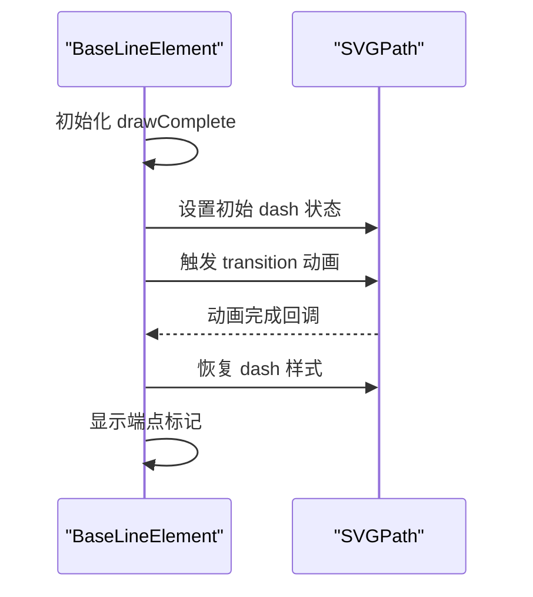
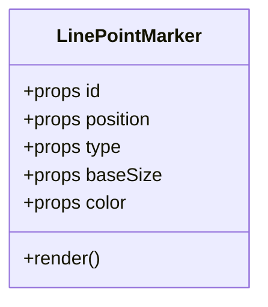
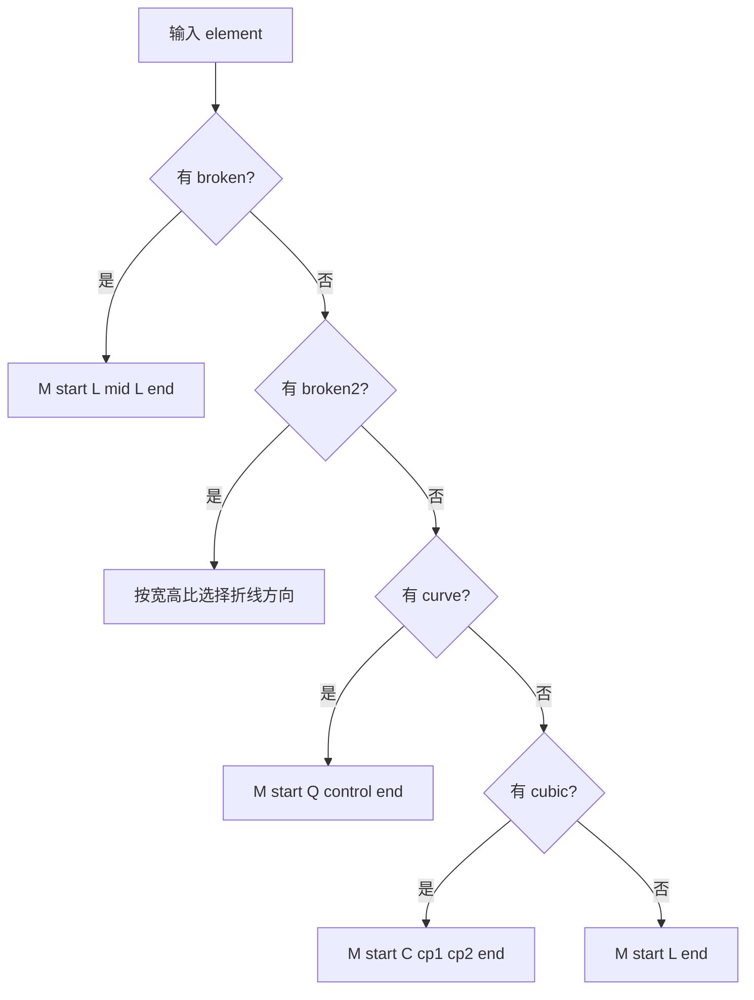
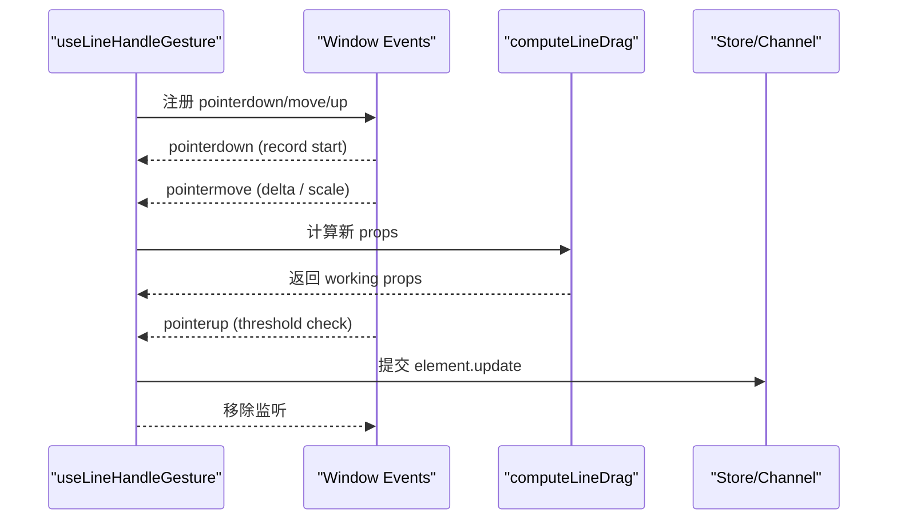
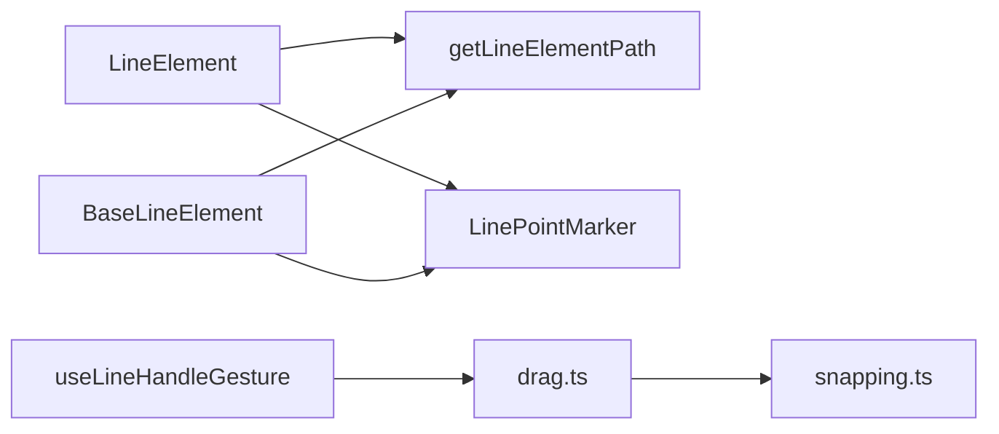

# 线条元素组件

<cite>
**本文引用的文件**   
- [components/slide-renderer/components/element/LineElement/index.tsx](file://components/slide-renderer/components/element/LineElement/index.tsx)
- [components/slide-renderer/components/element/LineElement/BaseLineElement.tsx](file://components/slide-renderer/components/element/LineElement/BaseLineElement.tsx)
- [components/slide-renderer/components/element/LineElement/LinePointMarker.tsx](file://components/slide-renderer/components/element/LineElement/LinePointMarker.tsx)
- [lib/utils/element.ts](file://lib/utils/element.ts)
- [packages/@openmaic/renderer/src/editing/core/snapping.ts](file://packages/@openmaic/renderer/src/editing/core/snapping.ts)
- [packages/@openmaic/renderer/src/editing/core/drag.ts](file://packages/@openmaic/renderer/src/editing/core/drag.ts)
- [packages/@openmaic/renderer/src/editing/useLineHandleGesture.ts](file://packages/@openmaic/renderer/src/editing/useLineHandleGesture.ts)
- [components/slide-renderer/Editor/Canvas/ElementCreateSelection.tsx](file://components/slide-renderer/Editor/Canvas/ElementCreateSelection.tsx)
- [tests/lib/agent/tools/edit-elements-gate.test.ts](file://tests/lib/agent/tools/edit-elements-gate.test.ts)
</cite>

## 产品概述
本组件文档聚焦于“线条元素（LineElement）”的绘制、编辑与约束机制，覆盖直线、折线、曲线与箭头的创建与修改；描述端点标记、虚线样式与粗细控制；说明吸附对齐与智能连接；记录路径编辑与节点调整操作；包含描边动画与动态变化；并提供自定义线条类型与绘图工具的扩展指南，以及 SVG 路径优化与渲染性能调优建议。

## 核心业务流程
- 创建流程：用户在画布上拖拽选择区域，系统根据起点与终点计算临时 SVG 尺寸与路径，并在预览中实时绘制线条。
- 渲染流程：基于 PPTLineElement 数据模型生成 SVG path，应用颜色、粗细、虚线样式与端点标记；在播放模式下支持描边动画。
- 编辑流程：通过手柄拖拽端点或控制点，使用手势钩子计算增量并更新线条属性；结合吸附与对齐逻辑进行微调。
- 约束与校验：对不可见或无效线条（如宽度为 0、长度为 0、颜色透明）进行编辑限制，确保可编辑性与一致性。

**图表来源** 
- [components/slide-renderer/Editor/Canvas/ElementCreateSelection.tsx:125-167](file://components/slide-renderer/Editor/Canvas/ElementCreateSelection.tsx#L125-L167)
- [components/slide-renderer/Editor/Canvas/ElementCreateSelection.tsx:169-208](file://components/slide-renderer/Editor/Canvas/ElementCreateSelection.tsx#L169-L208)
- [components/slide-renderer/components/element/LineElement/index.tsx:1-127](file://components/slide-renderer/components/element/LineElement/index.tsx#L1-L127)
- [components/slide-renderer/components/element/LineElement/BaseLineElement.tsx:1-147](file://components/slide-renderer/components/element/LineElement/BaseLineElement.tsx#L1-L147)
- [components/slide-renderer/components/element/LineElement/LinePointMarker.tsx:1-46](file://components/slide-renderer/components/element/LineElement/LinePointMarker.tsx#L1-L46)
- [lib/utils/element.ts:230-254](file://lib/utils/element.ts#L230-L254)

**章节来源**
- [components/slide-renderer/Editor/Canvas/ElementCreateSelection.tsx:125-167](file://components/slide-renderer/Editor/Canvas/ElementCreateSelection.tsx#L125-L167)
- [components/slide-renderer/Editor/Canvas/ElementCreateSelection.tsx:169-208](file://components/slide-renderer/Editor/Canvas/ElementCreateSelection.tsx#L169-L208)
- [components/slide-renderer/components/element/LineElement/index.tsx:1-127](file://components/slide-renderer/components/element/LineElement/index.tsx#L1-L127)
- [components/slide-renderer/components/element/LineElement/BaseLineElement.tsx:1-147](file://components/slide-renderer/components/element/LineElement/BaseLineElement.tsx#L1-L147)
- [components/slide-renderer/components/element/LineElement/LinePointMarker.tsx:1-46](file://components/slide-renderer/components/element/LineElement/LinePointMarker.tsx#L1-L46)
- [lib/utils/element.ts:230-254](file://lib/utils/element.ts#L230-L254)

## 功能模块清单
- 基础渲染（LineElement）
  - 职责：根据 PPTLineElement 渲染 SVG 路径、端点标记、虚线样式与阴影；提供点击选择与锁定状态处理。
  - 验收要点：路径正确生成；端点标记按类型与位置显示；虚线样式随粗细自适应；锁定状态下不可交互。
- 播放模式基础渲染（BaseLineElement）
  - 职责：在无交互场景下渲染线条，支持描边动画；动画结束后恢复原始虚线样式并显示端点标记。
  - 验收要点：动画时长与过渡平滑；零长度路径跳过动画；动画后样式还原。
- 端点标记（LinePointMarker）
  - 职责：定义箭头与圆点的 SVG marker，按 baseSize 缩放与旋转适配方向。
  - 验收要点：markerUnits 与 orient 自动；尺寸与颜色一致；箭头方向正确。
- 路径生成（getLineElementPath）
  - 职责：根据 start/end 及控制点（broken/broken2/curve/cubic）生成 SVG path 字符串。
  - 验收要点：折线与直角折线分支；二次与三次贝塞尔曲线；默认直线回退。
- 手绘创建预览（ElementCreateSelection）
  - 职责：在创建过程中计算 SVG 尺寸与路径，提供实时预览。
  - 验收要点：最小尺寸阈值；坐标归一化；路径实时更新。
- 编辑手势（useLineHandleGesture）
  - 职责：管理端点/控制点拖拽，计算增量并产出编辑意图；阈值过滤误触。
  - 验收要点：单指针保护；窗口级事件监听；提交一次 element.update。
- 吸附与对齐（snapping.ts, drag.ts）
  - 职责：构建候选吸附线，去重与范围合并；对非 box 元素（如 line）做特殊处理。
  - 验收要点：吸附线延申；同值去重 O(n)；line 拖拽返回当前 left/top。

**章节来源**
- [components/slide-renderer/components/element/LineElement/index.tsx:1-127](file://components/slide-renderer/components/element/LineElement/index.tsx#L1-L127)
- [components/slide-renderer/components/element/LineElement/BaseLineElement.tsx:1-147](file://components/slide-renderer/components/element/LineElement/BaseLineElement.tsx#L1-L147)
- [components/slide-renderer/components/element/LineElement/LinePointMarker.tsx:1-46](file://components/slide-renderer/components/element/LineElement/LinePointMarker.tsx#L1-L46)
- [lib/utils/element.ts:230-254](file://lib/utils/element.ts#L230-L254)
- [components/slide-renderer/Editor/Canvas/ElementCreateSelection.tsx:125-167](file://components/slide-renderer/Editor/Canvas/ElementCreateSelection.tsx#L125-L167)
- [packages/@openmaic/renderer/src/editing/useLineHandleGesture.ts:1-59](file://packages/@openmaic/renderer/src/editing/useLineHandleGesture.ts#L1-L59)
- [packages/@openmaic/renderer/src/editing/core/snapping.ts:28-53](file://packages/@openmaic/renderer/src/editing/core/snapping.ts#L28-L53)
- [packages/@openmaic/renderer/src/editing/core/drag.ts:61-101](file://packages/@openmaic/renderer/src/editing/core/drag.ts#L61-L101)

## 数据与状态
- 核心数据模型（PPTLineElement）
  - 关键属性：id、type=“line”、left/top、start/end、width、color、style（solid/dashed/dotted）、points[0..1]（''|'dot'|'arrow'）、shadow、lock。
  - 控制点字段：broken（折线拐点）、broken2（直角折线）、curve（二次贝塞尔控制点）、cubic（三次贝塞尔控制点）。
- 路径与尺寸
  - svgWidth/svgHeight 由 start 与 end 的绝对差决定，且存在最小阈值（24px）保证可点击性。
  - path 由 getLineElementPath 生成，优先顺序：broken → broken2 → curve → cubic → 直线。
- 虚线样式
  - style 为 dashed/dotted 时，strokeDasharray 随 width 自适应比例，避免过细线条导致虚线不可见。
- 端点标记
  - points[0]/points[1] 为空表示无标记；非空时通过 LinePointMarker 注册 marker，按 position 与 type 渲染。
- 动画状态
  - BaseLineElement 在 animate=true 时，使用 stroke-dashoffset 实现描边动画，完成后恢复 dash 样式并显示 markers。
- 编辑状态
  - useLineHandleGesture 维护 lineDrag 工作副本，pointer-up 超过阈值后提交 EditIntent 更新。

**图表来源** 
- [components/slide-renderer/components/element/LineElement/index.tsx:1-127](file://components/slide-renderer/components/element/LineElement/index.tsx#L1-L127)
- [components/slide-renderer/components/element/LineElement/BaseLineElement.tsx:1-147](file://components/slide-renderer/components/element/LineElement/BaseLineElement.tsx#L1-L147)
- [components/slide-renderer/components/element/LineElement/LinePointMarker.tsx:1-46](file://components/slide-renderer/components/element/LineElement/LinePointMarker.tsx#L1-L46)

**章节来源**
- [lib/utils/element.ts:230-254](file://lib/utils/element.ts#L230-L254)
- [components/slide-renderer/components/element/LineElement/index.tsx:1-127](file://components/slide-renderer/components/element/LineElement/index.tsx#L1-L127)
- [components/slide-renderer/components/element/LineElement/BaseLineElement.tsx:1-147](file://components/slide-renderer/components/element/LineElement/BaseLineElement.tsx#L1-L147)
- [components/slide-renderer/components/element/LineElement/LinePointMarker.tsx:1-46](file://components/slide-renderer/components/element/LineElement/LinePointMarker.tsx#L1-L46)
- [packages/@openmaic/renderer/src/editing/useLineHandleGesture.ts:1-59](file://packages/@openmaic/renderer/src/editing/useLineHandleGesture.ts#L1-L59)

## 关键约束与边界
- 不可编辑的边界条件
  - 宽度为 0、长度为 0、颜色为 transparent 的线条不允许位置等几何编辑，仅允许样式类属性（如颜色）变更。
  - 锁定（lock=true）时禁止选择与拖拽。
- 路径生成优先级
  - broken > broken2 > curve > cubic > 直线；若未设置控制点则回退到直线。
- 吸附与对齐
  - 对齐线构建时对元素视觉范围与画布边界进行去重与合并；line 作为非 box 元素在拖拽时直接返回当前 left/top，不参与 box 模型对齐。
- 手势阈值
  - 手柄拖拽需超过 DRAG_THRESHOLD_PX 才提交更新，防止误触。
- 动画与样式恢复
  - 动画结束后必须恢复 strokeDasharray/strokeDashoffset，确保虚线样式正确显示。

**图表来源** 
- [tests/lib/agent/tools/edit-elements-gate.test.ts:2165-2224](file://tests/lib/agent/tools/edit-elements-gate.test.ts#L2165-L2224)
- [lib/utils/element.ts:230-254](file://lib/utils/element.ts#L230-L254)
- [packages/@openmaic/renderer/src/editing/core/drag.ts:61-101](file://packages/@openmaic/renderer/src/editing/core/drag.ts#L61-L101)
- [packages/@openmaic/renderer/src/editing/useLineHandleGesture.ts:1-59](file://packages/@openmaic/renderer/src/editing/useLineHandleGesture.ts#L1-L59)
- [components/slide-renderer/components/element/LineElement/BaseLineElement.tsx:1-147](file://components/slide-renderer/components/element/LineElement/BaseLineElement.tsx#L1-L147)

**章节来源**
- [tests/lib/agent/tools/edit-elements-gate.test.ts:2165-2224](file://tests/lib/agent/tools/edit-elements-gate.test.ts#L2165-L2224)
- [lib/utils/element.ts:230-254](file://lib/utils/element.ts#L230-L254)
- [packages/@openmaic/renderer/src/editing/core/drag.ts:61-101](file://packages/@openmaic/renderer/src/editing/core/drag.ts#L61-L101)
- [packages/@openmaic/renderer/src/editing/useLineHandleGesture.ts:1-59](file://packages/@openmaic/renderer/src/editing/useLineHandleGesture.ts#L1-L59)
- [components/slide-renderer/components/element/LineElement/BaseLineElement.tsx:1-147](file://components/slide-renderer/components/element/LineElement/BaseLineElement.tsx#L1-L147)

## 架构总览

**图表来源** 
- [components/slide-renderer/Editor/Canvas/ElementCreateSelection.tsx:125-167](file://components/slide-renderer/Editor/Canvas/ElementCreateSelection.tsx#L125-L167)
- [components/slide-renderer/components/element/LineElement/index.tsx:1-127](file://components/slide-renderer/components/element/LineElement/index.tsx#L1-L127)
- [components/slide-renderer/components/element/LineElement/BaseLineElement.tsx:1-147](file://components/slide-renderer/components/element/LineElement/BaseLineElement.tsx#L1-L147)
- [components/slide-renderer/components/element/LineElement/LinePointMarker.tsx:1-46](file://components/slide-renderer/components/element/LineElement/LinePointMarker.tsx#L1-L46)
- [lib/utils/element.ts:138-146](file://lib/utils/element.ts#L138-L146)
- [packages/@openmaic/renderer/src/editing/useLineHandleGesture.ts:1-59](file://packages/@openmaic/renderer/src/editing/useLineHandleGesture.ts#L1-L59)
- [packages/@openmaic/renderer/src/editing/core/drag.ts:61-101](file://packages/@openmaic/renderer/src/editing/core/drag.ts#L61-L101)
- [packages/@openmaic/renderer/src/editing/core/snapping.ts:28-53](file://packages/@openmaic/renderer/src/editing/core/snapping.ts#L28-L53)

## 详细组件分析

### 组件 A：LineElement（可编辑渲染）
- 实现要点
  - 计算 svgWidth/svgHeight，最小 24px，保障点击热区。
  - 根据 style 计算 strokeDasharray，dashed/dotted 随 width 自适应。
  - 使用 getLineElementPath 生成 path，注册 markerStart/markerEnd。
  - 提供透明宽路径提升点击命中率；lock 状态禁用交互。
- 依赖关系
  - 依赖 useElementShadow 获取阴影样式；依赖 LinePointMarker 渲染端点。
- 错误处理
  - lock 时阻止选择事件冒泡；无 points 时不注册 marker。
- 性能考虑
  - useMemo 缓存尺寸与路径；透明路径避免额外布局。

**图表来源** 
- [components/slide-renderer/components/element/LineElement/index.tsx:1-127](file://components/slide-renderer/components/element/LineElement/index.tsx#L1-L127)

**章节来源**
- [components/slide-renderer/components/element/LineElement/index.tsx:1-127](file://components/slide-renderer/components/element/LineElement/index.tsx#L1-L127)
- [lib/utils/element.ts:230-254](file://lib/utils/element.ts#L230-L254)

### 组件 B：BaseLineElement（播放模式渲染）
- 实现要点
  - 支持 animate 参数，使用 stroke-dashoffset 实现描边动画。
  - 动画结束后恢复虚线样式并显示端点标记。
  - 零长度路径跳过动画，直接进入完成状态。
- 依赖关系
  - 依赖 useElementShadow；依赖 LinePointMarker。
- 错误处理
  - 路径长度为 0 时跳过动画；定时器清理避免内存泄漏。
- 性能考虑
  - useEffect 内一次性测量与过渡设置；避免重复计算。

**图表来源** 
- [components/slide-renderer/components/element/LineElement/BaseLineElement.tsx:1-147](file://components/slide-renderer/components/element/LineElement/BaseLineElement.tsx#L1-L147)

**章节来源**
- [components/slide-renderer/components/element/LineElement/BaseLineElement.tsx:1-147](file://components/slide-renderer/components/element/LineElement/BaseLineElement.tsx#L1-L147)

### 组件 C：LinePointMarker（端点标记）
- 实现要点
  - 内置 dot 与 arrow 两种路径；arrow-start 旋转 180°，arrow-end 保持方向。
  - 使用 markerUnits=userSpaceOnUse 与 orient=auto 适配线条方向。
  - 尺寸按 baseSize 缩放，最小尺寸保护。
- 依赖关系
  - 接收 id、position、type、baseSize、color。
- 错误处理
  - 空 type 不渲染；尺寸过小强制最小值。
- 性能考虑
  - 简单 path 与 transform，开销极低。

**图表来源** 
- [components/slide-renderer/components/element/LineElement/LinePointMarker.tsx:1-46](file://components/slide-renderer/components/element/LineElement/LinePointMarker.tsx#L1-L46)

**章节来源**
- [components/slide-renderer/components/element/LineElement/LinePointMarker.tsx:1-46](file://components/slide-renderer/components/element/LineElement/LinePointMarker.tsx#L1-L46)

### 工具 D：getLineElementPath（路径生成）
- 实现要点
  - 防御性处理 start/end 非数组情况。
  - 分支顺序：broken → broken2 → curve → cubic → 直线。
  - broken2 根据宽高比选择水平或垂直折线。
- 复杂度
  - O(1) 分支判断与字符串拼接。
- 错误处理
  - 缺失控制点回退到直线；确保始终返回有效 path。

**图表来源** 
- [lib/utils/element.ts:230-254](file://lib/utils/element.ts#L230-L254)

**章节来源**
- [lib/utils/element.ts:230-254](file://lib/utils/element.ts#L230-L254)

### 工具 E：useLineHandleGesture（手柄手势）
- 实现要点
  - 单指针保护与 window 级 move/up 监听。
  - 计算屏幕像素增量并转换为画布单位（/scale）。
  - 超过阈值提交一次 element.update，取消则回滚。
- 依赖关系
  - 依赖 computeLineDrag 计算新 props；依赖 EditIntent 通道。
- 错误处理
  - pointercancel 清理；重复指针忽略。
- 性能考虑
  - 60fps 预览，纯函数计算，无 store 耦合。

**图表来源** 
- [packages/@openmaic/renderer/src/editing/useLineHandleGesture.ts:1-59](file://packages/@openmaic/renderer/src/editing/useLineHandleGesture.ts#L1-L59)

**章节来源**
- [packages/@openmaic/renderer/src/editing/useLineHandleGesture.ts:1-59](file://packages/@openmaic/renderer/src/editing/useLineHandleGesture.ts#L1-L59)

### 工具 F：ElementCreateSelection（创建预览）
- 实现要点
  - 计算 minX/minY/maxX/maxY 确定 svgWidth/svgHeight（最小 24px）。
  - 将起点与终点归一化为相对坐标，生成临时 path 用于预览。
- 错误处理
  - 非 line 类型不生成路径；start/end 缺失时返回 null。
- 性能考虑
  - useMemo 缓存 lineData 与 position。

**章节来源**
- [components/slide-renderer/Editor/Canvas/ElementCreateSelection.tsx:125-167](file://components/slide-renderer/Editor/Canvas/ElementCreateSelection.tsx#L125-L167)
- [components/slide-renderer/Editor/Canvas/ElementCreateSelection.tsx:169-208](file://components/slide-renderer/Editor/Canvas/ElementCreateSelection.tsx#L169-L208)

### 工具 G：Snapping 与 Drag（吸附与拖拽）
- 实现要点
  - buildAlignLines 构建其他元素的边缘与中心对齐线，并去重合并。
  - drag.ts 对 line 类型元素直接返回当前 left/top，不参与 box 模型对齐。
- 错误处理
  - 无 snapping 配置时返回空 guides。
- 性能考虑
  - uniqAlignLines 使用 Map 去重，O(n)。

**章节来源**
- [packages/@openmaic/renderer/src/editing/core/snapping.ts:28-53](file://packages/@openmaic/renderer/src/editing/core/snapping.ts#L28-L53)
- [packages/@openmaic/renderer/src/editing/core/drag.ts:61-101](file://packages/@openmaic/renderer/src/editing/core/drag.ts#L61-L101)

## 依赖分析
- 组件间耦合
  - LineElement/BaseLineElement 均依赖 getLineElementPath 与 LinePointMarker，低耦合高内聚。
- 外部依赖
  - @openmaic/dsl 提供 PPTLineElement 类型；React hooks 管理状态与生命周期。
- 潜在循环依赖
  - 无直接循环；工具函数独立，组件仅单向依赖。

**图表来源** 
- [components/slide-renderer/components/element/LineElement/index.tsx:1-127](file://components/slide-renderer/components/element/LineElement/index.tsx#L1-L127)
- [components/slide-renderer/components/element/LineElement/BaseLineElement.tsx:1-147](file://components/slide-renderer/components/element/LineElement/BaseLineElement.tsx#L1-L147)
- [components/slide-renderer/components/element/LineElement/LinePointMarker.tsx:1-46](file://components/slide-renderer/components/element/LineElement/LinePointMarker.tsx#L1-L46)
- [lib/utils/element.ts:230-254](file://lib/utils/element.ts#L230-L254)
- [packages/@openmaic/renderer/src/editing/useLineHandleGesture.ts:1-59](file://packages/@openmaic/renderer/src/editing/useLineHandleGesture.ts#L1-L59)
- [packages/@openmaic/renderer/src/editing/core/drag.ts:61-101](file://packages/@openmaic/renderer/src/editing/core/drag.ts#L61-L101)
- [packages/@openmaic/renderer/src/editing/core/snapping.ts:28-53](file://packages/@openmaic/renderer/src/editing/core/snapping.ts#L28-L53)

**章节来源**
- [components/slide-renderer/components/element/LineElement/index.tsx:1-127](file://components/slide-renderer/components/element/LineElement/index.tsx#L1-L127)
- [components/slide-renderer/components/element/LineElement/BaseLineElement.tsx:1-147](file://components/slide-renderer/components/element/LineElement/BaseLineElement.tsx#L1-L147)
- [components/slide-renderer/components/element/LineElement/LinePointMarker.tsx:1-46](file://components/slide-renderer/components/element/LineElement/LinePointMarker.tsx#L1-L46)
- [lib/utils/element.ts:230-254](file://lib/utils/element.ts#L230-L254)
- [packages/@openmaic/renderer/src/editing/useLineHandleGesture.ts:1-59](file://packages/@openmaic/renderer/src/editing/useLineHandleGesture.ts#L1-L59)
- [packages/@openmaic/renderer/src/editing/core/drag.ts:61-101](file://packages/@openmaic/renderer/src/editing/core/drag.ts#L61-L101)
- [packages/@openmaic/renderer/src/editing/core/snapping.ts:28-53](file://packages/@openmaic/renderer/src/editing/core/snapping.ts#L28-L53)

## 性能考虑
- 路径生成与渲染
  - 使用 useMemo 缓存 svgWidth/svgHeight 与 path，减少重算。
  - 透明宽路径提升点击命中率而不影响布局。
- 动画与过渡
  - 仅在 animate=true 时启用 stroke-dashoffset 动画；零长度路径跳过动画。
  - 动画结束后立即恢复虚线样式，避免样式污染。
- 吸附与对齐
  - uniqAlignLines 使用 Map 去重，O(n) 复杂度，适合密集元素场景。
- 手势与事件
  - 单指针保护与 window 级监听，避免多余 setState；阈值过滤误触。
- SVG 优化
  - markerUnits=userSpaceOnUse 与 orient=auto 减少手动变换；最小尺寸保护避免过小 marker。

## 故障排查指南
- 线条不可见
  - 检查 width 是否为 0；length 是否为 0；color 是否为 transparent。
  - 确认 style 与 strokeDasharray 计算是否正确。
- 端点标记不显示
  - 确认 points[0]/points[1] 非空；动画模式下需等待 drawComplete。
- 编辑无效
  - 检查 lock 状态；确认手柄拖拽超过阈值；确认 onElementsChange 通道可用。
- 吸附异常
  - 检查 buildAlignLines 输出；确认 toElements/toCanvas 配置；验证 snapRange 返回值。

**章节来源**
- [tests/lib/agent/tools/edit-elements-gate.test.ts:2165-2224](file://tests/lib/agent/tools/edit-elements-gate.test.ts#L2165-L2224)
- [components/slide-renderer/components/element/LineElement/BaseLineElement.tsx:1-147](file://components/slide-renderer/components/element/LineElement/BaseLineElement.tsx#L1-L147)
- [packages/@openmaic/renderer/src/editing/useLineHandleGesture.ts:1-59](file://packages/@openmaic/renderer/src/editing/useLineHandleGesture.ts#L1-L59)
- [packages/@openmaic/renderer/src/editing/core/snapping.ts:28-53](file://packages/@openmaic/renderer/src/editing/core/snapping.ts#L28-L53)

## 结论
LineElement 组件以清晰的职责划分与高效的工具函数实现了线条的创建、渲染、编辑与约束。通过路径生成、端点标记、虚线样式与动画机制，满足多样化绘制需求；借助手势与吸附对齐，提供流畅的编辑体验。扩展自定义线条类型与绘图工具时，建议遵循现有接口与约束，确保性能与一致性。