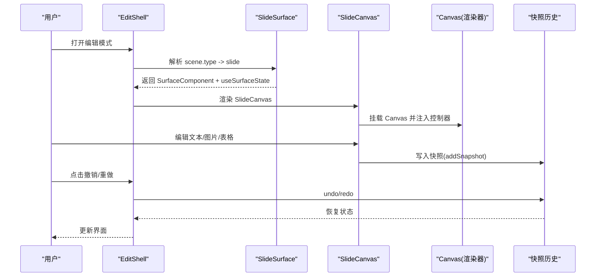
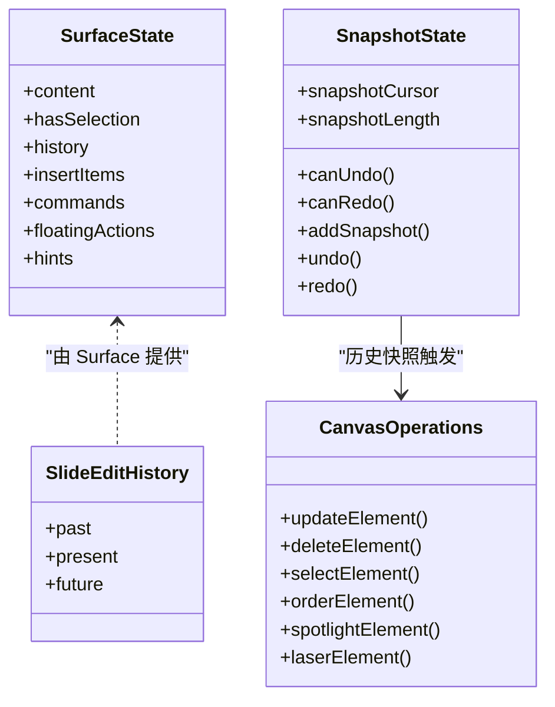
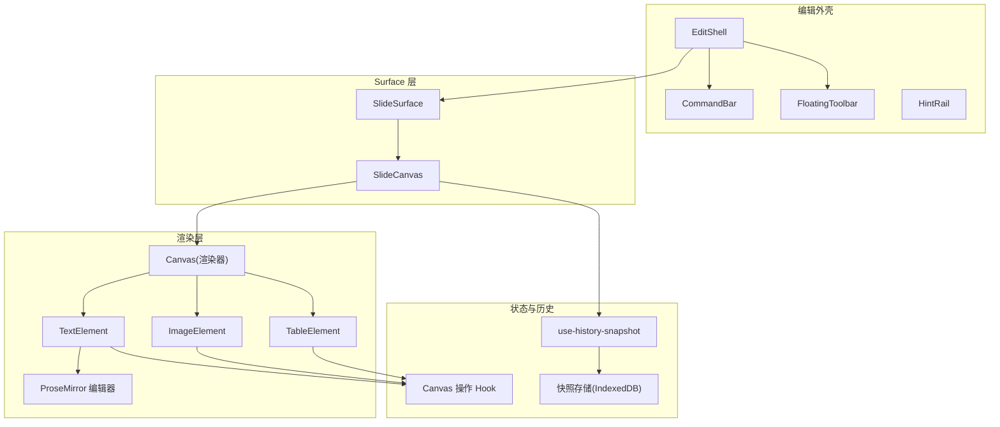
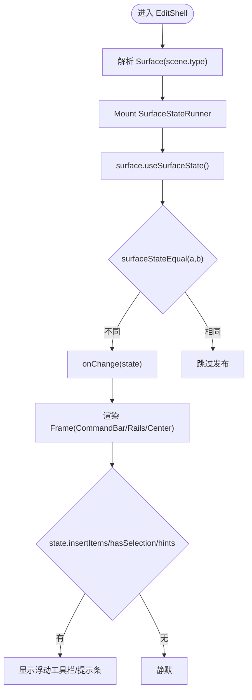
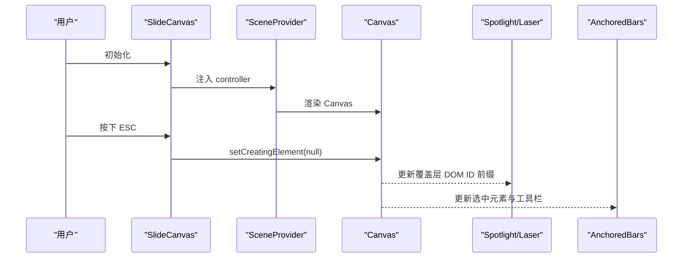
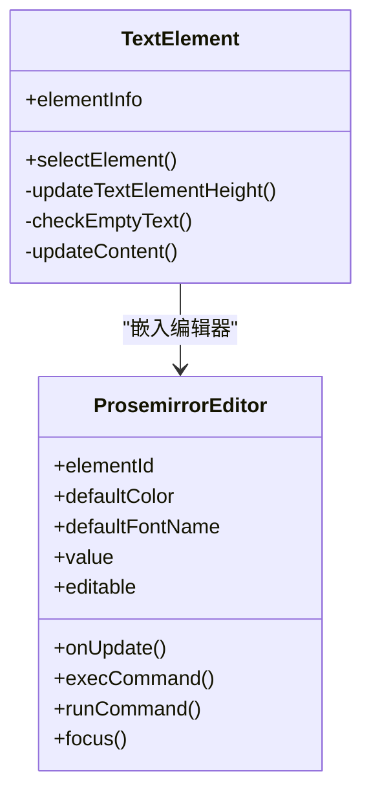
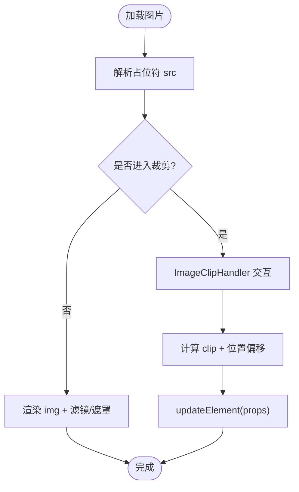
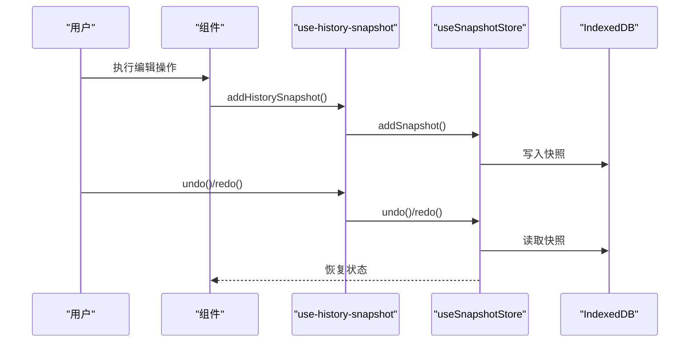
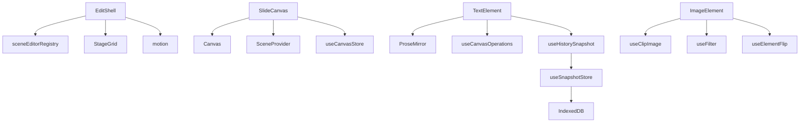

# 编辑器组件

<cite>
**本文引用的文件**
- [EditShell.tsx](file://components/edit/EditShell/EditShell.tsx)
- [CommandBar.tsx](file://components/edit/EditShell/CommandBar.tsx)
- [FloatingToolbar.tsx](file://components/edit/EditShell/FloatingToolbar.tsx)
- [SlideCanvas.tsx](file://components/edit/surfaces/slide/SlideCanvas.tsx)
- [SlideSurface.tsx](file://components/edit/surfaces/slide/SlideSurface.tsx)
- [TextElement/index.tsx](file://components/slide-renderer/components/element/TextElement/index.tsx)
- [ImageElement/index.tsx](file://components/slide-renderer/components/element/ImageElement/index.tsx)
- [TableElement/index.tsx](file://components/slide-renderer/components/element/TableElement/index.tsx)
- [ProsemirrorEditor.tsx](file://components/slide-renderer/components/element/ProsemirrorEditor.tsx)
- [use-history-snapshot.ts](file://lib/hooks/use-history-snapshot.ts)
- [snapshot.ts](file://lib/store/snapshot.ts)
- [slide-ops.ts](file://lib/edit/slide-ops.ts)
- [use-canvas-operations.ts](file://lib/hooks/use-canvas-operations.ts)
</cite>

## 产品概述
本文件聚焦于 OpenMAIC 的幻灯片编辑器组件，围绕 EditShell 编辑外壳、SlideCanvas 画布、以及 TextElement、ImageElement、TableElement 等元素组件展开。文档说明整体架构与布局管理、绘图与元素操作能力、富文本编辑（基于 ProseMirror）、撤销重做机制、实时预览与协作扩展点，并给出性能优化与内存管理建议。

## 核心业务流程
- 用户进入“专业模式”编辑场景时，EditShell 根据当前 scene.type 解析到对应 Surface（如 slide），渲染中心画布与顶部命令栏、浮动工具栏、提示条等 chrome。
- SlideCanvas 复用 slide 渲染器 Canvas，并通过 SceneProvider 将控制器注入，使所有渲染提交都经过 slide-edit-session，自动持久化回主存储。
- 文本元素通过 ProseMirror 编辑器进行富文本编辑；图片元素支持裁剪、滤镜、翻转、遮罩；表格元素目前为静态展示，支持选择/拖拽/缩放。
- 用户在编辑过程中产生的变更通过快照历史系统记录，支持撤销/重做；命令栏提供全局 undo/redo 入口。
- 浮层工具栏根据选中元素动态呈现格式化或类型相关操作。

**章节来源**
- [EditShell.tsx:74-123](file://components/edit/EditShell/EditShell.tsx#L74-L123)
- [SlideSurface.tsx:12-16](file://components/edit/surfaces/slide/SlideSurface.tsx#L12-L16)
- [SlideCanvas.tsx:33-76](file://components/edit/surfaces/slide/SlideCanvas.tsx#L33-L76)
- [use-history-snapshot.ts:19-41](file://lib/hooks/use-history-snapshot.ts#L19-L41)

## 功能模块清单
- EditShell 编辑外壳
  - 职责：统一 chrome 布局（顶部命令栏、左右侧栏、底部条）、按 scene.type 解析 Surface、管理插入工具栏位置、浮动工具栏显示、提示条。
  - 验收要点：切换场景类型不闪烁；命令栏与 rails 动画一致；无注册 surface 时降级为 NOOP_SURFACE。
- SlideCanvas 画布
  - 职责：复用 slide 渲染器 Canvas，注入 SceneProvider，处理 ESC 取消创建模式，渲染聚光灯/激光笔覆盖层，挂载锚定工具栏（文本/非文本）。
  - 验收要点：ESC 能退出创建模式；聚光灯/激光笔效果与元素 id 前缀匹配；锚定工具栏单选互斥。
- TextElement 文本元素
  - 职责：自适应高度/宽度、空内容清理、ResizeObserver 尺寸同步、ProseMirror 富文本编辑、历史记录快照。
  - 验收要点：垂直/水平文本尺寸正确；空内容自动删除；格式命令生效；焦点自动聚焦。
- ImageElement 图片元素
  - 职责：占位符解析、裁剪交互、滤镜、翻转、颜色遮罩、旋转中心偏移计算。
  - 验收要点：裁剪后位置与旋转中心一致；滤镜与遮罩叠加正确；占位符可替换为生成图。
- TableElement 表格元素
  - 职责：静态展示、选择/拖拽/缩放；单元格编辑暂未实现。
  - 验收要点：锁定状态下不可交互；旋转容器正确；与 Canvas 选择体系集成。
- ProseMirror 编辑器集成
  - 职责：初始化 EditorView、命令分发（字体、字号、颜色、加粗、列表、链接、对齐、缩进等）、属性同步、活跃编辑器注册。
  - 验收要点：命令路由到目标 elementId；输入防抖；focus/blur 控制快捷键禁用；属性同步到 store。
- 撤销重做机制
  - 职责：快照存储（IndexedDB）、长度限制、cursor 维护、undo/redo 恢复 scenes 与当前场景。
  - 验收要点：最大快照数限制；撤销后新操作截断未来分支；保持页面焦点与场景索引。
- 实时预览与协作扩展
  - 职责：Surface 状态发布（insertItems/commands/floatingActions/hints）；Active Editor Registry 支持外部驱动文本命令；SceneProvider 统一控制器。
  - 验收要点：Surface 状态浅比较避免无限循环；外部命令可精准作用于指定元素；控制器驱动渲染提交。

**章节来源**
- [EditShell.tsx:74-123](file://components/edit/EditShell/EditShell.tsx#L74-L123)
- [SlideCanvas.tsx:33-76](file://components/edit/surfaces/slide/SlideCanvas.tsx#L33-L76)
- [TextElement/index.tsx:26-228](file://components/slide-renderer/components/element/TextElement/index.tsx#L26-L228)
- [ImageElement/index.tsx:24-166](file://components/slide-renderer/components/element/ImageElement/index.tsx#L24-L166)
- [TableElement/index.tsx:18-51](file://components/slide-renderer/components/element/TableElement/index.tsx#L18-L51)
- [ProsemirrorEditor.tsx:57-555](file://components/slide-renderer/components/element/ProsemirrorEditor.tsx#L57-L555)
- [use-history-snapshot.ts:19-41](file://lib/hooks/use-history-snapshot.ts#L19-L41)
- [snapshot.ts:31-165](file://lib/store/snapshot.ts#L31-L165)

## 数据与状态
- SurfaceState 结构
  - content：当前场景内容引用（内存未提交前稳定）
  - hasSelection：是否有选中项
  - history：{ canUndo, canRedo }
  - insertItems：插入项数组（id、active、disabled、label、tooltip）
  - commands：命令数组（id、disabled、label、tooltip、onInvoke）
  - floatingActions：浮动动作数组（id、disabled、label、onInvoke/popoverContent）
  - hints：提示数组（id、severity、message）
- 状态发布与浅比较
  - SurfaceStateRunner 使用 surfaceStateEqual 对关键字段逐字段比较，避免对象引用变化导致的无限重渲染。
- 撤销重做数据结构
  - SlideEditHistory：{ past, present, future }
  - applySlideEditOperation：对 present 应用操作，若不变则跳过入栈
  - undo/redo：移动 present 在 past/future 之间，capHistory 限制长度
- 快照存储
  - useSnapshotStore：IndexedDB 持久化，最大长度 20，维护 cursor，支持 init/add/undo/redo
- 画布操作
  - useCanvasOperations：封装 add/update/delete/align/order/lock/selectAll 等操作，结合 useHistorySnapshot 写入历史

**图表来源**
- [EditShell.tsx:188-226](file://components/edit/EditShell/EditShell.tsx#L188-L226)
- [slide-ops.ts:84-149](file://lib/edit/slide-ops.ts#L84-L149)
- [snapshot.ts:31-165](file://lib/store/snapshot.ts#L31-L165)
- [use-canvas-operations.ts:1-587](file://lib/hooks/use-canvas-operations.ts#L1-L587)

**章节来源**
- [EditShell.tsx:188-226](file://components/edit/EditShell/EditShell.tsx#L188-L226)
- [slide-ops.ts:84-149](file://lib/edit/slide-ops.ts#L84-L149)
- [snapshot.ts:31-165](file://lib/store/snapshot.ts#L31-L165)
- [use-canvas-operations.ts:1-587](file://lib/hooks/use-canvas-operations.ts#L1-L587)

## 关键约束与边界
- EditShell 架构约束
  - 通过 key={scene.type} 作为 remount 边界，确保 Surface hook 签名变化时 React 规则满足；chrome 层（CommandBar/rails）保持挂载避免闪烁。
  - Frame 仅使用 opacity 过渡，避免 transform 影响 layoutId 共享元素动画与 backdrop-filter 重计算。
- SlideCanvas 行为约束
  - 通过 gestureProps 标记指针手势窗口，区分真实用户编辑与 ResizeObserver 文本归一化事件。
  - 聚光灯/激光笔覆盖层以 domIdPrefix="editable-element-" 定位元素。
- TextElement 约束
  - 垂直/水平文本尺寸分别更新 width/height；缩放期间缓存尺寸，结束后批量更新。
  - 空内容清理使用 debounce 300ms 延迟，避免频繁删除。
- ImageElement 约束
  - 裁剪区域需考虑旋转中心偏移；colorMask 与 filter 叠加顺序固定。
- TableElement 约束
  - 当前为静态展示，单元格编辑未实现；锁定状态下不可交互。
- ProseMirror 集成约束
  - 命令分发通过 emitter 与 Active Editor Registry，target 精确到 elementId；editable=false 时不注册，保持回放路径字节不变。
  - 输入防抖 300ms；focus/blur 控制快捷键禁用；dispatchTransaction 中按需推送属性。
- 撤销重做约束
  - 快照最大长度 20；撤销后新操作会截断未来分支；保持当前场景索引与页面焦点。
- 性能与内存
  - 使用 useReducedMotion 减少动画开销；ResizeObserver 与 debounce 降低高频更新；IndexedDB 异步持久化避免阻塞。

**章节来源**
- [EditShell.tsx:94-123](file://components/edit/EditShell/EditShell.tsx#L94-L123)
- [EditShell.tsx:239-310](file://components/edit/EditShell/EditShell.tsx#L239-L310)
- [SlideCanvas.tsx:33-76](file://components/edit/surfaces/slide/SlideCanvas.tsx#L33-L76)
- [TextElement/index.tsx:48-131](file://components/slide-renderer/components/element/TextElement/index.tsx#L48-L131)
- [ImageElement/index.tsx:49-94](file://components/slide-renderer/components/element/ImageElement/index.tsx#L49-L94)
- [TableElement/index.tsx:18-51](file://components/slide-renderer/components/element/TableElement/index.tsx#L18-L51)
- [ProsemirrorEditor.tsx:89-110](file://components/slide-renderer/components/element/ProsemirrorEditor.tsx#L89-L110)
- [snapshot.ts:91-114](file://lib/store/snapshot.ts#L91-L114)

## 架构图概览

**图表来源**
- [EditShell.tsx:74-123](file://components/edit/EditShell/EditShell.tsx#L74-L123)
- [SlideSurface.tsx:12-16](file://components/edit/surfaces/slide/SlideSurface.tsx#L12-L16)
- [SlideCanvas.tsx:33-76](file://components/edit/surfaces/slide/SlideCanvas.tsx#L33-L76)
- [TextElement/index.tsx:26-228](file://components/slide-renderer/components/element/TextElement/index.tsx#L26-L228)
- [ImageElement/index.tsx:24-166](file://components/slide-renderer/components/element/ImageElement/index.tsx#L24-L166)
- [TableElement/index.tsx:18-51](file://components/slide-renderer/components/element/TableElement/index.tsx#L18-L51)
- [ProsemirrorEditor.tsx:57-555](file://components/slide-renderer/components/element/ProsemirrorEditor.tsx#L57-L555)
- [use-history-snapshot.ts:19-41](file://lib/hooks/use-history-snapshot.ts#L19-L41)
- [snapshot.ts:31-165](file://lib/store/snapshot.ts#L31-L165)
- [use-canvas-operations.ts:1-587](file://lib/hooks/use-canvas-operations.ts#L1-L587)

## 详细组件分析

### EditShell 编辑外壳
- 布局与动画
  - 顶部 CommandBar、左侧 leftRail、右侧 rightRail、底部 bottomRail，中心为 SurfaceComponent。
  - 使用 motion 的 opacity 过渡，避免 transform 影响 layoutId 与 backdrop-filter。
- Surface 解析与状态发布
  - 通过 sceneEditorRegistry.resolve(scene.type) 获取 Surface，否则降级 NOOP_SURFACE。
  - SurfaceStateRunner 调用 surface.useSurfaceState()，经 surfaceStateEqual 浅比较后 onChange 发布。
- 浮动工具栏与提示条
  - 当 state.insertItems 存在时渲染 FloatingInsertToolbar；state.hasSelection 时渲染 FloatingToolbar；state.hints 渲染 HintRail。

**图表来源**
- [EditShell.tsx:74-123](file://components/edit/EditShell/EditShell.tsx#L74-L123)
- [EditShell.tsx:140-155](file://components/edit/EditShell/EditShell.tsx#L140-L155)
- [EditShell.tsx:188-226](file://components/edit/EditShell/EditShell.tsx#L188-L226)

**章节来源**
- [EditShell.tsx:74-123](file://components/edit/EditShell/EditShell.tsx#L74-L123)
- [EditShell.tsx:239-310](file://components/edit/EditShell/EditShell.tsx#L239-L310)

### SlideCanvas 画布
- 控制器与上下文
  - 通过 useSlideCanvasController 获取 controller 与 gestureProps，注入 SceneProvider。
- 键盘与覆盖层
  - ESC 监听取消创建模式；SpotlightOverlay/LaserPointerOverlay 以 editable-element- 前缀定位元素。
- 锚定工具栏
  - AnchoredTextBar 针对文本元素；AnchoredElementBar 针对非文本元素；ElementPickLayer 用于时间线元素绑定。

**图表来源**
- [SlideCanvas.tsx:33-76](file://components/edit/surfaces/slide/SlideCanvas.tsx#L33-L76)

**章节来源**
- [SlideCanvas.tsx:33-76](file://components/edit/surfaces/slide/SlideCanvas.tsx#L33-L76)

### TextElement 文本元素与 ProseMirror 编辑器
- 尺寸自适应与空内容清理
  - ResizeObserver 监听内容尺寸变化，垂直/水平分别更新 width/height；空内容 300ms 后删除。
- ProseMirror 集成
  - 初始化 EditorView，设置 handleDOMEvents（focus/blur/keydown/click/mouseup）。
  - execCommand 分发多种命令（字体、字号、颜色、加粗、列表、链接、对齐、缩进等）。
  - registerActiveTextEditor 允许外部驱动文本命令，target 精确到 elementId。
  - dispatchTransaction 中按需推送属性到 store，editable=false 时跳过。
- 焦点与自动聚焦
  - 当 editingElementId 变化且视图未聚焦时自动 focus，避免插入后需再次点击。

**图表来源**
- [TextElement/index.tsx:26-228](file://components/slide-renderer/components/element/TextElement/index.tsx#L26-L228)
- [ProsemirrorEditor.tsx:57-555](file://components/slide-renderer/components/element/ProsemirrorEditor.tsx#L57-L555)

**章节来源**
- [TextElement/index.tsx:26-228](file://components/slide-renderer/components/element/TextElement/index.tsx#L26-L228)
- [ProsemirrorEditor.tsx:57-555](file://components/slide-renderer/components/element/ProsemirrorEditor.tsx#L57-L555)

### ImageElement 图片元素
- 图像处理
  - 占位符解析（gen_img_*）；裁剪交互（ImageClipHandler）；滤镜（useFilter）；翻转（useElementFlip）；颜色遮罩。
- 旋转中心偏移
  - 裁剪后根据 rotate 计算 centerOffsetX/Y，确保位置正确。

**图表来源**
- [ImageElement/index.tsx:24-166](file://components/slide-renderer/components/element/ImageElement/index.tsx#L24-L166)

**章节来源**
- [ImageElement/index.tsx:24-166](file://components/slide-renderer/components/element/ImageElement/index.tsx#L24-L166)

### TableElement 表格元素
- 静态展示与交互
  - 支持选择/拖拽/缩放；锁定状态下不可交互；旋转容器正确。
- 单元格编辑
  - 暂未实现，遵循 ChartElement 模式。

**章节来源**
- [TableElement/index.tsx:18-51](file://components/slide-renderer/components/element/TableElement/index.tsx#L18-L51)

### 撤销重做机制
- 快照存储
  - IndexedDB 持久化，最大长度 20，维护 cursor，支持 init/add/undo/redo。
- 操作应用
  - applySlideEditOperation 对 present 应用操作，若不变则跳过入栈；undo/redo 移动 present 在 past/future 之间。
- 历史快照 Hook
  - useHistorySnapshot 封装 addSnapshot/undo/redo/canUndo/canRedo。

**图表来源**
- [use-history-snapshot.ts:19-41](file://lib/hooks/use-history-snapshot.ts#L19-L41)
- [snapshot.ts:31-165](file://lib/store/snapshot.ts#L31-L165)
- [slide-ops.ts:84-149](file://lib/edit/slide-ops.ts#L84-L149)

**章节来源**
- [use-history-snapshot.ts:19-41](file://lib/hooks/use-history-snapshot.ts#L19-L41)
- [snapshot.ts:31-165](file://lib/store/snapshot.ts#L31-L165)
- [slide-ops.ts:84-149](file://lib/edit/slide-ops.ts#L84-L149)

### 协作编辑与实时预览扩展
- Surface 状态发布
  - insertItems/commands/floatingActions/hints 通过 shallow comparison 发布，避免无限循环。
- Active Editor Registry
  - registerActiveTextEditor 允许外部驱动文本命令，target 精确到 elementId。
- SceneProvider 控制器
  - 统一控制器驱动渲染提交，确保编辑与回放一致性。

**章节来源**
- [EditShell.tsx:188-226](file://components/edit/EditShell/EditShell.tsx#L188-L226)
- [ProsemirrorEditor.tsx:428-432](file://components/slide-renderer/components/element/ProsemirrorEditor.tsx#L428-L432)
- [SlideCanvas.tsx:61-69](file://components/edit/surfaces/slide/SlideCanvas.tsx#L61-L69)

## 依赖分析
- EditShell 依赖
  - sceneEditorRegistry 解析 Surface；NOOP_SURFACE 降级；StageGrid 布局；motion 动画。
- SlideCanvas 依赖
  - Canvas 渲染器；Spotlight/Laser 覆盖层；SceneProvider；useCanvasStore。
- TextElement 依赖
  - ProseMirror 编辑器；useCanvasOperations；useHistorySnapshot；ResizeObserver。
- ImageElement 依赖
  - useClipImage；useFilter；useElementFlip；useResolvedImageSrc。
- 历史与快照
  - use-history-snapshot 封装 useSnapshotStore；IndexedDB 持久化。

**图表来源**
- [EditShell.tsx:74-123](file://components/edit/EditShell/EditShell.tsx#L74-L123)
- [SlideCanvas.tsx:33-76](file://components/edit/surfaces/slide/SlideCanvas.tsx#L33-L76)
- [TextElement/index.tsx:26-228](file://components/slide-renderer/components/element/TextElement/index.tsx#L26-L228)
- [ImageElement/index.tsx:24-166](file://components/slide-renderer/components/element/ImageElement/index.tsx#L24-L166)
- [use-history-snapshot.ts:19-41](file://lib/hooks/use-history-snapshot.ts#L19-L41)
- [snapshot.ts:31-165](file://lib/store/snapshot.ts#L31-L165)

**章节来源**
- [EditShell.tsx:74-123](file://components/edit/EditShell/EditShell.tsx#L74-L123)
- [SlideCanvas.tsx:33-76](file://components/edit/surfaces/slide/SlideCanvas.tsx#L33-L76)
- [TextElement/index.tsx:26-228](file://components/slide-renderer/components/element/TextElement/index.tsx#L26-L228)
- [ImageElement/index.tsx:24-166](file://components/slide-renderer/components/element/ImageElement/index.tsx#L24-L166)
- [use-history-snapshot.ts:19-41](file://lib/hooks/use-history-snapshot.ts#L19-L41)
- [snapshot.ts:31-165](file://lib/store/snapshot.ts#L31-L165)

## 性能考虑
- 动画与渲染
  - 使用 useReducedMotion 减少动画开销；Frame 仅使用 opacity 过渡，避免 transform 影响 layoutId 与 backdrop-filter。
- 输入与更新
  - ProseMirror 输入防抖 300ms；ResizeObserver 与 debounce 降低高频更新；快照写入 IndexedDB 异步。
- 状态发布
  - surfaceStateEqual 浅比较关键字段，避免对象引用变化导致的无限重渲染。
- 内存管理
  - ProseMirror 销毁时释放 EditorView；ResizeObserver 清理；IndexedDB 快照长度限制 20。

**章节来源**
- [EditShell.tsx:239-310](file://components/edit/EditShell/EditShell.tsx#L239-L310)
- [ProsemirrorEditor.tsx:89-110](file://components/slide-renderer/components/element/ProsemirrorEditor.tsx#L89-L110)
- [TextElement/index.tsx:120-131](file://components/slide-renderer/components/element/TextElement/index.tsx#L120-L131)
- [snapshot.ts:91-114](file://lib/store/snapshot.ts#L91-L114)

## 故障排查指南
- 文本编辑无响应
  - 检查 editable 属性与 focus 状态；确认 registerActiveTextEditor 已注册。
- 图片裁剪位置错误
  - 验证 rotate 中心偏移计算；检查 clipPath 与 imgPosition。
- 撤销重做无效
  - 确认 addHistorySnapshot 在关键操作后调用；检查 IndexedDB 快照长度限制。
- 浮动工具栏不显示
  - 检查 state.hasSelection 与 floatingActions 是否为空；确认 groupByGroup 分组逻辑。

**章节来源**
- [ProsemirrorEditor.tsx:428-432](file://components/slide-renderer/components/element/ProsemirrorEditor.tsx#L428-L432)
- [ImageElement/index.tsx:68-94](file://components/slide-renderer/components/element/ImageElement/index.tsx#L68-L94)
- [use-history-snapshot.ts:30-32](file://lib/hooks/use-history-snapshot.ts#L30-L32)
- [FloatingToolbar.tsx:102-117](file://components/edit/EditShell/FloatingToolbar.tsx#L102-L117)

## 结论
OpenMAIC 的幻灯片编辑器以 EditShell 为核心外壳，通过 Surface 抽象解耦场景类型，SlideCanvas 复用渲染器并提供编辑上下文。TextElement、ImageElement、TableElement 分别实现文本、图片、表格的编辑与展示能力。ProseMirror 编辑器提供强大的富文本编辑，撤销重做机制基于 IndexedDB 快照存储。整体架构清晰、扩展性强，适合协作编辑与实时预览场景。性能优化策略包括动画简化、输入防抖、状态浅比较与内存清理，确保流畅的用户体验。