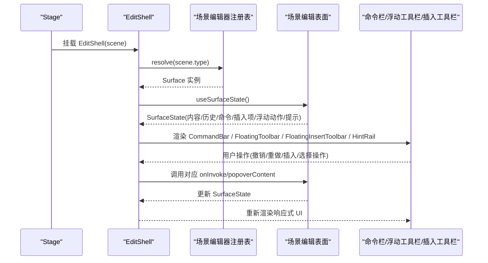
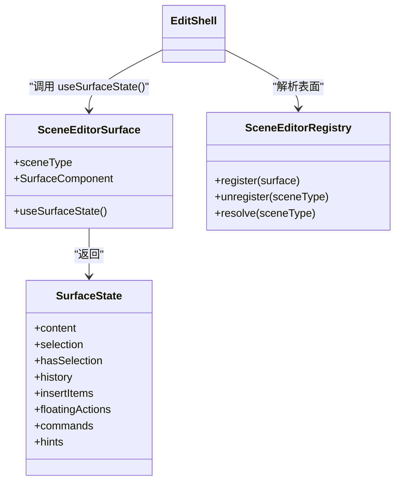
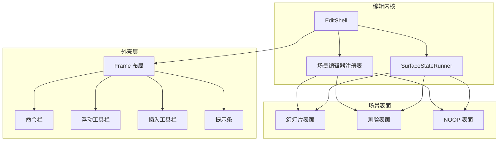
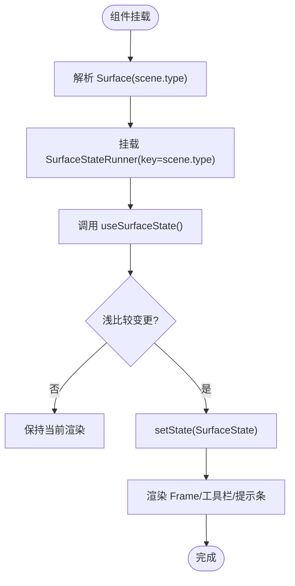
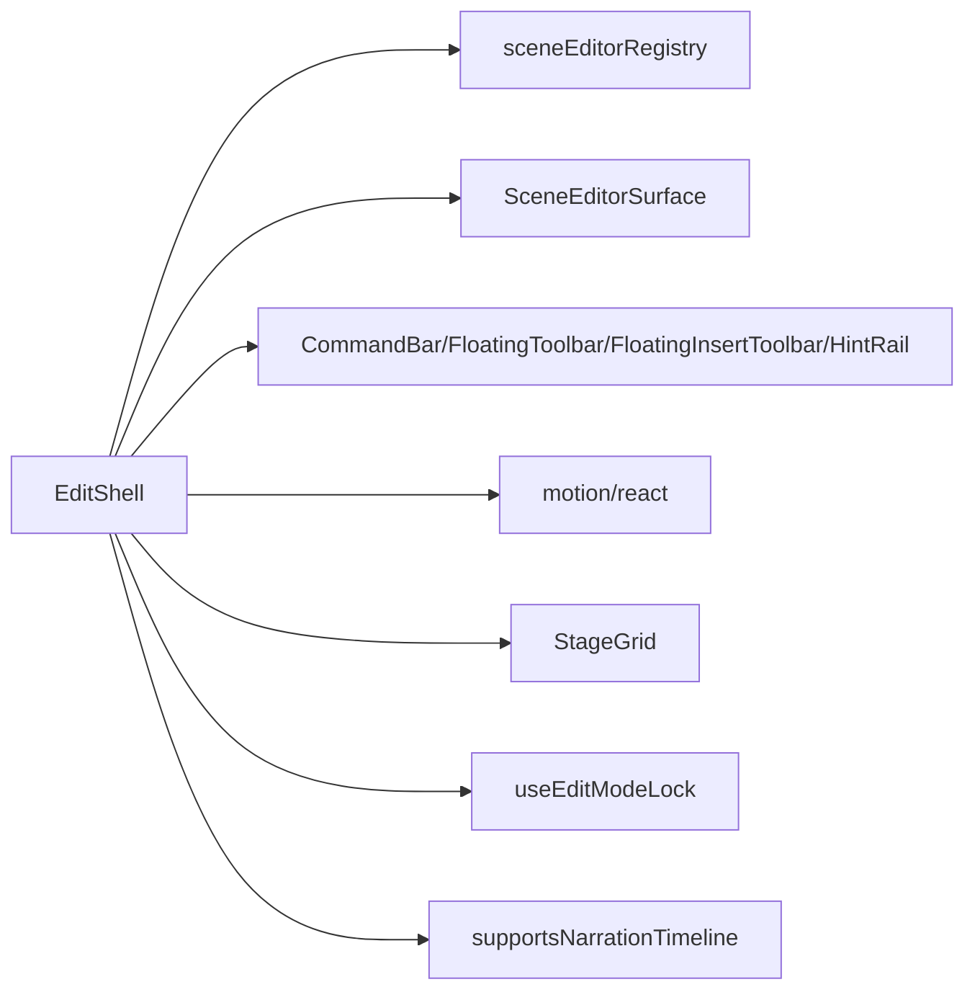

# 编辑外壳组件

<cite>
**本文引用的文件**   
- [EditShell.tsx](file://components/edit/EditShell/EditShell.tsx)
- [CommandBar.tsx](file://components/edit/EditShell/CommandBar.tsx)
- [FloatingToolbar.tsx](file://components/edit/EditShell/FloatingToolbar.tsx)
- [FloatingInsertToolbar.tsx](file://components/edit/EditShell/FloatingInsertToolbar.tsx)
- [HintRail.tsx](file://components/edit/EditShell/HintRail.tsx)
- [InsertButton.tsx](file://components/edit/EditShell/InsertButton.tsx)
- [index.ts](file://components/edit/EditShell/index.ts)
- [scene-editor-surface.ts](file://lib/edit/scene-editor-surface.ts)
- [scene-editor-registry.ts](file://lib/edit/scene-editor-registry.ts)
- [use-edit-mode-lock.ts](file://components/edit/use-edit-mode-lock.ts)
- [scene-timeline.ts](file://components/edit/scene-timeline.ts)
</cite>

## 产品概述
本章节聚焦于 EditShell 编辑外壳组件，它是 OpenMAIC 在“编辑模式”下的核心工作区容器。它负责：
- 统一编排命令栏、左侧导航（可选）、右侧面板（可选）、底部时间线（可选）与中心画布区域；
- 通过场景编辑器注册表将不同场景类型（如幻灯片、测验等）的编辑表面无缝接入；
- 管理编辑状态发布、浮动工具栏与插入工具栏的动态显示；
- 为 AI 提示条预留空间并支持未来扩展；
- 提供跨标签页编辑锁、与场景时间线的集成点，以及可扩展的命令与上下文操作。

## 核心业务流程
- 进入编辑模式时，Stage 将 EditShell 挂载到画布槽位，替换播放视图；顶部全局 Header 保持挂载以控制 Pro 切换。
- EditShell 根据当前 scene.type 解析对应的 SceneEditorSurface，并通过 useSurfaceState 订阅其状态变化。
- 状态变化经浅比较后发布给外壳渲染：命令栏、浮动工具栏、插入工具栏、AI 提示条按需显示。
- 用户交互（撤销/重做、插入元素、选择项操作）通过 surface 暴露的命令与动作执行，数据同步回 surface 内部状态。
- 离开编辑模式时，清理选择态并释放编辑锁；若存在多标签冲突则展示冲突提示。

**图表来源** 
- [EditShell.tsx:74-123](file://components/edit/EditShell/EditShell.tsx#L74-L123)
- [scene-editor-registry.ts:6-25](file://lib/edit/scene-editor-registry.ts#L6-L25)
- [scene-editor-surface.ts:126-145](file://lib/edit/scene-editor-surface.ts#L126-L145)

**章节来源**
- [EditShell.tsx:74-123](file://components/edit/EditShell/EditShell.tsx#L74-L123)
- [scene-editor-registry.ts:6-25](file://lib/edit/scene-editor-registry.ts#L6-L25)
- [scene-editor-surface.ts:126-145](file://lib/edit/scene-editor-surface.ts#L126-L145)

## 功能模块清单
- 编辑外壳容器（EditShell）
  - 职责：按场景类型解析并挂载 Surface；维护插入工具栏位置；渲染 Frame 布局与过渡动画；发布/消费 SurfaceState。
  - 验收要点：切换场景类型不闪烁；插入工具栏位置持久化；悬浮工具栏按选择态显示；AI 提示条占位正确。
- 命令栏（CommandBar）
  - 职责：返回主页、撤销/重做、标题、表面命令、右侧插槽（设置/Pro 开关/下载）。
  - 验收要点：历史按钮状态与 canUndo/canRedo 一致；命令项禁用/提示正确；trailing 插槽可注入全局控件。
- 浮动工具栏（FloatingToolbar）
  - 职责：选中项上方显示分组操作，支持按钮与弹出层（属性面板）。
  - 验收要点：分组分隔符正确；危险操作样式区分；弹出层打开不抢占焦点且可连续格式化。
- 插入工具栏（FloatingInsertToolbar）
  - 职责：可拖拽的垂直工具条，包含插入项按钮；键盘辅助移动。
  - 验收要点：拖拽约束在画布内；Shift+方向键大步长；键盘无障碍可用；tooltip 显示正常。
- 提示条（HintRail）
  - 职责：预留 AI 提示区域，支持信息/建议/警告三类卡片及可选操作。
  - 验收要点：reserveSpace 模式下动态计算高度；严重级别样式正确；action 点击有效。
- 插入按钮（InsertButton）
  - 职责：复用插入项按钮逻辑，支持图标/文本、激活态、tooltip、popover。
  - 验收要点：active/disabled 状态正确；popover 触发链路与 Tooltip 组合无事件丢失。
- 场景编辑器接口与注册表
  - 职责：定义 SurfaceState、命令/插入项/浮动动作/提示的数据结构；提供 register/unregister/resolve。
  - 验收要点：新增字段需同步浅比较函数；HMR 覆盖保护；resolve 返回 NOOP 兜底。
- 编辑模式锁（useEditModeLock）
  - 职责：跨标签页获取/释放编辑锁，心跳保活，冲突弹窗。
  - 验收要点：无课程 ID 降级为单标签；beforeunload 释放；心跳刷新成功。
- 场景时间线支持（scene-timeline）
  - 职责：判断是否支持旁白时间线（已注册表面或仅旁白类型）。
  - 验收要点：interactive/pbl 类型在无表面时仍支持时间线。

**章节来源**
- [EditShell.tsx:94-123](file://components/edit/EditShell/EditShell.tsx#L94-L123)
- [CommandBar.tsx:35-84](file://components/edit/EditShell/CommandBar.tsx#L35-L84)
- [FloatingToolbar.tsx:18-37](file://components/edit/EditShell/FloatingToolbar.tsx#L18-L37)
- [FloatingInsertToolbar.tsx:29-114](file://components/edit/EditShell/FloatingInsertToolbar.tsx#L29-L114)
- [HintRail.tsx:17-55](file://components/edit/EditShell/HintRail.tsx#L17-L55)
- [InsertButton.tsx:23-76](file://components/edit/EditShell/InsertButton.tsx#L23-L76)
- [scene-editor-surface.ts:20-120](file://lib/edit/scene-editor-surface.ts#L20-L120)
- [scene-editor-registry.ts:6-25](file://lib/edit/scene-editor-registry.ts#L6-L25)
- [use-edit-mode-lock.ts:31-80](file://components/edit/use-edit-mode-lock.ts#L31-L80)
- [scene-timeline.ts:12-17](file://components/edit/scene-timeline.ts#L12-L17)

## 数据与状态
- SurfaceState 是编辑表面的核心状态契约，包含：
  - content/selection：内容与选择；
  - hasSelection：驱动浮动工具栏显隐；
  - history：撤销/重做能力；
  - insertItems/floatingActions/commands：插入项、浮动动作、命令；
  - hints：AI 提示（Phase 1 为空数组）。
- EditShell 通过 SurfaceStateRunner 订阅 surface.useSurfaceState()，并使用 field-by-field 浅比较避免无限发布循环。
- 插入工具栏位置由 MotionValue 驱动，持久化在壳层以避免临时卸载丢失。
- 命令栏与浮动工具栏直接消费 SurfaceState 中的相应字段进行渲染。

**图表来源** 
- [scene-editor-surface.ts:101-145](file://lib/edit/scene-editor-surface.ts#L101-L145)
- [scene-editor-registry.ts:6-25](file://lib/edit/scene-editor-registry.ts#L6-L25)
- [EditShell.tsx:140-155](file://components/edit/EditShell/EditShell.tsx#L140-L155)

**章节来源**
- [scene-editor-surface.ts:101-145](file://lib/edit/scene-editor-surface.ts#L101-L145)
- [EditShell.tsx:140-155](file://components/edit/EditShell/EditShell.tsx#L140-L155)

## 关键约束与边界
- 架构约束
  - EditShell 不分支具体组件类型，始终通过 key={scene.type} 重入 runner 保证 hooks 签名稳定；chrome 层永不重新挂载，避免闪烁。
  - SurfaceState 新增字段必须同步更新浅比较函数，否则 chrome 读取会失效。
- 性能与内存
  - 使用 MotionValue 与 layoutId 减少重排；仅透明度过渡避免 backdrop-filter 重算。
  - 插入工具栏拖拽关闭动量与弹性，降低高频更新开销。
  - 浅比较仅对比 chrome 实际读取字段，避免闭包引用导致的无效重渲染。
- 集成边界
  - 命令栏 trailing 插槽由 Stage 注入全局控件，确保顶部 chrome 单一化。
  - 时间线支持独立于表面：已注册表面或仅旁白类型均支持。
  - 编辑锁跨标签页生效，无课程 ID 降级为单标签语义。
- 快捷键与上下文菜单
  - 插入工具栏支持键盘拖拽（Enter/空格切换模式，方向键移动，Shift 大步长，Esc 退出）。
  - 上下文菜单能力由通用 UI 组件提供，可在表面中按需集成。
- 批量操作
  - 通过 commands 与 floatingActions 暴露批量能力（如全选删除、批量格式），由 surface 实现具体逻辑。
- 扩展点与自定义工具栏
  - 通过注册新的 SceneEditorSurface 接入新场景类型；
  - 通过 insertItems/floatingActions/commands/hints 扩展 UI；
  - 复用 InsertButton 与 Popover/Tooltip 组合构建复杂交互。

**章节来源**
- [EditShell.tsx:94-123](file://components/edit/EditShell/EditShell.tsx#L94-L123)
- [EditShell.tsx:188-226](file://components/edit/EditShell/EditShell.tsx#L188-L226)
- [FloatingInsertToolbar.tsx:36-66](file://components/edit/EditShell/FloatingInsertToolbar.tsx#L36-L66)
- [scene-timeline.ts:12-17](file://components/edit/scene-timeline.ts#L12-L17)
- [use-edit-mode-lock.ts:31-80](file://components/edit/use-edit-mode-lock.ts#L31-L80)
- [context-menu.tsx:1-239](file://components/ui/context-menu.tsx#L1-L239)

## 架构总览

**图表来源** 
- [EditShell.tsx:74-123](file://components/edit/EditShell/EditShell.tsx#L74-L123)
- [scene-editor-registry.ts:6-25](file://lib/edit/scene-editor-registry.ts#L6-L25)
- [scene-editor-surface.ts:126-145](file://lib/edit/scene-editor-surface.ts#L126-L145)

## 详细组件分析

### EditShell 与 Frame 布局
- 布局策略：StageGrid 划分 top/left/center/right/bottom 插槽；top 为命令栏，left/right/bottom 为可选轨道；center 为画布区域。
- 动画策略：仅透明度渐变，避免 transform 影响 layoutId 与 backdrop-filter 重算；延迟错开命令栏与左侧轨道入场。
- 状态发布：SurfaceStateRunner 使用 useLayoutEffect 与浅比较发布状态，防止无限循环。

**图表来源** 
- [EditShell.tsx:140-155](file://components/edit/EditShell/EditShell.tsx#L140-L155)
- [EditShell.tsx:239-310](file://components/edit/EditShell/EditShell.tsx#L239-L310)

**章节来源**
- [EditShell.tsx:239-310](file://components/edit/EditShell/EditShell.tsx#L239-L310)
- [EditShell.tsx:140-155](file://components/edit/EditShell/EditShell.tsx#L140-L155)

### 命令栏（CommandBar）
- 功能：返回主页、撤销/重做、标题、表面命令、trailing 插槽。
- 交互：按钮带 tooltip；禁用态由命令项 disabled 控制。
- 集成：history 来自 SurfaceState.history；commands 来自 SurfaceState.commands。

**章节来源**
- [CommandBar.tsx:35-84](file://components/edit/EditShell/CommandBar.tsx#L35-L84)

### 浮动工具栏（FloatingToolbar）
- 功能：选中项上方显示分组操作，支持按钮与弹出层。
- 行为：打开弹出层不抢占焦点，允许连续格式化；危险操作特殊样式。
- 分组：按 group 字段分组，组间插入分隔线。

**章节来源**
- [FloatingToolbar.tsx:18-37](file://components/edit/EditShell/FloatingToolbar.tsx#L18-L37)
- [FloatingToolbar.tsx:102-117](file://components/edit/EditShell/FloatingToolbar.tsx#L102-L117)

### 插入工具栏（FloatingInsertToolbar）
- 功能：可拖拽的垂直工具条，包含插入项按钮。
- 交互：鼠标拖拽与键盘辅助（Enter/空格切换模式，方向键移动，Shift 大步长，Esc 退出）。
- 定位：MotionValue 驱动 x/y，约束在画布内，位置持久化。

**章节来源**
- [FloatingInsertToolbar.tsx:29-114](file://components/edit/EditShell/FloatingInsertToolbar.tsx#L29-L114)

### 提示条（HintRail）
- 功能：AI 提示区域，支持 info/suggestion/warning 三类卡片与可选 action。
- 行为：reserveSpace 模式下动态计算高度并写入 CSS 变量。

**章节来源**
- [HintRail.tsx:17-55](file://components/edit/EditShell/HintRail.tsx#L17-L55)
- [HintRail.tsx:57-90](file://components/edit/EditShell/HintRail.tsx#L57-L90)

### 插入按钮（InsertButton）
- 功能：复用插入项按钮逻辑，支持图标/文本、激活态、tooltip、popover。
- 行为：当 item.popoverContent 存在时作为 PopoverTrigger，与 Tooltip 组合无事件丢失。

**章节来源**
- [InsertButton.tsx:23-76](file://components/edit/EditShell/InsertButton.tsx#L23-L76)

### 场景编辑器接口与注册表
- 接口：SceneEditorSurface 定义 sceneType、SurfaceComponent、useSurfaceState。
- 数据结构：InsertPaletteItem、FloatingAction、EditorCommand、EditorHint、SurfaceHistory、SurfaceState。
- 注册表：register/unregister/resolve，HMR 覆盖保护与 NOOP 兜底。

**章节来源**
- [scene-editor-surface.ts:20-120](file://lib/edit/scene-editor-surface.ts#L20-L120)
- [scene-editor-surface.ts:126-145](file://lib/edit/scene-editor-surface.ts#L126-L145)
- [scene-editor-registry.ts:6-25](file://lib/edit/scene-editor-registry.ts#L6-L25)

### 编辑模式锁（useEditModeLock）
- 功能：跨标签页获取/释放编辑锁，心跳保活，冲突弹窗。
- 降级：无课程 ID 时不拒绝进入编辑模式。

**章节来源**
- [use-edit-mode-lock.ts:31-80](file://components/edit/use-edit-mode-lock.ts#L31-L80)

### 场景时间线集成
- 规则：已注册表面或仅旁白类型（interactive/pbl）支持时间线。
- 用途：ActionsBar 在任何有旁白的场景中显示。

**章节来源**
- [scene-timeline.ts:12-17](file://components/edit/scene-timeline.ts#L12-L17)

## 依赖分析
- EditShell 依赖：
  - 场景编辑器注册表（sceneEditorRegistry）用于解析 Surface；
  - SurfaceState 契约（scene-editor-surface.ts）定义数据流；
  - UI 组件（CommandBar、FloatingToolbar、FloatingInsertToolbar、HintRail、InsertButton）；
  - 动画库（motion/react）与布局（StageGrid）。
- 外部集成：
  - Stage Header 通过 trailing 插槽注入全局控件；
  - 编辑锁（edit-mode-lock）跨标签页协作；
  - 时间线（scene-timeline）独立于表面。

**图表来源** 
- [EditShell.tsx:74-123](file://components/edit/EditShell/EditShell.tsx#L74-L123)
- [scene-editor-registry.ts:6-25](file://lib/edit/scene-editor-registry.ts#L6-L25)
- [scene-editor-surface.ts:126-145](file://lib/edit/scene-editor-surface.ts#L126-L145)
- [use-edit-mode-lock.ts:31-80](file://components/edit/use-edit-mode-lock.ts#L31-L80)
- [scene-timeline.ts:12-17](file://components/edit/scene-timeline.ts#L12-L17)

**章节来源**
- [EditShell.tsx:74-123](file://components/edit/EditShell/EditShell.tsx#L74-L123)
- [scene-editor-registry.ts:6-25](file://lib/edit/scene-editor-registry.ts#L6-L25)
- [scene-editor-surface.ts:126-145](file://lib/edit/scene-editor-surface.ts#L126-L145)
- [use-edit-mode-lock.ts:31-80](file://components/edit/use-edit-mode-lock.ts#L31-L80)
- [scene-timeline.ts:12-17](file://components/edit/scene-timeline.ts#L12-L17)

## 性能考虑
- 渲染优化
  - 仅透明度过渡，避免 transform 导致 backdrop-filter 重算；
  - SurfaceState 浅比较仅对比 chrome 读取字段，避免闭包引起的无限循环；
  - 插入工具栏拖拽关闭动量与弹性，降低高频更新。
- 内存管理
  - SurfaceStateRunner 使用 useRef 保存上次状态，避免重复发布；
  - 插入工具栏位置使用 MotionValue 而非 state，减少 React 重渲染；
  - 编辑锁在 beforeunload 与 unmount 时释放，防止泄漏。
- 扩展建议
  - 新增 SurfaceState 字段时务必同步浅比较函数；
  - 对频繁更新的 UI 使用 memoization 与受控最小化状态。

[本节为通用指导，不直接分析具体文件]

## 故障排查指南
- 插入工具栏无法拖拽
  - 检查 dragListener/dragControls 是否正确绑定；
  - 确认 constraintsRef 指向父容器且未被 pointer-events-none 拦截。
- 浮动工具栏弹出层不打开
  - 确认 ActionButton 的 PopoverTrigger asChild 链式包裹 Tooltip；
  - 检查 onOpenAutoFocus/onFocusOutside 是否阻止默认行为。
- 命令栏历史按钮不可用
  - 检查 SurfaceState.history.canUndo/canRedo 是否正确更新；
  - 确认 surface 的 undo/redo 引用稳定。
- 编辑锁冲突
  - 查看 conflictOpen 状态与 acquire/release 调用时机；
  - 确认心跳刷新间隔与 beforeunload 释放逻辑。
- 时间线未显示
  - 验证 supportsNarrationTimeline 返回值；
  - 检查 scene.type 是否为 interactive/pbl 或已注册表面。

**章节来源**
- [FloatingInsertToolbar.tsx:36-66](file://components/edit/EditShell/FloatingInsertToolbar.tsx#L36-L66)
- [FloatingToolbar.tsx:64-99](file://components/edit/EditShell/FloatingToolbar.tsx#L64-L99)
- [CommandBar.tsx:47-56](file://components/edit/EditShell/CommandBar.tsx#L47-L56)
- [use-edit-mode-lock.ts:37-72](file://components/edit/use-edit-mode-lock.ts#L37-L72)
- [scene-timeline.ts:12-17](file://components/edit/scene-timeline.ts#L12-L17)

## 结论
EditShell 通过清晰的架构与稳定的状态发布机制，将命令栏、浮动工具栏、插入工具栏与 AI 提示条有机整合，并以场景编辑器注册表解耦不同编辑表面。其性能优化与内存管理策略确保了流畅的用户体验，同时提供了丰富的扩展点与集成边界，便于后续功能演进与定制开发。

[本节为总结性内容，不直接分析具体文件]