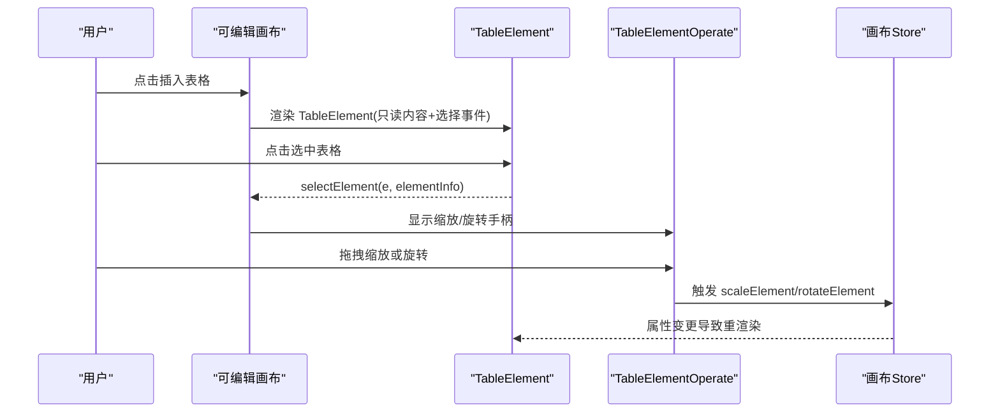
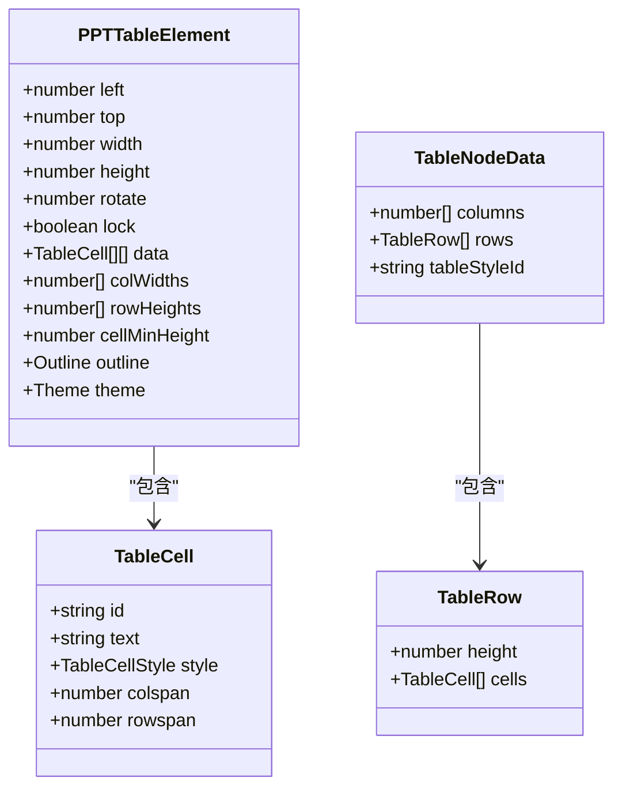
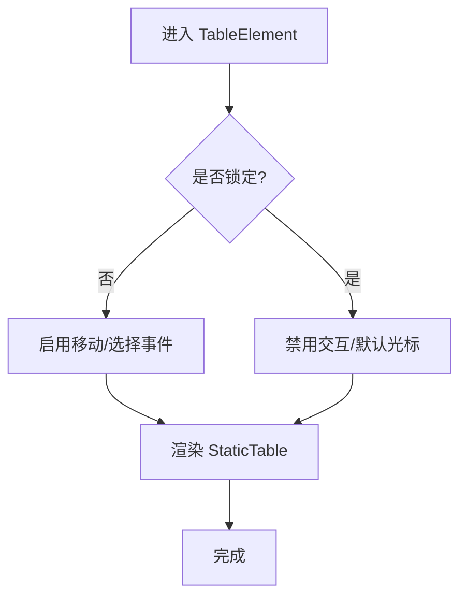
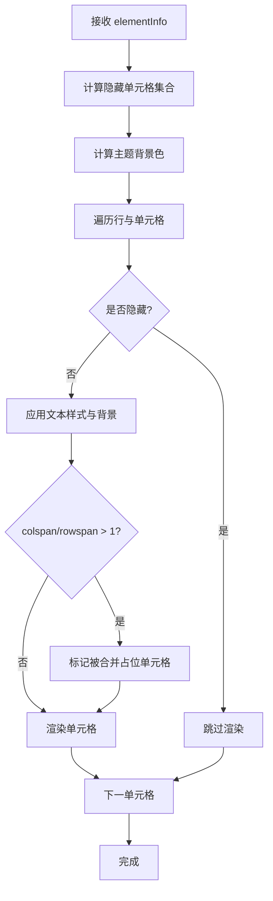
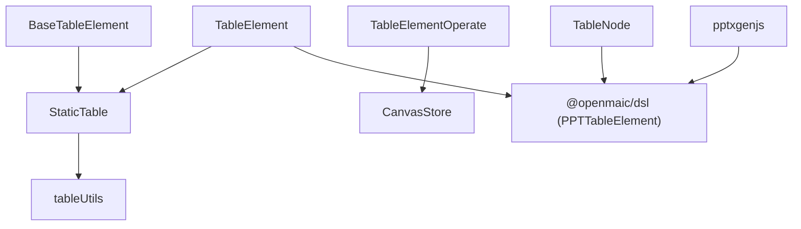
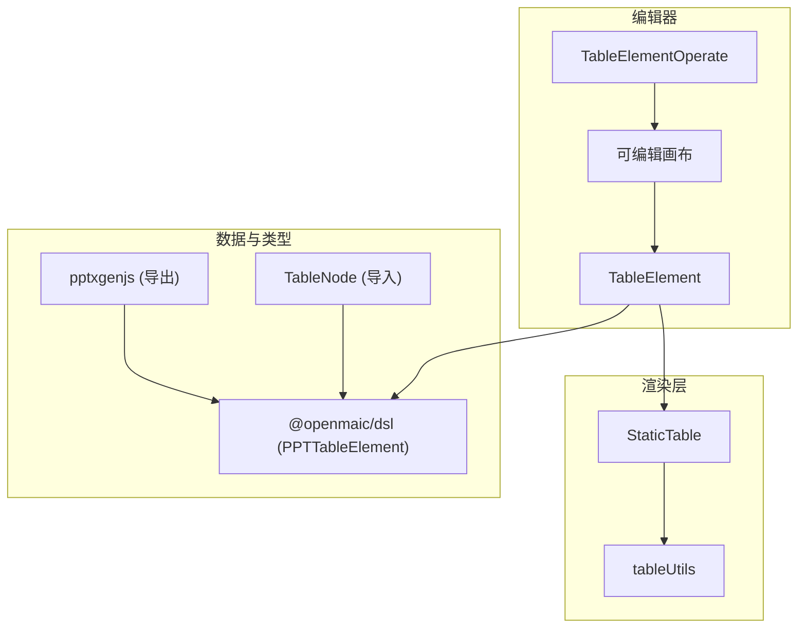

# 表格元素组件

<cite>
**本文引用的文件**   
- [components/slide-renderer/components/element/TableElement/index.tsx](file://components/slide-renderer/components/element/TableElement/index.tsx)
- [components/slide-renderer/components/element/TableElement/BaseTableElement.tsx](file://components/slide-renderer/components/element/TableElement/BaseTableElement.tsx)
- [components/slide-renderer/components/element/TableElement/StaticTable.tsx](file://components/slide-renderer/components/element/TableElement/StaticTable.tsx)
- [components/slide-renderer/components/element/TableElement/tableUtils.ts](file://components/slide-renderer/components/element/TableElement/tableUtils.ts)
- [components/slide-renderer/Editor/Canvas/Operate/TableElementOperate.tsx](file://components/slide-renderer/Editor/Canvas/Operate/TableElementOperate.tsx)
- [components/slide-renderer/Editor/Canvas/EditableElement.tsx](file://components/slide-renderer/Editor/Canvas/EditableElement.tsx)
- [components/slide-renderer/Editor/ScreenElement.tsx](file://components/slide-renderer/Editor/ScreenElement.tsx)
- [lib/store/canvas.ts](file://lib/store/canvas.ts)
- [packages/@openmaic/dsl/src/slides.ts](file://packages/@openmaic/dsl/src/slides.ts)
- [packages/@openmaic/importer/src/model/nodes/TableNode.ts](file://packages/@openmaic/importer/src/model/nodes/TableNode.ts)
- [packages/pptxgenjs/src/core-interfaces.ts](file://packages/pptxgenjs/src/core-interfaces.ts)
</cite>

## 产品概述
本文件聚焦 TableElement 表格元素组件，覆盖其在课件编辑器中的创建、编辑与布局管理，以及渲染、样式定制、主题支持、导入导出、数据绑定、合并拆分、排序与性能优化等关键能力。该组件在编辑模式与播放/缩略图模式下分别由可编辑与只读两种形态提供一致的视觉与交互体验。

## 核心业务流程
- 创建与插入：通过画布编辑器的元素注册机制将 TableElement 挂载到指定位置，并初始化尺寸、旋转、锁定等基础属性。
- 选择与操作：选中后显示缩放手柄与旋转手柄，支持拖拽调整大小与旋转；边框辅助线用于对齐与边界提示。
- 渲染与展示：静态渲染表结构、列宽、行高、单元格合并、主题色与边框样式；隐藏被合并占用的单元格。
- 状态同步：编辑操作通过回调更新元素属性（如 width、height、rotate），并在 store 中维护选中单元格集合等全局状态。

图表来源 
- [components/slide-renderer/Editor/Canvas/EditableElement.tsx](file://components/slide-renderer/Editor/Canvas/EditableElement.tsx)
- [components/slide-renderer/components/element/TableElement/index.tsx](file://components/slide-renderer/components/element/TableElement/index.tsx)
- [components/slide-renderer/Editor/Canvas/Operate/TableElementOperate.tsx](file://components/slide-renderer/Editor/Canvas/Operate/TableElementOperate.tsx)
- [lib/store/canvas.ts](file://lib/store/canvas.ts)

章节来源
- [components/slide-renderer/Editor/Canvas/EditableElement.tsx](file://components/slide-renderer/Editor/Canvas/EditableElement.tsx)
- [components/slide-renderer/components/element/TableElement/index.tsx](file://components/slide-renderer/components/element/TableElement/index.tsx)
- [components/slide-renderer/Editor/Canvas/Operate/TableElementOperate.tsx](file://components/slide-renderer/Editor/Canvas/Operate/TableElementOperate.tsx)
- [lib/store/canvas.ts](file://lib/store/canvas.ts)

## 功能模块清单
- 可编辑表格元素（TableElement）
  - 职责：承载表格的绝对定位、旋转、锁定与选择事件；内部委托 StaticTable 进行渲染。
  - 验收要点：支持鼠标/触摸选择、阻止冒泡、根据 lock 切换光标与交互。
- 只读表格元素（BaseTableElement）
  - 职责：用于回放与缩略图模式，禁用指针事件（缩略图）或不响应交互。
  - 验收要点：与可编辑版本一致的布局与旋转效果。
- 静态表格渲染（StaticTable）
  - 职责：基于 PPTTableElement 的数据模型渲染表格，处理列宽、行高、合并单元格、主题背景与文本样式。
  - 验收要点：合并计算正确、主题色应用正确、隐藏被合并占位单元格。
- 工具函数（tableUtils）
  - 职责：样式转换、文本格式化、隐藏单元格计算。
  - 验收要点：CSS 映射完整、换行与空格转义、合并逻辑无遗漏。
- 编辑操作器（TableElementOperate）
  - 职责：绘制边框辅助线与缩放/旋转手柄，驱动缩放与旋转回调。
  - 验收要点：手柄位置与旋转角度一致、缩放尺寸考虑 outline 宽度与画布缩放。
- 元素注册与路由
  - 职责：在可编辑画布与屏幕元素中将 TABLE 类型映射到对应组件。
  - 验收要点：TABLE 类型能正确解析为 TableElement 或 BaseTableElement。

章节来源
- [components/slide-renderer/components/element/TableElement/index.tsx](file://components/slide-renderer/components/element/TableElement/index.tsx)
- [components/slide-renderer/components/element/TableElement/BaseTableElement.tsx](file://components/slide-renderer/components/element/TableElement/BaseTableElement.tsx)
- [components/slide-renderer/components/element/TableElement/StaticTable.tsx](file://components/slide-renderer/components/element/TableElement/StaticTable.tsx)
- [components/slide-renderer/components/element/TableElement/tableUtils.ts](file://components/slide-renderer/components/element/TableElement/tableUtils.ts)
- [components/slide-renderer/Editor/Canvas/Operate/TableElementOperate.tsx](file://components/slide-renderer/Editor/Canvas/Operate/TableElementOperate/TableElementOperate.tsx)
- [components/slide-renderer/Editor/Canvas/EditableElement.tsx](file://components/slide-renderer/Editor/Canvas/EditableElement.tsx)
- [components/slide-renderer/Editor/ScreenElement.tsx](file://components/slide-renderer/Editor/ScreenElement.tsx)

## 数据与状态
- 数据模型（PPTTableElement）
  - 字段包括：位置与尺寸（left/top/width/height）、旋转（rotate）、锁定（lock）、数据（data）、列宽（colWidths）、行高（rowHeights）、最小单元格高度（cellMinHeight）、外框（outline）、主题（theme）。
  - 单元格（TableCell）包含 id、文本（text）、样式（style）、跨列（colspan）、跨行（rowspan）等。
- 渲染状态
  - 列宽与行高经安全校验后参与渲染；主题色按行列头尾与交替行策略计算背景；边框样式由 outline.width/color/style 决定。
- 编辑状态
  - 画布 store 维护 selectedTableCells 以支持后续单元格级编辑与批量操作。
- 导入模型（TableNode）
  - 解析 XML 表格节点，提取 gridSpan、rowSpan、hMerge/vMerge 与文本体，供导入流程使用。

图表来源 
- [packages/@openmaic/dsl/src/slides.ts](file://packages/@openmaic/dsl/src/slides.ts)
- [packages/@openmaic/importer/src/model/nodes/TableNode.ts](file://packages/@openmaic/importer/src/model/nodes/TableNode.ts)

章节来源
- [packages/@openmaic/dsl/src/slides.ts](file://packages/@openmaic/dsl/src/slides.ts)
- [packages/@openmaic/importer/src/model/nodes/TableNode.ts](file://packages/@openmaic/importer/src/model/nodes/TableNode.ts)
- [lib/store/canvas.ts](file://lib/store/canvas.ts)

## 关键约束与边界
- 渲染与布局
  - 表格采用固定布局（tableLayout: fixed），列宽按比例映射到实际像素；行高优先取 rowHeights，否则回退到 cellMinHeight。
  - 合并单元格通过 getHiddenCells 计算隐藏坐标集合，避免重复渲染。
- 主题与样式
  - 主题支持首行/末行标题与首列/末列页脚的背景色；交替行使用浅色子主题；标题行文字颜色自动设为白色（除非单元格自定义颜色）。
  - 边框样式支持 solid/dashed，宽度与颜色来自 outline。
- 编辑与交互
  - 锁定（lock）时禁止选择与拖拽；旋转通过外层容器 transform 实现。
  - 缩放与旋转由 TableElementOperate 驱动，缩放尺寸需考虑 outline 宽度与画布缩放比例。
- 导入导出
  - 导入：TableNode 解析 XML 表格结构，保留合并信息（gridSpan/rowSpan/hMerge/vMerge）。
  - 导出：pptxgenjs 的表格接口支持 colspan/rowspan、边框、填充与超链接，可用于生成 Excel 兼容的嵌入工作表。
- 性能与可扩展性
  - 使用 useMemo 缓存列宽、行高、隐藏单元格集合与主题色，减少重复计算。
  - 当前为只读渲染，单元格编辑未实现；如需扩展，可在 TableElement 内接入 ProseMirror 或自定义编辑器。

章节来源
- [components/slide-renderer/components/element/TableElement/StaticTable.tsx](file://components/slide-renderer/components/element/TableElement/StaticTable.tsx)
- [components/slide-renderer/components/element/TableElement/tableUtils.ts](file://components/slide-renderer/components/element/TableElement/tableUtils.ts)
- [components/slide-renderer/Editor/Canvas/Operate/TableElementOperate.tsx](file://components/slide-renderer/Editor/Canvas/Operate/TableElementOperate.tsx)
- [packages/@openmaic/importer/src/model/nodes/TableNode.ts](file://packages/@openmaic/importer/src/model/nodes/TableNode.ts)
- [packages/pptxgenjs/src/core-interfaces.ts](file://packages/pptxgenjs/src/core-interfaces.ts)

## 详细组件分析

### 可编辑表格元素（TableElement）
- 作用：负责绝对定位、旋转、锁定与选择事件；内部委托 StaticTable 渲染。
- 关键点：
  - 选择事件阻止冒泡，避免穿透到画布层。
  - 根据 lock 切换光标与交互行为。
  - 通过 style 设置 top/left/width/height，并通过 transform 实现 rotate。

图表来源 
- [components/slide-renderer/components/element/TableElement/index.tsx](file://components/slide-renderer/components/element/TableElement/index.tsx)

章节来源
- [components/slide-renderer/components/element/TableElement/index.tsx](file://components/slide-renderer/components/element/TableElement/index.tsx)

### 只读表格元素（BaseTableElement）
- 作用：回放与缩略图模式下的只读渲染，缩略图禁用指针事件。
- 关键点：与可编辑版本保持一致的布局与旋转，但不响应交互。

章节来源
- [components/slide-renderer/components/element/TableElement/BaseTableElement.tsx](file://components/slide-renderer/components/element/TableElement/BaseTableElement.tsx)

### 静态表格渲染（StaticTable）
- 作用：基于 PPTTableElement 数据渲染表格，处理列宽、行高、合并、主题与样式。
- 关键点：
  - 列宽与行高安全校验，避免异常值。
  - 主题背景色按行列头尾与交替行策略计算。
  - 边框样式由 outline 决定。
  - 合并单元格通过 getHiddenCells 计算隐藏位置。

图表来源 
- [components/slide-renderer/components/element/TableElement/StaticTable.tsx](file://components/slide-renderer/components/element/TableElement/StaticTable.tsx)
- [components/slide-renderer/components/element/TableElement/tableUtils.ts](file://components/slide-renderer/components/element/TableElement/tableUtils.ts)

章节来源
- [components/slide-renderer/components/element/TableElement/StaticTable.tsx](file://components/slide-renderer/components/element/TableElement/StaticTable.tsx)
- [components/slide-renderer/components/element/TableElement/tableUtils.ts](file://components/slide-renderer/components/element/TableElement/tableUtils.ts)

### 编辑操作器（TableElementOperate）
- 作用：绘制边框辅助线与缩放/旋转手柄，驱动缩放与旋转回调。
- 关键点：
  - 缩放尺寸考虑 outline 宽度与画布缩放比例。
  - 旋转手柄位置随元素旋转角度变化。
  - 通过 useCommonOperate 获取通用缩放点与边框线。

章节来源
- [components/slide-renderer/Editor/Canvas/Operate/TableElementOperate.tsx](file://components/slide-renderer/Editor/Canvas/Operate/TableElementOperate.tsx)

### 元素注册与路由
- 可编辑画布将 ELEMENT_TYPES.TABLE 映射到 TableElement。
- 屏幕元素将 ELEMENT_TYPES.TABLE 映射到 BaseTableElement。

章节来源
- [components/slide-renderer/Editor/Canvas/EditableElement.tsx](file://components/slide-renderer/Editor/Canvas/EditableElement.tsx)
- [components/slide-renderer/Editor/ScreenElement.tsx](file://components/slide-renderer/Editor/ScreenElement.tsx)

## 依赖分析
- 组件耦合
  - TableElement 依赖 StaticTable 进行渲染，依赖 tableUtils 进行样式与合并计算。
  - BaseTableElement 同样依赖 StaticTable，但无交互。
  - TableElementOperate 依赖画布缩放与通用操作钩子。
- 外部依赖
  - DSL 类型定义（PPTTableElement、TableCell、TableCellStyle）。
  - 导入器（TableNode）解析 XML 表格结构。
  - pptxgenjs 提供表格导出能力（colspan/rowspan、边框、填充、超链接）。

图表来源 
- [components/slide-renderer/components/element/TableElement/index.tsx](file://components/slide-renderer/components/element/TableElement/index.tsx)
- [components/slide-renderer/components/element/TableElement/StaticTable.tsx](file://components/slide-renderer/components/element/TableElement/StaticTable.tsx)
- [components/slide-renderer/components/element/TableElement/tableUtils.ts](file://components/slide-renderer/components/element/TableElement/tableUtils.ts)
- [components/slide-renderer/Editor/Canvas/Operate/TableElementOperate.tsx](file://components/slide-renderer/Editor/Canvas/Operate/TableElementOperate.tsx)
- [packages/@openmaic/dsl/src/slides.ts](file://packages/@openmaic/dsl/src/slides.ts)
- [packages/@openmaic/importer/src/model/nodes/TableNode.ts](file://packages/@openmaic/importer/src/model/nodes/TableNode.ts)
- [packages/pptxgenjs/src/core-interfaces.ts](file://packages/pptxgenjs/src/core-interfaces.ts)

章节来源
- [components/slide-renderer/components/element/TableElement/index.tsx](file://components/slide-renderer/components/element/TableElement/index.tsx)
- [components/slide-renderer/components/element/TableElement/StaticTable.tsx](file://components/slide-renderer/components/element/TableElement/StaticTable.tsx)
- [components/slide-renderer/components/element/TableElement/tableUtils.ts](file://components/slide-renderer/components/element/TableElement/tableUtils.ts)
- [components/slide-renderer/Editor/Canvas/Operate/TableElementOperate.tsx](file://components/slide-renderer/Editor/Canvas/Operate/TableElementOperate.tsx)
- [packages/@openmaic/dsl/src/slides.ts](file://packages/@openmaic/dsl/src/slides.ts)
- [packages/@openmaic/importer/src/model/nodes/TableNode.ts](file://packages/@openmaic/importer/src/model/nodes/TableNode.ts)
- [packages/pptxgenjs/src/core-interfaces.ts](file://packages/pptxgenjs/src/core-interfaces.ts)

## 数据与状态（续）
- 数据绑定
  - 表格数据通过 elementInfo.data 绑定，列宽与行高通过 colWidths/rowHeights 控制。
  - 单元格样式通过 style（字体、颜色、背景、对齐等）映射到 CSS。
- 公式计算与排序
  - 当前实现为静态渲染，未内置公式引擎与排序逻辑；如需扩展，可在数据层增加计算与排序步骤后再传入 StaticTable。
- 动画与过渡
  - 当前未实现单元格级动画与过渡；可通过外层容器添加 CSS transition 或 React 动画库实现入场/退出效果。
- 响应式布局
  - 表格尺寸由父容器与 absolute 定位决定；列宽按比例映射，适合固定画布场景。移动端建议限制最大宽度与滚动。

章节来源
- [components/slide-renderer/components/element/TableElement/StaticTable.tsx](file://components/slide-renderer/components/element/TableElement/StaticTable.tsx)
- [components/slide-renderer/components/element/TableElement/tableUtils.ts](file://components/slide-renderer/components/element/TableElement/tableUtils.ts)

## 关键约束与边界（续）
- 非功能性需求
  - 大表格性能：使用 useMemo 缓存计算结果；避免频繁重建数组；必要时对数据进行分页或虚拟滚动（需扩展）。
  - 内存占用：合并计算与隐藏集合为 O(N×M)，注意大数据集时的内存峰值。
- 依赖与集成边界
  - DSL 类型必须严格匹配；导入器仅解析 XML 表格结构；导出器依赖 pptxgenjs 的表格接口。
- 业务约束
  - 当前不支持单元格内编辑；如需编辑，需在 TableElement 内集成编辑器并实现双向数据绑定。
  - 主题与样式受限于 outline 与 theme 配置；超出范围的样式需扩展。

章节来源
- [components/slide-renderer/components/element/TableElement/StaticTable.tsx](file://components/slide-renderer/components/element/TableElement/StaticTable.tsx)
- [packages/@openmaic/importer/src/model/nodes/TableNode.ts](file://packages/@openmaic/importer/src/model/nodes/TableNode.ts)
- [packages/pptxgenjs/src/core-interfaces.ts](file://packages/pptxgenjs/src/core-interfaces.ts)

## 架构总览

图表来源 
- [components/slide-renderer/Editor/Canvas/EditableElement.tsx](file://components/slide-renderer/Editor/Canvas/EditableElement.tsx)
- [components/slide-renderer/components/element/TableElement/index.tsx](file://components/slide-renderer/components/element/TableElement/index.tsx)
- [components/slide-renderer/Editor/Canvas/Operate/TableElementOperate.tsx](file://components/slide-renderer/Editor/Canvas/Operate/TableElementOperate.tsx)
- [components/slide-renderer/components/element/TableElement/StaticTable.tsx](file://components/slide-renderer/components/element/TableElement/StaticTable.tsx)
- [components/slide-renderer/components/element/TableElement/tableUtils.ts](file://components/slide-renderer/components/element/TableElement/tableUtils.ts)
- [packages/@openmaic/dsl/src/slides.ts](file://packages/@openmaic/dsl/src/slides.ts)
- [packages/@openmaic/importer/src/model/nodes/TableNode.ts](file://packages/@openmaic/importer/src/model/nodes/TableNode.ts)
- [packages/pptxgenjs/src/core-interfaces.ts](file://packages/pptxgenjs/src/core-interfaces.ts)

## 详细组件分析（续）

### 表格创建与编辑
- 创建：在可编辑画布中通过元素注册将 TABLE 类型映射到 TableElement，并设置初始尺寸与位置。
- 编辑：选中后显示操作手柄，支持缩放与旋转；缩放尺寸考虑 outline 宽度与画布缩放比例。

章节来源
- [components/slide-renderer/Editor/Canvas/EditableElement.tsx](file://components/slide-renderer/Editor/Canvas/EditableElement.tsx)
- [components/slide-renderer/Editor/Canvas/Operate/TableElementOperate.tsx](file://components/slide-renderer/Editor/Canvas/Operate/TableElementOperate.tsx)

### 单元格合并、拆分与嵌套表格
- 合并：通过单元格 colspan/rowspan 控制；getHiddenCells 计算隐藏位置，避免重复渲染。
- 拆分：修改 colspan/rowspan 即可实现拆分；需确保数据矩阵一致性。
- 嵌套表格：当前实现为静态表格，不支持单元格内嵌套；如需支持，需在 StaticTable 中递归渲染子表格。

章节来源
- [components/slide-renderer/components/element/TableElement/StaticTable.tsx](file://components/slide-renderer/components/element/TableElement/StaticTable.tsx)
- [components/slide-renderer/components/element/TableElement/tableUtils.ts](file://components/slide-renderer/components/element/TableElement/tableUtils.ts)

### 表格数据绑定、公式计算与排序
- 数据绑定：elementInfo.data 直接绑定到渲染层；列宽与行高通过 colWidths/rowHeights 控制。
- 公式计算：当前未实现；可在数据层增加计算步骤后再传入渲染层。
- 排序：当前未实现；可在数据层对 data 进行排序后再传入渲染层。

章节来源
- [components/slide-renderer/components/element/TableElement/StaticTable.tsx](file://components/slide-renderer/components/element/TableElement/StaticTable.tsx)

### 表格样式定制、主题支持与响应式布局
- 样式定制：通过 TableCellStyle 映射到 CSS（字体、颜色、背景、对齐等）。
- 主题支持：首行/末行标题与首列/末列页脚背景色；交替行浅色背景；标题行文字颜色自动白。
- 响应式布局：固定布局，列宽按比例映射；建议在移动端限制最大宽度与滚动。

章节来源
- [components/slide-renderer/components/element/TableElement/StaticTable.tsx](file://components/slide-renderer/components/element/TableElement/StaticTable.tsx)
- [components/slide-renderer/components/element/TableElement/tableUtils.ts](file://components/slide-renderer/components/element/TableElement/tableUtils.ts)

### 表格导入导出、Excel 兼容性与数据验证
- 导入：TableNode 解析 XML 表格结构，保留合并信息与文本体。
- 导出：pptxgenjs 支持 colspan/rowspan、边框、填充与超链接，可生成 Excel 兼容嵌入工作表。
- 数据验证：渲染前对列宽、行高、最小高度进行安全校验，避免异常值。

章节来源
- [packages/@openmaic/importer/src/model/nodes/TableNode.ts](file://packages/@openmaic/importer/src/model/nodes/TableNode.ts)
- [packages/pptxgenjs/src/core-interfaces.ts](file://packages/pptxgenjs/src/core-interfaces.ts)
- [components/slide-renderer/components/element/TableElement/StaticTable.tsx](file://components/slide-renderer/components/element/TableElement/StaticTable.tsx)

### 表格动画、过渡效果与交互反馈
- 动画与过渡：当前未实现单元格级动画；可通过外层容器添加 CSS transition 或 React 动画库。
- 交互反馈：选中后显示操作手柄与边框辅助线；锁定状态下禁用交互。

章节来源
- [components/slide-renderer/Editor/Canvas/Operate/TableElementOperate.tsx](file://components/slide-renderer/Editor/Canvas/Operate/TableElementOperate.tsx)
- [components/slide-renderer/components/element/TableElement/index.tsx](file://components/slide-renderer/components/element/TableElement/index.tsx)

### 自定义表格组件与扩展开发指南
- 扩展点：
  - 在 TableElement 内集成编辑器（如 ProseMirror）以实现单元格编辑。
  - 在 StaticTable 中递归渲染子表格以支持嵌套。
  - 在数据层增加公式引擎与排序逻辑。
- 注意事项：
  - 保持与 DSL 类型一致；确保导入/导出兼容性。
  - 性能优化：缓存计算结果，避免频繁重建数组；必要时引入虚拟滚动。

章节来源
- [components/slide-renderer/components/element/TableElement/index.tsx](file://components/slide-renderer/components/element/TableElement/index.tsx)
- [components/slide-renderer/components/element/TableElement/StaticTable.tsx](file://components/slide-renderer/components/element/TableElement/StaticTable.tsx)
- [packages/@openmaic/dsl/src/slides.ts](file://packages/@openmaic/dsl/src/slides.ts)

### 性能优化与大表格处理策略
- 性能优化：
  - 使用 useMemo 缓存列宽、行高、隐藏单元格集合与主题色。
  - 避免在渲染过程中进行昂贵计算。
- 大表格处理：
  - 分页或虚拟滚动：仅渲染可视区域。
  - 数据分片：分批加载与渲染。
  - 合并计算优化：增量更新隐藏集合。

章节来源
- [components/slide-renderer/components/element/TableElement/StaticTable.tsx](file://components/slide-renderer/components/element/TableElement/StaticTable.tsx)

## 结论
TableElement 组件在当前实现中提供了稳定的表格渲染与基础编辑能力，涵盖合并、主题、边框与导入导出等关键特性。未来可扩展单元格编辑、公式计算、排序与嵌套表格等功能，并通过虚拟滚动与数据分片优化大表格性能。整体架构清晰，依赖关系明确，便于进一步定制与扩展。