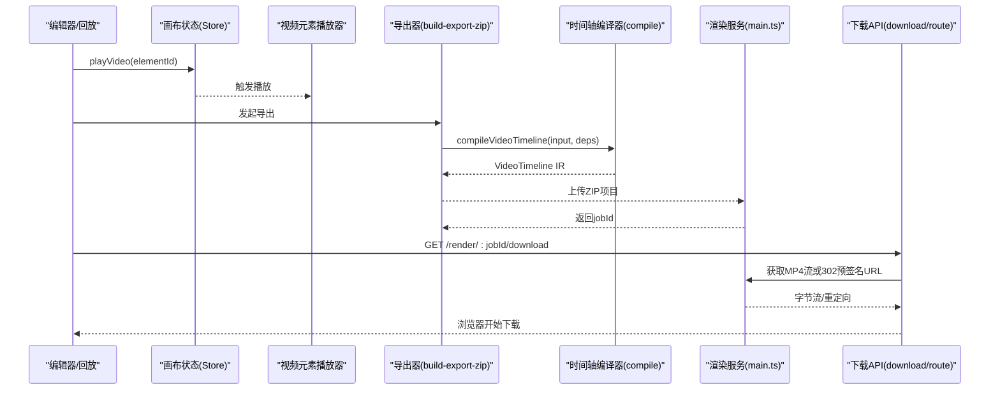
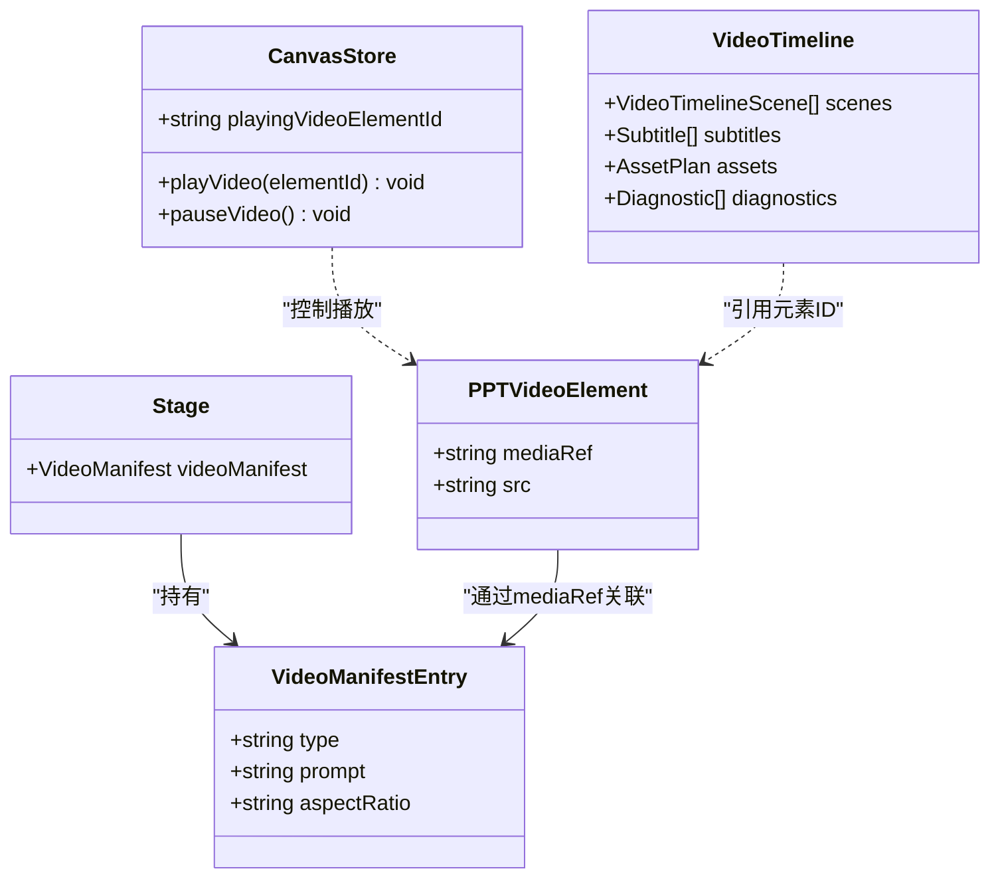
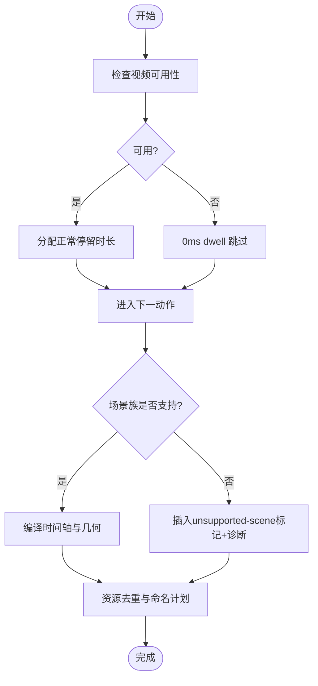

# 视频元素组件

<cite>
**本文引用的文件**   
- [compile.ts](file://lib/video-export/compile.ts)
- [build-export-zip.ts](file://lib/video-export-app/build-export-zip.ts)
- [download/route.ts](file://app/api/export-video/render/[jobId]/download/route.ts)
- [main.ts](file://render-service/src/main.ts)
- [video-manifest.ts](file://lib/media/video-manifest.ts)
- [video-providers.ts](file://lib/media/video-providers.ts)
- [canvas.ts](file://lib/store/canvas.ts)
- [use-canvas-operations.ts](file://lib/hooks/use-canvas-operations.ts)
- [scene-timeline.test.ts](file://tests/edit/scene-timeline.test.ts)
- [globals.css](file://app/globals.css)
</cite>

## 产品概述
本组件文档聚焦于 OpenMAIC 中的“视频元素”（VideoElement）在课件编辑与回放中的角色：它负责承载视频媒体、提供播放控制接口、参与时间轴编排，并贯穿从生成、导出到渲染下载的完整链路。该组件服务于教师与内容创作者，支持在交互式课件中嵌入视频片段，配合字幕、转场与多语言音轨等能力，提升课堂演示与远程教学体验。

## 核心业务流程
- 视频素材接入与清单构建
  - 通过视频清单工具从场景大纲中提取视频生成请求，建立元素 ID 到媒体元数据的映射，便于后续可用性探测与资源计划。
- 播放器集成与控制
  - 编辑器与回放层通过统一的播放/暂停接口驱动视频元素，状态集中管理，避免与其他视觉特效冲突。
- 时间轴编译与几何布局
  - 将 DSL 动作序列编译为时间轴 IR，解析视频片段占位、时长与字幕，计算元素几何位置与效果叠加。
- 资源去重与命名规划
  - 对视频与相关资产进行去重与命名计划，标注到各片段，确保导出产物可追踪与复用。
- 导出打包与渲染下载
  - 前端构建 ZIP（包含幻灯片快照、旁白与媒体），上传至渲染服务；服务端使用 Hyperframes 生产 MP4，并提供流式下载或预签名直链。

**图表来源** 
- [build-export-zip.ts:1-34](file://lib/video-export-app/build-export-zip.ts#L1-L34)
- [compile.ts:131-183](file://lib/video-export/compile.ts#L131-L183)
- [main.ts:1-28](file://render-service/src/main.ts#L1-L28)
- [download/route.ts:1-30](file://app/api/export-video/render/[jobId]/download/route.ts#L1-L30)

**章节来源**
- [build-export-zip.ts:1-34](file://lib/video-export-app/build-export-zip.ts#L1-L34)
- [compile.ts:131-183](file://lib/video-export/compile.ts#L131-L183)
- [main.ts:1-28](file://render-service/src/main.ts#L1-L28)
- [download/route.ts:1-30](file://app/api/export-video/render/[jobId]/download/route.ts#L1-L30)

## 功能模块清单
- 视频清单与引用解析
  - 职责：从场景大纲提取视频生成请求，维护元素到媒体元数据映射；识别由系统生成的视频引用。
  - 验收要点：能正确识别 gen_vid_* 引用；能在阶段对象中查找对应条目。
- 视频生成提供商适配
  - 职责：统一封装多家视频生成服务的能力、模型、分辨率、时长与比例；提供连通性测试与选项归一化。
  - 验收要点：未支持的参数自动回退到首个受支持值；未知提供商抛出明确错误。
- 播放器控制与状态
  - 职责：提供 playVideo/pauseVideo 等接口，统一管理当前播放元素 ID，避免与聚光灯/高亮/激光等效果互相干扰。
  - 验收要点：切换场景时不中断正在进行的播放生命周期；清除视觉效果时不误清播放状态。
- 时间轴编译与字幕
  - 职责：将 DSL 动作展开为时间轴片段，处理不可用视频的跳过策略，合并字幕与总时长。
  - 验收要点：不可用视频以 0ms dwell 跳过且不偏移后续动作；输出包含字幕与诊断信息。
- 几何布局与元素放置
  - 职责：根据时间轴与场景信息计算元素几何位置与效果叠加，缺失时降级处理。
  - 验收要点：几何计算失败不影响整体导出流程，保留占位与诊断。
- 资源计划与去重
  - 职责：对视频与媒体进行去重与命名计划，标注到片段，便于后续打包与渲染。
  - 验收要点：重复资源仅出现一次；片段上带有稳定的资源标识。
- 导出打包与渲染服务
  - 职责：前端构建 ZIP（含快照、旁白、媒体），上传至渲染服务；服务端基于 Hyperframes 生产 MP4。
  - 验收要点：支持多种分辨率与帧率；渲染任务状态可查询；下载支持流式或预签名直链。
- 下载与带宽优化
  - 职责：后端代理下载，优先走预签名直链减少代理负载；对大文件采用头部超时而非整体超时。
  - 验收要点：慢网络下不截断下载；302 直链透传成功。

**章节来源**
- [video-manifest.ts:1-40](file://lib/media/video-manifest.ts#L1-L40)
- [video-providers.ts:1-220](file://lib/media/video-providers.ts#L1-L220)
- [canvas.ts:156-189](file://lib/store/canvas.ts#L156-L189)
- [canvas.ts:399-467](file://lib/store/canvas.ts#L399-L467)
- [compile.ts:131-183](file://lib/video-export/compile.ts#L131-L183)
- [build-export-zip.ts:1-34](file://lib/video-export-app/build-export-zip.ts#L1-L34)
- [main.ts:1-28](file://render-service/src/main.ts#L1-L28)
- [download/route.ts:1-30](file://app/api/export-video/render/[jobId]/download/route.ts#L1-L30)

## 数据与状态
- 视频清单数据结构
  - 键：元素 ID 或生成引用（如 gen_vid_xxx）
  - 值：类型、提示词、宽高比等元数据
  - 用途：在导出前判定媒体存在性与可用性
- 播放器状态
  - playingVideoElementId：当前播放的视频元素 ID
  - 操作：playVideo(elementId)、pauseVideo()
  - 约束：清除所有视觉效果时不清除播放状态，避免打断播放生命周期
- 时间轴 IR
  - scenes：按场景分桶的片段集合，包含 startMs/durationMs/markers
  - subtitles：字幕轨道
  - assets.plan：资源去重与命名计划
  - diagnostics：各阶段的诊断信息
- 导出配置
  - 分辨率：720p/1080p/4k（16:9）
  - 帧率：24/30/60 fps
  - 播放速度、TTS 开关、白板初始打开状态

**图表来源** 
- [video-manifest.ts:1-40](file://lib/media/video-manifest.ts#L1-L40)
- [canvas.ts:156-189](file://lib/store/canvas.ts#L156-L189)
- [compile.ts:131-183](file://lib/video-export/compile.ts#L131-L183)

**章节来源**
- [video-manifest.ts:1-40](file://lib/media/video-manifest.ts#L1-L40)
- [canvas.ts:156-189](file://lib/store/canvas.ts#L156-L189)
- [canvas.ts:399-467](file://lib/store/canvas.ts#L399-L467)
- [compile.ts:131-183](file://lib/video-export/compile.ts#L131-L183)

## 关键约束与边界
- 视频格式与编码
  - 渲染服务基于 Hyperframes 与 FFmpeg 生产 MP4；前端导出 ZIP 包含媒体与快照，具体编解码细节由渲染服务决定。
- 流媒体与下载
  - 下载接口优先透传 302 预签名 URL 直连存储，避免代理瓶颈；头部获取设置独立超时，防止大文件被整体超时截断。
- 时间轴与可用性
  - 不可用视频以 0ms dwell 跳过，不阻塞后续动作；不支持的场景族（quiz/interactive/pbl）以标记与诊断占位，交由下游渲染器处理。
- 播放器与特效隔离
  - 播放状态由专门的生命周期管理，清除视觉效果不会中断播放；焦点与键盘快捷键在编辑器模式下有特定样式与行为。
- 提供商能力归一化
  - 时长、宽高比、分辨率等参数若不受支持则回退到首个可用值；未知提供商直接报错。
- 时间轴支持范围
  - 已注册画布表面（slide/quiz）与交互/PBL 类型均支持旁白时间轴；未知类型无时间轴。

**图表来源** 
- [compile.ts:131-183](file://lib/video-export/compile.ts#L131-L183)

**章节来源**
- [download/route.ts:1-30](file://app/api/export-video/render/[jobId]/download/route.ts#L1-L30)
- [compile.ts:131-183](file://lib/video-export/compile.ts#L131-L183)
- [video-providers.ts:162-197](file://lib/media/video-providers.ts#L162-L197)
- [scene-timeline.test.ts:1-16](file://tests/edit/scene-timeline.test.ts#L1-L16)
- [globals.css:162-227](file://app/globals.css#L162-L227)

## 扩展指南（自定义控件与处理工具）
- 自定义播放器控件
  - 通过调用 store 的 playVideo/pauseVideo 控制播放；结合 useCanvasOperations 获取当前活跃元素与视口信息，实现缩放、定位与焦点管理。
- 视频处理工具扩展
  - 在导出管线中注入新的 AssetSource/TimingProbe，扩展可用性探测与时长估算逻辑；保持纯函数 pass 设计，便于单元测试。
- 字幕与音轨
  - 时间轴编译阶段合并字幕轨道；如需多语言音轨，可在资源计划中增加音轨条目并在渲染服务侧选择音轨输出。
- CDN 与带宽控制
  - 利用渲染服务的预签名直链下载，减少代理带宽消耗；在客户端侧可按网络状况选择分辨率与帧率，降低首屏加载压力。

**章节来源**
- [use-canvas-operations.ts:43-69](file://lib/hooks/use-canvas-operations.ts#L43-L69)
- [compile.ts:131-183](file://lib/video-export/compile.ts#L131-L183)
- [build-export-zip.ts:1-34](file://lib/video-export-app/build-export-zip.ts#L1-L34)
- [download/route.ts:1-30](file://app/api/export-video/render/[jobId]/download/route.ts#L1-L30)